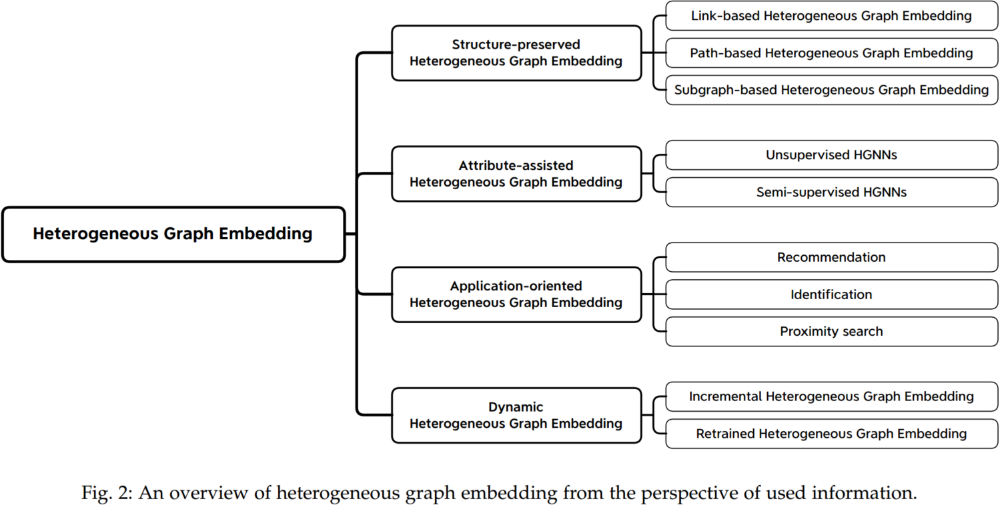
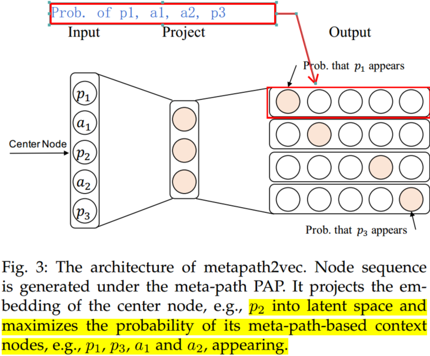
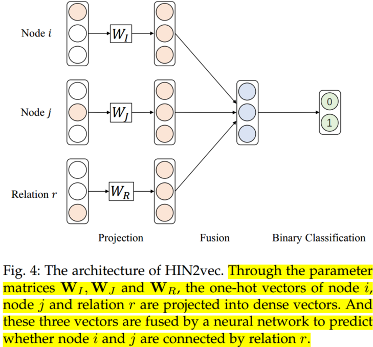
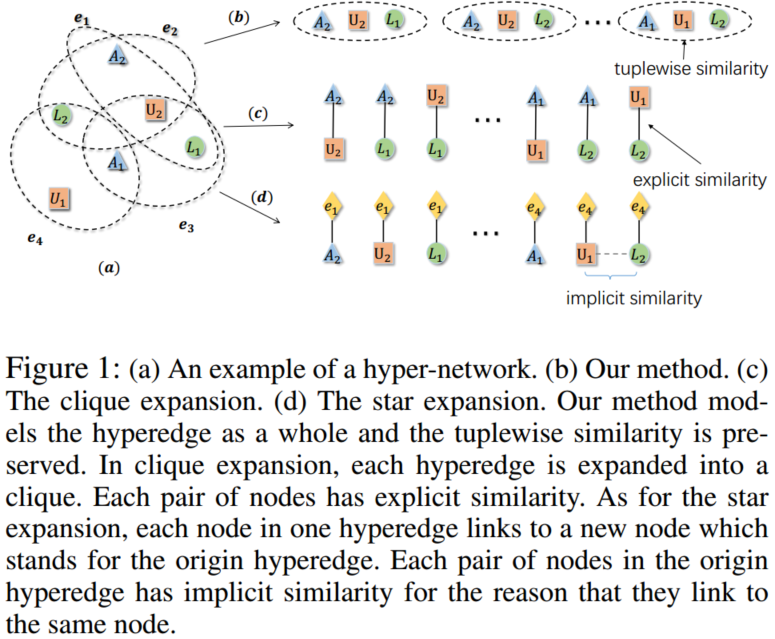
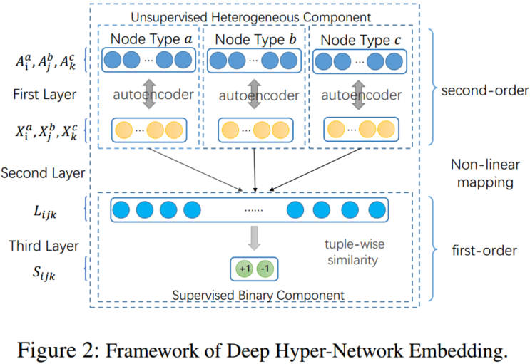
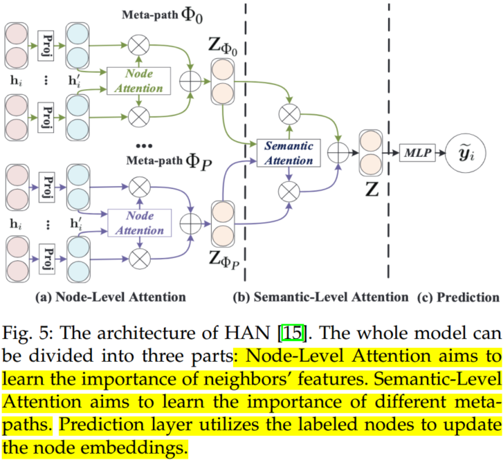
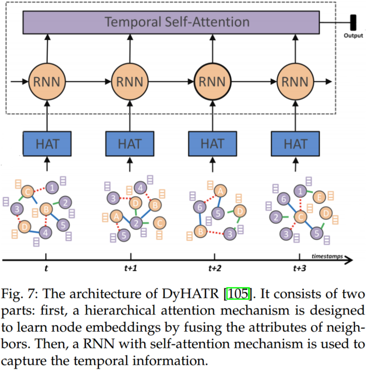
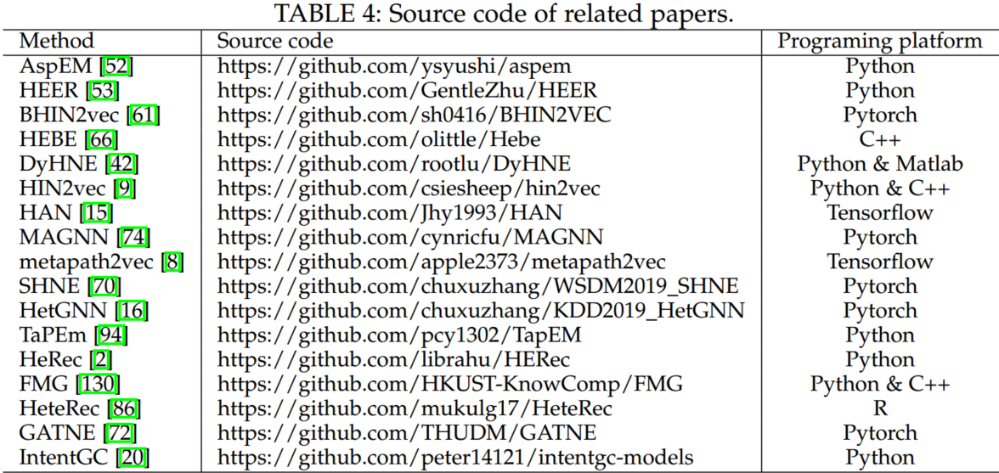
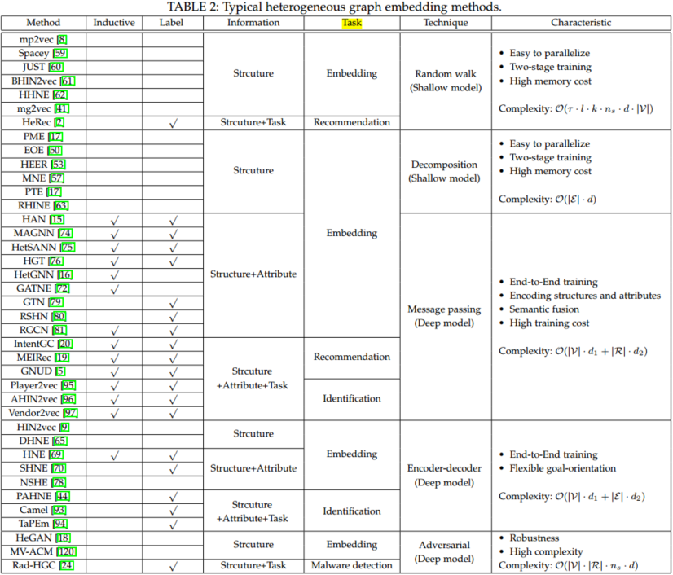

# A Survey on Heterogeneous Graph Embedding: Methods, Techniques, Applications and Sources

## 1. Brief introduction and overview for Heterogeneous Graph Embedding method

Since heterogeneous graphs (HGs) is capable of composing different types of entities or heterogeneous information, it has been widely applied in bibliographic networks, social networks, and recommendation systems. Due to the ubiquity of HG data, how to learn embeddings of HG is a key research problem in various graph analysis applications, e.g., node/graph classification, node clustering, link prediction. 

Heterogeneous graph embedding aims to learn a function $\Phi: \mathcal V \rightarrow \mathbb R^d$ that embeds the nodes $v\in \mathcal V$ in HG into a low-dimensional Euclidean space with $d \ll|\mathcal V|$.

Based on the user information in the heterogeneous graph, HG embedding methods can be categorized into four categories,

- **Structure-preserved heterogeneous graph embedding.** Focusing on capturing and preserving the heterogeneous structures and semantics, e.g., the meta-path and meta-graph.
- **Attributeassisted heterogeneous graph embedding.** Focusing more on the node and edge attributes. 
- **Dynamic heterogeneous graph embedding.** Different from static heterogeneous graph embedding, it focuses more on sequential modeling, which aims to capture the evolution of heterogeneous graphs.

## 2. Method Taxonomy

### 2.1 Structure-preserved HG embedding

The typical heterogeneous graph embedding methods include the link (edge), meta-path, and subgraph.

**(1) Link-based HG embedding**

Like TranX for knowledge graph embedding, [PME](https://dl.acm.org/doi/10.1145/3219819.3219986) treats each link type as a relation, and the nodes can be projected to different metric space, based on the relation-specific matrix. Thus, the distance function between nodes can be defined as follows:

$$
S_r(v_i,v_j)=w_{ij}||M_rh_i-M_rh_j||_2=\sqrt{(h_i-h_j)^TM_r^TM_r(h_i-h_j)}\tag{1}
$$

where $h_i$ and $h_j \in \mathbb R^{d\times 1}$ denote the node embeddings of node $i$ and node $j$, respectively. $M_r \in \mathbb R^{d\times d}$ is the projection matrix of relation $r$; and $w_{ij}$ represents the weight of link between node $i$ and node $j$; $M_r^TM_r\in \mathbb R^{d\times d}$ is the metric matrix of Mahalanobis distance.

Margin based triple loss function was applied for positive and negative samples:

$$
L=\sum_{r\in R}\sum_{(v-I,v_j)\in E_r}\sum_{(v_i,v_k)\notin E_r}[\xi +S_r(v_i,v_j)^2-S_r(v_i,v_k)^2]_+\tag{2}
$$

where $\xi$ denotes the margin, $E_r$ represents the positive links of relation $r$, and $[z]_+ = max(z, 0)$.

Besides, [EOE](https://dl.acm.org/doi/pdf/10.1145/3018661.3018723) and [HeGAN](https://dl.acm.org/doi/10.1145/3292500.3330970) uses below formulate to calculate the similarity,

$$
S_r(v_i,v_j)=\frac{1}{1+exp{-h_i^TM_rh_j}}\tag{3}
$$

Compared to distance and similarity calculation, [AspEM](https://arxiv.org/pdf/1803.01848.pdf) and [HEER](https://arxiv.org/pdf/1807.03490.pdf) aim to maximize the probability of existing links. The heterogeneous similarity function is defined as:

$$
S_r=\frac{exp(\mu_r^Tg_{ij})}{\sum_{\tilde i\in E_{\tilde ij}^r}exp(\mu_r^Tg_{\tilde ij})+\sum_{\tilde j\in E_{i\tilde j}}^rexp(\mu_r^Tg_{i\tilde j})}\tag{4}
$$

where $\mu_r\in \mathbb R^{d\times 1}$ is the embedding of relation $r$; $g_{ij}\in \mathbb R^{d\times 1}$ is the embedding of link between node $i$ and node $j$; $g_{ij}=h_i\odot h_j$ denotes the hadamard product; and $E_{\tilde ij}^r$ is the set of negative links, which indicates that there is no link between node $\tilde i$ and node $j$.  Maximizing Sr enlarges the closeness between the existing links and their corresponding types, thus capturing the heterogeneity of the graph.

Similar to TransE, [MELL](https://dl.acm.org/doi/fullHtml/10.1145/3184558.3191565) uses the equation ’head + relation = tail’ to learn the node embeddings for heterogeneous graph.

**(2)Path-based HG embedding**

Link-based methods can only capture the local structures of HG, i.e., the first-order relation. The higher-order relation contains more semantic information for HG embedding. Because the number of high-order relations is very large, in order to reduce complexity, meta-path based HG embedding methods were developed, which can be divided into two categories: random walk-based and hybrid relation-based. 

- Random walk-based methods usually use meta-path to guide random walk on a HG, so that the generated node sequence contains rich semantic information not only from first-order relations but also from high-order relations. [Metapath2vec](https://ericdongyx.github.io/papers/KDD17-dong-chawla-swami-metapath2vec.pdf) is a typical work. 

Guided by meta-path, Metapath2vec first generates heterogeneous node sequences via random walk. Then, like skip-gram, Metapath2vec predicts the context nodes $c_t$ probability distribution based on center node $v$.

$$
\arg\; \operatorname*{max}_{\theta} \sum_{v\in \mathcal V}\sum_{t\in \mathcal A}\sum_{c_t\in C_t(v)} logp(c_t|v;\theta)\\
p(c_t|v;\theta)=\frac{e^{h_{c_t}\cdot h_v}}{\sum_{\tilde v\in \mathcal V}e^{h_{\tilde v}\cdot h_v}}\tag{5}
$$

where $C_t(v)$ represents the context nodes of node $v$ with type $t$, $h_t, h_{C_t}$ represent the hiden vectors.  

Like skip-gram Metapath2vec introduces a negative sampling strategy to reduce the computation,

$$
log \sigma(h_{c_t}\cdot h_v)+\sum_{q=1}^Q\mathbb E_{\tilde v^q ~ P(\tilde v)}[log\sigma(-h_{\tilde v^q}\cdot h_v)]\tag{6}
$$

where $\sigma(\cdot)$ is the sigmoid function, and $P(\tilde v)$ is the distribution in which the negative node $\tilde v^q$ is sampled for $Q$ times. 

However, when choosing the negative samples, metapath2vec does not consider the types of nodes, i.e., different types of nodes are from the same distribution $P(\tilde v)$. It further designs metapath2vec++, which samples the negative nodes of the same type as the central node, i.e., $\tilde v_t^q ~ P(\tilde v_t)$.

- Hybrid relation-based methods use the combination of first-order relation and high-order relation (i.e., meta-path) to capture the heterogeneity of HG. HIN2vec is a typical work, which carries out multiple relation prediction tasks jointly to learn the embeddings of nodes and meta-paths.  

The objective of [HIN2vec](https://dl.acm.org/doi/10.1145/3132847.3132953) is to predict whether two nodes are connected by a meta-path. As illustrated in Fig. 4, given two nodes $i$ and $j$, HIN2vec uses the following function to compute their similarity under the hybrid relation $r$:

$$
S_r(v_i,v_j)=\sigma(\sum W_I \overrightarrow i \odot W_J\overrightarrow j\odot f_{01}(W_R\overrightarrow r))\tag{7} 
$$

where $\overrightarrow i, \overrightarrow j$, and $\overrightarrow r\in \mathbb R^{N\times 1}$ denote the one-hot vectors of nodes and relation, respectively; $W_I, W_J$ and $W_R\in \mathbb E^{d\times N}$ are the mapping matrices; and $f_{01}$ is a regularization function, which limits the embedding values between 0 and 1. The loss function is a binary cross-entropy loss:

$$
E_{ij}^r logS_r(v_i,v_j)+[1-E_{ij}^r]log[1-S_r(v_i,v_j)]\tag{8}
$$

where $E_{ij}^r$ denotes the set of positive links. In the relation set $R$, it contains not only the first-order structures (e.g., A-P relation) but also the high-order structures (e.g., A-P-A relation). Therefore, the node embeddings can capture different semantics.

Compared with random walk-based methods, hybrid relation-based methods can simultaneously integrate multiple meta-paths into heterogeneous graph embedding flexibly.

**(3) Subgraph-based HG embedding**

Inspired by metapath2vec, metagraph2vec uses meta graph-guided random walk to generate heterogeneous node sequence, then skip-gram was applied to learn node embeddings. 

[DHNE](https://arxiv.org/pdf/1711.10146.pdf) is a typical hyperedge-based graph embedding method. In this paper, the author defines a hyperedge with three nodes $a, b$, and $c$, and considering the nodes in the hyperedge are indecomposable. Thus, a tuplewise similarity was designed to capture the structure features. 

The first layer of DHNE is an autoencoder, which is used to learn latent embeddings and preserve the second-order structures of the graph. The second layer is a fully-connected layer with embedding concatenated:

$$
L_{ijk}=\sigma(W_a^{(2)}h_i\oplus W_b^{(2)}h_j \oplus W_c^{(2)}h_k)\tag{9}
$$

where $L_{ijk}$ denotes the embedding of the hyperedge (nodes $i,j,k$); $h_i, h_j$ and $h_k \in \mathbb R^{d\times 1}$ are the embeddings of node $i, j$ and $k$ learn by the autoencoder. $W_a^{(2)}, W_b^{(2)}$ and $W_c^{(2)} \in \mathbb R^{d'\times d}$ are the transformation matrices for different node types. Finally, the third layer is used to calculate the indecomposability of the hyperedge,

$$
S_{ijk}=\sigma(W^{(3)}*L_{ijk}+b^{(3)})\tag{10}
$$

where $S_{ijk}$ denote the indecomposability of the hyperedge, $W^{(3)}\in \mathcal R^{1\times 3d'}$ and $b^{(3)}\in \mathcal R^{1\times 1}$ are the weight matrix and bias, respectively. A higher value of $S_{ijk}$ means these nodes are from the existing hyperedges, otherwise it should be small.

Since DHNE considers both first-order proximity and second-order proximity, the loss function joint tuplewise similarity (first-order proximity) and neighborhood structure similarity (second-order proximity) as the objective function,

$$
\begin{cases}
\mathcal L=L_1+\alpha \mathcal L_2\\
\mathcal L_1=-(R_{ijk}logS_{ijk}+(1-R_{ijk})log(1-S_{ijk}))\\
\mathcal L_2=\sum_t||sign(A_i^t)\odot(A_i^t-\hat A_i^t)||_F^2\\
X_i=\sigma(W^{(1)}*A_i+b^{(1)})\\
\hat A_i=\sigma(\hat W^{(1)}*X_i+\hat b^{(1)})\\
\end{cases}\tag{11}
$$

$\mathcal L_1$ is cross-entropy loss, $R_{ijk}$ is defined as 1 if there is a hyperedge between $i,j,k$ and 0 otherwise. $\mathcal L_2$ is a reconstruction error for neighborhood structure, which can be represented by autoencoder model. $X_i, \hat A_i$ are encoded vector and decode vector respectively. $t$ is the index for node types, $A$ is the adjacency matrix.

Compared with the structures of link and meta-path, subgraph (with two representative forms of meta-graph and hyperedge) usually contains much higher order structural and semantic information. However, one obstacle of subgraph-based heterogeneous graph embedding methods is the high complexity of the subgraph. How to balance the effectiveness and efficiency is required for practical subgraph-based heterogeneous graph embedding methods, which is worthy of further exploration.

### 2.2 Attribute-assisted HG embedding

Attribute-assisted heterogeneous graph embedding methods aim to encode the complex structures and multiple attributes to learn node embeddings. 

**(1) Unsupervised HGNNs**

[HetGNN](https://dl.acm.org/doi/10.1145/3292500.3330961) is the representative work of unsupervised HGNNs. It consists of three parts: content aggregation, neighbor aggregation, and type aggregation. Content aggregation is designed to learn fused embeddings from different node contents, such as images, text, or attributes:

$$
f_1(v)=\frac{\sum_{i\in C_v}[\overrightarrow{LSTM}\{\mathcal {FC}(h_i)\}\oplus\overleftarrow{LSTM}\{\mathcal{FC}(h_i)\}]}{|C_v|}\tag{12}
$$

where $C_v$ is the type of node $v$'s attributes. $h_i$ is the $i-$th attributes of node $v$. A bi-directional Long Short-Term Memory (Bi-LSTM) is used to fuse the embeddings learned by multiple attribute encoder $\mathcal{FC}$.  Neighbor aggregation aims to aggregate the nodes with the same type by using a Bi-LSTM to capture the position information:

$$
f_2^t(v)=\frac{\sum_{v'\in N_t(v)}[\overrightarrow{LSTM}\{f_1(v')\}\oplus\overleftarrow{LSTM}\{f_1(v')\}]}{|N_t(v)|}\tag{13}
$$

where $N_t(v)$ is the first-order neighbors of node $v$ with type $t$. Type aggregation uses an attention mechanism to mix the embeddings of different types and produces the final node embeddings.

$$
h_v=\sum_{f_i\in \mathcal F(v)}\alpha^{v,i}f_i\\
\alpha^{v,i}=\frac{exp\{LeakyReLU(u^T{f_i\oplus f_1(v)})\}}{\sum_{f_j\in \mathcal F(v)}exp\{LeakyReLU(u^T{f_j\oplus f_1(v)})\}}\tag{14}
$$

where $\mathcal F(v)=\{f_1(v)\cup (f_2^t(v),t\in O_V)\}, h_v$ is the final embedding of node $v$. Finally, a heterogeneous skip-gram loss is used as the unsupervised graph context loss to update the node embeddings.

**(2) Semi-supervised HGNNs**

[Heterogeneous graph attention network (HAN)](https://arxiv.org/pdf/1903.07293.pdf) uses a hierarchical attention mechanism to capture both mode and semantic importance.

It consists of three parts: node-level attention, semanticlevel attention and prediction. Node-level attention aims to utilize self-attention mechanism to learn the importances of neighbors in a certain meta-path:

$$
\alpha_{ij}^m=\frac{exp(\sigma(a_m^T\cdot[h_i'||h_j']))}{\sum_{k\in \mathcal N_i^m}exp(\sigma(a_m^T\cdot [h_i'||h_k']))}\tag{15}
$$

where $\mathcal N_i^m$ is the neighors of node $i$ in meta-path $m, \alpha_{ij}^m$ is the weight of node $j$ to node $i$ under meta-path $m$. $||$ is concat operation. The node-level aggregation is defined as:

$$
h_i^m=\sigma (\sum_{j\in \mathcal N_{ij}^m}\alpha_{ij}^m\cdot h_j)\tag{16}
$$

where $h_m^i$ denotes the learned embedding of node $i$ based on meta-path $m$.

Because different meta-paths capture different semantic information of HG, a semantic level attention mechanism is designed to calculate the importance of meta-paths. 

$$
w_{m_i}=\frac{1}{|\mathcal V|}\sum_{i\in \mathcal V}q^T\cdot tanh(W\cdot h_i^m+b)\tag{17}
$$

where $W \in \mathbb R^{d'\times d}$ and $b \in \mathbb R^{d'\times 1}$ denote the weight matrix and bias of the MLP, respectively. $q \in \mathbb R^{d'\times 1}$ is the semantic-level attention vector. Hence, the semantic-level aggregation is defined as,

$$
H=\sum_{i=1}^P\beta_{m_i}\cdot H_{m_i}\\
\beta_{m_i}=\frac{exp(w_{m_i})}{\sum exp(w_{m_i})} \tag{18}
$$

In order to prevent the node embeddings from being too large, HAN uses the softmax function to normalize $w_{m_i}$. $H\in \mathbb R^{N\times d}$ denotes the final node embeddings, which can be used in the downstream tasks, such as node clustering and link prediction.

There are two ways to solve the heterogeneity of attributes: one is to use different encoders or type-specific transformation matrices to map the different attributes into the same space. Another is to treat meta-path as a special edge to connect the nodes with the same type. Compared with shallow models, HGNNs has an obvious advantage in that they have the ability of inductive learning, i.e., learning embeddings for the out-of-sample nodes. Besides, HGNNs need smaller memory space because they only need to store model parameters. However, they still suffer from the huge time costing in inferencing and retraining.

### 2.3 Dynamic HG embedding

The dynamic heterogeneous graph embedding methods can be divided into two categories: incremental update and retrained update methods. The former learns the embedding of a new node in the next timestamp by utilizing existing node embeddings, while the latter will retrain the models in each timestamp. 

**(1) Incremental HG embedding**

[DyHNE](https://ieeexplore.ieee.org/document/9091208) is an incremental update method based on the theory of matrix perturbation, which learns node embeddings while considering both the heterogeneity and evolution of HG. To ensure effectiveness, DyHNE preserves the meta-path based first- and second-order proximities. The first-order proximity requires two nodes connected by meta-path $m$ to have similar embeddings. And the second-order proximity indicates that the node embedding should be close to the weighted sum of its neighbor embeddings. Besides, DyHNE uses the perturbation of meta-path augmented adjacency matrices to naturally capture changes of the graph, which is an effective and efficient method.

**(2) Retrained HG embedding**

DyHATR aims to capture the temporal information through the changes of node embeddings in different timestamps. First, the node- and edge-level attention was design to learn the node embeddings under different timestamps. 

$$
\alpha_{i,j}^{rt}=\frac{exp(\sigma(a_r^T\cdot[M_r\cdot h_i|| M_r\cdot h_j]))}{\sum_{k\in \mathcal N_i^{rt}}exp(\sigma(a_r^T\cdot[M_r\cdot h_i|| M_r\cdot h_j]))}\\
\beta_{i}^{rt}=\frac{exp(q^T\cdot \sigma(W\cdot h_i^{rt}+b))}{\sum_{r\in R}exp(q^T\cdot \sigma(W\cdot h_i^{rt}+b))}\tag{19}
$$

$\alpha_{i,j}^{rt}, \beta_{i}^{rt}$ are node-level attention and edge-level attention. $\mathcal N_i^{rt}$ represents the neighbors of node $i$ in edge type $r$ and timestamp $t$, $a_r$ is the attention vector in node-level attention, $q^T$ is the attention vector in edge-level attention. Furthermore, the node embeddings are fed into a RNN in the order of timestamps to capture the temporal information hidden in the changes of node embeddings.  

### 2.4 Technique summary

Overall, the above methods can be generally divided into two categories: shallow model and deep model.

**(1) Shallow model**

- **Random walk-based:** Random walk is a classical method for graph representation. For instance, metapath2vec applies meta-path-guided random walk to capture the semantic information of nodes.
- **Decomposition-based:** Decomposition-based techniques aim to decompose HG into several sub-graphs and preserve the proximity of nodes in each sub-graph. PME decomposes the heterogeneous graph into some bipartite graphs according to the types of links and projects each bipartite graph into a relation-specific semantic space. Then, based on margin-based triple loss function to train the model.

**(2) Deep model**

- **Message passing-based:** The idea of the message passing-based method is to consider the message propagation in graphs, based on GNN to aggregate neighbors' information and capture node embedding. HetGNN uses bi-LSTM to aggregate the embedding of neighbors so as to learn the deep interactions among heterogeneous nodes.
- **Encoder-decoder-based:** Encoder-decoder-based techniques aim to design neural networks to learn node embedding. DHNE defines hyperedge, consist of three nodes, as the basic unit of the graph, then applies autoencoder to learn latent embeddings of nodes. Designing a non-linear tuplewise similarity to calculate the indecomposability of the hyperedge. And applying cross-entropy function and adjacency matrix reconstructed function to measure first-order proximity and second-order proximity respectively. 
- **Adversarial-based:** In a homogeneous graph, the adversarial-based techniques only consider the structural information. [HeGAN](https://dl.acm.org/doi/10.1145/3292500.3330970) is the first to use GAN in heterogeneous graph embedding. It incorporates the multiple relations into the generator and discriminator so that the heterogeneity of a given graph can be considered. 

Above all, the main methods can be summarized below: 

| First category | Second category | Main idea | Complexity | Typical model |
| --- | --- | --- | --- | --- |
| Shallow model| Random walk-based | Based on a random walk to capture semantic information | Determined by random walk and skip-gram, both of which are linear with the number of nodes | Metapath2vec applies meta-path-guided random walk to capture the semantic information of nodes |
|  | Decomposition-based | Decompose HG into several sub-graphs and preserve the proximity of nodes in each sub-graph | Linear with the number of edges, which is higher than random walk | PME decomposes the heterogeneous graph into some bipartite graphs according to the types of links and projects each bipartite graph into a relation-specific semantic space. Then, based on margin-based triple loss function to train model |
| Deep model | Message passing-based | Consider the message propagation in graphs, based on GNN to aggregate neighbors' information and capture node embedding | Related to the number of nodes and node types | HetGNN uses bi-LSTM to aggregate the embedding of neighbors so as to learn the deep interactions among heterogeneous nodes |
|  | Encoder-decoder-based | Design neural networks to learn node embedding | Linear with the number of edges | DHNE defines hyperedge, consist of three nodes, as the basic unit of the graph, then apply autoencoder to learn latent embeddings of nodes. Designing a non-linear tuplewise similarity to calculate the indecomposability of the hyperedge. And applying cross-entropy function and adjacency matrix reconstructed function to measure first-order proximity and second-order proximity respectively |
|  | Adversarial-based | Utilize the game between generator and discriminator to learn robust node embedding | Related to the number of nodes and negative samples | HeGAN is the first to use GAN in heterogeneous graph embedding. It incorporates the multiple relations into the generator and discriminator so that the heterogeneity of a given graph can be considered |

## 3. Benchmarks and open-source tools

### 3.1 Benchmark datasets

There are some popular real world HG datasets, which can be divided into three categories: academic networks, business networks and film networks, such as [DBLP](http://dblp.uni-trier.de), [Aminer](https://www.aminer.cn), [Yelp](http://www.yelp.com/dataset challenge/), [Amazon](http://jmcauley.ucsd.edu/data/amazon), [IMDB](https://grouplens.org/datasets/movielens/100k/), [Douban](http://movie.douban.com/). The detailed statistical information was summarized in below Table.  

### 3.2 Open-source code

Some related papers' source code was listed in Table 4.

Furthermore, there are some commonly used website about graph embedding,

- **[Stanford Network Analysis Project (SNAP)](http://snap.stanford.edu/).** It is a network analysis and graph mining library, which contains different types of networks and multiple network analysis tools.
- **[Microsoft TensorFlow2 GNN Library)](https://github.com/microsoft/tf2-gnn).** Implementation and example training scripts of various flavors of graph neural network in TensorFlow 2.0, contributed by Microsoft team. 
- **[Papers with Code](https://paperswithcode.com/area/graphs).** Papers with Code is an open community to create a free and open resource with machine learning papers, code, and evaluation tables. The core team of Papers with Code is based in Facebook AI Research.
- **[HG Resources](https://github.com/BUPT-GAMMA/OpenHINE).** Created by [Shichuan group](http://shichuan.org/), GAMMA Lab, Beijing University of Posts and Telecommunications, this open-source toolkit provides implementations of many popular models for Heterogeneous Information Network Embedding, including DHNE, HAN, HeGAN, HERec, and so on.    

### 3.3 Available tools

Some popular toolkits and platforms for heterogeneous graph research were listed below.

- **[Deep Graph Library (DGL)](https://www.dgl.ai/).** Deep Graph Library (DGL) is a Python package built for easy implementation of graph neural network model family.
- **[Pytorch Geometric](https://pytorch-geometric.readthedocs.io/en/latest/).** It is a geometric deep learning extension library for PyTorch. Specifically, it focuses on the methods for deep learning on graphs and other irregular structures. 

## 4. Challenges and future directions

- **Preserving HG structures.** To exploit graph structure, the most typical method is meta-path, while it heavily relies on domain knowledge and handwork. So how to learn graph structure automatically and effectively, is still very challenging.
- **Capturing HG Properties.** Currently, the nodes and edges properties have not been fully considered, which may provide additional information for graph learning. Dynamic heterogeneous graph embedding is still facing big challenges.
- **Making HG embedding reliable.** Considering that most methods are black boxes, making HG embedding fair, robust, and explainable is important future work. 

## 5. Conclusion

The typical methods for HG embedding can be summarized below,

- Most message passing-based methods have the inductive capability because they can update the node embeddings by aggregating neighborhood information. But they need additional labels to guide the training process.
- Most deep learning-based methods are proposed for HG with attributes or a specific application, while the shallow model-based methods are mainly designed for the use of structures.
- The emerging HGNNs can naturally integrate graph structures and attributes, so it is more suitable for the complex scenes and content.
- Shallow models are easy to parallel. But they are two-stage training, i.e., the embeddings are not relevant to the downstream tasks, and the memory cost is heavy. On the contrary, deep models are end-to-end training and require less memory space. 
- Message passing-based techniques are good at encoding structures and attributes simultaneously and integrating different semantic information. 
- Compared with message passing-based techniques, encoder-decoder-based techniques are weak in fusing information due to the lack of messaging mechanism. But they are more flexible to introduce different objective functions through different decoders.
- Adversarial-based methods prefer to utilize the negative samples to enhance the robustness of the embeddings. But the choice of negative samples has a huge influence on the performance, thus leading to higher variances.
- The complexity of the random walk technique consists of two parts: random walk and skip-gram, both of which are linear with the number of nodes. 
- Decomposition technique needs to divide HGs into sub-graphs according to the type of edges, so the complexity is linear with the number of edges, which is higher than a random walk. 
- Message passing technique mainly uses node-level and semantic-level attention to learn node embeddings, so its complexity is related to the number of nodes and node types.
- As for the encoder-decoder technique, the complexity of the encoder is related to the number of nodes, while the decoder is usually used to preserve the network structures, so it is linear with the number of edges. 
- Adversarial technique needs to generate the negative samples for each node, so the complexity is related to the number of nodes and negative samples.

## Appendix

