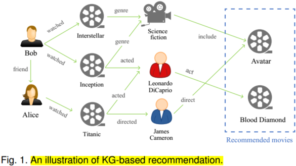
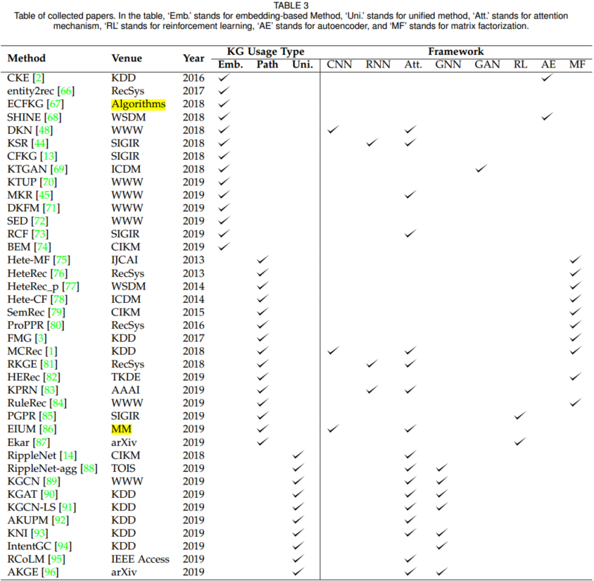

# A Survey on Knowledge Graph-Based Recommendation System

## 1. Brief introduction

Below is a typical example to illustrate the KG-based recommendation

The movie "Avatar" and "Blood Diamond" are recommended to Bob. This KG contains users, movies, actors, directors, and genres as entities, while interaction, belonging, acting, directing, and friendship are relations between entities. With the KG, movies and users are connected with different latent relations, which helps to improve the precision of recommendation. In addition,  reasons for recommending these two movies to Bob can be known by the relation sequences in the user-item graph. For instance, one reason for recommending "Avatar" is that "Avatar" is the same genre as "Interstellar", which was watched by Bob before. 

Based on the knowledge graph to recommend, the precision and explainability can be improved obviously. 

## 2. Methods of recommendation systems with knowledge graph

### 2.1 Embedding-based methods

Knowledge graph embedding (KGE) algorithms can be divided into two classes: translation distance models, such as TransE, TransH, TransR, TransD, etc., and semantic matching models, such as DistMult.   

#### 2.1.1 Translation distance models 

For translation distance models, the general idea can be illustrated as follows. The latent vector $\bf v_j$ of each item $v_j$ is obtained by aggregating information from multiple sources, such as the KG, the user-item interaction matrix, item's content, and the item's attributes. The latent vector $\bf u_i$ of each user $u_i$ can either be extracted from the user-item interaction matrix or the combination of interacted items' embedding. Then, the probability of $u_i$ selecting $v_j$ can be calculated with

$$
\hat y_{i,j}=f(\bf u_i, \bf v_j)\tag{1}
$$

where $f(\cdot)$ refers to a function to map the embedding of the user and item into a preference score, which can be the inner product, DNN, etc. In the recommendation stage, results will be generated in descending order of the preference score $\hat y_{i,j}$.

[CKE](https://www.kdd.org/kdd2016/papers/files/adf0066-zhangA.pdf) fed the item's structural knowledge (item's attributes represented with knowledge graph) and content (textual and visual) knowledge into a knowledge base embedding module. The latent vector of the item's structural knowledge $\bf x_j$ is encoded with the TransR algorithm, while the textual feature $\bf z_{t,j}$ and the visual feature $\bf z_{v,j}$ are extracted with the autoencoder architecture. Then these representations are aggregted along with the offset vector $\bf \eta_j$ extracted from the useer-item interaction matrix. The final representation of each item $\bf v_j$ can be written as

$$
\bf v_j=\bf \eta_j+\bf x_j+\bf z_{t,j}+\bf z_{v,j}\tag{2}
$$

After obtaining the latent vector $\bf u_i$ of the user $u_i$, the preference score $\hat y_{i,j}$ is obtained via the inner product $u_i^Tv_j$. Finally, in the prediction stage, items are recommended to $u_i$ by the following ranking criteria:

$$
v_{j_1}>v_{j_2}>...>v_{j_n}\rightarrow \bf u_i^Tv_{j_1}>u_i^Tv_{j_2}>...>u_i^Tv_{j_n}\tag{3}
$$

For news recommendation, [DKN](https://arxiv.org/pdf/1801.08284.pdf) models the news by combining the textual embedding of sentences learned with KimCNN and the knowledge-level embedding of entities in news content via TransD. With the incorporation of a KG for entities, high-level semantic relations of news can be depicted in the final embedding $\bf v_j$ of news $v_j$. In order to capture the user’s dynamic interest in news, the representation of $u_i$ is learned by aggregating the embedding of historical clicked news $\{\bf{v_1, v_2, ..., v_{N_i}}\}$ with an attention mechanism. The attention weight for each news $v_k(k=1,2,...,N_i)$ in the clicked news set is calculated via

$$
s_{v_k,v_j}=\frac{exp(g(v_k,v_j))}{\sum_{k=1}^{N_i}exp(g(v_k,v_j))}\tag{4}
$$

where $g(\cdot)$ is a DNN layer, $v_j$ is the candidate news. Then the final user embedding $\bf u_i$ is calculated via the weighted sum of clicked news embeddings:

$$
\bf u_i = \sum_{k=1}^{N_i}s_{v_k,v_j}\bf {v_k}\tag{5}
$$

Finally, the user's preference for candidate news $v_j$ can be calculated with Equation 1, where $f(\cdot)$ is a DNN layer.

#### 2.1.2 User-item graph

The other type of embedding-based method directly builds a user-item graph, where users, items, and their related attributes function as nodes. And both attribute-level relations (brand, category, etc), user-related relations (co-buy, co-view, etc.) serve as edges. After obtaining the embeddings of entities in the graph, the user's preference can be calculated with Equation 1, or by further considering the relation embedding in the graph via

$$
\hat y_{i,j}=f(\bf {u_i,v_j,r})\tag{6}
$$

where $f(\cdot)$ maps the user representation $\bf u_i$, the item representation $\bf v_j$, as well as the relation embedding $\bf r$ into a scalar.

[CFKG](https://arxiv.org/pdf/1803.06540.pdf) constructs a user-item KG. To learn the embedding of entities and relations in the graph, the model defines a metric function $d(\cdot)$, $\mathcal l_2$, to measure the distance between two entities,

$$
d(\bf u_i+\bf r_{buy}, \bf v_j)\tag{7}
$$

where $\bf r_{buy}$ is the learned embedding for the relation type 'buy'. A smaller distance between $u_i$ and $v_j$ measured by the 'buy' relation refers to a higher preference score $\hat y_{i,j}$.

#### 2.1.3 GAN-based model

A GAN-based model, [KTGAN](https://sci-hub.mksa.top/10.1109/ICDM.2018.00187), was proposed for movie recommendation. In the first phase, KTGAN learns the knowledge embedding $\bf v_j^k$ for movie $v_j$ by incorporating the Metapath2Vec model on the movie's KG, and the tag embedding $\bf v_j^t$ with the Word2Vec model on movie's attributes. The initial latent vector of movie $v_j$ is represented as $\bf v_j^{initial}=\bf v_j^k\oplus \bf v_j^t$. Similarly, the initial latent vector of user $u_i$ is represented as $\bf u_i^{initial}=\bf u_i^k \oplus \bf u_i^t$, where $\bf u_i^k$ is the average of knowledge embeddings of $u_i$'s favored movies, and $\bf u_i^t$ is $u_i$'s tag embedding. Then, a generator $G$ and a discriminator $D$ are proposed to refine initial representations of users and items. The generator $G$ tries to generate relevant movies for user $u_i$ according the score function $p_{\theta}(v_j|u_i,r)$, 

$$
p_{\theta}(v_j|u,r)=\frac{exp(s_{\theta}(u,v_j))}{\sum_v exp(s_{\theta}(u,v))}\\
s(u,v)=\bf{u} \cdot \bf{v}+ b_v\tag{8}
$$

where $r$ denotes the relevance between $u_i$ and $v_j$. $b_v$ m is the bias for $v$. $s_{\theta}(u,v_j)$ quantifies the chance of $v_j$ being generated to confuse the discriminator w.r.t. $u$.

During the training process, $G$ aims to let $p_{\theta}(v_j|u_i,r)$ approximate $u_i$'s true favorite movie distribution $p_{true}(v_j|u_i,r)$, so that $G$ can select relevant user-movie pairs. The discriminator $D$ is a binary classifier to distinguish relevant user-movie pairs and irrelevant pairs according to the learned score function $f_{\phi}(u_i,v_j)$. The objective function of the GAN module is written as,

$$
\mathcal L = min_{\theta} \; max_{\phi} \sum_{i=1}^M \{\mathbb E_{v_j\backsim p_{ture}}(v_j|u_i,r)[log P(v_j|u_i)]+\mathbb E_{v_j\backsim p_{\theta}}[log(1-P(v_j|u_i))]\}\tag{9}
$$

where $P(v_j|u_i)=\frac{1}{1+exp(-f_{\phi}(u_i,v_j))}$ stands for the probability of movie $v_j$ being preferred by user $u_i$. After the adversarial training, optimal representations of $u_i$ and $v_j$ are learned and movies can be ranked with $G$'s score function $p_{\theta}(v_j|u_i,r)$.

#### 2.1.4 Multi-task learning

Jointly learning the recommendation task with the guidance of the KG-related task. These two tasks are connected with the following objective function,

$$
\mathcal L=\mathcal L_{rec} +\lambda \mathcal L_{KG}\tag{10}
$$

where $\mathcal L_{rec}$ is the loss function for the recommendation, $L_{KG}$ is the loss function for the KG-related task, and $\lambda$ is the hyperparameter to balance the two tasks.

[KTUP](https://arxiv.org/pdf/1902.06236.pdf) jointly learn the task of recommendation and knowledge graph completion. In the recommendation module, the loss function is defined as,

$$
\mathcal L_{rec}=\sum_{(u,v,v')\in R} -log\sigma [f(\bf{u,v',p'})-f(\bf{u,v,p})]\tag{11}
$$

where $(u,v)$ is the observed user-itme pair in the user-item interaction matrix ($R_{uv}=1$); $(u,v')$ denotes the unobserved user-item pair ($R_{uv'}=0$); $\bf p$ denotes the latent vector of user's preference for the given item; $f(\cdot)$ is the proposed translation-based model, TUP, to model the correctness of such a user-item pair; and $\sigma$ is the sigmoid function.

For the KG completion module, a hinge loss is adopted,

$$
\mathcal L_{KG}=\sum_{(e_h,r,e_t)\in \mathcal G}\sum_{(e_h',r',e_t')\in \mathcal G^-}[g(\bf{e_h,r,e_t})+\gamma -g(e_h',r',e_t')]_+\tag{12}
$$

where $\mathcal G^-$ is constructed by replacing $e_h$ or $e_t$ in the valid tripled $(e_h,r,e_t)\in \mathcal G$; $g(\cdot)$ is the TansH model, and a lower $g(\bf{e_h,r,e_t})$ value infers a higher correctness of such a triplet; and $\gamma$ is the margin between correct triplets and incorrect triplets. 

### 2.2 Path-based Methods

Path-based methods build a user-item graph and leverage the connectivity patterns of the entity in the graph for the recommendation. According to the structure of the graph, we could measure the connectivity similarity between entities and recommendations.

[PathSim](http://www.vldb.org/pvldb/vol4/p992-sun.pdf) is commonly used for connectivity similarity,

$$
s_{x,y}=\frac{2\times |\{p_{x\rightarrow y}:p_{x\rightarrow y}\in \mathcal P\}|}{|\{p_{x\rightarrow x}:p_{x\rightarrow x}\in \mathcal P\}|+|\{p_{y\rightarrow y:p_{y\rightarrow y}\in \mathcal P }\}|'}\tag{13}
$$

where $p_{m\rightarrow n}$ is a path between the entity $m$ and $n$, $\mathcal P$ is a meta path defined on the graph.

Based on the PathSim, the connectivity can be calculated, then the preference of user entity $u_i$ to the item entity $v_j$ can be predicted.

#### 2.2.1 Matrix factorization based

To merge more semantic information of graph, [HeteRec](http://hanj.cs.illinois.edu/pdf/recsys13_xyu.pdf) first refines the user-item interaction matrix $R$ as $\tilde R^{(l)}=RS^{(l)}$, where $S^{(l)}$ is the item-item similar matrices, calculated by PathSim, and $l$ is meta path. Then, the latent vectors $U, V$ of users and items can be captured by non-negative matrix factorization,

$$
(\hat U^{(l)}, \hat V^{(l)})=argmin_{U,V} ||\tilde R^{(l)}-U^TV||_F^2\qquad s.t.\; U\geq 0, V\geq 0\tag{14}
$$

Thus, the score can be measured by,

$$
\hat y_{i,j}=\sum_{l=1}^L\theta_l\cdot \bf \hat{u_i}^{(l)T} \hat{v_j}^{(l)}\tag{15}
$$

where $\theta_l$ is the weight for the user-item latent vector pair in the $l$-th path.

Considering the importance of different meta-paths should vary for different users, [HeteRec-p](http://hanj.cs.illinois.edu/pdf/wsdm14_xyu.pdf) first clusters users based on their past behaviors into $c$ groups and generates personalized recommendation via k-means algorithm,

$$
\hat y_{i,j}=\sum_{k=1}^c sim(C_k,u_i)\sum_{l=1}^L\theta_l^k\cdot \bf\hat \bf u_i^{(l)T}\hat \bf v_j^{l}\tag{16}
$$

where $sim(\bf{C_k,u_i)}$ denotes the cosine similarity between user $u_i$ and the target user group $C_k$, and $\theta_l^k$ denotes the importance of meta-path $l$ for the user group $k$.

#### 2.2.2 Path embedding based

[MCRec](https://dl.acm.org/doi/pdf/10.1145/3219819.3219965) first apply the look-up layer to embed the user-item pair. Then, the $L$ meta-path was defined, and $K$ path instances in each meta-path were sampled. These path instances were embedded with CNN to obtain the representations of each path instance $\bf h_p$. Max-pooling was utilized to obtain meta-path embedding based on embeddings of path instances. These meta-path embeddings are aggregated to generate the final interaction embedding $\bf h$ via the attention mechanism. Finally, the preference score is calculated via,

$$
\hat y_{i,j}=f(\bf u_i,v_j,h)\tag{17}
$$

where $f(\cdot)$ is a MLP layer, and $\bf u_i,v_j,h$ are user, item, and path embedding, respectively. 

### 2.3 Unified methods

To fully exploit the information in the KG for better recommendations, unified methods which integrate both the semantic representation of entities and relations (embedding based) and the connectivity information (path-based) have been proposed. The general idea of this method is to obtain the nodes embeddings based on the connective structure in the graph, thas is embedding propagation.

#### 2.3.1 Interaction item embedding propagation

[RippleNet](https://export.arxiv.org/pdf/1803.03467) is the first work to introduce the concept of preference propagation. Specifically, RippleNet first assigns entities in the KG with initial embeddings. Then it samples ripple sets $S_{u_i}^k\; (k=1,2,...,H)$ from the KG. Starting from $S_{u_i}^1$, every head entity interacts with the embedding of the candidate item $v_j$ in turn via

$$
p_i=\frac{exp(\bf v_j^TR_ie_{h_i})}{\sum_{e_{h_k},r_k,e_{t_k}\in S_{u_i}^1}exp(\bf v_j^TR_ke_{h_k})}\tag{18}
$$

where $\bf R_i \in \mathcal{R^{d\times d}}$ represents the embedding of relation $r_i$, and $e_{h_i}\in \mathcal R^d$ is the embedding of head entity in ripple set. $p_i$ can be regarded as the weight of each head entity. 

Then, the user's 1-order response of historical interaction can be calculated via

$$
o_{u_i}^1=\sum_{e_{h_k},r_k,e_{t_k}\in S_{u_i}^1}p_i\bf e_{t_i}\tag{19}
$$

where $\bf e_{t_i}$ represents the embedding of the tail entity in the ripple set. Replacing the $v^T_j$ with the $(h-1)$ order response $\bf o_{u}^{h-1}$ in Equation (18), and interacting with head entities in h-hop ripple set $S_u^h$ we can obtain the user's h-order response $o_{u_i}^h$. The final representation of $u_i$ can be obtained with the equation of $\bf u_i=o_{u_i}^1+o_{u_i}^2+...+o_{u_i}^H$. Finally, the preference score can be generated with

$$
\hat y_{i,j}=\sigma(\bf u_i^Tv_j)\tag{20}
$$

where $\sigma(x)$ is the sigmoid function.

#### 2.3.2 Neighbors embedding propagation

The second group of works focuses on refining the item representation $\bf v_j$ by aggregating embeddings of an item's multi-hop neighbors $\mathcal N_v^k (k=1, 2, ..., H)$. There are two steps to concatenate the embeddings of multi-hop neighbors.

**Step 1.** Learning a representation of candidate item $v_j$'s k-hop neighbors,

$$
e_{s_{v_j}}^k=\sum_{(e_h,r,e_t)\in S_{v_j}^k}\alpha_{(e_h,r,e_t)}\bf e_t\tag{21} 
$$

where $\alpha_{e_h,r,e_t}$ denotes the importance of different neighbors.

**Step 2.** Representation update by aggregation operation,

$$
e_h=agg(\bf e_h, e_{S_{v_j}^k})\tag{22}
$$

where $agg$ is the aggregation operator. The information of k-hop neighbors is aggregated with that of $(k-1)$ hop neighbors. Four types of aggregators are commonly used:

- **Sum Aggregator.** $agg_{sum}=\Phi(\bf W\cdot (e_h+e_{S_{v_j}^k})+b)$;
- **Concat Aggregator.** $agg_{concat}=\Phi(\bf W\cdot (e_h\oplus e_{S_{v_j}^k})+b)$;
- **Neighbor Aggregator.** $agg_{neighbor}=\Phi(\bf W\cdot e_{S_{v_j}^k}+b)$;
- **Bi-Interaction Aggregator.** $agg_{Bi-Interaction}=\Phi(\bf  W\cdot (e_h+e_{S_{v_j}^k})+b)+\Phi(\bf  W\cdot (e_h \odot e_{S_{v_j}^k})+b)$;

Overall, the above works can be summarized in Table 3.

## 3. Datasets of recommendation systems with knowledge graph

| Scenario | Datasets | Description | Paper |
| --- | --- | --- | --- |
| Movie | [MovieLens-100K](https://movielens.org/) | Contain ratings, the movie's attributes and tags | [1], [73], [75], [76], [77], [80] |
|  | [MovieLens-1M](https://movielens.org/) |  | [2], [14], [44], [45], [66], [70], [81], [83], [87], [92], [93], [95], [96] |
|  | [MovieLens-20M](https://movielens.org/) |  | [44], [86], [88], [89], [91], [93] |
|  | [DoubanMovie](http://movie.douban.com/) | A popular Chinese social media network | [69], [79], [82] |
| Book | [DBbook2014](http://2014.eswc-conferences.org/important-dates/call-RecSys.html) | Contain binary feedback between users and books | [70], [87] |
|  | [Book-Crossing](http://www2.informatik.uni-freiburg.de/~cziegler/BX/) |  | [14], [45], [88], [89], [91], [92], [93], [95] |
|  | [Amazon-Book](https://jmcauley.ucsd.edu/data/amazon/) |  | [44], [90], [93] |
|  | [IntentBooks]() |  | |
|  | [DoubanBook]() | Contains both the user-item interaction data and books attributes, such as information about the author, publisher, and the year of publication | [82] |
| News | [Bing-News]( https://www.bing.com/news) | Contains the user click information, news title, etc | [14], [45], [48], [88] |
| Product | [Amazon Product data](https://jmcauley.ucsd.edu/data/amazon/) | Includes multiple types of item and user information, such as interaction records, user reviews, product categories, product descriptions, and user behaviors | [3], [13], [67], [84], [85], [94] |
| POI | [Yelp challenge](https://www.yelp.com/dataset/challenge/) | Contains the information of businesses, users, check-ins, and reviews | [1], [3], [76], [77], [79], [80], [81], [82], [90], [96] |
|  | [Dianping-Food](https://www.dianping.com/) | For restaurant recommendation | [91] |
| Music | [Last.FM](http://millionsongdataset.com/lastfm/) | Contains information about users and their music listening records | [1], [44], [45], [87], [89], [90], [91], [96] |
|  | [KkBox](https://wsdm-cup-2018.kkbox.events/) | Released by the WSDM Cup 2018 Challenge, contains both the user-item interaction data and the description of the music | [73], [83] |
| Social Platform | [Weibo](http://weibo.com) | Weibo tweets data | [68] |

## 4. Future Directions

- Multi-task Learning. Many works have shown it is effective to jointly train the KG completion module and recommendation module for a better recommendation. It would be interesting to exploit transferring knowledge from other KG-related tasks, such as entity classification and resolution, for better recommendation performance.
- Knowledge Enhanced Language Representation. A user's review or item description is essential for a recommendation system, while it may be difficult to fully understand the real meaning of those texts for the neural network. Knowledge-enhanced language representation is significant for this problem. Thus, for the text-based recommendation, it will also be helpful to achieve more accurate results. 
- Knowledge Graph Embedding Method. Generally speaking, there are two types of KGE methods, translation distance models and semantic matching models, based on the different constraints. However, there is no comprehensive work to suggest under which circumstances, including data sources, recommendation scenarios, and model architectures, should a specific KGE method be adopted. 

## 5. Conclusions

- Knowledge graph theory was initiated by C. Hoede, a discrete mathematician at the University of Twente, and F.N. Stokman, a mathematical sociologist at the University of Groningen, in 1982.
- Embeddingbased methods leverage the semantic representation of users/items in the KG for the recommendation, while path-based methods use the semantic connectivity information.
- The unified method is based on the idea of embedding propagation. These methods refine the entity representation with the guidance of the connective structure in the KG.
- Path-based methods have been developed since 2013, and traditional papers call this type of method as a recommendation in the HIN.

## Appendix

