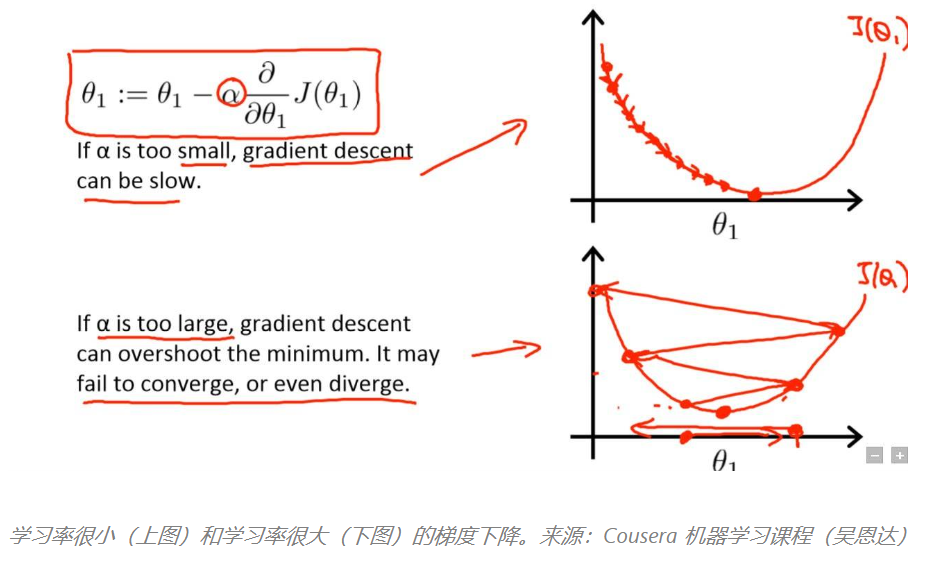
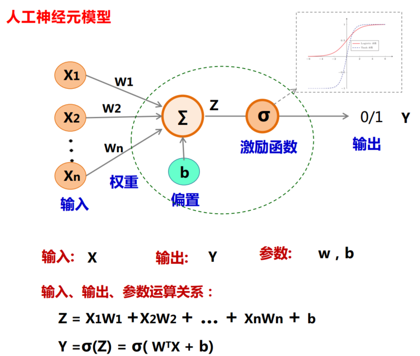
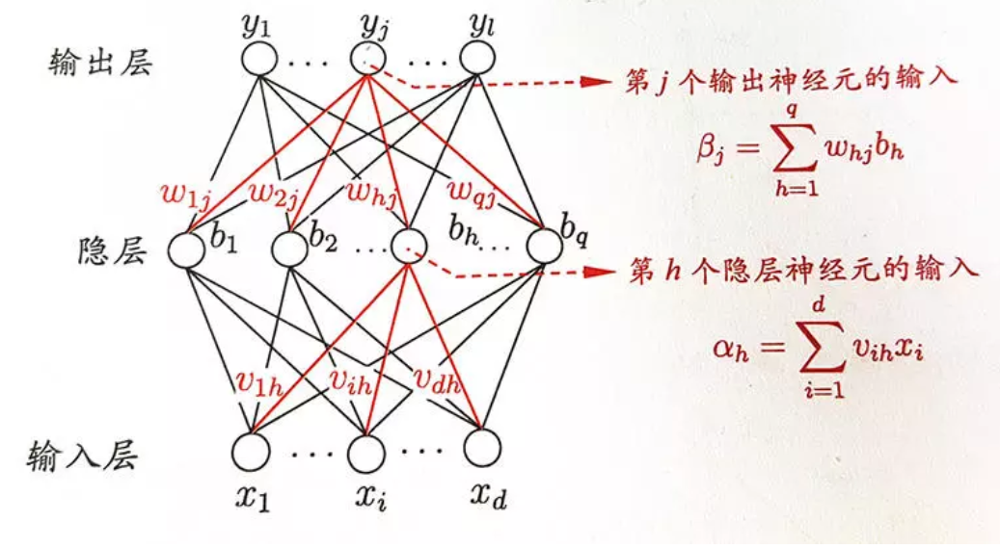
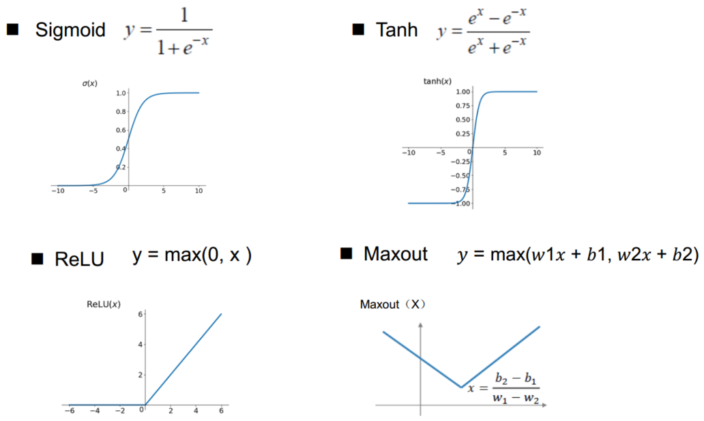
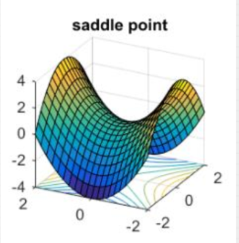

# DeepLearning homework

## BP(Back Propagation) Algorithm

### （1）History

&emsp;&emsp;BP算法即误差后向传播算法应用于神经网络的思想最早是由Paul Werbos在1974年其博士论文中首次论证，然而当时由于人工智能正处于发展的低谷，这项工作并没有得到较大的重视。1983年加州理工学院的物理学家John Hopfield利用神经网络，通过电路模拟仿真的方法求解了旅行商这个NP难问题，在学术界引起的较大的轰动，这也推动了人工智能第二次的快速发展。然而Hopfield Network并没有采用BP的训练方法，其网络结构可以看做一个完整的无向图，最终的训练目标是通过不断地迭代修正权值是网络的整体能量达到最小,为无监督学习。1986年在Hinton和David E. Rumelhart等人的努力下，BP算法被再次发明，并广泛应用于升级网络的训练中。目前红的发紫的深度学习各种网络模型也均采用了86年提出的BP算法。

### （2）Introduction

&emsp;&emsp;反向传播算法的motivation是期望通过在神经网络的训练过程中自适应的调整各神经元间的连接权值，以寻求最佳的输入输出间的映射函数，使得目标函数或损失函数达到最小，完成分类、回归等任务。

&emsp;&emsp;这里我们记目标函数为：

$$
min\quad \tilde J(Y,F(X,\theta))=
\underbrace{L(\theta;X,Y)}_{(1)}+\underbrace{\alpha \Omega(\theta)}_{(2)}\tag{1}
$$

&emsp;&emsp;上式中，第一项即为经验风险，即各类损失函数。第二项即为正则化项。其中$\theta\geq0$，为调整两者之间关系的系数。当$\theta=0$时，则表示无正则化项，$\theta$越大则表示对应正则化惩罚越大。

------------------------
&emsp;&emsp;常见的损失函数主要包括：
 - 绝对值损失函数:$L(\theta;X,Y)=|Y-f(X,\theta)|$，由于该损失函数存在绝对值，求导不易，故很少使用。
 - 平方损失函数：$L(\theta;X,Y)=(Y-f(x,\theta))^2$,广泛应用于回归问题中，如最小二乘、线性回归。
 - 对数损失函数：$L(Y,P(Y|X))=-log(Y|X)$，一般用于做极大似然估计，其可以刻画分布间的相似程度。如Logistic回归。
 - 交叉熵损失函数：$L(\theta;X,Y)=-\sum_{i=1}^ny_ilogf_i(X,\theta)$，交叉熵反映两函数分布的相似程度，其等价于KL散度。一般其会与Softmax函数配合使用，主要应用于多分类问题。
 - 指数损失函数：$L_{exp}(H|D)=E_{x～d}[e^{-f(x)H(x)}]$，主要用于集成学习中，如AdaBoost。
 - 铰链损失函数：$L(\theta;X,Y)=max(0,1-(Y-F(X,\theta)))$，应该用于SVM支持向量机中。
----------------------------

&emsp;&emsp;对于统计机器学习算法一般为缓解过拟合现象的发生需要在进行正则化操作,通过正则化以偏差的增加换取方差的减小。最常见的方法即为在损失函数中引入矩阵范数，以对模型的复杂程度做出惩罚。

-------------------------
- $L^2$范数正则化：$\Omega(\theta)=\frac12||w||^2_2$，使网络权值分布于0值附近，呈高斯分布。$L^2$范数正则化又称为岭回归。
- $L_1$范数正则化：$\Omega(\theta)=||w||_1=\sum_i|w_i|$，使网络权值大量取0，参数稀疏。$L^1$范数正则化在统计学中又称为Lasso回归。
- $L^0$范数正则化：$||w||_0=\#(i)\;with\;w_i\neq0$，$L^0$范数即为模型参数中不为0的数目。在实际问题中，模型一般较为复杂，参数数目较多，因此求解$L^0$范数为NP难问题，故一般不使用。
- Frobenius范数：$||w||_F=(tr(w^tw))^{\frac12}=(\sum_i^m\sum_j^n|w_{i,j}|^2)^{\frac12}$，矩阵的Frobenius范数就是将矩阵张成向量后的$L^2$范数。
----------------------------

&emsp;&emsp;对于目标函数最小值的求解，一般使用梯度下降法，寻求其局部极小值代替全局最小值（若目标函数为凸函数，则梯度下降法可找到全局最优解）。其原理主要来自于泰勒展开式，如下：

&emsp;&emsp;一阶泰勒展开式：$f(x)=f(x_0)+f^{\prime}(x_0)(x-x_0)+Rn(x)\approx f(x_0)+f^{\prime}(x_0)(x-x_0)$
 
&emsp;&emsp;二阶泰勒展开：$f(x)=f(x_0)+f^{\prime}(x_0)(x-x_0)+\frac12f^{\prime \prime}(x_0)(x-x_0)^2+Rn(x)\approx f(x_0)+f^{\prime}(x_0)(x-x_0)+\frac12f^{\prime \prime}(x_0)(x-x_0)^2$
 
&emsp;&emsp;上式中$Rn(x)$为泰勒展开余项，其中常见的有：佩亚诺(Peano）余项、施勒米尔希-罗什(Schlomilch-Roche）余项、拉格朗日（Lagrange）余项、柯西（Cauchy）余项等。
 

&emsp;&emsp;对于梯度下降法，我们考虑泰勒一阶展开，（若考虑泰勒二阶展即为牛顿法，但是实际中由于矩阵求逆较为困难，因此对于不同的矩阵求逆的近似方法而派生出许多不同的拟牛顿法）则有：

$$
f(x_1)-f(x_0)=f^{\prime}(x_0)(x_1-x_0)<0\tag{2}
$$

故：
$$
x_{i+1}=x_i-\eta f^{\prime}(x_0)\tag{3}
$$

&emsp;&emsp;上式中，$\eta 为学习率$。若学习率过大算法将越过局部极小值而震荡不收敛，若学习率过小，算法将收敛较慢，训练时间加长。如下图所示：

 
图1.学习率

&emsp;&emsp;因此在网络的训练中，我们一般采用在训练开始的早期选用较大的学习率，以较快寻求极小值的大致取值。随着迭代次数的增加，学习率将逐渐减小，以更精细的搜索，寻求极小值。

&emsp;&emsp;这里我们以三层神经网络为例说明BP算法，如下所示：

 
图2.神经元

 
图3.三层神经网络

&emsp;&emsp;（1）前项传播过程；

&emsp;&emsp;记输入为$x_1,x_2,...x_n$，输出为$y_1,y_2,...y_n$,则有：

&emsp;&emsp;输入层：$x_1,x_2,...x_n$。

&emsp;&emsp;隐层：第j个神经元的输入为$x_1,x_2,...x_n$，即$X$。输出为$d=\sigma(\sum_{i=1}^nw_i^hx_i+b_j^h)$，即$\sigma(W^hX^T+b^h)$。其中，$w_i^h$为输入$x_i$的权值；$b_j^h$为第j个神经元的偏置项；$\sigma$为激活函数。

&emsp;&emsp;输出层：第j个神经元的输入为各个隐层神经元的输出，即$d_i=\sigma(\sum_{i=1}^nw_i^ox_i+b_j^o)$,j=1,2,....n$。输出为 $y_j=\sigma(\sum_{i=1}^nw_i^od_i+b_j^o)$，即$\sigma(W^oD^T+b^o)$。

&emsp;&emsp;对于多分类问题其输出$y_i$一般还需经过Softmax函数，$s_i=\frac{e^{y_i}}{\sum_{i=1}^ne^{y_i}}$，求得每一类的概率，最后在输入给交叉熵损失函数，或对数损失函数。

&emsp;&emsp;对于其激活函数一般要求连续可微，以满足求导需求。其次一般的激活函数还包括限幅的作用，且导数简单。常用的激活函数如下：

 
图4.常见的激活函数

&emsp;&emsp;（2）误差反向传播过程；

&emsp;&emsp;记损失函数为：$L(\theta;X,Y)$，利用梯度下降法及链式求导法则求解最优参数：$\theta ^*=arg \quad min L(\theta;X,Y)$。

&emsp;&emsp;①输出层$w_i^o$，$b_i^o$:

$$
\frac{\partial L(\theta)}{\partial w_i^o}=\frac{\partial L(\theta)}{\partial Z^o}\frac{\partial Z^o}{\partial w_i^o}\tag{4}
$$

&emsp;&emsp;其中：$Z^o=W^oD+b^o$，$Y=\sigma(Z)$。

&emsp;&emsp;则式（4）即为：

$$
\frac{\partial L(\theta)}{\partial w_i^o}=\frac{\partial L(\theta)}{\partial Z^o}\frac{\partial Z^o}{\partial w_i^o}=\frac{\partial L(\theta)}{\partial Y_i}\frac{\partial Y_i}{\partial Z^o}\frac{\partial Z^o}{\partial w_i^o}\tag{5}
$$

&emsp;&emsp;记$\frac{\partial L(\theta)}{\partial Y_i}=L^{\prime}_i$，$\frac{\partial Y_i}{\partial Z^o}=\sigma^{o^{\prime}}$，$\frac{\partial L(\theta)}{\partial Z^o}=\delta^o=L^{\prime}_i\sigma^{o^{\prime}}$，则式（5）即为：

$$
\frac{\partial L(\theta)}{\partial w_i^o}=L^{\prime}_i\sigma^{o^{\prime}}d_i\tag{6}
$$

&emsp;&emsp;因此权值更新为：$w_i^o\longleftarrow w_i^o-\eta\frac{\partial L(\theta)}{\partial w_i^o}$

&emsp;&emsp;同理，对于$b_i^o$
$$
\frac{\partial L(\theta)}{\partial b_i^o}=L^{\prime}_i\sigma^{o^{\prime}}\tag{7}
$$

&emsp;&emsp;偏置更新为：$b_i^o\longleftarrow b_i^o-\eta\frac{\partial L(\theta)}{\partial b_i^o}$

&emsp;&emsp;②隐层$w_i^h$，$b_i^h$:

&emsp;&emsp;同理,记$\delta_i^h=\frac{\partial L(\theta)}{\partial z_i^h}$，$z_i^h=\sum_{j=1}^nw_j^hx_j+b_i^h$，$d_i=\sigma(z_i^h)$。

&emsp;&emsp;根据链式求导法有：

$$
\delta_i^h=\frac{\partial L(\theta)}{\partial z_i^h}=\frac{\partial d_i}{\partial z_i^h}\sum_{k=1}^n\frac{\partial z^o_k}{\partial d_i}\frac{\partial L(\theta)}{\partial z_k^o}\tag{8}
$$

&emsp;&emsp;有①知：$\frac{\partial L(\theta)}{\partial z_k^o}=\delta_k^o$，$\frac{\partial z^o_k}{\partial d_i}=w_{ki}^o$。

&emsp;&emsp;故式（8）为：

$$
\delta_i^h=\sigma^{\prime}(z_i^h)\sum_{k=1}^n\delta_k^ow_{ki}^o\tag{9}
$$

&emsp;&emsp;故隐层权值$w^h$，偏置$b^h$更新公式如下：

$$
w_i^h\longleftarrow w_i^h-\eta\frac{\partial L(\theta)}{\partial w_i^h}=w_i^h-\eta\frac{\partial L(\theta)}{\partial z_i^h}\frac{\partial z_i^h}{\partial  w_i^h}=w_i^h-\eta \delta_i^hx_i
$$

$$
b_i^h\longleftarrow b_i^h-\eta\frac{\partial L(\theta)}{\partial b_i^h}=b_i^h-\eta\frac{\partial L(\theta)}{\partial z_i^h}\frac{\partial z_i^h}{\partial  b_i^h}=b_i^h-\eta \delta_i^h
$$

&emsp;&emsp;至此三层全连接神经网络的参数更新过程以推到完毕。

### （3）Defects && Future

&emsp;&emsp;当隐层数目过多，即网络太深时，若使用Sigmoid激活函数将存在梯度消失的问题。这是由于sigmoid函数每求一次导数其参数值将衰减至原来的1\4，当网络层数过多，其参数将越乘越小，而无法达到参数训练的目的。在2012年Image Net竞赛中，AlexNet网络首次使用ReLu激活函数，代替Sigmoid函数解决梯度消失问题（其实LeCun组2010年的文章What is the best multi-stage architecture for object recognition?尝试了各种非线性激活函数，其中就包括ReLU的等价形式）。在此之后的深度网络中ReLu激活函数以成为解决梯度消失的首要选择。同时一些ReLu激活函数的变种也相继被提出，如Leaky ReLUs、PReLU、RReLU等。此外，我们还可以采用预训练的方法，即2006年Hinton等提出的训练深度网路的方法，用无监督数据作分层预训练，再用有监督数据fine-tune。或者利用辅助损失函数，如GoogLeNet中使用两个辅助损失函数，对浅层神经元直接传递梯度。或者使用Batch Normalization/Batch Re-Norm，逐层的尺度归一。或者借助ResNet，网络跨层连接等
&emsp;&emsp;由于尺度不平衡的初始化导致梯度爆炸的问题也同样存在，对此我们可以采用Xavier方差不变准则保持网络节点尺度不变。然而在权值训练过程中还存在一种更恶心的问题，即鞍点问题。

 
图5.鞍点

&emsp;&emsp;某些点在函数的某一方向上是极小值点，然而在另一方向却是极大值点。如函数$y=x_1^2-x_2^2$，点（0,0）为鞍点。对于Hessian矩阵，其特征值同时存在正值和负值，即存在鞍点。实际上，高度非凸的深度网络优化难点并不是所谓的局部最小值点，而是无处不在的鞍点。然而对于这类问题简单的随机梯度下降（SGD）却能取得较好的效果。

&emsp;&emsp;此外，对于BP算法其本质上也存在一些缺点，如当目标函数非凸时，其无法搜索到全局最小值。而且使用BP算法的前提即存在目标函数，也即需要衡量学习的数据分布与真实的数据分布间的差异，这也意味着我们需要拥有样本标签，并采用有监督的学习方式。无监督的学习仍是目前研究的难点和热点。其实对于无监督学习在，某种程度上可以将其理解为一种元学习，其实质上仍然存在一定程度的监督，只不过在学习算法中更加隐晦。如生成对抗网络（GAN），GAN包括两个网络：生成器和鉴别器。生成器生成大量伪造数据逼近现实，鉴别器用以判别真时数据和伪造数据，即它可以用真时数据验证内部生成器网络，鉴别器可看做使用目标函数的神经网络。两个网络“相互竞争，共同进步”。GAN网络使用反向传播，执行无监督学习。

&emsp;&emsp;虽然距BP算法提出以超过30年，并且该算法广泛应用于神经网络的训练中，然而最近Hinton大爷却不止一次在媒体和会议上对这种方法表示质疑，并期待寻求新的更好的方法代替或改进BP算法，如胶囊神经网络。这里也希望奋斗在Ai领域的给位专家学者们能带来更多的突破。

[[1] BP Algorithm- Weikipedia](https://en.wikipedia.org/wiki/Backpropagation)

[[2] Werbos, P.. Beyond Regression: New Tools for Prediction and Analysis in the Behavioral Sciences. PhD thesis, Harvard University, 1974](1.pdf)

[[3] J. J. Hopfield, "Neural networks and physical systems with emergent collective computational abilities", Proceedings of the National Academy of Sciences of the USA, vol. 79 no. 8 pp. 2554–2558, April 1982.](2.pdf)

[[4] Rumelhart, David E.; Hinton, Geoffrey E.; Williams, Ronald J. (1986-10-09). "Learning representations by back-propagating errors". Nature. 323 (6088): 533–536.](3.pdf)

[[5] Sabour S, Frosst N, Hinton G E. Dynamic Routing Between Capsules[J]. 2017.](4.pdf)

[[6] Why we should be Deeply Suspicious of BackPropagation](https://medium.com/intuitionmachine/the-deeply-suspicious-nature-of-backpropagation-9bed5e2b085e)
