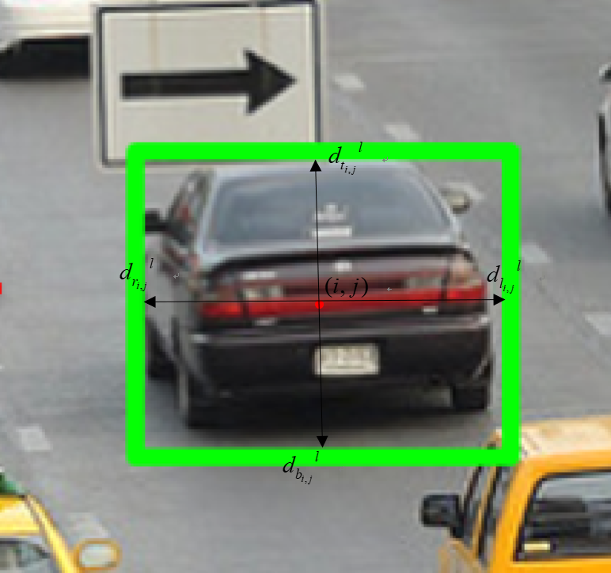

# CVPR 2019 Object Detection Papers  

## Introduction

&emsp;&emsp;对CVPR2019 Object Detection部分论文的介绍，包括：GIoU（Generalized Intersection over Union: A Metric  and A Loss for Bounding Box Regression）、

## 1. GIoU（Generalized Intersection over Union）

### 1.1 motivation

&emsp;&emsp;该论文为Stanford University等人的工作，其主要是对Object Detection中的Loss function进行改进，设计GIoU作为损失函数提高最后精度。其Motivation为；传统的以Ground truth box与predicate box间坐标的最小均方误差MSE作为boundary box的位置损失函数并不能很好的刻画Ground truth box与predicate box间实际的位置关系和真实的重叠情况，即很有可能会出现其MSE（二范数）相等但是IoU相差很大的情况。而事实上IoU更能反映Ground truth box与predicate box的位置误差，因此作者希望使用IoU来代替MSE作为损失函数，然而这将带来一个问题：在模型的实际输出中大部分predicate box与ground truth box间并没有overlap的部分（positive和negative samples间存在严重不平衡），即IoU为0，此时求导无任何意义（实际上损失函数为1-IoU，不过没太大区别），这就导致大量负样本对训练无任何帮助，因此作者通过对IoU进行简单改进，设计GIoU使得non-overlap的priors也能进行训练，且这种简单的做法对最后结果精度的提高也有一定的提高。有关IoU的介绍可以参考我的这篇笔记：[目标检测YOLO系列](https://zhuanlan.zhihu.com/p/57878269)。

### 1.2 method

&emsp;&emsp;有关目标检测的相关模型介绍可以参看我的这篇笔记：[目标检测从R-CNN到SSD](https://zhuanlan.zhihu.com/p/55050568)
[目标检测从R-CNN到Faster R-CNN](https://zhuanlan.zhihu.com/p/60033491)

&emsp;&emsp;一般目标检测模型如R-CNN系列、YOLO系列其损失函数一般如下：

$$
Loss=\lambda L_{loc}(x,y,w,h)+L_{cls}(p,u)\tag{1} 
$$

&emsp;&emsp;上式中的$L_{loc}$即表示位置损失，其一般为$x,y,w,h$（predict box与ground truth坐标及box长宽）的均方根误差函数，而$L_{cls}$即表示分类误差，一般为预测目标前景类别与目标真实类别的cross entropy，而$\lambda$即为调整两损失的权值。

&emsp;&emsp;在R-CNN中作者利用predict bounding box与prior box坐标间的offset作为误差以加快模型收敛，而Fast R-CNN进一步的对位置损失使用smooth L1以加快模型收敛。YOLO-v1使用均方根误差为位置损失函数，YOLO-v2则引入anchor box，同时利用offset作为位置损失加快收敛，同时提高模型mAP。然而上述种种方法本质上均为太大差别。

 
图1. IoU & MSE

&emsp;&emsp;如图1所示，其中绿框为ground truth，黑框为predicate box，可以看到虽然三种predicate box与ground truth的MSE相等但它们的IoU相差很大，若直接使用MSE为loss function则无法真实的表示位置误差。因此作者首先想到使用IoU作为loss，但直接使用IoU将会存在如下两个问题：

 
图2. IoU

- 若Ground truth box与predicate box没有overlap的部分则IoU为0，训练时无法使用大量的未重合的负样本；
- IoU无法真实反映Ground truth box与predicate box的重合度且无法辨别方向不一致的对齐。如图2所示，其三种情况IoU值相同，但其重合程度和对其方式明显不相同。

&emsp;&emsp;故作者设计了GIoU：

$$
GIoU=IoU-\frac{|C\backslash(A\bigcup B)|}{|C|}\tag{2}
$$

&emsp;&emsp;上式中，$A,B$表示Ground truth box与predicate box；

&emsp;&emsp;&emsp;&emsp;&emsp;&emsp;$C$表示$A,B$的最小覆盖集（smallest enclosing convex of A and B），在论文中作者使用A和B的顶点坐标信息确定的矩形区域表示$C$；

&emsp;&emsp;&emsp;&emsp;&emsp;&emsp;$C\backslash(A\bigcup B)$表示$C$与$A,B$未发生重叠的区域。

&emsp;&emsp;实际中我们使用$1-GIoU$作为位置损失函数，而$1-GIoU$满足以下性质：

- $1-GIoU\leq IoU$;
- $-1 \leq 1-GIoU\leq 1$;

&emsp;&emsp;其中GIoU的实际求解流程如下：

 
图3. GIoU algorithm

&emsp;&emsp;上图中，$I$表示$A\bigcap B$，其他不用太多解释。

### 1.3 expirements

&emsp;&emsp;作者利用Faster R-CNN、MaskR-CNN、YOLO v3模型在PACAL VOC2007、MS COCO数据集上分别对比MSE、IoU、GIoU为损失函数的实验结果，部分实验如下：

 
图4. Accuracy IoU、Class Loss at COCO

&emsp;&emsp;从图4可以看出随着迭代轮数的增加其Accuracy IoU逐渐上升最终优于IoU loss。

 
图5. Faster R-CNN at COCO

&emsp;&emsp;从图5可以看出，即使使用IoU作为loss其AP也比MSE要高，而使用GIoU则效果会更好。

### 1.4 conclusion

&emsp;&emsp;这篇文章思想朴素，方法简单可解释性好，对于object detection均能适用，且最后对结果也有一定的提高。但是GIoU也需要不断尝试阈值以调整precision与recall间的trade off。此外我们是否能够提出一种loss function能反映ground truth与predict box间的位置信息，同时能够指导predict box location的调整方向以帮助模型更好的收敛同时提升精度呢？

## 2. Anchor-Free(Feature Selective Anchor-Free Module for Single-Shot Object Detection)

### 2.1 motivation

&emsp;&emsp;在图像分割与检测任务中对于不同尺度，尤其是小目标的检测一直都是任务的难点和上分的瓶颈。对此不同学者提出了很多模型，代表性的如单阶段检测其SSD，特征融合金字塔FPN等。其中FPN的主要思想为随着卷积的不断加深，图像的语义信息将越来越丰富，但是细节信息将会严重丢失。深层与浅层间存在这天然的语义鸿沟。而对于小目标我们需要尽可能的利用其细节信息，但与此同时又希望融合其丰富的语义信息，故作者设计了up to down和bottom to top的特征金字塔模型融合深层和浅层特征，后接Faster R-CNN部分，此即为FPN网络。实验表明该网络对于小目标检测的精度提升有较大帮助，同时相比与Faster R-CNN对于小目标即使不进行特征融合而只利用浅层feature map其精度也能在原有的baseline上有所提升。然而FPN网络中存在一个并不时十分具有说服力的设计，即对于layer的选择其根据region proposal确定，具体公式如下：

$$
K=\lfloor k_0+log_2(\sqrt{wh}/224)\rfloor\tag{3} 
$$

&emsp;&emsp;在FPN中我们需要根据region proposal size确定对哪一个feature map进行RoI操作。其具体方法如式（3），其中224为ImageNet的标准图像尺寸；$w,h$为RoI相对原始输入图片的宽高；$k_0$设置为4，通过向下取整计算得到$K$值及对应Stage（$K=3$则将$P_3$所得特征图进行RoI Pooling）。可以看到该方法简单粗暴，这实际问题中可能出现如下问题：

 
图6. feature level selected

&emsp;&emsp;如图6所示，对于“car”这一目标，若利用式（1）则大小为$40\times 40$与$50\times 50$的region proposal可能会在同一level而$60\times 60$的可能会在另一level。显然式（1）确定feature的方法简单粗暴，说服力较差。此外基于anchor box的predict box生成方法将存在另一问题，即候选框的数目较多且存在大量的重叠。以SSD为例其一共将产生8732个box。具体有关其box数目的计算可以参看我的这篇笔记：[SSD目标检测](https://zhuanlan.zhihu.com/p/58711133)，有关FPN网络的详细介绍可以参看我的这篇笔记[FPN-目标检测](https://zhuanlan.zhihu.com/p/58603276)。

&emsp;&emsp;故这里作者想要对式（1）进行改进，其最终做法是对于predict box的生成将不再依赖feature proposal的大小和anchor box的设计，而是设计anchor-free banch，即将两个两个并行的卷积网络：class subnet和box subnet并将其嵌入至RetinaNet中，直接根据feature map，逐pixel卷积回归其与ground truth$x,y,w,h$的距离，同时预测其类别，最终在更快的速度的同时获得了更好的效果。

### 2.2 method

&emsp;&emsp;FSAF(Feature Selective Anchor-Free Module)以ICCV2018的BP-RetinaNet为backbone，在此基础上嵌入两个子网络，分别为class subnet和box subnet分别对每个level的feature map的object进行分类，boundary box进行回归，如下：

 
图7. FSAF

&emsp;&emsp;如图7所示，其中的anchor-free banch即为额外嵌入的两个并行卷积层，而anchor-based branch与FPN、RetinaNet的结构保持一致，其最终网络的损失函数为anchor-based branch与anchor-free branch的损失之和。

- classification subnet：$K$个$3\times 3$的卷积后接Sigmoid激活函数，其中$K$为目标类别数。
- regression subnet：4个$3\times 3$的卷积后接ReLu激活函数，其中4表示$d_{i,j}^l=[d_{t_{i,j}}^l,d_{l_{i,j}}^l,d_{b_{i,j}}^l,d_{r_{i,j}}^l]$。其中$d_t^l,d_l^l,d_b^l,d_r^l$表示位置为$(i,j)$的pixel距离其对应的level为$p$的ground truth box $b_p^l$上、左、下、右边界的距离，如图8所示。

 
图8. distance between pixel and ground truth

&emsp;&emsp;测试时，regression subnet的输出为点$(i,j)$的offsets $[\hat o_{t_{i,j}},\hat o_{l_{i,j}},\hat o_{b_{i,j}},\hat o_{r_{i,j}}]$。则最终与预测的predict box边界为$(i-S\hat o_{t_{i,j}}, j-S\hat o_{l_{i,j}})$和$(i+S\hat o_{t_{i,j}}, j+S\hat o_{l_{i,j}})$，其中$S$为normalization constant，$S=4.0$。

&emsp;&emsp;损失函数：

- classfication loss：类别损失函数，作者follow RetinaNet中的local loss。具体做法为，作者首先对于boundary box$b=[x,y,w,h]$映射至任意level$p$，得到其project box $b_p^l=[x_p^l,y_p^l,w_p^l,h_p^l]=b/2^l$，其中$x,y,w,h$表示中心坐标及长、宽。同时作者定义effective box区域为$b_e^l=[x_e^l,y_e^l,w_e^l,h_e^l]=[x_p^l,y_p^l,\epsilon_e w_p^l,\epsilon_e h_p^l]$，其中$\epsilon_e=0.2$。igoring box区域为$b_i^l=[x_i^l,y_i^l,w_i^l,h_i^l]=[x_p^l,y_i^l,\epsilon_i w_p^l,\epsilon_i h_p^l]$，其中$\epsilon_i=0.5$。如图9所示：

 
图9. loss

&emsp;&emsp;如图9所示，ground truth map被分为三部分：白色部分为effective box $b_e^l$，灰色部分为ignoring box $b_j^l-b_e^l$，黑色部分为negative area，即负样本其值为0。在计算local loss时ignoring box的损失梯度不回传，其Local loss为：

$$
L_{FL}^I(l)=\frac{1}{N(b_e^l)}\sum_{i,j\in b_e^l}FL(l.i,j)\tag{4}
$$

&emsp;&emsp;式（4）中$N(b_e^l)$为effective area的所有像素点数目之和。我们对为effective area的所有像素点的local loss进行求和后平均即为最后bbox$I$的local loss。通过设置effective box、ignoring box和negative area，简化local loss的计算同时使网络加速收敛。而在测试时，则直逐像素预测，而不区分area。

- regression loss：regression loss 利用regression subnet的输出offsets（distance）计算IoU loss，如下：

$$
L_{IoU}^I(l)=\frac{1}{N(b_e^l)}\sum_{i,j\in b_e^l}IoU(l.i,j)\tag{5}
$$

&emsp;&emsp;则anchor-free branch的total loss为IoU loss和focal loss之和。通过对ground truth box $I$所对应的不同level计算total loss，并选择loss最小的level $l^*$作为最终的feature map，送入至后续的feture selection module提取特征，然后再此进行分类回归得到最终的结果。

$$
l^*=arg\quad min_l L_{FL}^I(l)+L_{IoU}^I(l)\tag{6}
$$

 
图10. feature selection

&emsp;&emsp;由上所述，式（6）的主要作用是替代式（3）对object feature map的level进行自动选择。其可以嵌入至原始的single-shot网络中，同anchor-based branches进行joint共同进行检测。

### 2.3 expirement

 
图11. FSAF on COCO

&emsp;&emsp;从上表可以看出若仅使用anchor-free的方法其利用FPN的方法选择feature level则其效果最差，若使用式（6）的方法选择feature level则AP相比RetinaNet就有一定提高，这说明了anchor-free branch与online feature selection的有效性。同时若将anchor-based branch与anchor-free branch相结合进行联合训练其结果会更近一步提高。最好的效果是同时使用anchor-based branch与anchor-free branch，并使用online feature selection进行feature layer的选择，该结果相比原始的baseline其$AP_{50},AP_S,AP_L$分别提升了2.5%，1.5%，2.2%。

 
图12. inference latency time

&emsp;&emsp;从图12可以看出，插入FSAF其并未显著增加计算时间，相反若只是用FSAF其计算时间将少于RetinaNet，这有可能是box数量较少导致的。

### 2.4 conclusion

&emsp;&emsp;该方法最初是为改进（或探究）FPN中feature level选择的简单、暴力对结果的影响，进而提出了一种新的产生predict box的方法，即逐pixel预测其boundary box的offsets，其方法类似于image segmentation的做法，但同时该方法也并不能完全取代anchor-based的方法，可见prior information对结果的提高仍有一定的帮助。另外还有一点需要思考的是anchor-base与anchor-free相结合导致AP的提高，是否是因为候选predict box增加的结果，我们是否可以仍基于anchor-based的方法，同时对同一object的不同laver使用另一种策略选择box，然后组合预测bbox，这是否能提高精度？

## 3. Libra R-CNN

### 3.1 motivation

&emsp;&emsp;作者归纳在目标检测任务中存在三种不平衡现象：

 
图13. imbalance

- Sample level imbalance：在目标检测中hard samples要远少于easy samples，但是对于detection performance的提升来说hard samples要更有效。简单的随机采样选择的绝大部分是简单样本，而OHEM这种通过confidence自动识别难例的方法带来的内存和时间成本较大，而且容易受到noise label的影响。而Focal loss通过改进交叉熵损失虽然平衡了前景和后景样本数量，且在单阶段检测其上效果较好，但是其在双阶段detectors中的性能要大大折扣。

- Feature level imbalance：如上所述，对于深度卷积网其shallow layer和deep layer存在天然的semantic gap，因此需要进行特征融合。FPN、PANet等给出了一定的解决方法，但是该方法这种自顶向下或自底向上的特征融合方法将使得融合的特征更多的关注其相邻level的feature，而更高或更低层级的feature信息降被 diluted。

- Objective level imbalance：对于一般的object detection其损失函数由classfication loss和regression loss组成，而它们间一般由参数$lambda$调节，然而当$lanbda$确定不好时hard sample产生的梯度将会淹没简单样本的梯度，而使得简单样本在训练时得不到过多的关注，导致优化难以收敛至最佳的状态。最近UnitBox、IoUNet以及GIoU均提出用IoU或GIoU提升localization accuracy，但是也并未解决上述问题。

&emsp;&emsp;对此作者分别针对上述三种imbalance，提出三种解决方法，如下：

 
图14. Libra R-CNN

- IoU-balanced Sampling

 
图15. IoU distribution

&emsp;&emsp;从上图可以看出，60%的hard sample（橙色）其IoU大于0.05，但是随即采样其70%的样本IoU均小于0.05，即只要30%样本为hard negatives，故作者设计了如下的采样方式：即将样本按IoU切分且要求每个bin中的negative samples相同，则每个negative 被采样的概率为

$$
p=\frac{N}{K}*\frac{1}{M_k},k\in[0,K)\tag{7}
$$

&emsp;&emsp;上式中，bin的数目$p=K$（论文中设置$K=3$），$M_k$为$bin=k$的总样本数，$N$为我们期望的hard samples。观察图15，通过此策略进行采样我们将有更大的概率获得negative samples。

- Balanced Feature Pyramid

 
图16. Balanced Feature Pyramid

&emsp;&emsp;作者为加强multi layer间的融合，设计了图16的pipeline，首先通过Pooling或插值将不同size的feature map统一至同一大小，然后进行融合，如下：

$$
C=\frac{1}{L}\sum_{l=l_{min}}^{l_{max}}C_l\tag{8}
$$

&emsp;&emsp;上式中，$l_{min},l_{max}$分别为最底层和最高层的feature map，$L$为level的总数目，通过将同一尺寸的feature直接相加取平均得到融合了不同level的feature，简单粗暴。

- Balanced L1 loss

&emsp;&emsp;传统的loss是将classfication loss和regression loss进行加权相加，权值指定。这将带来一个问题即class loss精度的提升可能淹没回归的优化。此外按照L1 loss，对于outliers（hard sample，其值大于1.0）其在模型优化中贡献了70%的梯度，而inliers（easy samples，其值小于1.0）只贡献30%的梯度，即outliers主导了模型的优化方向。因此一个很自然的想法就是增加inliers的梯度，故作者从smooth L1出发设计Balance L1 loss $L_b$，如下：

$$
\frac{\partial L_b}{\partial x}=\begin{cases}\alpha ln(b|x|+1) & \text{if |x|<1}\\ \gamma & \text{otherwise}\end{cases}\tag{9}
$$

&emsp;&emsp;式（9）即为$L_b$的偏导，其出发点就是希望当$|x|<1$时增加梯度。观察图17可知，$\alpha ln(b|x|+1)>x$。

 
图17. gradient

&emsp;&emsp;故根据式（9）即可设计出Balanced L1 loss应为：

$$
L_b(x)=\begin{cases}\frac{\alpha}{b}(b|x|+1)ln(b|x|+1)-\alpha|x| & \text{if |x|<1}\\ \gamma |x|+C & \text{otherwise}\end{cases},where \alpha ln(b+1)=\gamma\tag{10}
$$

&emsp;&emsp;其中，$\alpha ln(b+1)=\gamma$保证函数求导连续，作者在沦为中设置$\alpha=0.5,\gamma=1.5$。

### 3.3 experiment

 
图18. Libra R-CNN at COCO

&emsp;&emsp;从图18可以明显看出，Libra R-CNN在COCO数据集上其AP要比目前的主流模型高至少2个百分点。

 
图19. Libra R-CNN each component

&emsp;&emsp;作者对这三种策略进行控制变量实验，如图19所示，可以看出每一种balance的方法均在之前的精度上有一定的提升。此外作者通过实验还发现在IoU-balanced Sampling中，$K$的取值对结果影响不大，即其对bin的数目不敏感。

### 3.4 conclusion

&emsp;&emsp;相比与其它“炼丹术”该方法简单易行，可解释性好且提升明显。此外作者指出的三个不平衡问题均是目前object detection出paper的不同方向，其还有更多方法可以挖掘。尤其是对于小目标的检测，目前的特征融合方法仍较为简单，此后定还会出现更加beauty的方法。

## Reference

[[1] Zhu C, He Y, Savvides M. Feature Selective Anchor-Free Module for Single-Shot Object Detection[J]. arXiv preprint arXiv:1903.00621, 2019.](https://arxiv.org/abs/1903.00621)

[[2] Rezatofighi H, Tsoi N, Gwak J Y, et al. Generalized Intersection over Union: A Metric and A Loss for Bounding Box Regression[J]. arXiv preprint arXiv:1902.09630, 2019.](https://arxiv.org/abs/1902.09630)

[[3] Pang J, Chen K, Shi J, et al. Libra r-cnn: Towards balanced learning for object detection[J]. arXiv preprint arXiv:1904.02701, 2019.](https://arxiv.org/abs/1904.02701)

