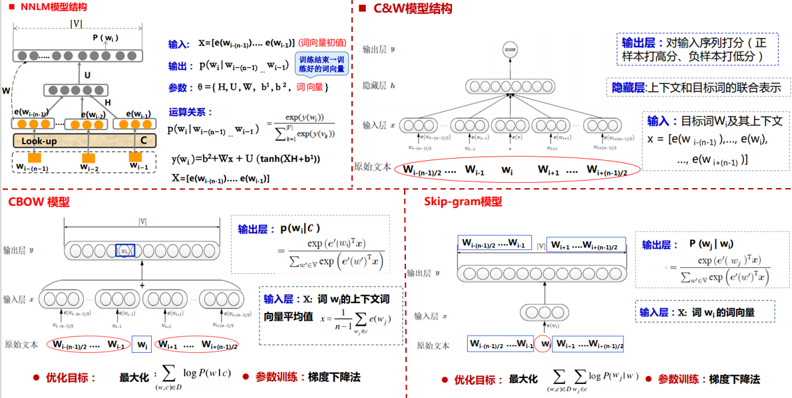
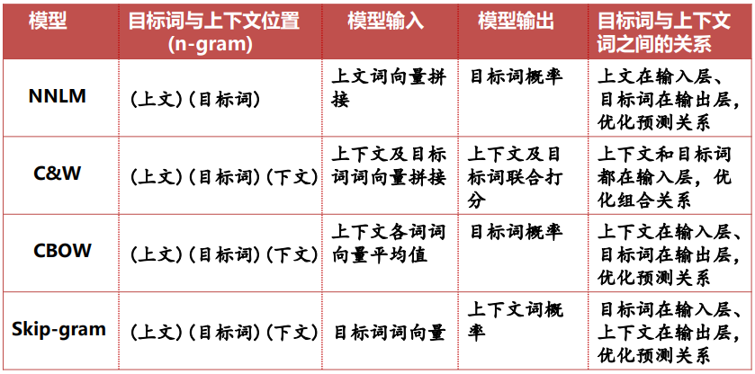
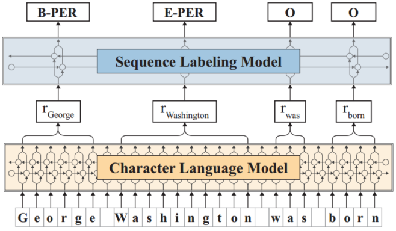
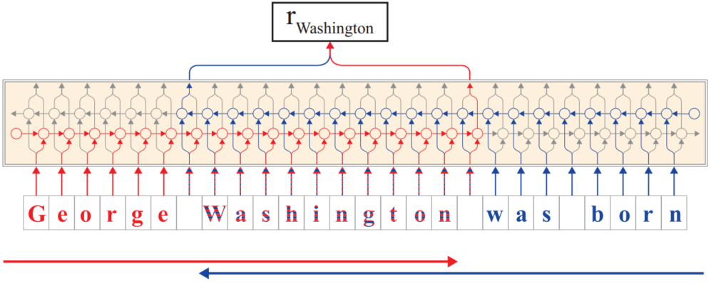
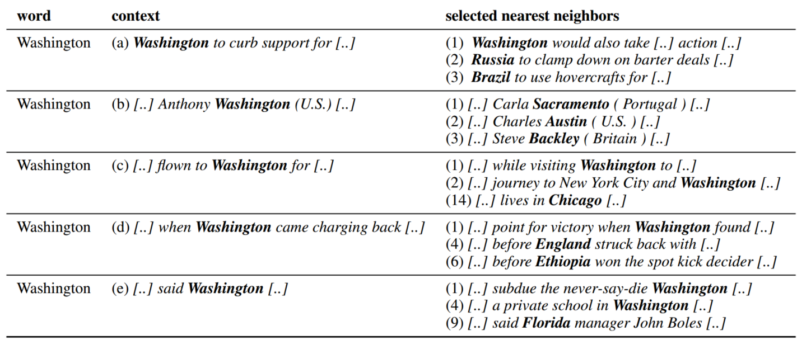
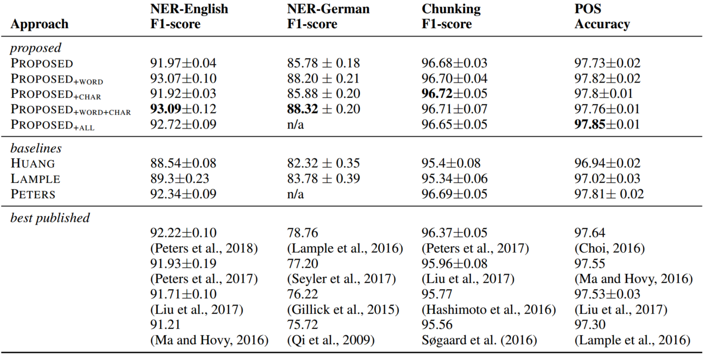

# Contextual String Embedding for Sequence Labeling

## 1. Introduction

&emsp;&emsp;序列标记问题作为NLP的基本问题，其结果好坏对与后续任务有着至关重要的影响。此外，自然语言处理中的许多任务也均能转化为序列标记问题，如命名实体识别、分词、词性标注等。在传统的机器学习方法中，最初使用隐马模型实现sequence labeling，其主要思想是将标记序列作为隐状态序列而将sentence作为观察的显示序列，通过定义5元组（隐状态集合$S$，观测值集合$O$，状态转移矩阵$A$，初始状态概率分布$\pi$以及指定状态下观测值的概率分布$B$）计算观察序列各个时刻的概率分布。HMM一般包括两个基本问题即评估问题（给定观察序列求其出现的概率），其对应前向算法和后向算法，解码问题（给定观察序列确定最有可能的隐状态序列，即序列标记问题），其对应Viterbi算法。然而，对于简单的HMM算法，由于隐序列的各个状态仅由观察序列的各个状态确定，而相邻时刻的隐状态没有发生直接的联系，因此在词性标注等任务中会出现如两个介词连用的错误情形，对此学者的简单想法是让相邻隐状态间发生直接联系，即考虑添加隐状态间的状态转移矩阵，故在最大熵模型的基础上提出了CRF模型，CRF模型在前深度学习时代得到了广泛的应用，然而这种非连接主义的方法最大的缺点是依赖人工设计特征描述子。直至deep learning大火后我们现在也仍需使用embedding+BiLSTM进行特征表示，然后仍需外加CRF进行序列标记，只不过其模型的参数由学习而得。有关序列标记的详细介绍可以参考我的这篇笔记[NLP中的序列标注问题](https://zhuanlan.zhihu.com/p/50184092)

 
图1. Named Entity Recognition

&emsp;&emsp;在神经网络语言模型中最初词向量的表示方法是One-hot的离散形式，此方法虽然简洁但是却存在词汇鸿沟和维数灾难的问题，后续又逐渐提出了词袋模型（该词在文档中的出现次数）和TF-IDF（反映该词在文档中的占比），然而也很难解决语义鸿沟的问题。基于分布式假设（在相同上下文中出现的词频倾向于具有相同的含义），Begio等人于2001年正式提出神经网络语言模型（Neural Network Language Model， NNLM）并创造了词向量的概念，即以one-hot编码为前驱查阅look-up表将词编码为稠密的向量，而look-up表的设计即由神经网络训练所得。同时，根据输入输出的不同，词向量网络由分为NNLM、C&W、CBOW和Skip-gram等模型（CBOW与Skip-gram与NNLM相比除去了隐层和词序，使模型得到简化）。此外，由于CBOW、Skip-gram等模型其Softmax的计算与参数的更新需要对整个词表进行，因此其时间成本较高，对此又提出了Hierachical softmax，通过构建哈夫曼树而每次只对少部分结点进行更新和计算以减少复杂度。对于一次多义的问题如“Bank”等，也有学者提出根据不同上下文对一个词编码多个词向量，同时通过对上下文进行idf加权进行k-mean clustering最终确定词向量。此外也有实验表明将不同结构模型如RNN与CNN等学习而得的词向量进行concatenate，对downstream task结果的提高也有帮助。

 
图2. Neural network word vector

 
图3. Neural network word vector comparision

&emsp;&emsp;“Contextual String Embedding for Sequence Labeling”这篇文章对于序列标记任务最大的创新点是对传统Embedding的改进，即基于上下文利用Bi-LSTM中的hidden state结合传统Embedding编码词向量。同时与2017年Peters et al.提出的抽取hidden states 作为NLP tasks方法相比，该方法在速度上有明显提高，同时再次刷新了CoNLL03的baseline，其F1值达到了93.09超过了Bert。

## 2. Model Structure

&emsp;&emsp;模型的主要结构如下图所示：

 
图4. Model Structure

&emsp;&emsp;从图4可以看出论文提出的模型主要包括两个部分，即Character Language Model和Sequence Labeling Model。其中Character Language Model即利用双向LSTM中hidden state编码词向量，由于Bi-LSTM的使用使得该Embedding天生就融合了上下文的语义信息，因此能很好的解决一词多义的问题。同时由pre-training得到的Character Language Model可以根据不同的输入动态编码词向量，因此其能很好的嵌入至downstream任务中。Sequence Labeling Model即为传统的BiLSTM+CRF的结构。

 
图5. Character Language Model 

&emsp;&emsp;图5为Character Language Model的详细结构，可以看出我们将每一个word的各个character作为单独的输入，同时对于每一个word，利用单词第一个字母对应的forward hidden state $h_{t_{i+1}-1}^f$和单词最后一个字母对应的backward hidden state $h_{t_i-1}^b$进行拼接$w_i^{CharLM}=\begin{bmatrix}h_{t_{i+1}-1}^f\\h_{t_i-1}^b\end{bmatrix}$以融合context信息得到最后的word embedding，这样技能有效解决一词多义问题，同时还能更好的处理未登录词、罕见词以及拼写错误的问题。

 
图6. polysemy 

&emsp;&emsp;从图6可以看出，对于不同含义的Washington，其能根据上下文语境很好的区分，而当上下文信息缺失或较少时，其也较难分辨。

&emsp;&emsp;CLM作为一个子网络可以单独进行训练，这里定义序列$(x_0,x_1,...,x_T)$的联合概率分布为各个条件概率的连乘积：

$$
P(x_{0:T})=\Pi_{t=0}^TP(x_t|x_{0:t-1})\tag{1}
$$

&emsp;&emsp;而：

$$
P(x_t|x_{0:t-1})\approx\Pi_{t=0}^TP(x_t|h_t;\theta)\\
P(x_t|h_t;V)=softmax(Vh_t+b)=\frac{exp(Vh_t+b)}{||exp(Vh_t+b)||_1}\\
h_t(x_{0:t-1})=f_h(x_{t-1},h_{t-1},c_{t-1};\theta)\\
c_t(x_{0:t-1})=f_c(x_{t-1},h_{t-1},c_{t-1};\theta)\tag{2}
$$

&emsp;&emsp;式（2）中各个词的概率分布由Softmax函数确定。其中，$\theta$为模型参数，即权值$V$和偏置$b$。$h_t,c_t$为LSTM的输出值。

&emsp;&emsp;我们根据CLM的输出概率分布与语料库中统计所得的概率分布做cross entropy即可进行unsupervised pre-training。

## 3. Experiments

&emsp;&emsp;在实验中作者分别探究了以下四种词向量表示对结果的影响：

- Proposed：即根据图5.方法得到word embedding；
- Proposed+word：在Proposed的基础上拼接预训练的GloVe词向量（金典做法）$w_i=\begin{bmatrix}w_i^{CharLM}\\w_i^{GloVe}\end{bmatrix}$；  
- Proposed+char：即根据NER任务利用hierarchical BiLSTM-CRF训练word vectory（与任务相关的embedding），同时与Proposed所得word vectory进行concatenate；
- Proposed+all：综合上述三种词向量表示，即Proposed+word+char。

&emsp;&emsp;实验结果如下：

 
图7. 实验结果

&emsp;&emsp;从上图可以看出本文方法，即基于输入文本的动态embedding与金典预训练的embedding结合最有效，其相较于Proposed F1 91.97提升了1.1 pp。而char embedding对结果的影响较小。 

 
图8. 各任务F1值

&emsp;&emsp;从上图可以明显看出，该工作在众多sequence labeling任务中均达到了state-of-the-art。

&emsp;&emsp;总的来说，目前对于word Embedding主要分为两种方法：（1）利用更多的external information，如基于大量高质量数据预训练的Berth，或针对其它特定数据集预训练的word embedding；（2）利用神经网特征表示和选择的能力，根据hidden state表示word embedding，以及对各种embedding进行拼接。总之如何利用更多的外部信息以及更好的表示特征是仍需研究的方向。

## 4. Reference

[1] 胡玥. 自然语言处理（08）神经网络语言模型&词向量（slides）. 中科院信息工程研究所第二研究室.

[[2] Alan Akbik. Flair: State-of-the-Art Natural Language Processing (NLP). ZALANDO RESEARCH](https://research.zalando.com/welcome/mission/research-projects/flair-nlp/)

[[3] Edward Ma. Contextual Embeddings for NLP Sequence Labeling. Medium](https://towardsdatascience.com/contextual-embeddings-for-nlp-sequence-labeling-9a92ba5a6cf0)

 

