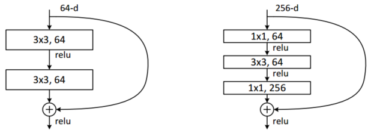

# Deep Neutral Networks

## 1. History

### 1.1 第一次潮起潮落

&emsp;&emsp;神经网络模型的最早研究起源与认知心理学、理论和计算神经科学领域。1943年Warren McCulloch和Walter Pitts发明了基于数学和阈值逻辑的算法神经网络计算模型，即MCP神经元数学模型，为神经网络的发展拉开了序幕。1958年，Rosenblatt创造了感知机并将其成功运用于简单的模式识别任务中，将神经网络的研究推向了第一次的高潮。一些学者对神经网络的发展过度乐观，甚至认为“20年内机器可以做所有人做的事”。与此同时各国政府，如美国国防部（DoD）也开始大量资助神经网络的研究。然而好景不长，1969年Minsky和Papert直接指出目前的神经网络存在两个关键的缺陷：（1）无法解决异或这类简单的线性不可分问题；（2）计算机没有足够的算力来求解大型的网络。这些问题直接宣判了神经网络的“死刑”，神经网络的研究进入了第一次寒冬。在神经网络的第一次寒冬期间也有部分学者取得了一定的成就。例如，1959年Hubel、Wiesel通过对猫的视觉皮层的研究发现，哺乳动物的视网膜上同时存在着两种细胞即视锥细胞和视杆细胞，其分别对颜色和明暗敏感。视网膜接收光信号后将其转化为电信号并分两路向视觉皮层传播。视神经传来的信号主要经过初级视觉皮层（V1）、二级视觉皮层（V2）、三级视觉皮层（V3）等层层处理抽象，最终在我们大脑中形成影像。该研究于1981年获得诺贝尔生理学或医学奖，并直接启发了日本学者Fukushima。1980年Fukushima根据猫的视觉皮层中视觉感受野以及视神经信号层层传播处理的思想发明了neocognitron。该网络可以视为CNN最早期的雏形，但当时该网络的训练为自组织的方式，其并未采用误差反向传播，当数字的位置或形态稍有变化时其识别效果并不理想，然而这一工作却为日后LeCun研究的重要基石。

 
图1.MCP神经元模型

 
图2.异或问题

 
图3.视觉系统

 
图4.neocognitron神经网络模型

### 1.2 第二次潮起潮落

&emsp;&emsp;1983年加州理工学院的物理学家John Hopfield利用神经网络，通过电路模拟仿真的方法求解了旅行商这个NP难问题，在学术界引起的较大的轰动，这也推动了神经网络第二次的快速发展。同时1986年BP误差反向传播算法被Hinton等人再次发明，这也为后来神经网络的发展奠定了基础。1989年George Cybenko首次提出了sigmoid激活函数的万能逼近定理，2年后Kurt Hornik指出万能逼近定理并不依赖于特别的激活函数，而是由多层前馈网络结构所决定的。同时在1989年LeCun大神正式登场，其通过利用BP算法完成了对手写数字的识别。1998年LeCun正式提出LeNet-5，该网络即为标准的卷积神经网络（CNN），其采用了卷积、池化的结构，并选择双曲正切激活函数和极大似然估计损失函数，同时使用BP算法进行训练。该网络在手写数字识别上获得成功，并应用于美国的邮政系统中。然而受限于当时计算机的发展、数据的匮乏以及网络优化的困难（梯度消失），神经网络的发展再次受挫，进入第二次寒冬。同时，1992年Bernhard E. Boser, Isabelle M. Guyon等人利用kernel的技巧发明了非线性SVM这种基于表层学习的分类器。1993年Corinna Cortes和Vapnik提出了软间隔的思想，再次强大了SVM的能力。这也使得多数学者转而研究SVM，神经网络方法受到了极大地打压。

### 1.3 第三次潮起

&emsp;&emsp;2006年即为Deep Learning元年，2006年Hinton大爷在Science上发文，指出利用RBM编码预训练深度神经网络与PCA相比在高维特征抽取方面有更有的性能，同时这也使得更深网络的训练成为了可能。虽然这篇文章现在看来并没有在理论上做出较大的创新，但是这却使得深度学习重新回到人们的视野。与此同时随着计算机技术的进步以及互联网的普及，其为深度学习技术提拱了爆发向前的燃剂。真正使深度学习得到广泛关注的是在2012年ImageNet比赛中，当时Hinton组凭借AlexNet深度神经网络以领先第二名10.8个百分点的优势一举多得比赛冠军。在Alexnet中，ReLu激活函数的使用克服了梯度消失的问题。Dropout trick将网络的某些连接随机置零有效减小了过拟合的发生，同时利用黄老板赞助了两块GPU，通过并行计算大大缩短了网络的训练时间。接下来一年的ImageNet竞赛中，前十的方案几乎全部选择了深度网络的方案。此后新的深度网络网络不断被提出、改进，如GoogLeNet、VGGNet、ResNet、Gan、FasterRNN、LSTM等等。网络向更深、更复杂的方向发展。在其它的领域如语音识别、机器翻译、问答系统等某些十分微小具体的方面，深度网络也表现出了准确率优于人类的良好性能。然而，对于结构化数据的分类问题等，深度网络表现却不如一些集成学习的方法，如XGBoost、LightBoost......此外，由于深度神经网络需要大量的数据进行有监督的训练，更深的网络更大的数据同时也意味着更强的算力，这将极大的消耗资源，这阻碍了深度网络的发展。然而，这些缺陷也正是研究的热点，如无监督学习、小数据、脏数据、零数据学习、迁移学习、网络的压缩、定制化AI专用芯片的开发（定制化FPGA）、类脑计算甚至是量子计算、如何将专家知识与网络结合等等。目前，深度学习正处于第三次发展的高潮时期，虽然现在的AI技术还尚不成熟，仍然需要大量的人工干预，但是越来越多的专家、互联网寡头、各个工业领域、大量金融资本都不断的涌入AI的研究中，期待AI会有更广阔的发展，让未来的生活更加智能、更加美好。

 
图5.神经网络的演化

## 2. Common Networks Introduction

### 2.1 AlexNet

&emsp;&emsp;AlexNet在深度神经网络尤其是CV领域可以说是家喻户晓的网络结构。其是在LeNet-5的基础上发展而来，共包含八层，前五层为卷积层（卷积+池化），后三层为全连接层。如下图所示：

 
图6.AlexNet网络结构

&emsp;&emsp;其池化层均采用Overlapping Pooling的方式，其kerenl的大小为$3\times3$，移动的stride为2。

&emsp;&emsp;如图所示，第一层卷积层的输入为$224\times224\times3$（在NetScope中已经修改为$227\times227\times3$，这主要是因为若卷积步长为4，当未采用padding时$\frac{224-11}{4}$不为整数）的图片原始矩阵（原始图片经过简单的裁剪处理使其大小一致）。采用96个$11\times11\times3$的卷积核，故该卷积层（池化层不引入参数）的网络参数数目即为：$96\times11\times11\times3+96=34944$。经过卷积池化处理后其输出矩阵大小（该层神经元数目）为：$(\frac{227-11}{4}\div2=27)\times(\frac{227-11}{4}\div2=27)\times(96)$。

&emsp;&emsp;第二层卷积层的输入即为第一层卷积的输出。采用256个$5\times5\times48$的卷积核，故该卷积层的网络参数数目即为：$256\times5\times5\times96+256=614656$。经过卷积池化处理后其输出矩阵大小为：$([27\div2]_{down}=13)\times([27\div2]_{down}=13)\times(256)$。

&emsp;&emsp;第三层卷积层的输入即为第二层卷积的输出。采用384个$3\times3\times256$的卷积核，故该卷积层的网络参数数目即为：$384\times3\times3\times256+384=885120$。该层无池化处理，故其输出矩阵大小为：$(13)\times(13)\times(384)$。

&emsp;&emsp;第四层卷积层的输入即为第三层卷积的输出，采用384个$3\times3\times192$的卷积核，故该卷积层的网络参数数目即为：$384\times3\times3\times384+384=1327488$。其输出矩阵大小为：$13\times(13)\times(384)$。

&emsp;&emsp;第五层卷积层的输入即为第四层卷积的输出，采用256个$3\times3\times192$的卷积核，故该卷积层的网络参数数目即为：$256\times3\times3\times384+256=884992$。经过卷积池化处理后其输出矩阵大小为：$([\frac{13}{2}]_{down}=6)\times([\frac{13}{2}]_{down}=6)\times(256)$。

&emsp;&emsp;第六层全连接层将第五层输出矩阵转化为一维向量的形式，其大小为$4096\times1$，故参数数目为$6\times6\times256\times4096+4096=37752832$。

&emsp;&emsp;第七层全连接层神经元数目与第六层相同均为4096，其输入即为第六层4096个神经元的输出。因此参数数目为$4096\times4096+4096=16781312$。

&emsp;&emsp;第八层全连接层神经元数目即为分类类别数1000，其输入即为第七层4096个神经元的输出。因此参数数目为$1000\times4096+1000=4097000$。最后连接softmax函数，计算每一类别概率。

&emsp;&emsp;综上可知，AlexNet网络训练的参数数目一共为62378344个，如下表所示。

表1.AlexNet网络参数表
 
| Layer     | Tensor Size                                                            | Weights                                | Biases | Parameters |
| --------- | ---------------------------------------------------------------------- | -------------------------------------- | ------ | ---------- |
| Image     | $227\times227\times3$                                                  | 0                                      | 0      | 0          |
| Conv-1    | $55\times55\times96$                                                   | $96\times11\times11\times3=34848$      | 96     | 34944      |
| MaxPool-1 | $(\frac{227-11}{4}\div2=27)\times(\frac{227-11}{4}\div2=27)\times(96)$ | 0                                      | 0      | 0          |
| Conv-2    | $27\times27\times256$                                                  | $256\times5\times5\times96=614400$     | 256    | 614656     |
| MaxPool-2 | $([27\div2]_{down}=13)\times([27\div2]_{down}=13)\times(256)$          | 0                                      | 0      | 0          |
| Conv-3    | $13\times13\times384$                                                  | $384\times3\times3\times256=884736$    | 384    | 885120     |
| Conv-4    | $13\times13\times384$                                                  | $384\times3\times3\times384=1327104$   | 384    | 1327488    |
| Conv-5    | $13\times13\times256$                                                  | $256\times3\times3\times384=884736$    | 256    | 884992     |
| MaxPool-3 | $([\frac{13}{2}]_{down}=6)\times([\frac{13}{2}]_{down}=6)\times(256)$  | 0                                      | 0      | 0          |
| FC-1      | $4096\times1$                                                          | $6\times6\times256\times4096=37748736$ | 4096   | 37752832   |
| FC-2      | $4096\times1$                                                          | $4096\times40966=16777216$             | 4096   | 16781312   |
| FC-3      | $1000\times1$                                                          | $1000\times40966=4096000$              | 1000   | 4097000    |
| Softmax   | $1000\times1$                                                          | 0                                      | 0      | 0          |
| Total     |                                                                        |                                        |        | 62378344   |

&emsp;&emsp;在网络训练中为避免训练中的梯度消失问题，采用ReLu激活函数。同时ReLu激活函数相比于其它非线性激活函数如tanh，网络收敛更快，训练时间也大幅缩减。LRN(Local Response Normalization)局部响应归一化机制的引入，增强了模型的泛化能力。此外，为减少过拟合的发生，AlexN还采用了图像增广的方式：①图像的翻转；②图像RGB值的改变。通过图像增广扩大训练集，使网络的鲁棒性更强，同时又不增加图像的存储空间。Dropout随机将部分神经元权值置零使得模型的抗过拟合能力进一步提高。最后网络利用两块GTX 580 GPU并行训练，在每一块GPU上计算一半的kernel，使得训练时间大幅缩短。

&emsp;&emsp;虽然现在深度网络结构越来越深、越来越复杂，AlexNet在实际中已经较为少用，但是其带来的影响和启发具有深远的意义。AlesNet作为深度神经网络的经典代表之一，其在神经网络发展历史中已经留下了浓墨重彩的一笔。

### 2.2 ResNet

&emsp;&emsp;ResNet即深度残差网络由微软研究院提出，并于2015年获得ILSVRC和COCO目标检测分割竞赛的第一名。ResNet主要通过一种skip-connections的方式实现网络跨层连接，通过训练残差使得网络能够做得足够深而不发生过拟合。

&emsp;&emsp;具体来说，残差网络并不直接学习$x\to y$的映射函数$H(x)$，而是构造恒等映射$F(x)=H(x)-x$，将原函数转化为$H(x)=F(x)+x$，并假设优化$F(x)$比优化$H(x)$更加容易。；因此通过优化$F(x)$，即可得到$H(x)$的最优解。其中$F(x)$即被称为残差，如下图所示：

 
图7.普通结构与残差结构

&emsp;&emsp;作者分别比较了三种网络：①普通的VGG-19网络；②更深的VGG-34网络；③在VGG-34上增加残差结构的残差网络。其中对于残差网络的设计，文中主要使用$3\times3$的卷积核；对卷积层进行stride=2的下采样操作；设计global average pooling层和1000神经元的全连接层，最后通过softma函数实现分类。如下图所示：

 
图8.VGG-19、VGG-34、VGG-34 with Residual Blocks

&emsp;&emsp;对于Identity Mapping by Shortcuts作者提出了两种表达式：
 
- 若输入与输出维数相同，则直接使用x，如下：

$$
y=\rm F(x,{W_i})+x\tag{1}
$$

- 若输入与输出维数不同，则对残差部分使用使用linear projection$W_s$保持维数一致，如下：

$$
y=\rm F(x,{W_i})+W_Sx\tag{2}
$$

 
图9.网络残差结构

&emsp;&emsp;此外，对于projection shortcuts（式2）文中比较了三种options：

- A. 使用恒等映射，如果residual block的输入输出维度不一致，则采用padding操作；
- B. 输入输出维度一致时使用恒等映射，不一致时使用线性投影以保证维度一致；
- C. 全部使用线性投影。

&emsp;&emsp;实验发现：C的效果略好于B，可以认为线性投影引入了额外的参数。B的效果略好于A。通过三者比较，作者认为线性投影并不是必需的，而只会时间和计算成本。实际中，使用0填充可以保证模型的复杂度最低，这对于更深的网络更加有利。

&emsp;&emsp;最后作者设计了更深的残差网络结构，如图10（右）所示，并将其应用在50/101/152层的ResNet中。结果表明，网络不仅没有出现过拟合问题，同时错误率也大大降低，这也说明了网络加深后带来精度的提升。最后作者居然将网络做到了1202层，网络在训练过程中并没有出现优化困难的问题，但是其测试精度却不如110层网络，作者怀疑是overfitting造成的，因此对于更深网络的调优与改进仍是努力的方向。

 
图10.更深网络的残差结构

&emsp;&emsp;ResNet的出现使得网络的不断加深成为了可能，但是实践表明网络加深确实能够对精度的提高带来帮助，但是随之而来的网络调优的问题以及时间和算力的问题也不容忽视。

### 2.3 GAN

&emsp;&emsp;GAN(Generative Adversarial Networks)生成对抗神经网络，其主要思想是通过两个神经网络相互博弈的方式进行学习，该网络可以认为是一种非监督学习的方法。GAN神经网络由Ian J. Goodfellow于2014年首次提出，并得到了广泛的关注和应用。

&emsp;&emsp;GAN网络由一个生成网络与一个判别网络组成。生成网络从潜在空间（latent space）中随机采样作为输入，其输出结果需要尽量接近训练集中的真实样本。判别网络的输入则为真实样本或生成网络的输出，其目的是将生成网络的输出从真实样本中尽可能分辨出来。生成网络需要尽可能地欺骗判别网络，判别网络需要尽可能地识别生成网络。两个网络不断博弈、不断调整参数，最终使判别网络无法判断生成网络的输出结果是否真实。上述过程可由下图所示：

 
图11.判别器与生成器示意图

&emsp;&emsp;记：

&emsp;&emsp;G（Generator）为生成网络，z为随机噪声，则输出g(z)表示将随机噪声转化为数据x；

&emsp;&emsp;D（Discriminator）为判别网络，其输入为x，输出为判别输入x为真实数据的概率；

&emsp;&emsp;$P_r$、$P_g$分别代表真实数据与生成数据的分布。

&emsp;&emsp;因此上述网络的博弈过程可以求解下式目标函数的最小值：

$$
min_G\; max_DV(D,G)=\underbrace{E_{x\thicksim P_r(x)}[logD(X)]}_{(1)}+\underbrace{E_{z\thicksim P_z(z)}[log(1-D(G(z)))]}_{(2)}\tag{3}
$$

&emsp;&emsp;上式中，第一项表示判别网络对真实数据$x\thicksim P_r(x)$判别概率，该项取值越大表明判别器鉴别真伪的能力越强，即该项越大越好，因此为$max_D$。第二项中$G(z)$表示生成器由噪声z生成的数据，则$D(G(z))$表示判别器判别生成数据为真实数据的概率。从生成器的角度考虑，则希望该值越大越好，也即第二项越小越好，因此为$min_G$。

&emsp;&emsp;在网络的训练过程中对于$min_G\;max_D$的优化分开进行，即先初始化生成网络，训练最优的判别器。此时使第一、二项均取最大值，即判别器能够很好的分辨真实数据与噪声。然后在训练好的判别器下，训练最优的生成器。此时，第一项为固定值，而使第二项取得最小值，即判别器无法很好的区分由生成器生成的数据。如此反复训练直至达到迭代次数。

 
图12.GAN算法

&emsp;&emsp;文中对于GAN做出了如下解释：假设在训练开始时，真实样本分布、生成样本分布以及判别模型分别为图13中的黑线、绿线及蓝线。由第一幅图可以看出在训练开始时，判别模型并不能很好地区分真实样本和生成样本的。其后当我们固定生成器，而优化判别器时，结果如第二幅图所示。从中可以看出，优化后的判别器可以较好的区分生成数据和真实数据。紧接着我们固定判别器，优化生成器，让判别器无法区分生成数据与真实数据。此时可以看出生成器生成的数据分布已非常接近真实数据分布（第三幅图）。对上述过程不断迭代直至收敛，此时生成分布和真实分布重合（第四幅图）。

 
图13.GAN训练过程示意图

&emsp;&emsp;GAN在CV领域与CNN结合即有DCGAN，DCGAN中的生成器采用反卷积的结构（Deep convolutional NN）生成图片。其网络的主要设计如下：

- 生成网络中使用transposed convolutional layer进行上采样，判别网络中用引入stride的卷积代替pooling；
- 生成、判别网络均使用batch normalizatio；
- 网络为无监督学习，删除全连接层；
- 生成网络使用ReLU激活函数，最后一层采用tanh。判别网络则采用LeakyReLU激活函数。

 
图14.DCGAN网络结构

&emsp;&emsp;此外GAN在半监督学习中也有较好的应用。如考虑一个K分类任务，生成器用于生成样本，而判别器实现对K+1类别的分类，其中新加入的类别标签即为判别该数据是否由生成器产生。最终我们利用判别器，完成分类任务。而目标函数针包括两部分：对于有标注的样本，目标函数是希望判别器能够正确判别数据类别。而对于无标注的生成样本，即为GAN定义的损失函数。这样即可以充分利用未标注数据来学习样本分布，从而辅助监督学习的训练过程。

&emsp;&emsp;GAN在许多领域以展现出其强大的性能，其为无监督学习、半监督学习问题提供了一个崭新的思路。然而GAN的训练对超参数特别敏感。此外GAN中关于生成器和判别器的迭代也存在较多问题，直观上理解如果判别器优化较好，则对生成器的优化应该也会有较大帮助。但实际中却恰恰相反，如果将判别器训练地很充分，生成器则会变差。

&emsp;&emsp;GAN成功将博弈的思想应用于神经网络的设计中，这无疑是一个重大的创新，在其它更为广阔的机器学习领域GAN是否也能够得到较好的应用，这仍需要研究人员们不断地努力。

### 2.4 CapsNet

&emsp;&emsp;胶囊神经网络（Capsule Neural Network - CapsNet）于2017年被Hinton团队提出，其通过在CNN中引入胶囊结构以获得更稳定的输出，更好的解决模型的层次连接问题和“Picass problem”（识别图片中拥有所有正确的part，但是它们间location relationship却并不正确）

 
图15.毕加索问题

&emsp;&emsp;在传统的CNN网络中，浅层的神经元主要学习图像的边、角点、颜色等特征，深层的神经元主要通过对浅层特征的组合（即网络的加权求和操作）获取更抽象的特征，同时利用卷积、池化操作减小数据size并获得更大的感受野完成对主要特征区域的重点关注，以实现图像的识别功能。在CNN的这种网络设计中其本身也忽略了物体间重要的空间层次关系。此外，虽然CNN的pooling损失了图像的许多重要信息但却仍然能表现出良好的性能，然而Hition却对此有如下评价：“The pooling operation used in convolutional neural networks is a big mistake and the fact that it works so well is a disaster.”

&emsp;&emsp;为克服CNN忽略相关部分位置信息的缺陷，Hinton从计算机图形学中寻找方案，以期使网络学得物体间的层次关系，并使得这种关系不因观察的角度变化而发生改变。具体来说，通过设计Capsule layer即多层网络的集合将物体的位置，大小，角度等信息结合起来形成更完备的“知识”表示。因此CapsNet每一层的输出均为一个个的向量，因此，网络底层的运算并不是以往的数字的相乘相加，而变为向量间的运算，如下：

- matrix multiplication of input vectors
- scalar weighting of input vectors
- sum of weighted input vectors
- vector-to-vector non-linearity

 
图16.CNN与CapsNet计算比较

 
图17.CapsNet网络结构

&emsp;&emsp;对于图像旋转后模型的泛化能力，传统的CNN通过图像增广解决，而CapsNet由于其设计思想使其天生就具有transforma的功能。因此其并不需要训练多张不同旋转角度的图像，而只需要通过一张图像的特征向量来表示所有的不同角度的情况，故CapsNet对于不同角度物体的识别能表现出良好的性能。

&emsp;&emsp;CapsNet中胶囊结构的设计能够同时结合图像多个特征以获得更多的信息，同时由于对parts空间关系进行建模，因此其对图像的旋转化表现出很好的鲁棒性。另外相比于CNN其依赖的训练样本更少。然而，由于网络每一层的输入、输出均为向量间的运算因此其计算复杂度更高，需要更大的算力和更长的训练时间。由于CapsNet于2017年才首次提出，因此其在不同场景、领域的应用需不断探索，但是其背后的思想却有这十分重要的参考价值。

## Reference

[[1] Neural NetwoArk - Wikipedia](https://en.wikipedia.org/wiki/Artificial_neural_network#History)

[[2] MCP neuron - Wikipedia](https://en.wikipedia.org/wiki/Artificial_neuron)

[[3] Visual System - Wikipedia](https://en.wikipedia.org/wiki/Visual_system)

[[4] J. J. Hopfield, "Neural networks and physical systems with emergent collective computational abilities", Proceedings of the National Academy of Sciences of the USA, vol. 79 no. 8 pp. 2554–2558, April 1982.](1.pdf)

[[5] Kunihiko Fukushima. Neocognitron: A self-organizing neural network model for a mechanism of pattern recognition unaffected by shift in position[J]. Biological Cybernetics, 1980, 36(4):193-202.](2.pdf)

[[6] Universal approximation theorem -Wikipedia](https://en.wikipedia.org/wiki/Universal_approximation_theorem)

[[7] Hornik K. Approximation capabilities of multilayer feedforward networks[J]. Neural Networks, 1991, 4(2):251-257.](3.pdf)

[[8] Lecun Y, Boser B, Denker J, et al. Backpropagation Applied to Handwritten Zip Code Recognition[J]. Neural Computation, 2014, 1(4):541-551.](4.pdf)

[[9] LÉcun, Yann, Bottou, Leon, Bengio, Yoshua, et al. Gradient-based learning applied to document recognition[J]. Proceedings of the IEEE, 1998, 86(11):2278-2324.](5.pdf)

[[10] Support vector machine - Wikipedia](https://en.wikipedia.org/wiki/Support_vector_machine)

[[11] G. E. Hinton*, R. R. Salakhutdinov. Reducing the Dimensionality of Data with Neural Networks[J] Science  28 Jul 2006: Vol. 313, Issue 5786, pp. 504-507](6.pdf)

[[12] Krizhevsky A, Sutskever I, Hinton G E. ImageNet classification with deep convolutional neural networks[C]// International Conference on Neural Information Processing Systems. Curran Associates Inc. 2012:1097-1105.](7.pdf)

[[13] He K, Zhang X, Ren S, et al. Deep Residual Learning for Image Recognition[J]. 2015:770-778.](8.pdf)

[[14] Goodfellow I J, Pouget-Abadie J, Mirza M, et al. Generative adversarial nets[C]// International Conference on Neural Information Processing Systems. MIT Press, 2014:2672-2680.](9.pdf)

[[15] Radford A, Metz L, Chintala S. Unsupervised Representation Learning with Deep Convolutional Generative Adversarial Networks[J]. Computer Science, 2015.](10.pdf)

[[16] Goodfellow I. NIPS 2016 Tutorial: Generative Adversarial Networks[J]. 2016.](11.pdf)

[[17] Sabour S, Frosst N, Hinton G E. Dynamic Routing Between Capsules[J]. 2017.](12.pdf)

[[18] G Hinton, N Frosst, S Sabour. Matrix capsules with EM routing[C]// International Conference on Neural Information Processing Systems. 16 Feb 2018.](13.pdf)

