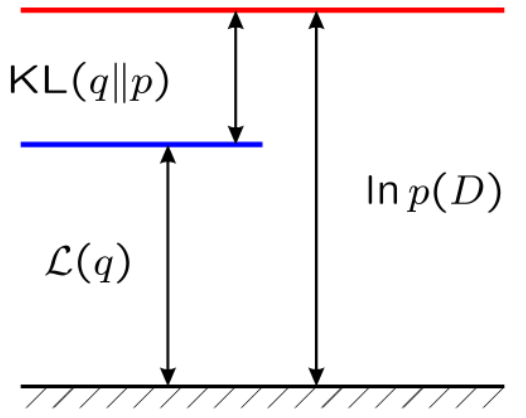
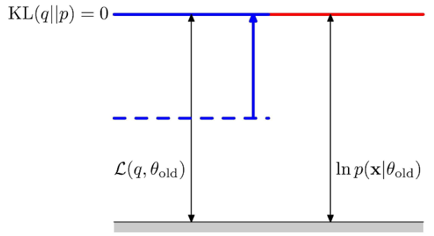
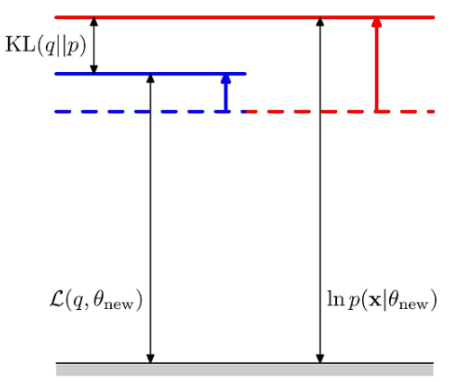
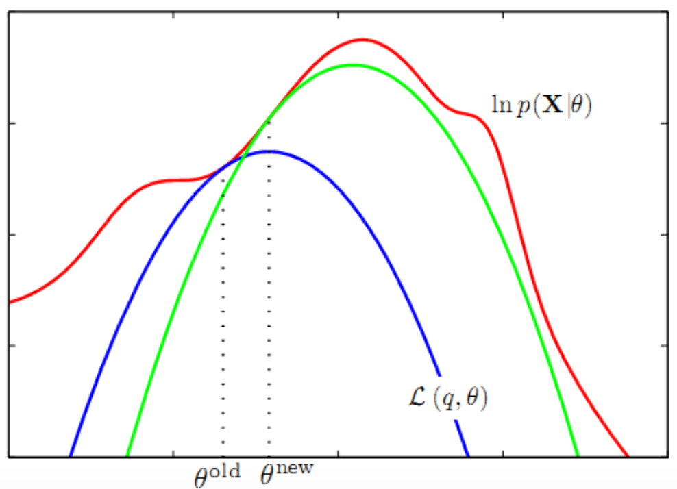
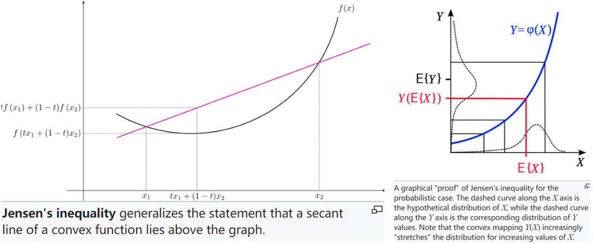
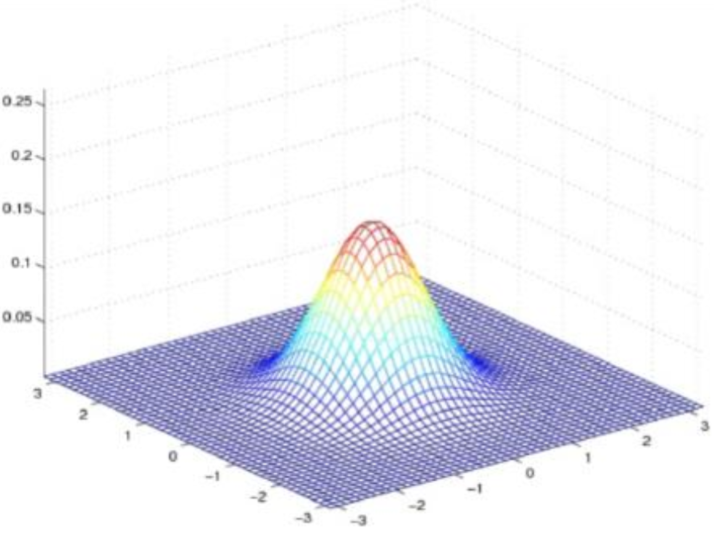
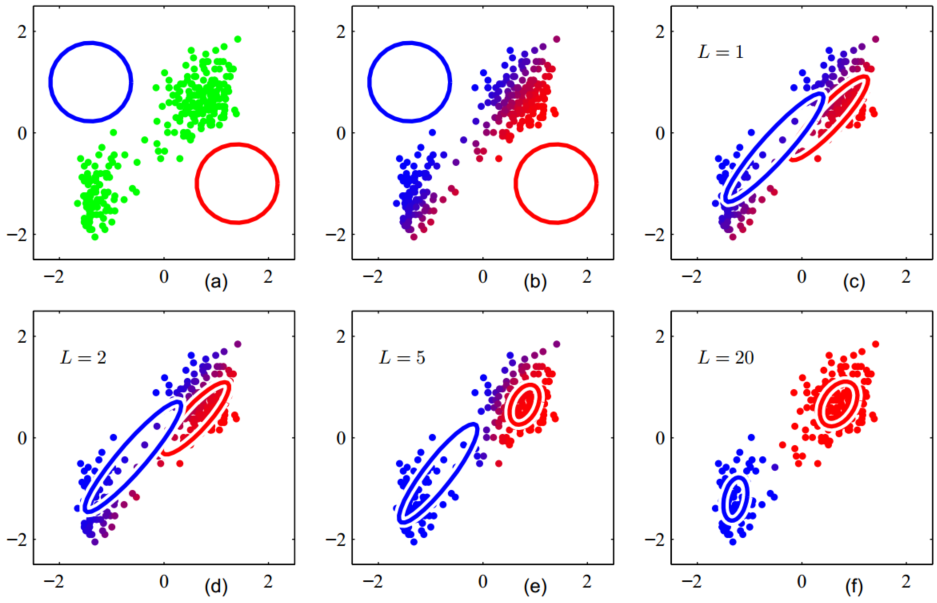

# EM Algorithm

&emsp;&emsp;EM(Expectation maximization)算法，也即期望最大化算法，作为“隐变量”（属性变量不可知）估计的利器在自然语言处理（如HMM中的Baum-Welch算法）、高斯混合聚类、心理学、定量遗传学等含有隐变量的概率模型参数极大似然估计中有着十分广泛的应用。EM算法于1977年由Arthur Dempster, Nan Laird和Donald Rubin总结提出，其主要通过E步（exceptation），M步（maximization）反复迭代直至似然函数收敛至局部最优解。由于其方法简洁、操作有效，EM算法曾入选“数据挖掘十大算法”，可谓是机器学习经典算法之一。

## Introduction

### EM算法推导一

&emsp;&emsp;对于概率模型，当模型中的变量均为观测变量时，我们可以直接使用给定数据通过最大似然估计（频率学派）或贝叶斯估计（贝叶斯学派）这两种方法求解。然而当我们的模型中存在隐变量时，我们将无法使用最大似然估计直接求解，这时即导出EM算法。

&emsp;&emsp;假设一个概率模型中同时存在隐变量$Z$和可观测变量$Y$，我们学习的目标是极大化观测变量$Y$关于模型参数$\theta$的对数似然，即：

$$
L(\theta)=logP(Y|\theta)=log\sum_ZP(Y,Z|\theta)=log(\sum_zP(Y|Z,\theta)P(Z|\theta))\tag{1}
$$

&emsp;&emsp;式（1）中我们假设直接优化$P(Y|\theta)$是很困难的，但是优化完整数据的似然函数$P(Y,Z|\theta)$相对容易，同时利用概率乘法公式将$P(Y,Z|\theta)$展开。然而由于未观测变量$Y$的存在，上式仍求解困难，因此我们通过迭代逐步最大对数似然$L(\theta)$，这里假设第$i$次迭代后$\theta$的估计值为$\theta^i$。根据要求，我们希望新估计的参数$\theta$使$L(\theta)$增加，即$L(\theta)>L(\theta^i)$，且逐步使$L(\theta)$达到最大，因此考虑两者之差：

$$
L(\theta)-L(\theta^i)=log(\sum_zP(Y|Z,\theta)P(Z|\theta))-log(P(Y|\theta^i))=log(\sum_ZP(Z|Y,\theta^i)\frac{P(Y|Z,\theta)P(Z|\theta)}{P(Z|Y,\theta^i)})-log(P(Y|\theta^i))\tag{2}
$$

&emsp;&emsp;这里我们根据Jensen（琴生）不等式：$log\sum_j\lambda_jy_j\geq\sum_j\lambda_jlogy_j，其中\lambda_j\geq0,\sum_j\lambda_j=1$，有：

$$
log(\sum_ZP(Z|Y,\theta^i)\frac{P(Y|Z,\theta)P(Z|\theta)}{P(Z|Y,\theta^i)})-log(P(Y|\theta^i))\geq\sum_ZP(Z|Y,\theta^i)log(\frac{P(Y|Z,\theta)P(Z|\theta)}{P(Z|Y,\theta^i)})-log(P(Y|\theta^i)\tag{3}
$$

&emsp;&emsp;同时由于$\sum_ZP(Y|Z,\theta^i)=1$，式（3）可进一步写为：

$$
\sum_ZP(Z|Y,\theta^i)log(\frac{P(Y|Z,\theta)P(Z|\theta)}{P(Z|Y,\theta^i)})-log(P(Y|\theta^i)=\sum_ZP(Z|Y,\theta^i)log(\frac{P(Y|Z,\theta)P(Z|\theta)}{P(Z|Y,\theta^i)P(Y|\theta^i)})\tag{4}
$$

&emsp;&emsp;因此有：

$$
L(\theta)\geq L(\theta^i)+\sum_ZP(Z|Y,\theta^i)log(\frac{P(Y|Z,\theta)P(Z|\theta)}{P(Z|Y,\theta^i)P(Y|\theta^i)})=B(\theta,\theta^i)\tag{5}
$$

&emsp;&emsp;因此，$B(\theta,\theta^i)$即为$L(\theta)$的下界。故当$B(\theta,\theta^i)$增大时$L(\theta)$也将同时增加，为使$L(\theta)$取得最大，则我们必须在$i+1$次迭代时选择的$\theta^{i+1}$为使第$i$次迭代$B(\theta,\theta^i)$取得最大的$\theta^i$，即：

$$
\theta^{i+1}=arg\;max_{\theta}B(\theta,\theta^i)=arg\;max_{\theta}(L(\theta^i)+\sum_ZP(Z|Y,\theta^i)log(\frac{P(Y|Z,\theta)P(Z|\theta)}{P(Z|Y,\theta^i)P(Y|\theta^i)}))\\
=arg\;max_{\theta}(\sum_ZP(Z|Y,\theta^i)log(P(Y|Z,\theta)P(Z|\theta)))=arg\;max_{\theta}(\sum_ZP(Z|Y,\theta^i)logP(Y,Z|\theta)=arg\;max_{\theta}Q(\theta,\theta^i)\tag{6}
$$

&emsp;&emsp;在上式的求解中我们略去了对求解$\theta$极大化而言的常数项$L(\theta^i)和P(Z|Y,\theta^i)P(Y|\theta^i)$。

&emsp;&emsp;因此在EM算法的每一迭代中，我们均需求解使得$Q(\theta,\theta^i)$取得最大值的$\theta$，使得下一不迭代的$\theta^{i+1}=\theta$，这样如此反复提高最大似然$L(\theta)$的下界，直至逼近$L(\theta)$的最优解（最大值）。

### EM算法推导二

&emsp;&emsp;这里我们采用变分的方法，假设隐变量服从任一分布为$q(Z)$，则$\sum_Zq(Z)=1$。故对于$L(\theta)$同样有：

$$
L(\theta)=logP(Y|\theta)=\sum_Z q(Z)logP(Y|\theta)=\sum_Zq(Z)log\frac{P(Z|Y,\theta)P(Y|\theta)}{P(Z|Y,\theta)}=\sum_Zq(Z)log\frac{P(Y,Z|\theta)}{P(Z|Y,\theta)}\\
=\sum_Zq(Z)log(\frac{P(Y,Z|\theta)}{q(Z)}\frac{q(Z)}{P(Z|Y,\theta)})=\sum_Zq(Z)(log\frac{P(Y,Z|\theta)}{q(Z)}-log\frac{q(Z)}{P(Z|Y,\theta)})=\underbrace{\sum_Zq(Z)log\frac{P(Y,Z|\theta)}{q(Z)}}_{(1)}-\underbrace{\sum_Zq(Z)log\frac{P(Z|Y,\theta)}{q(Z)}}_{(2)}\tag{7}
$$

&emsp;&emsp;记（1）为$\frak L(q,\theta)=\sum_Zq(Z)log\frac{P(Y,Z|\theta)}{q(Z)}$，（2）为$KL(q||p)=-\sum_Zq(Z)log\frac{P(Z|Y,\theta)}{q(Z)}$。其中$KL(q||p)$即为KL散度（相对熵），主要反映变量$q、p$分布的相似性，可以看出KL散度=交叉熵-信息熵，故交叉熵在某种意义上与KL散度等价。有：

$$
L(\theta)=\frak L(q,\theta)+KL(q||p)\tag{8}
$$

&emsp;&emsp;由于$KL(q||p)\geq0$，因此$\frak L(q,\theta)$即为对数似然函数$L(\theta)$的下界。同理在每一次迭代中我们均需要最大化下界$\frak L(q,\theta)$，则在第$i$次迭代中即有：

$$
q(Z)=P(Z|Y,\theta^i)\\
\theta^{i+1}=arg\;max_{\theta}\frak L(q,\theta)=\sum_Zq(Z)log\frac{P(Y,Z|\theta)}{q(Z)}=arg\;max_{\theta}\sum_ZP(Z|Y,\theta^i)log\frac{P(Y,Z|\theta)}{P(Z|Y,\theta^i)}\\
=arg\;max_{\theta}(\sum_ZP(Z|Y,\theta^i)(logP(Y,Z|\theta)-logP(Z|Y,\theta^i))=arg\;max_{\theta}Q(\theta,\theta^i)+const\tag{9}
$$

&emsp;&emsp;式（9）中$-\sum_ZP(Z|Y,\theta^i)logP(Z|Y,\theta^i)$为一常数$const$，故式（8）与式（6）等价。因此，综上可知，EM算法可描述为：

&emsp;&emsp;对于观测变量数据$Y$和隐变量数据$Z$，其联合分布为$P(Y,Z|\theta)$，条件分布为$P(Z|Y,\theta)$：

- Step1. 参数初始化$\theta^0$，开始迭代。
- Step2. E步：记$\theta^i$为第$i$次迭代的参数$\theta$的估计值，则在第$i+1$次迭代的E步中，有：
  
$$
Q(\theta,\theta^i)=E_Z[logP(Y,Z|\theta^i)Y,\theta^i]=\sum_ZP(Z|Y,\theta^i)logP(Y,Z|\theta)
$$

&emsp;&emsp;上式中，$P(Z|Y,\theta^i)$即为给定观测数据$Y$和当前估计参数$\theta^i$下隐变量数据$Z$的条件概率分布。$Q$函数为对数似然函数$logP(Y,Z|\theta)$关于在给定观测数据$Y$和当前模型参数$\theta^i$下对未观测数据$Z$的条件概率分布$P(Z|Y,\theta^i)$的期望。

- Step3. M步：计算使$Q(\theta,\theta^i)$取得极大值的$\theta$，确定第$i+1$次迭代的参数估计值$\theta^{i+1}$，有：

$$
\theta^{i+1}=arg\;max_{\theta}Q(\theta,\theta^i)
$$

- Step4. 迭代Step2，Step3直至收敛。其收敛条件一般为给定较小的正数$\epsilon_1,\epsilon_2$，若满足：

$$
||\theta^{i=1}-\theta^i||<\epsilon_1或||Q(\theta^{i+1},\theta^i)-Q(\theta^i,\theta^i)||<\epsilon_2
$$

&emsp;&emsp;由于目标函数为非凸函数，因此EM算法并不能保证收敛至全局最小值，即EM算法的求解结果与初值的选择有较大关系，该算法对初值敏感。

&emsp;&emsp;上述推导过程可由下图表示：

 
图1. EM算法

&emsp;&emsp;图1即对应式（8），可以看出$logP(Y|\theta)$由$\frak L(q,\theta),KL(q||p)$两部分组成。其中$\frak L(q,\theta)$即为$logP(Y|\theta)$ 的下界。

 
图2. EM算法

&emsp;&emsp;在M步中我们总期望最大化$\frak L(q,\theta)$，即使得$logP(Y|\theta)$ 的下界取得最大，也即最大化对数似然。故此时$KL(q||p)$取得最小值为0。求解最大化$Q$函数，得到$i+1$次迭代变量的估计$\theta$。

 
图3. EM算法

&emsp;&emsp;从图3中可以明显看出在$\theta^i$更新后，对数似然$L(\theta)$的下界$\frak L(q,\theta)$和$KL(q||p)$均得到提高。此时在继续求解$\theta^{i+1}=arg\;max_{\theta}Q(\theta,\theta^i)$。如此反复迭代，通过不断提高的$L(\theta)$下界，使得其取得局部最大值。

 
图4. EM算法迭代过程

&emsp;&emsp;从图4中我们也能明显看出，通过$\theta^i$的反复迭代，我们不断提高对数似然的下界$\frak L(q,\theta)$使之最后收敛于对数似然的局部最大解。

&emsp;&emsp;由上文讨论我们已经知道，通过EM反复迭代，其对数似然的下界将不断提高，然而我们却还是要问对于这种启发式的方法，即下界不断增大的这种方法，其等价于求解对数似然的最大值吗？或者说通过不断优化下界，算法就一定会收敛到似然函数的最大值吗？我们对此能否给出理论证明呢？

## EM算法收敛性的理论证明

&emsp;&emsp;这里我们分别给出两种方法的理论证明。

### 收敛性证明方法一

&emsp;&emsp;这里主要利用变分的思想，参照式（7）有：

$$
log⁡(P(Y│θ))=∫_Zq(Z)log⁡\frac{(P(Y,Z│θ))}{(P(Z│Y,θ)}=∫_Zq(Z)log⁡\frac{p(Y,Z│θ)q(Z)}{P(Z│Y,θ)q(Z)}
=∫_Zq(Z)log⁡(\frac{P(Y,Z│θ)}{q(Z)}×\frac{q(Z)}{(P(Z│Y,θ)})\\
=∫_Zlog⁡\frac{(P(Y,Z│θ)}{q(Z)}q(Z)+∫_Zlog⁡(\frac{q(Z)}{(P(Z│Y,θ)}q(Z)=∫_Zlog⁡\frac{P(Y,Z│θ)}{q(Z)}q(Z)+KL(q(Z)||P(Z│Y,θ))\tag{10}
$$	

&emsp;&emsp;由于$KL(q(Z)||P(Z│Y,θ))\geq0$恒成立，且我们跟据第$i$次迭代参数$\theta^i$估计$q(Z)$有$q(Z)=P(Z|Y,\theta^i)$。故式（10）即为：

$$
logP(Y|\theta^{i+1})\geq∫_Zlog⁡\frac{P(Y,Z│θ^i)}{P(Z|Y,\theta^i)}P(Z|Y,\theta^i)=logP(Y|\theta^i)\tag{11}
$$

&emsp;&emsp;故对于每一次的迭代均能保证$logP(Y|\theta^{i+1})\geq logP(Y|\theta^i)$，即可将EM算法理解为在变量坐标空间内，利用坐标下降法最大化对数似然下界的过程，故算法最终能够收敛至局部极小值点。

### 收敛性证明方法二

&emsp;&emsp;这里我们使用Jensen不等式进行证明，即对于凸函数$\phi,$有$\phi E[f(x)]\leq E[\phi(f(x))]$，故$-logE[f(x)]\leq E[-log(f(x))]\implies E[log(f(x))]\geq logE[f(x)]$（其中$-log(x)$为凸函数）。因此有：

$$
log⁡(P(Y│θ))=log⁡∫_Zq(Z)P(Y|\theta)\geq∫_Zq(Z)logP(Y|\theta)=∫_Zq(Z)log\frac{(P(Y,Z│θ))}{(P(Z│Y,θ)}\tag{12}
$$

&emsp;&emsp;同样跟据第$i$次迭代参数$\theta^i$估计$q(Z)$，则式(12)为：

$$
logP(Y|\theta^{i+1})\geq∫_Zlog⁡\frac{P(Y,Z│θ^i)}{P(Z|Y,\theta^i)}P(Z|Y,\theta^i)=logP(Y|\theta^i)\tag{13}
$$

&emsp;&emsp;故算法最终能够收敛至局部极小值点。

 
图5. Jensen不等式

## GMM

&emsp;&emsp;与K-Means聚类不同，高斯混合聚类采用概率模型来刻画每个样本的簇类，即为一种“软划分”方法。这里我们首先回忆多元高斯模型。

&emsp;&emsp;对于$n$维样本空间$\chi$中的随机向量$x$，$x$服从高斯分布$x$~$N(\mu,\sum)$，其概率密度函数如下：

$$
p(x)=\frac{1}{(2\pi)^{\frac2n}||sum|^{\frac12}}e^{-\frac12(x-\mu)^T\sum^{-1}(x-\mu)}\tag{14}
$$

&emsp;&emsp;其中$\mu$为$n$维均值向量，$\sum$为$n\times n$协方差矩阵。如下图所示：

 
图6. 多元高斯变量

&emsp;&emsp;这里假设存在$k$个簇，且每一个簇均服从高斯分布。我们以概率$\pi_k$随机选择一个簇$k$，并从该簇的分布中采样样本点，如此得到观测数据$X$，则其似然函数为：

$$
P(X|\theta)=P(X|\pi,\mu,\sum)=\sum_{n=1}^Nln{\sum_{k=1}^K\pi_kN(x_n|\mu_k,\sum_k)}\tag{15}，其中\sum_{k=1}^K\pi_k=1,0\leq\pi_k\leq1
$$

&emsp;&emsp;观察式（15）发现函数$P(X|\theta)$由于$log$中有求和运算，所有参数均耦合在一起，故求导困难，因而梯度下降优化较为困难。因此我们有必要采用一种新的优化算法。

&emsp;&emsp;这里首先我们令$\frac{\partial P(X|\theta)}{\partial \mu_k}=0$，则有：

$$
-\sum_{n=1}^K\frac{\pi_kN(x_n|\mu_k,\sum_k)}{\sum_j\pi_jN(x_n|\mu_j,\sum_j)}\sum_k^{-1}(x_n-\mu_k)=0\tag{16}
$$

&emsp;&emsp;这里我们记$\gamma(z_{nk})=\frac{\pi_kN(x_n|\mu_k,\sum_k)}{\sum_j\pi_jN(x_n|\mu_j,\sum_j)}$，则$\gamma(z_{nk})$可以看为由参数$\mu_k,\sum_k$对应的观测变量$x_n$的后验概率，即$x_n$从属于第$k$个簇的一种估计，或权值或“解释”。同时对式（16）左右两边同时乘以$\sum_k$，并进行移项操作，有：

$$
\mu_k=\frac{1}{N_k}\sum_{n=1}^N\gamma(z_{nk})x_n\\
N_k=\sum_{n=1}^N\gamma(z_{nk})
\tag{17}
$$

&emsp;&emsp;同理我们令$\frac{\partial P(X|\theta)}{\partial \sum_k}=0$，有:

$$
\sum_k=\frac{1}{N_k}\sum_{n=1}^N\gamma(z_{nk})(x_n-\mu_k)(x_n-\mu_k)^T\tag{18}
$$

&emsp;&emsp;最后我们考虑混合系数即变量$\pi_k$，同理最大化对数似然$lnP(X|\pi,\mu,\sum)$。然而由式（15）知$\pi_k$需满足约束条件$\sum_{k=1}^K\pi_k=1$，故这里我们引入拉格朗日乘子法，即最大化下式：

$$
lnP(X|\pi,\mu,\sum)+\lambda(\sum_{k=1}^K\pi_k-1)\tag{19}
$$

&emsp;&emsp;式（19）对$\pi_k$求偏导为0有：

$$
\sum_{n=1}^N\frac{\pi_kN(x_n|\mu_k,\sum_k)}{\sum_j\pi_jN(x_n|\mu_j,\sum_j)}+\lambda=0\tag{20}
$$

&emsp;&emsp;上式两边同时乘以$\pi_k$，有：

$$
\pi_k=-\frac{\sum_{n=1}^N\frac{\pi_kN(x_n|\mu_k,\sum_k)}{\sum_j\pi_jN(x_n|\mu_j,\sum_j)}}{\lambda}=\frac{-N_k}{\lambda}\tag{21}
$$

&emsp;&emsp;这里我们将$\sum_{k=1}^K\pi_k=1$对$k$进行求和，则有$\lambda=-N$，故：

$$
\pi_k=\frac{-N_k}{N}\tag{22}
$$

&emsp;&emsp;这里需要注意的是由于$\gamma(z_{nk})=\frac{\pi_kN(x_n|\mu_k,\sum_k)}{\sum_j\pi_jN(x_n|\mu_j,\sum_j)}$，中仍存在隐变量$\pi_k$，并非为封闭解，故我们需要根据EM算法求解。具体如下：

- Step1. 初始化参数并计算对数似然；
- Step2. E步：依据当前模型参数，计算观测数据$x_i$属于簇$k$的概率（从属度）：

$$
\gamma(z_{ik})=\frac{\pi_kN(x_i|\mu_k,\sum_k)}{\sum_j\pi_jN(x_i|\mu_j,\sum_j)}
$$

- Step3. M步：基于当前参数最大化对数似然函数，即重新求解新一轮迭代参数（第$i+1$轮）：

$$
\mu_k=\frac{1}{N_k}\sum_{n=1}^N\gamma(z_{ik})x_n;\quad\sum_k=\frac{1}{N_k}\sum_{n=1}^N\gamma(z_{nk})(x_i-\mu_k)(x_i-\mu_k)^T;\quad \pi_k=\frac{\sum_{n=1}^n\gamma(z_{ik})}{N}
$$

- Step4. 反复迭代直至收敛。

&emsp;&emsp;至此我们已经给出了EM算法求解GMM模型的具体方法。对比GMM与K-Means方法，我们可已看出由于概率的引入使得点到簇的从属关系为软分配，故其可以被用于非球形簇。

 

图7. GMM聚类过程

&emsp;&emsp;上图即为GMM算法的聚类过程。EM算法求解结果为局部最优解，其在隐变量的估计中应用广泛。

 
图8. GMM与K-Mean算法比较

&emsp;&emsp;由上图可以明显看出GMM相较于K-Means聚类有更佳的效果。

## Variants

&emsp;&emsp;由于EM算法是只能收敛至局部极小值点，其对初值敏感。为克服这一缺陷，各种各样的启发式搜索算法如模拟退火法（其能较好的收敛至全局最优解）、随机重复爬山法等，通过多次随机的参数初始化或一定概率拒绝当前解从而使算法收敛至全局最优。此外卡尔曼滤波的思想同EM算法结合从而发展了Filtering and smoothing EM algorithms，以解决联合状态参数估计问题。共轭梯度与拟牛顿法也在EM中得到了应用。参数扩展期望最大化算法（PX-EM，parameter-expanded expectation maximization）通过协方差的调整引入额外的信息来修正M步中参数的估计以加速算法收敛。$\alpha-EM$由于不需要计算梯度或Hessi矩阵而使得算法收敛更快，同时也因而派生出了$\alpha-HMM$算法。

## Reference

[[1] Dempster A P. Maximum likelihood estimation from incomplete data via the EM algorithm (with discussion[J]. Journal of the Royal Statistical Society, 1977, 39(1):1-38.](http://web.mit.edu/6.435/www/Dempster77.pdf)

[[2] Jensen's inequality - Wikipedia](https://en.wikipedia.org/wiki/Jensen%27s_inequality)

[[3] Bishop C M, 박원석. Pattern Recognition and Machine Learning, 2006[M]. Academic Press, 2006.](http://users.isr.ist.utl.pt/~wurmd/Livros/school/Bishop%20-%20Pattern%20Recognition%20And%20Machine%20Learning%20-%20Springer%20%202006.pdf)

[[4] Expectation–maximization algorithm - Wikipedia](https://en.wikipedia.org/wiki/Expectation%E2%80%93maximization_algorithm)
