# Explainable Recommendation System

## 1.Introduction

&emsp;&emsp;互联网技术的飞速发展使得e-commerce，例如Amazon、Yelp、Youtube、淘宝、大众点评以及social software，如Twitter、微博等应用程序渗透至我们日常生活的方方面面，同时也无时无刻的搜集我们的行为数据。一方面站在商家的角度，如何很好的利用累计的用户数据信息，包括：用户人口统计学信息、历史行为数据、社交信息、评论数据等以增加商品的点击率（CTR，click through rate）、转化率进而提高收益金额，这是一个十分关键而又具有重大价值的问题。同时对于我们消费者而言，如何利用推荐系统跟好的帮助用户快速且精确的发现喜爱物品，以提高软件的粘性这也是一个极大的挑战。因此，推荐系统的一个主要目的是在海量的数据中（主要是为解决信息过载的问题）抓住用户的POI（point of interset）同时针对不同的POI去帮助user发现更好item，实现个性化推荐。最近，研究人员也更多的关注于可解释性推荐，即推荐系统不仅需要给出推荐的list，其具有较高的precision and recall，同时还应该对于推荐的结果给出合理的理由，以增加推荐的可解释性和说服力，增加用户的信任度。接下来，本文将对最近有关可解释性推荐的paper进行简要的说明和分类。

### 1.1 Explainable Recommendation System

&emsp;&emsp;推荐系统的应用场景主要包括e-commerce，social network，information retrieval，multimedia recommendation以及其它的专有、特殊邻域。传统的推荐系统主要是基于user和item历史行为数据的协同过滤（CF，collaboration filtering）(J. Herlocker etal. 2000)，即矩阵分解（matrix factorization）技术，神经网络，如RBM（Restricted Boltzmann Machine）(Abdollahi B et al.
2016)，概率图模型，如LDA（Latent Dirichlet Allocation）(Blei D M et al. 2003)、pLSA（probabilistic latent semantic analysis）(Eisenstein J et al. 2010, Hong L et al. 2012, Sizov S. 2010, Yuan Q et al. 2013)等话题模型。上述的这些方法一般是将user或item的表面特征或属性映射至高维空间的invisible representation。而这些embedding的操作使得模型变为一个黑箱难以解释。可解释型推荐则试图去给出推荐的理由，目前较多的可解释性推荐系统是post-hoc的模型，其主要包括MF-based和NN-based。有关话题模型、矩阵分解的相关介绍可以参考我的这几篇笔记：[情感分析中的PLSA、LDA模型](https://zhuanlan.zhihu.com/p/54168587)、[概率图模型](https://zhuanlan.zhihu.com/p/54101808)。

### 1.2 Traditional Methods

&emsp;&emsp;Matrix Factorization

&emsp;&emsp;矩阵分解技术或latent factor model主要是基于neighborhood的CF模型，即相似的人会喜欢相似的物品或相似的物品会被相似的人喜欢。因此我们可以基于用户的历史行为数据选择最相似的前$N$个item，以推荐给相似的人。例如，user A like item a, and user B is similar to user A, then user B is more likely to like item a, $< A like a, A similar B \to B like a >$，或者 if user A like item a, item a is similar to item b, then user A is possible like item b, $< A like a, a similar b \to A like b >$。上述方法主要是利用user-item的历史行为数据所构成的matrix进行推荐，而这一矩阵是稀疏、高维的，一个很自然的想法则是通过两个较小的稠密矩阵（分别代表）去重构原始矩阵即矩阵分解技术，如图1所示。我们可以利用矩阵分解技术去预测user $u$对itme $i$的preference，$\hat r_{ui}$，如式1：

 
图1. 矩阵分解

$$
L=\sum_{(u,i)\in K}(r_{ui}-\hat r_{ui})^2=\sum_{(u,i)\in K}(r_{ui}-\sum_{k=1}^Kp_{u,k}q_{i,k})+\lambda(||p_u||^2+||q_i||^2)\tag{1}
$$

&emsp;&emsp;上式中$p_{u,k}$和$q_{i,k}$即为user和item的latent representation。而$\lambda(||p_u||^2+||q_i||^2)$即为正则化项。同时我们可以在正则化项和目标函数中融入更多的数据、信息以提高模型的准确率和可解释性，如BRP(Rendle, 2009)，NMF(Zhang, 2006)，SVD++(Koren, 2008)等等。

&emsp;&emsp;Latent factor model

&emsp;&emsp;LFM可以理解为概率图模型或概率矩阵分解技术，在文本数据挖掘邻域，话题模型如LSA、pLSA、LDA等得到了主要应用。尤其是在Netflix Prize竞赛中，LFM模型逐渐成为了一种主流的方法并得到了大量应用。概率图模型认为用户的兴趣和item的attributes服从某一概率分布（Gaussian distribution），同时该分布可由评论文本或其它factors观察而得，而其对应的laten factory时常耦合在一起，因此我们一般利用EM算法、MCMC采样进行极大似然估计或使用梯度下降求解。图二即为PMF模型的盘式图。

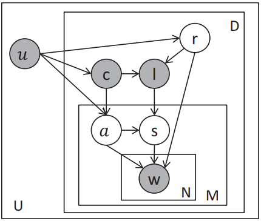
 
图2. PMF

&emsp;&emsp;上图中$R_{ij}$表示user $i$对item $j$的preference。$U_i,u_j$表示user和item的latent factor，且均服从Gaussian分布。$I_i$为指示函数，如果$R_{ij}$存在则为1，否则为0。$Y$为original unrevised $U$，$W$为潜在的相似矩阵，其值反映item对user的influence，其也服从Gaussian distribution。基于概率图模型，我们同样可以将其他的外部辅助信息如item attributes，sentiment，geographic information等引入其中以提高模型的可解释性。

&emsp;&emsp;RBM

&emsp;&emsp;受限玻尔兹曼机可以被认为是一种浅层的神经网络或一个encoder-decoder machine，其将recommendation problem转化为prediction problem或regression problem (Ruslan et al, 2007)。其模型的输入为user和item的feature embedding，而output则是不同用户针对不同item的prediction scores。对于特征的选择则有存在很多模型、方法，其中较为出名的则包括Google的Wide&Deep network (Ruslan et al, 2007)。

&emsp;&emsp;Others

&emsp;&emsp;Corrlation-based，distance-based这种方法基于不同item属性间的相似度、距离（Cosine、Pearson correlation、OLS coefficient、Euclidean distance、Minkowski distance等）来进行推荐。Graph-based model将user-item pairwise转化为二分图，然后利用nodes或edges weights及其间的link，同时结合Shortes Path, Random Walk, Item Rank等算法进行推荐。Cluste-based则是基于“物以类聚，人以群分”的思想进行推荐，即性格相似的人可能会喜欢相同的物品，其中LSH（Locality Sensitive Hashing）(Nima et al, 2013)即为cluster的代表。事实上，CF和LDA也可以看作某种聚类的方式。

&emsp;&emsp;传统的方法在推荐系统中发挥了重要的作用，如RBM和MF相结合的方法则在Netflix Prize竞赛中展现了强大的能力。然而传统的方法缺乏可解释性，这也严重阻碍了推荐系统的发展，可解释性推荐已成为目前研究的热点。

## 2.Related Work

&emsp;&emsp;研究表明，可解释推荐系统可以提高推荐产品的接受度，说服用户购买推荐产品，加快决策过程，甚至可以增强系统的整体信任度(Herlocker et al., 2000)。其方法主要包括：Neural Nework、Probability Graphic Model、Matrix Factorization、Graphic Model等。

### 2.1 Neural Network

&emsp;&emsp;神经网络认为推荐任务即为预测问题，其将user’s和item’s features或attribute的embedding送入至神经网络，同时获得candidate sets的scores。有关网络结构的构建则存在较多的方法，如attention mechanism，memory network，reinforcement learning等。而Neural Network中对于external information的融入则可以通过Knowledge Graph、social network等实现。

&emsp;&emsp;Tree-enhanced Embedding Model

&emsp;&emsp;协同过滤利用user和item的特征实现推荐，然而，这些高维特征不可解释。而基于“分而治之”的决策树分类器其通过特征的选择实现分类或回归，其本身具有较强的可解释性，如图3所示，因此很自然的想法是利用决策树的选择特征训练网络实现推荐。Tree-enhanced Embedding Model (Wang et al, 2018)即利用GBDT（Gradient Boosting Decision Tree）作为网络的前驱进行特征筛选，然后将所得特征以及user、itme ids进行Embedding送入至网络，同时结合attention机制（考虑到不同的用户关注item的不同aspects）得到推荐结果。同时，基于决策树的特征选择，该工作也能提供一定的可解释性。有关GBDT等树分类器的介绍可以参看我的这篇笔记：[集成学习中的XGBoost](https://zhuanlan.zhihu.com/p/51666869)。

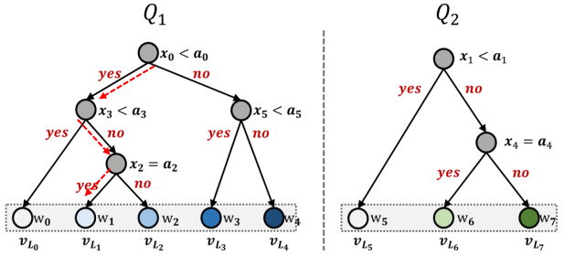
 
图3. GBDT特征选择

 
图4. TEM模型

&emsp;&emsp;RBM for CF

&emsp;&emsp;最早的基于RBM的推荐系统选择item feature作为输入实现推荐，其缺乏可解释性，而CF相较于RBM有一定的可解释性但是精度较低。因此如何将CF和RBM相结合这是一个研究的方向。Behonoush (Behnoush et al, 2016)则将CF的results，即用户neighbors的item's score和movie rating输入至RBM中去得到recommendation scores。如图5：

 
图5. Conditional RBM for explainable

&emsp;&emsp;Convolutional Sequence Embedding

&emsp;&emsp;典型的序列模型如RNN、LSTM、GRU其结合历史信息得到current output。然而，在推荐的任务中其并非是所有历史数据对当前的决策有帮助，即购买行为并没有十分明显的序列特征，可能很久之前的某一次购买能够影响目前的决定，而最近的购买行为则与本次购买无关。因此Tang (Tang et al, 2018)提出使用CNN模型去获取“上下文”关系以获得推荐。此外，该作者还提出分别使用horizon convolution filters和vertical convolution filters去对item embedding进行卷积操作以分别获得 union-level patterns和point-level sequential patterns，如图6所示，其中卷积核的大小为4，即每次卷积融相邻4次购买行为的信息，输出结果为预测后两次的购买行为。

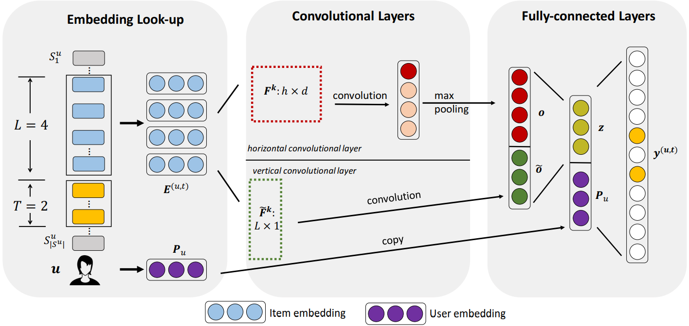
 
图6. Convolutional Sequence Embedding

&emsp;&emsp;Sequential Recommendation with User Memory Networks

&emsp;&emsp;与上篇文章不同的是次项工作对用户行为进行序列建模，但是为更好的筛选历史信息同时避免最近的行为有较大的影响，Chen (Chen et al, 2018)基于RNN提出memory network。Memory network（其本质为a routing mechanism）采用current item去决定利用哪些历史的item information，然后利用personal intrinsic embedding去进行预测，同时更新memory matrix。具体来说，作者提出了两种memory network：item-based和feature-based。其中，item-based model仅embedded item，同时add current item embedding以更新memory。而feature-based model则是关注item’s feathure，其利用当前的item feature更行memory，具体做法是利用当前item embedding对原始memory进行加权求和，同时结合current item embedding以更新memory，如图7。

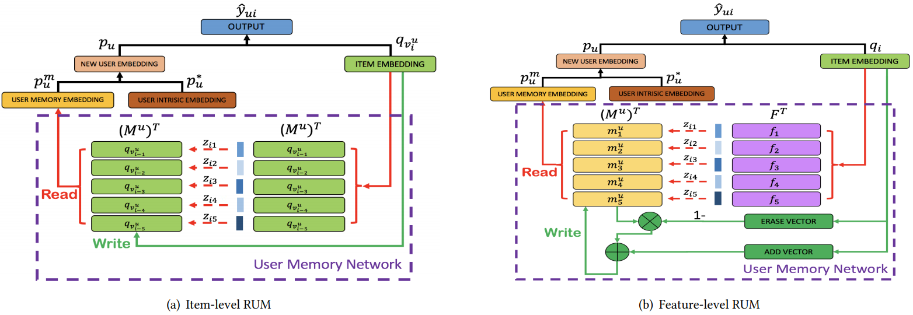
 
图7. Sequential Recommendation with User Memory Networks

### 2.2 Probability Graphic Model

&emsp;&emsp;用户的购买行为一般由许多潜在因素（latent factor）所决定，而这些latent factor又时常耦合在一起，因此我们可以利用概率图模型建模，通过挖掘个潜变量间的相互关系得到最终的prediction，同时使得推荐可解释。

&emsp;&emsp;Sentiment-Aspect-Region model

&emsp;&emsp;概率图模型的一大优点是能够较为方便的引入新的变量即外部特征，同时能够较为清楚的表示变量间的相关关系（至2002年LDA模型由吴恩达提出后，此后几年不少研究工作均是在此基础上引入更多的latent factor，同时考虑更为复杂的相互关系而进行研究的），这也使得auxiliary information的融入更加容易。Zhao (Zhao et al, 2015)提出SAR模型，该模型通过结合同一时间的sentiment-aspect-region、基于review以及item类别的user preference和地理位置信息（文中为经纬度）建立概率图模型计算score同时进行推荐，如图8所示。

 
图8. Sentiment-Aspect-Region Model

&emsp;&emsp;图8中，$u,l,c,r,a,s,d,w,U,L,D,N$分别代表 user, individual POI, category, topical-region, review, word, set of users, set of POIs, set of reviews, the number of sentences in a review and the number of words in a sentences。其间的相互关系可由概率图模型表示。

&emsp;&emsp;Aspect-based Latent Factor Model

&emsp;&emsp;这篇文章中作者(Lin et al, 2016)分别从user和item的角度充分挖掘评论信息，同时使用概率图模型进行推荐。与LFM相比，该工作主要涉及三个latent factor：（1）user-review matrix，其中的每一个元素为用户评论中的词频，其可以一定程度上反应该item的类别；（2）item-attribute matrix，其主要由item-property matrix（反映products某些特殊的aspect的受关注程度）和item-quality matrix（通过统计review中positive和negative words的数量来反映item的质量）；（3）rating matrix。通过上述三个matrix预测最终的点击率，如图9所示。

 
图9. LFM

&emsp;&emsp;上图中$r,u,v,p,a,q,b$分别代表rating，user的latent factor，item的latent factor，用户评论的feature words，words distributation（代表从user review中学习所得的semantic information），item评论的feature words，以及words distributation（代表从item review中学习所得的semantic information）。该模型不仅在Amazon dataset的许多类别上获得了state-of-the-art，同时也缓解了冷启动的问题。

&emsp;&emsp;有关概率图模型的一些介绍可以参考我的这篇笔记：[概率图模型](https://zhuanlan.zhihu.com/p/54101808)。

&emsp;&emsp;Matrix Factorization

&emsp;&emsp;矩阵分解技术的主要思想是将一个高维、稀疏的user-item matrix分解为两个分别代表user和item潜在特征的稠密的小矩阵表示。同时在矩阵的学习构造过程中我们可以引入外部信息、先验知识实现可解释性推荐。

&emsp;&emsp;Overlapping Co-clustering Model

&emsp;&emsp;传统的MF技术仅将一个user-item matrix分解为两个矩阵表示，即进行一次分解，将每一个item对应至一个specific class中。但是考虑到每一个item将包含不同层面的attributes，同时每一个用户也不单单尽关注item的某一个aspects，故Thus Reinhard (Reinhard et al, 2017)提出利用 overlapping co-clustering实现推荐，该模型同过指定class or cluste的数目，也即矩阵分解的次数，可以实现将同一item分配至不同的类别中，同时作者还证明了算法的时间复杂度为线性的且能够很好的支持并行操作，如图10。

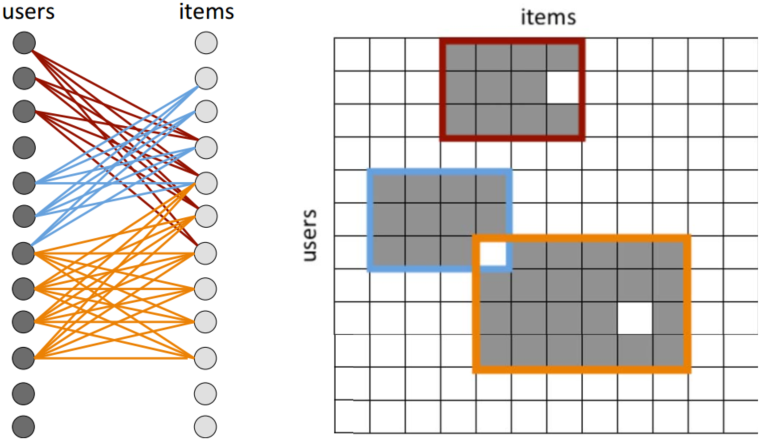
 
图10. overlapping user-item co-clusters

&emsp;&emsp;图10中，白色方块即代表同时属于不同class的item，蓝色、橙色和红色的矩形框则代表不同的cluster。

&emsp;&emsp;AFM

&emsp;&emsp;在现实中经常会遇到这样一些情况，即不同的用户对于同一商品可能会给出相同的打分，但是他们对与同一商品的关注点可能不同，同时，不同商品获得相同得分的原因也不尽相同。故Hou (Hou et al, 2019)提出AFM（aspect matrix model），其从user和item两方面考虑，给出推荐，如图11所示。此外，作者还定义SDA，通过考虑不同aspect给出用户对item的满意度。

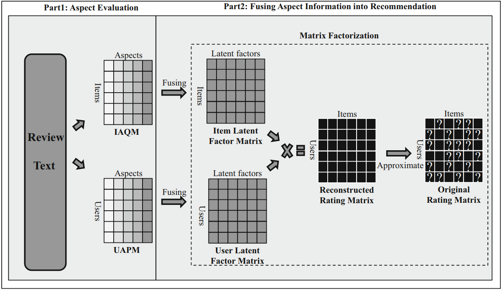
 
图11. AFM

&emsp;&emsp;从图11中可以看出，AFM利用review分别构造两个矩阵：IAQM和UAPM，其分别代表item latent factor matix和user latent factor matrix，并在此基础上重构rating matrix实现推荐。

&emsp;&emsp;Multi-Task Learning in Opinionated Text Data

&emsp;&emsp;用户对商品的喜爱程度可以由打分决定，而喜爱的原因则需要通过分析评论获得，如图12所示。因此基于text mining technology抽取用户关注的item的不同层面进行推荐，该方法具有一定的可解释性。对此，我们不仅需要对用户对item的preference进行建模，同时还要关注item的不同层面，Wang (Wang et al, 2018)利用multi-task learning并结合tensor factorization去表示preference和opinion，如图13所示。

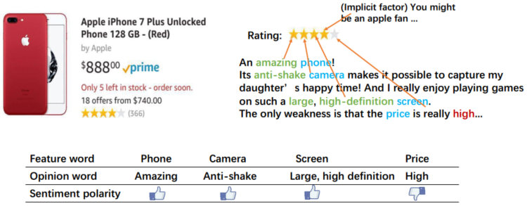
 
图12. Example of a star rating and a text review of a phone

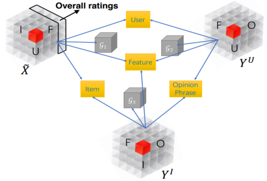
 
图13. Joint tensor decomposition scheme

&emsp;&emsp;图12中$I,F,U,O$为item，feature，user和opinion phrase latent factors。同时joint tensor $\tilde{X},Y^I,Y^U$可以分解为user、item、feature和opinion的latent representation。

&emsp;&emsp;Post Hoc Interpretability of Latent Factor Models

&emsp;&emsp;尽管基于最近邻的系统过滤推荐方法可以给出一定的可解释性，但其是post hog的（即根据推荐结果寻找最近邻居给出推荐理由），而且该方法忽视了neighbor item间的内在因果连接。同时关联规则则能在一定程度上给出因果解释。对此一个动机为结合association rules和CF进行推荐，Georgina (Georgina et al, 2018)首先根据MF得到的top N recommendation list，然后结合关联规则提供推荐原因，如图14所示：

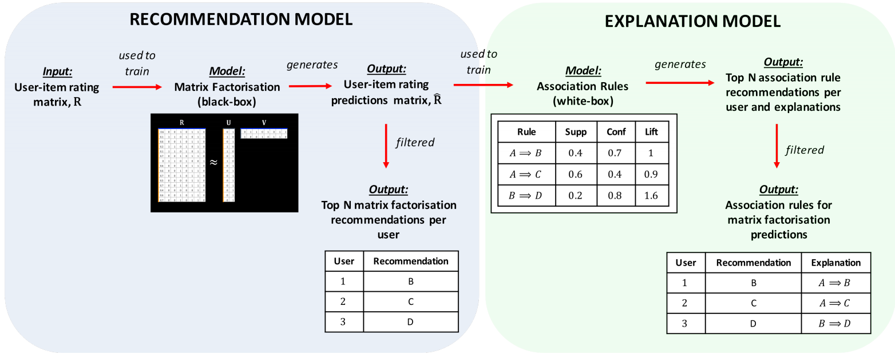
 
图14. Post Hoc Interpretability of Latent Factor Models

&emsp;&emsp;Learning to Rank

&emsp;&emsp;较多的推荐系统使用MSRE作为rating、score、preference的评价指标和优化目标。然而在实际中我们并不太在意推荐物品的具体分数，相反我们更关注推荐物品的排序，如图15所示。对此Xu (Xu et al, 2016)提出使用item和user的feature去学习排序以替代RMSE，提高推荐的有效性。具体来说，该模型通过构造preference pairs，将item间的绝对排序转换为相对排序去capture items' rank。  

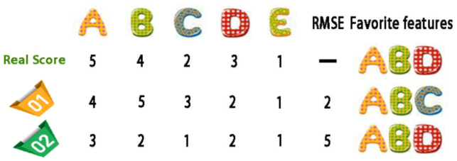
 
图15. RMSE vs Ranking

### 2.4 Graphic Model

&emsp;&emsp;与概率图模型不同的是，图模型利用节点和边分别表示实体和实体间的关系，例如social network，telecommunication network，knowledge grap（其本质为三元组，包括头实体、尾实体和关系。同时可以使用neural network去学习实体和关系表示，如TransE (Antoine et al, 2013), TransH (Wang et al, 2014), TransR (Lin et al, 2015)）。对于推荐系统user、item即可以认为实体，利用attributes间的关系建立实体连接，同时也可以利用用户的消费行为建立图模型。

&emsp;&emsp;Entity-based Recommendations with Knowledge Graphs

&emsp;&emsp;item的attributes间其天生就具有某种联系，对此我们可以基于知识图谱和图论中的相关算法去挖掘其间的联系，进行link prediction、recommendation。比如user A喜欢《伊豆的舞女》，而《伊豆的舞女》由川端康成所写；同时川端康成也创作了《东京人》，则我们可以将《东京人》推荐给用户A。基于这一思想Rose (Rose et al, 2017)则将知识图谱与推荐系统结合，其推荐的规则如图16所示。

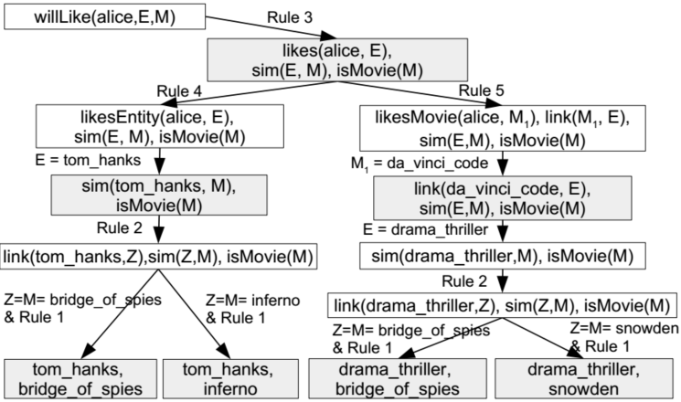
 
图16. Sample grounding for predicting likes

&emsp;&emsp;有关知识图谱的介绍可以参考我的这篇文章[知识图谱](https://zhuanlan.zhihu.com/p/53753234)。

&emsp;&emsp;A Social Explanation System

&emsp;&emsp;社交数据也可以被用于推荐系统中，Lara (Lara et al, 2017)提出三个social factors：（1）Personality，其基于用户的主要购买行为反映用户的personality；（2）Tie strength，该值由用户的社交数据如Facebook等确定；（3）Satisfaction，该值由用户直接给出，同时根据用户的feedback实时更新。社交信息的融入在一定程度上增加了用户的可解释性。

&emsp;&emsp;TriRank

&emsp;&emsp;类似于知识图谱，He (He et al, 2015)利用item，user和aspect建立tripartite graph，并将其拆分为两个subnets：User-Item structure and Item-Aspect structure，如图17。此后，基于smoothness（相邻的顶点具有相似的分数）和fitting encodes prior belief（预测值和真实值不应有较大的偏差）则两个原则去优化莫得了。通过考虑每一item的不同层面我们可以实现可解释性推荐同时提高进度。

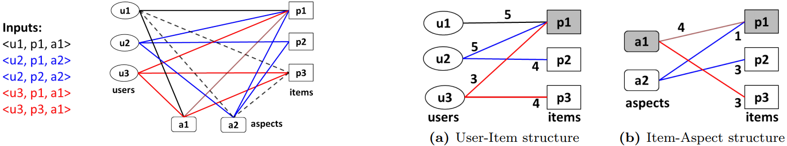
 
图17. Tripartite structure and decomposed graphs

&emsp;&emsp;上图中$u,a,p$即为user、item和aspect representation

### 2.5 Explainable Recommendation Methods Summary

&emsp;&emsp;如表1所示，我们对上述方法进行分类，同时给出融入的外部信息。

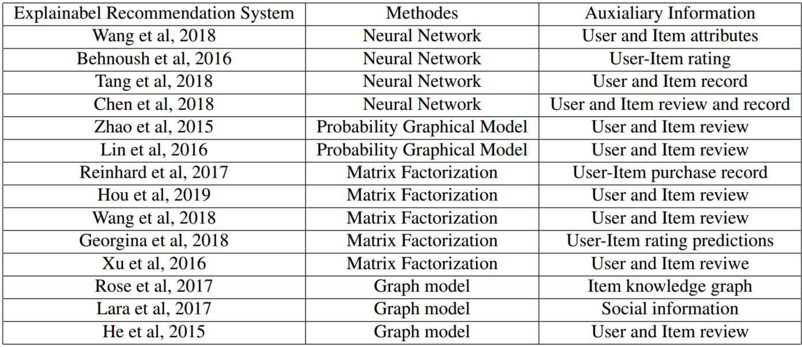
 
表1. A classification of above explainable recommendation models

## 3. Major Challenge and Open Question

&emsp;&emsp;目前的对于可解释性推荐的主要工作一般关注以下几点：
- 融入更多的外部数据、先验知识和辅助信息。例如基于item attributes的知识图谱，用户的社交数据、文本评论、时间和空间信息等；
- 从这些数据中挖掘出不同层面的信息。例如item’s feature and aspect, user’s preference, item’s quality, user’s historical behaviors, user’s friends’ evaluation等；
- 模型的改善。集合attention、memory机制等，引入强化学习，改变优化目标函数等；

&emsp;&emsp;现有的挑战和问题：
- 现在几乎所有的评测指标均是基于用户score和rating提出的，例如RMSE, NDCG, precision, recall, F1等，但是这些指标均无法和好的反映用户的满意度以及系统的可解释性。若想要真正验证系统的有效性我们必须进行线上AB测试。此外一个好的推荐系统必须具有一定的exploration或者serendipity，即不仅仅是向用户推荐一些super popular的产品、服务，更重要的是帮助用户去发现其潜在的兴趣爱好，使推荐的物品具有一定的惊喜度，而如何衡量惊喜度这是一个问题；
- 现有的推荐算法，尤其是协同过滤，其总是偏向于热门商品，此外商品的点击率也总是呈skew distribution或long tail distribution，即20%的商品得到了80%，甚至90%的关注，而剩下的商品则被关注的较少。现在的许多推荐算法往往倾向于推荐热们商品而非真正基于user's POI。因此推荐系统也必须增加冷门物品的曝光机会，从而提高recommendation system的覆盖率和多样性；
- 时间或存储空间的成本问题。现有的大多数工作均是基于小部分特定领域的数据进行off-line评测的。然而，在实际应用中，对于大型网站其面对的将是数百万的商品，数亿甚至十亿的用户，同时每天所积累的用户和商品数据也是海量的，如何实现实时的推荐，如何更行推荐的结果，如何平衡用户数据和算法间的trade-off，这是一个工程问题；
- 一个好的推荐系统一定拥有一个良好的人机交互（human-computer interaction，HCI），我们如何设计HCI，同时从HCI中获得用户对系统的反馈，这是一个很大的问题；
- 推荐系统的抗攻击性。设计到利益的系统均需要面都被攻击的风险，作弊和反作弊的对抗在搜索引擎中尤文严重，而在推荐系统中也同样存在类似问题。如何提高推荐系统的抗攻击性以避免垃圾商品获得较高排名这是一个巨大的挑战；
- 冷启动问题仍旧存在；

## 4. Future Directions and Promissing Tpois  

- 融入更多的外部信息和异质数据。这似乎是所有深度学习任务较为通用的方法，对于推荐系统而言因为是如此。随着5G的到来，数据的形式将更加丰富，如何将text,image,video,audiao这些hybrid data应用至推荐系统中这将是未来研究的一个关注方向；
- Knowledge-enhance的推荐系统。Knowledgeable graph在许多NLP任务中，如阅读理解等已得到不少应用。对于推荐系统，我们将item或user embedding为图中实体，利用图算法或图网络进行推荐，同时实现推荐的可解释性，该方向未来将得到广泛关注；
- 专有邻域的推荐。目前的绝大多数工作均是关注于2C端，而对于政府机构、国有企业、科研院所等2B端，其涉及的单比交易规模十分巨大，这也要求了推荐结果的可解释性更强、更具说服力。此外，这类机构的购买行为和目的往往是明确的，因此我们更需要关注其本身的特点进行经验

&emsp;&emsp;深度学习经过近10年的发展，其以得到广泛的应用。然而其模型的不可解释性往往被许多人所diss，其要想得到进一步的发展，可解释性必须要有更大的突破，真正做到“知其然，知其所以然”。对于推荐系统该问题也仍旧重要。更多有关推荐系统的介绍可以参考我的这篇笔记：[推荐系统（Recommendation System）及其矩阵分解技术](https://zhuanlan.zhihu.com/p/53648248)。

## 5. Reference

[1] Herlocker J L, Konstan J A, and Riedl J. Explaining collaborative filtering recommendations. Proceedings of the 2000 ACM conference on Computer supported cooperative work., 2000: 241-250.

[2] Abdollahi B, and Nasraoui O. Explainable restricted boltzmann machines for collaborative filtering. arXiv preprint arXiv:1606.07129, 2016.

[3] D. M. Blei, A. Y. Ng, and M. I. Jordan. Latent dirichlet allocation. Journal of machine Learning research, 3(1): 993-1022, 2003.

[4] Eisenstein J, O’Connor B, Smith N A, et al. A latent variable model for geographic lexical variation. Proceedings of the 2010 conference on empirical methods in natural language processing, Association for Computational Linguistics, 1277-1287, 2010.

[5] Hong L, Ahmed A, Gurumurthy S, et al. Discovering geographical topics in the twitter stream. Proceedings of the 21st international conference on World Wide Web, 769-778, 2012.

[6] Sizov S. Geofolk: latent spatial semantics in web 2.0 social media Proceedings of the third ACM international conference on Web search and data mining. ACM, 281-290, 2010.

[7] Yuan Q, Cong G, Ma Z, et al. Who, where, when and what:discover spatio-temporal topics for twitter users. Proceedings of the 19th ACM SIGKDD international conference on Knowledge discovery and data mining. ACM, 605-613, 2013.

[8] Rendle S, Freudenthaler C, Gantner Z, et al. BPR: Bayesian personalized ranking from implicit feedback. Proceedings of the twenty-fifth conference on uncertainty in artificial intelligence. AUAI Press,452-461, 2009.

[9] Zhang S, Wang W, Ford J, et al. Learning from incomplete ratings using non-negative matrix factorization. Proceedings of the 2006 SIAM international conference on data mining. Society for Industrial and A plied Mathematics, 549-553, 2006.

[10] Koren Y. Factorization meets the neighborhood: a multifaceted collaborative filtering model. Proceedings of the 14th ACM SIGKDD international conference on Knowledge discovery and data mining. ACM, 426-434, 2008.

[11]  Ruslan R Salakhutdinov and Andriy Mnih. Probabilistic Matrix Factorization. NIPS’07 Proceedings of the 20th International Conference on Neural Information Processing Systems, 1257-1264, 2007.

[12] Ruslan Salakhutdinov, Andriy Mnih and Geoffrey Hinton. Restricted Boltzmann machines for collaborative filtering. ICML ’07 Proceedings of the 24th international conference on Machine learning, 791-798, 2007.

[13] Heng-Tze Cheng, Levent Koc, Jeremiah Harmsen, et al. Wide & Deep Learning for Recommender Systems. arXiv preprint arXiv:1606.07792, 2016.

[14] Nima Mirbakhsh and Charles X. Ling. Clustering-Based Matrix Factorization. arXiv preprint arXiv:1301.6659, 2013.

[15] Jonathan L. Herlocker, Joseph A. Konstan and John Riedl. Explaining collaborative filtering recommendations. CSCW’00 Proceedings of the 2000 ACM conference on Computer supported cooperative work, 241-250, 2000.

[16] Xiang Wang, Xiangnan He and Fuli Feng. TEM: Treeenhanced Embedding Model for Explainable Recommendatzaoion. WWW ’18 Proceedings of the 2018 World Wide Web Conference, 1543-1552, 2018.

[17] Kaiqi Zhao, Gao Cong, Quan Yuan and Kenny Q. Zhu. SAR: A sentiment-aspect-region model for user preference analysis in geo-tagged reviews. 2015 IEEE 31st International Conference on Data Engineering, 2015.

[18] Yongfeng Zhang, Guokun Lai, Min Zhang, Yi Zhang, Yiqun Liu and Shaoping Ma. Explicit factor models for explainable recommendation based on phrase-level sentiment analysis. SIGIR ’14 Proceedings of the 37th international ACM SIGIR conference on Research & development in information retrieval, 83-92, 2014.

[19] Reinhard Heckel, Michail Vlachos, Thomas Parnell and Celestine Duenner. Scalable and interpretable product recommendations via overlapping co-clustering. 2017 IEEE 33rd International Conference on Data Engineering (ICDE), 2017.

[20] Lin Qiu, Sheng Gao, Wenlong Cheng and Jun Guo. Aspectbased latent factor model by integrating ratings and reviews for recommender system. Knowledge-Based Systems, 233-243, 2016.

[21] Yunfeng Hou, Ning Yang and Yi Wu. Explainable recommendation with fusion of aspect information. World Wide Web, 221-240, 2019.

[22] Antoine Bordes, Nicolas Usunier, Alberto GarciaDurn,Jason Weston and Oksana Yakhnenko. Translating Embeddings for Modeling Multi-relational Data. NIPS’13 Proceedings of the 26th International Conference on Neural Information Processing Systems, 2787-2795, 2013.

[23] Zhen Wang, Jianwen Zhang, Jianlin Feng and Zheng Chen. Knowledge Graph Embedding by Translating on Hyperplanes. AAAI’14 Proceedings of the Twenty-Eighth AAAI Conference on Artificial Intelligence, 1112-1119, 2014.

[24] Hailun Lin, Yong Liu, Weiping Wang, Yinliang Yue, and Zheng Lin. Learning Entity and Relation Embeddings for Knowledge Graph Completion. AAAI’15 Proceedings of the Twenty-Ninth AAAI Conference on Artificial Intelligence, 2181-2187, 2015.

[25] Rose Catherine, Kathryn Mazaitis, Maxine Eskenazi and William Cohen. Explainable Entity-based Recommendations with Knowledge Graphs. arXiv preprint, arXiv:1707.05254, 2017.

[26] Nan Wang, Hongning Wang, Yiling Jia and Yue Yin. Explainable Recommendation via Multi-Task Learning in Opinionated Text Data. Opinionated Text Data, 2018.

[27] Behnoush Abdollahi and Olfa Nasraoui. Explainable Restricted Boltzmann Machines for Collaborative Filtering.  2016 ICML Workshop on Human Interpretability in Machine Learning (WHI 2016), 2016.

[28] Georgina Peake and Jun Wang. Explanation Mining: Post Hoc Interpretability of Latent Factor Models for Recommendation Systems. KDD ’18 Proceedings of the 24th ACM SIGKDD International Conference on Knowledge Discovery & Data Mining, 2060-2069, 2018.

[29] Xu Chen, Zheng Qin, Yongfeng Zhang and Tao Xu. Learning to Rank Features for Recommendation over Multiple Categories. SIGIR ’16 Proceedings of the 39th International ACM SIGIR conference on Research and Development in Information Retrieval 305-314, 2016.

[30]  Lara Quijano-Sanchez, Christian Sauer, Juan A. RecioGarcia and Belen Diaz-Agudo. Make it personal: A social explanation system applied to group recommendations. Expert Systems with Applications, 36-48, 2017.

[31] Jiaxi Tang and Ke Wang. Personalized Top-N Sequential Recommendation via Convolutional Sequence Embedding. WSDM ’18 Proceedings of the Eleventh ACM International Conference on Web Search and Data Mining, 565-573, 2018.

[32] Xu Chen, Hongteng Xu, Yongfeng Zhang, et al. Sequential Recommendation with User Memory Networks. WSDM ’18 Proceedings of the Eleventh ACM International Conference on Web Search and Data Mining, 108-116, 2018.

[33] Xiangnan He, Tao Chen, Min-yen Kan and Xiao Chen. TriRank: Review-aware Explainable Recommendation by Modeling Aspects. In Proceedings of the 24th ACMInternational on Conference on Information and Knowledge Management, 16611670, 2015.

