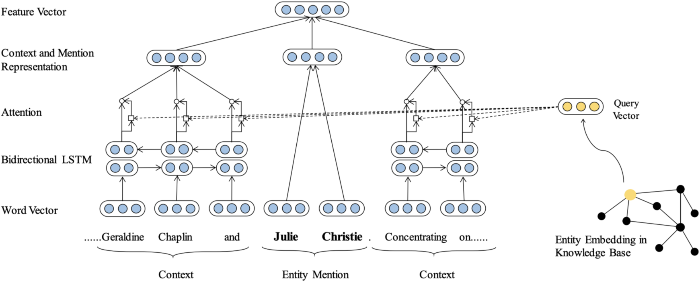
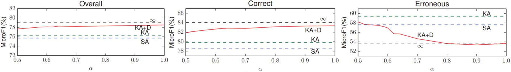

# Fine-Grained Entity Typing with Knowledge Attention

## 1. Introduction

&emsp;&emsp;命名实体识别作为NLP的基本任务和基础工作，其对很多的后继工作和应用中，如知识图谱构建、智能问答、阅读理解、舆情分析均有重要的影响。命名实体识别（ET）为文本挖掘掘和信息抽取技术的重要组成部分，其主要目标是对于给定文本，从中识别出相关命名实体（一般包括：人名、组织机构名、地名、时间、日期、货币、百分比或某些专有名词等）。该问题其本质为序列标记问题即标记（分类）序列中的实体对象或确定实体边界，早期的处理方式一般包括字典切分（如正向\反向最大匹配、最短路径等）、基于统计的方法（如HMM、最大熵、CRF等）以及两种方法的结合（专有领域以及工业界的实体抽取一般采用字典加统计的方法）。在深度学习崛起后，基于深度网的方法也迅速被运用到ET任务中并获得了较大的精度提升（DL的方法需要不断地调优才能获得较好的效果，而传统的方法其baseline就比较好，因此在实际的应用中我们也需要将字典和DNN结合），2015年Lample利用LSTM+CRF取得了当时最好的结果。2016年，2017年随着attention方法的提出又不断有学者将其引入至FET（Fine-grained entity typing）任务。Peng，2016年针对汉语语种提出分词与实体识别联合模型，Cao，2018年基于对抗训练利用分词数据（该数据集，如微博和MSRA，相比命名实体数据集较大）辅助实体识别任务，同时建模学习词与词之间的依赖关系以调高预测准确度。此外，在EMNLP17上Mayhew基于词典实现了跨语言的命名实体识别。

&emsp;&emsp;FET与一般ET不同的是其面向的领域更加垂直细分，其识别的对象更加具体多样，且一般具有层次结构（ACE（Automatic Context Extraction，自动内容抽取会议）将实体分为7大类，45小类，CMU开发的NELL系统中有几百个人工预先定义好的实体类别，Freebase中的实体类别达到上千种，而且是动态增加的），因此对于各个专有领域FET更能满足实际需求且有更大的应用价值。2015年，Dong et al首次根据word embedding特征实现ET，Xin于2018年提出结合KBs external information的Attention FET并取得了一定的精度提升。

&emsp;&emsp;有关命名实体识别的详细介绍可以参考我的这篇笔记：[NLP中的序列标注问题（隐马尔可夫HMM与条件随机场CRF）](https://zhuanlan.zhihu.com/p/50184092)。

## 2. Knowldege Attention FET

&emsp;&emsp;与之前的命名实体识别深度网不同的是，本文作者通过引入Knowledge Bases external information得到Entity Embedding，并将其作为query与上下文feature进行Attention得到context and mention representation，最后进行Softmax完成序列标记，其网络结构如下：

 
图1. ET with Knowledge Atttention 

&emsp;&emsp;如上图所示，首先对于输入序列进行Word Embedding处理（论文中作者使用Pennington, Socher, and Manning, 2014 pre-trained word embedding）然后对上下文context进行Bi-LSTM编码为$l_i,r_i$。（有关LSTM和Attention的介绍可以参看我的这篇笔记[从RNN、LSTM到Encoder-Decoder框架、注意力机制、Transformer](https://zhuanlan.zhihu.com/p/50915723)）同时对entity mentation 的word embedding进行简单平均得到entiy mentation representation，如下：

$$
m=\frac{1}{n_m}\sum_{i=1}^{n_m} m_i\tag{1}
$$

&emsp;&emsp;上式中，$n_m$即为entity mention的长度（其为分词结果，由于其长度一般只为1或2故可以进行简单的平均处理），$m_i$即为word embedding。

&emsp;&emsp;利用Attention机制对LSTM输出进行编码为context feature，如下：

$$
c=\frac{\sum_{i=1}^L(a_i^l\begin{bmatrix}\overrightarrow{h_i^l}\\ \overleftarrow{h_i^l} \end{bmatrix}+a_i^r\begin{bmatrix}\overleftarrow{h_i^r}\\ \overrightarrow{h_i^r} \end{bmatrix})}{\sum_{i=1}^{L}a_i^l+a_i^r}\tag{2}
$$

&emsp;&emsp;上式中$\begin{bmatrix}\overrightarrow{h_i^l}\\ \overleftarrow{h_i^l} \end{bmatrix}$和$\begin{bmatrix}\overleftarrow{h_i^r}\\ \overrightarrow{h_i^r} \end{bmatrix}$即为Bi-LSTM输出结果，$a_i^l$和$a_i^r$即为Attention输出。其一般有三种计算方式：

- Semantic Attention(SA)即只根据LSTM输出计算：
    
$$
a_i^{SA}=\sigma(W_{S1}tanh(W_{S2}\begin{bmatrix}\overrightarrow{h_i}\\ \overleftarrow{h_i} \end{bmatrix}))\tag{3}
$$

- Mention Attention(MA)即将entity mention与bi-LSTM结合：

$$
a_i^{MA}=f(mW_{MA}\begin{bmatrix}\overrightarrow{h_i}\\ \overleftarrow{h_i} \end{bmatrix}),f(*)=*^2\tag{4}
$$

- Knowledge Attentation(KA)即利用外部知识库（KRL method TransE）丰富语义信息，确定entity $m$的embedding $e$计算Attention：

$$
a_i^{KA}=f(eW_{KA}\begin{bmatrix}\overrightarrow{h_i}\\ \overleftarrow{h_i} \end{bmatrix})\tag{5}
$$

&emsp;&emsp;有关知识图谱的详细介绍可以参考我的这篇笔记[Knowledge Graph（知识图谱）](https://zhuanlan.zhihu.com/p/53753234)。

&emsp;&emsp;论文中主要采用第三种即KA进行命名实体识别。此外对于Supervised learning，在训练过程中由于其命名实体已知故其在KB中的表示$e$已知。然而在testing时我们无法直接得到$e$，因此文中作者提出了reconstruct entity embedding的方法：

$$
\hat e=tanh(W\begin{bmatrix}m\\c_l\\c_r\end{bmatrix})\tag{6}
$$

&emsp;&emsp;可以看出，这里使用$\{m,c_l,c_r\}$，即context、entity mention构建entity embedding。同时我们构建损失函数：

$$
J_{KB}(\theta)=-\sum||e-\hat e||^2\tag{7}
$$

&emsp;&emsp;上式中，$e$为KB的实体表示，而$\hat e$即为学习的实体表示，通过训练最小化$J$即可以得到entity embedding。在测试时即可利用式（6）构建的$\hat e$计算attention。然而，在一些情况下外部知识库中可能缺少实体准确表示，这将导致$J$的值较大（即KD的entity embedding与学习所得的entity embedding差异较大），此时若仍旧使用$e$进行训练将造成较大误差，因此文中采用了如下策略：

1. 对entity mention和KBs entity进行匹配（字符串相似度），构建基于KBs的候选实体集；
2. 计算L2 distance $d$，并设置阈值$\alpha$，若$d$超过阈值则直接采用学习所得的$\hat e$，反之则使用$e$。

&emsp;&emsp;文中实验表示对于阈值的设置对最后结果的提升十分关键，如下：

 
图2. alpha

&emsp;&emsp;从上图可以看出$\alpha$的调整对Correct和Erroneous的影响较大，即其间存在trade-off，（Correct表示$d<\alpha$，Erroneous表示$d\geq \alpha$）这也可以很好理解即当$\alpha$增加时，学习所得的$\hat e$与KBs中的$e$很接近，因此其能很好的表示entity mention，而对于外部知识库中不存在或差异较大的entity，由于其习得的$\hat e$也不能很好的表示entity mention，故其准确率较低（想要对于Erroneous这部分entity也取得较好的MicroF1仍需借助较为完善的知识图谱或者在knowledge inference技术上取得较大突破）。

&emsp;&emsp;将式（5）计算所得$a$代入至式（2）中求得基于attention的context表示，并将其与entity mention representation$m$进行拼接，得到特征向量$x$，如下：

$$
x=\begin{bmatrix}m\\c\end{bmatrix}
$$

&emsp;&emsp;最后使用多层感知机(MLP)输出各个实体类别概率：

$$
y=\sigma(W_{y1}tanh(W_{y2}x))\tag{8}
$$

&emsp;&emsp;上式中，$W_{y1},W_{y2}$即为MLP参数，$y$包含各个实体类别概率。网络的目标函数为：

$$
J(\theta)=-\sum_{i,j}y^{*(j)}_i log y_i^{(j)}+(1-y^{*(j)}_i)log(1-y_i^{(j)})\tag{9}
$$

&emsp;&emsp;上式中，$y^*$即为ground truth type，这里我们使用交叉熵作为loss function，同时将式（7）作为单独一项加入其中。

 
图3. results

&emsp;&emsp;从以上实验结果可以看出

- 对比一般的Attention mechanism融合KBs的mention entity embedding的结果要更优。
- 通过$\alpha$调整的attention其结果最优。

&emsp;&emsp;这也从侧面反映融入外部信息或先验知识对NLP个任务结果的提升均有帮助，这已被word embedding、Bert、ELMo、GPT以及各类预训练策略充分证明，且外部信息越丰富、质量越高其结果的提升将越大。

&emsp;&emsp;虽然新的网络和方法层出不穷，但是命名实体尤其是中文命名实体识别任务仍存在较大的问题，即未登录词问题和歧义问题，同时开放域的ET也需要更多的探究，此外上述模型的测试结果均是在给定数据集上进行的，而在实际的情况中该性能将大大折扣。

## 3. Reference

[[1] Xin, Ji, et al. "Improving neural fine-grained entity typing with knowledge attention." Thirty-Second AAAI Conference on Artificial Intelligence. 2018.](https://www.aaai.org/ocs/index.php/AAAI/AAAI18/paper/viewPaper/16321)

