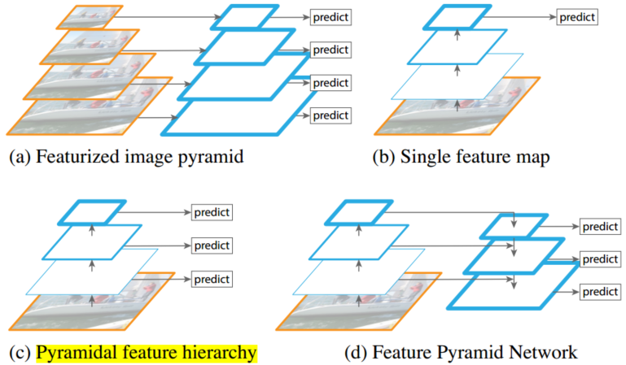
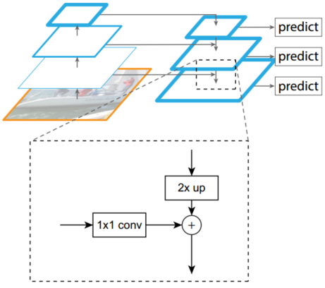
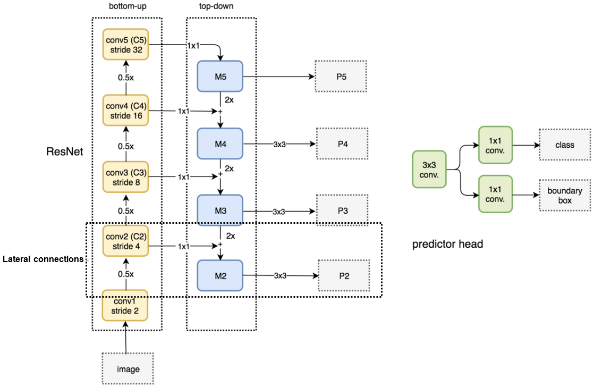
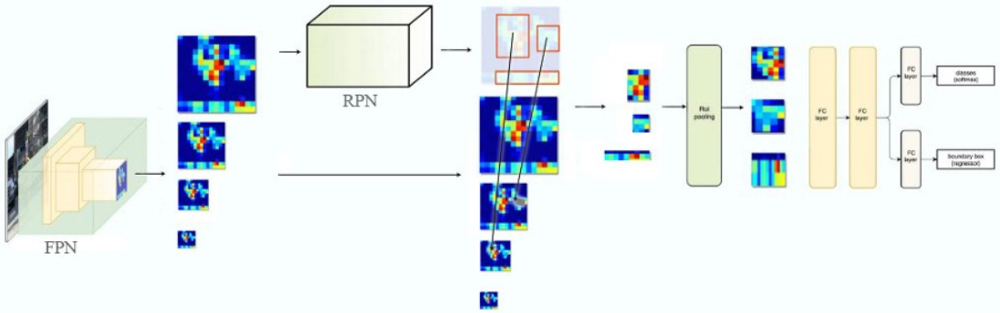
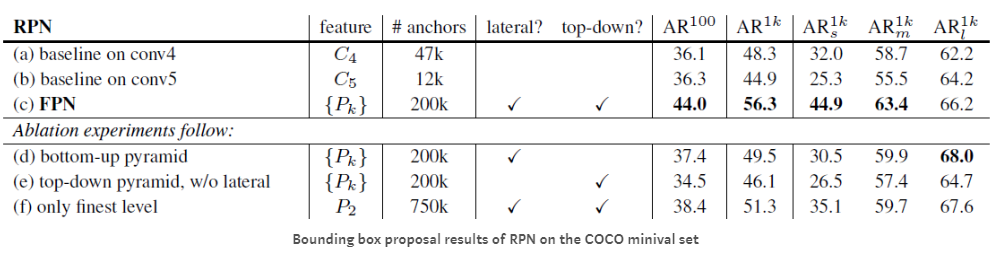
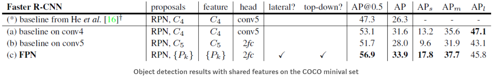
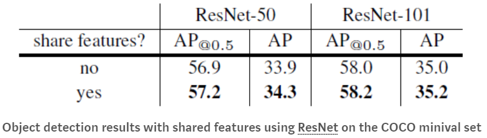
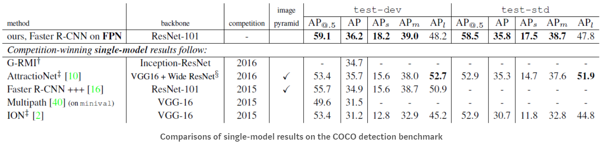
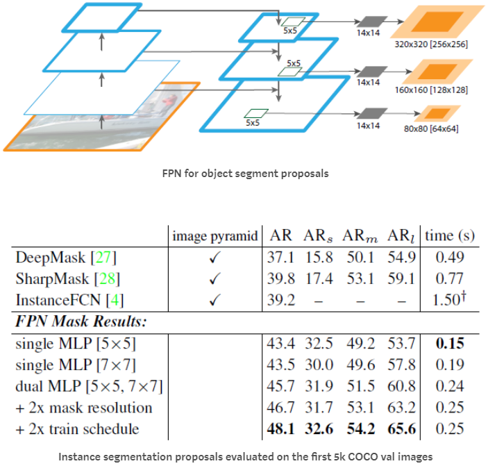

# FPN

&emsp;&emsp;特征金字塔或图像金字塔模型在深度学习之前的图像识别中已被广泛使用（号称Hand-crafted feature时代的万金油），如人脸识别中使用特征金字塔模型+AdaBoost提取不同尺度特征经行分类等。而在深度学习时代考虑到内存与算力的限制再加上深度网优秀的特征表征能力（能适应不同位置（卷积），不同明暗（图像增广）等物体的识别，但是对于角度和小尺度变化的鲁棒性较差），故一般我们不会考虑使用特征金字塔模型训练网络（测试时可能会用到）。但是FPN网络却将特征金字塔模型引入至Faster R-CNN中，在不牺牲内存与速度的情况下达到了state-of-the-art(2016)，同时对于小物体的检测也获得了不错的效果。

## Introduction

&emsp;&emsp;几种金字塔结构：

 
图1. Pyramid Structure

 
- 图（a）为手工设计特征描述子（Sift,HoG,Harr,Gabor）时代的常见模型，即对不同尺寸的图片提取特征，以满足不同尺度目标的检测要求，提高模型性能；
- 图（b）则是深度卷积网的基本结构，通过不断的卷积抽取特征同时逐渐增加感受野，最后进行预测；
- 图（c）则是融合深度网络的特征金字塔模型，众所周知深度网在经过每一次卷积后均会获得不同尺度的feature map，其天然就具有金字塔结构。但是由于网络的不断加深其图像分别率将不断下降，感受野将不断扩大，同时表征的特征也更叫抽象，其语义信息将更加丰富。SSD则采用图c结构，即不同层预测不同物体，让top层预测分辨率较高，尺寸较大的目标，bottom则预测尺寸较小的目标。然而对于小目标的检测虽然其分辨率提高了但是其语义化程度不够，因此其检测效果依旧不好。
- 图（d）则是FPN的网络结构，该网络结构大体上分为三个部分，即buttom-up自底向上的特征抽取，自顶向下的upsampling，以及侧边融合通道（lateral coonnection）。通过这三个结构网络的每一层均会具有较强的语义信息，且能很好的满足速度和内存的要求。

## Architecture

&emsp;&emsp;FPN的网络结构的backbone采用ResNet，此外还包括上述的三个部分即：Bottom-up pathway, Top-down pathway以及lateral connections。如下图所示：

 
图2. 网络结构

- Bottom-up pathway

&emsp;&emsp;自底向上的pathway即为网络的前馈过程，作者设置scaling step为2通过不断卷积获得不同大小的feature map，同时定义拥有相同size的feature map为同一网络的stage，并选择同一stage中靠近“顶端”的feature map构建feature pyramid，因为其拥有更加丰富的语义特征。其中Bottom-up对应的每一个residual block记为$\{C_2,C_3,C_4,C_5\}$（考虑到内存的限制不考虑第一个block）。

- Top-down pathway

&emsp;&emsp;顶层的feature map通过upsampling与底层的feature map进行融合以丰富语义信息。其中upsample factor设置为2。

- lateral connection

&emsp;&emsp;将bottom-up pathway所得的feature map过一个$1\times 1$的卷积层以融合个channel的信息同时对channel进行降维，此后在于top-down的feature map进行merge然后进行$3\times 3$的卷积以消除混叠效应，得到$\{P_2,P_3,P_4,P_5\}$。

 
图3. 网络结构

## FPN with Faster R-CNN

&emsp;&emsp;要完成目标检测任务，网络需要输出检测框的位置以及检测目标的类别，因此作者将FPN与Faster R-CNN中的RPN网络相结合。而不同之处主要包括以下几点：
- 原始的RPN网络设置$3\times 3$的滑动窗口在feature map上预测检测框的位置以及检测框是否包含目标以生成region proposal。而在FPN中作者则直接对每一个Block的feature map$\{P_2,P_3,P_4,P_5\}$过一个$3\times 3$的卷积层，后接两个$1\times 1$的卷积核分别预测box是否包含有目标以及对box位置进行回归调整。
- 在RPN中作者设置不同尺寸的Anchor Box以辅助预测检测框的位置加快网络收敛，同时不同尺寸的Anchor Box同时也可以适应不同尺寸物体的检测。而在FPN网络中由于其不同Stage本就满足不同尺寸物体的检测，因此这里作者在每一个stage只设置一个Anchor Box而在不同的stage设置不同大小的Anchor Box分别为$\{32^2,64^2,128^2,256^2,512^2\}$（数值越大对应的Scale层级越高）。
- 设置IoU（交并比）的阈值为0.7和0.3，大于0.7的检测框为positive，小于0.3的检测框为negative。此外每一Scale的predictor head权值共享。
- 在Fast R-CNN与Faster R-CNN中通过RoI（Region-of-Interest）Pooling获得同一大小的feature map，而在FPN中选择哪一个feature map进行RoI操作则需要根据网络的输入图像进行动态调整，其公式如下：

$$
K=\lfloor k_0+log_2(\sqrt{wh}/224)\rfloor\tag{1}
$$
  
&emsp;&emsp;上式中，224为ImageNet的标准图像尺寸；$w,h$为输入图片宽，高；$k_0$设置为4，通过向下取整计算得到$K$值及对应Stage（$K=3$则将$P_3$所得特征图进行RoI Pooling）。

- 由RoI pooling抽取出$7\times 7$的feature后接两个1024的全连接层然后进行类别的预测和bounding box的回归。

 
图4. Faster R-CNN

 
图5. FPN

## Experiments

1. Ablation Experiments

&emsp;&emsp;（1）Ablation Experiments on RPN

 
图6. Ablation Experiments on RPN

- 使用conv5（b）与使用conv4（a）相比并没用明显优势，因此高层级的feature map并不能带来精度的明显提升，这主要是因为在分辨率与语义信息间存在trade-off；
- 结合FPN的RPN在$AR^{1k}$(Average recall with 1000 proposals per images)上提升8个点，达到56.3。同时$AR_s^{1k}$提升12.9个点，故结合FPN的RPN对于物体的尺度更加鲁棒；
- 除去top-down pathway的FPN（类似图1（c）结构）其结果变差（d），作者推断这主要是因为不同scale的语义鸿沟导致，尤其是对于更深的网络；
- 设置head predictor的权重不共享对精度的影响不大（d）；
- 除去$1\times 1$的卷积层（e）其box位置预测准确性下降，这主要是多次上采样和下采样造成的，此外其$AR^{1k}$也较低；
- 若只根据$P_2$的feature map进行预测（f）其结果要差与FPN，而优于baseline。

2. Ablation Experiments on Detection Network

 
图7. Ablation Experiments on Detection Network

- 移除top-down connection（d）或移除lateral connection（e）均将导致较差的结果；
- 而只使用单一stage的feature map$P_2$（e）其结果也差于FPN（c）。

3. Consistent Backbone Architecture for detection network and RPN

 
图8. Consistent Backbone Architecture for detection network and RPN

- 不共享权值，FPN(c)的$AP$优于baseline 2.3个点，FPN的$AP@0.5$优于baseline 3.8个点。
  
4. Shared Features for detection network and RPN

 
图9. Shared Features for detection network and RPN

- 在FPN基础上，将RPN和Fast R0CNN的特征共享其精度得到了小幅提升，同时检测时间有所减小。

## Comparison with State-of-the-art Approaches

&emsp;&emsp;作者将FPN在COCO数据集上与其他模型进行对比，如G-RMI（2016 winner），Faster R-CNN+++（2016 winner，使用Faster R-CNN，ResNet和NoCs），ION（2015 2nd Runner Up），结果如下：

 
图10. comparison

&emsp;&emsp;FPN并未使用多种trick，如 iterative regression, hard negative mining, context modeling, stronger data augmentation等，但其性能依旧超过其他方法。

&emsp;&emsp;此外，FPN在图像分割领域其表现依旧优秀，如下：

 
图11. FPN for object segment proposals

&emsp;&emsp;FPN网络模型在不增加额外的时间和内存的情况下其对于多尺度尤其是小尺度目标的检测提供了一种解决方案。此外通过实验表明小尺度目标检测需要融合高分辨率和丰富语义信息的feature map，而一味增加网络深度并不能很好的解决问题。

## Reference

[[1] Lin T Y , Dollár, Piotr, Girshick R , et al. Feature Pyramid Networks for Object Detection[J]. 2016.](http://openaccess.thecvf.com/content_cvpr_2017/papers/Lin_Feature_Pyramid_Networks_CVPR_2017_paper.pdf)

[[2] Jonathan Hui, Understanding Feature Pyramid Networks for object detection (FPN), Medium](https://medium.com/@jonathan_hui/understanding-feature-pyramid-networks-for-object-detection-fpn-45b227b9106c)

[[3] SH Tsang, Review: FPN — Feature Pyramid Network (Object Detection), Medium](https://towardsdatascience.com/review-fpn-feature-pyramid-network-object-detection-262fc7482610)

