# 目标检测从R-CNN到Faster R-CNN

&emsp;&emsp;至深度学习热潮的涌起，许多计算机视觉领域传统任务的精度和速度被不断刷新，对于目标检测任务基于深度卷积网络的方法也立刻成为了众多学者研究的对象，其中R-CNN即为深度模型在object detection应用的开山之作。在此基础上Ross、Kaiming等大佬又不断对网络进行改进和优化又发展出Fast R-CNN、Faster R-CNN。至此，以Faster R-CNN为代表的双阶段检测器已成为目标检测任务中的经典方法。

## 1. R-CNN

&emsp;&emsp;早期对于目标检测任务往往采用不同尺寸的滑动窗口，提取Shift、HOG等特征直方图，构建特征金字塔模型，然后进行分类定位。为克服传统方法精度低、速度慢等缺点，作者将深度模型引入至图像检测任务中，而基于深度学习的图像识别、检测或分割等任务则均是利用深度网提取特征以代替手工设计特征，然后进行回归或分类。

### 1.1 模型细节

&emsp;&emsp;对于图像检测任务，其与图像检测任务最大的区别在于我们不仅要给出图像中目标的类别同时还要给出紧致的目标检测框，这也图像检测任务的一大难点。那么如何得到检测框呢？现有的方法主要是将检测框的确定转化为检测框坐标回归的任务。在R-CNN（Fast R-CNN）中，其首先根据图像的low level feature如Shift、HOG等特征直方图等进行选择性搜索，将相似的像素（纹理、颜色、强度等相似）聚为一类，然后生成对应的region proposal boundary box（约2000个），如下：

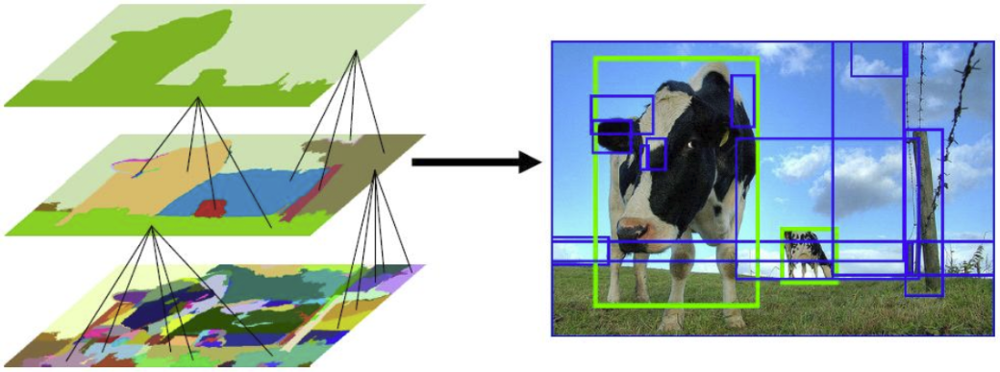
 
图1. Region Proposal

&emsp;&emsp;此后，将提取出的region proposal放缩至相同大小$227\times 227$（全连接层要求输入tensor尺寸一致，但是对图像进行放缩处理会使其失真造成精度的损失，因此在SPPNet以及此后的模型中均采用RoI Pooling操作对不同大小的feature提取等长的特征），然后送入改进的AlexNet（5个卷积层+2个全连接层）提取特征，对于每一个region proposal将输出4096维的特征向量，故最后输出为$2000\times 4096$的矩阵，并送入category-specific linear SVMs进行分类（one-vs-all，即每个类别训练单独的svm，作者也对比使用Softmax进行分类，其精度下降了近4个百分点），如下：

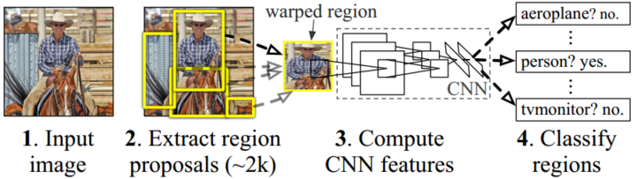
 
图2. R-CNN 流程图

&emsp;&emsp;此外，为使boundary box更加紧致，作者采用线性变换对边框进行校准，如下：

$$
\hat{G}_x=P_wd_x(P)+P_x\\
\hat{G}_y=P_hd_y(P)+P_y\\
\hat{G}_w=P_wexp(d_w(P))\\
\hat{G}_h=P_hexp(d_h(P))\tag{1}
$$

&emsp;&emsp;上式中，$\{\hat{G}_x,\hat{G}_y,\hat{G}_w,\hat{G}_h\}$分别为修正后的boundary box的中心坐标及长、宽；

&emsp;&emsp;&emsp;&emsp;&emsp;&emsp;$\{P_x,P_y,P_w,P_h\}$分别为修正前的region proposal boundary box的中心坐标及长、宽；

&emsp;&emsp;&emsp;&emsp;&emsp;&emsp;$\{d_x(P),d_y(P),d_w(P),d_h(P)\}$分别为基于region proposal $P$ $pool_5$特征的中心坐标及长、宽修正值。

&emsp;&emsp;故为使boundary box更加准确，应满足下式：

$$
w_{*}=argmin_{\hat{w}_*}\sum_{i}^N(t_*^i-\hat{w}_*^T\phi_5(P^i))^2+\lambda||\hat{w}_*||^2\tag{2}
$$

$$
t_x=(G_x-P_x)/P_w\\
t_y=(G_y-P_y)/P_h\\
t_w=log(G_w/P_w)\\
t_h=log(G_h/P_h)\tag{3}
$$

&emsp;&emsp;上式中，$\hat{w}_*,w_*$即为线性修正参数；

&emsp;&emsp;&emsp;&emsp;&emsp;&emsp;$\phi_5(P)$即为regiong popasal $P$ $pool_5$的输出特征，$\hat{w}_*^T\phi_5(P^i)=d_*(P)$；

&emsp;&emsp;&emsp;&emsp;&emsp;&emsp;$\{G_x,G_y,G_w,G_h\}$分别为ground truth box的中心坐标及长、宽值；

&emsp;&emsp;&emsp;&emsp;&emsp;&emsp;$t_*$即为回归修正值。

### 1.2 实验结果

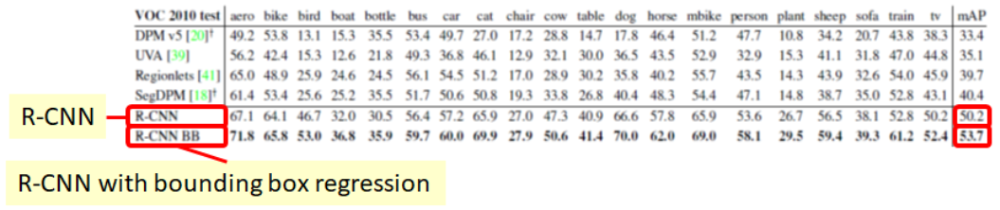
 
图3. VOC 2010实验结果

&emsp;&emsp;对比多个模型，R-CNN和R-CNN BB（Bounding-box regression）在VOC 2010上均取得了最好的结果；

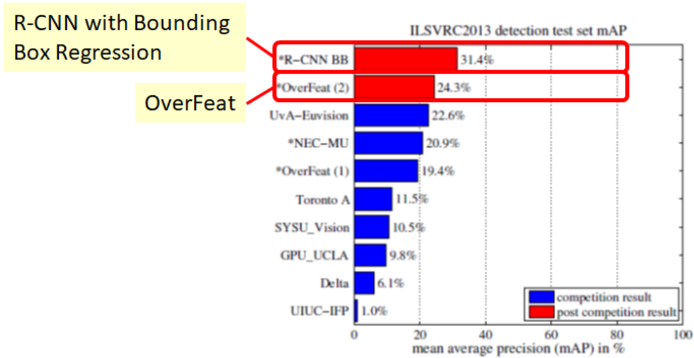
 
图4. ILSVRC2013实验结果

&emsp;&emsp;在ILSVRC2013的实验结果中，R-CNN BB的结果甚至优于OverFeat。

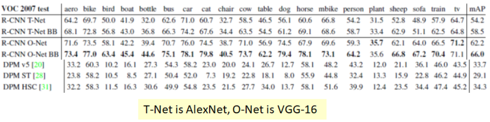
 
图5. VOC 2007实验结果

&emsp;&emsp;从上图可以看出在VOC 2017的实验结果中，当R-CNN利用VGG-16作为特征提取器其mAP达到了66.0%。

&emsp;&emsp;虽然R-CNN作为图像检测任务深度学习的开山之作，其精度得到明显提升，但是该模型的缺点也十分明显，主要包括速度慢（检测一张图像需要47秒）以及阶段复杂且冗余，因此在后续的改进中则出现了Fast R-CNN及Faster R-CNN等。

## 2. Fast R-CNN

&emsp;&emsp;如上所述，R-CNN最主要的缺点即为速度慢，而则又是过程复杂冗余所导致。即在R-CNN中对于每一幅图像的每一个region proposal均需要经过深度网体特征，而每个region proposal中均为有大量重复内容，因此这无异于增加了许多冗余操作。此外R-CNN需要将region proposal调整至统一大小，图像的放缩失真使得精度降低。还有R-CNN需要将提取后的特征导入至disk，此后在SVM分类时再将其读取这也无疑增加了内存和时间代价。最后边框的修正也增加了检测时间。

&emsp;&emsp;因此Fast R-CNN试图将R-CNN的多个阶段进行整合，其中包括：（1）对每幅图像只进行一次卷积，在最后的feature map中提取region proposal特征，这主要是得益于SPPNet提出的RoI Pooling操作，使其可以针对不同大小的Feature map得到相同长度的特征；（2）设计多任务损失，在经过全连接后同时对目标分类和边框回归进行修正。

### 2.1 模型细节

&emsp;&emsp;能使得Fast R-CNN对每幅图像进行一次卷积主要得益于SPPNet的RoI pooling操作，如下：

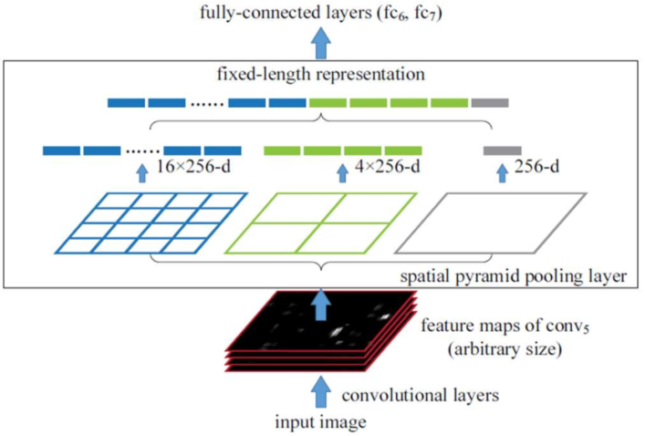
 
图6. RoI Pooling

&emsp;&emsp;如上图示，RoI Pooling的主要操作是对不同大小的feature map进行网格划分，划分为同等数目的grid cell，同时对每一个cell进行pooling，然后将每个cell得到的特征展成一维向量，故其可以在不同尺寸的feature map中提取等长特征。在SPPNet中作者划分不同尺度的grid cell提取特征并进行拼接，因此其特征存在重叠，不易梯度回传。而在Fast R-CNN中作者仅将其划分为如$7\times 7$的网格，此后外接全连接层。

&emsp;&emsp;Fast R-CNN的另一个改变即引入multi-task Loss，将回归和分类做到同一个损失函数中，如下：

$$
L(p,u,t^u,v)=L_{cls}(p,u)+\lambda[\mu \geq 1]L_{loc}(t^u,v)\\
v=(v_x,v_y,v_w,v_h),t^u=(t_x^u,t_y^u,t_w^u,t_h^u)\\
L_{cls}(p,u)=-logp_u\\
L_{loc}(t^u,v)=\sum_{i\in \{x,y,w,h\}}smooth_{L_1}(t_i^u-u)\\
smooth_{L_1}=\begin{cases}
    0.5x^2\qquad\quad \text{if |x|$\leq$1}\\
    |x|-0.5\qquad \text{otherwise}
\end{cases}\tag{4}
$$

&emsp;&emsp;上式中，$p,u,t^u,v$分别为目标预测类别，真实类别，ground truth位置信息，预测boundary box位置信息。

&emsp;&emsp;从上式可以看到其损失函数主要由分类损失$log$和前景目标检测框位置损失$smooth_{L_1}$构成。使用$smooth_{L_1}$使网络训练更加平稳，收敛更加迅速（对于较小的值采用平方而非绝对值主要是避免其能更好的趋于最小值，而避免来回震荡）。另外$\lambda \geq 1$是指前景目标，这主要是避免对背景图像（与ground truth IoU最大的region proposal以及IoU大于0.7的proposal）计算位置损失。

&emsp;&emsp;另外为使网络进一步加速同时减少全连接参数，作者也提出对全连接层使用SVD矩阵分解。如下：

$$
W=U\sum_tV^T\tag{5}
$$

&emsp;&emsp;使用SVD矩阵分解可以将包含$uv$各参数的矩阵，减少为包含$t(u+v)$个参数的矩阵乘积，其中$t$为包含的$t$个特征值的对角阵$\sum_t$。通过矩阵分解将原始包含$W$个参数的全连接层替换为$\sum_tV^T$的全连接层和$U$全连接层。矩阵分解在RoIs数目较多时有较好的效果。

&emsp;&emsp;最后网络的框架如下图所示：

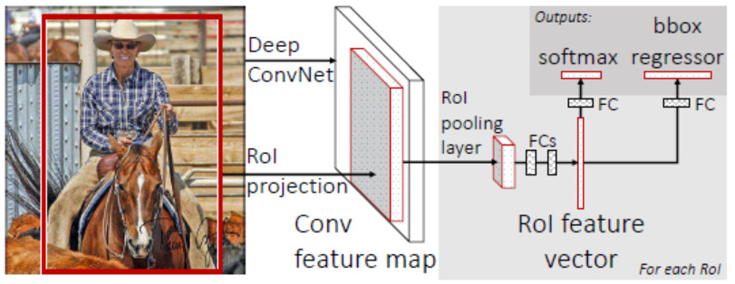
 
图7. Fast R-CNN网络框架

&emsp;&emsp;从上图可以看出，Fast R-CNN对每一幅图像图像只进行一次卷积，同时利用RoI Pooling对不同的region proposal提取等长特征，此后经过两个全连接再分别送入Softmax进行分类和全连接进行回归。

### 2.2 实验结果

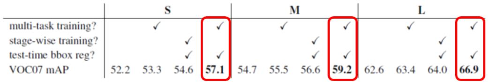
 
图8. Multi-task Loss Results

&emsp;&emsp;上图中，S、M、L为网络规模分别对应AlexNet、VGG-like wider version of S以及VGG-16。可以看到采用multi-task training要比stage-wise training效果更好。

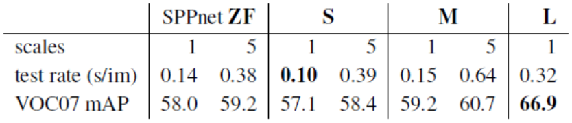
 
图9. 1-Scale vs 5-Scale

&emsp;&emsp;上图中1-Scale是指输入图像最短边为均为600 pixels最长边不超过1000 piexls，5-Scale是指输入图像最短边包括{480,576,688,864,1200}这五个尺寸。从实验可以看出5-Scale拥有更高的mAP（其实分变率越高的图像精度越高，不过时间和内存均会增加）。

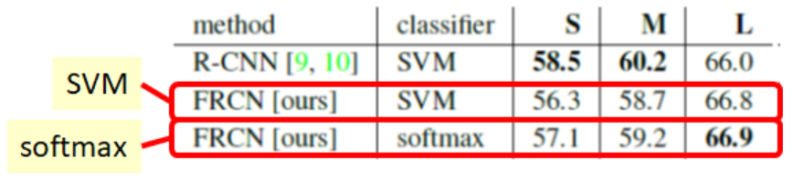
 
图10. SVM vs Softmax

&emsp;&emsp;Softmax效果稍加，但是需要注意的是采用SVM需要将feature导入disk在读取，其时间、内存、优化均有较大代价。

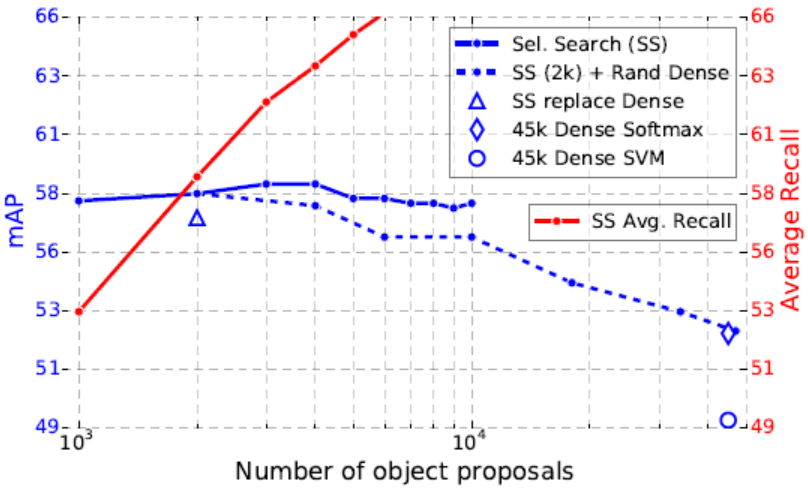
 
图11. 不同数量proposal

&emsp;&emsp;从上图可以看出，随着region proposal的增加其mAP并不一定增加，Spare Set using Selective Search其效果也已经足够好。而进一步随机引入更多的boundary box其mAP会显著下降。

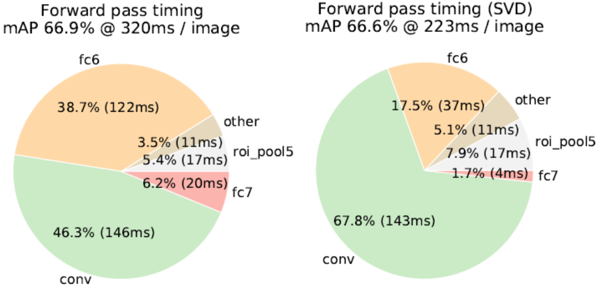
 
图12. Truncated SVD

&emsp;&emsp;使用SVD分解能减少全连接层参数，有效减少图像检测时间，而精度有微小损失。

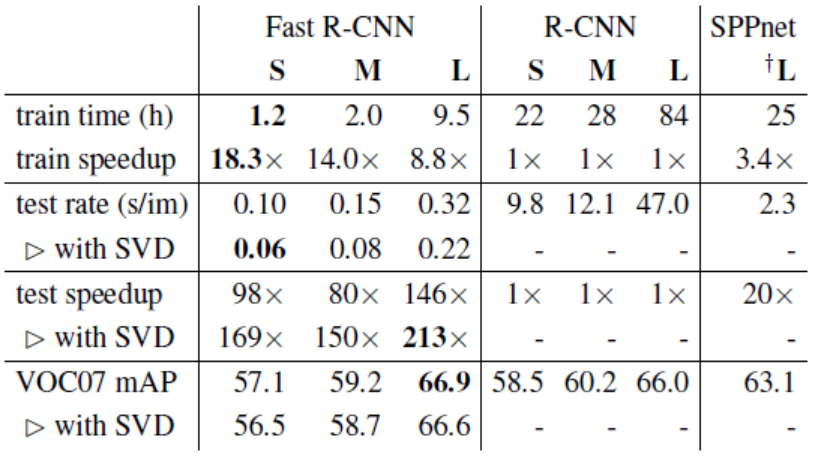
 
图13. Training and Testing time

&emsp;&emsp;可以看出使用VGG-16的Fast R-CNN在训练时间上快于R-CNN 9倍，在测试时间上快于213倍。与SPPNet相比在训练时间上快3倍，在测试时间上快10倍。

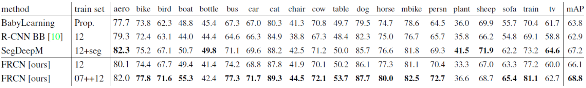
 
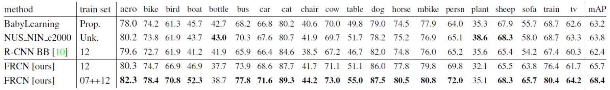
 
图14. VOC 2010 and VOC 2012

&emsp;&emsp;从上图可以看大Fast R-CNN在VOC 2010 and VOC 2012上均取得了最好的效果。

&emsp;&emsp;与R-CNN相比Fast R-CNN最主要的是采用RoI Pooling和multi-task loss将多个阶段整合，同时对每幅图像进行一次卷积并利用softmax代替SVM进行端到端训练使得速度加快。

### 3. Faster R-CNN

&emsp;&emsp;Fast R-CNN虽然在速度上取得了较大的飞跃，但是其检测一张图片仍然需要2秒以上，无法满足时时的要求。这主要是因为在region proposal的阶段其耗费了大量的时间且不能很好的在GPU上运行。对此Faster R-CNN在Fast R-CNN的基础上进一步引入RPN网络，提出anchor box将region proposal的生成过程也融入至网络的训练过程，进而有效减少了RoIs的时间，同时精度也的得到了明显提高。

### 3.1 模型细节

&emsp;&emsp;Faster R-CNN在原始图片经过VGG-16得到的特征图上外接RPN网络生成候选区域，同时完成候选区域的分类（背景or前景）以及边界框的回归，同时利用RoI Pooling对region proposal提取特征，如下图示：

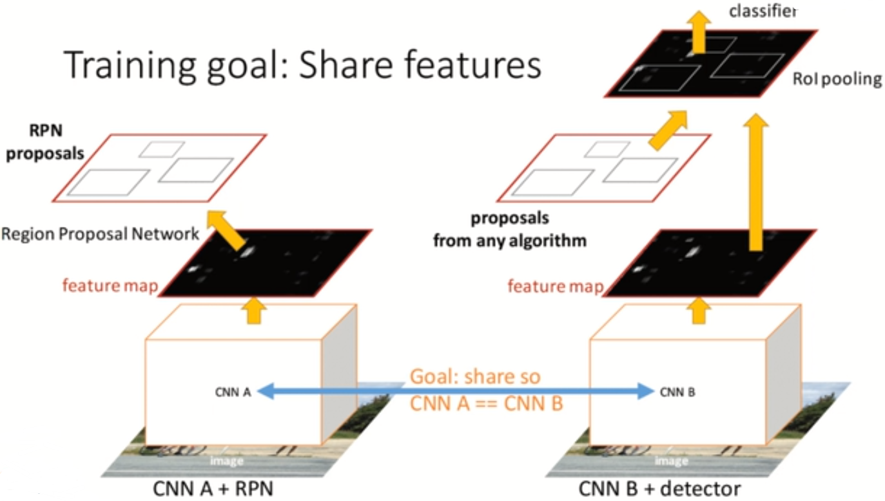
 
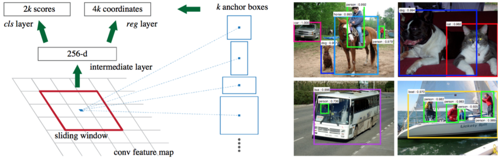
 
图15. RPN网络结构

&emsp;&emsp;RPN网络首先在feature map上滑动$3\times 3$的窗口（卷积核，其channel为512）生成anchor，每滑动一次生成一个anchor，其为窗口的中心。然后以每个锚点为中心生成9个anchor boxes（3个不同大小尺寸$128^2,256^2,512^2$，3个不同比列$2:1,1:1,1:2$，$3\times 3$）以满足不同尺度的目标检测任务。同时，随机采样$256$个锚点并再接两个$1\times 1$的卷积层（其channel数分别为2k和4k）分别得到$2k$个proposal的类别（前景或后景）以及$4k个$boundary box的位置坐标信息，$k$为anchor box的数目（paper中为9），故RPN包含的参数数目为$512\times (4+2)\times 9$。RPN损失函数入下：

$$
L(\{p_i\},\{t_i\})=\frac{1}{N_{cls}}\sum_iL_{cls}(p_i,p_i^*)+\lambda \frac{1}{N_{reg}}\sum_ip_i^*L_{reg}(t_i,t_i^*)\\
t_x=(x-x_a)/w_a,\quad t_y=(y-y_a)/h_a\\
t_w=log(w/w_a),\quad t_h=log(h/h_a)\\
t_x^*=(x^*-x_a)/w_a,\quad t_y^*=(y^*-y_a)/h_a\\
t_w^*=log(w^*/w_a),\quad t^*_h=log(h^*/h_a)\tag{6}
$$

&emsp;&emsp;上式中，$p_i,P_i^*,t_i,t_i^*$分别为anchor与ground truth的类别(1为目标，IoU大于0.5；0为背景，IoU小于0.1)以及predict box与ground truth相对anchor box的坐标值。$x,x_a,x^*$分别为predicted box，anchor box，ground-truth box中心$x$坐标。$L_{cls}$为分类损失取log损失，$L_{reg}$为类别损失取$smooth L_1$。$\lambda$paper中取10。

&emsp;&emsp;作者通过对RPN网络进行单独训练，然后利用其生成Region proposal入Fast R-CNN检测网络，利用RoI Pooling提取固定长度的特征，最后送两个全连接层进行目标的分类以及boundary box的回归。如下：

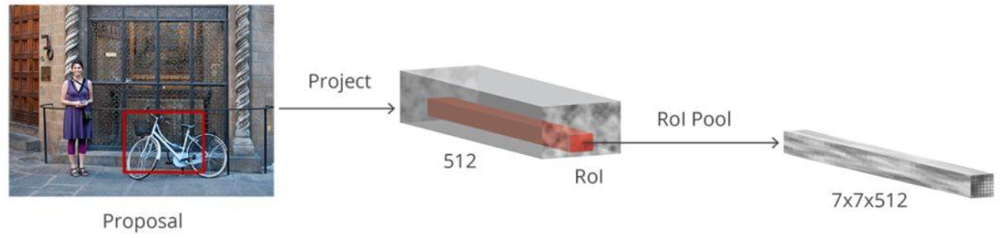
 
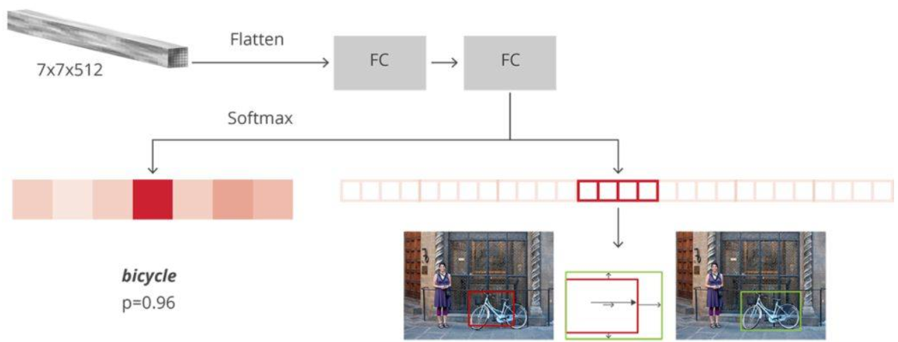
 
图16. Proposal and Fast R-CNN

&emsp;&emsp;因此Faster R-CNN网络首先利用VGG-16得到feature map，然后送入RPN网络生成region proposal，接下来利用RoI Pooling提取feature，最后送入全连接层分别进行分类和回归。其模型的训练方式主要包括两种：

- 交替训练
  - 基于训练模型训练RPN
  - 基于预训练模型，以及上一步得到的RPN，训练Fast R-CNN
  - 固定共享的卷积层，训练RPN
  - 固定共享的卷积层，基于上一步得到的RPN，训练Fast R-CNN
- 端到端训练
  - 同时训练RPN和Fast R-CNN
  - Fast R-CNN梯度不向RPN回传
  - 损失函数包括4个不同部分（两个RPN，两个Fast R-CNN）

### 3.2 实验结果

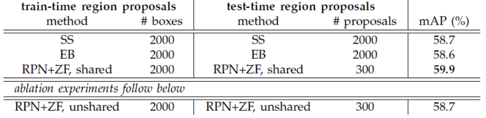
 
图17. share vs unshare

&emsp;&emsp;从上图可以看出share卷积层其mAP更高。

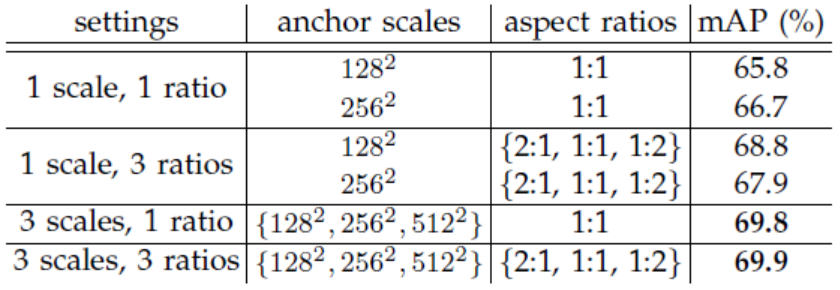
 
图18. Scales and Ratios

&emsp;&emsp;通过设置3 scales，3 ratio的anchor box其mAP较3 scales，1 ratio有些许提高。

 
图19. lambda in Loss Function

&emsp;&emsp;Loss function中$\lambda=10$效果最佳。

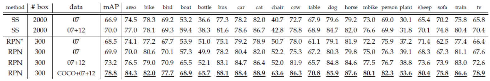
 
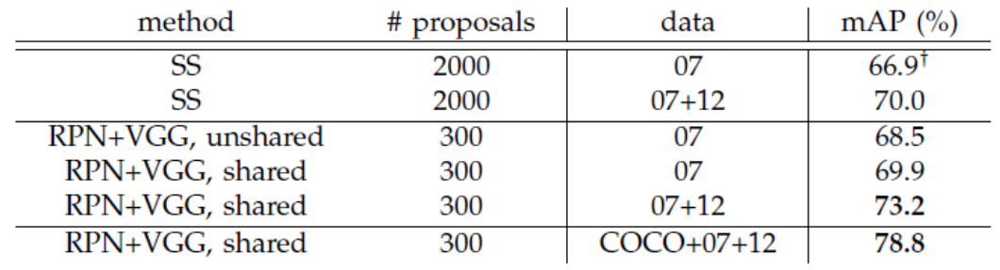
 
PASCAL VOC 2007
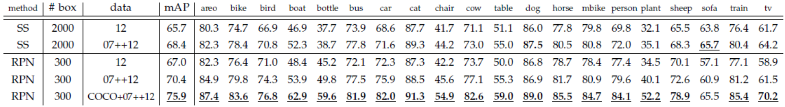
 
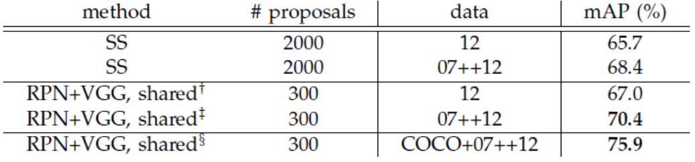
 
PASCAL VOC 2012
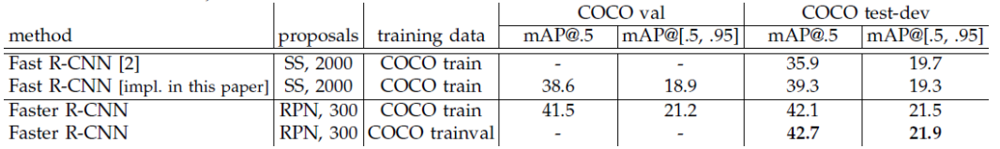
 
MS COCO
 
图20. PASCAL VOC 2007, PASCAL VOC 2012, MS COCO测试结果
 

&emsp;&emsp;从上图可以看出Faster R-CNN分别在PASCAL VOC 2007, PASCAL VOC 2012, MS COCO均取得了最佳的效果

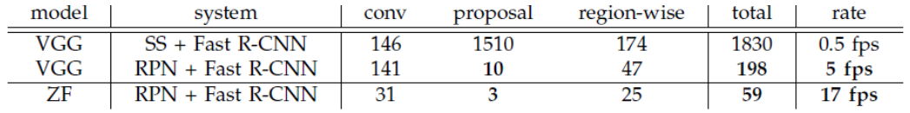
 
图21. Detection time

&emsp;&emsp;从上图可以看出加入RPN的Fast R-CNN其速度要远快于SS+Fast R-CNN。

## 4. 总结

 
图22. R-CNN to Faster R-CNN

&emsp;&emsp;从上图可以看出，R-CNN利用图片的底层特征生成RoI（约2000个），然后进行尺寸放缩，并分别送入AlexNet提特征，最后针对每一个类别训练SVM分类器，同时进行变宽校准。过程复杂，时间长。Fast R-CNN也根据图像底层特征生成RoI，但其继承了SPPNet的RoI Pooling操作，对每幅图像只进行一次卷积生成feature map，然后将对应Region Proposal区域送入RoI Pooling提等长特征，最后利用全连接层进行分类回归。Faster R-CNN则引入了RPN网络，在Anchor box基础上回归Region Proposal区域，并将其送入Fast R-CNN网络中进行分类回归。整体上看从R-CNN到Faster R-CNN其阶段不断被整合同时时间不断减小。

&emsp;&emsp;相对于Faster R-CNN系列的单阶段检测器，YOLO系列的单阶段检测器其直接省去了全连接层和RoI Pooling层而是一卷到底，这样拜托了输入特征固定的束缚，同时其分类回归一起训练调整，其时间更快，但是精度有稍许损失。具体可以参看我的这篇笔记[目标检测YOLO系列](https://zhuanlan.zhihu.com/p/57878269)。

## 5. Reference

[[1] Sik-Ho Tsang. Review: R-CNN (Object Detection). Medium](https://medium.com/coinmonks/review-r-cnn-object-detection-b476aba290d1)

[[2] Sik-Ho Tsang. Review: Fast R-CNN (Object Detection). Medium](https://medium.com/coinmonks/review-fast-r-cnn-object-detection-a82e172e87ba)

[[3] Sik-Ho Tsang. Review: Faster R-CNN (Object Detection). Medium](https://towardsdatascience.com/review-faster-r-cnn-object-detection-f5685cb30202)

