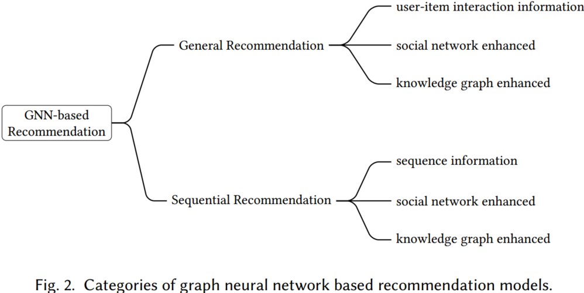
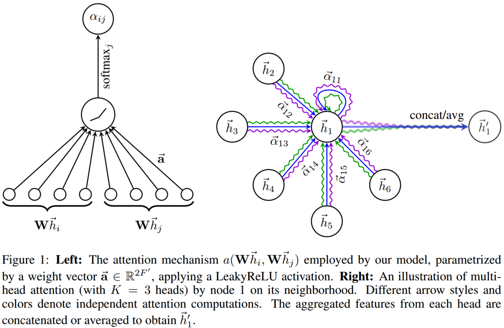
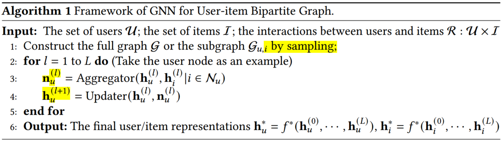
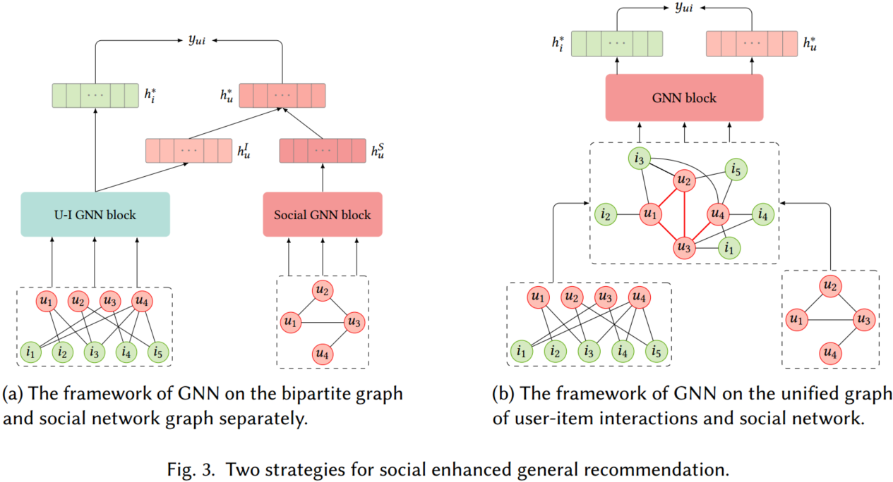
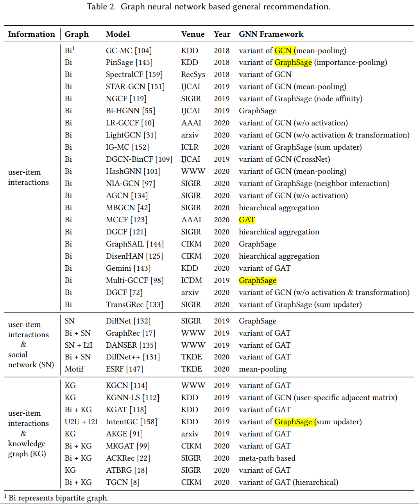
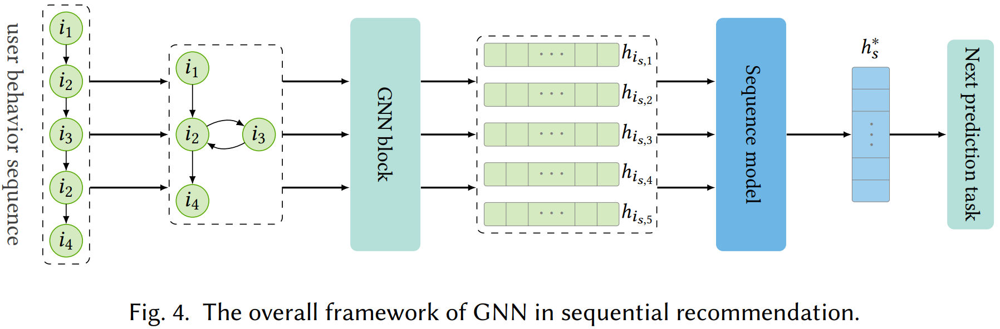
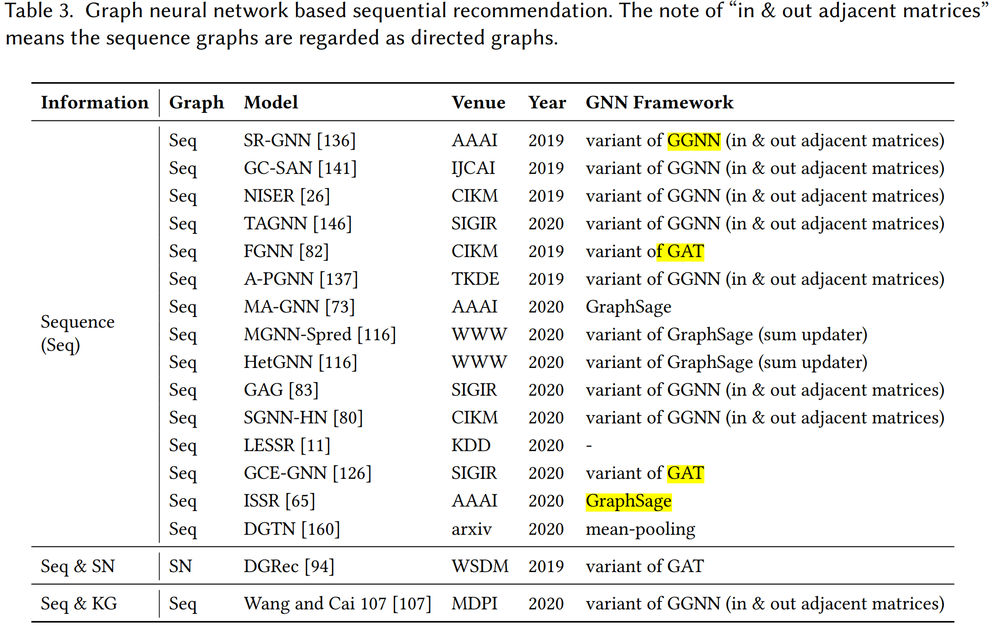
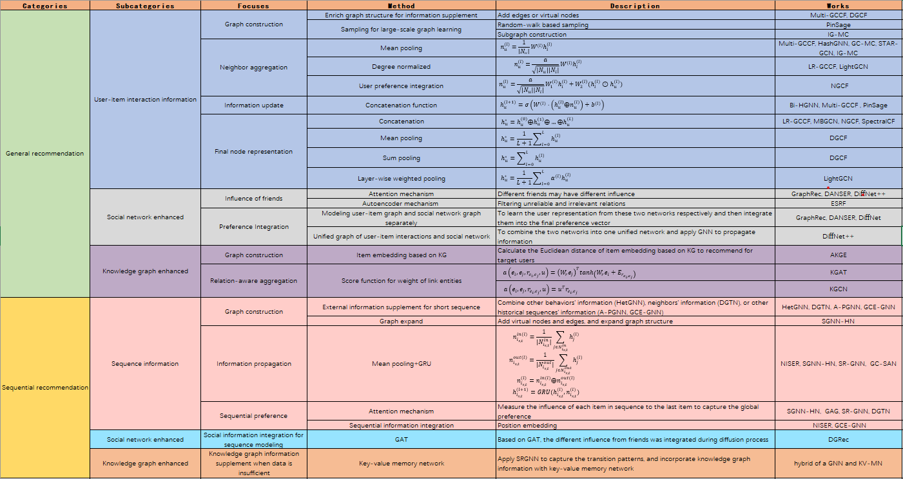

# Graph Neural Networks in Recommender Systems: A Survey

## 1. Brief introduction

This survey proposes a systematic classification schema - general recommendation, and sequential recommendation, to organize the existing GNN-based recommendation models. 

- **General recommendation**: modeling user’s static preferences from implicit (e.g., clicks, reads, or purchases) or explicit (i.e., ratings) feedbacks.

Given the interaction matrix $U\times I$ of user set *U* and item set *I*, the general recommendation is to predict the preference for any user $u\in U$ to any item $i\in I$ via the learned the user representation $h_u^*$ and item representation $h_i^*$, 

$$
y_{u,i}=f(h_u^*,h_i^*)\tag{1}
$$

where, $y_{u, i}$ is the score of user $u$ to the item $i$, which can be represented as a probability. And $f(\cdot)$ is the score function, which can be designed as dot product, cosine, multi-layer perceptions, etc. There are abundant works focusing on general recommendation tasks, such as Matrix Factorization, Latent Factor Model, Naive Bayes, Clustering, Multi-layer perceptions, Graph model, and deep learning methods.

- **Sequential recommendation**: modeling user’s dynamic preferences from the sequential behaviors. 

We represent the interaction sequence for user $u$ with $s^u=[i_{s,1}, i_{s,2},...,i_{s,n}]$, where $i_{s,t}$ denotes the item which user $u$ interacts at the time step $t$ and $n$ denotes the length of interaction sequence. Thus, the sequential recommendation is to predict the most possible interaction item $i$ for user $u$ at the next step $n+1$,

$$
i_{s,n+1}^*=arg\; maxP(i_{s,n+1}=i|s^u)\tag{2}
$$

For sequence modeling, Markov Chain and some random walk models were fundamental methods in the early stage. Owing to the powerful feature representation ability, Recurrent Neural Network was applied to capture sequence patterns. Inspired by the outperformance of Transformer in NLP tasks, the self-attention strategy was introduced to model item interactions, which allows more flexibility to item-to-item transitions.

Based on that framework of recommendation system research, the author further categorizes this task into three categories: only interaction information, social network enhanced, and knowledge graph enhanced, respectively.  

Furthermore, the author also analyses the main challenges for each subcategory and introduces some latest works and developments in this direction. 

## 2. Some basic models for Graph Neural Network (GNN)

The main idea of GNN is to iteratively aggregate feature information from neighbors and integrate the aggregated information with the current central node representation during the propagation process. From the perspective of network architecture, GNN is to stack multiple propagation layers, which consist of aggregation and update operations. 

Based on the above description, the GNN network main includes two steps: Neighbor Aggeration, and Information Update. 

- **Neighbor Aggeration**: Aggregate the information from neighbor nodes. According to existing works, the aggeration operation can either be finished by mean-pooling operation, which regards each neighbor equally, or by attention mechanism, which considers different neighbors may have different significances.    
- **Information Update**: Integrate the central node representation and the aggregated representation of its neighbors. To integrate the two representations from neighbors and central node, GRU, concatenation with nonlinear transformation, and sum operation were also developed.

Analyzing the latest works about GNN for the recommendation, we could summarize four typical frameworks and any other works that may derive from that. 

## 2.1 [GCN](https://arxiv.org/pdf/1609.02907.pdf)

GCN is a typical convolutional GNN (ConvGNN), which stacks multiple propagation layers to aggregate information from neighbors and capture the node representation.

Denote the feature representation of layer $l$ as $H^{(l)}$. Thus, the feature representation of layer $l+1$ can be finished by transform, aggregate, and activate those three steps:

$$
H^{(l+1)}=f(H^{(l)}, A)=\delta(AH^{(l)}W^{(l)})\tag{3}
$$

We denote the adjacency matrix which represent the connection of each nodes as $A$, and $W^{(l)}$ as the learned weight. Therefore, $H^{(l)}W^{(l)}$ can be regarded as transformation operation. $AH^{(l)}W^{(l)}$ is the aggretation operation. $\delta(\cdot)$ is the activate function.

Since, adjacency matrix $A$ does not consider the own feature of each node, which may be unreasonable for feature representation. In addition, as iteration goes by, the feature vectors of those nodes that have a big degree may explode, while those nodes that have a small degree will vanish, which will lead to numerical instabilities and exploding/vanishing gradients. To alleviate this problem, the adjacent matrix can be normalized by the following trick:

$$
\tilde A=A+I\\
H^{(l+1)}=f(H^{(l)}, A)=\delta(\tilde D^{-1} \tilde AH^{(l)}W^{(l)})\tag{4}
$$

where $\tilde D$ is a degree matrix of $\tilde A$, and $\tilde D_{ii}=\sum_j \tilde A_{ij}$. Hence, the normalized operation is just to calculate the mean value of neighbors.

The symmetric normalization Laplacian could further applied to replace the means normalization, 

$$
H^{(l+1)}=\delta(\tilde D^{-1/2} \tilde A \tilde D^{-1/2} H^{(l)}W^{(l)})\tag{5}
$$

Compared to means normalization, symmetric normalization Laplacian has many fantastic properties. 

- Based on Laplacian regularization, the neighbors' degrees can also be considered. 
- Laplacian matrix is symmetric, which can be diagonalized, and spectral decomposed. By spectral graph convolution, the feature map of a graph can be learned effectively.
- In the Laplacian matrix, only 1-hop nodes and central nodes are nonzero. By multiplying the Laplacian matrix, we can integrate 1-hop neighbors' information.

Overall, GCN can iteratively aggregate information from neighbors by approximating the first-order eigendecomposition of the graph Laplacian.

Although, GCN is a breakthrough for graph neural networks, there are still some problems. The big bottleneck is computation consumption. Since the final node feature representation is determined by multi-layer convolution, and the next layer representation relies on the former layer's. Besides, each node representation was aggregated by their neighbors'. Thus, if any subtle perturbation happens or some nodes, links changed/updated, the whole graph nodes representation should be updated again. This problem greatly hinders the application of GCN in practices.

## 2.2 [GraphSage](https://arxiv.org/pdf/1706.02216.pdf)

GraphSage samples a fixed size of the neighborhood for each node then applies to mean/sum/max pooling for aggregation and adopts concatenation operation for updating.

To avoiding update the whole graph when just a small change or adjustment happens, GraphSage attempt to learn the node representation just by limited neighbors. 

$$
n_v^{(l)}=AGGREGATE_l({h_u^l,\forall u\in N_v})\\
h_v^{(l+1)}=\delta(W^{(l)}\cdot [h_v^{(l)} \oplus n_v^{(l)}])\tag{6}
$$

where $h_v^{(l)}$ is the hidden state of node embedding at layer $l$, $n_v^{(l)}$ is the aggregated vector of node $v$'s neighbors at layer $l$, and $N_v$ is the neighborhood set of node $v$. $AGGREGATE_l$ denotes the aggregation function at $l^{th}$ layer, $\delta(\cdot)$ is the nonlinear activation function, and $W^{(l)}$ is the learnable transformation matrix.

The aggregation functions include:
 1. **Mean aggregator**. Calculate the means of neighbors.
 2. **GCN aggregator**.  $ h_v^{(l)}\leftarrow \delta(W\cdot MEAN({h_v^{l-1}}\cup {h_{u}^{l-1},\forall u\in N(v)}))$.
 3. **LSTM aggregator**. Random sampling neighbors and ignore the sequence. Putting them to LSTM network and learning the representation.
 4. **Pooling aggregator.** Each neighbor’s vector is independently fed through a fully-connected neural network; following this transformation, an elementwise max-pooling operation is applied to aggregate information across the neighbor set $AGGREGATE_l^{pool}=max({\delta(W_{pool}h_{u_i}^l+b),\forall u_i\in N(v)})$.

## 2.3 [GAT](https://arxiv.org/pdf/1710.10903.pdf)

Each neighbor may have different effects for node information aggregation, the self-attention mechanism allows for assigning different importances to different nodes. By leveraging attention mechanism, GAT updates the vector of each node by attending over its neighbors,

$$
\alpha_{vj}=\frac{exp(LeakyReLU(a^T[w^{(l)}h_v^{(l)}\oplus W^{(l)}h_j^{(l)}]))}{\sum_{k\in N_v}exp(LeakyReLU(a^T[w^{(l)}h_v^{(l)}\oplus W^{(l)}h_k^{(l)}]))}\\
h_v^{(l+1)}=\delta (\sum_{j\in N_v}\alpha_{vj}W^{(l)}h_j^{(l)})\tag{7}
$$

where $\alpha_{vj}$ represents the effect of neighbor $j$ on node $j$. $a$ is the learnable parameter and $W^{(l)}$ is responsible for transforming the node representations at $l^{th}$ propagation.

## 2.4 [GGNN](https://arxiv.org/pdf/1511.05493.pdf)

GGNN is a typical RecGNN for graph node representation. RecGNN aims to learn high-level node representations with recurrent neural structures, that is the same set of parameters is applied recurrently over nodes. In GGNN, a gated recurrent unit (GRU) was adopted in the update step,

$$
n_v^{(l)}=\frac{1}{|N_v|}\sum_{j\in N_v}h_j^{(l)}\\
h_v^{(l+1)}=GRU(H_v^{(l)},n_v^{(l)})\tag{8}
$$

And the basic GRU unit is,

$$
a_v^{(l)}=A_v^T[h_1^{l-1},...,h_N^{l-1}]^T+b\\
z_v^l=\delta(W^za_v^l+U^Zh_v^{l-1})\\
r_v^l=\delta(W^ra_v^l+U^rh_v^{l-1})\\
\tilde h_v^t=tanh(Wa_v^l+U(r_v^l\odot h_v^{l-1}))\\
h_v^l=(1-z_v^l)\odot h_v^{l-1}+z_v^l\odot \tilde h_v^l\tag{9}
$$

where $A_v$ is the adjacent matrix, and $W, U, b$ are learning weights. $h_N$ are the neighbors' hidden state of node $v$. Since GGNN runs the recurrent function several times over all nodes,  for large graphs the computation consumption may be huge.

## 3. General recommendation

Based on the framework of recommendation categories, the general recommendation includes User-item interaction information, social-network enhanced, and knowledge graph enhanced.

### 3.1 User-item interaction information

Based on the user-item interaction matrix, we could follow the below framework to realize recommendation

The complete pipeline of GNN for user-item bipartite graph includes four steps:

**1. Graph Construction**. As for graph construction, we have to transform the user-item interaction matrix into a graph structure. However, there are two challenges to graph construction.
    
- **How to learn effective user/item representation when the original graph can not provide sufficient information.** One strategy is to add edges or virtual nodes to enrich the graph structure. Such works include [Multi-GCCF](https://arxiv.org/pdf/2001.00267.pdf), [DGCF](https://arxiv.org/pdf/2011.02100.pdf), and so on.
- **How to propagate information efficiently on the graph with millions even billions of nodes.** The sampling strategy has been proved practicable for large-scale graph learning. [PinSage](https://arxiv.org/pdf/1806.01973.pdf?source=post_page---------------------------) designs a random-walk based sampling method to obtain the fixed size of neighborhoods with the highest visit counts. [IG-MC](https://arxiv.org/pdf/1904.12058.pdf) uses target user/item, and their one-hop neighbors as nodes to construct the subgraph and reduce the scale of the graph. 

**2. Neighbor aggregation.** Neighbor aggregation decides how much neighbors' information should be propagated.

- **Mean-pooling** is one of the most straightforward aggregation operations,

$$
n_u^{(l)}=\frac{1}{|N_u|}W^{(l)}h_i^{(l)}\tag{10}
$$

Mean-pooling is easy for implementation but might be inappropriate when the importance of neighbors is significantly different. 

- **Degree normalized**. Based on the graph structure, GCN applies degree normalized operation to assign weights.

$$
n_u^{l}=\sum_{i\in N_u}\frac{a}{\sqrt{|N_u||N_i|}}W^{(l)}h_i^{(l)}\tag{11}
$$

Degree normalized aggregation functions determine the importance of neighbors according to the graph structure but ignore the relationships between the connected nodes.

- **User preference integration**. Motivated by common sense that the embeddings of items in line with the user’s interests should be passed more to the user (analogously for the items), [NGCF](https://arxiv.org/pdf/1905.08108.pdf)  employs element-wise product to augment the items’ features which the user cares about or the users’ preferences for features the item has.

$$
n_u^{l}=\sum_{i\in N_u}\frac{a}{\sqrt{|N_u||N_i|}}(W_1^{(l)}h_i^{(l)}+W_2^{(l)}(h_i^{(l)}\odot h_u^{(l)}))\tag{12}
$$

**3. Information update.** Update the central node representation based on neighbors and central node representation aggregation.

$$
h_u^{(l+1)}=\sigma (W^{(l)}\cdot (h_u^{(l)}\oplus n_u^{(l)})+b^{(l)})\tag{13}
$$

**4. Final node representation.** Some works use last layer representation as to the final node representation, this strategy may lose the abundant individual information and connection features. Recent studies summarize four methods for representation integration. 

- **Concatenation.** $h_u^*=h_u^{(0)}\oplus h_u^{(1)}\oplus...\oplus h_u^{(L)}$.
- **Mean pooling.** $h_u^*=\frac{1}{L+1}\sum_{l=0}^L h_u^{(l)}$.
- **Sum pooling.** $h_u^*=\sum_{l=0}^L h_u^{(l)}$.
- **Layer-wise weighted pooling.** $h_u^*=\frac{1}{L+1}\sum_{l=0}^L \alpha^{(l)} h_u^{(l)}$.

Generally speaking, the strategies for GNN recommendation based on user-item interaction information can be concluded like below,

| Key points | Method | Description |
| --- | --- | --- | 
| Graph Construction | Enrich graph structure for information supplement | Add edges or virtual nodes |
|  | Sampling for large-scale graph learning | Random-walk based sampling |
|  |  | Subgraph construction |
| Neighbor aggregation | Mean pooling | $n_u^{(l)}=\frac{1}{\lvert N_u\rvert}W^{(l)}h_i^{(l)}$ |
|  | Degree normalized | $n_u^{l}=\sum_{i\in N_u}\frac{a}{\sqrt{\lvert N_u \rvert \lvert N_i\rvert}}W^{(l)}h_i^{(l)}$ |
|  | User preference integration | $n_u^{l}=\sum_{i\in N_u} \frac{a}{\sqrt{\lvert N_u\rvert \lvert N_i\rvert}} (W_1^{(l)}h_i^{(l)}+W_2^{(l)}(h_i^{(l)}\odot h_u^{(l)}))$ |
| Information update | Concatenation function | $h_u^{(l+1)}=\sigma (W^{(l)}\cdot (h_u^{(l)}\oplus n_u^{(l)})+b^{(l)})$ |
| Final node representation | Concatenation | $h_u^*=h_u^{(0)}\oplus h_u^{(1)}\oplus...\oplus h_u^{(L)}$ | 
|  | Mean pooling | $h_u^*=\frac{1}{L+1}\sum_{l=0}^L h_u^{(l)}$ |
|  | Sum pooling | $h_u^*=\sum_{l=0}^L h_u^{(l)}$ |
|  | Layer-wise weighted pooling | $h_u^*=\frac{1}{L+1}\sum_{l=0}^L \alpha^{(l)} h_u^{(l)}$ |

### 3.2 Social networks enhanced 

Assuming that users with social relationships should have similar representations based on the social influence theory that connected people would influence each other,  social recommender systems have been proposed to utilize each user’s local neighbors’ preferences to enhance user modeling. 

To incorporate relationships among users into interaction behaviors by leveraging GNN, there are two main issues to deal with:

**1. Influence of friends.** The influence of friends may not be equal. Attention mechanism can be leveraged for the influence measurement based on social relationships. Furthermore, [ESRF](https://arxiv.org/pdf/2004.02340.pdf) leverages the autoencoder mechanism to modify the observed social relationships by filtering irrelevant relationships and investigating the new neighbors.

**2. Preference Integration.** For social network enhanced recommendation, there are two heterogeneous graphs - social network and user-item graph. How to combine those two graph information is a key issue.    

- To learn the user representation from these two networks respectively and then integrate them into the final preference vector.
- To combine the two networks into one unified network and apply GNN to propagate information.

### 3.3 Knowledge graph enhanced

The knowledge graph can rich semantic relatedness among items and improve the item representation. Besides, it is also beneficial for recommendation explainability. Previous works about knowledge graph enhanced recommendation main focus on entities or relations embedding via knowledge representation, like TransX models. However, those works are more suitable for link prediction rather than a recommendation. Some studies also explore neighbor information aggregation by meta-paths methods. But the meta-path design heavily relies on manual work and domain knowledge, which is labor-intensive and time-consuming. 

There are two main issues for knowledge graph enhanced recommendation:

- **Graph Construction.** Like the social relationship recommendation, we also have to integrate two heterogeneous graphs - knowledge graph and user-item graph. [ATBRG](https://arxiv.org/pdf/2005.12002.pdf) first pretrained the item embedding based on KG, then calculate the embedding Euclidean distance between two linked nodes based on the item-user graph. For target users, ATBRG selects the shortest distance items to recommend.
- **Relation-aware Aggregation.** To enrich the representation of central nodes, we could integrate the relation information of linked entities based on a knowledge graph.  

Denote the link entities weights as score function $a(e_i,e_j,r_{e_i,e_j},u)$,

$$
a(e_i,e_j,r_{e_i,e_j},u)=(W_re_j)^Ttanh(W_re_i+E_{r_{e_i,e_j}})\tag{14}
$$

where $W_r$ is the transformation matrix for the relation, which maps the entity into relation space. In this way, the closer entities would pass more information to the central node. 

The typical works for the general recommendation based on GNN can be summarized below,

## 4. Sequential Recommendation

Sequential recommendation predicts users’ next preferences based on their most recent activities. Compared to the general recommendation, the sequential recommendation can capture the dynamic change of user's preference perfectly, and recommendation precisely. First, the user's historical information was transformed into a sequence graph, then based on GNN to the recommendation. According to the categories, the sequential recommendation can be summarized as three parts: sequence information, social network enhanced, and knowledge graph enhanced.

### 4.1 Sequence information

The overall framework of GNN in sequential recommendation can be illustrated below:

The completed sequence recommendation includes three steps:

- **Graph Construction** 

For sequence recommendation, we have to construct a sequence graph based on the user's sequence data. Then, applying GNN to predict the user's next behavior and recommendation. The most straightforward method is to regard users ' each interacted item as a node and add an edge between consecutive items to construct the graph. However, in most scenarios, the users' historical information is limited, and the length of the sequence is short, which may be difficult for GNN to learn some valuable patterns.

Since the length of the sequence is short, most works explore to introduce more external information. Such as combine other behaviors' information ([HetGNN](https://arxiv.org/pdf/2002.07993.pdf)), neighbors' information ([DGTN](https://arxiv.org/pdf/2009.10002.pdf)), or other historical sequences' information ([A-PGNN ](https://arxiv.org/pdf/1910.08887.pdf), [GCE-GNN](https://oar.a-star.edu.sg/storage/z/zy1gdwnwe2/sigir-20.pdf)). Another mainstream approach is to adjust the structure to aggregate more information. Considering the above works only create a connection between consecutive items, [SGNN-HN](https://staff.fnwi.uva.nl/m.derijke/wp-content/papercite-data/pdf/pan-2020-star.pdf)  introduces a virtual “star” node as the center of the sequence and adds edges for all items to enrich the nodes information.

- **Information Propagation** 

The propagation functions are given as follows:

$$
n_{i_{s,t}}^{in(l)}=\frac{1}{|N_{i_{s,t}}^{in}|}\sum_{j\in N_{i_{s,t}}^{in}}h_j^{(l)}\\
n_{i_{s,t}}^{out(l)}=\frac{1}{|N_{i_{s,t}}^{out}|}\sum_{j\in N_{i_{s,t}}^{out}}h_j^{(l)}\\
n_{i_{s,t}}^{(l)}=n_{i_{s,t}}^{in(l)}\oplus n_{i_{s,t}}^{out(l)}\\
h_{i_{s,t}}^{(l+1)}=GRU(h_{i_{s,t}}^{(l)},n_{i_{s,t}}^{(l)})\tag{15}
$$

where $N_{i_{s,t}}^{in}, N_{i_{s,t}}^{out},$ denotes the neighborhood set of previous items and next items. In Equation 15, each neighbor was considered to have the same importance, since mean-pooling was applied for neighbor's information aggeration. Unlike that, some works substitute attention mechanism to mean pooling and to model the importance of different neighbors. 

- **Sequential preference** 

Considering that the items in a sequence have different levels of priority, the attention mechanism is widely adopted for integration. Based on the last item and all other items in sequence, we could measure the influence of each historical item on the last item, thus, the global preference can be captured effectively. In addition, most of the graph construction methods of transforming sequences into graphs lose part of the sequential information. [NISER](https://arxiv.org/pdf/1909.04276.pdf) and [GCE-GNN](https://oar.a-star.edu.sg/storage/z/zy1gdwnwe2/sigir-20.pdf) add the positional embeddings to obtain position-aware item representations. 

### 4.2 Social networks enhanced

[DGRec](http://www.cs.toronto.edu/~lcharlin/papers/fp4571-songA.pdf) defines the user representation as combined by some statistic latent preference and dynamic preference, which represented by sequence model - LSTM. Then, GAT was also proposed to integrate social relations during the diffusion process.

### 4.3 Knowledge graph enhanced

Knowledge graph will provide abundant external information especially when the sequence data is insufficient. ANd the key-value memory network was applied for knowledge graph information extraction.

In conclusion, sequential recommendation and the above works we discussed can be briefly summarized in table 3 and table respectively.

Table 4. Graph neural network based models in recommendation tasks

## 5. Future research directions and open issues

- **GNN for Heterogeneous Graphs in Recommendation.**  Due to some unique characteristics of heterogeneous graphs, directly applying methods for homogeneous graphs to them may lead to suboptimal representations. Some works apply meta-paths to guide the propagation process. However, meta-path design heavily relies on professional knowledge and hand-working. Besides, some works apply a hierarchical aggregation strategy for heterogeneous graphs learning, i.e., first aggregating the grouped neighbors within each type, and then integrating the aggregated representation across different types. 
- **Diverse and Uncertain Representation.** Users may have many multiple and uncertain interests. To learn those interests, disentangled representation learning and capsule network were developed. Some works also add orthogonal constraints to induce the network to learn multi-aspect representations. Another feasible solution is to represent each user as a density instead of a vector. To be specific, Gaussian embedding can be utilized to represent user's diverse and uncertain interests.
- **Scalability of GNN in Recommendation.** Large-scale graph learning is difficult for traditional GNN, due to large memory usage and long training time. Sampling is a wildly adopted strategy, but it may lose some information.
- **Dynamic Graphs in Recommendation.** In real-world recommender systems, not only the objects such as users and items, but also the relationships between them are changing over time. How to design the corresponding GNN framework in response to the dynamic graphs in practice is an interesting perspective research problem.
- **Graph Adversarial Learning in Recommendation.** In practice, users may accidentally click the items, or some relations and nodes are unreliable. So how to filter this noise data, adversarial learning is an attrective direction for a more robust recommender system.
- **Reception Field of GNN in Recommendation.** The reception field of a node refers to a set of nodes including the node itself and its neighbors reachable within K-hops, where K is the number of propagation iterations. However, if K is too large, some noise will be introduced, if K is too small, much useful information may be ignored. Besides, the active users may have lots of interaction, while cold users have few interactions. Hence, it is not reasonable if we use the fixed k.

## 6. Some valuable information
- In fact, using collaborative signals to improve representation learning in recommender systems is not a new idea that originated from GNN. Early efforts, such as SVD++ and FISM, have already demonstrated the effectiveness of the interacted items in user representation learning.
- There exist comprehensive surveys on
recommender systems ([Quadrana, *et al.*](https://arxiv.org/pdf/1802.08452.pdf); [S Zhang, *et al.*](https://arxiv.org/pdf/1707.07435.pdf)) or graph neural networks ([Z Wu, *et al.*](https://arxiv.org/pdf/1901.00596.pdf); [J Zhou, *et al.*](https://arxiv.org/ftp/arxiv/papers/1812/1812.08434.pdf)).
- According to whether the users are anonymous or not and whether the behaviors are segmented into sessions, works in this field can be further divided into sequential recommendation and session-based recommendation. The session-based recommendation can be viewed as a sub-type of sequential recommendation with anonymous and session assumptions. 
- Sampling is a trade-off between the original graph information and computational efficiency. The PinSage includes more randomness while IG-MC sacrifices more graph information. In terms of transferring, the sampling method of IG-MC is preferable; otherwise, the strategy of PinSage might be better.
- Note that some works observe that nonlinear activation contributes little to the overall performance, and they simplify the update operation by removing the non-linearities, thereby retaining or even improving performance and increasing computational efficiency.
- In most scenarios, the length of the user sequence is short, e.g., the average length on the preprocessed Yoochoose$1/4^2$ dataset is 5.71.
