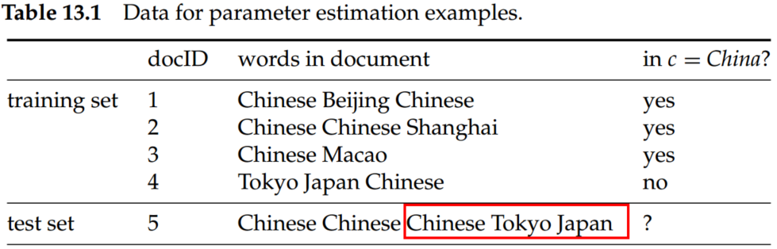
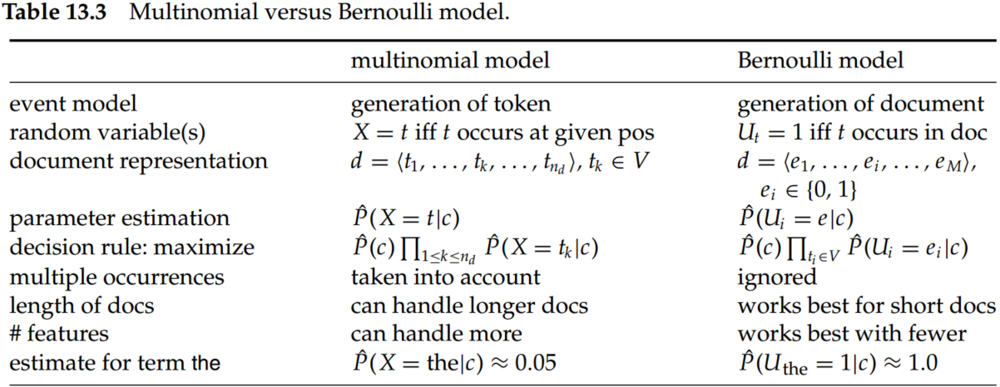
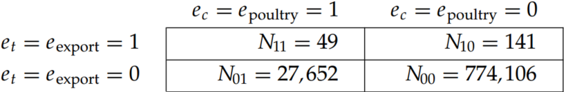
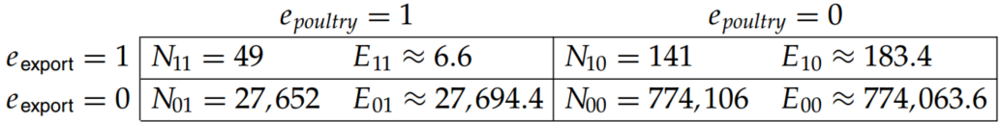
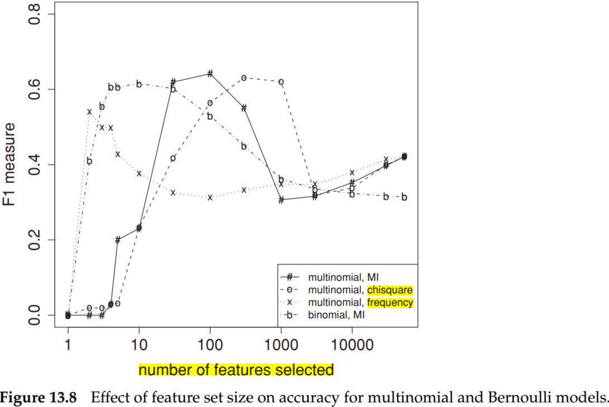
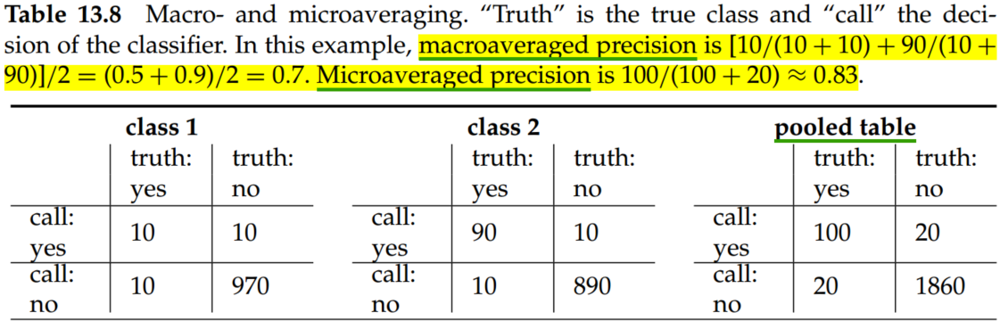
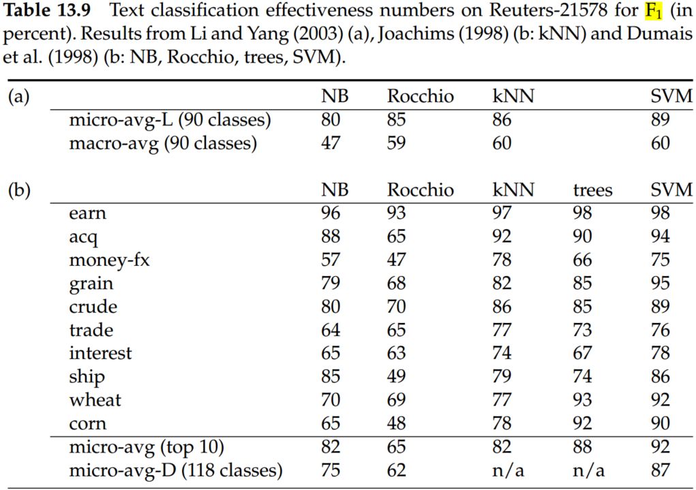

# Chapter 13 Text classification and Naive Bayes

## 1. Naive Bayes text classification

$$
P(c|d)\propto P(c)\prod _{1\leq k\leq n_d}P(t_k|c)\tag{1}
$$

where $P(t_k|c)$ is the conditional probability of term $t_k$ occurring in a document $d$ of class $c$.

An alternative formalization of the multinomial model represents each document $d$ as an M-dimensional vector of counts $<tf_{t_1,d},...,tf_{t_M,d}>$ where $tf_{t_i,d}$ is the term frequency of $t_i$ in $d$. Thus,

$$
P(c|d)\propto P(c)\prod_{1\leq k\leq n_d}P(t_k|c)^{tf_{t_k}}
$$

In text classification, our goal is to find the best class for the document. The best class in NB classification is the most likely or maximum a posteriori (MAP) class $c_{map}$:

$$
c_{map}=arg\,max_{c\in \mathbb C}[log\hat P(c)+\sum_{1\leq k\leq n_d}log \hat P(t_k|c)]\tag{2}
$$

where $\mathbb C$ is the set of classes $\mathbb C=\{c_1,c_2,...,c_j\}$.

$$
\hat P(c)=\frac{N_c}{N}\\
\hat P(t|c)=\frac{T_{ct}+1}{\sum_{t'\in V}(T_{ct'}+1)}=\frac{T_{ct}+1}{\sum_{t'\in V}T_{ct'}+B'}\tag{3}
$$

where $N_c$ is the number of documents in class $c$ and $N$ is the total number of documents. And $T_{ct}$ is the number of occurrences of $t$ in training documents from class $c$.  $B'=|V|$ is the number of terms in the vocabulary. To eliminate zeros, add-one or Laplace smoothing was approved.  

For the example in Table 13.1, the multinomial parameters we need to classify the test document are the priors $\hat P(c)=3/4$ and $\hat P(\overline c)=1/4$ and the following conditional probabilities:

$$
\hat P(Chinese|c)=(5+1)/(8+6)=3/7\\
\hat P(Tokyo|c)=\hat P(Japan|c)=(0+1)/(8+6)=1/14\\
\hat P(Chinese|\overline c)=(1+1)/(3+6)=2/9\\
\hat P(Tokyo|\overline c)=\hat P(Japan|\overline c)=(1+1)/(3+6)=2/9\\
\hat P(c|d_5) \propto 3/4 \cdot (3/7)^3 \cdot 1/14 \cdot 1/14 \approx 0.0003\\
\hat P(\overline c|d_5) \propto 1/4 \cdot (2/9)^3 \cdot 2/9 \cdot 2/9 \approx 0.0001
$$

## 2. The Bernoulli model

The multivariate Bernoulli model or Bernoulli model is equivalent to the binary independence model, which generates an indicator for each term of the vocabulary, either 1 indicating the presence of the term in the document or 0 indicating absence. 

$$
c_{map}=arg\,max_{c\in \mathbb C}[log\hat P(c)+\sum_{t\in V_d}log \hat P(t|c)+\sum_{t\in V-V_d}log (1-\hat P(t|c))]\tag{4}
$$

where $P(t|c)=\frac{N_{ct}+1}{N_c+2}$.

Applying the Bernoulli model to the example in Table 13.1, we have the same estimates for the priors as before: $\hat P(c)=3/4$ and $\hat P(\overline c)=1/4$. The conditional probabilities are: 

$$
\hat P(Chinese|c)=(3+1)/(3+2)=4/5\\
\hat P(Tokyo|c)=\hat P(Japan|c)=(0+1)/(3+2)=1/5\\
\hat P(Beijing|c)=\hat P(Macao|c)=\hat P(Shanghai|c)=(1+1)/(3+2)=2/5\\
\hat P(Chinese|\overline c)=(1+1)/(1+2)=2/3\\
\hat P(Tokyo|\overline c)=\hat P(Japan|\overline c)=(1+1)/(1+2)=2/3\\
\hat P(Beijing|\overline c)=\hat P(Macao|\overline c)=\hat P(Shanghai|\overline c)=(0+1)/(1+2)=1/3\\
\hat P(c|d_5) \propto \hat P(c)\cdot \hat P(Chinese|c)\cdot \hat P(Japan|c) \cdot \hat P(Tokyo|c) \\\cdot (1-\hat P(Beijing|c))\cdot (1-\hat P(Shanghai|c)) \cdot (1-\hat P(Macao|c))\\= 3/4 \times 4/5) \times 1/5 \times 1/5 \times(1-2/5)^3 \approx 0.0005\\
\hat P(\overline c|d_5) \propto 1/4 \cdot (2/3)^3 \cdot (1-1/3)^3 \approx 0.022
$$

NB is often the method of choice if
- squeezing out a few extra percentage points of accuracy is not worth the trouble in a text classification application;
- a very large amount of training data is available and there is more to be gained from training on a lot of data than using a better classifier on a smaller training set；
- if its robustness to concept drift can be exploited.

## 3. Feature selection

Feature selection serves two main purposes. First, it makes training and applying a classifier more efficient by decreasing the size of the effective vocabulary. This is of particular importance for classifiers that, unlike NB, are expensive to train. Second, feature selection often increases classification accuracy by eliminating noise features. 

### 3.1 Mutual information

A common feature selection method is to compute $A(t,c)$ as the expected mutual information (MI) of terms $t$ and $c$. MI measures how much information the presence/absence of a term contributes to making the correct classification decision on c. Formally:

$$
I(U;C)=\sum_{e_t\in {1,0}}\sum_{e_c\in {1,0}}P(U=e_t,C=e_c)log_2\frac{P(U=e_t,C=e_c)}{P(U=e_t)P(C=e_c)}\tag{5}
$$

where $U$ is a random variable that takes values $e_t = 1$ (the document contains term $t$) and $e_t = 0$ (the document does not contain $t$), and $C$ is a random variable that takes values $e_c = 1$ (the document is in class $c$) and $e_c = 0$ (the document is not in class $c$). 

For MLEs of the probabilities, Equation (5) is equivalent to Equation (6):

$$
I(U;C)=\frac{N_{11}}{N}log_2\frac{NN_{11}}{N_{1.}N{.1}}+\frac{N_{01}}{N}log_2\frac{NN_{01}}{N_{0.}N_{.1}}+\frac{N_{10}}{N}log_2\frac{NN_{10}}{N_{1.}N_{.0}}\frac{N_{00}}{N}log_2\frac{NN_{00}}{N_{0.}N_{.0}}\tag{6}
$$

where the $N_s$ are counts of documents that have the values of $e_t$ and $e_c$ that are indicated by the two subscripts. For example, $N_{10}$ is the number of documents that contain $t$ ($e_t = 1$) and are not in $c$ ($e_c = 0$). $N_{.1} = N_{10} + N_{11}$ is the number of documents that contain $t$ ($e_t = 1$) and we count documents independent of class membership ($e_c \in \{0, 1\}$). $N = N_{11} + N_{01} + N_{10} + N_{11}$ is the total number of documents. 

Consider the class poultry and the term export in Reuters RCV1. The counts of the number of documents with the four possible combinations of indicator values are as follows:

$$
I(U;C)=\frac{49}{801948}log_2\frac{801948\times 49}{(49+27652)\times (49+141)}\\
+\frac{141}{801948}log_2\frac{801948\times 141}{(141+774106)\times (49+141)}\\
+\frac{27652}{801948}log_2\frac{801948\times 27652}{(49+27652)\times (27652+774106)}\\
+\frac{774106}{801948}log_2\frac{801948\times 774106}{(141+774106)\times (27652+774f106)}\\
\approx 0.000105
$$

To select $k$ terms $t_1, ... , t_k$ for a given class, We compute the utility measure as $A(t, c) = I (U_t, C_c)$ and select the $k$ terms with the largest values. As you might expect, keeping the informative terms and eliminating the non-informative ones tends to reduce noise and improve the classifier’s accuracy.

### 3.2 $\chi ^2$ Feature selection

In statistics, the $\chi ^2$ test is applied to test the independence of two events, where two events A and B are defined to be independent if $P(AB) = P(A)P(B)$ or, equivalently, $P(A|B) = P(A)$ and $P(B|A) = P(B)$. 

$$
X^2(\mathbb D,t,c)=\sum_{e_t\in{0,1}}\sum_{e_c\in {0,1}}\frac{(N_{e_te_c}-E_{e_te_c})^2}{E_{e_te_c}}\tag{7}
$$

where  $e_t = 1$ (the document contains term $t$) and $e_t = 0$ (the document does not contain $t$), $e_c = 1$ (the document is in class $c$) and $e_c = 0$ (the document is not in class $c$). $N$ is the observed frequency in $\mathbb D$ and $E$ the expected frequency. For example, $E_{11}$ is the expected frequency of $t$ and $c$ occurring together in a document assuming that term and class are independent.

In 3.1，$E_{11}$ can be computed,

$$
E_{11}=N\times p(t) \times P(c)=N\times \frac{N_{11}+N_{10}}{N}\times \frac{N_{11}+N_{01}}{N}=801948\times \frac{49+141}{801948} \times \frac{49+27652}{801948}\approx 6.6
$$

The other $E_{e_te_c}$ can be computed in the same way:

Plugging these values into equation (7), we get a $X^2$ value of 284.

$X^2$ is a measure of how much expected counts $E$ and observed counts $N$ deviate from each other. A high value of $X^2$ indicates that the hypothesis of independence, which implies that expected and observed counts are similar, is incorrect. In this example, $X^2 \approx 284 > 10.83$. Based on Table 13.6, we can reject the hypothesis that poultry and export are independent with only a 0.001 chance of being wrong. Equivalently, we say that the outcome $X^2 \approx 284 > 10.83$ is statistically significant at the 0.001 level. 

Table 13.6 Critical values of the $\chi^2$ distribution with one degree of freedom. For example, if the two events are independent, then $P(X^2 > 6.63) < 0.01$. So for $X^2 > 6.63$, the assumption of independence can be rejected with 99% confidence.

| p | 0.1 | 0.05 | 0.01 | 0.005 | 0.001 |
| --- | --- | --- | --- | --- | --- |
| $\chi^2$ critical value | 2.71 | 3.84 | 6.63 | 7.88 | 10.83|

An arithmetically simpler way of computing $X^2$ is the following:

$$
X^2(\mathbb D, t, c)=\frac{(N_{11}+N_{10}+N_{01}+N_{00})\times (N_{11}N_{00}-N_{10}N_{01})^2}{(N_{11}+N_{01})\times (N_{11}+N_{10})\times (N_{10}+N_{00})\times (N_{01}+N_{00})}\tag{8}
$$

### 3.3 Frequency-based feature selection

A third feature selection method is frequency-based feature selection, that is, selecting the terms that are most common in the class. Frequency can be either defined as document frequency (the number of documents in the class $c$ that contain the term $t$) or as collection frequency (the number of tokens of $t$ that occur in documents in $c$). Document frequency is more appropriate for the Bernoulli model, collection frequency for the multinomial model.

When many thousands of features are selected, then frequency-based feature selection often does well. Thus, if somewhat suboptimal accuracy is acceptable, then frequency-based feature selection can be a good alternative to more complex methods.

Figure 13.8 shows F1 as a function of vocabulary size after feature selection for Reuters-RCV1. Comparing F1 at 132,776 features (corresponding to selection of all features) and at 10–100 features, we see that MI feature selection increases F1 by about 0.1 for the multinomial model and by more than 0.2 for the Bernoulli model. For the Bernoulli model, F1 peaks early, at ten features selected. At that point, the Bernoulli model is better than the multinomial model. When basing a classification decision on only a few features, it is more robust to consider binary occurrence only. For the multinomial model (MI feature selection), the peak occurs later, at thirty features, and its effectiveness recovers somewhat at the end when we use all features. The reason is that the multinomial takes the number of occurrences into account in parameter estimation and classification and, therefore, better exploits a larger number of features than the Bernoulli model. Regardless of the differences between the two methods, using a carefully selected subset of the features results in better effectiveness than using all features.

## 4. Evaluation of text classification

Macroaveraging computes a simple average over classes. Microaveraging pools per-document decisions across classes, and then computes an effectiveness measure on the pooled contingency table. Macroaveraging gives equal weight to each class, whereas microaveraging gives equal weight to each per-document classification decision. 

Table 13.9 gives microaveraged and macroaveraged effectiveness of Naive Bayes for the ModApte split of Reuters-21578. 

## Conclusions

- A computer is not essential for classification. Many classification tasks have traditionally been solved manually.
- Hand-coded rules have good scaling properties, but creating and maintaining them over time is labor-intensive. 
- Both training and testing complexity are linear in the time it takes to scan the data for NB. Because we have to look at the data at least once, NB can be said to have optimal time complexity. Its efficiency is one reason why NB is a popular text classification method.
- When classifying a test document, the Bernoulli model uses binary occurrence information, ignoring the number of occurrences, whereas the multinomial model keeps track of multiple occurrences. As a result, the Bernoulli model typically makes many mistakes when classifying long documents. 
- NB is also somewhat robust to noise features and concept drift – the gradual change over time of the concept underlying a class like US president from Bill Clinton to George W.
- NB’s main strength is its efficiency: Training and classification can be accomplished with one pass over the data.
- The Bernoulli model is particularly robust with respect to concept drift.
- Classification accuracy often decreases when selecting $k$ common features for a system with $n$ classifiers as opposed to $n$ different sets of size $k$. But even if it does, the gain in efficiency owing to a common document representation may be worth the loss in accuracy.
- $\chi^2$ selects more rare terms (which are often less reliable indicators) than mutual information.
- In most text classification problems, there are a few strong indicators and many weak indicators. As long as all strong indicators and a large number of weak indicators are selected, accuracy is expected to be good. 
- Many practitioners have had the experience of being unable to build a fancy classifier for a certain problem that consistently performs better than NB.
- Although most researchers believe that an SVM is better than kNN and kNN better than NB, the ranking of classifiers ultimately depends on the class, the document collection, and the experimental setup.
- Ng and Jordan (2001) show that NB is sometimes (although rarely) superior to discriminative methods because it more quickly reaches its optimal error rate.
