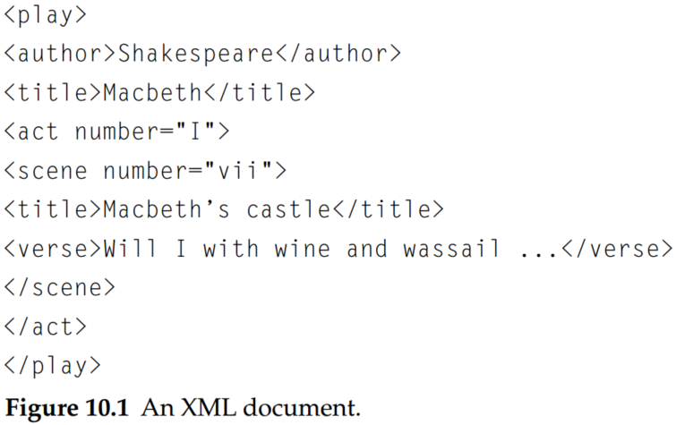

# Introduction to Information Retrieval (Chapter 10 XML retrieval)

## 1. Basic concepts

- **XML.** Extensible markup language or XML, which is currently the most widely used standard for encoding structured documents.

An XML document is an ordered, labeled tree. Each node of the tree is an XML element and is written with an opening and closing tag. An element can have one or more XML attributes.

In the XML document in Figure 10.1, the scene element is enclosed by the two tags <scene ...> and </scene>. It has an attribute number with value vii and two child elements, title, and verse.

Figure 10.2 shows Figure 10.1 as a tree. The leaf nodes of the tree consist of text, for example, Shakespeare, Macbeth, and Macbeth’s castle. The tree’s internal nodes encode either the structure of the document (title, act, and scene) or metadata functions (author)

The standard for accessing and processing XML documents is the XML DOM document object model or DOM. The DOM represents elements, attributes, and text within elements as nodes in a tree. Figure 10.2 is a simplified DOM representation of the XML document in Figure 10.1.2

There are fundamental differences between IR and database systems in terms of retrieval model, data structures, and query language, as shown in Table 10.1.

- **XPath.** XPath is a standard for enumerating paths in an XML document collection.

- **NEXI.** A common format for XML queries is NEXI (Narrowed Extended XPath I).

The query in Figure 10.3 specifies a search for sections about the summer holidays that are part of articles from 2001 or 2002. As in XPath, double slashes indicate that an arbitrary number of elements can intervene on a path. The dot in a clause in square brackets refers to the element the clause modifies. The clause [.//yr = 2001 or .//yr = 2002] modifies //article. Thus, the dot refers to //article in this case. Similarly, the dot in [about(., summer holidays)] refers to the section that the clause modifies. 

The two *yr* conditions are relational attribute constraints. Only articles whose yr attribute is 2001 or 2002 (or that contain an element whose yr attribute is 2001 or 2002) are to be considered. The about clause is a ranking constraint: Sections that occur in the right type of article are to be ranked according to how relevant they are to the topic *summer holidays*.

- **Structured document retrieval principle.** A system should always retrieve the most specific part of a document answering the query.

- **CO topics.** CO topics are regular keyword queries as in unstructured information retrieval.

- **CAS topics.**  CAS topics have structural constraints in addition to keywords.

## 2. A vector space model for XML retrieval

The dimensions of vector space in unstructured retrieval are vocabulary terms, whereas they are lexicalized subtrees in XML retrieval.

There is a tradeoff between the dimensionality of the space and the accuracy of query results. If we trivially restrict dimensions to vocabulary terms, then we have a standard vector space retrieval system that will retrieve many documents that do not match the structure of the query (e.g., Gates in the title as opposed to the author element). If we create a separate dimension for each lexicalized subtree occurring in the collection, the dimensionality of the space becomes too large. 

A compromise is to index all paths that end in a single vocabulary term (the vocabulary term must be the leaf nodes in XML), in other words, all XML-context/term pairs. We call such an XML-context/term pair a **structural term** and denote it by $<c, t>$: a pair of XML-context $c$ and vocabulary term $t$. 

Thus, the all structural terms in $d_3$ in Figure 10.6 are (Bill, Gates, firstname/Bill, lastname/Gates, author/firstname/Bill, author/lastname/Gates, book/author/firstname/Bill, book/author/lastname/Gates). 

The score for a query $q$ and document $d$ is computed as a variant of the cosine measure, which we call SIMNOMERGE. SIMNOMERGE is defined as follows:

$$
SIMNOMERGE(q,d)=\sum_{c_k \in B} \sum_{c_l \in B} CR(c_k,c_l)\sum_{t\in V}weight(q,t,c_k)\frac{weight(d,t,c_l)}{\sqrt{\sum_{c\in B, t\in V}weight^2(d,t,c)}}\tag{1}
$$

$$
CR(c_q,c_d)=\begin{cases}
\frac{1+|c_q|}{1+|c_d|} & if \; c_q\; mathces\; c_d\\
0 & if \; c_q \; dose\; not \; mathces\; c_d\tag{2}
\end{cases}
$$

where the context resemblance function $CR(c_q,c_d)$ is the similarity of a path $c_q$ in a query a a path $c_d$ in a document. $|c_q|$ and $|c_d|$ are the number of nodes in the query path and document path, respectively, and $c_q$ mathces $c_d$ iff we can transform $c_q$ into $c_d$ by inserting additional nodes. $V$ is the vocabulary of nonstructural terms; $B$ is the set of all XML contexts; and weight $(q , t, c)$ and weight $(d, t, c)$ are the weights of term $t$ in XML context $c$ in query $q$ and document $d$, respectively. We compute the weights using one of the weightings, such as, $idf_t · wf_{t,d}$.

Two examples from Figure 10.6 are $CR(c_{q_4},c_{d_2})=\frac{1+2}{1+3}=\frac{3}{4}=0.75$ and $CR(c_{q_4},c_{d_3})=\frac{3}{5}=0.6$, where $c_{q_4}$, $c_{d_2}$, and $c_{d_3}$ are the relevant paths from top to leaf node in $q_4$, $d_2$, and $d_3$, respectively. 

The pseudocode of SIMNOMERGE is below:

Suppose the query weight of $<t, c_1>$ is 1.0, that is to say $weight(q,t,c_1)=1$. Based on the formula (1), we calculate $SIMNOMERGE(q,d_9)$,

$$
SIMNOMERGE(q,d_9)=\sum_{c_k \in B}\sum_{c_l \in B}CR(c_k,c_l)\sum_{t\in V}weight(q,t,c_k)\frac{weight(d_9,t,c_l)}{\sqrt{\sum_{c\in B, t\in V}weight^2(d_9,t,c)}}\\
=\sum_{c_l\in B}CR(c_1,c_l)\sum_{t=t_1}weight(d_9,t_1,c_l)=1.0\times 0.2+0.63\times 0.6 =0.578.
$$

An alternative similarity function is SimMerge, which relaxes the matching conditions of query and document further in the three ways. These three changes alleviate the problem of sparse term statistics and increase the robustness of the matching function against poorly posed structural queries.

## 3.Evaluation of XML retrieval

INEX 2002 defined **component coverage** and **topical relevance** as orthogonal dimensions of relevance.

- The component coverage dimension evaluates whether the element retrieved is “structurally” correct, that is, neither too low nor too high in the tree. It can be distinguished four cases:
    - **Exact coverage (E).** The information sought is the main topic of the component, and the component is a meaningful unit of information.
    - **Too small (S).** The information sought is the main topic of the component, but the component is not a meaningful (self-contained) unit of information.
    - **Too large (L).** The information sought is present in the component but is not the main topic.
    - **No coverage (N).** The information sought is not a topic of the component.

- The topical relevance dimension also has four levels: highly relevant(3), fairly relevant(2), marginally relevant(1), and nonrelevant(0). 

The relevance–coverage combinations are quantized as follows:

$$
Q(rel, cov)=\begin{cases}
1.00\; & if\; (rel,cov)=3E\\
0.75\; & if\; (rel,cov)\in {2E, 3L}\\
0.50\; & if\; (rel,cov)\in {1E, 2L, 2S}\\
0.25\; & if\; (rel,cov)\in {1S, 1L}\\
0.00\; & if\; (rel,cov)=0N
\end{cases}\tag{3}
$$

The number of relevant components in a retrieved set A of components can then be computed as:

$$
\#(relevant \; items \; retrieved)=\sum_{c \in A} Q(rel(c),cov(c)) \tag{4}
$$

## Conclusions

- There is no consensus yet as to which methods work best for structured retrieval, although many researchers believe that XQuery will become the standard for structured queries.
- Many structured data sources containing text are best modeled as structured documents rather than relational data. 
- Unranked retrieval models like the Boolean model suffer from low recall.
- A perhaps more widespread use of XML is to encode nontext data.
- The data model of parametric and zone search is flat; that is, there is no nesting of attributes. The number of attributes is small. In contrast, XML documents have the more complex tree structure, in which attributes are nested. The number of attributes and nodes is greater than in parametric and zone search.
- For structure retrieval, we can use one of the largest element as the indexing unit, then postprocess search results to the subelement that is the best hit. Unfortunately, this two-stage retrieval process fails to return the best subelement for many queries because the relevance of a whole book is often not a good predictor of the relevance of small subelement within it.  
- Elements that do not meet structural constraints perfectly should be ranked lower, but they should not be omitted from search results.
- The first challenge in structured retrieval is that users want us to return parts of documents (i.e., XML elements), not entire documents as IR systems usually do in unstructured retrieval. 
- A challenge in XML retrieval related to nesting is that we may need to distinguish different contexts of a term when we compute term statistics for ranking, in particular inverse document frequency (idf) statistics.
- In many cases, several different XML schemas occur in a collection because the XML documents in an IR application often come from more than one source. This phenomenon is called schema heterogeneity or schema diversity and presents yet another challenge. 
- Effectiveness in XML retrieval is often lower than in unstructured retrieval because XML retrieval is harder. Instead of just finding a document, we have to find the subpart of a document that is most relevant to the query. 
- Structure helps to increase precision at the top of the results list. 
- Chu-Carroll et al. (2006) also present evidence that XML queries increase precision compared with unstructured queries. 
- Structured retrieval imposes additional constraints on what to return and documents that pass the structural filter are more likely to be relevant. Recall may suffer because some relevant documents will be filtered out, but for precision-oriented tasks structured retrieval is superior.
- There are powerful query languages for XML that can handle numerical attributes, joins, and ordering constraints. The best known of these is XQuery, a language proposed for standardization by the W3C.
- Relational databases are better equipped to handle many structural constraints, particularly joins (but ordering is also difficult in a database framework – the tuples of a relation in the relational calculus are not ordered). For this reason, most data-centric XML retrieval systems are extensions of relational databases. If text fields are short, exact matching meets user needs and retrieval results in form of unordered sets are acceptable, then using a relational database for XML retrieval is appropriate.
- Many other unstructured retrieval methods have been applied to XML retrieval with at least as much success as the vector space model. These methods include language models (cf. Chapter 12; e.g., Kamps et al. (2004), List et al. (2005), Ogilvie and Callan (2005)), systems that use a relational database as a backend (Mihajlovic et al. 2005; Theobald et al. 2005, 2008), probabilistic weighting (Lu et al. 2007), and fusion (Larson 2005).
- There is currently no consensus as to what the best approach to XML retrieval is.
- An active area of XML retrieval research is focused retrieval (Trotman et al. 2007), which aims to avoid returning nested elements that share one or more common subelements.
- Trotman and Geva (2006) argue that XML retrieval is a form of passage retrieval. In passage retrieval (Salton et al. 1993; Hearst and Plaunt 1993; Zobel et al. 1995; Hearst 1997; Kaszkiel and Zobel 1997), the retrieval system returns short passages instead of documents in response to a user query.  
