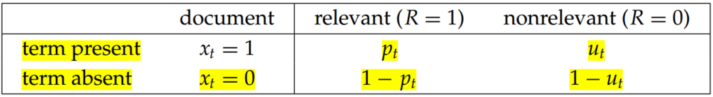

# Introduction to Information Retrieval (Chapter 11 Probabilistic information retrieval)

## 1. The binary independence model

- “Binary” is equivalent to Boolean: Documents and queries are both represented as binary term incidence vectors. That is, a document $d$ is represented by the vector $\overrightarrow x = (x_1,...,x_M)$ where $x_t = 1$ if term $t$ is present in document $d$ and $x_t = 0$ if $t$ is not present in $d$. Similarly, we represent $q$ by the incidence vector $\overrightarrow q$. 
- “Independence” means that terms are modeled as occurring in documents independently.

Based on Bayes rule, we have:

$$
P(R=1|\overrightarrow x, \overrightarrow q)=\frac{P(\overrightarrow x|R=1,\overrightarrow q)P(R=1|\overrightarrow q)}{P(\overrightarrow x|\overrightarrow q)}\\
P(R=0|\overrightarrow x, \overrightarrow q)=\frac{P(\overrightarrow x|R=0,\overrightarrow q)P(R=0|\overrightarrow q)}{P(\overrightarrow x|\overrightarrow q)}\tag{1}
$$

Here, $P(R=1|\overrightarrow x, \overrightarrow q)$ and $P(R=0|\overrightarrow x, \overrightarrow q)$ are the probability that if a relevant or nonrelevant, respectively, document is retrieved, then that document's representation is $\overrightarrow x$. $P(R=1|\overrightarrow q)$ and $P(R=0|\overrightarrow q)$ indicate the prior probability of retrieving a relevant or nonrelevant document, respectively, for a query $\overrightarrow q$.

Odds, a kind of multiplier for how probabilities change,  is monotonic with the probability of relevance:

$$
odds\; O(A)=\frac{P(A)}{P(\overline A)}=\frac{P(A)}{1-P(A)}\tag{2}
$$

Thus, the odds of relevance is:

$$
O(R|\overrightarrow x, \overrightarrow q)=\frac{P(R=1|\overrightarrow x,\overrightarrow q)}{P(R=0|\overrightarrow x,\overrightarrow q)}=\frac{P(R=1|\overrightarrow x, \overrightarrow q)=\frac{P(\overrightarrow x|R=1,\overrightarrow q)P(R=1|\overrightarrow q)}{P(\overrightarrow x|\overrightarrow q)}}{P(R=1|\overrightarrow x, \overrightarrow q)=\frac{P(\overrightarrow x|R=0,\overrightarrow q)P(R=0|\overrightarrow q)}{P(\overrightarrow x|\overrightarrow q)}}=\frac{P(R=1|\overrightarrow q)}{P(R=0|\overrightarrow q)}\cdot \frac{P(\overrightarrow x|R=1,\overrightarrow q)}{P(\overrightarrow x|R=0,\overrightarrow q)}\tag{3}
$$

According to Naive Bayes conditional independence assumption, 

$$
\frac{P(\overrightarrow x|R=1,\overrightarrow q)}{P(\overrightarrow x|R=0,\overrightarrow q)}=\prod_{t=1}^M\frac{P(x_t|R=1,\overrightarrow q)}{P(x_t|R=0,\overrightarrow q)}\tag{4}
$$

So,
$$
O(R|\overrightarrow x, \overrightarrow q)=O(R|\overrightarrow q)\cdot \prod_{t=1}^M\frac{P(x_t|R=1,\overrightarrow q)}{P(x_t|R=0,\overrightarrow q)}\tag{5}
$$

Since each $x_t$ is either 0 or 1, we can separate the terms to give:

$$
O(R|\overrightarrow x, \overrightarrow q)=O(R|\overrightarrow q)\cdot \prod_{t=1}^M\frac{P(x_t=1|R=1,\overrightarrow q)}{P(x_t=1|R=0,\overrightarrow q)}\cdot \prod_{t=1}^M\frac{P(x_t=0|R=1,\overrightarrow q)}{P(x_t=0|R=0,\overrightarrow q)}\tag{6}
$$

Henceforth, let $p_t=P(x_t=1|R=1,\overrightarrow q)$ be the probability of a term appearing in a document relevant to the query, and $u_t=P(x_t=1|R=0,\overrightarrow q)$ be the probability of a term appearing in a nonrelevant document. These quantities can be visualized in the following contingency table where the columns add to 1:

table 1.

Considering if terms are not occurring in the query, there is insignificant to calculate $p_t$ and $u_t$. Thereby, we only consider terms in the products that appear in the query ($q_t=1$), so

$$
O(R|\overrightarrow x, \overrightarrow q)=O(R|\overrightarrow q)\cdot \prod_{t:x_t=q_t=1}\frac{p_t}{u_t}\cdot \prod_{t:x_t=0,q_t=1}\frac{1-p_t}{1-u_t}\tag{7}
$$

Because,

$$
\prod_{t:x_t=0,q_t=1}\frac{1-p_t}{1-u_t}=\prod_{t:x_t=0,q_t=1}\frac{1-p_t}{1-u_t}\cdot \prod_{t:x_t=1,q_t=1}\frac{1-p_t}{1-u_t}\frac{1-u_t}{1-p_t}=\prod_{t:q_t=1}\frac{1-p_t}{1-u_t}\cdot \prod_{t:x_t=1,q_t=1}\frac{1-u_t}{1-p_t}
$$

Therefore,

$$
O(R|\overrightarrow x, \overrightarrow q)=O(R|\overrightarrow q)\cdot \prod_{t:x_t=q_t=1}\frac{p_t(1-u_t)}{u_t(1-p_t)}\cdot \prod_{t:q_t=1}\frac{1-p_t}{1-u_t}\tag{8}
$$

Note,

$$
RSV_d=log \prod_{t:x_t=q_t=1}\frac{p_t(1-u_t)}{u_t(1-p_t)}=\sum_{t:x_t=q_t=1}log\frac{p_t(1-u_t)}{u_t(1-p_t)}\tag{9}
$$

$$
c_t=log\frac{p_t(1-u_t)}{u_t(1-p_t)}=log\frac{p_t}{(1-p_t)}+log\frac{1-u_t}{u_t}\tag{10}
$$

where, the resulting quantity used for ranking is retrieval called the retrieval status value (RSV), the $c_t$ terms are log odds ratios for the terms in the query. 

Consequently,

$$
RSV_d=\sum_{t:x_t=q_t=1}c_t\tag{11}
$$

Based on table 1, count the number of documents,

table 2.

In table 2, $df_t$ is the number of documents that contain term t, and $p_t=s/S/, ,u_t=(df_t-s)/(N-S)$, so,

$$
c_t=K(N,df_t,S,s)=log\frac{s/(S-s)}{(df_t-s)/((N-df_t)-(S-s))}\tag{12}
$$

To avoid the possibility of zeroes (such as if every or no relevant document has a particular term) it is fairly standard to add 1/2 to each of the quantities in the center four terms of (12), and then to adjust the marginal counts (the totals) accordingly (so, the bottom right cell totals $N+2$). Then we have:

$$
c_t=K(N,df_t,S,s)=log\frac{(s+\frac12)/(S-s+\frac12)}{(df_t-s+\frac12)/((N-df_t)-(S-s+\frac12))}\tag{13}
$$

## 2. An appraisal and some extensions

Getting reasonable approximations of the needed probabilities for a probabilistic IR model is possible, but it requires some major assumptions. In the BIM these are:

- a Boolean representation of documents/queries/relevance
- term independence
- terms not in the query don’t affect the outcome
- document relevance values are independent

### 2.1 Okapi BM25: A nonbinary model

The BIM was originally designed for short catalog records and abstracts of fairly consistent length, and it works reasonably in these contexts, but for modern full-text search collections, it seems clear that a model should pay attention to term frequency and document length.

The BM25 weighting scheme, often called Okapi weighting, after the system in which it was first implemented, was developed as a way of building a probabilistic model sensitive to these quantities while not introducing too many additional parameters into the model (Sparck Jones et al. 2000).

The simplest score for document $d$ is just idf weighting of the query terms present, 

$$
RSV_d=\sum_{t\in q}log\frac{N}{df_t}\tag{14}
$$

We can improve on Equation (14) by factoring in the frequency of each term and document length:

$$
RSV_d=\sum_{t\in q}log[\frac{N}{df_t}]\cdot \frac{(k_1+1)tf_{td}}{k_1((1-b)+b\times (L_d/L_{ave}))+tf_{td}}\tag{15}
$$

Here, $tf_{td}$ is the frequency of term $t$ in document $d$, and $L_d$ and $L_{ave}$ are the length of document $d$ and the average document length for the whole collection. The variable $k_1$ is a positive tuning parameter that calibrates the document term frequency scaling. A $k_1$ value of 0 corresponds to a binary model (no term frequency), and a large value corresponds to using raw term frequency.  $b$ is another tuning parameter (0 ≤ $b$ ≤ 1) that determines the scaling by document length: $b=1$ corresponds to fully scaling the term weight by the document length, whereas $b=0$ corresponds to no length normalization.

If the query is long, then we might also use similar weighting for query terms. This is appropriate if the queries are paragraph-long information needs, but unnecessary for short queries.

$$
RSV_d=\sum_{t\in q}log[\frac{N}{df_t}]\cdot \frac{(k_1+1)tf_{td}}{k_1((1-b)+b\times (L_d/L_{ave}))+tf_{td}}\cdot \frac{(k_3+1)tf_{tq}}{k_3+tf+{tq}}\tag{15}
$$

with $tf_{tq}$ being the frequency of term $t$ in the query $q$, and $k_3$ being another positive tuning parameter that this time calibrates term frequency scaling of the query. In the absence of such optimization, experiments have shown reasonable values are to set $k_1$ and $k_3$ to a value between 1.2 and 2 and $b= 0.75$.

The BM25 term weighting formulas have been used quite widely and quite successfully across a range of collections and search tasks. Especially in the TREC evaluations, they performed well and were widely adopted by many groups. 

### 2.2 Bayesian network approaches to information retrieval

Probabilistic network is the primary case of a statistical ranked retrieval model that naturally supports structured query operators. The system allowed efficient large-scale retrieval, and was the basis of the InQuery text retrieval system, built at the University of Massachusetts. This system performed very well in TREC evaluations and for a time was sold commercially. 

## Conclusions

- The difference between “vector space” and “probabilistic” IR systems is not that great. For a probabilistic IR system, it’s just that, at the end, you score queries not by cosine similarity and tf–idf in a vector space, but by a slightly different formula motivated by probability theory. Indeed, sometimes people have changed an existing vector-space IR system into an effectively probabilistic system simply by adopted term weighting formulas from probabilistic models. 
- The probabilistic approach to IR originated in the United Kingdom in the 1950s. The first major presentation of a probabilistic model is Maron and Kuhns (1960). Robertson and Jones (1976) introduce the main foundations of the BIM and van Rijsbergen (1979) presents in detail the classic BIM probabilistic model. 
