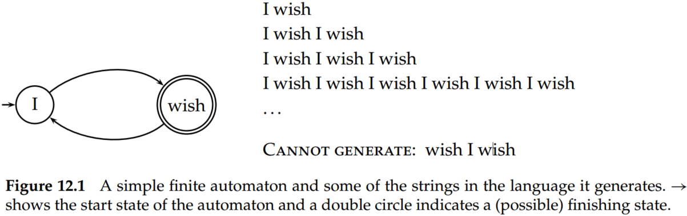
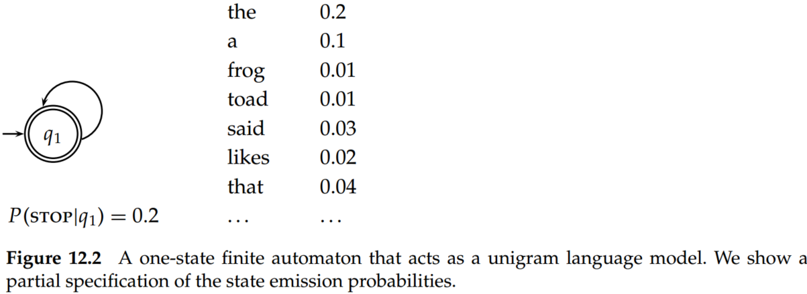

# Introduction to Information Retrieval （Chapter 12 Language models for information retrieval）

## 1. Motivation

The language modeling approach to information retrieval (IR) directly models that idea: A document is a good match to a query if the document model is likely to generate the query, which will in turn happen if the document contains the query words often. Consequently, instead of overtly modeling the probability $P(R=1|q,d)$ of relevance of a document $d$ to a query $q$, as in the traditional probabilistic approach to IR, the basic language modeling approach instead builds a probabilistic language model $M_d$ from each document $d$, and ranks documents based on the probability of the model generating the query: $P(q|M_d)$.

## 2. Language models

### 2.1 Finite automata and language models

The finite automaton shown in Figure 12.1 can generate strings that include the examples shown. The full set of strings that can be generated is called the language of the automaton.

The notion of a language model is inherently probabilistic. Thus, a language model is a function that puts a probability measure over strings drawn from some vocabulary. One simple kind of language model is equivalent to a probabilistic finite automaton consisting of just a single node with a single probability distribution over producing different terms, so that $\sum_{t\in V}P(t)=1$, as shown in Figure 12.2. 

To find the probability of a word sequence, we just multiply the probabilities that the model gives to each word in the sequence, together with the probability of continuing or stopping after produciong each word. For example,

$$
P(frog\, said\, that\, toad\, likes\, frog)=\underbrace{(0.01\times 0.03\times 0.04\times 0.01\times 0.02\times 0.01)}_{(1)}\\\times \underbrace{(0.8\times 0.8\times 0.8 \times 0.8\times 0.8 \times 0.8\times 0.2)}_{(2)}\approx 0.000000000001573\tag{1}
$$

The first part in formula (1) is the term emission probabilities, and the second part gives the probability of continuing or stopping after generating each word.

The formula here in terms of products of probabilities, but, as is common in probabilistic applications, in practice it is usually best to work with sums of log probabilities.

### 2.2 Types of language models

We can always use the chain rule from to decompose the probability of a sequence of events into the probability of each successive event conditioned on earlier events:

$$
P(t_1t_2t_3t_4)=P(t_1)P(t_2|t_1)P(t_3|t_1t_2)P(t_4|t_1t_2t_3)\tag{2}
$$

The simplest form of language model simply throws away all conditioning context, and estimates each term independently. Such a model is called a *unigram language model*:

$$
P(t_1t_2t_3t_4)=P(t_1)P(t_2)P(t_3)P(t_4)\tag{3}
$$

There are many more complex kinds of language models, such as *bigram lanlanguage models*, which condition on the previous term,

$$
P(t_1t_2t_3t_4)=P(t_1)P(t_2|t_1)P(t_3|t_2)P(t_4|t_3)\tag{4}
$$

### 2.3 Multinomial distributions over words

$$
P(d)=\frac{L_d!}{tf_{t_1,d}!tf_{t_2,d}!...tf_{t_M,d}!}P(t_1)^{tf_{t_1,d}}P(t_2)^{tf_{t_2,d}}...P(t_M)^{tf_{t_M,d}}\tag{5}
$$

Here, $L_d = \sum_{1\leq i \leq M} tf_{t_i,d}$ is the length of document $d$, $M$ is the size of the term vocabulary, and the products are now over the terms in the vocabulary, not the positions in the document. 

## 3. The query likelihood model

### 3.1 Using query likelihood language models in IR

We construct from each document $d$ in the collection a language model $M_d$. Our goal is to rank documents by $P(d|q)$, where the probability of a document is interpreted as the likelihood that it is relevant to the query. Using Bayes rule, we have:

$$
P(d|q) = P(q|d)P(d)/P(q)\tag{6}
$$

$P(q)$ is the same for all documents, and so can be ignored. The prior probability of a document $P(d)$ is often treated as uniform across all $d$ and so it can also be ignored, but we could implement a genuine prior, which could include criteria like authority, length, genre, newness, and number of previous people who have read the document. But, given these simplifications, we return results ranked by simply $P(q|d)$, the probability of the query $q$ under the language model derived from $d$. 

The most common way to calculate $P(q|M_d)$ is to use the multinomial unigram language model, which is equivalent to a multinomial naive Bayes model, where the documents are the classes, each treated in the estimation as a separate “language.” Under this model, we have that:

$$
P(q|M_d)=K_q\prod_{t\in V}P(t|M_d)^{tf_{t,d}}\tag{7}
$$

where, $K_q=L_d!/(tf_{t_1,d}!tf_{t_2,d}!...tf_{t_M,d}!)$ is the multinomial coefficient for the query $q$, which we henceforth ignore because it is a constant for a particular query. 

### 3.2 Estimating the query generation probability

Some words will not have appeared in the document at all, but are possible words for the information need, which the user may have used in the query. Smoothing can alleviate this problem.

(1) The general approach is that a nonoccurring term should be possible in a query, but its probability should be somewhat close to but no more likely than would be expected by chance from the whole collection. That is, if $tf_{t,d}=0$ then

$$
\hat{P}(t|M_d)\leq cf_t/T\tag{8}
$$

where $cf_t$ is the raw count of the term in the collection, and $T$ is the raw size (number of tokens) of the entire collection. 

A simple idea that works well in practice is to use a mixture between a document-specific multinomial distribution and a multinomial distribution estimated from the entire collection:

$$
\hat P(t|d)=\lambda \hat{P}_{mle}(t|M_d)+(1-\lambda)\hat P_{mle}(t|M_c)\tag{9}
$$

where $0<\lambda <1$ and $M_c$ is a language model built from the entire document collection. $\hat{P}_{mle}(t|M_d)$ is the maximum likelihood estimation for term $t$ in the LM of document $d$. Correctly setting $\lambda$ is important to the good performance of this model.

(2) Bayesian updating process 

$$
\hat P(t|d)=\frac{tf_{t,d}+\alpha \hat P(t|M_c)}{L_d+\alpha}\tag{10}
$$

where $L_d$ is the number of tokens in document $d$.

Smoothing is essential to the good properties of the models. The extent of smoothing in these two models is controlled by the $\lambda$ and $\alpha$ parameters: A small value of $\lambda$ or a large value of $\alpha$ means more smoothing. The value need not be a constant. One approach is to make the value a function of the query size. This is useful because a small amount of smoothing (a “conjunctive-like” search) is more suitable for short queries, whereas a lot of smoothing is more suitable for long queries.

## 4. Extended language modeling approaches

Rather than directly generating in either direction, we can make an LM from both the document and query, and then ask how different these two language models are from each other. For instance, one way to model the risk of returning a document $d$ as relevant to a query $q$ is to use the Kullback-Leibler (KL) divergence between their respective language models:

$$
R(d;q)=KL(M_d||M_q)=\sum_{t\in V}P(t|M_q)log\frac{P(t|M_q)}{P(t|M_d)}\tag{11}
$$

KL divergence is an asymmetric divergence measure originating in information theory, which measures how bad the probability distribution $M_q$ is at modeling $M_d$ (Cover and Thomas 1991; Manning and Schutze 1999). 

Basic LMs do not address issues of alternate expression, that is, synonymy, or any deviation in use of language between queries and documents. Berger and Lafferty (1999) introduce translation models to bridge this query–document gap. A translation model lets you generate query words not in a document by translation to alternate terms with similar meaning. This also provides a basis for performing cross-language IR.

$$
P(q|M_d)=\prod_{t\in q}\sum_{v\in V}P(v|M_d)T(t|v)\tag{12}
$$

The term $P(v|M_d)$ is the basic document language model, and the term $T(t|v)$ performs translation.

## Conclusions
- Providing that the stop probability is fixed, its inclusion will not alter the likelihood ratio that results from comparing the likelihood of two language models generating a string. 
- Most language-modeling work in IR has used unigram language models. 
- Unigram models are often sufficient to judge the topic of a text. 
- With limited training data, a more constrained model tends to perform better. In addition, unigram models are more efficient to estimate and apply than higher order models.
- Ponte and Croft (1998) argued strongly for the effectiveness of the term weights that come from the language modeling approach over traditional tf–idf weights.
- Much recent work has recognized the importance of document length normalization. 
- The effect of doing a mixture of document generation probability with collection generation probability is a little like idf; terms rare in the general collection but common in some documents will have a greater influence on the ranking of documents.
- Recent work has shown the LM approach to be very effective in retrieval experiments, beating tf–idf and BM25 weights.
- Lafferty and Zhai (2001) present results suggesting that a model comparison approach outperforms both query-likelihood and document-likelihood approaches. 
- Zhai and Lafferty (2002) argue that a two-stage smoothing model with first Bayesian smoothing followed by linear interpolation gives a good model of the task, and performs better and more stably than a single form of smoothing. 
- Liu and Croft (2004) show some gains by smoothing a document LM with estimates from a cluster of similar documents; Tao et al. (2006) report larger gains by doing documentsimilarity based smoothing.
- Sparck Jones (2004) presents a critical viewpoint on the rationale for the language modeling approach, but Lafferty and Zhai (2003) argue that a unified account can be given of the probabilistic semantics underlying both the LM approach presented and the classical probabilistic information retrieval approach. 
