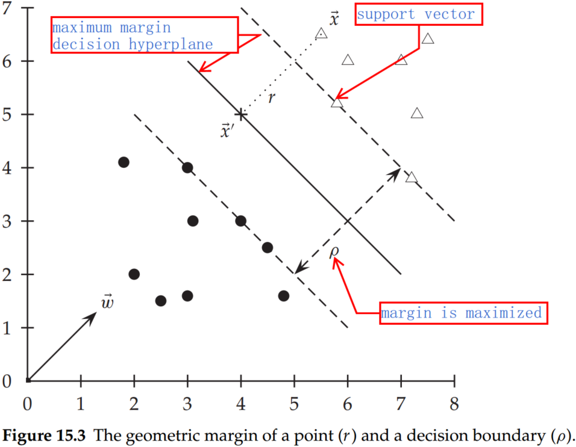

# Chapter 15 Support vector machines and machine learning on documents

## 1. Support vector machines: The linearly separable case

The SVM, in particular, defines the criterion to be looking for a decision surface that is maximally far away from any data point. This distance from the decision surface to the closest data point determines the margin of the classifier. This method of construction necessarily means that the decision function for an SVM is fully specified by a (usually small) subset of the data that defines the position of the separator. These points are referred to as the support vectors (in a vector space, a point can be thought of as a vector between the origin and that point). Other data points play no part in determining the decision surface that is chosen.

A decision hyperplane can be defined by an intercept term $b$ and a decision hyperplane normal vector $\overrightarrow w$, which is perpendicular to the hyperplane. All points $\overrightarrow x$ on the hyperplane satisfy $\overrightarrow w^T \overrightarrow x= -b$.

Supposed that we have a set of training data points $D = {(\overrightarrow x_i, y_i)}$, where each member is a pair of a point $\overrightarrow x_i$ and a class label $y_i$ corresponding to it. For SVMs, the two data classes are always named +1 and −1 (rather than 1 and 0). The linear classifier is then:

$$
f(\overrightarrow x)=sign(\overrightarrow w^T \overrightarrow x +b)\tag{1}
$$

- **functional margin.** For a given data set and decision hyperplane, the functional margin of the $i^{th}$ example $\overrightarrow x_i$ with respect to a hyperplane $<\overrightarrow w, b>$ as the quantity $y_i(\overrightarrow x^T\overrightarrow x_i+b)$, since the $|\overrightarrow x^T\overrightarrow x_i+b|$ can represent the distance between $\overrightarrow x$ and hyperplane. 

Let us label the point on the hyperplane closest to $\overrightarrow x$ as $\overrightarrow x'$, and denote the Euclidean distance from the point $\overrightarrow x$ to the decision boundary as $r$. Then.:

$$
\overrightarrow x'=\overrightarrow x-yr\frac{\overrightarrow w}{|\overrightarrow w|'}\tag{2}
$$

where multiplying by $y$ just changes the sign for the two cases of $\overrightarrow x$ being on either side of the decision surface. Moreover, $\overrightarrow x'$ lies on the decision boundary and so satisfies $\overrightarrow w^T\overrightarrow x'+b=0$. Hence:

$$
\overrightarrow w^T(\overrightarrow x-yr\frac{\overrightarrow w}{|\overrightarrow w|'})+b=0\tag{3}
$$

Solving for $r$ gives:

$$
r=y\frac{\overrightarrow w^T\overrightarrow x+b}{|\overrightarrow w|}\tag{4}
$$

- **geometric margin.** The geometric margin $r$ of the classifier is the maximum width of the band that can be drawn, separating the support vectors of the two classes. 

Therefore, the geometric margin is $\rho = \frac{r}{|\overrightarrow w|}$. Compared to the functional margin, the geometric margin is clearly invariant to scaling of parameters: if we replace $\overrightarrow w$ by $5\overrightarrow w$ and $b$ by $5b$, then the geometric margin is the same because it is inherently normalized by the length of $\overrightarrow w$, but the functional margin will be five times as large. 

Let us choose to require that the functional margin of all data points is at least 1, so we want to find $\overrightarrow w$ and $b$ such that:

- $\rho=2/|\overrightarrow w|$ is maximized;
- Fol all $(\overrightarrow x_i, y_i)\in \mathbb D, y_i(\overrightarrow w^T\overrightarrow x_i+b)\geq 1$;

Maximizing $2|\overrightarrow w|$ is the same as minimizing $|\overrightarrow w|/2$. This gives the final standard formulation of an SVM as a minimization problem:

- $\frac{1}{2}\overrightarrow w^T \overrightarrow w$ is minimized, and
- for all $\{(\overrightarrow x_i,y_i)\}, y_i(\overrightarrow w^T\overrightarrow x_i+b)\geq 1$

## 2. Lagrange duality

### 2.1 Primal problem

Provided that the domain of $f(x), c_i(x), h_j(x) \subset R^n$, and $f(x), c_i(x), h_j(x)$ are continuously differentiable, for the optimization problem:

$$
\begin{align}
\operatorname* {min}_{x\in R^n}\; & f(x)\\
s.t. \; & c_i(x)\leq 0,i=1,2,...,k\\
& h_j(x)=0,j=1,2,...,l\tag{5}
\end{align}
$$

We define generalized Lagrange function:

$$
L(x,\alpha,\beta)=f(x)+\sum_{i=1}^k\alpha_ic_i(x)+\sum_{j=1}^l\beta_jh_j(x)\tag{6}
$$

where $x=(x^{(1)},x^{(2)},...,x^{(n)})^T\in R^n$, denote $\alpha_i,\beta_j$ as the dual variables or Lagrange multiplier vectors, and $\alpha_i \geq 0$. 

Consequently,

$$
\theta_P(x)=\operatorname* {max}_{\alpha,\beta:\alpha_i\geq 0}\; L(x,\alpha,\beta)\iff \begin{cases} & f(x)  \\s.t. & c_i\leq 0,\; i=1,2,..,k\\ & h_j(x)=0, \; j=1,2,...,l \end{cases}\tag{7}
$$

If $x_k$ do not meet the construction, we could let $\alpha_k \rightarrow +\infty$ or $\beta_jh_j(x)\rightarrow +\infty$. Thus, 

$$
\theta_P(x)=\operatorname*{max}_{\alpha,\beta:\alpha_i\geq 0}[f(x)+\sum_{i=1}^k\alpha_ic_i(x)+\sum_{j=1}^l\beta_jh_j(x)]=+\infty
$$

Hence, the minimal primal problem can be converted to 

$$
\theta_p(x)=\begin{cases} f(x),\;  & \text {x can meet the constranints of primal problem}\\ 
+\infty,\; & \text{others}
\end{cases}\tag{8}
$$

Therefore, 

$$
\operatorname*{min}_{x}\theta_P(x)=\operatorname*{min}_{x}\operatorname*{max}_{\alpha,\beta:\alpha_i\geq 0}L(x,\alpha,\beta)\tag{9}
$$

### 2.2 Dual problem 

Let,

$$ 
\theta_D(\alpha, \beta)=\operatorname*{min}_{x}L(x,\alpha,\beta)\tag{10}
$$

Maximize $\theta_{D}(\alpha,\beta)$,

$$
\operatorname*{max}_{\alpha,\beta:\alpha_i\geq 0} \theta_D(\alpha, \beta)=\operatorname*{max}_{\alpha,\beta:\alpha_i\geq 0}\operatorname*{min}_{x}L(x,\alpha,\beta)\\
s.t.\; \alpha_i\geq 0,\; i=1,2,...,k\tag{11}
$$

Thus, equation (11) is the dual problem of the primal problem (equation (9)).

### 2.3 The relation between primal problem and dual problem 

Suppose, $d^*=\operatorname*{max}_{\alpha,\beta:\alpha_i\geq 0}\operatorname*{min}_{x}L(x,\alpha,\beta)$ and $p^*=\operatorname*{min}_{x}\operatorname*{max}_{\alpha,\beta:\alpha_i\geq 0}L(x,\alpha,\beta)$,

Therefore,

$$
d^*=\operatorname*{max}_{\alpha,\beta:\alpha_i\geq 0}\operatorname*{min}_{x}L(x,\alpha,\beta) \leq \operatorname*{min}_{x}\operatorname*{max}_{\alpha,\beta:\alpha_i\geq 0}L(x,\alpha,\beta)=p^*
$$

Proof:

For any $\alpha, \beta$ and $x$,

$$
\theta_D(\alpha,\beta)=\operatorname*{min}_{x}L(x,\alpha,\beta)\leq L(x,\alpha,\beta)\leq \operatorname*{max}_{\alpha,\beta:\alpha_i\geq 0}L(x,\alpha,\beta)=\theta_P(x)
$$

Therefore,

$$
\theta_D(\alpha, \beta)\leq \theta_P(x) \; and \; \operatorname*{max}_{\alpha,\beta:\alpha_i\geq 0}\theta_D(\alpha, \beta)\leq \operatorname*{min}_{x}\theta_P(x)
$$

Therefore,

$$
d^* \leq p^*
$$

### 2.4 Karush-Kuhn-Tucker (KKT) conditions

Suppose:

- $f(x)$ and $c_i(x)$ are convex functions;
- $h_j(x)$ is an affine function;
- there exists $x_0\in X$ such that $c_i(x)\leq 0$;

$p^*=d^*=L(x^*,\alpha^*,\beta^*)$ iff $x^*,\alpha^*,\beta^*$ meet KKT conditions:

$$
\begin{cases}
& \nabla_x L(x^*,\alpha^*,\beta^*)=0\\
& \alpha_i^*c_i(x^*)=0,\;i=1,2,...,k\\
& c_i(x^*)\leq 0,\; i=1,2,...,k\\
& \alpha_i^*\geq 0,\; i=1,2,...,k\\
& h_j(x^*),\; j=1,2,...,l\\
\end{cases}\tag{12}
$$

## 3. Dual algorithm for SVM

Based on section 2, we have to minimal $\frac12 \overrightarrow w^T \overrightarrow w$, and for all $\{(\overrightarrow x_i,y_i)\}, y_i(\overrightarrow w^T\overrightarrow x_i+b)\geq 1$. Apply  Lagrange multiplier vectors, we have,

$$
L(w,b,\alpha)=\frac{1}{2}||w||^2-\sum_{i=1}^N\alpha_iy_i(wx_i+b)+\sum_{i=1}^N\alpha_i,\;(\alpha_i\geq 0)\tag{13}
$$

The dual problem of $\operatorname*{min}_{w,b}\operatorname*{max}_{\alpha}L(w,b,\alpha)$ is $\operatorname*{max}_{\alpha}\operatorname*{min}_{w,b}L(w,b,\alpha)$,

For $w$ and $b$, calculating the partial derivative, respectively,

$$
\nabla_w L(w,b,\alpha)=w-\sum_{i=1}^N\alpha_i y_i x_i=0\\
\nabla_b L(w,b,\alpha)=-\sum_{i=1}^N\alpha_i y_i=0
$$

we have,

$$
\begin{cases}
& w=\sum_{i=1}^N\alpha_iy_ix_i\\
& \sum_{i=1}^N\alpha_iy_ix_i=0\tag{14}
\end{cases}
$$

Therefore，

$$
\begin{align}
L(w,b,\alpha)& =\frac{1}{2}\sum_{i=1}^N\sum_{j=1}^N \alpha_i \alpha_j y_iy_jx_ix_j-\sum_{i=1}^N\alpha_iy_i ((\sum_{j=1}^N \alpha_j y_j x_j) x_i+b)+\sum_{i=1}^{N}\alpha_i\\
& = -\frac12\sum_{i=1}^N\sum_{j=1}^N\alpha_i\alpha_j y_i y_j x_i x_j+\sum_{i=1}^{N}\alpha_i
\end{align}\tag{15}
$$

And $\operatorname*{max}_{\alpha}\operatorname*{min}_{w,b}L(w,b,\alpha)$ is,

$$
\begin{cases}
\operatorname*{max}_{\alpha} & \;-\frac12\sum_{i=1}^N\sum_{j=1}^N\alpha_i\alpha_jy_iy_jx_ix_j+\sum_{i=1}^{N}\alpha_i\\
s.t. & \sum_{i=1}^N\alpha_iy_i=0\\
& \alpha_i\geq 0,\; i=1,2,..,N
\end{cases}\Longleftrightarrow 
\begin{cases}
\operatorname*{min}_{\alpha} & \;\frac12\sum_{i=1}^N\sum_{j=1}^N\alpha_i\alpha_jy_iy_jx_ix_j+\sum_{i=1}^{N}\alpha_i\\
s.t. & \sum_{i=1}^N\alpha_iy_i=0\\
& \alpha_i\geq 0,\; i=1,2,..,N
\end{cases}\tag{16}
$$

The solution is then of the form:

$$
\begin{cases}
& \overrightarrow w=\sum\alpha_iy_i\overrightarrow x_i\\
& b=y_k-\overrightarrow w^T\overrightarrow x_k \; \text{for any $\overrightarrow x_k$ such that $\alpha_k\neq 0$}
\end{cases}\tag{17}
$$

In the solution, most of the $\alpha_i$ is zero. Each nonzero $\alpha_i$ indicates that the corresponding $\overrightarrow x_i$ is a support vector. The classification function is then:

$$
f(\overrightarrow x)=sign(\sum_i\alpha_iy_i\overrightarrow x_i^T\overrightarrow x+b)\tag{18}
$$

## 4. Extensions to the support vector machine model

### 4.1 Soft margin classification

For very high dimensional problems common in text classification, most of the time, the data are not linearly separable. Besides, we also prefer a solution that better separates the bulk of the data while ignoring a few weird noise documents. To realize this, we introduce slack variables $\xi_i$. A nonzero value for $\xi_i$ allows $\overrightarrow x_i$ to not meet the margin requirement at a cost proportional to the value of $\xi_i$.

The formulation of the SVM optimization problem with slack variables is:

Find $\overrightarrow w,b$ and $\xi_i\geq 0$ such that:
- $\frac{1}{2}\overrightarrow w^T\overrightarrow w+c\sum_i\xi_i$ is minimized
- and for all $\{(\overrightarrow x_i, y_i)\},y_i(\overrightarrow w^T\overrightarrow x_i+b)\geq 1-\xi_i$

The dual problem for soft margin classification becomes:

Find $\alpha_1,...,\alpha_N$ such that $\sum \alpha_i − \frac12\sum_i\sum_j \alpha_i \alpha_j y_i y_j \overrightarrow x_i^T \overrightarrow x_j$ is maximized, and
- $\sum_i\alpha_iy_i=0$
- $ 0 \leq \alpha_i \leq C$ for all $1 \leq i \leq N$

The solution of the dual problem is of the form:

$$
\begin{cases}
& \overrightarrow w= \sum\alpha y_i\overrightarrow x_i\\
& b= y_k(1-\xi_k)-\overrightarrow w^T\overrightarrow x_k \; \text {for $k=argmax_k\alpha_k$}
\end{cases}
$$

The time for training an SVM is dominated by the time for solving the underlying QP, and so the theoretical and empirical complexity varies depending on the method used to solve it. The standard result for solving QPs is that it takes time cubic in the size of the data set (Kozlov et al. 1979). All the recent work on SVM training has worked to reduce that complexity, often by being satisfied with approximate solutions. Standardly, empirical complexity is about $O(|\mathbb D|^1.7)$ (Joachims 2006a). Nevertheless, the superlinear training time of traditional SVM algorithms makes them difficult or impossible to use on very large training data sets. Alternative traditional SVM solution algorithms, which are linear in the number of training examples, scale badly with a large number of features, which is another standard attribute of text problems. 

### 4.2 Nonlinear support vector machines

In general, the data may not be separated by linear models. For instance, the top data set in Figure 15.6 is straightforwardly classified by a linear classifier but the middle data set is not. We instead need to be able to pick out an interval. One way to solve this problem is to map the data onto a higher dimensional space and then to use a linear classifier in the higher dimensional space. 

SVMs, and also a number of other linear classifiers, provide an easy and efficient way of doing this mapping to a higher-dimensional space, which is referred to as the kernel trick. 

The SVM linear classifier relies on a dot product between data point vectors. Let $K(\overrightarrow x_i , \overrightarrow x_j) = \overrightarrow x_i^T \overrightarrow x_j$ Then the classifier we have seen so far is:

$$
f(\overrightarrow x)=sign(\sum_i\alpha_iy_iK(\overrightarrow x_i, \overrightarrow x_j)+b)\tag{18}
$$

Now suppose we decide to map every data point into a higher dimensional space via some transformation $\Phi:\overrightarrow x \mapsto \phi (\overrightarrow x)$. Then the dot product becomes $\phi(\overrightarrow x_i)^T\phi(\overrightarrow x_j)$. 

**(1) The quadratic kernel** 

$$
\begin{align}
K(\overrightarrow u, \overrightarrow v) & =(1+\overrightarrow u^T\overrightarrow v)^2\\
& =1+u_1^2v_1^2+2u_1v_1u_2v_2+u_2^2v_2^2+2u_1v_1+2u_2v_2\\
& =(1,u_1^2,\sqrt2u_1u_2,u_2^2,\sqrt2u_1,\sqrt2u_2)^T(1,v_1^2,\sqrt2v_1v_2,v_2^2,\sqrt2v_1,\sqrt2v_2)\\
& =\phi(\overrightarrow u)^T\phi(\overrightarrow v)
\end{align}\tag{19}
$$

**(2) The Mercer kernel**

The kernel satisfies Mercer's condition: for any $g(\overrightarrow x)$ such that 

$$
\int K(\overrightarrow x,\overrightarrow z)g(\overrightarrow x)g(\overrightarrow z)d\overrightarrow xd\overrightarrow z\geq 0\tag{20}
$$

A kernel function $K$ must be continuous, symmetric, and have a positive definite gram matrix. If a kernel does not satisfy Mercer's condition, then the corresponding QP may have no solution. 

**(3) Polynomial kernels**

$$
K(\overrightarrow x,\overrightarrow z)=(1+\overrightarrow x^T\overrightarrow z)^d \tag{21}
$$

The case of $d=1$ is a linear kernel. The case of $d=2$ gives a quadratic kernel and is very commonly used.

**(4) Radial basis functions**

The most common form of radial basis function is a Gaussian distribution, calculated as:

$$
K(\overrightarrow x, \overrightarrow z)=e^{-(\overrightarrow x-\overrightarrow z)^2/(2\sigma^2)}\tag{22}
$$

## 5. Result ranking by machine learning

Machine learning for ad hoc retrieval is most properly thought of as an ordinal regression problem, where the goal is to rank a set of documents for a query, given training data of the same sort.

The construction of a ranking SVM proceeds as follows. We construct a vector of features $\psi_j=\psi (d_j,q)$ for each document–query pair. For two documents $d_i$ and $d_j$, we then form the vector of feature differences:

$$
\Phi(d_i,d_j,q)=\psi(d_i,q)-\psi(d_j,q)\tag{23}
$$

If $d_i$ is judged more relevant than $d_j$, denoted $d_i \prec d_j$ ($d_i$ should precede $d_j$ in the results ordering), then we will assign the vector $\Phi(d_i, d_j, q)$ the class $y_{ijq} = +1$; otherwise −1. The goal then is to build a classifier, which will return

$$
\overrightarrow w^T\Phi(d_i,d_j,q)>0\;iff\;d_i\prec d_j\tag{24}
$$

This SVM learning task is formalized in a manner much like the other examples that we saw before:

Find $\overrightarrow w$, and $\xi_{i,j}\geq 0 $ such that:
- $\frac12\overrightarrow w^T\overrightarrow w+C\sum_{i,j}\xi_{i,j}$ is minimized
- and for all $\{\Phi(d_i,d_j,q):d_i\prec d_j\},\overrightarrow w^T\Phi(d_i,d_j,q)\geq 1-\xi_{i,j}$

This approach has been used to build ranking functions which outperform standard hand-built ranking functions in IR evaluations on standard data sets.

## Conclusions
- SVMs are not necessarily better than other machine learning methods (except perhaps in situations with few training data), but they perform at the state-of-the-art level and have much current theoretical and empirical appeal.
- Functional margin. For a given data set and decision hyperplane, the functional margin of the $i^{th}$ example $\overrightarrow x_i$ with respect to a hyperplane $<\overrightarrow w, b>$ as the quantity $y_i(\overrightarrow x^T\overrightarrow x_i+b)$, since the $|\overrightarrow x^T\overrightarrow x_i+b|$ can represent the distance between $\overrightarrow x$ and hyperplane. 
- Geometric margin. The geometric margin $r$ of the classifier is the maximum width of the band that can be drawn, separating the support vectors of the two classes. 
- Compared to the functional margin, the geometric margin is clearly invariant to scaling of parameters: if we replace $\overrightarrow w$ by $5 \overrightarrow w$ and $b$ by $5b$, then the geometric margin is the same because it is inherently normalized by the length of $\overrightarrow w$, but the functional margin will be five times as large. 
- For SVM, the actual speed of doing quadratic optimization remains much slower than simply counting terms as is done in a Naive Bayes model. 
- Kernel functions are sometimes more precisely referred to as Mercer kernels because they must satisfy Mercer's condition.
- If we want to be able to model occurrences of pairs of words, which give distinctive information about topic classification, not given by the individual words alone like perhaps operating and system or ethnic and cleansing, then we need to use a quadratic kernel. If occurrences of triples of words give distinctive information, then we need to use a cubic kernel. 
- Often, one of the biggest practical challenges in fielding a machine-learning classifier in real applications is creating or obtaining enough training data. If you have no labeled training data, and especially if there are existing staff knowledgeable about the domain of the data, then you should never forget the solution of using hand-written rules.
- In practice, rules get a lot bigger than this and can be phrased using more sophisticated query languages than just Boolean expressions, including the use of numeric scores. 
- With careful crafting (i.e., by humans tuning the rules on development data), the accuracy of such rules can become very high.
- If you have fairly little data and you are going to train a supervised classifier, then machine-learning theory says you should stick to a classifier with high bias.
- One of the big advantages of Naive Bayes is that it can be straightforwardly extended to be a semisupervised learning algorithm, but for SVMs, there is also semi-supervised learning work which goes under the title of transductive SVMs. See the references for pointers.
- Rather than getting people to label all or a random sample of documents, there has also been considerable research on active learning, where a system that decides which documents a human should label is built. 
- If a huge amount of data are available, then the choice of classifier probably has little effect on your results, and the best choice may be unclear  (cf. Banko and Brill 2001). 
-  The general rule of thumb is that each doubling of the training data size produces a linear increase in classifier performance, but with very large amounts of data, the improvement becomes sublinear.
- A general result in machine learning is that you can always get a small boost in classification accuracy by combining multiple classifiers, provided only that the mistakes that they make are at least somewhat independent.
- The default in both ad hoc retrieval and text classification is to use terms as features.
- Good feature engineering can often markedly improve the performance of a text classifier. It is especially beneficial in some of the most important applications of text classification, like spam and pornography filtering.
- Going in the other direction, it is often useful to increase the number of features by matching parts of words and by matching selected multiword patterns that are particularly discriminative. Parts of words are often matched by character k-gram features. Such features can be particularly good at providing classification clues for otherwise unknown words when the classifier is deployed. 
- Given copious training data, stemming necessarily delivers no value for text classification.
- Techniques like stemming help only in compensating for data sparseness. 
- Overly aggressive stemming can easily degrade classification performance.
- In text classification problems, you can frequently get a nice boost to effectiveness by differentially weighting contributions from different document zones. 
- Often, upweighting title words are particularly effective (Cohen and Singer 1999, p. 163). As a rule of thumb, it is often effective to double the weight of title words in text classification problems.
- Murata et al. (2000) suggest that you can also get value (in an ad hoc retrieval context) from upweighting the first sentence of a (newswire) document.
- Much of this work can be used to suggest zones that may be distinctively useful for text classification. 
- Ko et al. (2004) also took inspiration from text summarization research to upweight sentences with either words from the title or words that are central to the document's content, leading to classification accuracy gains of almost 1%.
- At the present time, machine learning is very good at producing optimal weights for features in a linear combination (or other similar restricted model classes), but it is not good at coming up with good nonlinear scalings of basic measurements. This area remains the domain of human feature engineering.
- Chen et al. (2005) introduce the more recent ν-SVM, which provides an alternative parameterization for dealing with inseparable problems, whereby rather than specifying a penalty $C$, you specify a parameter $ν$ that bounds the number of examples that can appear on the wrong side of the decision surface. 
- The Advances in Neural Information Processing (NIPS) conferences have become the premier venue for theoretical machine learning work, such as on SVMs. Other venues such as SIGIR are much stronger on experimental methodology and using text-specific features to improve classifier effectiveness.
-  In a recent large study on scaling SVMs to the entire Yahoo! directory, Liu et al. (2005) conclude that hierarchical classification noticeably, if still modestly, outperforms flat classification.
- Baldridge and Osborne (2004) point out that examples selected for annotation with one classifier in an active learning context may be no better than random examples when used with another classifier.
