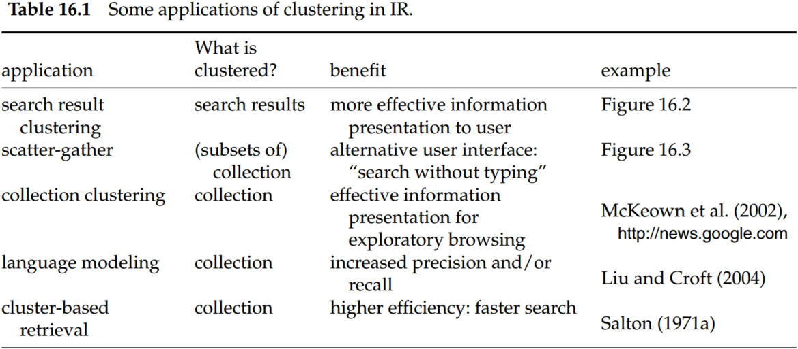
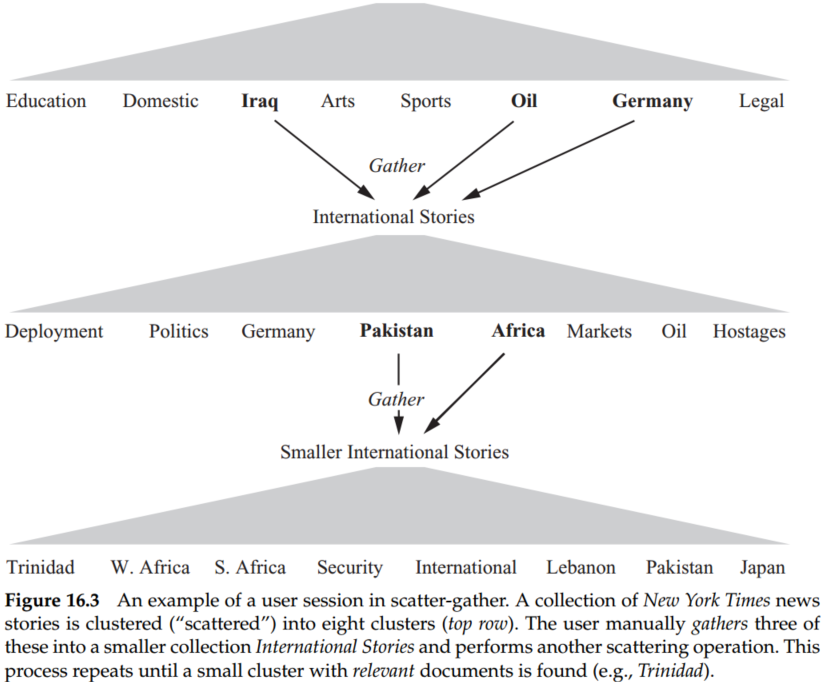
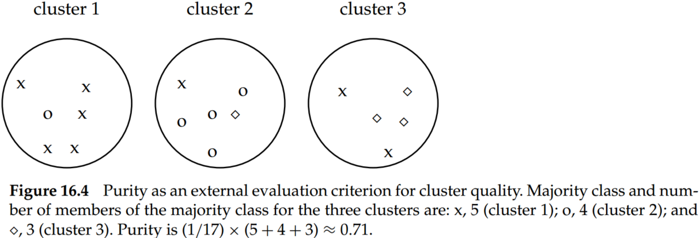
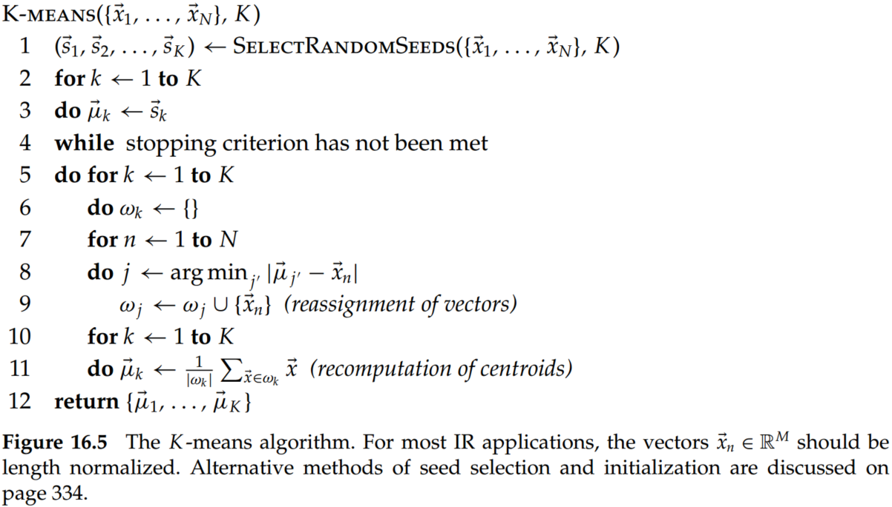
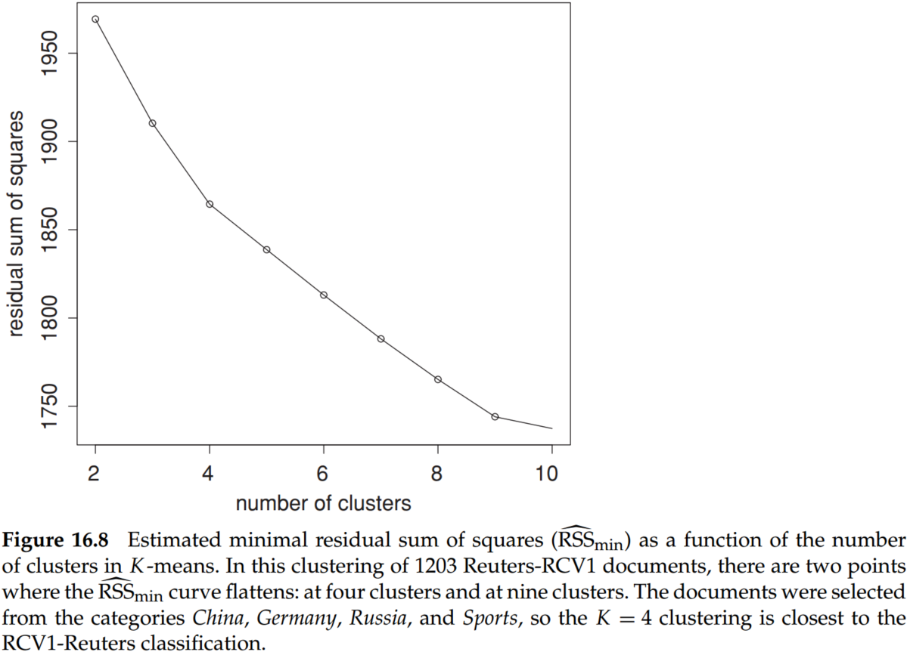

# Chapter 16 Flat Clustering

Clustering is the most common form of unsupervised learning. The key input to a clustering algorithm is the distance measure, which is often Euclidean distance. Different distance measures give rise to different clusterings. Thus, the distance measure is an important means by which we can influence the outcome of clustering. 

Flat clustering creates a flat set of clusters without any explicit structure that would relate clusters to each other. Hierarchical clustering creates a hierarchy of clusters.

Hard clustering computes a hard assignment – each document is a member of exactly one cluster. The assignment of soft clustering algorithms is soft – a document’s assignment is a distribution over all clusters. Latent semantic indexing, a form of dimensionality reduction, is a soft clustering algorithm. 

## 1. Clustering in information retrieval

**Cluster hypothesis.** Documents in the same cluster behave similarly with respect to relevance to information needs.

The cluster hypothesis states the fundamental assumption we make when using clustering in information retrieval (IR).

Search result clustering clusters the search results so that similar documents appear together. And it is often easier to scan a few coherent groups than many individual documents. This is particularly useful if a search term has different word senses. 

Scatter-gather clusters the whole collection to get groups of documents that the user can select or gather. The selected groups are merged, and the resulting set is again clustered. This process is repeated until a cluster of interest is found. 

## 2. Problem statement

The objective function is often defined in terms of similarity or distance between documents. 

A difficult issue in clustering is determining the number of clusters or cardinality of a clustering, which we denote by K. 

If the search starts at an unfavorable initial point, we may miss the global optimum. Finding a good starting point is, therefore, another important problem we have to solve in flat clustering.

## 3. Evaluation of clustering

Typical objective functions in clustering formalize the goal of attaining high intracluster similarity (documents within a cluster are similar) and low intercluster similarity (documents from different clusters are dissimilar). This is an internal criterion for the quality of a clustering.  For search result clustering, we may want to measure the time it takes users to find an answer with different clustering algorithms. This is the most direct evaluation, but it is expensive, especially if large user studies are necessary. 

Purity is a simple and transparent evaluation measure. Normalized mutual information can be information-theoretically interpreted. The Rand index penalizes both false-positive and false-negative decisions during clustering. The F measure, in addition, supports differential weighting of these two types of errors.

### 3.1 Purity 

To compute purity, each cluster is assigned to the class which is most frequent in the cluster, and then the accuracy of this assignment is measured by counting the number of correctly assigned documents and dividing by $N$. Formally:

$$
purity(\Omega, \mathbb C)=\frac1N\sum_k \operatorname*{max}_{j}|\omega_k \cap c_j| \tag{1}
$$

where $\Omega = \{\omega_1, \omega_2, ... , \omega_K\}$ is the set of clusters and $C = \{c_1, c_2, ... , c_J\}$ is the set of classes. $\omega_k\cap c_j$ counts the number of documents in cluster $k$ and belong to class $j$.

If purity is 1, which means the documents in the same clusters belong to the same classes. High purity is easy to achieve when the number of clusters is large – in particular, purity is 1 if each document gets its own cluster. Thus, we cannot use purity to trade off the quality of the clustering against the number of clusters.

### 3.2 Normalized mutual information

A measure that allows us to make this tradeoff between the quality of the clustering and the number of clusters is normalized mutual informal information or NMI:

$$
NMI(\Omega, \mathbb C)= \frac{I(\Omega; \mathbb C)}{[H(\Omega)+H(\mathbb)]/2}\tag{2}
$$

- $I$ is mutual information:

$$
I(\Omega;\mathbb C)=\sum_k\sum_jP(\omega_k\cap c_j)log\frac{P(\omega_k\cap c_j)}{p(\omega_k)P(c_j)}=\sum_k\sum_j\frac{|\omega_k\cap c_j|}{N}log\frac{{N|\omega_k\cap c_j|}}{{|\omega_k||c_j|}}\tag{3}
$$

where $P(\omega_k),P(c_j)$, and $P(\omega_k\cap c_j)$ are the probabilities of a document being in cluster $\omega_k$, class $c_j$ and in the intersection of $\omega_k$ and $c_j$, respectively. $I(\Omega; \mathbb C)$ measures the amount of information by which our knowledge about the classes increases when we are told what the clusters are. The minimum of $I(\Omega; \mathbb C)$ is 0 if the clustering is random with respect to class membership. In that case, knowing that a document is in a particular cluster does not give us any new information about what its class might be. In particular, a clustering with $K = N$ one document clusters has maximum mutual information $I$.

Thus, mutual information $I$ has the same problem as purity: It does not penalize large cardinalities and thus does not formalize our bias that, other things being equal, fewer clusters are better. The normalization by the denominator $[H(\Omega) + H(\mathbb C)]/2$ in Equation (3) fixes this problem since entropy tends to increase with the number of clusters. 

- $H$ is entropy：

$$
H(\Omega)=-\sum_kP(\omega_k)logP(\omega_k)=-\sum_k\frac{|\omega_k|}{N}log\frac{|\omega_k|}{N}\tag{4}
$$

$H(\Omega)$ reaches its maximum $log N$ for $K = N$, which ensures that NMI is low for $K = N$. 

Because $[H(\Omega) + H(\mathbb C)]/2$ is a tight upper bound on $I (\Omega; \mathbb C)$. Thus, NMI is always a number between 0 and 1. Since NMI is normalized, we can use it to compare clusterings with different numbers of clusters. 

### 3.3 Rand index

An alternative to this information-theoretic interpretation of clustering is to view it as a series of decisions, one for each of the $N(N − 1)/2$ pairs of documents in the collection. We want to assign two documents to the same cluster if and only if they are similar. A true-positive (TP) decision assigns two similar documents to the same cluster, a true-negative (TN) decision assigns two dissimilar documents to different clusters. There are two types of errors we can commit. A false-positive (FP) decision assigns two dissimilar documents to the same cluster. A false-negative (FN) decision assigns two similar documents to different clusters. The Rand index (RI) measures the RI percentage of decisions that are correct. That is, it is simply accuracy.

$$
RI=\frac{TP+TN}{TP+FP+FN+TN}\tag{5}
$$

As an example, we compute RI for Figure 16.4

- $TP+FP=C_6^2+C_6^2+C_5^2=40$;
- $TP=C_5^2+C_4^2+C_3^2+C_2^2=20$;
- $FP=40-20=20$;
- $FN=5+5\times 2+4+2+3=24$;
- $TN=5\times 5+1\times 2+5\times 3+1\times 5+1\times 3+4\times 5 +1\times 2=72$;

Thus,

$$
RI=(20+72)/(20+20+24+72)\approx 0.68
$$

### 3.4 F measure

The RI gives equal weight to FPs and FNs. Separating similar documents is sometimes worse than putting pairs of dissimilar documents in the same cluster. We can use the F measure to penalize FNs more strongly than FPs by selecting a value $\beta > 1$, thus giving more weight to recall.

$$
P+\frac{TP}{TP+FP}\;\; R=\frac{TP}{TP+FN}\;\; F_{\beta}=\frac{(\beta^2+1)PR}{\beta^2 P+R}\tag{5}
$$

Therefore, $P = 20/40 = 0.5$ and $R = 20/44 \approx 0.455$. This gives us $F_1 \approx 0.48$ for $\beta = 1$ and $F_5 \approx 0.456$ for $\beta = 5$.

## 4. K-means

K -means is the most important flat clustering algorithm. Its objective is to minimize the average squared Euclidean distance of documents from their cluster centers where a cluster center is defined as the mean or centroid $\overrightarrow \mu$ of the documents in a cluster $\omega$:

$$
\overrightarrow \mu(\omega)=\frac{1}{|\omega|}\sum_{\overrightarrow x\in \omega}\overrightarrow x\tag{6}
$$

A measure of how well the centroids represent the members of their clusters is the residual sum of squares or RSS, the squared distance of each vector from its centroid summed over all vectors:

$$
RSS_k=\sum_{\overrightarrow x\in \omega_k}|\overrightarrow x-\overrightarrow \mu(\omega_k)|^2\\
RSS=\sum_{k=1}^KRSS_k\tag{7}
$$

RSS is the objective function in K -means, and our goal is to minimize it. 

Although this proves the convergence of K -means, there is, unfortunately, no guarantee that a global minimum in the objective function will be reached. This is a particular problem if a document set contains many outliers, documents that are far from any other documents and therefore do not fit well into any cluster. Frequently, if an outlier is chosen as an initial seed, then no other vector is assigned to it during subsequent iterations. Thus, we end up with a singleton cluster (a cluster with only one document) even though there is probably clustering with lower RSS. 

Effective heuristics for seed selection include (i) excluding outliers from the seed set; (ii) trying out multiple starting points and choosing the clustering with the lowest cost; and (iii) obtaining seeds from another method such as hierarchical clustering. 

We can apply one of the following termination conditions for the K-means algorithm.
- A fixed number of iterations $I$ has been completed. This condition limits the runtime of the clustering algorithm, but in some cases, the quality of the clustering will be poor because of an insufficient number of iterations.
- Assignment of documents to clusters (the partitioning function $\gamma$) does not change between iterations. Except for cases with a bad local minimum, this produces a good clustering, but runtime may be unacceptably long.
- Centroids $\overrightarrow \mu_k$ do not change between iterations.
- Terminate when RSS falls below a threshold. This criterion ensures that the clustering is of the desired quality after termination. In practice, we need to combine it with a bound on the number of iterations to guarantee termination.
- Terminate when the decrease in RSS falls below a threshold $\theta$. For small $\theta$, this indicates that we are close to convergence. Again, we need to combine it with a bound on the number of iterations to prevent very long runtimes.

## 5. Cluster cardinality in K-means

The number of clusters $K$ is input to most flat clustering algorithms. A naive approach would be to select the optimal value of $K$ according to the objective function, namely, the value of $K$ that minimizes RSS. Defining $RSS_{min}(K)$ as the minimal RSS of all clusterings with $K$ clusters, we observe that $RSS_{min}(K)$ is a monotonically decreasing function in $K$, which reaches its minimum 0 for $K = N$ where $N$ is the number of documents. 

A heuristic method that gets around this problem is to estimate $RSS_{min}(K)$ as follows. We first perform $i$ (e.g., $i = 10$) clusterings with $K$ clusters (each with a different initialization) and compute the RSS of each. Then we take the minimum of the $i$ RSS values. We denote this minimum by $\hat{RSS}_{min}(K)$. Now we can inspect the values $\hat{RSS}_{min}(K)$ as $K$ increases and find the “knee” in the curve – the point where successive decreases in $\hat {RSS}_{min}$ become noticeably smaller. 

There are two such points in Figure 16.8, one at $K = 4$, where the gradient flattens slightly, and a clearer flattening at $K = 9$. 

The second type of criterion for cluster cardinality imposes a penalty for each new cluster – where conceptually, we start with a single cluster containing all documents and then search for the optimal number of clusters $K$ by successively increasing $K$. To determine the cluster cardinality in this way, we create a generalized objective function that combines two elements: distortion, a measure of how much documents deviate from the prototype of their clusters (e.g., RSS for K -means); and a measure of model complexity. We interpret a clustering here as a model of the data. Model complexity in clustering is usually the number of clusters or a function thereof. For K -means, we then get this selection criterion for $K$:

$$
K=arg\; \operatorname*{min}_{K}[RSS_{min}(K)+\lambda K]\tag{8}
$$

where $\lambda$ is a weighting factor. A large value of $\lambda$ favors solutions with few clusters. 

A theoretical justification for Equation (16.11) is the Akaike information criterion or AIC, an information-theoretic measure that trades off distortion against model complexity. The general form of AIC is:

$$
AIC:\; K=arg\; \operatorname*{min}_{K}[-2L(K)+2q(K)]\tag{9}
$$

where $−L(K)$, the negative maximum log-likelihood of the data for $K$ clusters, is a measure of distortion and $q(K)$, the number of parameters of a model with $K$ clusters, is a measure of model complexity.

For K -means, the AIC can be stated as follows:

$$
AIC:\; K=arg\; \operatorname*{min}_{K}[RSS_{min}(K)+2MK]\tag{9}
$$

where $M$ is the dimensionality of the vector space.

## 6. Model-based clustering

Model-based clustering assumes that the data were generated by a model and tries to recover the original model from the data.

For K-means, maximum likelihood and minimal RSS are equivalent criteria. We denote the model parameters by $\Theta$. In K -means, $\Theta = \{\overrightarrow \mu_1, ... , \overrightarrow \mu_K\}$.

$$
\Theta=\operatorname*{arg\; max}_{\Theta} L(D|\Theta)=\operatorname*{arg\; max}_{\Theta}log\prod_{n=1}^N P(d_n|\Theta)=\operatorname*{arg\; max}_{\Theta}\sum_{n=1}^Nlog P(d_n|\Theta)\tag{10}
$$

$L(D|\Theta)$ is the objective function that measures the goodness of the clustering.

A commonly used algorithm for model-based clustering is the expectation-maximization algorithm or EM algorithm. 

Suppose a document is generated by a mixture of multivariate Bernoulli distributions:

$$
P(d|\Theta)=\sum_{k=1}^K\alpha_k(\prod_{t_m\in d}q_{mk})(\prod_{t_m\notin d}(1-q_{mk}))\tag{10}
$$

where $\Theta=\{\Theta_1,...,\Theta_K\}, \Theta_K=(\alpha_k,q_{1k},...,1_{MK})$, and $q_{mk}=P(U_m=1|\omega_k)$ is the probability that a document from cluste $k$ contains term $t_m$. The probability $\alpha_k$ is the prior of cluster $\omega_k$: the probability that a document $d$ is in $\omega_k$ if we have no information about $d$.

In this model, we generate a document by first picking a cluster $\omega_k$ with probability $\alpha_k$ and then generating the terms of the document according to the parameters $q_{mk}$.

Thus, to determine the cluster of document $d$ is to determine:

$$
\operatorname*{arg\; max}_{\omega_k} P(d|\omega_k;\Theta)=(\prod_{t_m\in d}q_{mk})(\prod_{t_m\notin d}(1-q_{mk}))\tag{11}
$$

The EM algorithm can be applied to infer the parameters of the clustering from the data, which alternates between an expectation step, corresponding to reassignment, and a maximization step, corresponding to recomputation of the parameters of the model. 

- The maximization step recomputes the conditional parameters $q_{mk}$ and the priors $\alpha_k$ as follows

$$
q_{mk}=\frac{\sum_{n=1}^Nr_{nk}I(t_m\in d_n)}{\sum_{n=1}^Nr_{nk}}\; \alpha_k=\frac{\sum_{n=1}^Nr_{nk}}{N}
$$

where $I(t_m \in d_n) = 1$ if $t_m \in d_n$ and 0 otherwise and $r_{nk}$ is the soft assignment of document $d_n$ to cluster $k$ as computed in the preceding iteration.

- The expectation step computes the soft assignment of documents to clusters given the current parameters $q_{mk}$ and $\alpha_k$:

$$
r_{nk}=\frac{\alpha_k(\prod_{t_m\in d_n}q_{mk})(\prod_{t_m \notin d_n}(1-q_{mk}))}{\sum_{k=1}^K\alpha_k(\prod_{t_m\in d_n}q_{mk})(\prod_{t_m \notin d_n}(1-q_{mk}))}
$$

Finding good seeds is even more critical for EM than for K -means. EM is prone to get stuck in local optima if the seeds are not chosen well. This is a general problem that also occurs in other applications of EM.

## Conclusions

- Finding descriptive labels for clusters automatically is a difficult problem. But cluster-based navigation is an interesting alternative to keyword searching.  This is especially true in scenarios where users prefer browsing over searching because they are unsure about which search terms to use.
- Google News and its precursor, the Columbia NewsBlaster system, are examples of a scatter-gather approach.
- Clustering is well suited for access to a collection of news stories because news reading is not really a search but rather a process of selecting a subset of stories about recent events.
- When computing topic similarity, stop words can be safely ignored, but they are important cues for separating clusters of English (in which the occurs frequently and la infrequently) and French documents (in which the occurs infrequently and la frequently).
- Often, the number of clusters or cardinality of clustering is nothing more than a good guess based on experience or domain knowledge. 
- The scatter-gather interface could not display more than about 10 clusters per layer because of the size and resolution of computer monitors in the early 1990s.
- If the search starts at an unfavorable initial point, we may miss the global optimum. Finding a good starting point is, therefore, another important problem we have to solve in flat clustering.
-  Because deterministic hierarchical clustering methods are more predictable than K -means, hierarchical clustering of a small random sample of size $i$ K (e.g., for $i = 5$ or $i = 10$) often provides good seeds.
- A robust method that works well for a large variety of document distributions is to select $i$ (e.g., $i = 10$) random vectors for each cluster and use their centroid as the seed for this cluster.
- K -means is more efficient than the hierarchical algorithms.
- Distance computations are time-consuming in a naive implementation of K-means. 
- Truncating centroids to the most significant k terms (e.g., k = 1,000) hardly decreases cluster quality while achieving a significant speedup of the reassignment step.
- Euclidean distance and cosine similarity, Kullback-Leibler divergence is often used in clustering as a measure of how (dis)similar documents and clusters are (Xu and Croft 1999; Muresan and Harper 2004; Kurland and Lee 2004).
- Although some of these studies show improvements in effectiveness, efficiency, or both, there is no consensus that cluster-based retrieval works well consistently across scenarios. 
- There is good evidence that clustering of search results improves user experience and search result quality (Hearst and Pedersen 1996; Zamir and Etzioni 1999; Tombros et al. 2002; Kaki 2005; Toda and Kataoka 2005); al- ¨ though not as much as search result structuring based on carefully edited category hierarchies (Hearst 2006). 
- Basu et al. (2004) argue that the three evaluation measures NMI, Rand index, and F measure, give very similar results.
- AIC is due to Akaike (1974) (see also Burnham and Anderson (2002)). An alternative to AIC is BIC, which can be motivated as a Bayesian model selection procedure (Schwarz 1978). 
- Model-based clustering provides a framework for incorporating our knowledge about a domain. 
