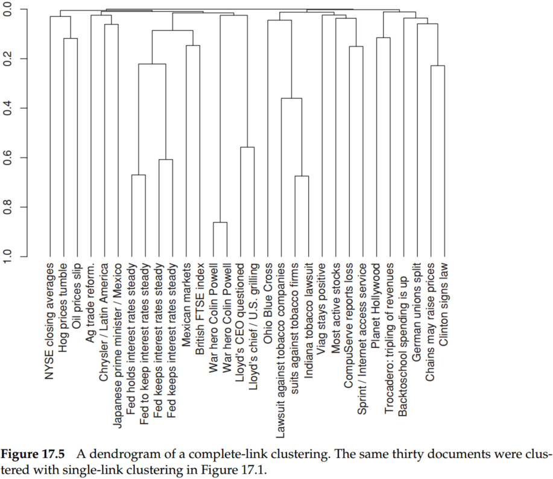
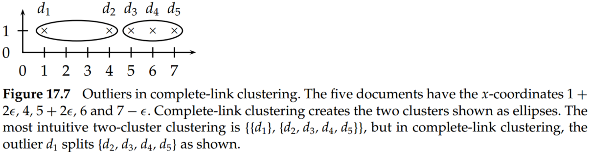

# Chapter 17 Hierarchical clustering

Hierarchical clustering (or hierarchic clustering) outputs a hierarchy, a structure that is more informative than the unstructured set of clusters returned by flat clustering. Hierarchical clustering does not require us to prespecify the number of clusters, and most hierarchical algorithms that have been used in information retrieval (IR) are deterministic. These advantages of hierarchical clustering come at the cost of lower efficiency. The most common hierarchical clustering algorithms have a complexity that is at least quadratic in the number of documents compared to the linear complexity of K-means and EM.

## 1.Hierarchical agglomerative clustering

Hierarchical clustering algorithms are either top-down or bottom-up. Bottom-up algorithms treat each document as a singleton cluster at the outset and then successively merge (or agglomerate) pairs of clusters until all clusters have been merged into a single cluster that contains all documents. Bottom-up hierarchical clustering is therefore called hierarchical agglomerative clustering or HAC. Top-down clustering requires a method for splitting a cluster. It proceeds by splitting clusters recursively until individual documents are reached. 

A fundamental assumption in HAC is that the merge operation is monotonic. Monotonic means that if $s_1, s_2, ... , s_{K−1}$ are the combination similarities of the successive merges of an HAC, then $s_1 \geq s_2 \geq ... \geq s_{K−1}$ holds.

Hierarchical clustering does not require a prespecified number of clusters. However, in some applications, we want a partition of disjoint clusters, just as in flat clustering. In those cases, the hierarchy needs to be cut at some point. A number of criteria can be used to determine the cutting point:

- Cut at a prespecified level of similarity. For example, we cut the dendrogram at 0.4 if we want clusters with a minimum combination similarity of 0.4.
- Cut the dendrogram where the gap between two successive combination similarities is largest. Adding one more cluster decreases the quality of the clustering significantly, so cutting before this steep decrease occurs is desirable. 
- Apply Equation (1):

$$
K=\operatorname*{arg\;min}_{K'}[RSS(K')+\lambda K']\tag{1}
$$

where $K'$ refers to the cut of the hierarchy that results in $K'$ clusters, RSS is the residual sum of squares, and $\lambda$ is a penalty.

- Prespecify the number of clusters K and select the cutting point that produces $K$ clusters.

The merge criteria of four different similarity measures （single-link, complete-link, group-average, and centroid clustering of HAC are shown in Figure 17.3.

## 2. Single-link and complete-link clustering

In single-link clustering or single-linkage clustering, the similarity of two clusters is the similarity of their most similar members. This single-link merge criterion is local. We pay attention solely to the area where the two clusters come closest to each other. Other, more distant parts of the cluster and the clusters’ overall structure are not taken into account.

In complete-link clustering or complete-linkage clustering, the similarity of two clusters is the similarity of their most dissimilar members. This complete-link merge criterion is nonlocal; the entire structure of the clustering can influence merge decisions. This results in a preference for compact clusters with small diameters over long, straggly clusters but also causes sensitivity to outliers. A single document far from the center can increase the diameters of candidate merge clusters dramatically and completely change the final clustering.

Figure 17.1 is an example of a single-link clustering of a set of documents, and Figure 17.5 is the complete-link clustering of the same set. 

Single-link clustering can produce straggling clusters, as shown in Figure 17.6. Because the merge criterion is strictly local, a chain of points can be extended for long distances without regard to the overall shape of the emerging cluster. This effect is called chaining.

Complete link clustering can avoid this problem. However, complete-link clustering has a different problem. It pays too much attention to outliers, points that do not fit well into the global structure of the cluster.

The complexity of the naive HAC algorithm is $O(N^3)$ because we exhaustively search the $N \times N$ matrix $C$ for the largest similarity in each of $N − 1$ iterations. A more efficient algorithm is the priority-queue algorithm, which time complexity is $O(N^2log N)$. The rows $C[k]$ of the $N \times N$ similarity matrix $C$ are sorted in decreasing order of similarity in the priority queues $P$. $P[k].max()$ then returns the cluster in $P[k]$ that currently has the highest similarity with $w_k$, where we use $w_k$ to denote the $k^{th}$ cluster. After creating the merged cluster of $w_{k_1}$ and $w_{k_2}$, $w_{k_1}$ is used as its representative.

For single link, we can introduce a next-best-merge array (NBM) as a further optimization, and the overall complexity of single-link clustering is $O(N^2)$.

## 3. Group-average agglomerative clustering

Group-average agglomerative clustering or GAAC  evaluates cluster quality based on all similarities between documents, thus avoiding the pitfalls of the single-link and complete-link criteria, which equate cluster similarity with the similarity of a single pair of documents. GAAC is also called group-average clustering and average-link clustering. GAAC computes the average similarity sim-ga of all pairs of documents, including pairs from the same cluster. But self-similarities are not included in the average:

$$
SIM-GA(w_i,w_j)=\frac{1}{(N_i+N_j)(N_i+N_j-1)}\sum_{d_m\in w_i\cup w_j}\sum_{d_n\in w_i\cup w_j,d_n\neq d_m}\overrightarrow d_m\cdot \overrightarrow d_n\\
=\frac{1}{(N_i+N_j)(N_i+N_j-1)}[(\sum_{d_m\in w_i\cup w_j}\overrightarrow d_m)^2-(N_i+N_j)]\tag{2}
$$

where, $N_i$ and $N_j$ are the number of documents in cluster $w_i$ and $w_j$, $(N_i+N_j)(N_i+N_j-1)=2\times (N_iN_j+N_i(N_i-1)/2+N_j(N_j-1)/2)$. $\overrightarrow d$ is the length-normalized vector of document $d$. The term $(N_i + N_j)$ on the right is the sum of $N_i + N_j$ self-similarities of value 1.0.

The motivation for GAAC is that our goal in selecting two clusters $w_i$ and $w_j$ as the next merge in HAC is that the resulting merge cluster $w_k = w_i \cup w_j$ should be coherent. Thus, to judge the coherence of $w_k$, we need to look at all document-document similarities within $w_k$, including those that occur within $w_i$ and those that occur within $w_j$.

Compared with single-link/complete-link clustering, GAAC requires (i) documents represented as vectors, (ii) length normalization of vectors so that self-similarities are 1.0, and (iii) the dot product for computing the similarity between vectors and sums of vectors.

The merge algorithms for GAAC and complete-link clustering are the same expect the similarity function. So the overall time complexity of GAAC is the same as for complete-link clustering: $O(N^2log N)$. Like complete-link clustering, GAAC is not the best-merge persistent. This means that there is no $O(N^2)$ algorithm for GAAC that would be analogous to the $O(N^2)$ algorithm for single-link.

## 4.Centroid clustering

In centroid clustering, the similarity of two clusters is defined as the similarity of their centroids:

$$
SIM-CENT(w_i,w_j)=\overrightarrow \mu(w_i)\cdot \overrightarrow \mu(w_j)=(\frac{1}{N_i}\sum_{d_m\in w_i}\overrightarrow d_m)\cdot (\frac{1}{N_j}\sum_{d_n\in w_j}\overrightarrow d_n)=\frac{1}{N_iN_j}\sum_{d_m\in w_i}\sum_{d_n\in w_j}\overrightarrow d_m\cdot \overrightarrow d_{n}\tag{3}
$$

Equation (3) shows that centroid similarity is equivalent to the average similarity of all pairs of documents from different clusters. Thus, the difference between GAAC and centroid clustering is that GAAC considers all pairs of documents in computing average pairwise similarity, whereas centroid clustering excludes pairs from the same cluster. 

In contrast to the other three HAC algorithms, centroid clustering is not monotonic. So-called inversions can occur: Similarity can increase during clustering, as in the example in Figure 17.12. In a monotonic HAC algorithm, the similarity is monotonically decreasing from iteration to iteration. That is to say, as the iteration goes by, the distance between each cluster should increase, or the similarity should decrease if the HAC algorithm is monotonic.

Despite its nonmonotonicity, centroid clustering is often used because its similarity measure – the similarity of two centroids – is conceptually simpler than the average of all pairwise similarities in GAAC. 

## 5. Cluster labeling

We must label clusters so that users can see what a cluster is about.

- *Differential cluster labeling* selects cluster labels by comparing the distribution of terms in one cluster with that of other clusters. In particular, mutual information (MI) or, equivalently, information gain and the $\chi^2$ test will identify cluster labels that characterize one cluster in contrast to other clusters. 
- *Cluster-internal labeling* computes a label that solely depends on the cluster itself, not on other clusters. Labeling a cluster with the title of the document closest to the centroid is one cluster-internal method. 
- *Centroid*. We can also use a list of terms with high weights in the centroid of the cluster as a label. 

## 6. Conclusions
- In general, we select flat clustering when efficiency is important and hierarchical clustering when one of the potential problems of flat clustering (not enough structure, predetermined number of clusters, nondeterminism) is a concern. In addition, many researchers believe that hierarchical clustering produces better clusters than flat clustering. 
- Hierarchical clustering does not require us to prespecify the number of clusters, and most hierarchical algorithms that have been used in information retrieval (IR) are deterministic.
- The most common hierarchical clustering algorithms have a complexity that is at least quadratic in the number of documents compared to the linear complexity of K-means and EM.
- HAC is more frequently used in IR than top-down clustering.
- The complexity of the naive HAC algorithm is $O(N^3)$ because we exhaustively search the $N \times N$ matrix $C$ for the largest similarity in each of $N − 1$ iterations.
- Top-down clustering is conceptually more complex than bottom-up clustering; we need a second, flat clustering algorithm as a “subroutine.” It has the advantage of being more efficient if we do not generate a complete hierarchy all the way down to individual document leaves. For a fixed number of top levels, using an efficient flat algorithm like K-means, top-down algorithms are linear in the number of documents and clusters. So they run much faster than HAC algorithms, which are at least quadratic.
- There is evidence that divisive algorithms produce more accurate hierarchies than bottom-up algorithms in some circumstances. 
- Top-down clustering benefits from complete information about the global distribution when making top-level partitioning decisions.
- A combination of a differential test with a penalty for rare terms often gives the best labeling results because rare terms are not necessarily representative of the cluster as a whole.
- Cluster-internal methods are efficient, but they fail to distinguish terms that are frequent in the collection as a whole from those that are frequent only in the cluster. 
- For large vocabularies, complete-link clustering can be more efficient than an unoptimized implementation of GAAC.
- Even with these optimizations, HAC algorithms are all $O(N^2)$ or $O(N^2 log N)$ and therefore infeasible for large sets of 1,000,000 or more documents. For such large sets, HAC can only be used in combination with a flat clustering algorithm like K-means. 
- We can employ a HAC algorithm to compute seeds of high quality for K-Menas. This algorithm is referred to as the Buckshot algorithm. It combines the determinism and higher reliability of HAC with the efficiency of K-means.
- There is no doubt that results of EM and K-means are highly variable since they will often converge to a local optimum of poor quality. The HAC algorithms we have presented here are deterministic and thus more predictable.
- Ward’s method (Ward Jr. 1963; El-Hamdouchi and Willett 1986), also called minimum variance clustering. In each step, it selects the merge with the smallest RSS. The merge criterion in Ward’s method (a function of all individual distances from the centroid) is closely related to the merge criterion in GAAC (a function of all individual similarities to the centroid).
- Despite its importance for making the results of clustering useful, comparatively little work has been done on labeling clusters.
- Some clustering algorithms attempt to find a set of labels first and then build (often overlapping) clusters around the labels, thereby avoiding the problem of labeling altogether (Zamir and Etzioni 1999; Kaki 2005; ¨ Osinski and Weiss 2005). 
- An example of an efficient divisive algorithm is bisecting K-means (Steinspectral bach et al. 2000). Spectral clustering algorithms (Kannan et al. 2000; Dhillon 2001; Zha et al. 2001; Ng et al. 2001a), including principal direction divisive partitioning (PDDP) (whose bisecting decisions are based on SVD, see Chapter 18) (Boley 1998; Savaresi and Boley 2004), are computationally more expensive than bisecting K -means, but have the advantage of being deterministic.
- Unlike K-means and EM, most hierarchical clustering algorithms do not have a probabilistic interpretation. Model-based hierarchical clustering (Vaithyanathan and Dom 2000; Kamvar et al. 2002; Castro et al. 2004) is an exception.
