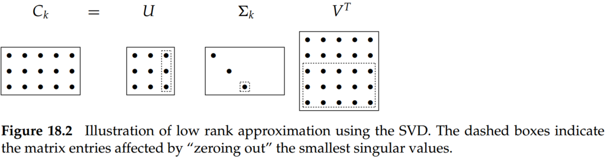

# Chapter 18 Matrix decompositions and latent semantic indexing

## 1. Eigen decomposition

A square matrix can be factored into the product of matrices derived from its eigenvectors; we refer to this process as matrix decomposition. 

- **Matrix diagonalization theorem** Let $S$ be a square real-valued $M\times M$ matrix with $M$ linearly independent eigenvectors. Then there exists an eigen decomposition

$$
S=U\Lambda U^{-1}\tag{1}
$$

where the columns of $U$ are the eigenvectors of $S$ and $\Lambda$ is a diagonal matrix whose diagonal entries are the eigenvalues of $S$ in decreasing order. If the eigenvalues are distinct, then this decomposition is unique.

Proof:

Based on the definition of eigenvalues and eigenvectors, we have

For a square $M\times M$ matrix $C$ and a vector $\overrightarrow x$ that is not all zeros, the values of $\lambda$ satisfying $C\overrightarrow x=\lambda \overrightarrow x$ are called the eigenvalues of $C$. The N-vectors $\overrightarrow x$ for an eigenvalue $\lambda$ is the corresponding right eigenvector.

Let's note that $U$ has the eigenvectors of $S$ as columns $U=(\overrightarrow u_1\;\overrightarrow u_2\; ...\; \overrightarrow u_M)$,

Then we have

$$
\begin{align*}
SU= & S(\overrightarrow u_1\;\overrightarrow u_2\; ...\; \overrightarrow u_M)=(\lambda\overrightarrow u_1\;\lambda\overrightarrow u_2\; ...\; \lambda\overrightarrow u_M)\\
= & (\overrightarrow u_1\;\overrightarrow u_2\; ...\; \overrightarrow u_M)\begin{pmatrix} \lambda_1 &  &  & \\   & \lambda_2 &  & \\  &   &  ... &  \\  &  &  & \lambda_M\end{pmatrix}
\end{align*}
$$

Thus, we have $SU = U\Lambda$, or $S = U\Lambda U^{−1}$.

- **Symmetric diagonalization theorem** Let $S$ be a square, symmetric real-valued $M\times M$ with $M$ linearly independent eigenvectors. Then there exists asymmetric diagonal decomposition

$$
S=Q\Lambda Q^T\tag{3}
$$

where the columns of $Q$ are the orthogonal and normalized (unit length, real) eigenvectors of $S$, and $\lambda$ is the diagonal matrix whose entries are the eigenvalues of $S$. Further, all entries of $Q$ are real, and we have $Q^{-1}=Q^T$.

## 2. Singular value decompositions

Let $r$ be the rank of the $M\times N$ matrix $C$. Then, there is a singular-value decomposition (SVD) of $C$ of the form

$$
C=U\Sigma V^T\tag{4}
$$

where

1. The eigenvalues $\lambda_1,...,\lambda_r$ of $CC^T$ are the same as the eigenvalues of $C^TC$;
2. For $1\leq i\leq r$, let $\sigma_i=\sqrt \lambda_i$, with $\lambda_1\geq \lambda_{i+1}$. Then the $M\times N$ matrix $\Sigma$ is composed by setting $\Sigma_{ii}=\sigma_i$ for $1\geq i\geq r$, and zero otherwise. And the values $\sigma_i$ are referred to as the singular values of $C$.
3. $U$ is the $M\times M$ matrix whose columns are the orthogonal eigenvectors of $CC^T$, and $V$ is the $N\times N$ matrix whose columns are the orthogonal eigenvectors of $C^TC$.

Accordingly, it is conventional to omit the rightmost $M − r$ columns of $U$ corresponding to these omitted rows of $\Sigma$; likewise, the rightmost $N − r$ columns of $V$ are omitted because they correspond in $V^T$ to the rows that will be multiplied by the $N − r$ columns of zeros in $\Sigma$. This written form of the SVD is sometimes known as the reduced SVD or truncated SVD.

As for information retrieval, the entry $(i, j)$ in $CC^T$ is the number of documents in which both term $i$ and term $j$ occur.

## 3. Low-rank approximations

Frobenius norm of matrix $X$:

$$
||X||_F=\sqrt{\sum_{i=1}^M\sum_{j=1}^NX_{ij}^2}\tag{5}
$$

Low-rank approximations: 

Given an $M\times N$ matrix $C$ and a positive integer $k$, we wish to find an $M\times N$ matrix $C_k$ of rank at most $k$, so as to minimize the discrepancy between $C_k$ and $C$. When $k$ is far smaller than $r$, we refer to $C_k$ as a low-rank approximation. We can develop the Frobenius norm of the matrix difference $X=C-C_k$ to represent the difference between $C$ and $C_k$.

Attribute to the fact that the effect of small eigenvalues on matrix products is small. Thus, it seems plausible that replacing these small eigenvalues by zero will not substantially alter the product, leaving it “close” to $C$. 

Therefore, the SVD can be used to solve the low-rank matrix approximation problem.

- **Step 1.** Given $C$, construct its SVD, thus, $C=U\Sigma V^T$;
- **Step 2.** Derive from $\Sigma$ the matrix $\Sigma_k$ formed by replacing by zeros the $r-k$ smallest singular values on the diagonal of $\Sigma$; 
- **Step 3.** Coumpute and output $C_k=U\Sigma_kV^T$ as the rank-k approximation to $C$.

$$
\operatorname*{min}_{Z|rank(Z)=k}\;\; ||C-C_k||_F=\sqrt{\sum_{i=k+1}^r\sigma_i^2}\tag{6}
$$

Thus, the larger $k$ is, the smaller this error (and in particular, for $k = r$, the error is zero since $\Sigma_r = \Sigma$; provided $r < M, N$, then $\sigma_{r+1} = 0$ and thus $C_r = C$)

## 4. Latent semantic indexing

The vector space representation suffers, however, from its inability to cope with two classic problems arising in natural languages: synonymy and polysemy. 
- Synonymy refers to a case where two different words (say, car and automobile) have the same meaning. 
- Polysemy, on the other hand, refers to the case where a term such as charge has multiple meanings, so that the computed similarity $\overrightarrow q \cdot \overrightarrow d$ overestimates the similarity that a user would perceive. 

In order to capture the latent semantic associations of terms and alleviate these problems, the co-occurrences of terms can be applied. However, for a collection of modest size,  the term-document matrix $C$ is likely to have several tens of thousand of rows and columns and a rank in the tens of thousands as well. So, based on SVD, we could yield the low-rank representation of term-document matrix $C$ and queries. And to compute query–document similarity scores in this low-rank representation. This process is known as latent semantic indexing (generally abbreviated LSI). 

We thus map each row/column (respectively corresponding to a term/document) to a k-dimensional space; this space is defined by the $k$ principal eigenvectors (corresponding to the largest eigenvalues) of $CC^T$ and $C^TC$. 

A query vector $\overrightarrow q$ is mapped into its representation in the LSI space by the transformation.

$$
\overrightarrow q_k=\Sigma_{k}^{-1}U_k\overrightarrow q\tag{7}
$$

Now, we may use cosine similarities to compute the similarity between a query and a document, between two documents, or between two terms. 

- The computational cost of the SVD is significant; at the time of this writing, we know of no successful experiment with over one million documents. This has been the biggest obstacle to the widespread adoption to LSI. One approach to this obstacle is to build the LSI representation on a randomly sampled subset of the documents in the collection, following which the remaining documents are “folded in”.
- As we reduce $k$, recall tends to increase, as expected.
- Most surprisingly, a value of $k$ in the low hundreds can actually increase precision on some query benchmarks. This suggests that, for a suitable value of $k$, LSI addresses some of the challenges of synonymy.
- LSI works best in applications where there is little overlap between queries and documents.
- Some modes where LSI failed to match the effectiveness of more traditional indexes and score computations. Most notably (and perhaps obviously), LSI shares two basic drawbacks of vector space retrieval: There is no good way of expressing negations (find documents that contain german but not shepherd) and no way of enforcing Boolean conditions.
- LSI can be viewed as soft clustering by interpreting each dimension of the reduced space as a cluster and the value that a document has on that dimension as its fractional membership in that cluster.

## Conclusions
- Although latent semantic indexing has not been established as a significant force in scoring and ranking for information retrieval (IR), it remains an intriguing approach to clustering in a number of domains, including for collections of text documents.
- The effect of small eigenvalues (and their eigenvectors) on a matrix-vector product is small.
- For a symmetric matrix $S$, the eigenvectors corresponding to distinct eigenvalues are orthogonal. Further, if $S$ is both real and symmetric, the eigenvalues are all real.
- For LSI, in the experimental work cited, $k$ is generally chosen to be in the low hundreds. 
- The quality of the LSI representation will degrade as more documents are added and will eventually require recomputation of the LSI representation.
- The fidelity of the approximation of $C_k$ to $C$ leads us to hope that the relative values of cosine similarities are preserved: if a query is close to a document in the original space, it remains relatively close in the k-dimensional space. But this in itself is not sufficiently interesting, especially given that the sparse query vector $\overrightarrow q$ turns into a dense query vector $\overrightarrow q_k$ in the low-dimensional space. 
- Dumais (1993) and Dumais (1995) conducted experiments with LSI on TREC documents and tasks, using the commonly used Lanczos algorithm to compute the SVD. At the time of their work in the early 1990s, the LSI computation on tens of thousands of documents took approximately one day on one machine. In these experiments, they achieved precision at or above that of the median TREC participant. In about 20% of TREC topics, their system was the top scorer and reportedly slightly better on average than standard vector spaces for LSI at about 350 dimensions. Here are some conclusions on LSI first suggested by their work and subsequently verified by many other experiments.
