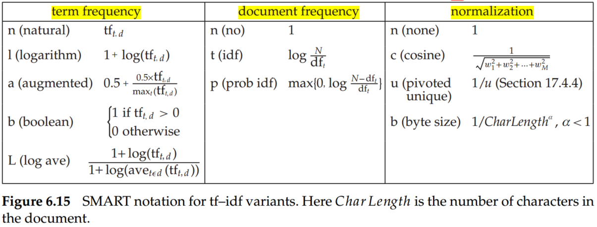

# Introduction to Information Retrieval (Chapter 6 Scoring, term weighting, and the vector space model)

As for Boolean queries, the resulting number of matching documents can far exceed the number a human user could possibly sift through. Consequently, it is essential for a search engine to rank-order the documents matching a query. To rank the search results, we have to provide the scores of results.

## 1. Parametric and zone indexes

- **Parametric**

Query: *find documents authored by William Shakespeare in 1601, containing the phrase alas poor Yorick*.

There is one parametric index for each field (date of creation). It allows us to select only the documents matching a date specified in the query.

- **Zones**

Query: *find documents with merchant in the title and william in the author list and the phrase gentle rain in the body.*

Zones are similar to fields, except the contents of a zone can be arbitrary free text. For instance, document titles and abstracts are generally treated as zones.

- **Weighted zone scoring**

Give a Boolean query $q$ and a document $d$, where each zone of the document contributes a Boolean value. Weighted zone score is a linear combination of zone scores.

Let $s_i$ be the Bollean score denoting a match (or absence thereof) between $q$ and the $i$th zone. Let $g_1,...,g_l \in [0, 1]$ such that $\sum_{i=1}^lg_i=1$. Then the weighted zone score is defined to be:

$$
\sum_{i=1}^lg_is_i \in [0, 1]\tag{1}
$$

The algorithm in Figure 6.4 treats the case when the query q is a two-term query consisting of query terms q1 and q2, and the Boolean function is AND: 1 if both query terms are present in a zone and 0 otherwise.

## 2. Tf-idf function

### 2.1 Tf-idf

- **Term frequency (TF)**: the number of occurrences of term $t$ in document $d$, note as $tf_{t,d}$.
- **Inverse document frequency (idf)**: $idf_t=log\frac{N}{df_t}$, where $N$ is the total number of documents in a collection; $df_t$, document frequency, is the number of documents in the collection that contain a term $t$.

- **TF-idf**: $tf–idf_{t,d}$ assigns to term $t$ a weight in document $d$: 

$$
tf-idf_{t,d} = tf_{t,d}\times idf_t\tag{2}
$$

### 2.2 Variant tf–idf functions

#### 2.2.1 Sublinear tf scaling

According to the definition of $tf$,  the importance of a term is proportional to its occurrence in the document, the twenty occurrences of a term in a document truly carry twenty times the significance of a single occurrence. However, this conclusion may not correct.  A common modification is to use instead of the logarithm of the term frequency, which assigns a weight given by

$$
wf_{t,d}=\begin{cases}
1+logtf_{t,d} & if\; tf_{t,d}>0\\
0 & otherwise
\end{cases}\tag{3}
$$

#### 2.2.2 Maximum tf normalization

Suppose we were to take a document $d$ and create a new document $d'$ by simply appending a copy of $d$ to itself. Although $d'$ should be no more relevant to any query than $d$ is, the use of tf-idf assigns it twice as high a score as $d$. Therefore, replacing tf–idf by ntf–idf eliminates the anomaly in this example. 

The main idea of maximum $tf$ normalization is to mitigate the following anomaly: We observe higher term frequencies in longer documents, merely because longer documents tend to repeat the same words over and over again.

Let $tf_{max}(d) = max_{\tau \in d} tf_{\tau,d}$, where $\tau$ ranges over all terms in $d$. A normalized term frequency for each term $\tau$ in document $d$ by

$$
ntf_{t,d}=a+(1-a)\frac{tf_{t,d}}{tf_{max}(d)'}\tag{4}
$$

where $a$ is a value between 0 and 1 and is generally set to 0.4, although some early work used the value 0.5. The term $a$ in (4) is a smoothing term whose role is to damp the contribution of the second term, which may be viewed as a scaling down of $tf$ by the largest $tf$ value in $d$.

#### 2.2.3 Document and query weighting schemes

The document and query vector can be represented by the SMART notation:

We could combine different document and query weighting schemes (term frequency - document frequency - normalization) based on SMART. A very standard weighting scheme is lnc.ltc, where the document vector has log-weighted term frequency, no idf (for both effectiveness and efficiency reasons), and cosine normalization, while the query vector uses log-weighted term frequency, idf weighting, and cosine normalization.

## Summary
- A very standard weighting scheme is lnc.ltc, where the document vector has log-weighted term frequency, no idf (for both effectiveness and efficiency reasons), and cosine normalization, while the query vector uses log-weighted term frequency, idf weighting, and cosine normalization.
