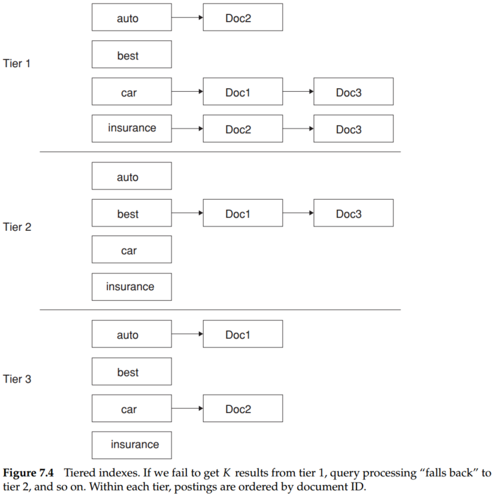

# Introduction to Information Retrieval (Chapter 7 Computing scores in a complete search system)

## 1. Background

Score computation is a large (10s of%) fraction of the CPU work on a query. Generally, we have a tight budget on latency (say, 250ms). And CPU provisioning doesn't permit exhaustively scoring every document on every query. Today we'll look at ways of cutting CPU usage for scoring without compromising the quality of results (much). The basic idea is to avoid scoring docs that won't make it into the top $K$. 

## 2. Efficient scoring and ranking

Thus far, there are some strategies for efficient scoring and ranking to retrieving precisely the $K$ highest-scoring documents for a query.

**(1) Inexact top K document retrieval**

To this end, we have to select some docs whose scores are closed to the top $K$ scores, then ranking them.e
- **Filtering.** Find a set $A$ of documents that are contenders, where $K < |A| << N$. $A$ does not necessarily contain the $K$ top-scoring documents for the query but is likely to have many documents with scores near those of the top $K$.
- **Ranking.** Return the $K$ top-scoring documents in $A$.


**(2) Index elimination**

Some rules can help us to cut down the number of documents drastically.

- We only consider documents containing terms whose idf exceeds a preset threshold.
- We only consider documents that contain many (and as a special case, all) of the query terms. 

**(3) Champion lists**

We could construct champion lists, the list which contains $r$ documents with the highest weights, for each term in the dictionary. Therefore, we only calculate the scores of documents in the champion list for term $t$ in query $q$. Intuitively, $r$ should be large compared with $K$, and it could, for instance, be set to be higher for rarer terms.

**(4) Static quality scores and ordering**

Stemming from the idea of champion lists, we could precompute a static quality score $g(d)$ for document $d$. Then, based on $g(d)$, we could construct the champion list of each term $t$ in the query (the documents which contain the term $t$ and have a high value $g(d)$). Therefore, champion lists can be selected and reordered via intersection operation.

<center>


</center>

In Figure 7.2, we assume that Doc1, Doc2 and Doc3 respectively have static quality scores $g(1) = 0.25, g(2) = 0.5, g(3) = 1$. Thus, the champion lists of each term are [Doc2, Doc1], [Doc3, Doc1],...,. Suppose the query is "best car insurance," so the selected document is Doc3. Suppose the number of "qualified item" (the net-score is greater than the threshold) in intersection sets is less than $K$. In that case, we have to extend the intersection sets by union operation of champion lists.

**(5) Cluster pruning**

<center>


</center>

To cluster,

- Pick $\sqrt N$ documents at random from the collection. Call these leaders.
- For each document that is not a leader, we compute its nearest leader and refer to those documents that are not leaders as followers.

The expected number of followers for each leader is $\approx N /\sqrt N= \sqrt N$.

To query,

- Given a query $q$, find the leader $L$ that is closest to $q$. This entails computing cosine similarities from $q$ to each of the $\sqrt N$ leaders.
- The candidate set $A$ consists of $L$ together with its followers. We compute the cosine scores for all documents in this candidate set.

## 3. Components of an information retrieval system

### 3.1 Tiered Indexes

<center>


</center>

We illustrate the tiered indexes in Figure 7.4. In this example, we set a tf threshold of 20 for tier 1 and 10 for tier 2, meaning that the tier 1 index only has postings entries with tf values exceeding 20, and the tier 2 index only has postings entries with tf values exceeding 10 and exclude tier 1 index. 

### 3.2 Query term proximity

Consider a query with two or more query terms, $t1, t2, ..., tk$. Let $\omega$ be the width of the smallest window in a document $d$ that contains all the query terms, measured in the number of words in the window. We could also consider variants in which only words that are not stop words are considered in computing $\omega$. Such proximity-weighted scoring functions are a departure from pure cosine similarity and closer to the "soft conjunctive" semantics that Google and other web search engines evidently use.

Suppose the queue is * C'est la vie*, and the inverted index of each term is:

| term | inverted index|
| --- | --- |
| C'est | 8, 9, 10, 21, 27 |
| la | 3, 5, 12, 38, 54 |
| vie | 13, 17, 19, 22, 29 |

The algorithm to find the minimum window size is below,

```python

import queue


def window_size(q_i, q_j, q_k):
    """
    window_size() function is just a demo for us to have a better understand of the whole process of the minimal window_size calculation.
    For practical use, we have to refactor this function.
    :param q_i: invert index of term i
    :param q_j: invert index of term j
    :param q_k: invert index of term k
    :return:
    """
    ## Initialize of index tuple (q_i_temp, q_j_temp, q_k_temp)
    temp_q_i = q_i.get()
    temp_q_j = q_j.get()
    temp_q_k = q_k.get()
    min_window_size = 10 ** 8
    while not q_i.empty() and not q_j.empty() and not q_k.empty():
        ## calculate the window size for each popping, and update the minimal window size
        min_temp = min(temp_q_i, temp_q_j, temp_q_k)
        max_temp = max(temp_q_i, temp_q_j, temp_q_k)
        window_size_temp = max_temp - min_temp
        if window_size_temp < min_window_size:
            min_window_size = window_size_temp
        print(
            "index tuple: {index_tuple}, max index: {max_index}, min index: {min_index}, window size: {window_size}, min window size: {min_window_size}".format(
                index_tuple=(temp_q_i, temp_q_j, temp_q_k), max_index=max_temp, min_index=min_temp,
                window_size=window_size_temp, min_window_size=min_window_size))
        ## popping
        if min_temp == temp_q_i:
            temp_q_i = q_i.get()
        elif min_temp == temp_q_j:
            temp_q_j = q_j.get()
        else:
            temp_q_k = q_k.get()

q_i = queue.Queue()
q_j = queue.Queue()
q_k = queue.Queue()
for i, j, k in zip([8, 9, 10, 21, 27], [3, 5, 12, 38, 54], [13, 17, 19, 22, 29]):
    q_i.put(i)
    q_j.put(j)
    q_k.put(k)
window_size(q_i, q_j, q_k)

```

The result is,

> index tuple: (8, 3, 13), max index: 13, min index: 3, window size: 10, min window size: 10
> index tuple: (8, 5, 13), max index: 13, min index: 5, window size: 8, min window size: 8
> index tuple: (8, 12, 13), max index: 13, min index: 8, window size: 5, min window size: 5
> index tuple: (9, 12, 13), max index: 13, min index: 9, window size: 4, min window size: 4
> index tuple: (10, 12, 13), max index: 13, min index: 10, window size: 3, min window size: 3
> index tuple: (21, 12, 13), max index: 21, min index: 12, window size: 9, min window size: 3
> index tuple: (21, 38, 13), max index: 38, min index: 13, window size: 25, min window size: 3
> index tuple: (21, 38, 17), max index: 38, min index: 17, window size: 21, min window size: 3
> index tuple: (21, 38, 19), max index: 38, min index: 19, window size: 19, min window size: 3
> index tuple: (21, 38, 22), max index: 38, min index: 21, window size: 17, min window size: 3

### 3.3 Search system 

<center>


</center>

A complete search system is depicted in Figure 7.5. In this figure, documents stream in from the left for parsing and linguistic processing (language and format detection, tokenization, and stemming). The resulting stream of tokens is fed to a bank of indexers that create a bank of indexes, including zone and field indexes that store the metadata for each document, (tiered) positional indexes, indexes for spelling correction and other tolerant retrievals, and structures for accelerating inexact top $K$ retrieval. A free-text user query (top center) is sent down to the indexes both directly and through a module for generating spelling-correction candidates. And the latter may optionally be invoked only when the original query fails to retrieve enough results. Then, retrieved documents (dark arrow) are passed to a scoring module that computes scores based on machine-learned ranking (MLR) for scoring and ranking documents. Finally, these ranked documents are rendered as a results page.

## Summary
- For cluster, The expected number of followers for each leader is $\approx N /\sqrt N= \sqrt N$.
- Term proximity: Consider a query with two or more query terms, $t1, t2, ... , tk$. Let $\omega$ be the width of the smallest window in a document $d$ that contains all the query terms, measured in the number of words in the window. We could also consider variants in which only words that are not stop words are considered in computing $\omega$.
- Such proximity-weighted scoring functions are a departure from pure cosine similarity and closer to the “soft conjunctive” semantics that Google and other web search engines evidently use.
