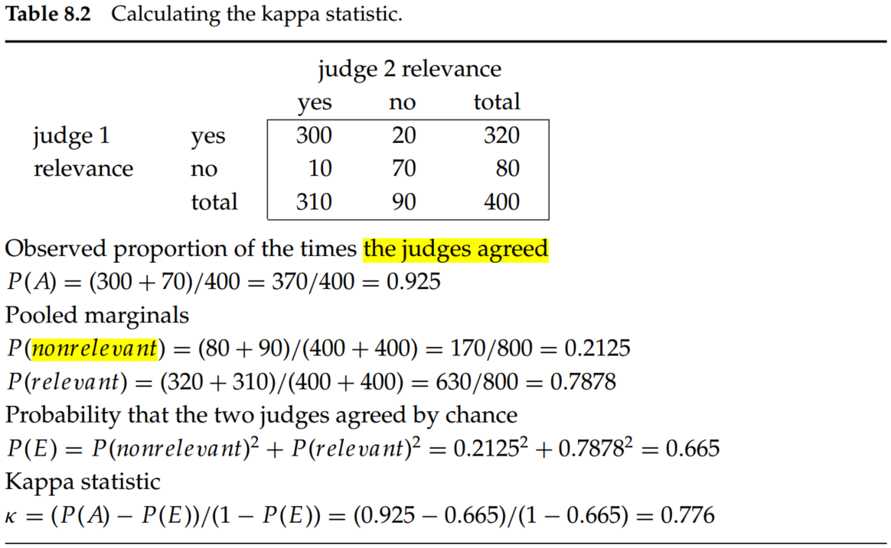

# Introduction to Information Retrieval (Chapter 8 Evaluation in information retrieval)

## 1. Standard test collections

Here is a list of the most standard test collections and evaluation,

- *Text Retrieval Conference (TREC).* There have been many tracks over a range of different test collections in TREC, but the best-known test collections are the ones used for the TREC Ad Hoc track during the first eight TREC evaluations between 1992 and 1999. In total, these test collections comprise six CDs containing 1.89 million documents (mainly, but not exclusively, newswire articles) and relevance judgments for 450 information needs, which are called topics and specified in detailed text passages. TRECs 6 through 8 provide 150 information needs over about 528,000 newswire and Foreign Broadcast Information Service articles. This is probably the best subcollection to use in future work because it is the largest, and the topics are more consistent. 
- *GOV2.* GOV2 is now the largest Web collection easily available for research purposes. 
- *NII Test Collections for IR Systems (NTCIR).* The NTCIR project has built various test collections of similar sizes to the TREC collections, focusing on East Asian language and cross-language information retrieval, where queries are made in one language over a document collection containing documents in one or more other languages.
- *Reuters-21578 and Reuters-RCV1.* For text classification, the most used test collection has been the Reuters-21578 collection of 21,578 newswire articles. More recently, Reuters released the much larger Reuters Corpus Volume 1 (RCV1), consisting of 806,791 documents.

## 2. Evaluation of unranked retrieval sets

$$
Precision=\frac{tp}{tp+fp}\\
Recall=\frac{tp}{tp+fn}\\
Accuracy=\frac{tp+tn}{tp+fp+fn+tn}\tag{1}
$$

where, tp, fp, fn, tn are true positives, false positives, false negatives, true negatives, respectively.

A single measure that trades off precision versus recall is the F measure, which is the weighted harmonic mean of precision $P$ and recall $R$:

$$
F=\frac{1}{\alpha \frac{1}{P}+(1-\alpha)\frac{1}{R}}=\frac{(\beta ^2+1)PR}{\beta ^2P+R}, \; where\; \beta ^2=\frac{1-\alpha}{\alpha}\tag{2}
$$

where $\alpha \in [0, 1]$ and thus $\beta ^2 \in [0, \inf]$. The default balanced F measure equally weights precision and recall, which means making $\alpha = 1/2$ or $\beta = 1$. It is commonly written as $F_1$,

$$
F_1=\frac{2PR}{P+R}\tag{3}
$$

Values of $\beta < 1$ emphasize precision, whereas values of $\beta > 1$ emphasize recall. Why do we use a harmonic mean rather than the simpler average (arithmetic mean)? The harmonic mean is always less than or equal to the arithmetic mean and the geometric mean. When the values of two numbers differ greatly, the harmonic mean is closer to their minimum than to their arithmetic mean. 

## 3. Evaluation of ranked retrieval results

(1) *Interpolated precision ($p_{interp}$)*. Defined as the highest precision found for any recall level $r' \geq r$:

$$
p_{interp}(r)=max_{r'\geq r}p(r')\tag{4}
$$

(2) *Mean average precision (MAP)*. If the set of relevant documents for information need $q_j\in Q$ is ${d_1,...,d_m}$ and $R_{ij}$ is the set of ranked retrieval results from the top result until you get to document $d_k$, then

$$
MAP(Q)=\frac{1}{|Q|}\sum_{j=1}^{|Q|}\frac{1}{m_j}\sum_{k=1}^{m_j}Precision(R_{jk})\tag{5}
$$

The average precision approximates the area under the uninterpolated precision-recall curve, and so the MAP is roughly the average area under the precision–recall curve for a set of queries.

(3) *Precision at $k$*. Measuring precision at fixed low levels of retrieved results, such as $k$ documents. 

(4) *R-precision*. R-precision requires having a set of known relevant documents $Rel$, from which we calculate the precision of the top $Rel$ documents returned. 

(5) *ROC (receiver operating characteristics) curve*. A ROC curve plots the true positive rate or sensitivity against the false-positive rate or (1 − specificity). Here, sensitivity is just another term for recall. The false-positive rate is given by $fp/(fp + tn)$. 

(6) *NDCG (normalized discounted cumulative gain)*. It is evaluated over some number k of top search results. Let $R(j, d)$ be the relevance score assessors gave to document $d$ for query $j$. Then,

$$
NDCG(Q, k)=\frac{1}{|Q|}\sum_{j=1}^{|Q|}Z_k\sum_{m=1}^k\frac{2^{R(j,m)}-1}{log(1+m)}\tag{6}
$$

where $Z_k$ is a normalization factor calculated to make it so that a perfect ranking’s NDCG at $k$ is 1.

## 4. Evaluation of ranked retrieval results

In the social sciences, a common measure for agreement between judges is the kappa statistic. It is designed for categorical judgments and corrects a simple agreement rate for the rate of chance agreement.

$$
kappa=\frac{P(A)-P(E)}{1-P(E)}\tag{7}
$$

where $P(A)$ is the proportion of the times, the judges agreed, and $P(E)$ is the proportion of the times they would be expected to agree by chance. 

The calculations are shown in Table 8.2. The kappa value is 1 if two judges always agree, 0 if they agree only at the rate given by chance, and negative if they are worse than random.

If there are more than two judges, it is normal to calculate an average pairwise kappa value. As a rule of thumb, a kappa value above 0.8 is taken as good agreement, a kappa value between 0.67 and 0.8 is taken as fair agreement, and agreement below 0.67 is seen as data providing a dubious basis for an evaluation, although the precise cutoffs depend on the purposes for which the data will be used.

## 5. Assessing relevance

*Marginal relevance.* Whether a document still has distinctive usefulness after the user has looked at certain other documents (Carbonell and Goldstein 1998). Even if a document is highly relevant, its information can be completely redundant with other documents that have already been examined. Thus, the marginal relevance may not very high. Maximizing marginal relevance requires returning documents that exhibit diversity and novelty.

## 6. Conclusion
- The key utility measure is user happiness. Speed of response and the size of the index are factors in user happiness. It seems reasonable to assume that the relevance of results is the most important factor: blindingly fast, useless answers do not make a user happy. However, user perceptions do not always coincide with system designers’ notions of quality. For example, user happiness commonly depends very strongly on user interface design issues, including the layout, clarity, and responsiveness of the user interface, which are independent of the quality of the results returned.
- The test document collection and suite of information needs have to be of a reasonable size: As a rule of thumb, fifty information needs have usually been found to be a sufficient minimum.
- Accuracy is not an appropriate measure for IR problems since the data are extremely skewed; normally, over 99.9% of the documents are in the nonrelevant category.
- For F measure, values of $\beta < 1$ emphasize precision, whereas values of $\beta > 1$ emphasize recall. 
- Why do we use a harmonic mean rather than the simpler average (arithmetic mean)? The harmonic mean is always less than or equal to the arithmetic mean and the geometric mean. When the values of two numbers differ greatly, the harmonic mean is closer to their minimum than to their arithmetic mean.
- MAP has been shown to have especially good discrimination and stability. 
- Precision at $k$ is the least stable of the commonly used evaluation measures, and that it does not average well because the total number of relevant documents for a query has a strong influence on precision at $k$.
- An ROC curve always goes from the bottom left to the top right of the graph. For a good system, the graph climbs steeply on the left side. 
- At the break-even point: F1 = P = R.
- Maximizing marginal relevance requires returning documents that exhibit diversity and novelty.
- The simplest form of summary takes the first two sentences or fifty words of a document or extracts particular zones of a document, such as a title and an author. 
- In sophisticated NLP approaches, the system synthesizes sentences for a summary, either by doing full-text generation or by editing and perhaps combining sentences used in the document. The last class of methods remains in the realm of research and is seldom used for search results: It is easier, safer, and often even better to just use sentences from the original document.
- Generating snippets must be fast because the system is typically generating many snippets for each query that it handles. Rather than caching an entire document, it is common to cache only a generous but fixed-size prefix of the document, such as perhaps 10,000 characters. 
- Aslam and Yilmaz (2005) examine R-precision surprisingly close correlation to MAP, which had been noted in earlier studies (Tague-Sutcliffe and Blustein 1995; Buckley and Voorhees 2000).
- NDCG is best for evaluating document ranking.
