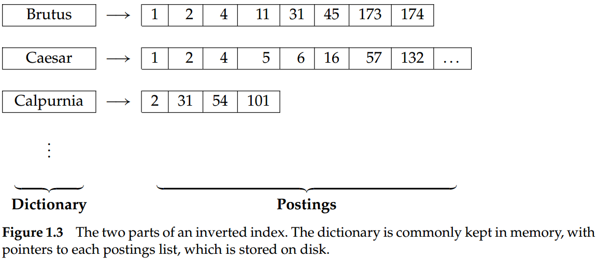
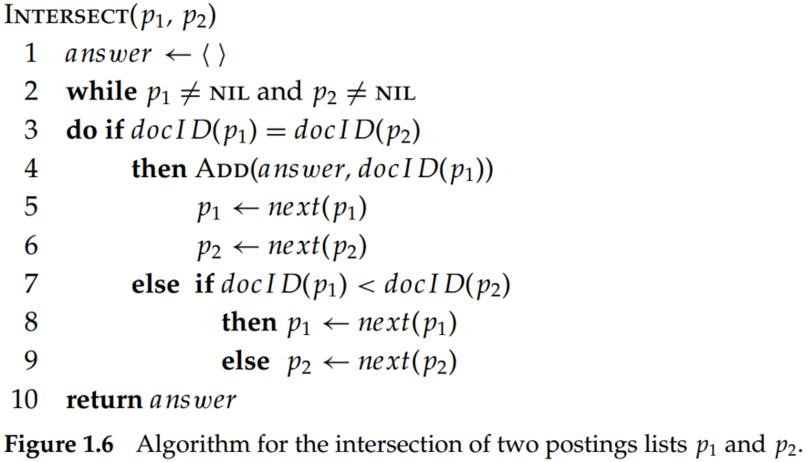

# Introduction to Information Retrieval (Chapter 1 Boolean Retrieval)

## 1. A brief introduction to Information Retrieval

### 1.1 The history and definition of Information Retrieval

The practical pursuit of computerized information retrieval began in the late 1940s (Cleverdon 1991; Liddy 2005), and the term information retrieval was coined by Calvin Mooers in 1948/1950 (Mooers 1950). As an academic field of study, information retrieval might be defined thus:

> Information retrieval (IR) is finding material (usually documents) of an unstructured nature (usually text) that satisfies an information need from within large collections (usually stored on computers). (Introduction to information retrieval, 2008)

Based on the above definition, information retrieval can be regarded as an action that is selecting and filtering satisfied information from large collections. Besides, the IR may have the following characteristics:

- "large collections": it means the information overload problem is serious;
- "unstructured": it means the information, such as text, picture, radio, video, and multi-modal, is unfriendly for a computer to process; 

### 1.2 The relevant research and application scenarios

The relevant research or technologies of IR also included text clustering, classification, and so on. Based on the scale of the system, the main application scenarios of IR include web search; enterprise, institutional, and domain-specific search; and personal information retrieval. 

### 1.3 The main focuses of IR

For web-scale information retrieval, there are several key points we have to focus on:

- The speed of IR. As for large-scale information retrieval, the speed of the process is essential.
- Matching operations. More flexible matching operations are needed to meet various and complex search requirements.
- Ranking accuracy. Highly ranking accuracy is a necessary condition of the excellent IR system.  

## 2. Inverted Index

### 2.1 Incidence Matrix

Consider, we want to retrieve 'Brutus and Caesar and not Calpurnia' from Shakespeare's Collected Works, a binary term-document incidence matrix could be applied for text representation:

|  | Antony and Cleopa tra | Julius Caesar | The Tempest | Hamlet | Othello | Macbeth | ... |
| --- | --- | --- | --- | --- | --- | --- | --- |
| Antonty | 1 | 1 | 0 | 0 | 0 | 1 |
| Brutus | 1 | 1 | 0 | 1 | 0 | 0 |
| Caesar | 1 | 1 | 0 | 1 | 1 | 1 |
| Calpurnia | 0 | 1 | 0 | 0 | 0 | 0 |
| mercy | 1 | 0 | 1 | 1 | 1 | 1 |  
| worser | 1 | 0 | 1 | 1 | 1 | 0 |
| ... |  |  |  |  |  |  |  

Hence, the vector of Brutus $AND$ Caesar $AND NOT$ Calpurnia are 110100, 110111, 101111, respectively. We can retrieval this query by bitwise $AND$ operation: 

$$
110100 \; and \;  110111 \;  and \; 101111 = 100100
$$

The answers for this query are thus Antony and Cleopatra, and Hamlet.

### 2.2 Inverted index

Suppose we have 1 million documents, and those documents involve about 500K distinct terms. Thus, the incidence matrix is ​​500K $\times$ 1M, and almost 90% of elements are zero. To alleviate the problem of matrix sparseness, the inverted index was proposed.

> Inverted index: an index always maps index back from terms to the parts of a document where they occur.

Based on the inverted index, the memory space can be reduced dramatically. There are some conclusions for inverted index storage that should be thought carefully:

-The dictionary is commonly kept in memory, and postings lists are normally kept on disk.
-A fixed-length array would be wasteful; some words occur in many documents and others in very few.
-For an in-memory postings list, two good alternatives are singly linked lists or variable-length arrays.
-Singly-linked lists allow cheap insertion of documents into postings lists (following updates, such as when recrawling the web for updated documents) and naturally extend to more advanced indexing strategies such as skip lists, which require additional pointers.
-Variable-length arrays win in space requirements by avoiding the overhead for pointers and in time requirements because their use of contiguous memory increases speed on modern processors with memory caches.
-If updates are relatively infrequent, variable-length arrays are more compact and faster to traverse.

We want to answer the query: "Brutus and Calpurnia" based on the inverted index, the intersection operation could be applied:

Suppose the lengths of the postings lists are $x$ and $y$ (postings lists should be sorted by a single global ordering), the intersection operation could be accomplished by scanning the lists only once. Thus, the intersection takes $O(x + y)$ operations. In addition, the operations of $NOT AND$ operation is also $O(x + y)$, and the intersection time is linear in the number of documents and query terms.

In the case of $AND$ operator, the complexity of merging the postings list depends on the length of the shorter postings list. Therefore, the more short, the smaller postings list, the lesser the time spent. Generally speaking, we could first consider $and$ operation to shorten the length of candidates, then consider the $or$ operation for Boolean retrieval. And there is a trade-off between $and$ and $or$ operation for information retrieval, since the $and$ may increase the accuracy of results while impairing the recall, vise versa.

Indeed, Boolean queries do not show more effectiveness for professional searchers. Experimenting on a Westlaw subcollection, Turtle (1994) found that free text queries produced better results than Boolean queries prepared by Westlaw’s own reference librarians for the majority of the information needs in his experiments. 

## 3. Summary

- Information retrieval (IR) is finding material (usually documents) of an unstructured nature (usually text) that satisfies an information need from within large collections (usually stored on computers). 
-  The main application scenarios of IR include web search; enterprise, institutional, and domain-specific search; and personal information retrieval.
- The speed of IR, Matching operations, and Ranking accuracy are the main focuses of web-scale information retrieval.
- Incidence Matrix is an intuitive method for information retrieval, and the bitwise operation can be applied for a query search. But the matrix is high-dimensional and sparse.
- Inverted index: an index always maps index back from terms to the parts of a document where they occur.
- Suppose the lengths of the postings lists are $x$ and $y$ (postings lists should be sorted by a single global ordering), the intersection operation could be accomplished by scanning the lists only once. Thus, the $and$ and $not \; and$ operations take $O(x + y)$ operations, and the intersection time is linear in the number of documents and query terms.
- In the case of $AND$ operator, the complexity of merging the postings list depends on the length of the shorter postings list. Therefore, the more short the smaller postings list, the lesser the time spent.
- There is a trade-off between $AND$ and $OR$ operation for information retrieval since the $AND$ may increase the accuracy of results while impairing the recall, vise versa.
