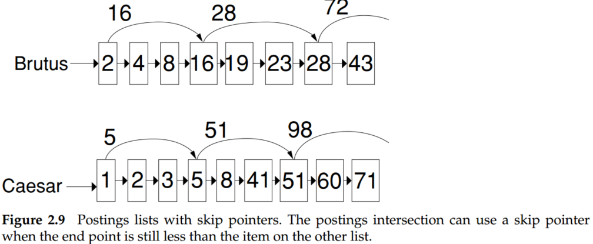
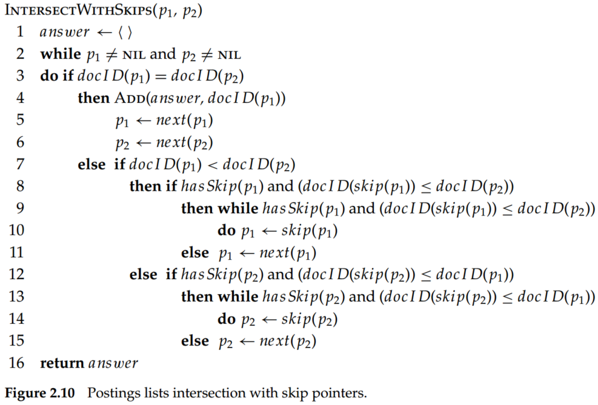

# Introduction to Information Retrieval (Chapter 2 The term vocabulary and postings lists)

## 1. Determining the vocabulary of terms

- **Step 1. Tokenization** In English, there is whitespace for tokenization, while for Chinese, it may difficult for word segmentation. N-gram model, vocabulary match, and machine learning methods, such as HMM, CRF++, CRF-BiLSTM, were applied for word segmentation. OOB (out-of-bag) and ambiguity are the main challenges for word segmentation.
- **Step 2. Dropping common terms: stop words** Stop words are basically a set of commonly used but do not have any specific meaning words. We could filter those words and improve the precision of the IR system.
- **Step 3. Normalization** Token normalization is the process of canonicalizing tokens so that matches occur despite superficial differences in the character sequences of the tokens.
    - **Accents and diacritics.**  clich´ e $\rightarrow$ cliche. 
    - **Capitalization/case-folding** CAT $\rightarrow$ cat.
    - **Others** ne’er $\rightarrow$ never, colour $\rightarrow$ color, 3/12/91 $\rightarrow$ Mar. 12, 1991
- **Step 4. Stemming and lemmatization** The goal of both stemming and lemmatization is to reduce inflectional forms and sometimes derivationally related forms of a word to a common base form. 
    - **Stemming** Stemming usually refers to a crude heuristic process that chops off the ends of words in the hope of achieving this goal correctly most of the time and often includes the removal of derivational affixes.
    - **Lemmatization**  Lemmatization usually refers to doing things properly with the use of a vocabulary and morphological analysis of words, normally aiming to remove inflectional endings only and to return the base or dictionary form of a word, which is known as the lemma. 

## 2. Faster postings list intersection via skip pointers

In chapter 1. we can realize $and$ operation via intersect algorithm, suppose the list lengths are $m$ and $n$, then the operations are $O(m + n)$. Skip list may be an effective strategy for list intersection.

Suppose we have to merge the above two lists, and we have already matched index 8 on each list. Then we advance both pointers, respectively, giving us 16 on the upper list and 41 on the lower list. Apparently, 16 < 41, so the pointer of the first list skip to 28, while 28 still less than 41, keep on, the pointer move to 43. 43 > 41, so the pointer will move to 41. The pseudocode of the skip list is as below.

There is a trade-off between spaced skip and comparisons to skip pointers. More skips means shorter skip spans, and that we are more likely to skip. But it also means lots of comparisons to skip pointers, and lots of space storing skip pointers. Fewer skips means few pointer comparisons, but then long skip spans, which means that there will be fewer opportunities to skip. A simple heuristic for placing skips, which has been found to work well in practice, is that for a postings list of length $P$, use $\sqrt P$ evenly spaced skip pointers.

## 3. Summary

- There is a trade-off for basic/minimum unit design. If the units get too small, we are likely to miss important passages because terms were distributed over several mini-documents, whereas if units are too large, we tend to get spurious matches, and the relevant information is hard for the user to find. Consequently, it is also the dilemma between precision and recall.
- The index granularity is also significant for the IR system. The person who is deploying the system must have a good understanding of the document collection, the users, and their likely information needs and usage patterns. 
- In Chinese, most words are short (the commonest length is two characters).
- The general strategy for determining a stop list is to sort the terms by collection frequency (the total number of times each term appears in the document collection) and then to take the most frequent terms, often hand-filtered for their semantic content relative to the domain of the documents being indexed, as a stop list, the members of which are then discarded during indexing. 
- For keywords search, stop words may be useless, while this is not true for phrase searches.
- Web search engines generally do not use stop lists.
- The most common algorithm for stemming English, and one that has repeatedly been shown to be empirically very effective, is [Porter’s algorithm](www.tartarus.org/˜martin/PorterStemmer/) (Porter 1980). 
- Doing full morphological analysis produces at most very modest benefits for retrieval.
- Although normalization helps a lot for some queries, it equally hurts performance a lot for others.
- Stemming increases recall while harming precision. 
- There is a trade-off between spaced skip and comparisons to skip pointers. More skips mean shorter skip spans and that we are more likely to skip. But it also means lots of comparisons to skip pointers and lots of space storing skip pointers. Fewer skips mean few pointer comparisons, but then long skip spans, which means that there will be fewer opportunities to skip. A simple heuristic for placing skips, which has been found to work well in practice, is that for a postings list of length $P$, use $\sqrt P$ evenly spaced skip pointers.
-  Character bigram indexes are perhaps the most standard approach to indexing Chinese, although some systems use word segmentation. 
- Due to differences in the language and writing system, word segmentation is most usual for Japanese (Luk and Kwok 2002; Kishida et al. 2005). 
- Diacritic removal gains up to 23% (being especially helpful for Finnish, French, and Swedish). 
- Stemming helped markedly for Finnish (30% improvement) and Spanish (10% improvement), but for most languages, including English, the gain from stemming was in the range 0–5%, and results from a lemmatizer were poorer still. Compound splitting gained 25% for Swedish and 15% for German, but only 4% for Dutch.
- Rather than language-particular methods, indexing character k-grams (as we suggested for Chinese) could often give as good or better results: using within-word character four-grams rather than words gave gains of 37% in Finnish, 27% in Swedish, and 20% in German, while even being slightly positive for other languages, such as Dutch, Spanish, and English. Tomlinson (2003) presents broadly similar results.
- Good queries to include in the phrase index are ones known to be common based on recent querying behavior. 
- Uses indexes of biword and positional sorts as well as a partial next word index as a halfway house between the first two strategies. Such a strategy allows a typical mixture of web phrase queries to be completed in one-quarter of the time taken by use of a positional index alone while taking up 26% more space than the use of a positional index alone.
- Suppose the total number of tokens in the document collection $T$, the complexity of a Boolean query is $O(T)$.
- As for large documents, the required space to store the positional posting is two orders of magnitude to store the postings list. 
