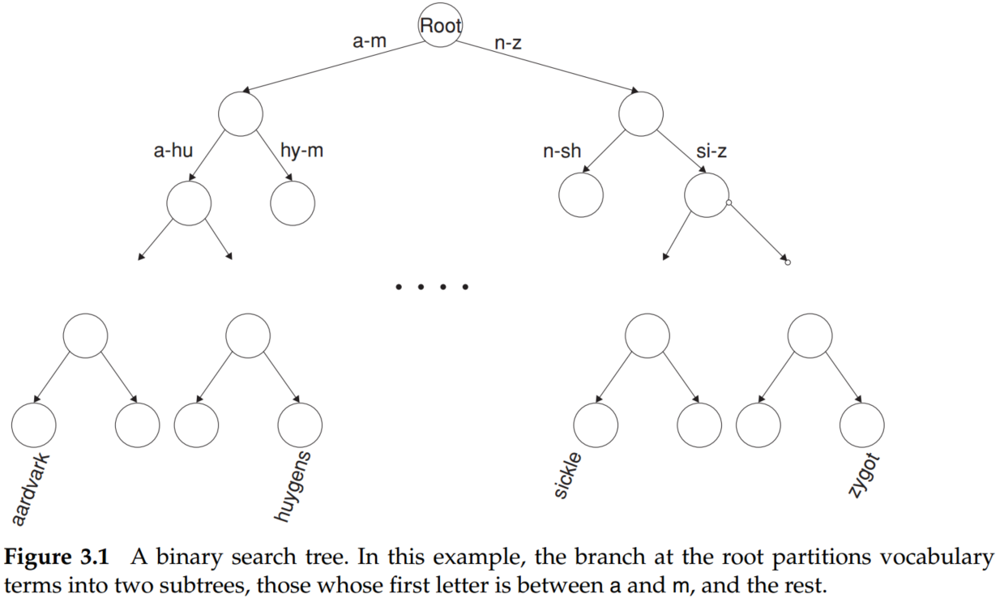
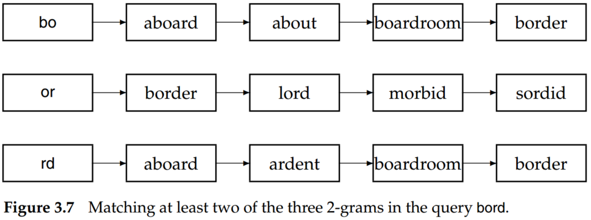

# Introduction to Information Retrieval (Chapter 3 Dictionaries and tolerant retrieval)

## 1. Search structures for dictionaries

In general, there are two common ways for vocabulary lookup operation, that is hashing and search trees. 

For hashing, it is difficult to find minor variants of a query term because these could be hashed to very different integers. Besides, we cannot seek (for instance) all terms beginning with the prefix, like auto-. Finally, in a setting (such as the Web), where the size of the vocabulary keeps growing, a hash function designed for current needs may not suffice in a few years’ time.

The binary search tree likes below,

For a balanced tree, the number of comparisons is $O(log M)$. Hence, the principal issue of the search tree is that of rebalancing; as terms are inserted into or deleted from the binary search tree, it needs to be rebalanced so that the balance property is maintained. To mitigate rebalancing, one approach is to allow the number of subtrees under an internal node to vary in a fixed interval.

## 2. Implementing spelling correction

There are two specific forms of spelling correction that is isolated-term correction and context-sensitive correction.

Isolated-term correction: to correct a single query term at a time and each term in the query is correctly spelled in isolation. E.g., query *flew form Heathrow*, each word is correct, but *form* should correct to *from*. 

The edit distance, such as Levenshtein distance and k-gram overlap strategies, can be applied for isolated-term correction. 
- Based on distance edit to check and correct the spelling problem may be inordinately expensive, attribute to the size of the set. A sophisticated method is to use a version of the permuterm index, in which we omit the end-of-word symbol $ and the suffix of characters before performing the B-tree traversal.
- The k-grams attempt to retrieve vocabulary terms that have many k-grams in common with the query.

For instance, the query is *bord*, the bigrams of *bord* are *bo, or, rd*. 

Suppose we wanted to retrieve vocabulary terms that contained at least two of these three bigrams. In the example of Figure 3.7, we would enumerate aboard, boardroom, and border.

The process of k-Gram indexes for spelling correction like below:

- Step 1. Cut off the query and create k-grams;
- Step 2. Based on the k-grams index to retrieve vocabulary terms;
- Step 3. Calculate Jaccard coefficient and filter the results;

We could replace the Jaccard coefficient with other measures that allow efficient on-the-fly computation during postings scans. One method that has some empirical support is to first use the k-gram index to enumerate a set of candidate vocabulary terms that are potential corrections of $q$. We then compute the edit distance from $q$ to each term in this set, selecting terms from the set with a small edit distance to $q$.

## 3. Summary

- The vocabulary lookup operation uses a classical data structure called the dictionary and has two broad classes of solutions: hashing and search trees. 
- There are some issues for search engines that apply hashing for dictionary lookup: 1. It is difficult to find minor variants of a query term because these could be hashed to very different integers; 2. We cannot seek (for instance) all terms beginning with the prefix, like auto-; 3. In a setting (such as the Web), where the size of the vocabulary keeps growing, a hash function designed for current needs may not suffice in a few years’ time.
- For a balanced tree, the number of comparisons is $O(log M)$. Hence, the principal issue of the search tree is that of rebalancing; as terms are inserted into or deleted from the binary search tree, it needs to be rebalanced so that the balance property is maintained.  
- When applying binary-tree for search engine, unlike hashing search, the document collection must be organized by some prescribed orders, like the alphabet.  
- Using a regular B-tree together with a reverse B-tree, we can handle wildcard queries that contain a single * symbol.
- Two principles for spelling correction: 1. Of various alternative correct spellings for a misspelled query, choose the “nearest” one; 2. The algorithm should choose the more common word as the correction.
- There are two specific forms of spelling correction that is isolated-term correction and context-sensitive correction.
- Isolated-term correction: to correct a single query term at a time, and each term in the query is correctly spelled in isolation. E.g., query *flew form Heathrow*, each word is correct, but *form* should correct to *from*.
- Edit distance and k-gram overlap are two common methods for isolated-term correction.
- Spelling errors do not occur in the first character of the query.
- Zobel and Dart (1995) proposed that k-gram indexing is very effective for finding candidate mismatches but should be combined with a more fine-grained technique such as edit distance to determine the most likely misspellings.   
- Gusfield (1997) is a standard reference on string algorithms such as edit distance.
