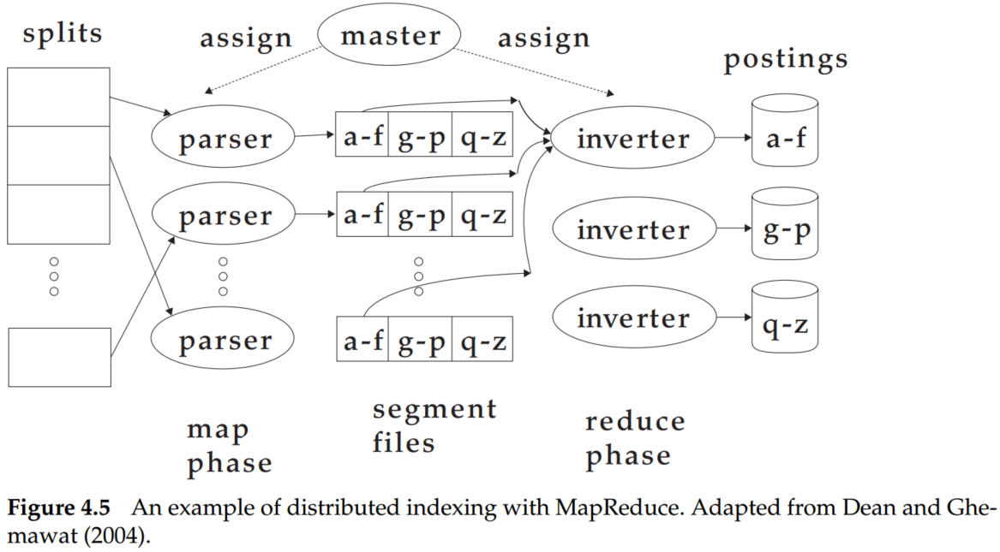
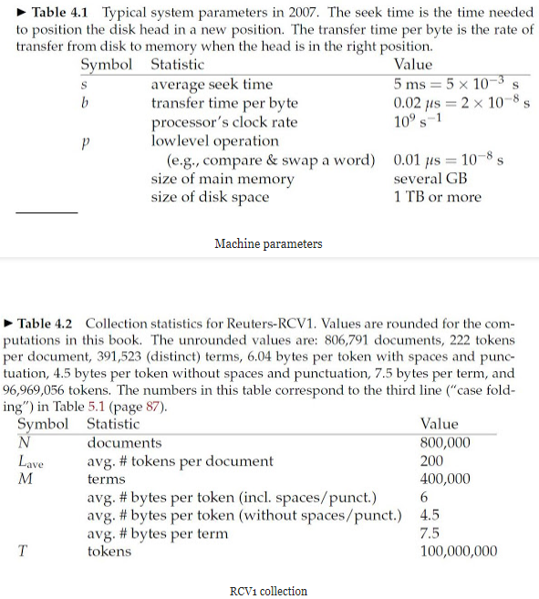

# Introduction to Information Retrieval (Chapter 4 Index construction)

## 1. Hardware basics

When building an information retrieval (IR) system, many decisions are based on the characteristics of the computer hardware on which the system runs. There is some basic knowledge about hardware:

- Access to data in memory is much faster than access to data on disk. It takes a few clock cycles (perhaps $5\times 10^{-9}$ seconds) to access a byte in memory, but much longer to transfer it from disk (about $2 \times 10^{−8}$ seconds). Therefore, the data which be accessed frequently should be store in memmory.
- When doing a disk read or write, it takes a while for the disk head to move to the part of the disk where the data are located. This time is called the seek time, and it averages 5 ms for typical disks. No data are being transferred during the seek. To maximize data transfer rates, chunks of data that will be read together should therefore be stored contiguously on disk.
- Operating systems generally read and write entire blocks. Thus, reading a single byte from disk can take as much time as reading the entire block. Block sizes of 8, 16, 32, and 64 kilobytes (KB) are common. We call the part of main memory where a block being read or written is stored a buffer.
- Data transfers from disk to memory are handled by the system bus, not by the processor. This means that the processor is available to process data during disk I/O. We can exploit this fact to speed up data transfers by storing compressed data on disk. 

## 2. Blocked sort-based indexing

As for large collections that require the use of secondary storage, the central requirement of an external sorting algorithm is that it minimizes the number of random disks seeks during sorting – sequential disk reads are far faster than seeks. The blocked sort-based indexing algorithm or BSBI is a solution.

BSBI (i) segments the collection into parts of equal size, (ii) sorts the termID–docID pairs of each part in memory, (iii) stores intermediate sorted results on disk, and (iv) merges all intermediate results into the final index.

The time complexity of BSBI is $O(TlogT)$ because the step with the highest time complexity is sorting, and $T$ is an upper bound for the number of items we must sort (i.e., the number of termID–docID pairs). But the actual indexing time is usually dominated by the time it takes to parse the documents (ParseNextBlock) and to do the final merge (MergeBlocks).

## 3. Single-pass in-memory indexing

Blocked sort-based indexing has excellent scaling properties, but it needs a data structure for mapping terms to termIDs. For very large collections, this data structure does not fit into memory. A more scalable alternative is single-pass in-memory indexing or SPIMI. SPIMI uses terms instead of termIDs, writes each block’s dictionary to disk, and then starts a new dictionary for the next block. SPIMI can index collections of any size as long as there is enough disk space available.

There are two advantages: It is faster because there is no sorting required, and it saves memory because we keep track of the term a postings list belongs to, so the termIDs of postings need not be stored.

The time complexity of SPIMI is $O(T)$ because no sorting of tokens is required, and all operations are at most linear in the size of the collection.

## 4. Distributed indexing 

Collections are often so large that we cannot perform index construction efficiently on a single machine. Web search engines, therefore, use distributed indexing algorithms for index construction. The distributed index construction method is an application of MapReduce, a general architecture for distributed computing. MapReduce is designed for large computer clusters. 

Overall, in the map phase, the collections were split into many parts. Parsing, BSBI, or SPIMI can be applied to each part. In reduce phase, the segments were combined together.

For n = 15 splits, r = 10 segments, and j = 3 term partitions, how long would distributed index creation take for Reuters-RCV1 in a MapReduce architecture? Base the assumptions about cluster machines on Table 4.1 and Table 4.2.

The time to create a distributed index based on MapReduce architecture for Reuters-RCV1 may include map process time and reduce process time. In terms of the map phase, the operation can be broken down into reading, sorting, and writing. And for the reduce phase, it also needs to read, sort, and write.

Based on table 4.2, the total number of documents of Reuters-RCV1 is 800,000. Since the documents were split into 15 parts, each split may have $\frac{800,000}{15}=53333$ documents.

Besides, each document may have 200 tokens, and each token takes 6 bytes. Thus, the size of each split is about: $53333\times 200\times 6 bytes = 63999600 bytes \approx 61 MB$.

**MAP phase:**

Total_time = read_time + sort_time + write_time

Based on table 4.1, the read time per byte is $2\times 10^{-3}s$. Thus the read time of split is $61\times 10^6 \times 2 \times 10^{-8}=1.28s$

Based on the BSBI algorithm, the complexity is $O(nlog_2n)$, denote $n$ as the token number. For split, the total number of tokens is $53333\times 200=10666600$. Besides, the time of compare & swap a word is $10^{-8}s$. Thus, the sort time is $ n log_2n \times 10^{-8}=2.49s$.

Based on table 4.2, each token take 4.5 bytes(without spaces/punct.), and write per byte may spend $2\times 10^{-8}s$. Hence, write a split may spend $10666600\times 4.5\times 2\times 10^{-8}s=0.96s$. 

Therefore, in MAP phase, realize the complete pipeline will spend read_time + sort_time + write_time=4.73s. According to the problem, the collection was split into 15 parts, but the segments are 10. So to parse 15 splits, the MAP operation has to be executed 2 times, and the total time in the MAP phase is $4.73\times 2=9.46s$.

**REDUCE phase:**

Because the term partitions are 3, and the number of tokens in Reuters-RCV1 is 100,000,000, thus each split will possess $100000000/3$ tokens, and the size of those tokens is $100000000/3*4.5 bytes=150000000 bytes$.

For reduce phase, the read, sort, and write operation are also required. Thus:

$Time\_reading=150000000 \times 2\times 10^{-8}=3s$

$Time\_soring=100000000/3 \times log_2(100000000/3)\times 10^{-8}s=8.33s$

$Time\_writing=150000000 \times 2\times 10^{-8}s=3s$

$Total\_Time\_REDUCE=Time\_reading+Time\_soring+Time\_writing=14.33s$

The total time of distributed index creation is $9.46s+14.33s=23.79s$.

## 5. Summary

- The design of indexing algorithms is governed by hardware constraints. 
- Blocked sort-based indexing, an efficient single-machine algorithm designed for static collections that can be viewed as a more scalable version of the basic sort-based indexing algorithm.
- Single-pass in-memory indexing, an algorithm that has even better scaling properties because it does not hold the vocabulary in memory.  
- For very large collections like the web, indexing has to be distributed over computer clusters with hundreds or thousands of machines.
- Collections with frequent changes require dynamic indexing so that changes in the collection are immediately reflected in the index.
- Access to data in memory is much faster than access to data on disk. It takes a few clock cycles (perhaps $5 \times 10^{−9}$ seconds) to access a byte in memory but much longer to transfer it from disk (about $2 \times 10^{−8}$ seconds). Therefore, the data which be accessed frequently should be store in memory.
- When doing a disk read or write, it takes a while for the disk head to move to the part of the disk where the data are located. This time is called the seek time, and it averages 5 ms for typical disks. No data are being transferred during the seek. To maximize data transfer rates, chunks of data that will be read together should therefore be stored contiguously on disk.
- Operating systems generally read and write entire blocks. Thus, reading a single byte from disk can take as much time as reading the entire block. Block sizes of 8, 16, 32, and 64 kilobytes (KB) are common. We call the part of main memory where a block being read or written is stored a buffer.
- Data transfers from disk to memory are handled by the system bus, not by the processor. This means that the processor is available to process data during disk I/O. We can exploit this fact to speed up data transfers by storing compressed data on disk. 
- The blocked sort-based indexing algorithm or BSBI includes four steps: (i) segments the collection into parts of equal size, (ii) sorts the termID–docID pairs of each part in memory, (iii) stores intermediate sorted results on disk, and (iv) merges all intermediate results into the final index.
- The time complexity of BSBI is $O(TlogT)$ because the step with the highest time complexity is sorting, and $T$ is an upper bound for the number of items we must sort (i.e., the number of termID–docID pairs). But the actual indexing time is usually dominated by the time it takes to parse the documents (ParseNextBlock) and to do the final merge (MergeBlocks).

## Reference

[Information retrieval exercise 4.3 from Introduction to Information Retrieval](http://dauka.blogspot.com/2012/04/information-retrieval-exercise.html)
