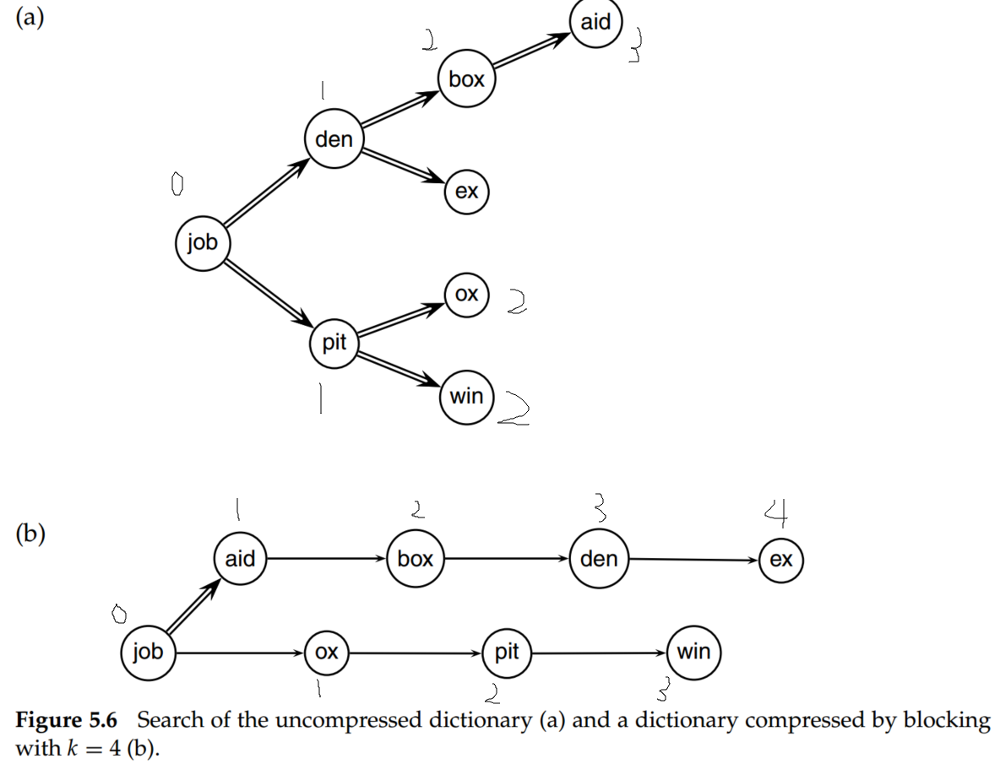
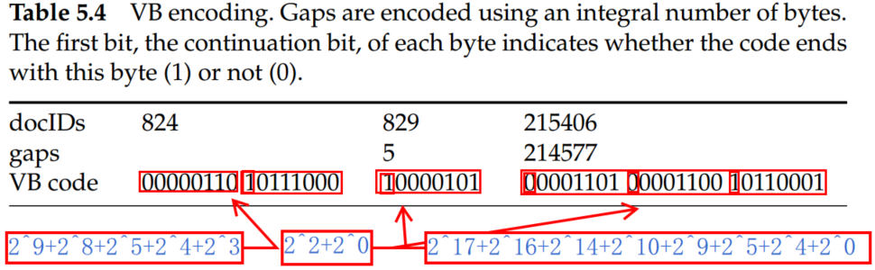

# Introduction to Information Retrieval (Chapter 5 Index compression)

There are three benefits for index compression:

- Disk space can be reduced considerably. Compression ratios of 1:4 are easy to achieve, potentially cutting the cost of storing the index by 75%.
- The response time of the IR system substantially. Because compared to expend a disk seek, compression can fit a lot more information into the main memory. The posting list can be decompressed, and the query can be entirely done in memory. Since the use of caching is increased, the response time of the IR system can be decreased substantially.
- Faster transfer of data from disk to memory. Efficient decompression algorithms run so fast on modern hardware that the total time of transferring a compressed chunk of data from disk and then decompressing it is usually less than transferring the same chunk of data in uncompressed form.

## 1. Statistical properties of terms in information retrieval

In general, the statistics in Table 5.1 show that preprocessing affects the size of the dictionary and the number of nonpositional postings significantly. 

Assuming one machine word per posting, what is the size of the uncompressed (nonpositional) index for different tokenizations based on Table 5.1?

According to the assumption - one machine word per posting - and table 4.2, the avg size of per posting is $4.5 bytes$. Thus, the size of unfiltered is $109,971,179\times 4.5 \approx 495 MB$, the size of no numbers is $495 - 495 \times 0.08 \approx 455MB$, the size of case folding is $495 - 495\times 0.12 \approx 436MB$, the size of 30 stop words is $495 - 495\times 0.24 \approx 376MB$, the size of 150 stop words is $495 - 495\times 0.39 \approx 302MB$, the size of stemming is $495 - 495\times 0.42 \approx 287MB$.

### 1.1 Heaps' law: Estimating the number of terms

Heaps' law, which is an effective method for getting a handle on vocabulary size, estimates vocabulary size as a function of collection size.

$$
M=kT^b \tag{1}
$$

where $T$ is the number of tokens in the collection, and $M$ is the vocabulary size. Typical values for the parameters $k$ and $b$ are: $30 ≤ k ≤ 100$ and $b ≈ 0.5$. For instance,  for the 1000020 tokens, Heaps' law predicts $44\times 1000020^{0.49}\approx 38323$ terms.

Overall, the parameter $k$ is quite variable because vocabulary growth depends a lot on the nature of the collection and how it is processed. Case-folding and stemming reduce the growth rate of the vocabulary, whereas including numbers and spelling errors increases it. From the Heaps' law, we could draw two conclusions:
- The dictionary size continues to increase with more documents in the collection, rather than a maximum vocabulary size being reached.
- The size of the dictionary is quite large for large collections.

### 1.2 Zipf's law: Modeling the distribution of terms

Zipf's law: A commonly used model of the distribution of terms in a collection. Zipf's told us the collection frequency $cf_i$ of the $i$th most common term is proportional to $1/i$:

$$
cf_i \propto \frac{1}{i} \tag{2}
$$

So if the most frequent term occurs $cf_1$ times, then the second most frequent term has half as many occurrences, the third most frequent term a third as many occurrences, and so on. 

## 2 Dictionary compression

### 2.1 Dictionary as a string

There is some data structure for the dictionary store:

- An array of fixed-width entries. Allocate 20 bytes for the term itself, 4 bytes for its document frequency, and 4 bytes for the pointer to its postings list. Thus, for Reuters-RCV1, we need $M \times (20 + 4 + 4) = 400,000 \times 28 = 11.2$ megabytes (MB) for storing the dictionary in this scheme. 
- Dictionary-as-a-string storage. As for fixed-width entries, the average length of a term in English is about eight characters, so on average, we are wasting twelve characters in the fixed-width scheme. In addition, the character length is more than twelve in few words. To overcome those shortcomings of fixed-width, we could sort the dictionary terms as one long string of characters and apply term pointers to locate terms, as shown in Figure 5.4.  

Because the average length of a term in English is about eight characters and the number of terms for Reuters-RCV1 is 400000, the term pointers resolve $400000 \times 8 = 3.2 \times 10^6$ positions. So the term pointers need to be $log_2 3.2 \times 106 \approx 22$ bits or 3 bytes long. 

For dictionary-as-a-string storage, we need $400000 \times (4 + 4 + 3 + 8) = 7.6$ MB for the Reuters-RCV1 dictionary: 4 bytes each for frequency and postings pointer, 3 bytes for the term pointer, and 8 bytes on average for the term. Compared to fixed-width (11.2MB), one-third space is saved.

- Blocked storage. Based on Dictionary-as-a-string, We can further compress the dictionary by grouping terms in the string into blocks of size $k$ and keeping a term pointer only for the first term of each block (Figure 5.5). In this scheme, the length of each term is needed for encoding, and some term pointers can be eliminated (Figure 5.5).

In Figure 5.5, the number 7, 9, 8, 11, 6 is the length of the character in this block.

By increasing the block size $k$, we get better compression. However, there is a tradeoff between compression and the speed of term lookup. Because, in the block inner, the binary search can not be supported.

As shown in Figure 5.6, for the uncompressed dictionary, the binary search can be applied. Thus, for the eight-term dictionary, the average steps are $ (0 + 1 + 2 + 3 + 2 + 1 + 2 + 2)/8 \approx 1.6$. For a dictionary compressed by blocking with $k = 4$, the average step is $(0 + 1 + 2 + 3 + 4 + 1 + 2 + 3)/8 = 2$.  

RCV1 dictionary compression summary:

| Technique | Size (MB) |
| --- | --- |
| Fixed width | 11.2 |
| Dictionary-as-String with pointers to every term | 7.6 |
| + blocking, k = 4 | 7.2 |
| + blocking + front coding | 5.9 |

## 3. Postings file compression

Reuters-RCV1 has 800000 documents, 200 tokens per document, six characters per token, and 100000000 postings. Thus, the size of the collection is about $800,000 \times 200 \times 6 bytes = 960 MB$. Document identifiers are $log_2 800000 \approx 20 bits = 20/8 bytes$. The size of the uncompressed postings file is $100000000 \times 20/8 = 250 MB$. 

In order to decrease the required bits per document representation, the gap can be applied (shown in Table 5.3).

As we can see, the gaps between postings are short, requiring a lot less space than 20 bits to store.

### 3.1 Variable byte codes

To encode small numbers in less space than large numbers, Variable byte (VB) encoding was proposed. VB encoding uses an integral number of bytes to encode a gap. In VB encoding, the first bit of the byte is a continuation bit. It is set to 1 for the last byte of the encoded gap and to 0 otherwise (Table 5.4). 

For VB encoding, 1 byte can represent the integer from 0 to $2^7$, 2 bytes can represent the integer from $2^7$ to $2^{14}$, and so on. 

To decode a variable byte code, we read a sequence of bytes with continuation bit 0 terminated by a byte with continuation bit 1 (include this byte). By setting the continuation bit (the boundary of encodings), we could parse the number from a sequence.

The VB encoding and decoding algorithm are illustrated below.

## $\gamma$ Codes

$\gamma$ code = <length code, offset code>

- unary code: Represent n as n 1s with a final 0. For example, $3=1110, 4=11110, 5=111110$;
- offset: is a natural number in binary, but with the leading 1 removed. For example, 2=0, (10 is the real binary but leading 1 is removed), 3=1, (11 is the real binary but leading 1 is removed), 4=00, (100 is the real binary but leading 1 is removed);
- length: encodes the length of offset in unary code. For example, if the offset is 0 or 1, the length of offset is 1, the unary code of 1 is 10. If offset is 00, the length of offset is 2, the unary code of 1 is 110;
- $\gamma$ code: the combination of length and offset. 

Via the offset code, we could determine the docID, and via the length, we could determine the boundary of each $\gamma$ code. The length of offset is $\lfloor log_2 G \rfloor$ bits and the length of length is $\lfloor log_2 G\rfloor + 1$ bits, so the length of the entire code is $2 \times \lfloor log2 G\rfloor + 1$ bits, where $G$ is the total number we have to encode, such as the gap. 

Therefore, encoding the $N/j$ gaps of size $j$ with $\gamma$ codes, the number of bits needed for the postings list of a term in the $j$th block is:

$$
bits-per-row=\frac{N}{j}\times (2\times \lfloor log_2j \rfloor +1)\approx \frac{2Nlog_2j}{j}\tag{3}
$$

According to Zipf's las, the collection frequency $cf_i$ is proportional to the inverse of the rank $i$. We can choose a different constant $c$ such that the fractions $c/i$ are relative frequencies and sum to 1.

$$
1=\sum_{i=1}^M \frac{c}{i}=c \sum_{i=1}^M \frac{1}{i}=cH_M\tag{4}
$$

Thus:

$$
c=\frac{1}{H_M}\approx \frac{1}{lnM}=\frac{1}{ln400000}\approx \frac{1}{13}\tag{5}
$$

Based on the properties of [Harmonic series](https://en.wikipedia.org/wiki/Harmonic_series_(mathematics)), the difference between the finite partial sums of the diverging harmonic series $Hn$ and $lnn$ ($\sum_{k=1}^n\frac{1}{k}-ln n$) converges to the Euler–Mascheroni constant. So $H_M\approx ln M$ (ignore the Mascheroni constant). For Reuters-RCV1 the number of distinct terms $M=400000$.

Thus the $i$th term has a relative frequency of roughly $1/(13i)$. Suppose the length of a document is $L$, the expected average number of occurrence of term $i$ is:

$$
L\frac{c}{i}\approx \frac{200\times \frac{1}{13}}{i}\approx \frac{15}{i}\tag{6}
$$

For $\gamma$ encoding, we could define the size of block as $Lc$. Based on formula (3), to encode the entire block, we need $(Lc)(2Nlog_2j)/j$ bits. And for Reuters-RCV1, there are $M/(Lc)$  blocks, so the posting sfile as a whole will take up:

$$
\sum_{j=1}^{\frac{M}{Lc}}\frac{2NLclog_2j}{j}\tag{7}
$$

For Reuters-RCV1, $\frac{M}{Lc}\approx 400000/15\approx 27000$ and $\sum_{j=1}^{27000}\frac{2\times 10^6\times 15log2j}{j}\approx 224MB$.

For other encoding methods, we just change the length of the entire code ($2\times\lfloor log_2j\rfloor + 1$) in formula (3) to estimate the size of the compressed inverted index.

The compression ratio for the index in Table 5.6 is about 25%: 400 MB (uncompressed, each posting stored as a 32-bit word) versus 101 MB ($\gamma$) and 116 MB (VB). 

$\gamma$ Codes achieve great compression ratios – about 15% better than variable byte codes for Reuters-RCV1. But they are expensive to decode. 

## Summary

- Compression ratios of 1:4 are easy to achieve, potentially cutting the cost of storing the index by 75%.
- If the main goal of compression is to conserve disk space, then the speed of compression algorithms is of no concern. But for improved cache utilization and faster disk-to-memory transfer, decompression speeds must be high.
- Heaps' law estimates vocabulary size as a function of collection size. $M=kT^b$, where $T$ is the number of tokens in the collection, and $M$ is the vocabulary size. 
- Zipf's law: A commonly used model of the distribution of terms in a collection. $cf_i \propto \frac{1}{i}$.
- For most IR systems, variable byte codes offer an excellent tradeoff between time and space.
- Variable byte codes process queries two times faster than either bit-level compressed indexes or uncompressed indexes with a 30% penalty in compression ratio compared with the best bit-level compression method (Scholer et al. 2002). 
- Compressed indexes can be superior to uncompressed indexes not only in disk usage but also in query processing speed (Scholer et al. 2002).
- Compared with VB codes, "variable nibble" codes showed 5% to 10% better compression and up to one-third worse effectiveness in one experiment (Anh and Moffat 2005).
- Trotman (2003) also recommends using VB codes unless disk space is at a premium. 
- Zhang et al. (2007) investigate the increased effectiveness of caching when a number of different compression techniques for postings lists are used on modern hardware.
- $\delta$ codes and $\gamma$ codes were introduced by Elias (1975), who proved that both codes are universal.
- $\delta$ codes perform better than $\gamma$ codes if large numbers (greater than 15) dominate. 
- Using parameterized codes for index compression, codes that explicitly model the probability distribution of gaps for each term. For example, they show that Golomb codes achieve better compression ratios than $\gamma$ codes for large collections (Witten et al., 1999).
- The distribution of gaps in a postings list depends on the assignment of docIDs to documents.
- Assigning docIDs in a small range to documents in a cluster where a cluster can consist of all documents in a given time period, on a particular website, or sharing another property. As a result, when a sequence of documents from a cluster occurs in a postings list, their gaps are small and can be more effectively compressed.
- Document compression can also be important in an efficient information retrieval system.
