# Knowledege Graph

## 1. Information

&emsp;&emsp;知识图谱（Knowledge Graph）主要是用于描述现实世界中的实体（区别于概念，是指客观世界中的具体实物，如张三，李四等）、概念（人们在认识世界过程中形成的对客观事物的概念化表示，如人、动物等）及事件间的客观关系。知识图谱的构建过程即从非结构化数据（图像等）或半结构化数据（网页等）中抽取信息，构建结构化数据（三元组，实体-属性-关系）的过程。最早知识图谱的技术由Google于2012年提出，并利用该项技术增强其搜索服务。知识图谱给互联网语义搜索带来了活力，同时其也在问答系统中展现出了强大的能力，目前所说的基于知识库的搜索、推荐与问答均是指基于知识图谱，该项技术已经与深度学习、大数据一起作为互联网智能的基础技术，已经成为推动人工智能发展的核心驱动力。

&emsp;&emsp;知识图谱是认知计算、知识表示与推理、信息检索与抽取、自然语言处理与语义Web、数据挖掘与机器学习等领域的交叉研究。特别是随着互联网、物联网技术的飞速发展、5G时代的逐渐到来，数据规模将成爆炸式增长，如何从海量的数据中挖掘有效的信息，将数据转化为知识，以促进信息处理技术从信息服务向知识服务转变，更好的服务于具体的行业领域，知识图谱技术重要的应用价值和具体的现实意义以日益凸显。

&emsp;&emsp;知识图谱是一项综合性的复杂技术，其主要关注于知识的表示、知识图谱的构建以及应用这三个方面的研究内容。其中知识的表示即是指三元组，知识图谱的构建则主要涉及信息抽取的相关技术。

 
图1. YAGO2知识图谱

&emsp;&emsp;上图为YAGO2搜索Max Planck所产生的知识图谱（YAGO源与Wikipedia WordNet和GeoNames所构建的巨大语义知识库，其包括10万个实体，如人物、组织、机构等）。上图中的结点（Nodes）即为概念（Country）、实体（Max Plank）、属性（birth）等，边（edge）则表示关系，如means、location in等。知识图谱的发展历程如下：

 
图2. 知识图谱发展历程

&emsp;&emsp;如上图，知识图谱相关技术的发展在上世纪就已经开始，最早的知识图谱主要是根据规则和专家知识手工构建知识库，如Cyc、WordNet等。随着互联网技术的诞生，基于链接数据的开放域知识库的构建工作开始出现，如Wikipedia、DBpedia等。随着深度学习的复兴以及互联网的蓬勃发展，大型互联网公司也基于自己的业务分别建立了自己行业的知识图谱，如Google致力于搜索、FaceBook致力于社交、Alibaba致力于购物等等。

&emsp;&emsp;在上述的一些知识图谱中主要分为两类，一种为常识知识图谱（Common Sensn），这类图谱连接，如WordNet、NELL等。另一种则是百科全书知识图谱（Encyclopedia），而这类知识图谱则更多的强调实体，即客观事物，如Yago、Freepase等。

## 2. 信息抽取（Information Extracrtion，IE）

&emsp;&emsp;信息抽取，顾名思义抽取的是信息，那什么是信息呢？什么又是数据、知识呢？数据可以简单的理解为一种符号，其表示形式主要包括有文字、图表、语音等等，而信息则是数据所承载或表达的内容，而知识则又是对信息的整合与抽象。信息抽取是知识图谱构建的基础和前驱，其主要的研究内容包括：

- 实体识别。主要是命名识别，即专有名词及相关的标识（类），如：人名、地名、机构名等。
- 实体同指。识别不同表示的实体表示，如：缩略语、简称及指代性表示（代词、有定表示等）。
- 关系识别。识别实体间的关系，主要包括：实体间是否存在关系以及具体哪种关系的判断。
- 事件识别。将文本（主要指新闻类文本）中事件结构化（与事件的场景、主题有密切联系）。如：时间、地点、参与者、结果/现状等。

 
图3. 信息抽取示意图

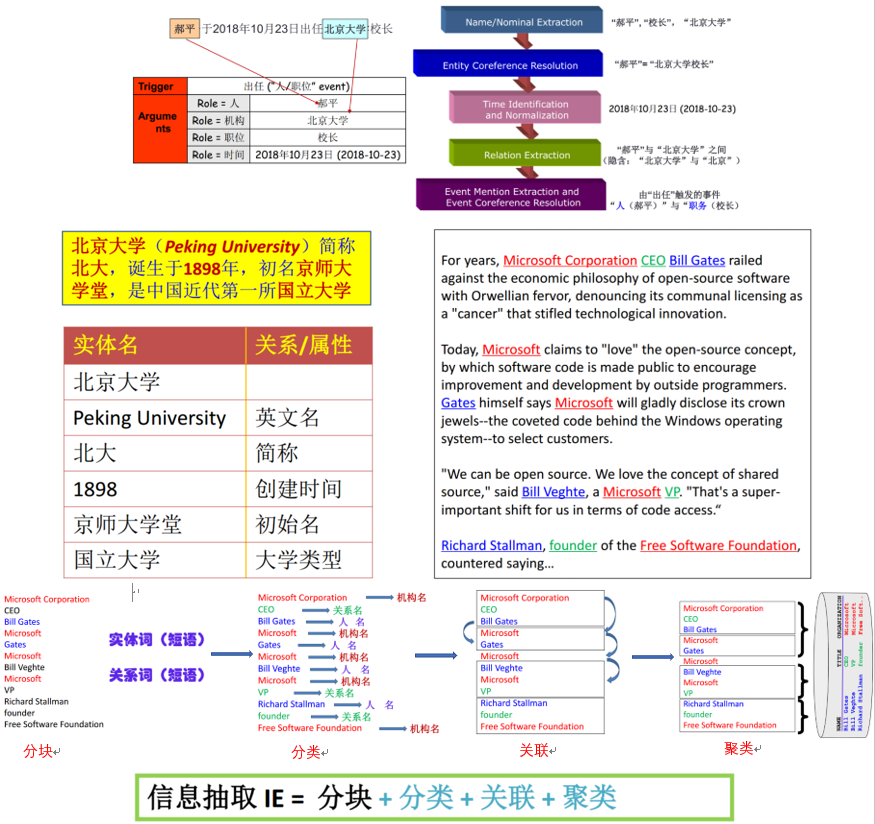
 
图4. 信息抽取实例

&emsp;&emsp;从上图可以看出，信息抽取主要包括分块，分类，关联和聚类这四个过程，最终获得的即结构化三元组数据（实体+共指+关系）。信息抽取作为自然语言处理的基础问题之一，其可以应用于很多场景中，如歧义消解、问答与推理、语义搜索、阅读理解、机器翻译等。

### 2.1 命名实体识别

&emsp;&emsp;命名实体识别是指识别文本中的名称，包括人名、地名、组织机构名、电影电视名、歌名、时间/数量、专业术语等。该项任务开放性强（类型多样、长短弹性大、未登录词），蕴含丰富知识且凸显个性（人名、地名、组织机构名等），其中未登录词的处理以及歧义消解仍是面临的主要困难。其流程如下图所示：

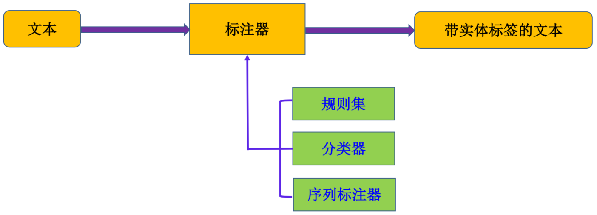
 
图5. 命名实体识别流程

&emsp;&emsp;如上图所示，命名实体识别主要包括三种方法，即规则法（主要为正则表达式，规则的书写极大的依赖于专家知识，若规则太强则将漏掉很多数据，查全率较低；若规则太弱则将会包含许多“杂质”，查准率较低。本质上是precision与reacall间的trade-off），分类法和序列标记（主要包括MMH、CRF以及DNN）。具体有关命名实体识别的相关介绍可以参考我的这篇笔记[NLP序列标注问题](https://zhuanlan.zhihu.com/p/50184092)。

### 2.2 同指消解

&emsp;&emsp;同指消解即确定两个或两个以上的词或短语是否指向同一对象，即是否具有同指关系。同指消解便于归并整合“实体关系”（鲁迅先生出生于浙江绍兴，《狂人日记》是他的代表作。代表作[鲁迅，《狂人日记》]），是信息抽取的重要内容，其主要包括有篇内同指和篇间同指。在同指消解的排序中主要面临的困难有零形式问题（主要出现在中文中），如，NLP好难，（我）感觉（我）要挂（NLP）；缩略语，如，华师大（华师）-华中师范大学、华南师范大学、华师一附中等；CCTV-央视、监控等。其中对缩略语的处理主要是缩略语的识别与解释。对于同指消解的处理方法一般包括有：

- 基于规则的方法：基于句法语义分析的方法（约束规则，如单复数、性别，与优先规则。Hobbs(1978), Haghighi & Klein(2009)等）、基于语篇结构的方法（Brennan et al.(1987), Poesio et al.(2004)等）、基于突显性计算的方法（不同的特征赋予不同的权值。Lappin & Leass(1994), Kennedy & Boguraev(1996), Mitkov(1998) 等）。
- 基于机器学习的方法：有监督（分类、排序）、无监督（聚类、非参数Bayes等）、半监督（Cotraining）。

&emsp;&emsp;这里主要介绍基于语篇结构的方法，即中心理论。

&emsp;&emsp;中心理论（Center Theory, CT）于1983年由Grosz&Sidner基于Joshi, Kuhn和Weinstei的“中心”和Grosz和Sidner的“关注状态”（Attentional State）这两个思想而提出的。其主要考虑语篇中语段内话语（utterance）之间的连接关系而忽略语段之间的连接关系，通过状态变化的连贯性给出指代消解的一种方法。其中的话语即为中心。该理论认为篇章由三个分离的但相互联系的部分组成：话语序列结构（语言结构），目的结构（说话者意图）和关注焦点状态（说话者注意力状态）。

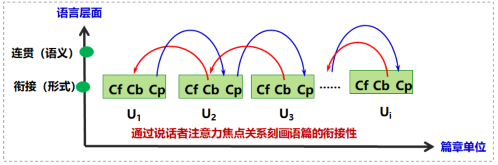
 
图6. 中心理论

&emsp;&emsp;中心理论中主要包含有两个要素，即中心和话题关系。

&emsp;&emsp;（1）中心：“语义实体（Semantic Entities）”，主要是名词（短语）：命名实体、代词、具有指称意义的名词短语。包括前看中心（Cf.）、优先中心（Cp.）、回视中心（Cb）。

- 前看中心 (forward-looking center list)：一个话语单元（utterance) 通常包含若干个中心,它们根据语法关系的显著性和从左到右出现的线性顺序,形成一个中心序列。
- 优先中心(preferred center)：前看中心序列中排列第一的成分。
- 回视中心(backward-looking center)：同时出现在当前和前一个分析单元中,且排序相对最靠前的那个中心。

&emsp;&emsp;如（a）Cooper is standing around the corner；（b）He is waiting for Grey。

&emsp;&emsp;对于（a），前看中心：Cooper，corner；优先中心：Cooper；回视中心：NULL。

&emsp;&emsp;对于（b），前看中心：He，Grey；优先中心：He；回视中心：He=Copper。

&emsp;&emsp;（2）话题关系：中心理论根据回视中心的变化状态将毗连着的语句关系分为四种,并由此
来界定语篇结构的衔接性。主要包括：延续话题(continue)、保持话题(retain)、顺畅度转换(smooth shift)、不顺畅转换(rough shift)。并定义：

|  | $Cb(U_i)=Cb(U_{i-1})$ | $Cb(U_i)≠Cb(U_{i-1})$ |
| --- | --- | --- |
| $Cb(U_i)=Cp(U_i)$ | 延续 | 顺畅转换 |
| $Cb(U_i)≠Cb(U_{i-1})$ | 保持 | 不顺畅转换 |

&emsp;&emsp;话题关系优先级：延续话题>保持话题>顺畅转换>不顺畅转换。例如：

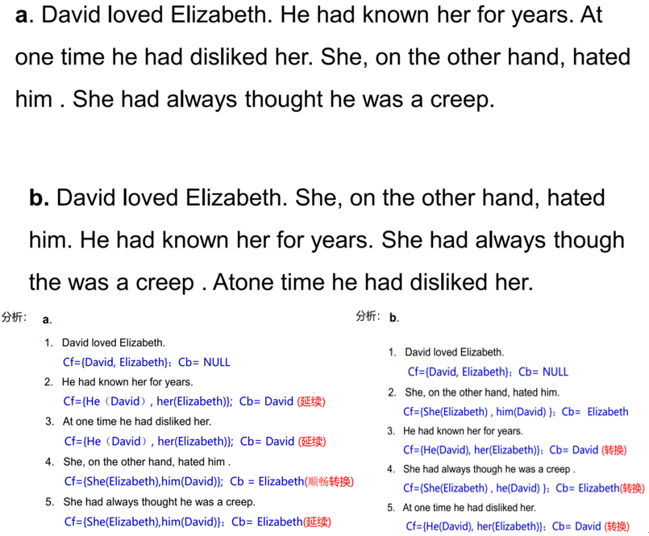
 
图7. 话题转换

&emsp;&emsp;分析a，其语篇结构进展连贯,过渡流畅:(回指)中心延续(句1—句3)+中心转换(句4)+中心延续(句5)。

&emsp;&emsp;分析b，其语句之间表征的只有中心转换状态,毫无连贯性可言。显然语篇a在结构上比语篇b流畅（衔接性好）。

&emsp;&emsp;基于中心理论即可完成指代消解任务，这里定义指代消解规则如下：

- 如果$Cf(ui-1)$的某元素以代词形式出现在$ui$，那么，这个元素就是$Cb(ui)$（该规则给出了凸显性的直观解释，即被代词表示的实体具有显著性）；
- 如果有多个代词，那么其中之一是$Cb(ui)$；
- 如果只有一个代词，那么一定是$Cb(ui)$。

&emsp;&emsp;其中，$Cb(ui)$的确定依赖于两个条件：

- 一定是在$Ui$中出现的语义实体；
- 该实体也一定在$Cf(Ui-1)$中出现过，如果$Ui$有多个实体也在$Ui-1$中出现，那么，作为$Cb(Ui)$的实体在$Cf(Ui-1)$中应有更高的排位。

&emsp;&emsp;BFP(Brennan, Friedman and Pollard,1987)算法如下：

- Step1. 如果在$Ui$中出现人称代词，则自左至右顺序检验$Cf(Ui-1)$中的元素，直至同时满足词汇句法（Morphosyntactic）、约束（Binding）和类型标准（Sortal criteria）。这样的元素作为先行语；
- Step2. 完全读取表述$Ui$，生成$Cf(Ui)$，对$Cf(Ui)$进行排序，计算$Cb(Ui)$。

&emsp;&emsp;例：

 
图8. 基于中心理论的指代消解

&emsp;&emsp;根据优先规则连续>转换，故情况一为分析结果。

&emsp;&emsp;中心理论对篇章中心的刻画只能考虑局部的连贯性，没有对全局的连贯性加以考虑，所以消解工作只限于相邻的句子，而且主要用于人称代词消解，对零指代以及名词短语的消解效果不好，当需要指代的部分较多时其很难做出准确判断。

### 2.3 关系抽取

&emsp;&emsp;关系抽取指的是检测和识别文本中实体之间的语义关系，并将表示同一语义关系的提及（mention）链接起来的任务。其主要包括属性及属性值的抽取（如人的属性包括：姓名、性别、出生日期、出生地等），又称为曹值填充（slot filling，SF）和关系的抽取。其中关系抽取任务又可分解为：①实体关系有无的判断（二分类问题）；②实体间具体的关系的确定（多分类问题）。方法主要包括有：规则方法、有指导的学习方法、半指导的学习方法、远程监督方法。

&emsp;&emsp;（1）基于规则的关系抽取

&emsp;&emsp;其思想主要为首先构建模式（规则），通常信息为：词汇、句法、语义等。分析时，采用模式匹配文本片段，抽取关系。该方法准确度比较高（一旦匹配，基本正确），然而召回率与准确率间存在trade-off，而且规则的构建需要专家参与，且工作量巨大。主要包括CMU-6，CMU-7。

&emsp;&emsp;（2）有指导学习的关系抽取

&emsp;&emsp;有指导学习的关系抽取基本步骤主要包括：

- Step1. 从标注实例中抽取特征或学习表示；
- Step2. 选择分类器训练模型并优化参数；
- Step3. 利用模型从新的数据中标注并抽取关系。

&emsp;&emsp;典型方法有：特征方法（将实例转换成分类器可接受的特征向量），如实体类型，词汇特征（词性），依存路径特征，语义特征，词汇关系等。核函数方法（不需要构造直接的特征），如基于句法树（短语结构树/依存树）构造树核函数，基于字符串序列的核函数，融合卷积树核和线性核函数等。深度神经网。

 
图9. CNN关系抽取

&emsp;&emsp;CNN在方法抽取中其输入为句子词向量，输出即为关系类别。简单的CNN模型并未购率位置信息因此在词特征（WF）的基础上引入位置特征（PF），即每个词离两个词的距离，之后进行卷积非线性变换，得到句子特征，进行分类处理。如下：

 
图10. 改进CNN关系抽取

&emsp;&emsp;（3）弱指导学习的关系抽取

&emsp;&emsp;弱指导学习的关系抽取基本步骤与有指导学习基本相似，唯一区别在于弱指导学习利用知识库自动标注语料。其中语料构建的代表方法主要包括：Distant Supervision(远程监督法)、利用已有的三元组回标数据等，如下：

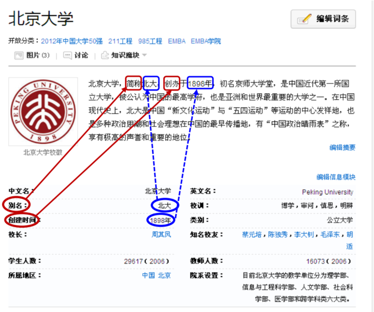
 
图11. 回标法

 
图12. 远程监督法

&emsp;&emsp;（4）无指导的关系抽取

&emsp;&emsp;无指导的关系抽取的主要即为聚类。该方法一方面可用于发现新关系，另一方面关系的语义不能明确给定，聚类后需要人工指定关系的含义。

&emsp;&emsp;在关系抽取中主要分为两大类模型，即“流水线”模型和联合模型。

 
图13. “流水线”模型

&emsp;&emsp;“流水线”模型主要分为两步：1.实体识别与分类；2.关系识别与分类。然而该方法产生不必要的冗余（有些实体对之间不存在的关系也需要判断），且实体识别错误影响关系识别。因此现在较为常见的是联合模型，即实体识别和关系识别同时建模，典型网络如Encoder-Decoder框架（具体有关Encoder-Decoder框架可参见我的这篇笔记[从RNN、LSTM到机器翻译Encoder-Decoder框架、注意力机制、Transformer](https://zhuanlan.zhihu.com/p/50915723)）。

 
图14. 联合模型

### 2.4 事件抽取

&emsp;&emsp;事件抽取指的是从非结构化文本中抽取事件信息（特定的人/物在特定时间和特定地点发生的事），并将其以结构化形式呈现
出来的任务。其一般包括时间、地点、涉事人物的抽取等。事件抽取的具体任务为：

- 事件识别与分类：触发词识别（判断句子（文档）是否属于事件，二分类）、事件分类（判断属于哪类事件，多分类）；
- 论元角色识别：论元识别（判断是否为论元，二分类）、角色分类（ 指派论元角色，多分类）。

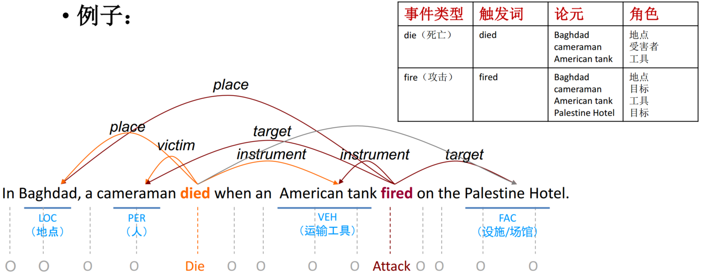
 
图15. 事件抽取实例

&emsp;&emsp;其研究发展如下图：

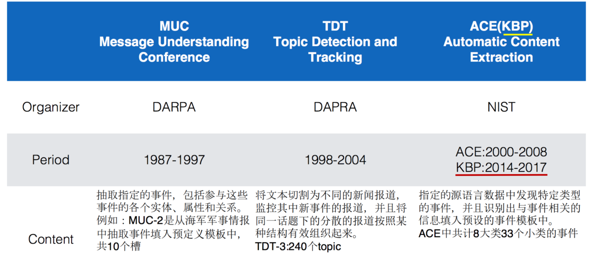
 
图16. 事件抽取研究的发展

&emsp;&emsp;其方法主要包括基于特征工程的分类方法（SVM、MaxEnt）及深度学习（End2Ended）。其中特征工程中常用特征主要包括：

&emsp;&emsp;（1）触发词标注的常用特征

- 词汇（候选词及其POS，上下文窗口）；
- 词典（触发词列表、同义词）；
- 句法：触发词在树中的深度/到根节点的路径；所在短语的类型等；
- 实体：句法树中离候选触发词最近实体的类型
；句中离触发词最近的实体类型。

&emsp;&emsp;（2）论元标注的常用特征

- 事件及类型：触发词以及对应的事件（子事
件）类型；
- 实体：类型/子类型、中心词；
- 上下文：候选论元的上下文（窗口）；
- 句法。

&emsp;&emsp;动态多池卷积神经网络（DMCNN： Dynamic Multi-Pooling Convolutional Neural）

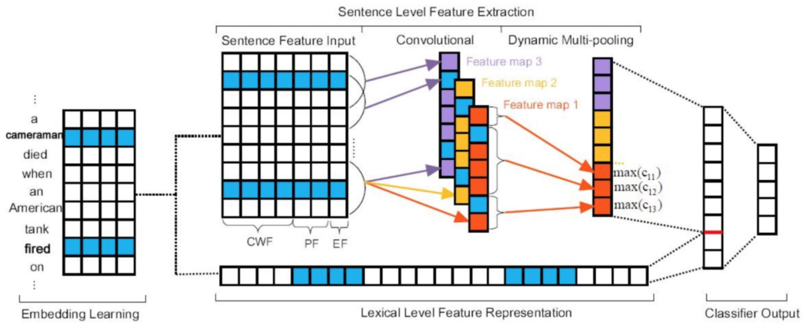
 
图17. DMCNN

&emsp;&emsp;动态多池卷积神经网络（DMCNN： Dynamic Multi-Pooling Convolutional Neural）通过自动学习特征来实现多类分类———（1）触发词识别；（2）论元分类（论元识别与角色分类）。其输入为词汇级特征：候选词、上下文词向量的concat，句子级特征:词向量表示的CWF特征（词汇的上下文特征），位置特征PF，事件类型特征EF的concat以及词汇特征与句子特征的concat。

&emsp;&emsp;基于Joint的深度网事件抽取

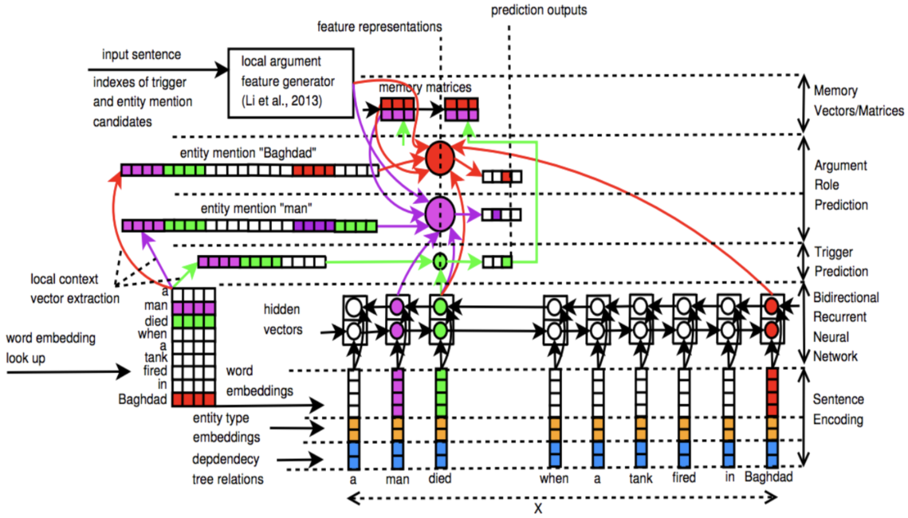
 
图18. joint

&emsp;&emsp;该Joint模型主要包括两个阶段：

&emsp;&emsp;（1）编码阶段：获得句子的抽象表示。

- 每个词由词向量表示；
- 每个词的实体类型（BIO）由向量表示；
- 与该词有依存关系的向量（二值向量，维度为依存关系总数）；
- 上述每个词的向量拼接后交由双向的RNN学习，获得编码。

&emsp;&emsp;预测阶段：联合预测事件（类型）和论元（包括角色）。

&emsp;&emsp;Others

 
图19. Language-Independent Neural Network

## 3. 信息融合

&emsp;&emsp;信息融合或知识的融合其是就是实体融合，也即实体对齐操作。随着大数据时代的到来，数据的来源维度不断扩大，不同结构、不同维度的数据在其自身的结构体系下是逻辑自洽的，且相互间存在一定程度的overlap，然而当我们将这些数据进行合并时就会面对实体对齐的问题，也就是同指消解问题。

&emsp;&emsp;实体对齐也叫实体归一化，现在普遍采用的仍是聚类的方法。而在聚类问题的关键即相似度的计算以及阈值的定义（K-Means算法不需要）。另外，实体融合还将涉及Schema融合和实体链接的技术。Schema融合等价于Type层的合并和Property的合并。在特定领域的图谱中，Type与Property数量有限，可以通过人工进行合并。实体链接则从文本中准确匹配上图谱中相应的实体，进而延伸出相关的背景知识，实体链接主要依赖于Entity与所有Mention（文本文档中实体的目标文本）的一个多对多的映射关系表。实体链接可以正确地定位用户所提实体，理解用户真实的表达意图，从而进一步挖掘用户行为，了解用户偏好。

## 4. 信息存储

&emsp;&emsp;信息的抽取和融合后的输出即为三元组，我们如何对三元组进行有效的存储以方便检索和调用这就涉及到数据库的选择。数据库的类型主要有：关系型数据库、图数据库、NoSQL数据库等。其中最常见的是关系型数据库，当然我们需要根据实际情况出发进行数据库的选择：

- 若图谱结构、关系复杂，连接多，可采用图数据库，如Neo4J；
- 若图谱侧重节点知识，关系简单，连接少，则关系型数据库或ES即可满足要求；
- 若考虑图谱性能、扩展性和分布式等，可采用NoSQL数据库，如TiTan；
- 多种数据库的融合。

## 5. 知识推理

&emsp;&emsp;自然语言处理中非常困难的一部分就是推理，无论是问答系统还是阅读理解等，目前技术只能在基于知识库的查询上获得不错的效果，而一旦涉及到推理工作，都将会变得十分困难。这里我们简单介绍几种知识图谱中的推理方法：

&emsp;&emsp;（1）基于RDF的推理

&emsp;&emsp;RDF(Resource Description Framework)，即资源描述框架，其本质为数据模型（Data Model）。简单来说，RDF就是表示事物的一种方法和手段，其形式上即表示为SPO三元组，有时候也称为一条语句（statement），即一条知识。RDF由节点和边组成，节点表示实体、属性，边则表示了实体和实体之间的关系以及实体和属性值间的关系。基于RDF的推理就是基于符号、概念进行推理。如：

$$
(Faster CNN \; RDF:type \; DNN \; and \; DNN \; subclass \;  NN) \to Faster CNN \; RDF:type  \;  NN
$$

&emsp;&emsp;（2）基于OWL本体的推理  

&emsp;&emsp;OWL，即“Web Ontology Language”，语义网技术栈的核心之一，其是指RDF的基础上添加了额外的预定义词汇，以提供快速、灵活的数据建模能力和高效的自动推理能力。

&emsp;&emsp;（3）基于PRA的推理  

&emsp;&emsp;路径排序算法（Path Ranking Algorithm, PRA）其主要思想为：以连接两个实体的已有路径作为特征构建分类器，来预测它们之间可能存在的潜在关系。其中PRA提取特征的方法主要有随机游走、广度优先和深度优先遍历，特征值计算方法有随机游走probability，路径出现/不出现的二值特征以及路径的出现频次等。PRA方法直观、解释性好，但是其对关系稀疏的数据、低连通度的图处理啥效果并不理想，且路径特征提取的效率低且耗时（这些都是随机游走方法带来的毛病）。

&emsp;&emsp;（4）基于分布式知识语义表示的的推理 

&emsp;&emsp;基于分布式的知识语义表示的方法典型代表即Trans系列的模型，如TransE、TransR等。TransE模型的思想也比较直观，它是将每个词映射为向量，然后向量之间保持一种类比的关系，即：头实体embedding（h）+关系embedding（i）=尾实体embedding（t）。其目标为让构成三元组的$t$和$h+i$尽可能的接近，而不构成的三元组尽可能的远。

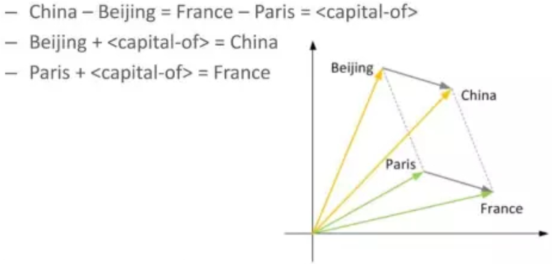
 
图20. TransE 模型

&emsp;&emsp;上图中北京中国等价于巴黎法国，因此他们的距离应可能的接近。因此论文中定义“能量”$e(\overrightarrow h,\overrightarrow l,\overrightarrow t)$来反映向量间的距离$d(\overrightarrow h+\overrightarrow l,\overrightarrow t)$：

$$
d(\overrightarrow h + \overrightarrow l,\overrightarrow t)=∣\overrightarrow h+ \overrightarrow l−\overrightarrow t∣\tag{1}
$$

&emsp;&emsp;上式中距离的度量可利用L1或L2范数。（有关范数的介绍可以参看我的这篇笔记(机器学习中的各种范数与正则化)[https://zhuanlan.zhihu.com/p/51673764]）。另外为了增强区分度，作者还构造了一些反例三元组，并使反例的距离尽可能的大，这样最终的优化目标（损失函数）即为：

$$
L=\sum_{(\overrightarrow h,\overrightarrow l,\overrightarrow t)\in S}\sum_{(\overrightarrow {h'},\overrightarrow l,\overrightarrow {t'}) \in S'(\overrightarrow h,\overrightarrow l,\overrightarrow t)}[\gamma +d(\overrightarrow h + \overrightarrow l,\overrightarrow t)-d(\overrightarrow {h'} + \overrightarrow l,\overrightarrow {t'})]\\
s.t.S'(\overrightarrow h,\overrightarrow l,\overrightarrow t)={(\overrightarrow {h'},\overrightarrow l,\overrightarrow {t})|\overrightarrow {h'} \in E} \bigcup {(\overrightarrow {h},\overrightarrow l,\overrightarrow {t'})|\overrightarrow {t'} \in E}\tag{2}
$$

&emsp;&emsp;上式中，$(\overrightarrow h' + \overrightarrow l,\overrightarrow {t'})$即为构造的反例三元组（正例三元组的头实体或尾实体替换成一个随机的实体）。此外，为缓解过拟合引入正则化项并利用梯度下降法最小化损失函数。

&emsp;&emsp;TransE模型求解过程为：

- Step1. 模型假设。将实体和关系之间进行向量表示；

- Step2. 定义打分函数来衡量关系成立的可能性。使用距离函数表征“头实体+关系”和“尾实体”接近的程度。距离越小，接近程度越高，关系成立的可能性越大；

- Step3. 参数估计。即实体和关系的对应向量表示。

&emsp;&emsp;TransE模型比较简单，其简单地假设实体和关系处于相同的语义空间，故只能处理实体之间一对一的关系。而事实上，一个实体是由多种属性组成的综合体，不同关系关注实体的不同属性，所以仅仅在一个空间内对他们进行建模是不够的。因此在此基础上发展了TransR模型，TransR实际上是解决了上面提到的一对多或者多对一、多对多的问题，它分别将实体和关系投射到不同的空间中，即实体空间和关系空间，然后在实体空间和关系空间来构建实体和关系的嵌入。对于每个元组$(h,r,t)$，首先将实体空间中实体通过$Mr$向关系空间$r$进行投影得到$hr$和$Tr$，然后使得$H+t\approx hr+tr$，如下图所示：

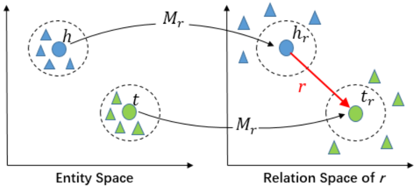
 
图21. TransR 模型

&emsp;&emsp;除以上方法外当然还包括基于深度学习的方法，如CNN等。

## 6. 知识图谱的应用

&emsp;&emsp;知识图谱的应用可以涉及到很多行业，如医疗、教育、证券投资、金融、推荐等等。其实，只要有关系存在，则有知识图谱可发挥价值的地方。这里主要介绍基于知识图谱的问答与推荐。

### 6.1 基于知识图谱的问答

&emsp;&emsp;基于知识图谱的问答，可以看做基于知识图谱的搜索。而基于知识图谱的问答其实就是问句形式与知识图谱某种属性的对应。如下图所示：

 
图22. 基于知识图谱的问答

&emsp;&emsp;如上图所示，我们可以将不同的问句一一对应为知识图谱中的各个属性。如"How many people / What's the population"对应知识图谱中的属性"population"。

### 6.2 基于知识图谱的推荐

&emsp;&emsp;有关传统推荐中基于CF矩阵分解等方法的接介绍可以参看我的这篇笔记(推荐系统（Recommendation System)[https://zhuanlan.zhihu.com/p/53648248]。而基于知识图谱的推荐较之前的方法相比其主要优点在于：①增加了推荐系统的可解释性（这也是知识图谱的一大优点同时也为其与深度网的结合提供了良好的动机）；②知识图谱能够增加推荐的多样性，由于不同节点间存在直接或间接的连接关系，而且其蕴含有大量、丰富的语义信息，因此知识图谱能够极大的提升推荐的多样性。基于知识图谱推荐的关键即为基于知识图谱的物品或用户画像的构建。

&emsp;&emsp;物品的画像主要分为显示画像和隐示画像，其中显示画像是指从知识图谱中直接找到的关联（例如两部电影的共同属性）作为刻画两个物品相关性的依据。有基于向量空间模式和基于异构信息网络两种模式。

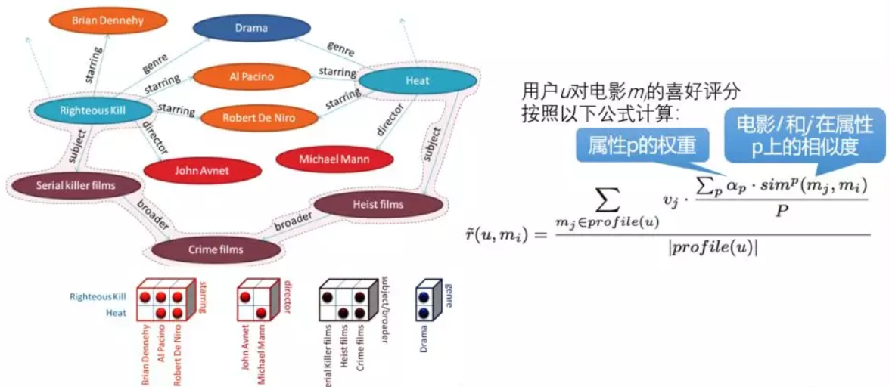
 
图23. 基于向量空间的知识画像

&emsp;&emsp;基于向量空间的知识画像为每种属性生成一个表示向量，每一维对应该属性的某个值的权重。

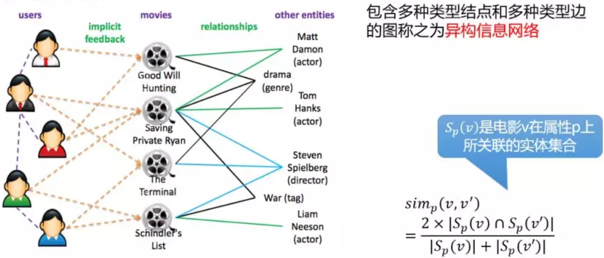
 
图24. 基于异构信息网络的知识画像

&emsp;&emsp;基于异构信息网络的知识画像将物品和其每种属性值对应的实体都表示成异构信息网络的一类结点，它们之间构成各种类型的边，而不同物品间会共享某些属性对应的实体，所以会有一条经过该共享实体的meta-path将两个物品相连。因此由不同类型的元路径相连的两个物品具有一定的相似度。这类方法的优点是充分且直观地利用了知识图谱的网络结构，缺点是需要手动设计meta-path或meta-graph。同时，由于我们无法为实体不属于同一个领域的场景（例如新闻推荐）预定义meta-path或meta-graph，因此该类方法的应用受到了限制。

&emsp;&emsp;隐式画像。利用基于深度神经网络的嵌入embedding向量来表示物品，物品间的相似度计算基于其对应嵌入向量在向量空间中的距离。主要包括基于随机游走的图嵌入(graph embedding)和基于KG embedding两种模型。其中基于随机游走的图嵌入（graph embedding）模型即在异构信息网络图中应用基于随机游走的相关图嵌入算法即可获得电影节点的向量表示（画像），包括DeepWalk、Node2Vec、HIN2Vec等。

 
图25. 隐式知识画像

## 6. Summary

&emsp;&emsp;知识图谱技术是知识表示和知识库在互联网环境下的大规模应用，是实现智能系统的基础知识资源。然而知识图谱仍需要克服以下问题：①融合符号逻辑和表示学习的知识表示；②高精度大规模知识图谱的构建，现在大部分质量较高的知识图谱均是基于人工构建的，包括Google等，而自动知识图谱的构建技术仍存在知识质量难以应用的问题。随着大数据时代的到来，如何从分布、异构、有噪音、碎片化的大数据中获得高质量的大规模知识图谱，为知识图谱构建带来了机遇，同时也成为一个研究热点。如何构建融合符号逻辑和深度计算的知识获取和推理技术是其中一个有前景的研究问题；③知识图谱平台技术；④基于知识图谱的应用研究等。

&emsp;&emsp;随着机器学习、语义分析和篇章理解等相关技术的快速进展，这一人工智能中最具挑战的问题将在可预见的未来得到相当程度的解决，知识图谱的产业化应用前景将更加广阔。

## 8. References

[[1] 中文信息处理发展报告（2016）, 中国中文信息学会, 北京：2016.12.](http://link.zhihu.com/?target=https%3A//cips-upload.bj.bcebos.com/cips2016.pdf)

[[2] 王厚峰. 信息抽取[Slides]. 北京大学](1.pdf)

[[3] Xiaocheng F , Bing Q , Ting L . A language-independent neural network for event detection[J]. Science China Information Sciences, 2018, 61(9):092106-.](http://aclweb.org/anthology/P16-2011)

[[4] Nguyen T H, Cho K, Grishman R. Joint event extraction via recurrent neural networks[C]. Proceedings of the 2016 Conference of the North American Chapter of the Association for Computational Linguistics: Human Language Technologies. 2016: 300-309.](http://aclweb.org/anthology/N16-1034)

