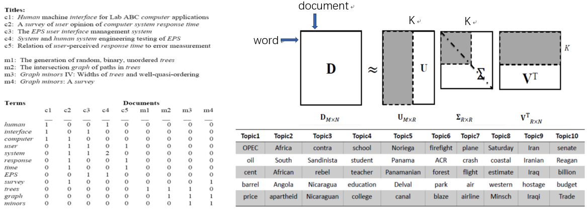
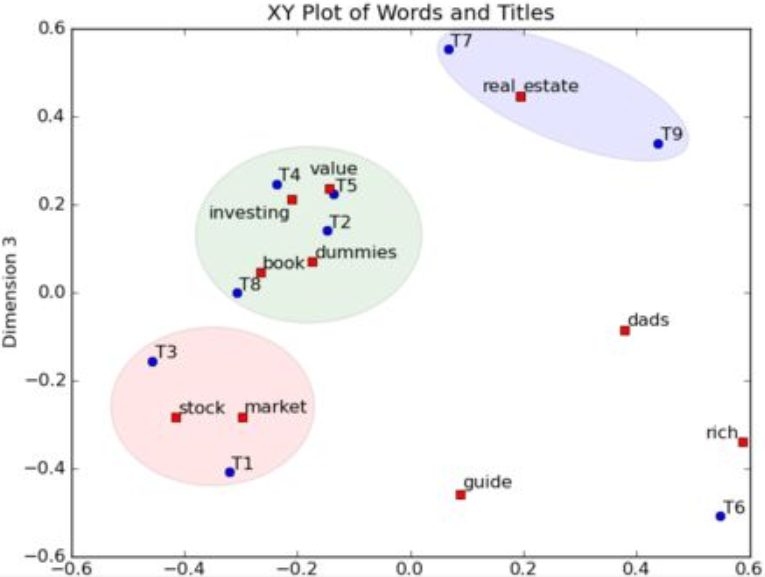
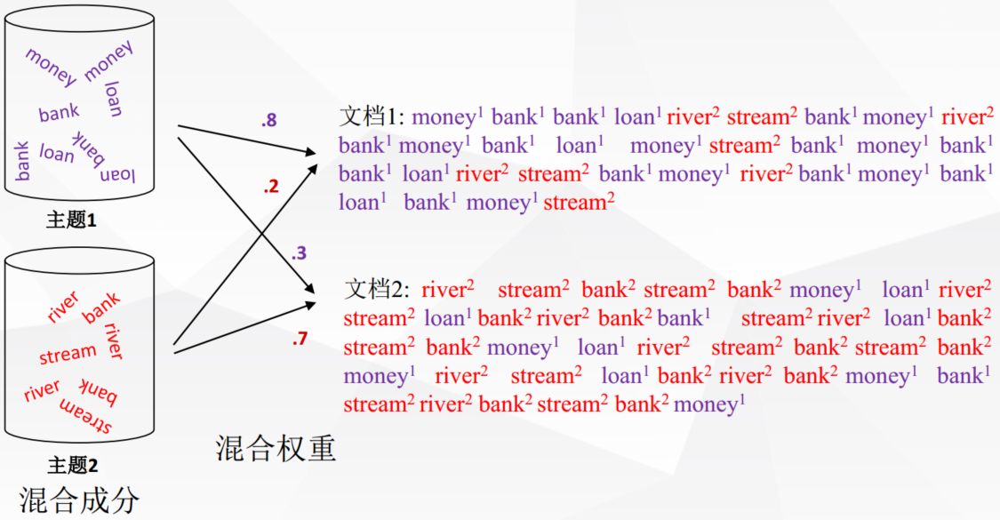
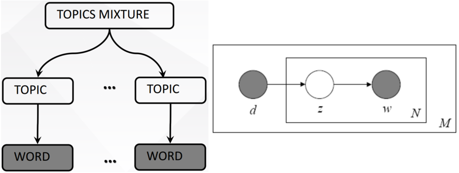
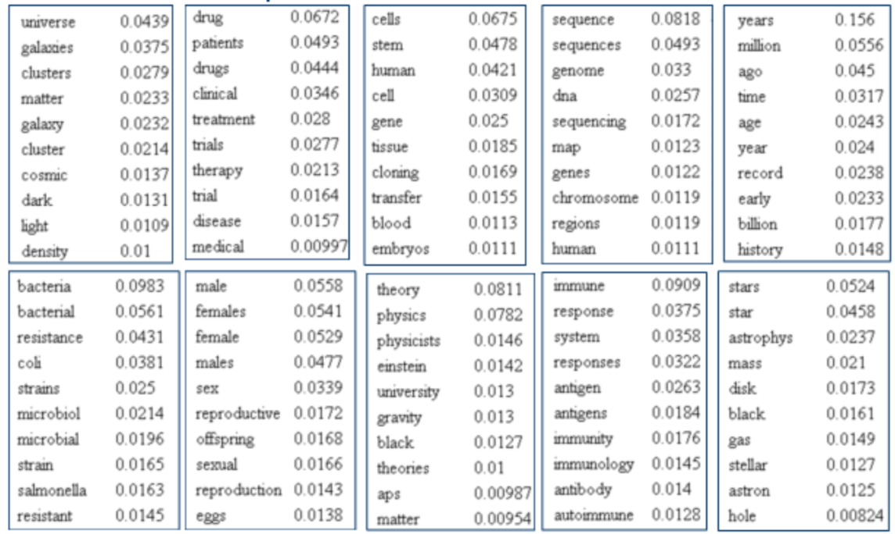
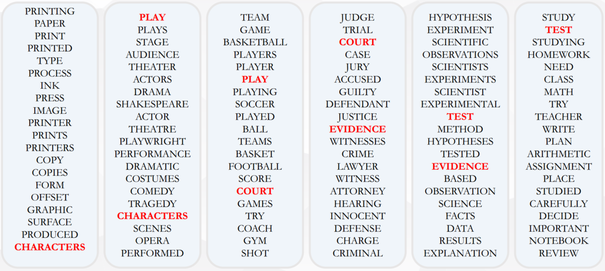
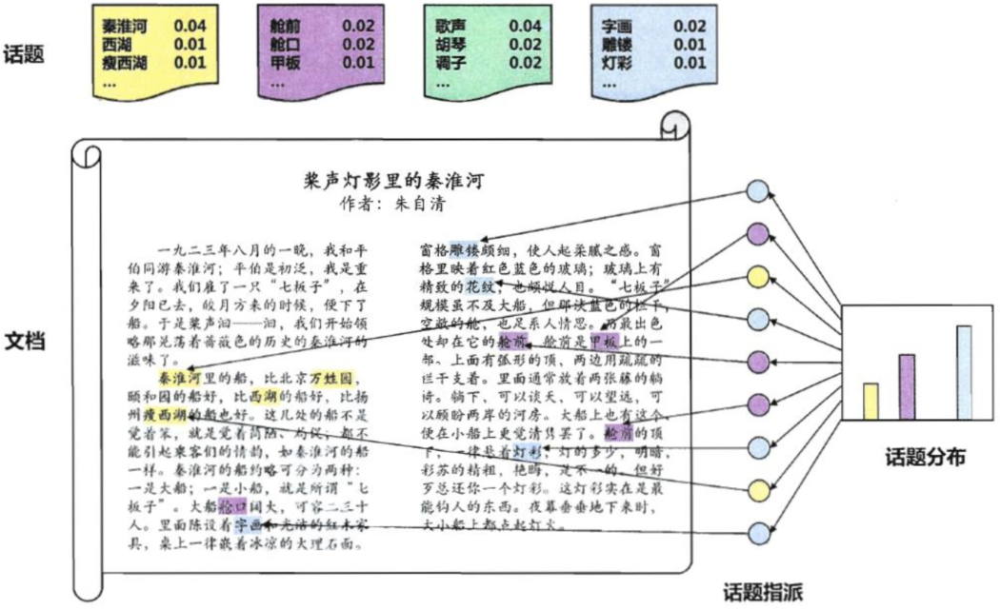
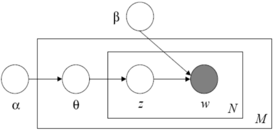
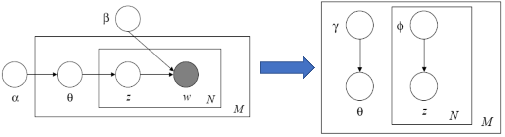
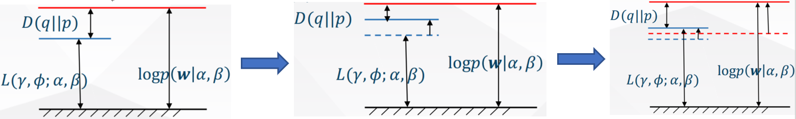

# 情感分析中的PLSA、LDA模型

## 1.Introduction

&emsp;&emsp;情感分析（sentiment analysis）表面上是指利用计算机技术对文本、图像、音频、视频甚至跨模态的数据进行情绪挖掘与分析。但从广义上讲，情感分析还包括对观点、态度、倾向的分析等。情感分析主要涉及两个对象，即评价的对象（包括商品、服务、组织、个体、话题、问题、事件等）和对该对象的态度、情感等。情感分析在社会的舆情管理，商业决策，精准营销等领域有着广泛的应用。在股市预测、选举预测等场景中，情感分析有着举足轻重的作用。情感分析的诞生和发展主要源于社交媒体和网络，如论坛、博客、微博等。至2000年起情感分析便成为自然语言处理中活跃的领域之一。然而现实生活中，社交网络的情感分析仍存在较大的困难（主要原因之一为社交网络的数据存在大量无用的“垃圾”信息，这也是自然语言处理中大部分工作（如机器翻译等）应用于实际生活场景中很难取得较好效果的原因）。

&emsp;&emsp;情感分析的研究方法主要包括有监督和无监督两种方法。早期的有监督学习是指SVM、最大熵、朴素贝叶斯等这类浅层模型，而无监督学习则为基于词典、语义分析等方法。深度学习的出现使得其在许多分类、回归任务中均取得了最好的结果。近年来应用deep learning进行情感分析也成为了研究的热点。

&emsp;&emsp;情感分析主要分为三个层面，分别为：Document level、Sentence level和aspect level。其中Document level是将整个文档作为分析单元并假设该文档讨论的对象为单一实体且情感、观点都是鲜明、清晰的，即neural, positive or negative 。Sentence level则是以每个句子作为单独的分析对象，由于句子与句子间可能存在某些关联，因此我们不能将其认为是观点明确的。而对于aspect level其分类粒度更细，即我们需要抽取出targets不同层面相互独立的评价，并进行总结综合得到最后的情感。其将涉及ascept extraction, entity extraction以及aspect sentiment classification。例如，对于Deep Learning虽然结果可解释性差，但对于图像识别任务是非常有效的。其中Deep Learning即为entity，extraction identity则为“结果”和“图像识别”，对于“结果”为其情感为negative，“图像识别”为positive。

&emsp;&emsp;对于文档级别的情感分析其主要是一个二分类问题（positive or negative），我们当然也可将其转化为回归问题即对于文档的情感给出打分。期初对于该问题比较传统的解决方法是基于文档词袋模型，如计算word frequence或TF-IDF score。该方法带来的最直接的问题便是矩阵稀疏，而且该方法忽略了句子中词语的先后顺序。因此后来便引入了n-gram模型（n-gram模型通过对语料库中的词汇进行简单统计得到序列出现的概率，在过去的几十年中n-gram模型是NLP中的核心模块，最长使用的包括2元文法和3元文法等），改模型可以同时考虑多个词，一定程度上缓解了短文本的词语间的顺序问题，然而对于未登录词我们仍需进行平滑处理，而且该方法并没用考虑任何的语义信息。在此之后03年Benjio提出了词向量，通过将文章表示为稠密的向量而在神经网络中广泛使用（但是word embedding并不能解决一词多义问题，直到ELMO的出现才给出了一个优雅的解决方案）。

&emsp;&emsp;对于句子级别的情感分析，与文档类似我们也需要将其变化为句向量然后进行分类。所不同的是，由于句子长度较短因此我们可以结合句法依存树等进行处理，此外对于社交媒体文本数据，如Tweets，我们还可以对social relationships等信息进行考虑。在早期的研究中，结合句法树分析的模型占主导地位，后来神经网络成为主流。

&emsp;&emsp;对于aspect级别的情感分析，其有别于文档和句子，我们即需要考虑target的情感同时还要分析aspect的情感，而不同的上下文所包含的情感均会影响最终结果，因此在建模时必须同时考虑目标对象以及上下文间的情感关系，这也增加了任务的困难。在神经网络中我们一般将aspect level sentiment classfication分解为三个子任务：第一，上下文语境词的表示；第二，target的表示，可通过embedding解决；第三，识特定目标情感语境词的识别。而有关target和aspect的抽取，具体可参见（[Knowledge Graph（知识图谱）](https://zhuanlan.zhihu.com/p/53753234),[NLP中的序列标注问题（Bi-LSTM+CRF）](https://zhuanlan.zhihu.com/p/50184092)这两篇笔记所提到的相关方法）。

## 2. 概率潜语义分析（Probabilistic latent semantic analysis， PLSA）

&emsp;&emsp;概率潜语义分析（PLSA）又称为概率潜语义索引（PLSI，信息检索领域），其在潜语义分析LSA(LSI)的基础上，通过引入概率并以图模型为基础，对文档和主题进行建模。（有关概率图模型的介绍可以参看我的这篇笔记[概率图模型](https://zhuanlan.zhihu.com/p/54101808)）

### 2.1 潜语义分析LSA

&emsp;&emsp;LSA是一种对文档主题进行建模的方法，其使用向量来表示词(terms)和文档(documents)，并将词和文档向量映射至潜在语义空间，通过向量间的关系(如夹角)来判断词及文档间的关系，从而去除了原始向量空间中“噪音”的影响，提高信息检索的精度。如下：

 
图1. LSA

&emsp;&emsp;如上图所示，首先我们可以对每篇文档的单词词频进行统计并建立单词-文档共生阵（word-document co-occurance matrix）$D$，然后对其进行SVD分解（有关矩阵分解的相关内容可以参考我的这篇笔记[推荐系统（Recommendation System）](https://zhuanlan.zhihu.com/p/53648248)）：

$$
D=U\sum V^T\tag{1}
$$

&emsp;&emsp;上式中，$D$为word-document co-occurance matrix，其中一列代表一篇文档，行数其为词典单词数。$U$矩阵为word xpace，其每一行表示意思相近的一类词，元素数值越大越相关说明越相关，即越重要。同理$V$矩阵中的每一列表示同一主题的一类文章，其中每个元素表示这类文章中每篇文章的相关性。通过奇异值分解我们即完成了对词和文档的分类，同时得到了不同主题的文章其相关的高频词。

 
图2. DocumentSVD分解

&emsp;&emsp;如上图所示，通过对文档进行奇异值分解，不同主题的文档所包含的词汇被明显区分，且意思相近的词汇被聚合在一起。通过LSA，同义词将拥有相同或相似的主题，且该过程无监督在早期的文档主题建模中得到了很好的应用。然而该方法能较好解决一义多词问题却无法解决一词多义问题（笼罩着NLP上方的“乌云”）。此外，SVD建模假设数据服从高斯分布（优化范数），然而现实中数据均为非负的，明显与假设不符。而且SVD的计算复杂度很高（尤其是当$D$矩阵很大时），不能实现增量学习。对此我们引入PLSA模型。

### 概率潜语义分析PLSA

&emsp;&emsp;PLSA模型将文档中的词看做来自混合模型的采样，且假设每个词来自一个主题，同一个文档中不同词可能来自不同的主题。同时将每个文档表示为不同概率多个主题的混合，而每个主题又有多个词语混合而成，如下。

 
图3. 文档混合表示

&emsp;&emsp;其中文档的生成过程我们可以由概率图表示，如下：

 
图4. 文档生成过程

&emsp;&emsp;即我们对每一文档选择一个合适的混合主题，然后对每一个主题进行采样得到词语，即：

$$
p(d,w_n)=p(d)p(w|d)=p(d)\sum_Zp(w_n|z)p(z|d)=\sum_Zp(z)p(d|z)p(w_n|z)\\
(W\ bot)|Z\tag{2}
$$

&emsp;&emsp;上式中$p(d)$即为从文档集合选择文档$d$的概率，$p(z)$为选择主题$z$的概率，其中主题数为超参数需要提前指定，而主题$z$即为隐变量。在已知文档$d$和其对应的词表$w$后我们需要对主题进行推断，如下：

 
图5. 文档主题推断

$$
p(z|d,w)=\frac{P(z)P(d|z)P(w|z)}{\sum_{z'\in Z}P(z')P(d|z')P(w|z')}\tag{3}
$$

&emsp;&emsp;上式中对于有关隐变量$z$的概率的求解我们使用EM算法（有关EM算法的具体介绍可以参看我的这篇笔记[EM算法与GMM（高斯混合聚类）](https://zhuanlan.zhihu.com/p/50686800)），如下：

- E步：计算隐变量的后验概率

$$
p(z|d,w)=\frac{P(z)P(d|z)P(w|z)}{\sum_{z'\in Z}P(z')P(d|z')P(w|z')}
$$

- M步：似然函数最大化，参数更新：

$$
P(w|z)=\frac{\sum_d n(d,w)P(z|d,w)}{\sum_{d,w'}n(d,w')P(z|d,w')},\quad P(w|z)\varpropto \sum_d n(d,w)P(z|d,w)\\
P(d|z)=\frac{\sum_w n(d,w)P(z|d,w)}{\sum_{d,w'}n(d,w')P(z|d,w')},\quad \varpropto \sum_w n(d,w)P(z|d,w)\\
P(z)=\frac1R\sum_{d}\sum_{w}n(d,w)P(z|d,w),\quad \varpropto \sum_{d}\sum_{w}n(d,w)P(z|d,w)\\
R=\sum n(d,w)
$$

&emsp;&emsp;上式中$n(d,w)$，为文档$d$与单词$w$成对出现的次数。通过EM算法迭代收敛我们则可以得到$P(z|d,w)$以及$P(w|d)=\sum_zP(w_n|z)p(z|d)$。

 
图6. 科学杂志论文集相关主题

&emsp;&emsp;将PLSA应用于科学杂志中所得到的主题分布如上图所示。PLSA能够较好的解决一词多义问题，且定义了概率模型使得每个变量以及相应的概率分布和条件概率分布都有明确的物理解释。相比于LSA，PLSA假设更加合理，topic数目可以任意指定。然而，其没有提供文档层面的概率建模，而且模型的参数数量随着语料规模线性增长。对此我们引入话题模型（topic model）。

 
图7. PLSA中不同话题的一词多义

## 3. 隐狄利克雷分配模型（Latent Dirichlet Allocation）

&emsp;&emsp;LDA为话题模型的典型代表，其在文本挖掘领域，如文本主题识别、文本分类以及文本相似度计算方面有者广泛的应用。这里我们定义语料$D$由$M$篇文档组成，$D=\{W_1,W_2,...,W_M\}$，其中一篇文档$W$又包含$N$个词，$W=\{w_1,w_2,...,w_N\}$，则从语料$D$中生成文档$W$的过程可表示为：

- Step1. 从狄利克雷分布中随机采样一个话题分布$\theta$，$\theta ~ Dir(\alpha)$； 
- Step2. 对文档$W$中的第$n$个词$w_n$进行话题指派，且$z_n ~ Multionmial(\theta)$；
- Step3. 根据指派话题$z_n$所对应的词频分布$\beta$按$P(w_n|z_n,\beta)$的概率分布随机采样生成词（$\beta \in \Bbb R^{k\times V}$，$k$为话题数目，$V$为词表大小，且$\beta_{ij}=p(w^j|z^i=1)$）。

&emsp;&emsp;LDA文档生成过程如下所示：

 
图8. LDA文档生成过程

&emsp;&emsp;其各个变量的相互关系如下所示：

 
图9. LDA盘式记忆图

&emsp;&emsp;从上图可以明显看出，LDA模型包含三个层次，即词语级、文档级和语料级，而每个层次分别对应的模型参数为$\z_{dn},w_{dn};\theta_d;\alpha,\beta$。同时我们假设：

- 狄利克雷分布的维度$k$已知且固定；
- 词的概率$\beta$是一个需要估计的固定值；
- 文档长度$N$独立于其他数据生成变$\theta$和$z$。

&emsp;&emsp;若狄利克雷参数$\alpha$和话题对应的词频分布$\beta$已知，给定文档，我们根据词频$W$推断其话题分布，即计算隐变量的后验分布，如下：

$$
p(\theta,Z|W,\alpha,\beta)=\frac{p(\theta,Z,W|\alpha,\beta)}{p(W|\alpha,\beta)}\tag{4}
$$

&emsp;&emsp;对于主题$\theta$，其$N$个主题$Z$，$N$个词$W$的联合概率分布为：

$$
p(\theta,Z,W|\alpha,\beta)=p(\theta|\alpha)\prod_{n=1}^Np(z_n|\theta)p(w_n|z_n,\beta)\tag{5}
$$

&emsp;&emsp;对上式中，$\theta$积分$Z$求和，则可以得到文档的边际分布：

$$
p(W|\alpha,\beta)=\int p(\theta|\alpha)(\prod_{n=1}^N\sum_{z_n}p(z_n|\theta)p(w_n|z_n,\beta))d\theta\tag{6}
$$

&emsp;&emsp;对于$p(\theta|\alpha$为以$\alpha$为参数的$K$维和$N$维狄利克雷分布，则式（6）有：

$$
p(W|\alpha,\beta)=\frac{\Tau (\sum_i\alpha_i)}{\prod_i \Tau(\alpha_i)}\int (\prod_{i=1}^k\theta_i^{\alpha_i-1})(\prod_{n=1}^N\sum_{i=1}^k\prod_{j=1}^V(\theta_i\beta_{ij})^{w_n^j}d\theta\tag{7}
$$

&emsp;&emsp;对于上式，由于求和和求积同时进行，故参数$\theta$和$\beta$耦合在一起，难以计数。故我们需要对原模型进行解耦处理，此时丢弃结点$W$和边$\theta \to Z,Z\to W$，则模型将转化为：

 
图10. 解耦处理

&emsp;&emsp;则有：

$$
q(\theta,Z|\gamma, \phi)=q(\theta|\gamma)=\prod_{n=1}^Nq(z_n|\phi_n)\tag{8}
$$

&emsp;&emsp;上式中，$\gamma$为狄利克雷参数，$(\phi_1,\phi_2,...,\phi_n)$为多项式参数。这里我们使用EM算法进行求解。

&emsp;&emsp;其对数似然函数的下界为：

$$
logp(W|\alpha,\beta)=log\int \sum_zp(\theta,Z,W|\alpha,\beta)d\theta=log\int \sum_zq(\theta,Z|\gamma,\phi)\frac{p(\theta,Z,W|\alpha,\beta)}{q(\theta,Z|\gamma,\phi)}d\theta\\
\geq \int \sum_zq(\theta,Z|\gamma,\phi)\frac{p(\theta,Z,W|\alpha,\beta)}{q(\theta,Z|\gamma,\phi)}d\theta=E_q[log p(\theta,Z,W|\alpha,\beta)]-E_q[q(\theta,Z|\gamma,\phi)]\tag{9}
$$

&emsp;&emsp;同时我们记：

$$
KL(q||p)=D(q(\theta,Z|\Gamma,\phi)||p(\theta,Z|W,\alpha,\beta))=\int \sum_zq(\theta,Z|\gamma,\phi)logq(\theta,Z|\gamma,\phi)d\theta-\int \sum_zq(\theta,Z|\gamma,\phi)logp(\theta,Z|W,\alpha,\beta)d\theta\\
=\int \sum_z q(\theta,Z|\gamma,\phi) log q(\theta,Z|\gamma,\phi) d\theta - \int \sum_z q(\theta,Z|\gamma,\phi) log\frac{p(\theta,Z,W,\alpha,\beta)}{p(W,\alpha,\beta)}d\theta\\
=E_q[q(\theta,Z|\gamma,\phi)]-E_q[p(\theta,Z,W,\alpha,\beta)]+E_q[p(W,\alpha,\beta)]\tag{10}
$$

&emsp;&emsp;故：

$$
logp(W|\alpha,\beta)=\underbrace {E_q[log p(\theta,Z,W|\alpha,\beta)]-E_q[q(\theta,Z|\gamma,\phi)]}_{L(\gamma,\phi;\alpha,\beta)}+D(q(\theta,Z|\Gamma,\phi)||p(\theta,Z|W,\alpha,\beta))
$$

&emsp;&emsp;上式中，$L$为对数似然的下界，$D(q||p)$为KL散度。我们使用EM进行参数估计，则：

- E步:针对变分参数$\gamma,\phi$寻找对数似然函数的下界；

$$
(\gamma^*,\phi^*)=arg min_{(\gamma,\phi)}D(q(\theta,Z|\gamma,\phi)||p(\theta,Z|W,\alpha,\beta))\\
\phi_{ni}\varpropto \beta_{iv}exp(\psi(\gamma_i)-\psi(\sum_{j=1}^k\gamma_j))\\
\gamma_i (\gamma,\phi;\alpha,\beta) \alpha_i+\sum_{n=1}^N\phi_{ni}
$$

- M步：针对参数$\alpha,\beta$最大化$L(\gamma,\phi;\alpha,\beta)$，即在近似后验下计算最大似然估计：

&emsp;&emsp;对$L(\gamma,\phi;\alpha,\beta)$应用坐标下降法，参数$\beta$的解析解$\beta_{ij} \varpropto \sum_{d=1}^M\sum_{n=1}^{N_d}\phi_{dni}w_{dn}^j$，参数$\alpha$采用线性时间牛顿法迭代求解。

 
图11. EM求解过程

&emsp;&emsp;从上图可以看出，EM算法通过不断抬高对数似然下界，同时最小化$KL$散度来使得似然函数达到极大值。

&emsp;&emsp;在后续的研究中，通过不断增加新的参数来不断丰富LDA模型，然而其本质上仍旧为概率图模型的相关知识，因此掌握了基本的LDA，其变体模型也就很好理解了。

## 4. Reference

[[1] GB/T 7714Larrañaga P. An Introduction to Probabilistic Graphical Models[M]// Estimation of Distribution Algorithms. 2002.](https://link.springer.com/chapter/10.1007%2F978-1-4615-1539-5_2)

[[2] Bishop C M, 박원석. Pattern Recognition and Machine Learning, 2006[M]. Academic Press, 2006.](http://users.isr.ist.utl.pt/~wurmd/Livros/school/Bishop%20-%20Pattern%20Recognition%20And%20Machine%20Learning%20-%20Springer%20%202006.pdf)

[[3] J. Lafferty, A. McCallum and F. Pereira. Conditional Random Fields: Probabilistic Models for Segmenting and Labeling Sequence Data. ICML 2001](https://repository.upenn.edu/cgi/viewcontent.cgi?article=1162&context=cis_papers)

