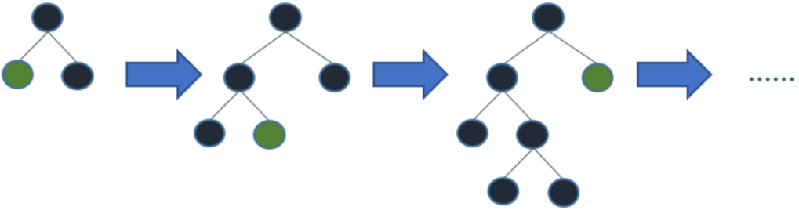
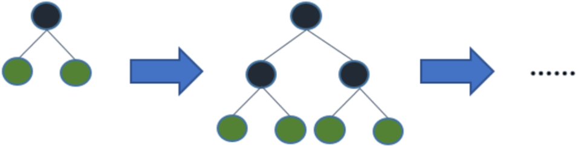
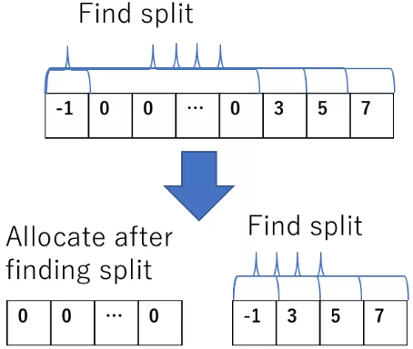
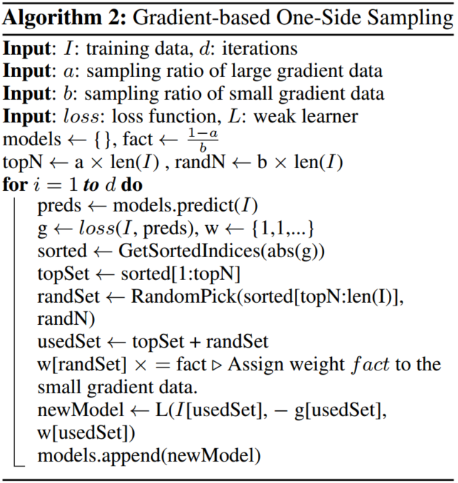
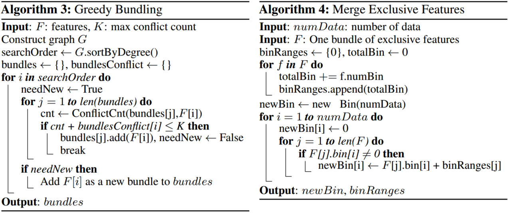

# LightGBM

&emsp;&emsp;在Kaggle，KDD等各类数据竞赛中，无论是分类问题还是回归问题亦或是排序问题，以GBDT（分类回归决策树）为基础的梯度提升树，如XGBoost、LightGBM、Thunder Boost等均占有无撼动的主导地位。尤其是在数据维度（属性）较少时，特征工程加XGBoost的pipeline几乎已经成为了各类比赛的冠军方案。不得不说先验知识再加上“分而治之”的方法在特征维数较低且易于表示时仍然具有“解释性好”、精度高、速度快等深度神经网络无法媲美的优点（深度神经网络真正取得突破的是在图像和语音这类特征抽象，表征困难其过去进步较小的领域，而NLP中深度网取得的进步仍然有限，这一方要归咎于数据量的不足，但还有一点是语言的学习从小开始，其已经拥有大量的人工知识）。

## Introduction

&emsp;&emsp;首先简单的回顾GBDT的思想（更加详细的介绍可以参看我的这篇笔记[集成学习中的XGBoost](https://zhuanlan.zhihu.com/p/51666869)）。对于决策树的构建主要分为两类方法，即深度优先（损失更小，与广度优先相比，在leaf数目相同时树根深，因此容易造成过拟合，但是构建过程更加灵活且容易在大规模数据集上使用）和广度优先（树的构建更加平衡，但是精度较差），决策树通过“分而治之”的思想将样本进行分类。在决策树构建的过程中最困难且最耗时的就是结点的分裂，这里不同的分裂策略即对应了不同版本的决策树，如根据信息增益构建ID3，根据信息增益率构建C4.5，根据Gini index构建CART等，split策略的不同也将带来decision tree的不同偏好。然而单一的决策树其性能有限，且容易造成过拟合，而通过剪枝或限制树深等手段虽然能在一定程度上缓解overfitting，但是其精度也将受到损失。因此，研究人员便以决策树为基学习器，通过集成的思想来提升模型的性能，梯度提升决策树就是典型代表，此外包括AdaBoost、Random Forest等均被广泛采用。

 

 
图1. 深度优先 VS 广度优先

&emsp;&emsp;GBDT通过迭代生成每一棵树，每次迭代中通过拟合前一棵树的残差使得精度不断提高，而树的构建则是使损失函数的负梯度方向为指导原则。然而在每次计算最佳split point时算法需要遍历所有数据计算split criterion，这严重制约了算法的速度，因此我们有必要对此改进。

## Algorithm

&emsp;&emsp;无论是XGB还是LGB均以GBDT为基础，而GBDT构建的最大困难即使分裂点的选择，而原始的做法需要算法遍历每一属性的所有数据点计算寻找最优解，该操作的复杂度为$O(n_{data}n_{feature})$，因此当数据量较大且特征较多时，其成本将难以接受。同时我们也观察到，算法时间成本与分裂次数正相关而分裂过程中的微小改变不会引起结果的巨大变化，因此基于直方图的分裂方法则是将特征值划分为块，以bin为最小单位进行分裂而不直接对每个特征值进行计算。此操作直接将算法的复杂度减小为$O(n_{data},n_{bins})$，同时内存空间也显著减少，然而对于bin数量的选择将带来速度与精度的trade-off。此外，bin的划分方式也多种多样，最简单的则是等间隔划分，然而对于分布不平衡的数据这将带来很大问题。故XGBoost对于bin的划分则采用gradient statistics的策略，使其更加平衡。另外，在split过程中经常会出现数据稀疏的问题，XGB和LGB则均是首先忽略所有0元素，然后将缺失数据分配至分割的任意一边，以减少损失加快训练速度。

 

 
图2. split

&emsp;&emsp;相较于XGBoost，LightBoost最大的改进啊包括以下两点：

- Subsampling the data: Gradient-based One-Side Sampling(GOSS)
- Exclusive Feature Bundling(EFB)

&emsp;&emsp;（1）GOSS

&emsp;&emsp;对于所有的数据样本，其在树的训练过程中贡献度大小不一，拥有较小提度提升的样本意味着其已被拟合的足够好，因此贡献程度较小，而我们真正需要关注的是那先梯度较大的样本。因此最简单的想法是在计算分裂时对数据进行采样，忽略那些梯度较小的数据。然而该操作将带来改变数据分布的风险，而使得习得的模型将有所偏好。因此为缓和或避免这一风险，LGB同时也在梯度较小的样本中进行随机采样，同时在计算其对损失的contribution时，赋予更大的权重。故GOSS本质上是一种对任意分布依照重要度进行采样的技术。

 
图3. Gradient-based One-Side Sampling

&emsp;&emsp;从上图可以看出，对于梯度较小的数据我们从中随机采样，比利为“$b$”，同时为其赋予权值$\frac{1-a}{b}$。而对于梯度较大的数据我们则选择loss提升最大的前“$aN$”个样本。

&emsp;&emsp;（2）EFB

&emsp;&emsp;此外，原始高维数据一般较为稀疏，即其中存在大量相互依存或相互排斥的特征（多个特征不能同时取非0值，one-hot编码），这就启示我们可以将多个特征进行合并（“bundled”）处理而不损失任何信息（类似PCA）。然而在所有的特征中找到最有效的bundle方式是NP难问题，因此作者将其转化为图着色的问题，则使用了一种近似的贪心算法，即允许特征间存在一定的重叠（个特征并非完全独立），如下：

 
图4. EFB

&emsp;&emsp;如上图所示，我们以每个feature作为图节点，将各feature间的总冲突（反映特征间的互斥程度）作为边，构建图。特征的合并问题即转化寻找最小bundles的问题（允许一定的重叠）。而当bundles确定后，每一个bundle其各个特征的取值范围都会有所差别，所以在进行特征融合时为使各个特征取值不发生重叠（即保证各特征的差异性），我们对其进行偏置处理，重新分配各特征的取值范围以保证各特征间取值互不相同，然后进行合并。

&emsp;&emsp;综上，通过对梯度提升较小样本进行随机采样操作和合并相关属性操作，LightGBM在保证精度的前提下获得了一定的加速。

## Reference

[[1] keitakurita. LightGBM and XGBoost Explained](http://mlexplained.com/2018/01/05/lightgbm-and-xgboost-explained/)

