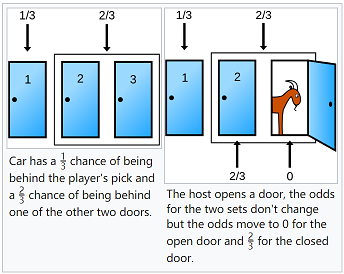
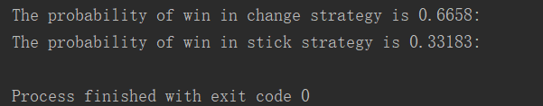

# Monty Hall Problem（三门问题）

## 1. 问题引入

&emsp;&emsp;Monty Hall Problem 源于美国的一档电视节目《Let's Make a Deal》，其中Monty Hall 是这个节目的主持人。

&emsp;&emsp;Suppose you're on a game show, and you're given the choice of three doors: Behind one door is a car; behind the others, goats. You pick a door, say No. 1, and the host, who knows what's behind the doors, opens another door, say No. 3, which has a goat. He then says to you, "Do you want to pick door No. 2?" Is it to your advantage to switch your choice?[1]

&emsp;&emsp;假如你在参加一个游戏，有三扇门1、2、3：其中有一扇门后面放着一辆汽车，另外两扇门后面是山羊，你会赢得你选择的那扇门后面的礼物。游戏开始时，你任意选择一扇门，假如为门1。主持人从剩余两扇门中选择一扇后面不是汽车的门打开，比如为门3，现在主持人问：为了赢得车，是否要改选门2（另外一扇没有被打开的门）？

&emsp;&emsp;对与上述问题，人们反映的第一直觉是换或不换最终的结果均相同，即均有$\frac12$的概率赢得汽车。然而正确的结论确是当选择更换后将有$\frac12$的概率赢得汽车，而不换的概率只有$\frac13$，即更换后会有更大概率赢得汽车。非常反直觉是吧，但事实确是如此。该问题当时在美国引起了广泛讨论，甚至连一些大学教授也不相信结果，有不少小学发动学生进行蒙特卡洛模拟实验，但最终结果确实为$\frac12$和$\frac13$。接下来，我们从几个角度分析该问题。

## 2. 问题求解

### （1）枚举法

&emsp;&emsp;这里我们假设第一次选择的为第一道门，其所有可能结果和最终赢得汽车的情况如下表所示：

| door 1 | door 2 | door 3 | Sticking | change   |
| ------ | ------ | ------ | -------- | -------- |
| goat   | goat   | car    | win goat | win car  |
| goat   | car    | goat   | win goat | win car  |
| car    | goat   | goat   | win car  | win goat |

&emsp;&emsp;统计得，当选择更换时，其赢得汽车的概率为2/3，当坚持初次选择时，其赢得汽车的概率为1/3。

&emsp;&emsp;几种解释：①假设我们第一次选择1号门，则车在1号门后的概率为1/3，换言之车在另外两扇门后的概率为2/3，此时如果我们选择另外两扇门赢得车的概率即为2/3。注意这里有一个前提条件，即主持人必须打开了一扇有羊的门（该操作并未改变选择另外两扇门赢得羊的概率为2/3这一事实）。因此，如果我们选择更换，即意味着我们同时选择了2，3号门，只不过其中一道门已经被主持人排除。因此，我们选择更换赢得汽车的概率为2/3，而坚持最初选择的因得汽车的概率仅为1/3。，如下图所示:

 
图1.Monty Hall

&emsp;&emsp;②此外，我们还可以将原问题推广至10000扇门的情况。即存在10000扇门，其中只有1扇后为车，其余全为羊时，若此时你选择1号门，则选中车的概率仅为万分之一。当主此人排除9998扇门后，问你是否选择更换。你是仍要坚持最后万分之一的随意选择，还是更换为主持人一波操作猛如虎后的99999种选择？答案应该显而易见了。

### （2）全概率

&emsp;&emsp;这里首先回顾全概率公式，记$P(A|B)$为在事件B发生的条件下事件A发生的概率，则根据乘法定理知：

$$
P(AB)=P(B)P(A|B)=P(A)P(B|A)
$$

&emsp;&emsp;将上式推广至A，B，C情形，则有：

$$
P(ABC)=P(A|BC)P(BC)=P(B|AC)=P(C|AB)=P(AB|C)P(C)=P(AC|B)P(B)=P(BC|A)P(A)
$$

&emsp;&emsp;这里我们假设，Monty选择1号门为事件A1，即$P(A_1)=1$，主持人打开3号门为事件B3，车在1，2，3号门后分别为事件C1，C2，C3，则有：

- 车在1号门后，Monty选择1号门，主持人打开3号门的概率为：$P(B3|A1C1)=1/2$；
- 车在2号门后，Monty选择1号门，主持人打开3号门的概率为：$P(B3|A1C2)=1$；
- 车在3号门后，Monty选择1号门，主持人打开3号门的概率为：$P(B3|A1C3)=0$；
- 其中车在任意1，2，3号门后的概率为$P(C1)=P(C2)=P(C3)=1/3$；
- 而Monty事先并不清楚车在哪扇门后，因此Monty选择哪扇门与车在哪扇门后这两事件相互独立，即$P(A_iC_i)=P(A_i)P(C_i)$；
- 此时若不考虑前提条件，即主持人必须保证所开门后为必须为羊时，则在Monty选择1号门后主持人可以任意选择打开另外两扇门中的其中一扇，此时有：$P(B3|A1)=1/2$；
  
&emsp;&emsp;综上所述，根据全概率公式则有：

$$
P(C2|A1B3)=\frac{P(C2A1B3)}{P(A1B3)}=\frac{P(B3|A1C2)P(A1C2)}{P(B3|A1)P(A1)}=\frac{1 * P(A1)P(C2)}{\frac{1}{2} \times 1}=\frac{1\times1\times\frac13}{\frac{1}{2} \times 1}=\frac{2}{3}
$$

&emsp;&emsp;则此时若在Monty选择1号门，主持人打开3号门的条件下，车在2号门后的概率为2/3。因此选择更换选择赢得汽车的概率为2/3。

### （3） Monte Carlo methon

&emsp;&emsp;利用Python编写蒙特卡洛，代码如下：
<pre>
"""
This script is about the monte carlo method of the Monty Hall problem, Creating by Peter Lee On October 22, 2018s.
"""
import random

def Monty_Hall_simulation(strategy, simulation_number):
    wins_count = 0
    # Simulated 100000 times based on monte carlo
    for i in range(simulation_number):
        # 0 means car and 1,2 means goats
        choice_list_init = [0, 1, 2]
        first_choice = random.choice(choice_list_init)
        # According to the precondition, the compere helps us eliminate an error option, so the sample must include the
        # car and a goat.
        if first_choice == 0:
            # the first time we choice the car
            sample_space = [0, random.choice([1, 2])]
        else:
            sample_space = [0, first_choice]
        # Counting the simulation results on the condition of stick the first choice or change the choice.
        if strategy == 'stick':
            result = first_choice
        if strategy == 'change':
            sample_space.pop(sample_space.index(first_choice))
            result = sample_space[0]
        if result == 0:
            wins_count += 1
    win_probability = round(wins_count/simulation_number, 6)
    print("The probability of win in {0} strategy is {1}: " .format(strategy, win_probability))

Monty_Hall_simulation('change', 100000)
Monty_Hall_simulation('stick', 100000)
</pre>

&emsp;&emsp;根据问题使用蒙特卡罗计算机模拟最终结果，这里记0，1，2分别表示车，羊，羊。在主持人打开一扇为羊的门后，最后我们分别采用换和坚持的策略赢得汽车的概率如下：

图2.蒙特卡洛模拟结果

## 3. 问题引申

&emsp;&emsp;假设有N扇门，其中一扇门后有车，其余全为羊。则在主人打开m扇有羊的门后Monty选择更换赢得汽车的概率为$\frac{N-1}{N(N-m-1)}$。对比坚持最初选择赢得汽车的概率$\frac{1}{N}$，采用更换的策略显然赢得汽车的概率更大。然而注意到当N很大且m很小时，此时即使选择更换赢得汽车的概率仍很小。若在主持人排除m=N-2扇门后，此时更换赢得汽车的概率为$1-\frac{1}{N}$，即当N越大，赢得汽车概率越高。

## 几点思考：

&emsp;&emsp;（1）

[[1] Monty Hall problem - wikipedia](https://en.wikipedia.org/wiki/Monty_Hall_problem)

