# NER model

## 1. Information

&emsp;&emsp;命名实体识别（Named entity recognition）作为NLP的最基本任务，其早在上世纪80年代就已被广泛研究，今年来随着以神经网络为主导的Deep learning复苏，NER任务精度被不断提高。NER问题即为从句子中识别出专有名词，如人名、地名、组织机构名等等，其本质上为序列标记问题，有关NER的详细介绍可以参考我的这篇笔记[NLP中的序列标注问题（隐马尔可夫HMM与条件随机场CRF）](https://zhuanlan.zhihu.com/p/50184092)。这里将简单介绍较新的几个NER模型。

## 2. Chinese NER Using Lattice LSTM

### 2.1 Motivation

&emsp;&emsp;这篇文章为2018年ACL的工作，其主要是针对中文的命名实体识别任务。对于英文这类由拉丁字母组合而成的语言，其单词与单词间存在天然的边界，而每个单词又是由不同的字母组成，因此对于英文的NER其不需要进行分词处理，而且将各个character进行embedding的操作早已有之。然而对于中文而言首先分词质量的高低往往就直接影响了downstream tasks的性能（对于分词任务其主要的难点为OOB问题，即对于未登录词的处理，其次是歧义的问题），但是若直接使用单个汉字则又无法充分挖掘句子中潜在的句法结构语义信息，其效果往往不好（但是最近ACL2019有文章指出，对与中文的许多任务不分词的效果要好于分词的效果），因此对于中文NER其效果相对英文较差。之前中文的NER model一般均是直接利用word（分词的结果）或character（单个字）作为input，而本文作者则创新性的提出了Lattice LSTM model将character和word的embedding结合实现中文的NER，如图1，该方法在许多数据集上均获得了较好的结果。

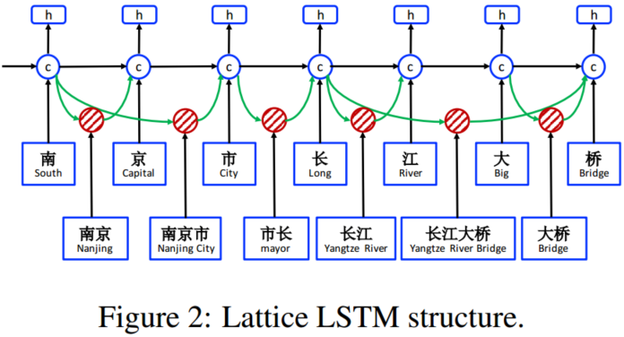
 
图1. Lattice LSTM Structure

### 2.2 Model

&emsp;&emsp;如图1所示，该模型大体上可以分为四个部分：character-based model实现对单个字的表示；word-based model实现对词的表示；lattice model字词的联合表示；最后在加CRF得到最终结果的概率分布。其中character-based model和word-based model均是embedding+LSTM的结构，具体如下

#### 2.2.1 character-based model

&emsp;&emsp;character-based model即是将每一个字进行embedding后过一个双向的LSTM得到其最后的表示，如图2：

 
图2. character-based model

&emsp;&emsp;具体有关LSTM的介绍可以参考我的这篇笔记[从RNN、LSTM到Encoder-Decoder框架、注意力机制、Transformer](https://zhuanlan.zhihu.com/p/50915723)。

&emsp;&emsp;这里值得注意的是与一般的方法不同，考虑到各个汉字并非孤立存在，其真实的含义与上下文密切相关（如“长城”和“长高”，同一个“长”字前者为名词，后者为动词含义不同），为充分挖掘每个字的实际含义，一般在对character进行embedding时会考虑其自身和其上下文的内容，即存在一定的overlap。这里作者借鉴Chen et al., 2015; Yang et al.,2017a的工作使用char+bichar作为character embedding，如下：

$$
x_j^c=[e^c(c_j);e^b(c_j,c_{j+1})]\tag{1}
$$

&emsp;&emsp;上式中，$e^c(c_j)$即为第$j$个字的embedding，可以看到最终第$j$个子的embedding$x_j^c$由其本生的embedding和其与其后一个字组成的bichar embedding拼接而成。即vector（南）=【embedding（南）；bichar_embedding（南，京）】。在得到个字的char+bichar embedding $x_j^c$后作者又再接一个trick，即char+softmax。

&emsp;&emsp;考虑到每个字在每个词中的含义和位置可能不同（如，“组成”和“一组”，前者位于词的开始（Begin，B），后者位于词的结尾（End，E）），为充分挖掘各字的含义作者借鉴Zhao and Kit, 2008; Peng and Dredze, 2016的工作，使用softmax得到各字的位置（BMES）embedding，如下：

$$
x_j^c=[e^c(c_j);e^s(seg(c_j))]\tag{2}
$$

&emsp;&emsp;式（2）中的$seg(c_j)$即为字$c_j$的position label，而$e^s(seg(c_j)$即为position label embedding，BMES table。通过将character embedding与position label embedding拼接即得到最后的character embedding，如vector（南）=【embedding（南）；BMES_embedding（seg（南））】=【embedding（南）；BMES_embedding（B）】。

#### 2.2.2 word-based model

&emsp;&emsp;word-based model部分作者分别介绍了三种模型即word + char LSTM，word + char LSTM'和word + char CNN。其中word根据词典确实。

&emsp;&emsp;（1）word + char LSTM

&emsp;&emsp;还是为了充分利用sentence的潜在信息，作者使用bilstm得到的char representation与word embedding拼接的方式得到最后的word embedding，如下：

$$
x_i^w=[e^w(w_i);x_i^c]\\
x_i^c=[\overrightarrow{h}^c_t(i,len(i);\overleftarrow{h}^c_t(i,1))]\tag{3}
$$

&emsp;&emsp;上式中$x_i^c$即为bilstm得到的char representation。如vector（南京）=【embedding（南京）；bilstm（南，京）】。

&emsp;&emsp;（2）word + char LSTM’

&emsp;&emsp;word + char LSTM’区别于word + char LSTM，其不仅利用各个character的bilstm representation同时还结合各个word的bilstm representation（充分考虑上下文），如下图所示：

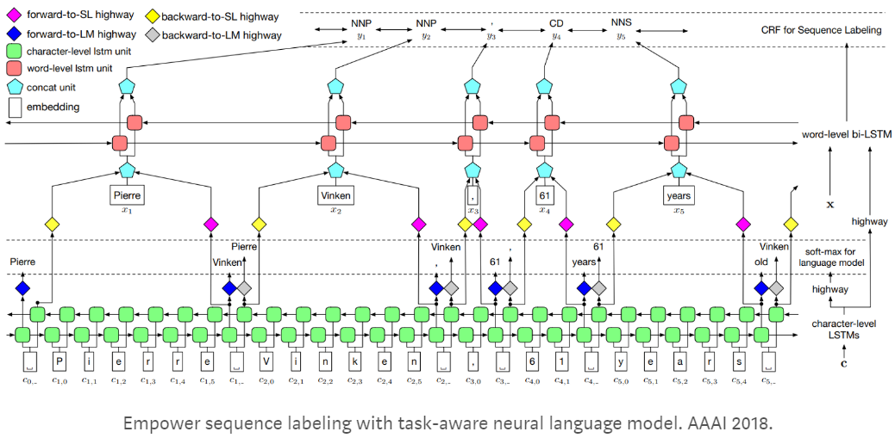
 
图3. word + char LSTM’ model

&emsp;&emsp;这里需要注意的是与原始的word + char LSTM’ model不同文中的模型作者省去了highway结构。

&emsp;&emsp;（3）word + char CNN

&emsp;&emsp;区别于LSTM，这里近似使用CNN来表示character representation，其中kernel size为3，卷积后接max pooling操作，这里不过多介绍。

#### 2.2.3 Lattice Model

&emsp;&emsp;Lattice Model主要作用就是将上述的word representation和character representation进行组合，而具体的实现方法作者即涉及了一个gate（其本质上就是加权求和，路由机制），如图5所示：

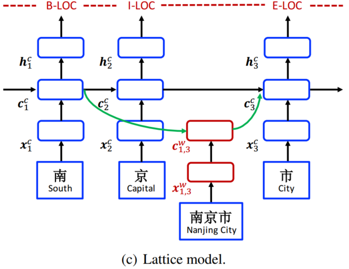
 
图4. Lattice Model

&emsp;&emsp;如图4所示，其中word的确定主要是依赖词典的质量，当然在实际情况中会出现多种分词的结果，如下：

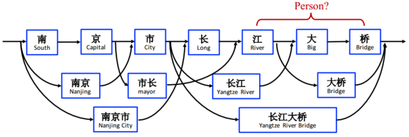
 
图5. segmentation

&emsp;&emsp;这里作者将每一个候选词汇均考虑进来，即将每一个词汇均与单字进行结合，如“长”结合“长江”，“江”结合“长江大桥”，“大”结合“大桥”。而结合的方式则采用加权求和：

$$
c_j^c=\sum_{b\in {b'|w^d_{b',j}\in D}}\alpha_{b,j}^c\bigodot c_{b,j}^w+\alpha_j^c\bigodot \tilde c_j^c\\
\alpha_{b,j}^c=\frac{exp(i_{b,j}^c)}{exp(i_j^c+\sum_{b'\in {b''|w^d_{b'',j}\in D}})exp(i^c_{b',j})}\\
\alpha_{j}^c=\frac{exp(i_{j}^c)}{exp(i_j^c+\sum_{b'\in {b''|w^d_{b'',j}\in D}})exp(i^c_{b',j})}\\
i_{b,e}^c=\sigma(W^{lT}\begin{bmatrix}x_e^c\\c_{b,e}^w\end{bmatrix})\tag{4}
$$

&emsp;&emsp;$W^lT,b^l$为模型参数，$x_e^c,c^w_{b,e}$分别为character和word的LSTM cell，而$i_{b,e}^c$即为cell $c_{b,e}^w$的additional gate。从上式可以看出最后输入lstm的cell $c_j^c$融合了word和的charactercell $c_{b,j}^w,\tilde c_j^c$信息，而信息的多少则是由权值$\alpha_{b,j}^c,\alpha_j^c$控制。其中权值的计算则由$i_{b,j}^c$在所要分词结果中的重要程度确定。

#### 2.2.4 CRF

&emsp;&emsp;最终Lattice Model的输出$h$经过最后一层CRF得到每个字的标签的概率分布，使用viterbi algorithm 计算所有可能的标记组合中，概率最大即为最终的输出。其损失函数如下：

$$
L=\sum_{i=1}^Nlog(P(y_i|s_i))+\frac{\lambda}{2}||\Theta||^2\tag{5}
$$

&emsp;&emsp;从式（5）中可以看到作者使用二范进行正则化，此外需要指出的是实际因为negative log-likelihood。

### 2.3 Experiments

&emsp;&emsp;作者分别使用OntoNotes, MSRA, Weibo NER, Chinese resume这四个数据集进行测试，其中Chinese resume为作者自己准备的有关中国股市的Sina Finace数据。其实验结果如下：

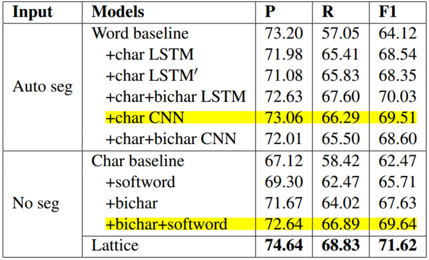
 
图6. experiment 1

&emsp;&emsp;从上图可以发现对于自动分词的结果CNN表现最好，而对于未分词的结果，当融入了bichar和softwood trick后其结果将要优于自动分词的结果。同时Lattice的效果最棒。

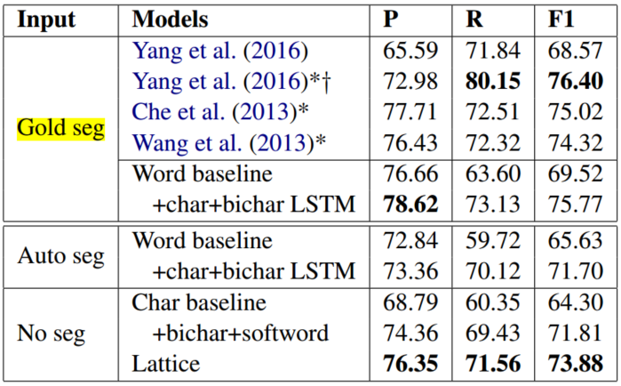
 
图7. experiment 2

&emsp;&emsp;上图为Onto Notes数据集上的实验结果，其中Gold seg为手工分词的结果。可以看到Lattice和融合了char和bichar LSTM的模型结果间还是有较大的差距，可见较好的分词结果仍是阻碍中文NER的瓶颈。

### 2.4 Conclusion

&emsp;&emsp;作者利用LSTM对character和word进行特征表示，然后加权求和。该方法其本质上还是希望挖掘字、词间的潜在信息和特征。可以看到目前的NER方法主要包括两个方向：一是设计新的模型充分挖掘句子间、上下文中的潜在信息，进行各种特征融合；二是融合大量的外部数据、信息，先验知识，提升精度。现在来看，第二个方向对于精度的提升效果更加显著且目前各大厂都在第二个方向投入了大量的成本，但是对于自然语言处理，是不是说通过数据的累积就能不断的提高任务精度，而不会是向image classification COCO数据集那样存在bottleneck呢？就目前来看现在的自然语言处理的各种模型虽然在某些小部分数据集上表现得很好，但是其文字背后真正的含义却根本没有理解，而想要实现真正的智能，其还得需要更棒的方法，尤其是在生成式任务中要有所突破。

## 3. Neural Adaptation Layers for Cross-domain Named Entity Recognition

### 3.1 Motivation

&emsp;&emsp;在自然语言处理的很多任务中一个很general的问题即对于不同邻域间的迁移学习。目前的大多数模型或研究方法均是针对某一些较小邻域的数据集所设计的，而所获得的精度和结果也均是针对特定邻域调出来，当将这些模型运用到其它的数据中时其性能将大大折扣。因此对于迁移学习的研究至关重要，目前对于NER任务主要的transfer learning模型包括INIT和MULT等，如图8所示：

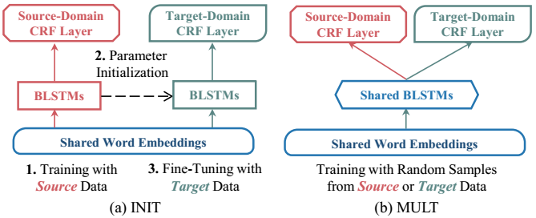
 
图8. INIT&MULT

&emsp;&emsp;从上图可以看到，对于INIT模型对于source domain和target domain均使用相同的word embedding，然后利用target label data在pre-training的model（BLSTM+CRF）进行fine-tuining得到目标邻域的模型。而MULT则是利用multi-task learning，根据source domain和target domain data同时训练source model和target model，而其除CRF层外其它参数共享。而上述这两种模型均存在以下三种缺点：

- target domain和source domain的词汇含义尤其各自专有邻域的语境决定，并不会完全相似。例如，对于模式识别邻域LDA可能是指线性判别分析，而对于文本数据挖掘邻域LDA更多是指潜狄利克雷配分模型。此外专有邻域的OOV（out-of-vocabulary）问题也是一大挑战。若简单的让source domain和target domain公用相同的word embedding显然是不太合适的。
- 为克服问题1现有的模型往往根据target domain data对source domain word embedding进行retraining。然而往往source domain corpora十分庞大，若要在此基础上进行再训练其成本往往较高，因此这将在一定程度上限制迁移学习的发展
- 现有的模型如INIT其只对最后的CRF层进行再训练，且任务通过CRF就能较好的捕获不同邻域下的语义信息，这显然并不具有十分充足的说服力。

&emsp;&emsp;因此针对上述三类问题，作者在原始的BiLSTM+CRF的基础上分别增加了word adaptation layer,sentence adaptation layer和output adaptation layer，最终取得了更优的结果，如下：

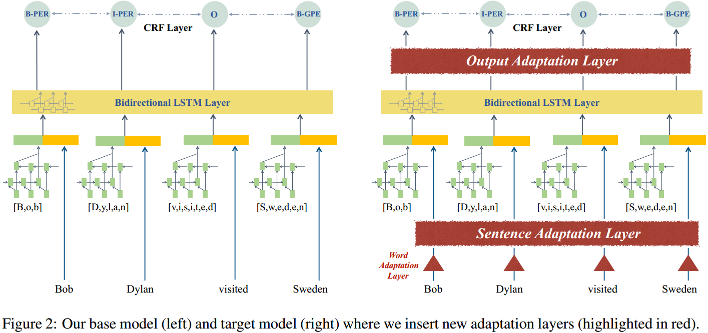
 
图9. base model & model adaptation

### 3.2 Model

&emsp;&emsp;如图9所示，该模型主要是以BiLSTM+CRF为base model（既包括每个word种character的LSTM representation，同时又包括各个word上下文间的representation），在其中插入word adaptation layer,sentence adaptation layer和output adaptation layer。具体如下：

&emsp;&emsp;（1）Word Adaptation Layer

&emsp;&emsp;针对问题一、二，我们既想利用target domain和source domain的不同数据以学习特定领域下的不同word embedding，同时又不想对巨大的source domain corpora进行在训练，因此一个自然的想法就是将target embedding与source embedding关联起来，故作者设计了Word Adaptation Layer。

&emsp;&emsp;首先作者针对在source data和target data中出现频率均较多的词创建词典$P_1$，$P_1={(w_s,w_t)|w_s=w_t,f(w_s)\leq \phi_s,f(w_t)\leq \phi_t}$。其中$w_s,w_t$分别为source word和target word，$f(w_t),f(w_s)$为source word和target word分别在其各自corpus中出现的频率。$\phi_s,\phi_t$为阈值。此外，作者还指出我们可以根据需求致指定特定的vocabulary构成$P_2$。因此最后的词典即为$P=P_1\cup P_2$，论文中指出$P_1$为target vocabularies中出现频率最高的5K个词，而对于$P_2$作者选择使用现有的twitter标准化词典（Liu et al., 2012），共3802个词。得到词典后我们现在要建立其targe word representation与source word representation间的连接，即完成两个空间的相关映射，一个很基本的方法即投影矩阵。如下：

$$
argmin_Z \sum_{i=1}^{|P|}c_i||V_T^{*i}Z-V_S^{*i}||^2\tag{6}
$$

&emsp;&emsp;式（6）中$Z$即为投影变化矩阵，$c_i$为confidence cofficient，其计算公式如下：

$$
\overline{f}(w_s)=\frac{f(w_s)}{max_w'\to X_S f(w')}\\
\overline{f}(w_t)=\frac{f(w_t)}{max_w'\to X_T f(w')}\\
c_i=\frac{2\cdot \overline{f}(w_s^i)\cdot \overline{f}(w_t^i)}{\overline{f}(w_s^i)+\overline{f}(w_t^i)}\tag{7}
$$

&emsp;&emsp;式（7）中$\overline{f}$为归一化系数和Sørensen-Dicecoefficient“交并比”，用以衡量each word pair的重要程度。

&emsp;&emsp;观察式（6），我们的目标即是习得最优的变换矩阵，使得其将target vector representation转换后与source vector representation的差异最小。

&emsp;&emsp;（2）Sentence Adaptation Layer

&emsp;&emsp;word adaptation layer仅仅是在单词层面上关联target domain和source domain，这远远不够。为充分挖掘context信息解决mismatch的问题，作者这embedding后再接一层BLSTM layer为Sentence Adaptation Layer对projected word embedding进行编码，以学习target-domain 上下文信息，然后送入后续网络进行处理。同时该layer可以根据上下文调整OOV的representation，其很好的避免了将OOV表示为同一固定embedding的问题。

&emsp;&emsp;（3）Output Adaptation Layer

&emsp;&emsp;target domain label和source domain label会出现分布不一致的问题。此外，语境的不同也将导致相同word拥有不同label的情况。因此re-classifiacation和re-recognition是十分必要的，因此作者又在target domain CRF前插入BLSTM Output Adaptation Layer捕获输出的上下文信息，因此最终的网络结构如下：

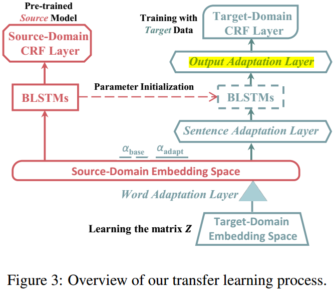
 
图10. transfer learning process

### 3.3 Experiments

&emsp;&emsp;作者对于不同的layer是由不同的learning rates，同时对于source domain指定为news wire（NewYorkTimes and DailyMail articles）而target domain指定为social media（Archive Team’s Twitter stream grab），同时利用GloVe训练词向量。实验结果如下：

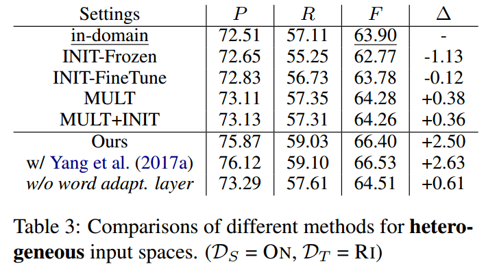
 
图11. word embedding for heterogeneous input spaces

&emsp;&emsp;其中$D_S$为OntoNotes-nw，$D_T$为Ritter11，图11实验结果表明，若添加word adaptation layer其较原有模型相比，对于异质数据的提升较大。这充分说明了word adaptation layer的作用。此外在Yang et al. (2017a) 模型中插入该结构其效果最佳，但同时retraining带来的成本也较大。

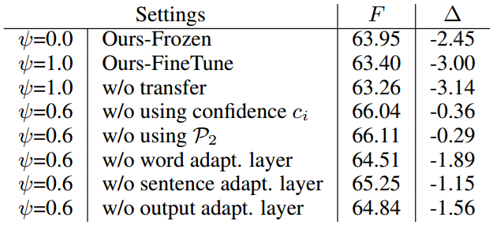
 
图12. different setting

&emsp;&emsp;图12显示模型的各个layer均对结果的提升有一定帮助，尤其是针对heterogeneous data的fine tune其帮助最大。

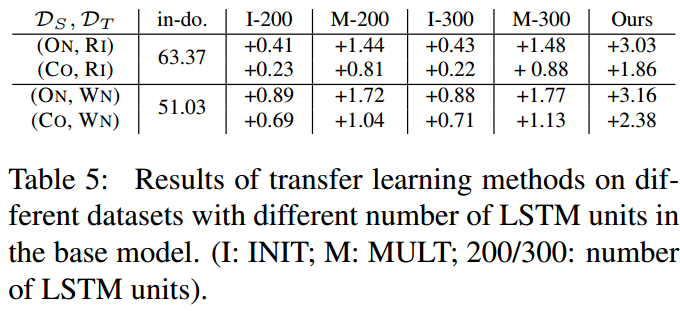
 
图13. different parameters

&emsp;&emsp;此外由于作者设计的模型较之前的模型相比其层数更多，参数更多。为探究结果的提升是否为参数增加导致，作者比较了原始模型在不同hidden unit数目下的结果。可以看到随着hidden unit数目的增加，参数的增多，其结果均有提升，但是本文模型的提升更加明显，因此其在某一方面证明了结构的有效性，而非仅仅是参数增加带来的收益。

### 3.4 Conclusion

&emsp;&emsp;对比之前模型，作者提出的新方法确实是提高了最后的结果。但是其真正有说服力和较为创新的工作为word adaptation layer的提出，其在一定程度上解决了上述的三个问题。而对于后两个tricks其说服力不足，而且在实验中作者仅是增加了模型的hidden unti的数目，即“加宽”了模型。但是实际作者的设计是“加深”模型，而本来有实验说明在同样参数数目的情况下，“加深”模型所带来的收益要比“加宽”模型所带来的收益更多，因此其不能充分的证实该结构的有效性（个人更倾向于加深模型所带来的切实收益，而非作者间的解释的获得了更多的上下文信息）。此外，对于word adaptation layer其还能应用至其它的迁移学习任务中，而非仅仅局限于NER。

## 4. Reference

[[1] Zhang Y, Yang J. Chinese ner using lattice lstm[J]. arXiv preprint arXiv:1805.02023, 2018.](https://arxiv.org/abs/1805.02023)

[[2] Lin B Y, Lu W. Neural adaptation layers for cross-domain named entity recognition[J]. arXiv preprint arXiv:1810.06368, 2018.](https://www.aclweb.org/anthology/D18-1226)

