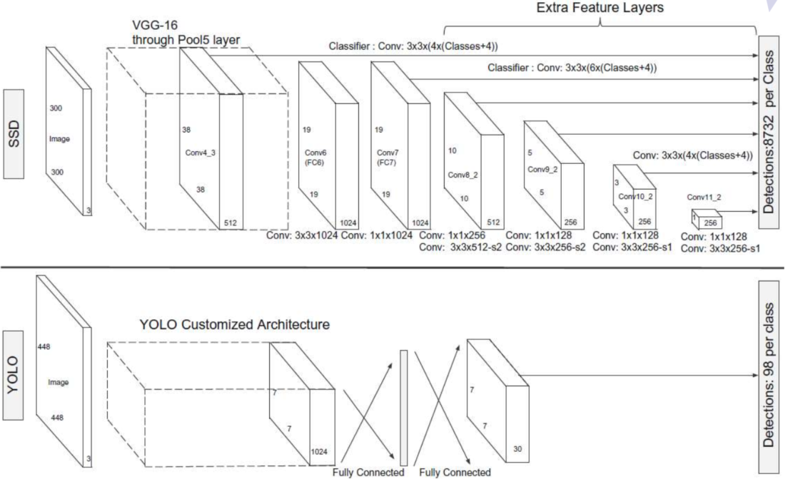

# Object Detection

## 1. Introduction

&emsp;&emsp;目标检测任务是计算机视觉中的重要组成部分之一，在人脸识别、自动驾驶等领域有着广泛的应用。在深度学习并未复兴之前，目标检测任务的基本流程一般包括这样几个步骤：首先手工设计特征描述子，如颜色直方图、SIFT特征，人脸检测中则一般偏向使用LBP算子、gabor小波等，然后基于固定大小的多个滑动窗口进行尺度搜索，或基于特征金字塔进行不同尺度的检测，最后将region proposal送入分类器，如SVM+AdaBoost进行识别检测。早期这种基于手工设计特征描述子，利用固定窗口和浅层模型进行目标检测的pipeline结构存在大量问题，如特征设计复杂、数目较多，sift特征对于每一个关键点均将会产生128维特征，不同大小尺度的检测框将产生数百万个候选区域等等，这无疑将导致计算量过高，模型鲁棒型较差，识别精度不高等诸多缺点。而如今基于深度网的目标检测任务通过End2End的训练方式克服了原有pipeline结构的缺点，使得人工智能技术能够迅速落地，并迅速运用至现实生活中产生价值。pipeline与End2End结构对比如下所示：

 
图1. 检测模型对比

## 2. Framework

&emsp;&emsp;如今深度学习目标检测任务中主流的检测框架主要包括以下两种：

- （1）以R-CNN，Fast R-CNN，Faster R-CNN等为代表的两阶段结构。该结构首先基于锚点生成若干Region Proposal，然后进行检测框的合并调整，最后给出分类结果。该类方法检测精度较高但是速度较慢，尤其是早期的R-CNN网络对于生成大量（2000左右，与滑动窗口方法相比，数目仍少的多）的检测框均需判断，可能一张图片需要花费数十秒的时间，难以满足实时性要求；
- （2）以YOLO、SSD等方法为代表的Single-Shot结构。该结构为真正的端到端训练，速度快（一秒钟数十张图片）但与Faster R-CNN相比牺牲了些精度。

 

图2. 目标识别主流检测框架 

## 3. Two Stages Detection 

### 3.1 R-CNN

&emsp;&emsp;R-CNN网络的主要结构如下所示：

 
图3. R-CNN

&emsp;&emsp;如上述所示其主要包括两个阶段：Region Proposal的生成和Region Proposal的分类。具体来说在候选区域的生成中主要是利用selective search的思想，即基于相似度进行层次化和并，而对于候选区域的特征提取阶段我们可以使用任一图像领域的深度网模型，如AlexNet，ResNet，Inception-v3、v4等等，最好我们可以利用SVM或外接Softmax等等，对候选区域进行分类同时对边框进行校准。如下：

- Step1. Selective Search

 
图4. selective search

&emsp;&emsp;如上图所示，在候选区域的生成过程中其通过选择型搜索，计算像素纹理同时将相似像素进行层次化合并，已得到region search。该方法本质上是像素级别的图像分割，此过程为无监督的训练，将会生成2000个左右的region。

- Step2. CNN特征提取

&emsp;&emsp;该过程利用CNN网络对上述获得的候选区域进行特征提取。首先将region缩放至相同大小：$227\times 227$，然后送入CNN网络中（可以为AlexNet或V3）提取特征，此步骤中我们可以利用Pretraining和Fine-tuning等技巧提高精度。最后将提取特征送入全连接层进行分类和边框校准。

- Step4. 分类和边框校准

&emsp;&emsp;对上述特征我们可以利用线性SVM针对每个类别单独训练进行二分类，同时也可以直接利用Softmax进行端到端的多分类。同时为使目标边框更加紧致以尽量减少背景区域，可以使用线性变换对边框进行校准。如下：

 
图5. 边框校准

&emsp;&emsp;R-CNN为深度学习在目标检测邻域的开山之作，其识别精度与传统方法相比有了大幅提高，但是该方法由于region proposal与feature extracted和recognition分开进行，且候选区域生成数目较多，因而速度较慢。此外其还要求region proposal尺寸一致，以进行特征提取，然而通过一定的缩放变换处理将导致图像失真，丢失大量原有信息或引入过多背景使得准确率下降，因而在后续的工作中将有许多模型对上述缺点进行改进。

### 3.2 SPPNet

&emsp;&emsp;R-CNN一个主要的缺点是需要对region proposal进行缩放处理使其尺寸一致，然后再进行卷积，这主要是因为全连接层要求输入向量维度一致。针对上述全连接层要求输入维度一致的问题何凯明团队设计SPPNet网络，其通过设计spatial pyramid pooling操作将输出特征缩放至大小一致（具体操作是对于任意大小的feature map将其分别划分为16，4，1块，然后对每块进行pooling，再concate得到fixed-length representation），这样即可不用进行放缩而处理不同尺寸的region。如下：

 
图6. 空间池化金字塔结构

&emsp;&emsp;在SPPNet中，其单一尺寸训练结果低于RCNN1.2%，但是速度是其102倍，5个尺寸的训练结果与RCNN相当，其速度为RCNN的38倍。SPPNet最大的亮点在于空间池化金字塔结构的设计，其使得网络将不在受限于输入图像的尺寸不一限制，而通过池化归一操作将输出向量变为相同长度，而且该结构可应用在任意的CNN网络结构中。然而，同R-CNN一样，SPPNet也需要训练CNN提取所有样本的特征，然后训练SVM分类这些特征，而所有的样本均需要存储在磁盘上，这需要巨大的存储空间。

### 3.3 Fast R-CNN

&emsp;&emsp;无论是在R-CNN、SPPNet中均包含对网络进行微调（R-CNN需对整个CNN网络进行微调，SPP-Net需对全连接层进行微调）、训练SVM分类以及训练边框回归模型这么几个单独的步骤。从中可以看出其训练过程繁琐、速度较慢，而且须将所有图像写入磁盘占用很大存储资源。对此Ross大佬将多个阶段整合与一体，同时引入multi-task，即将分类和边框回归任务同时进行，其模型结构如下：

 
图7. Fast R-CNN

&emsp;&emsp;具体来说，模型首先将原始图像以及RoI(region of interesting)同时作为输入，通过Conv以及RoI pooling操作提取出固定大小的特征图再接全连接层。然而与R-CNN和SPP所不同的是，其经过FCs后特征向量分为两支，一支过softmax层进行分类，另一只则过bbox regressor进行边框回归，此即为multi-task。通过上述pipeline操作，即可同时更新整个网络，且不需要来回读取磁盘文件，使得训练速度大幅提升。

&emsp;&emsp;另外作者对边框校准损失函数进行改进：

$$
smooth_{L_1}(x)=\begin{cases} 
0.5x^2\quad if |x|<1\\
|x|-0.5\quad otherwise\tag{1}
\end{cases}
$$

&emsp;&emsp;如上式所示，通过$L_1$损失函数对变宽进行回归其比SPPNet'$L_2$更加稳定，对异常值的敏感程度较小。

&emsp;&emsp;最后为加速全连接层，作者引入SVD分解技巧：

$$
W\approx U\sum_tV^T\tag{2}
$$

&emsp;&emsp;将一个大的全连接操作分解为两个小的全连接层，其时间复杂度由$O(uv)\to O(t(u+v))$。

&emsp;&emsp;虽然Fast R-CNN在速度上提升了许多，然而selective search的方法生成region proposal仍是在CPU上进行的，相对于GPU来说速度仍然较慢。对此又有学者提出了Faster R-CNN。

### 3.4 Faster R-CNN

&emsp;&emsp;为突破region proposal的速度瓶颈，Faster R-CNN通过引入RPN，直接使用CNN来生成region proposal，并且和第二阶段的CNN共享卷积层。其模型整体结构如下：

 

 
图8. Faster R-CNN整体框架

&emsp;&emsp;具体来说Region Proposal Network(RPN)网络通过定义一组不同大小和长宽比的Anchor Box对卷积特征图的每一个位置生成多个region proposal，同时输出anchor box的位置信息（$x,y,w,h$）以及该box的confidence（该区域中存在objection的分数），如下：

 
图9. RPN

&emsp;&emsp;我们通过定于不同大小、形状的anchor box即可获得不同的region proposal。具体来说文中对每一个位置使用了3个不同宽高比的3个不同大小，共9个锚点框。一旦我们提取出了region proposal，即可外接Fast R-CNN进行分类和边框回归。因此Faster R-CNN本质上可以认为是RPN和Fast R-CNN的结合。

&emsp;&emsp;另外对于Faster R-CNN模型的训练主要可以分为两种方式：

&emsp;&emsp;（1）交替式4步法训练：
- 基于预训练模型训练RPN；
- 基于预训练模型，以及上一步得到的RPN，训练Fast R-CNN；
- 固定共享的卷积层，训练RPN；
- 固定共享的卷积层，基于上一步得到的RPN，训练Fast R-CNN。
 
&emsp;&emsp;（2）端到端训练：
- 同时学习RPN和Fast R-CNN；
- Fast R-CNN的梯度不向RPN回传。

&emsp;&emsp;总体而言，Faster R-CNN较Fast R-CNN在速度上有了大幅提升，而且其精确性也达到了the state of the art。值得一提的是，尽管未来的模型能够在检测速度上有所提升，但是几乎没有模型的表现能显著超越 Faster R-CNN。换句话说，Faster R-CNN也许不是目标检测最简单、最快的方法，但是其表现还是目前最佳的。

&emsp;&emsp;综上，从R-CNN到Faster R-CNN其模型的精华主要包括两个方向：

- 化零为整：多任务学习，参数/计算共享；

 

- 由慢变快：SPP，RoI pooling，Truncated SVD；

 

### 3.5 Mask R-CNN

 
图10. CV task

&emsp;&emsp;Mask R-CNN是将Faster R-CNN扩展至图像像素级分割任务所提出的模型。具体来说其在Faster R-CNN中增加实例分割模块，输出一个二进制掩码来说明给定像素是否为对象的一部分，即设计RoIAlign操作代替RoIPool操作（通过双线性插值代替RoIPool的简单舍去），使得选择的特征图谱区域更精准地对应原始图像的区域，而避免发生些许的错位，如下：

 
图11. Mask R-CNN

&emsp;&emsp;Mask R-CNN在COCO数据集的三类任务：实例分割、边界框对象检测、以及人体关键点检测中均取得了顶尖的成绩。

### 3.6 Cascade R-CNN

&emsp;&emsp;众所周知，目标检测任务要求检测框越紧致越好，因此如何提高检测框的准确率（检测框与标注框交并IoU比越高越好）则是许多学者关心的问题，如下图所示：

 
图12

&emsp;&emsp;从图12中可以得出以下几点结论：

- Output IoU普遍高于Input IoU，即经过Detecor后性能将有所提高；
- 不同阈值$u$训练的Dector其曲线均有交叉，即并没有哪个Dector一定优于其它，相反我们可以看到在不同的Input IoU区间其$u$的选择很大程度上影响Dector的性能（分析发现当$u$与Input IoU值相匹配时效果最佳,即Input IoU取值在[0.5,0.6]区间类，u=0.5的效果最好）；
- 倘如我们增加阈值$u$，其将排除绝大多数proposal使得样本数目大大减少，过拟合问题严重，反而性能下降；

&emsp;&emsp;因此这也启发我们可以针对不同的Input IoU动态调整阈值$u$以提高性能，因此作者设计级联多个Detection Head，以逐步调整检测框，慢慢升高IoU，如下：

 
图13. Detection Head

 
图14

&emsp;&emsp;其中图14是采用相同的级联结构来对Box进行回归。这里设置单一阈值为0.5，从中可以看出其无法对所有proposal取得良好效果的。另外，proposal经过0.5阈值的detector后IoU都在0.75以上，再使用0.5这一阈值并不明智。这时候再使用同一个结构效果也不好。其次，从1st stage到2nd stage，proposal的分布其实已经发生很大变化了，2nd和3rd中的红点已经属于outliers，如果不提高阈值来去掉它们，就会引入大量噪声干扰使得精度明显降低。这也证明了我们需要使用不同的阈值$u$。

### 3.7 FPN

 
图15. 大小物体对比

&emsp;&emsp;对于目标检测任务，其物体的尺度变化具有很大的范围（如远处的山和近处的人同样大小），在上述的目标检测网络中其在同一层上使用多尺度Anchor Box没有考虑尺度对特征的影响，这使得许多细小的物体物体容易被忽视。而特征金字塔的引入将带来计算量的增加，同时对与不同深度的卷积层将会拥有不同的语义信息，越深的卷积层其学习到的语义信息越强，而一般的浅层网络学习的更多是细节特征。因此为提高模型的精度，作者的基本想法是对浅层网络进行语义补偿，即各个不同分辨率的feature map与其后一分辨率缩放两倍的feature map进行简答的element-wise求和操作。通过这样的连接，每一层预测所用的feature map都融合了不同分辨率、不同语义强度的特征，这样保证了每一层都有合适的分辨率以及强语义特征进而可以实现对应分辨率大小的物体检测。如下：

 
图16. FPN

&emsp;&emsp;另外，关于两阶段检测器还有下述研究内容：
- SNIP/SNIPER/AutoFocus：多尺度输入 + “单”尺度模型，同时在不同的输入尺度上处理不同尺度的物体，保证训练和测试时输入尺度的一致性；
- SMN(Spatial Memory Network): 引入记忆和推理机制对上下文建模；
- DeNet(Directed Sparse Sampling)：将目标检测定义为概率分布估计问题；
- DCN(Deformable ConvNet)：可变形卷积建模物体形变；
- R-FCN：针对Faster R-CNN + ResNet进行结构优化；
- Light-Head R-CNN：轻量级头部网络；
- DetNet：面向检测的主干网络；
- OHEM(Online Hard Example Mining)：难例挖掘；
- MegDet：大Batch Size情况下检测模型的训练；
- ......

## 4. Single Stage Detection

&emsp;&emsp;回顾两阶段的目标检测模型，其目标检测问题被形式化成一个分类问题，而且两个阶段的多个任务同时进行优化并不容易，此外第二阶段所需时间随着Region Proposal的增多呈线性增长。为此我们需要进行优化，一般是牺牲一点精度换取更快的速度。

### 4.1 YOLO系列

- YOLO

&emsp;&emsp;YOLO（You Only Look Once）模型将目标检测形式转化为回归问题，从整张图像直接回归类别概率和检测框进行End2End训练。具体来说其对图像进行网格划分，其中各个网格并不重合（区别于卷积），然后基于网络的中心点生成多个box对每一个box进行预测其是否为背景（是否包含objection）以及objection的种类，如下：

 
图17. YOLO

&emsp;&emsp;YOLO对比Fast R-CNN其背景上的误检大大减少，这主要是因为其对整幅图像进行全卷积拥有更大的视野，因而不容易造成背景误判。但是其位置准确显著降低。此外YOLO这种End2End的结构使得模型训练速度有很大提升。

- YOLO v2

&emsp;&emsp;YOLO虽然速度更快，但是其精度却不如R-CNN这类网络，对此YOLO v2提出一系列的改进。主要包括：①网络抛弃了全连接，采用全卷积FCN的架构，因此可以输入任意大小的图片。②引入Anchor Box，使得网格的每个box可以预测多个尺度的不同物体。而与Fast R-CNN所不同的是其采用聚类的方式确定BOx尺度和长宽比设置，而并非人为设计。总之VOLO v2通过一系列技巧的组合使得其模型精度得到了提升。

 
图18. YOLO v2性能

- YOLO 9000

&emsp;&emsp;VOLO 9000即为学习9000个物体类别的检测器。为实现这一目标作者设计WordTree整合了COCO检测数据集和全部ImageNet的前9000类创造一个联合数据集。同时层次化分类的策略，即预测目标概率为从根结点到当前结点的概率之积。而对于没有框标注的类别（弱监督）在当前概率最大的位置学习分类。如下：

 

图19. YOLO9000

&emsp;&emsp;VOLO 9000采用基本YOLOv2的结构，所不同的是其anchor box数量由5调整为3用以限制输出大小。而当网络遇到一张检测图片就正常反向传播。其中对于分类损失只在当前及其路径以上对应的节点类别上进行反向传播。而当网络遇到一张分类图片仅反向传播分类损失。在该类别对应的所有bounding box中找到一个置信度最高的（作为预测坐标），同样只反向传播该类及其路径以上对应节点的类别损失。采用这种联合训练，YOLO9000从COCO检测数据集中学习如何在图片中寻找物体，从ImageNet数据集中学习更广泛的物体分类。

- YOLO v3

&emsp;&emsp;YOLO v3在此前基础上主要尝试目标检测领域的各项最新成果进行工程化调优，以提高模型性能，如下：

 
图20. YOLO v3

### 4.2 SSD(Single-Shot MultiBox Detector)

&emsp;&emsp;SSD基于“Single-Shot”的思想，即不生成Region Proposal，直接输出检测结果。具体来说其也借鉴RPN全卷积的思想，同时将Anchor Box替换为Default Box，即使用非极大值抑制（non maximum suppression，NMS）技术来将高度重叠的边界框整合成一个（如果有多个形状、尺寸等类似的边界框中有同一物体，那么NMS就会保留信度最高的那个边界框而抛弃掉其它的）。

 
图21. SSD

&emsp;&emsp;另外由于卷积层降低了空间维度和分辨率，因此其仅可以检测较大的目标，为解决该问题，SSD使用多尺度多个特征图执行独立的目标检测，即使用不同的Predictor在在不同尺度的特征图上预测，如下：

 
图22. 多尺度特征预测

&emsp;&emsp;另外SSD还使用了数据增广和难例挖掘的相关技术以提高进度。下图为SSD与YOLO模型结构的对比以及SSD与其他模型精度和速度的对比。

 
图23. YOLO Vs SSD

 
图24. 速度精度对比

&emsp;&emsp;对比SSD与YOLO可以看出SSD框的数量大大增加（小尺度物体的预测）。此外数据增广对精度的提升有很大帮助。

### 4.3 CorneNet

&emsp;&emsp;上述的几种模型中基于Anchor Box生成边框的方法存在一个明显的缺陷及Box数量多，而且正负样例极不平衡，另外Box的长宽比等需要人工定义，其引入了大量超参数，且严重依赖于数据。对此，CornerNet提出Corner结构，将框的预测转换为顶点的预测和匹配问题，即预测目标边界框的左上角和右下角一对顶点，具体来说就是使用单一卷积生成所有目标的左上角和所有目标的右下角热点图和每个顶点的连接矢量(embedding vector)，如下：

 

图25. CornerNet

&emsp;&emsp;模型对目标顶点进行预测时，输入图像将会有多个目标，其会生成多个目标的左上角和右下角顶点。论文引入Associative Embedding的思想，模型在训练阶段为每个corner预测相应的embedding vector，通过embedding vector使同一目标的顶点对距离最短，即模型可以通过embedding vector为每个顶点分组，使同一objection的顶点属于同一组。

&emsp;&emsp;作者还提出了corner pooling用于定位顶点，这主要时因为生活中的绝大部分目标其没有矩形框顶点的，即框的顶点位置不会在物体上，因此设计Corner Pooling，即对在一个方向上对局部区域进行Pooling，分别提取特征图的水平和垂直方向的最大值然后求和，如下：

 

图26. Corner Pooling

&emsp;&emsp;CornerNet相比其它one-stage目标检测算法，其在MS COCO数据集测试AP有明显提高，性能接近Two-Stage的相关算法。

&emsp;&emsp;另外，关于单阶段检测器还有下述研究内容：
- RFB：模拟人的视觉感受野设计特征提取模块；
- Focal Loss (RetinaNet)：平衡简单和困难样例对训练的作用；
- DSSD：融合浅层和深层信息；
- RefineDet：学习更好的Default Box；
- DSOD：不用预训练，从零训练检测模型；
- ......

## 5. Summary

&emsp;&emsp;虽让深度学习使得目标检测任务有了极大的飞跃，但是其仍然存在如下一些问题有待深入研究：

- 弱监督：如何用更简单的标注学习一个好的检测器？
- 小数据：如何用更少的数据学习一个好的检测器？
- 知识迁移：如何利用已经学到的知识辅助新的检测任务？
- 增量学习：如何让现有的检测器学习新的类别？
- 领域适配：如何让检测器在目标场景下表现得更好？
- 视频目标检测：如何实时地检测视频中的物体？
- 3D目标检测：如何以点云作为输入预测3D物体边框？
- ......

## 6. Reference
[[1] Hei Law, Jia Deng :CornerNet: Detecting Objects as Paired Keypoints.ECCV2018](https://arxiv.org/abs/1808.01244)

[[2] Girshick R. Fast R-CNN[J]. Computer Science, 2015.](https://arxiv.org/pdf/1504.08083.pdf)

[[3] Liu W, Anguelov D, Erhan D, et al. SSD: Single Shot MultiBox Detector[J]. 2015.](http://arxiv.org/pdf/1512.02325)

[[4] Redmon J , Divvala S , Girshick R , et al. You Only Look Once: Unified, Real-Time Object Detection[J]. 2015.](https://arxiv.org/abs/1506.02640)

[[5] Ren S, He K, Girshick R, et al. Faster R-CNN: towards real-time object detection with region proposal networks[C]// International Conference on Neural Information Processing Systems. 2015.](http://de.arxiv.org/pdf/1506.01497)

[[6] He K, Gkioxari G, Dollar P, et al. Mask R-CNN[J]. IEEE Transactions on Pattern Analysis & Machine Intelligence, 2017, PP(99):1-1.](https://ieeexplore.ieee.org/iel7/34/4359286/08372616.pdf)

[[7] Lin T Y , Dollár, Piotr, Girshick R , et al. Feature Pyramid Networks for Object Detection[J]. 2016.](http://arxiv.org/pdf/1612.03144)

[[8] Girshick R , Donahue J , Darrell T , et al. Rich Feature Hierarchies for Accurate Object Detection and Semantic Segmentation[C]// 2014 IEEE Conference on Computer Vision and Pattern Recognition (CVPR). IEEE Computer Society, 2014.](http://link.zhihu.com/?target=http%3A//arxiv.org/abs/1311.2524)

[[9] He K , Zhang X , Ren S , et al. Spatial Pyramid Pooling in Deep Convolutional Networks for Visual Recognition[J]. IEEE Transactions on Pattern Analysis & Machine Intelligence, 2014, 37(9):1904-16.](https://arxiv.org/pdf/1406.4729.pdf)

[[10] Cai Z , Vasconcelos N . Cascade R-CNN: Delving into High Quality Object Detection[J]. 2017.](https://arxiv.org/abs/1712.00726)

[[11] Redmon J, Farhadi A. YOLO9000: Better, Faster, Stronger[C]// IEEE Conference on Computer Vision & Pattern Recognition. 2017.](https://arxiv.org/pdf/1612.08242.pdf)

[[12] Redmon J , Farhadi A . YOLOv3: An Incremental Improvement[J]. 2018.](https://pjreddie.com/media/files/papers/YOLOv3.pdf)

