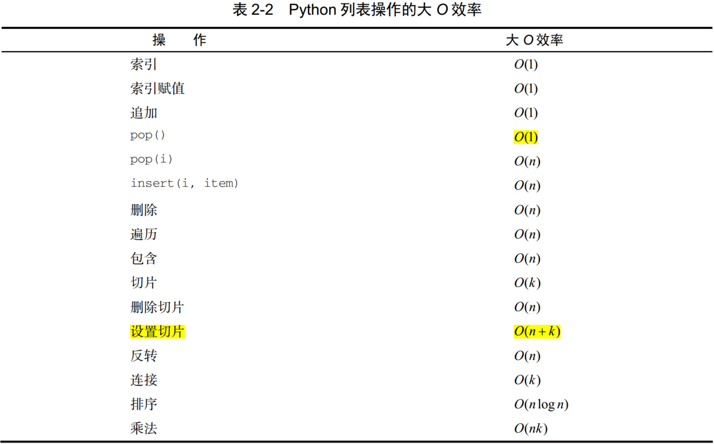
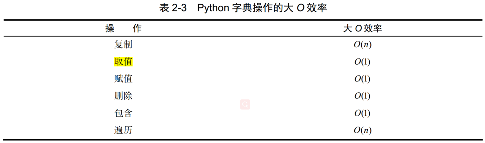

# Python 数据结构与算法分析（第二章 算法分析）

## 1. 基本概念

- **算法分析**：基于所使用的计算资源比较算法。如甲算法相较于乙算法具有更高的资源利用率或使用更少的资源，则算法甲优于算法乙。
- **计算资源**：①考虑算法在解决问题时要占用的空间或内存；②考虑算法的执行时间或运行时间。
- **问题规模**：如果将每一步看成基本计算单位，那么可以将算法的执行时间描述成解决问题所需的步骤数。例如，对于累加算法，初始化赋值执行步骤数为1，加和运算执行步骤数为$n$，参数$n$即为问题规模。则累加算法的运算时间为$T(n)=n+1$，即当问题规模为$n$时，解决问题所需的时间是$T(n)$ ，即需要$1+n$步。
- **数量级（大O记法）**：数量级函数描述的就是，当$n$增长时，$T(n)$增长最快的部分。数量级又被称为大O记法，表示为$O(f(n))$，其中$f(n)$为$T(n)$函数中起决定性作用的部分。$O(f(n)$提供了步骤数$T(n)$的有效近似。

&emsp;&emsp;[常见的大O函数](https://zh.wikipedia.org/wiki/%E6%97%B6%E9%97%B4%E5%A4%8D%E6%9D%82%E5%BA%A6)

| f(n) | 名称 | 算法 |
| --- | --- | --- |
| $1$ | 常数 | 一元运算、二元运算 |
| $logn$ | 对数 | 二分法查找 |
| $n$ | 线性 | 累加求和 |
| $nlogn$ | 对数线性 | 快速排序 |
| $n^2$ | 平方 | 排序 |
| $2^n$ | 指数 | 动态规划解TSP问题 |
| $n!$ | 阶乘 | 暴力枚举 |

## 2. Python数据结构的性能

&emsp;&emsp;（1）列表

&emsp;&emsp;（2）字典

&emsp;&emsp;相较于列表，字典的取值和赋值操作均更高效。

## 3. 参考文献

- [Python数据结构与算法分析（第2版）](https://yun.weicheng.men/Book/Python%E6%95%B0%E6%8D%AE%E7%BB%93%E6%9E%84%E4%B8%8E%E7%AE%97%E6%B3%95%E5%88%86%E6%9E%90_%E7%AC%AC2%E7%89%88.pdf)
