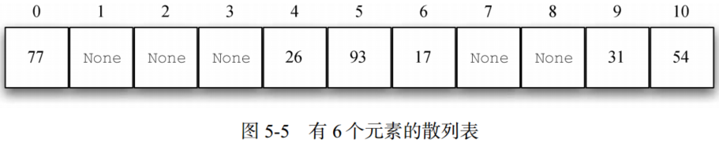
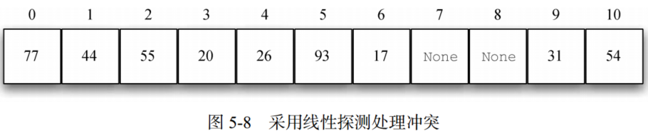
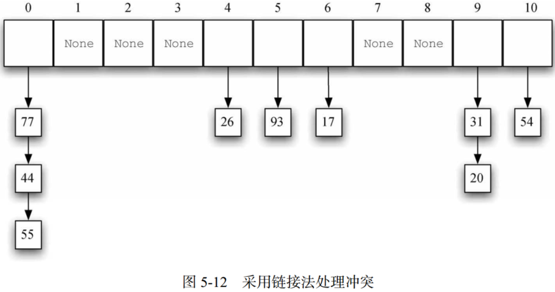
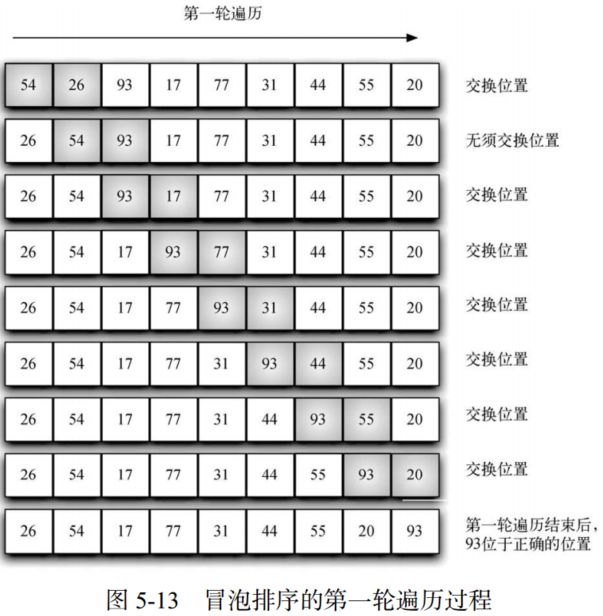
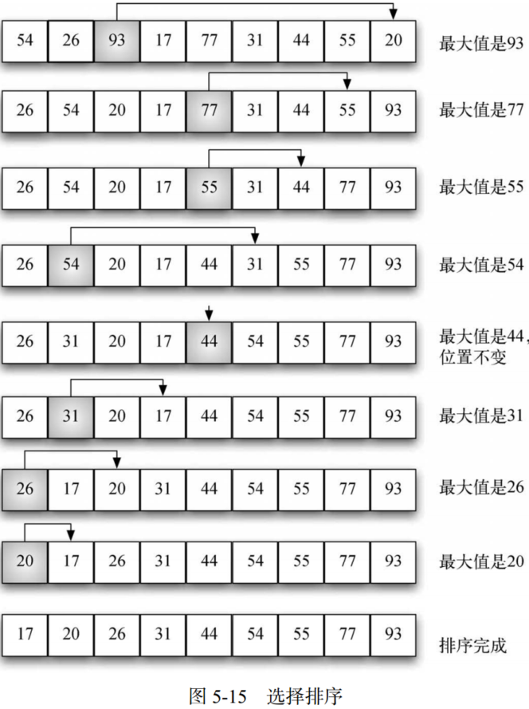
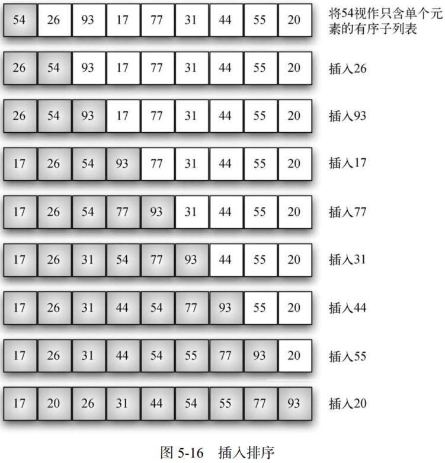
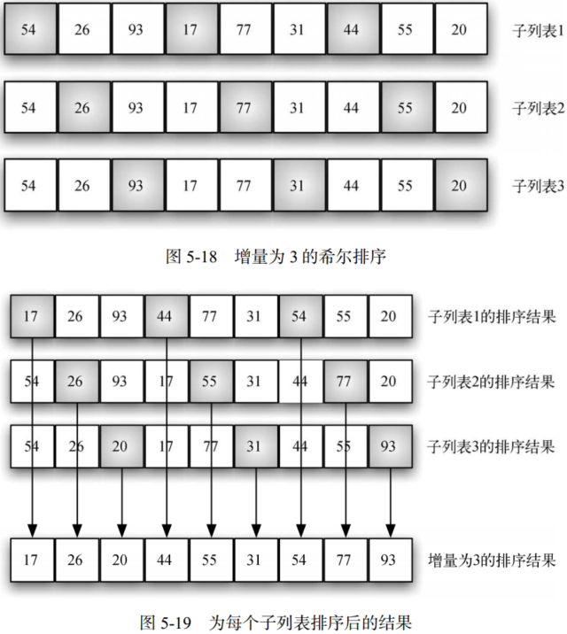
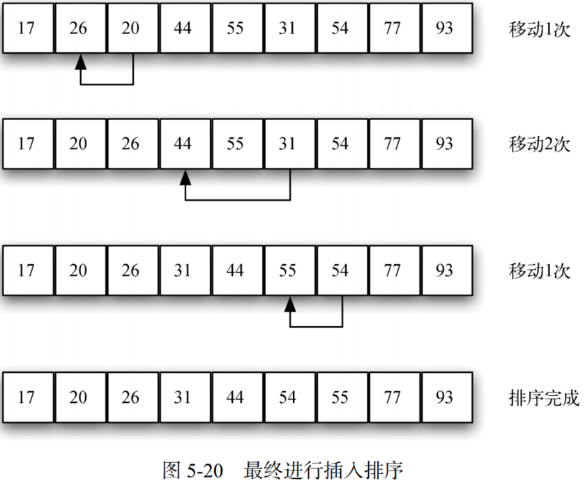
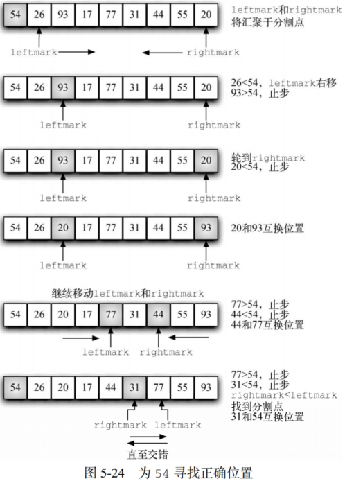
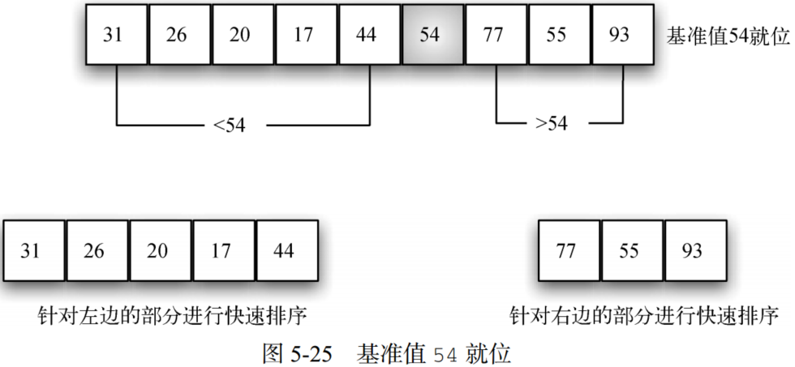

# Python 数据结构与算法分析（第五章 搜索和排序）

## 1. 搜索

### 1.1 顺序搜索

&emsp;&emsp;存储于列表等集合中的数据项彼此存在线性或顺序的关系，每个数据项的位置与其他数据项相关。在 Python 列表中，数据项的位置就是它的下标。因为下标是有序的，所以能够顺序访问，由此可以进行顺序搜索。对于顺序搜索，算法时间复杂度为$O(n)$。

### 1.2 二分搜索

&emsp;&emsp;对于有序列表，对列表进行二分搜索时，先查看中间的元素。如果目标元素小于中间的元素，就只需要对列表的左半部分进行二分搜索。同理，如果目标元素更大，则只需对右半部分进行二分搜索。

&emsp;&emsp;二分搜索是分治策略的经典案例，即将问题分解成小问题，以某种方式解决小问题，然后整合结果，以解决最初的问题。二分法的时间复杂度为$O(logn)$。

&emsp;&emsp;尽管二分搜索通常优于顺序搜索，但当$n$较小时，排序引起的额外开销可能并不划算。实际上应该始终考虑，为了提高搜索效率，额外排序是否值得。如果排序一次后能够搜索多次，那么排序的开销不值一提。然而，对于大型列表而言，只排序一次也会有昂贵的计算成本，因此从头进行顺序搜索可能是更好的选择。

### 1.3 散列

- **散列表**：元素集合，其中的元素以一种便于查找的方式存储。散列表中的每个位置通常被称为槽，其中可以存储一个元素。
- **散列函数**：将散列表中的元素与其所属位置对应起来。对散列表中的任一元素，散列函数返回一个介于 0 和 m – 1 之间的整数。
- **完美散列函数**：给定一个元素集合，能将每个元素映射到不同的槽，这种散列函数称作完美散列函数。
- **冲突**：散列函数会将两个元素都放入同一个槽，这种情况被称作冲突，也叫“碰撞”。
- **处理冲突**：当两个元素被分到同一个槽中时，必须通过一种系统化方法在散列表中安置第二个元素。这个过程被称为处理冲突。
- **聚集**：如果一个槽发生太多冲突，线性探测会填满其附近的槽，而这会影响到后续插入的元素。
- **再散列**：再散列泛指在发生冲突后寻找另一个槽的过程。
- **载荷因子$\lambda$**：$\lambda=\frac{元素个数}{散列表大小}$。

&emsp;&emsp;基于取余函数将数元素 54、26、93、17、77和31构成的集合，存储至大小为11的散列表（散列表大小一般建议为素数，以保证散列均匀）中，如下：

<center>


</center>

&emsp;&emsp;搜索目标元素时，仅需使用散列函数计算出该元素的槽编号，并查看对应的槽中是否有值。因为计算散列值并找到相应位置所需的时间是固定的，所以搜索操作的时间复杂度是 O(1) 。

&emsp;&emsp;构建完美散列函数的一个方法是增大散列表，使之能容纳每一个元素，这样就能保证每个元素都有属于自己的槽。当元素个数较少时，该方法可行。然而，如果元素是 9 位的社会保障号，这个方法需要大约10亿个槽，这将造成极大的内存空间浪费。

&emsp;&emsp;**（1）折叠法**

&emsp;&emsp;折叠法先将元素切成等长的部分（最后一部分的长度可能不同），然后将这些部分相加，得到散列值。假设元素是电话号码 436-555-4601，以 2 位为一组进行切分，得到43、65、55、46和01。将这些数字相加得210。假设散列表有11个槽，则210除以11，并保留余数1。所以，电话号码436-555-4601被映射到散列表中的1号槽。有些折叠法更进一步，在加总前每隔一个数反转一次。就本例而言，反转后的结果是：43+56+55+64+01=219，219%11=10。

&emsp;&emsp;**（2）平方取中法**

&emsp;&emsp;平方取中法先将元素取平方，然后提取中间几位数。如元素是44，则先计算44*44=1936，然后提取中间两位93，取余得5（93%11）。

&emsp;&emsp;对于字符串，可以首先将各个字符映射为数值，将字符串转化为数值串。然后使用加权折叠法获取其散列值，其中权值为字符的位置。

&emsp;&emsp;**（3）开放定址法**

&emsp;&emsp;从冲突的散列值开始，顺序遍历散列表，直到找到一个空槽。由于是逐个访问槽，因此该方法又被称作线性探测。

&emsp;&emsp;考虑将整数集合（54, 26, 93, 17, 77, 31, 44, 55, 20）放入槽中，则44与77冲突，采用线性探测，依次检查每个槽，直到找到一个空槽，即1号槽。同理，55应该被放入0号槽，但是为了避免冲突，其被放入2号槽。20的散列值对应9号槽，冲突，开始线性探测，依次访问10号槽、0号槽、1号槽和2号槽，最后至3号空槽。如下：

<center>


</center>

&emsp;&emsp;利用开放定址法和线性探测构建出散列表，即可使用同样的方法来搜索元素。假设要查找元素93，它的散列值是5。查看5号槽，发现槽中的元素为93，因此返回True。查找20，20的散列值是9，而9号槽中的元素是31。考虑有冲突的可能，所以从10号槽开始进行顺序搜索，直到找到元素20或者遇到空槽。

&emsp;&emsp;**（4）再散列**

&emsp;&emsp;线性探测法处理冲突问题将出现聚集现象，为避免元素聚集，考虑使用扩展线性探测，即不再依次顺序查找空槽，而是跳过一些槽，以使引起冲突的元素分布得更均匀。故

&emsp;&emsp;**（5）平方探测**

&emsp;&emsp;平方探测是线性探测的一个变体，它不采用固定的跨步大小，而是通过再散列函数递增散列值。如果第一个散列值是h，后续的散列值就是h+1、h+4、h+9、h+16，等。

&emsp;&emsp;**（6）链接法**

&emsp;&emsp;链接法允许散列表中的同一个位置上存在多个元素。发生冲突时，元素仍然被插入其散列值对应的槽中。

<center>


</center>

## 2. 排序

&emsp;&emsp;排序是指将集合中的元素按某种顺序排列的过程。在衡量排序过程时，最常用的指标就是总的比较次数。其次，总的交换次数对于衡量排序算法的总体效率来说也很重要。

### 2.1 冒泡排序

&emsp;&emsp;冒泡排序多次遍历列表。它比较相邻的元素，将不合顺序的交换。每一轮遍历都将下一个最大值放到正确的位置上。

<center>


</center>

&emsp;&emsp;冒泡排序的时间复杂度为$O(n^2)$。冒泡排序通常被认为是效率最低的排序算法，因为在确定最终的位置前必须交换元素。“多余”的交换操作代价很大。不过，由于冒泡排序要遍历列表中未排序的部分，因此，如果在一轮遍历中没有发生元素交换，就可以确定列表已经有序。对于只需要遍历几次的列表，冒泡排序可能有优势，因为它能判断出有序列表并终止排序过程。

### 2.2 选择排序

&emsp;&emsp;选择排序每次遍历列表时只做一次交换，即在每次遍历时寻找最大值，并在遍历完之后将它放到正确位置上。若对n个元素排序，需要遍历n–1轮。

<center>


</center>

&emsp;&emsp;选择排序算法和冒泡排序算法的比较次数相同，所以时间复杂度也是$O(n^2)$。但是，由于减少了交换次数，因此选择排序算法通常更快。

### 2.3 插入排序

&emsp;&emsp;插入排序在列表较低的一端维护一个有序的子列表，并逐个将每个新元素“插入”这个子列表。

<center>


</center>

&emsp;&emsp;在给n个元素排序时，插入排序算法需要遍历n–1轮，即算法的时间复杂度为$O(n^2)$。循环从位置1开始，直到位置n–1结束，这些元素都需要被插入到有序子列表中。但移动操作和交换操作有一个重要的不同点。总体来说，交换操作的处理时间大约是移动操作的3倍，因为后者只需进行一次赋值。

### 2.4 希尔排序

&emsp;&emsp;希尔排序也称“递减增量排序”，其将列表分成数个子列表，并对每一个子列表应用插入排序。希尔排序使用增量$i$（有时称作步长）切分列表，即选取所有间隔为$i$的元素组成子列表。

- **Step 1.**希尔排序

<center>


</center>

&emsp;&emsp;如图5-18所示，该列表有9个元素。设增量为3，即有3个子列表，对每个子列表应用插入排序，结果如图5-19所示。对图5-19进行插入排序，获得最后结果。

- **Step 2.**插入排序

<center>


</center>

&emsp;&emsp;希尔排序的时间复杂度大概介于$O(n)$和$O(n^2)$之间，通过改变增量（切分方式），如采用$2^k-1$，希尔排序的时间复杂度可达到$O(n^{\frac{3}{2}})$。

### 2.5 归并排序

&emsp;&emsp;归并排序为分治策略改进排序算法，其主要包括拆分和归并两个步骤，

<center>


</center>

&emsp;&emsp;首先，列表被一分为二，当列表的长度为n时，能切分logn次。第二个处理过程是归并。列表中的每个元素最终都得到处理，并被放到有序列表中。所以，得到长度为n的列表需要进行n次操作。由此可知，需要进行logn次拆分，每一次需要进行n次操作，所以一共是nlogn次操作，即归并排序算法的时间复杂度是$O(nlogn)$。

```python
def merge(lefthalf, righthalf, alist):
    i = 0
    j = 0
    k = 0
    ## reorder alist via lefthalf and righthalf
    while i < len(lefthalf) and j < len(righthalf):
        if lefthalf[i] < righthalf[j]:
            alist[k] = lefthalf[i]
            i = i + 1
        else:
            alist[k] = righthalf[j]
            j = j + 1
        k = k + 1
    ## only one element for slice
    while i < len(lefthalf):
        alist[k] = lefthalf[i]
        i = i + 1
        k = k + 1
    while j < len(righthalf):
        alist[k] = righthalf[j]
        j = j + 1
        k = k + 1

    return lefthalf, righthalf, alist


def mergeSort(alist):
    print("Splitting ", alist)
    if len(alist) > 1:
        mid = len(alist) // 2
        lefthalf = alist[:mid]
        righthalf = alist[mid:]
        ## split
        mergeSort(lefthalf)
        mergeSort(righthalf)
        ## sort and merge 
        lefthalf, righthalf, alist = merge(lefthalf, righthalf, alist)

    print("Merging ", alist)
```

> Splitting  [54, 26, 93, 17, 77, 31, 44, 55, 20]
Splitting  [54, 26, 93, 17]
Splitting  [54, 26]
Splitting  [54]
Merging  [54]
Splitting  [26]
Merging  [26]
Merging  [26, 54]
Splitting  [93, 17]
Splitting  [93]
Merging  [93]
Splitting  [17]
Merging  [17]
Merging  [17, 93]
Merging  [17, 26, 54, 93]
Splitting  [77, 31, 44, 55, 20]
Splitting  [77, 31]
Splitting  [77]
Merging  [77]
Splitting  [31]
Merging  [31]
Merging  [31, 77]
Splitting  [44, 55, 20]
Splitting  [44]
Merging  [44]
Splitting  [55, 20]
Splitting  [55]
Merging  [55]
Splitting  [20]
Merging  [20]
Merging  [20, 55]
Merging  [20, 44, 55]
Merging  [20, 31, 44, 55, 77]
Merging  [17, 20, 26, 31, 44, 54, 55, 77, 93]

### 2.5 快速排序

&emsp;&emsp;和归并排序一样， 快速排序也采用分治策略，但不使用额外的存储空间。不过，算法的效率会有所下降。

- **Step 1.**确定分割点

&emsp;&emsp;快速排序算法首先选出一个基准值。基准值的作用是帮助切分列表。在最终的有序列表中，基准值的位置通常被称作分割点，算法在分割点切分列表，以进行对快速排序的子调用。如图5-24，选择54作为分割点。

- **Step 2.**分区

&emsp;&emsp;分区操作将列表中的其它元素分别放入分割点的两边。

<center>


</center>

&emsp;&emsp;如图5-24，首先加大leftmark，直到遇到一个大于基准值（54）的元素。然后减小rightmark，直到遇到一个小于基准值的元素。这样一来，就找到两个与最终的分割点错序的元素。如93和20。互换这两个元素的位置，然后重复上述过程。

- **Step 3.递归快速排序**

&emsp;&emsp;当rightmark小于leftmark时，过程终止。此时，rightmark的位置就是分割点。将基准值与当前位于分割点的元素互换，即可使基准值位于正确位置，如图 5-25 所示。分割点左边的所有元素都小于基准值，右边的所有元素都大于基准值。因此，可以在分割点处将列表一分为二，并针对左右两部分递归调用快速排序函数。

<center>


</center>

&emsp;&emsp;对于长度为n的列表，如果分区操作总是发生在列表的中部，就会切分logn次。为了找到分割点，n个元素都要与基准值比较。所以，时间复杂度是$O(nlogn)$。最坏情况下，分割点不在列表的中部，而是偏向某一端，这会导致切分不均匀。在这种情况下，含有n个元素的列表可能被分成一个不含元素的列表与一个含有n–1个元素的列表。然后，含有n–1个元素的列表可能会被分成不含元素的列表与一个含有n–2个元素的列表，依此类推。这会导致时间复杂度变为$O(n^2)$，因为还要加上递归的开销。

&emsp;&emsp;为避免切分不均匀选择三数取中法，即在选择基准值时考虑列表的头元素、中间元素与尾元素，然后取三数中间值作为基准值。

```python
def quickSort(alist):
    alist = quickSortHelper(alist, 0, len(alist)-1)
    return alist


def quickSortHelper(alist, first, last):
    if first < last:
        splitpoint = partition(alist, first, last)
        quickSortHelper(alist, first, splitpoint-1)
        quickSortHelper(alist, splitpoint+1, last)
    return alist


def partition(alist, first, last):
    pivotvalue = alist[first]
    leftmark = first + 1
    rightmark = last
    done = False
    while not done:
        while leftmark <= rightmark and alist[leftmark] <= pivotvalue:
            leftmark = leftmark + 1
        while alist[rightmark] >= pivotvalue and rightmark >= leftmark:
            rightmark = rightmark - 1
        if rightmark < leftmark:
            done = True
        else:
            temp = alist[leftmark]
            alist[leftmark] = alist[rightmark]
            alist[rightmark] = temp
    temp = alist[first]
    alist[first] = alist[rightmark]
    alist[rightmark] = temp
    return rightmark


print(quickSort(b))
```

> [17, 20, 26, 31, 44, 54, 55, 77, 93]

## 3. 参考文献

[Python数据结构与算法分析（第2版）](https://yun.weicheng.men/Book/Python%E6%95%B0%E6%8D%AE%E7%BB%93%E6%9E%84%E4%B8%8E%E7%AE%97%E6%B3%95%E5%88%86%E6%9E%90_%E7%AC%AC2%E7%89%88.pdf)
