# Python 数据结构与算法分析（第六章 树）

## 1. 树的存储

&emsp;&emsp;Python提供两种树的存储方式，包括：“列表之列表”，“节点与引用”。

## 1.1 列表之列表

&emsp;&emsp;在“列表之列表”的树中，我们将根节点的值作为列表的第一个元素；第二个元素是代表左子树的列表；第三个元素是代表右子树的列表。

<center>

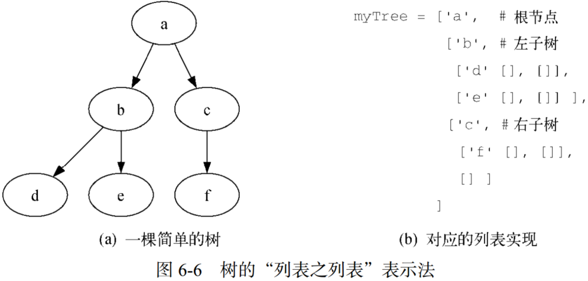
</center>

&emsp;&emsp;“列表之列表”表示法表示子树的列表结构符合树的定义，其这样的结构是递归的！由一个根节点和两个空列表构成的子树是一个叶子节点。同时这种表示法可以推广到有很多子树的情况。如果树不是二叉树，则多一棵子树只是多一个列表。

## 1.2 节点与引用

&emsp;&emsp;节点与引用定义一个类，其中有根节点和左右子树的属性。

```Python

class BinaryTree:
    def __init__(self, rootObj):
        self.key = rootObj
        self.leftChild = None
        self.rightChild = None

    def insertLeft(self, newNode):
        if self.leftChild == None:
            self.leftChild = BinaryTree(newNode)
        else:
            t = BinaryTree(newNode)
            t.left = self.leftChild
            self.leftChild = t
    
    def insertRight(self, newNode):
        if self.rightChild == None:
            self.rightChild = BinaryTree(newNode)
        else:
            t = BinaryTree(newNode)
            t.right = self.rightChild
            self.rightChild = t

    def getRightChild(self):
        return self.rightChild
    
    def getLeftChild(self):
        return self.leftChild
    
    def setRootVal(self, obj):
        self.key = obj
    
    def getRootVal(self):
        return self.key
```

## 2. 二叉树的应用

### 2.1 全括号表达式构建解析树

&emsp;&emsp;如下：

<center>

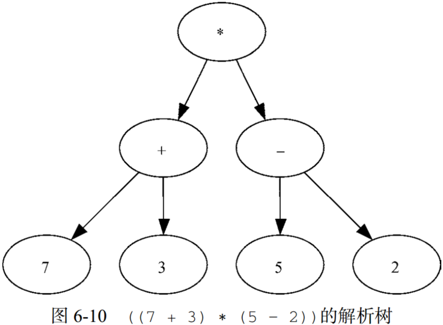
</center>

&emsp;&emsp;遍历全括号表达式，左括号则创建新子树，右括号则返回父节点，运算符左侧数字为左叶节点，右侧数字为右叶节点，运算符为当前子树根节点。创建栈记录子树根节点。

```python

from pythonds.basic import Stack
import re


class BinaryTree:
    def __init__(self, rootObj):
        self.key = rootObj
        self.leftChild = None
        self.rightChild = None

    def insertLeft(self, newNode):
        if self.leftChild == None:
            self.leftChild = BinaryTree(newNode)
        else:
            t = BinaryTree(newNode)
            t.left = self.leftChild
            self.leftChild = t

    def insertRight(self, newNode):
        if self.rightChild == None:
            self.rightChild = BinaryTree(newNode)
        else:
            t = BinaryTree(newNode)
            t.right = self.rightChild
            self.rightChild = t

    def getRightChild(self):
        return self.rightChild

    def getLeftChild(self):
        return self.leftChild

    def setRootVal(self, obj):
        self.key = obj

    def getRootVal(self):
        return self.key


def buildParseTree(fpexp):
    fplist = re.split(r'(\d+\.?\d*)', str(fpexp))[1:-1]
    pStack = Stack()
    eTree = BinaryTree('')
    pStack.push(eTree)
    currentTree = eTree
    for i in fplist:
        if i == '(':
            currentTree.insertLeft('')  ## 创建根节点
            pStack.push(currentTree)  ## 子树根节点入栈
            currentTree = currentTree.getLeftChild()
        elif i not in '+-*/)':
            currentTree.setRootVal(eval(i))  ##只赋值，不创建叶节点
            parent = pStack.pop()  ## 子树根节点出栈
            currentTree = parent
        elif i in '+-*/':
            currentTree.setRootVal(i)
            currentTree.insertRight('')
            pStack.push(currentTree)  ## 入栈
            currentTree = currentTree.getRightChild()
        elif i == ')':
            currentTree = pStack.pop()  ## 出栈
        else:
            raise ValueError("Unknown Operator: " + i)
    return eTree


a = (((2*3)+(4-1))/(6*2))
```

### 2.2 树的遍历

- **前序遍历**：在前序遍历中，先访问根节点，然后递归地前序遍历左子树，最后递归地前序遍历右子树。
- **中序遍历**：在中序遍历中，先递归地中序遍历左子树，然后访问根节点，最后递归地中序遍历右子树。
- **后序遍历**：在后序遍历中，先递归地后序遍历右子树，然后递归地后序遍历左子树，最后访问根节点。

<center>

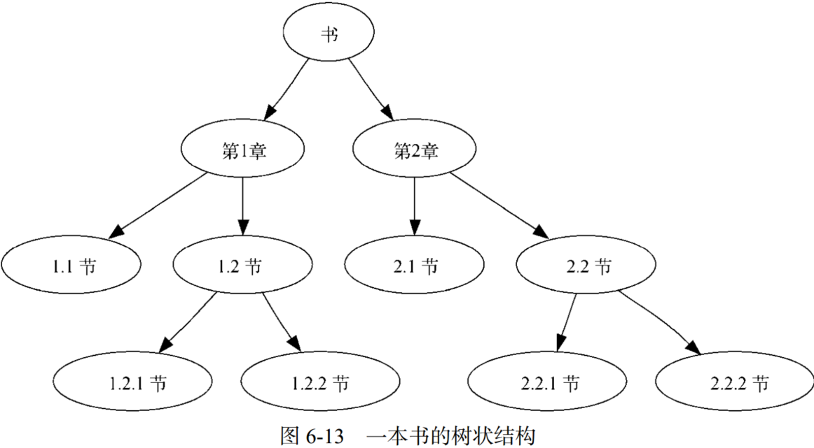
</center>

- 前序遍历：书>第1章>1.1节>1.2节>1.2.1节>1.2.2节>第2章>2.1节>2.2节>2.2.1节>2.2.2节；
- 中序遍历：1.1节>第1章>1.2.1节>1.2节>1.2.2节>书>2.1节>第2章>2.2.1节>2.2节>2.2.2节；
- 后序遍历：1.1节>1.2.1节>1.2.2节>1.2节>第1章>2.1节>2.2.1节>2.2.2节>2.2节>第2章>书；

### 2.3 完全二叉树

&emsp;&emsp;完全二叉树：在完全二叉树中，除了最底层，其他每一层的节点都是满的。

<center>

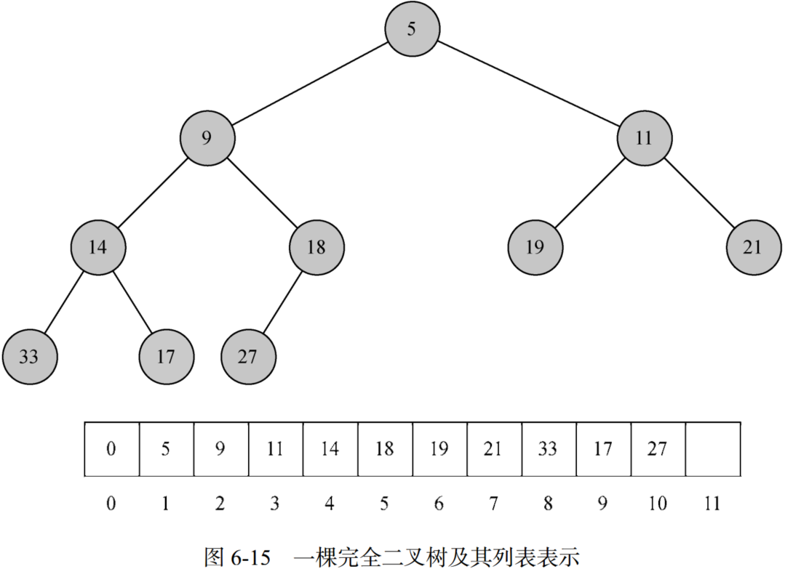
</center>

&emsp;&emsp;完全二叉树可以由列表表示，即在列表中处于位置p的节点，其左子节点处于位置2p，右子节点处于位置2p+1。

### 2.4 二叉堆

&emsp;&emsp;二叉堆具有有序性，即对于堆中任意元素x及其父元素p，p都不大于x。

&emsp;&emsp;（1）二叉堆插入

<center>

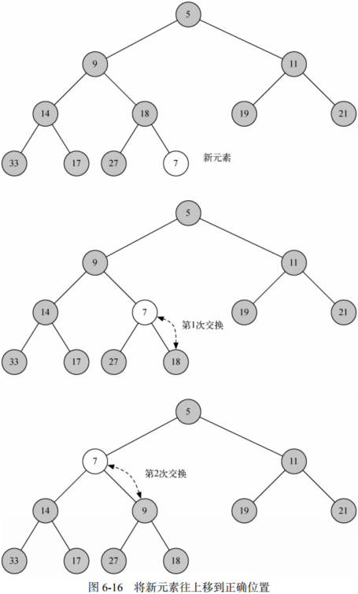
</center>

- Step 1. 插入元素追加至列表；
- Step 2. 交换元素顺序，使其满足二叉堆的性质；

&emsp;&emsp;（2）二叉堆删除

<center>

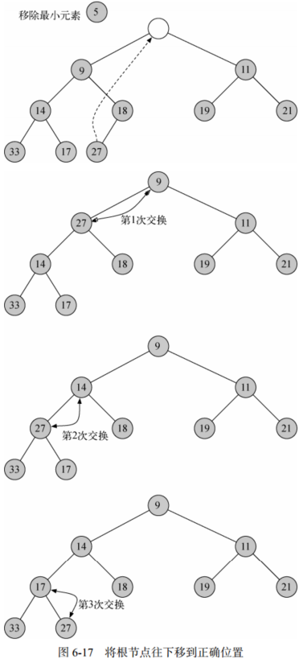
</center>

- Step 1. 删除指定元素，并将列表末尾元素移动至删除指定元素处；
- Step 2. 重构列表，重复交换根节点与其的最小子节点，使列表满足二叉堆性质。

## 3. 二叉搜索树

### 3.1 二叉搜索树操作

&emsp;&emsp;**二叉搜索性**：小于父节点的键都在左子树中，大于父节点的键则都在右子树中。

&emsp;&emsp;（1）二叉搜索树插入：

- Step 1. 从根节点开始搜索二叉树，比较新键与当前节点的键。如果新键更小，搜索左子树。如果新键更大，搜索右子树；
- Step 2. 当没有可供搜索的左（右）子节点时，即找到了新键的插入位置，插入节点。

&emsp;&emsp;（2）二叉搜索树删除：

&emsp;&emsp;二叉搜索树删除包含三种情况：

&emsp;&emsp;a. 待删除节点没有子节点

<center>

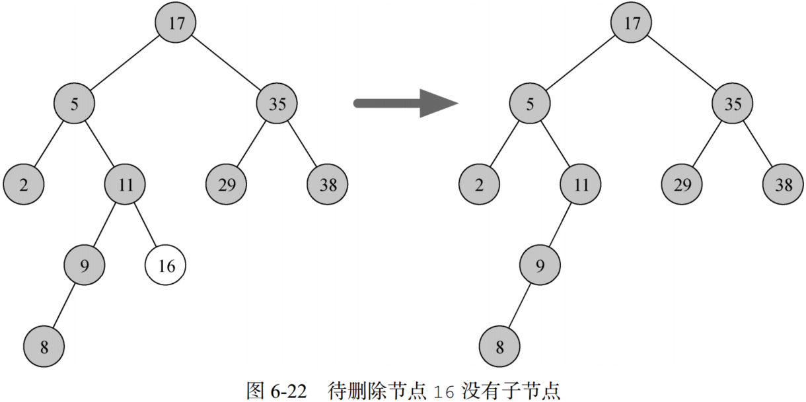
</center>

&emsp;&emsp;若当前删除节点没有子节点，则直接删除该节点，并移除父节点对该节点的引用。

&emsp;&emsp;b. 待删除节点只有一个子节点

<center>

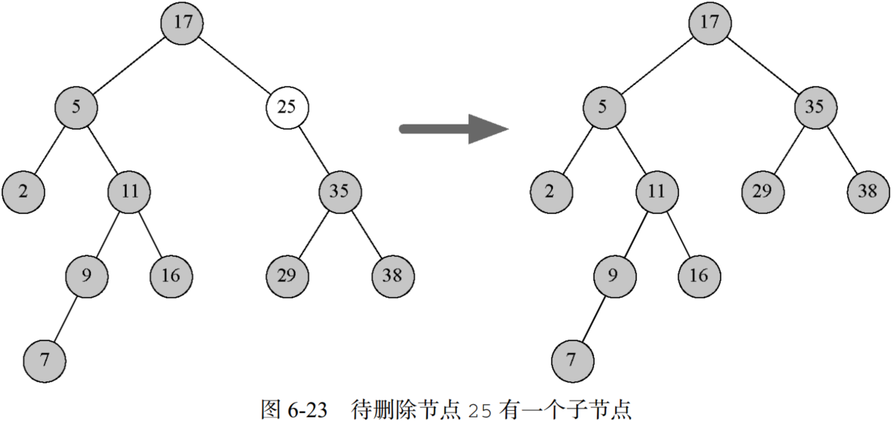
</center>

&emsp;&emsp;考虑一下三种情况：

- 如果当前节点是一个左子节点，只需将当前节点的左子节点对父节点的引用改为指向当前节点的父节点，然后将父节点对当前节点的引用改为指向当前节点的左子节点。
- 如果当前节点是一个右子节点，只需将当前节点的右子节点对父节点的引用改为指向当前节点的父节点，然后将父节点对当前节点的引用改为指向当前节点的右子节点。
- 如果当前节点没有父节点，则替换根节点的相关数据。

&emsp;&emsp;c. 待删除节点有两个子节点

<center>

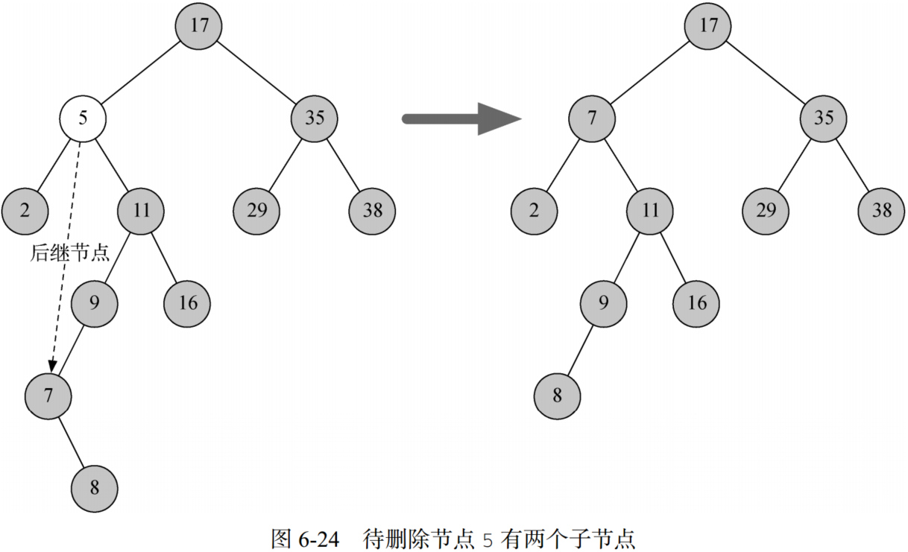
</center>

&emsp;&emsp;如果删除节点存在两个子节点，则需要搜索整棵树，找到后继节点替换删除节点，以保证二叉搜索性。后续节点的查找考虑以下三种情况：

- 如果节点有右子节点，那么后继节点就是右子树中最小的节点。 
- 如果节点没有右子节点，并且其本身是父节点的左子节点，那么后继节点就是父节点。
- 如果节点是父节点的右子节点，并且其本身没有右子节点，那么后继节点就是除其本身外父节点的后继节点，即后继节点为父节点右子树的最小节点（除去此删除节点）。

### 3.2 二叉搜索树分析

&emsp;&emsp;二叉树的增、删、查、改操作的性能均取决于树的高度，而二叉树树的高度取决于键插入的方式。如果键的插入顺序是随机的，则小于和大于根节点的键大约各占一半，那么树的高度约为$log_2n$ ，其中n为树的节点数。在完全平衡的二叉树中，节点总数是$2^{h+1}-1$，其中$h$代表树的高度。

&emsp;&emsp;对于平衡二叉树最坏情况下其查找的时间复杂度为$O(log_2n)$，而不平衡二叉树其时间复杂度为$O(n)$。

## 4. 平衡二叉搜索树

&emsp;&emsp;**AVL树**：一种特殊的二叉搜索树，其能自动维持平衡。AVL树实现映射抽象数据类型的方式与普通的二叉搜索树一样。

&emsp;&emsp;**平衡因子**：左右子树的高度差$Balance\, Factor=height(left_SubTree)-height(right_SubTree)$。

&emsp;&emsp;根据上述定义，如果平衡因子大于零，则称之为左倾；如果平衡因子小于零，则右倾；如果平衡因子等于零，那么树完全平衡。同时定义平衡因子为–1、0和1的树均为平衡树。

<center>

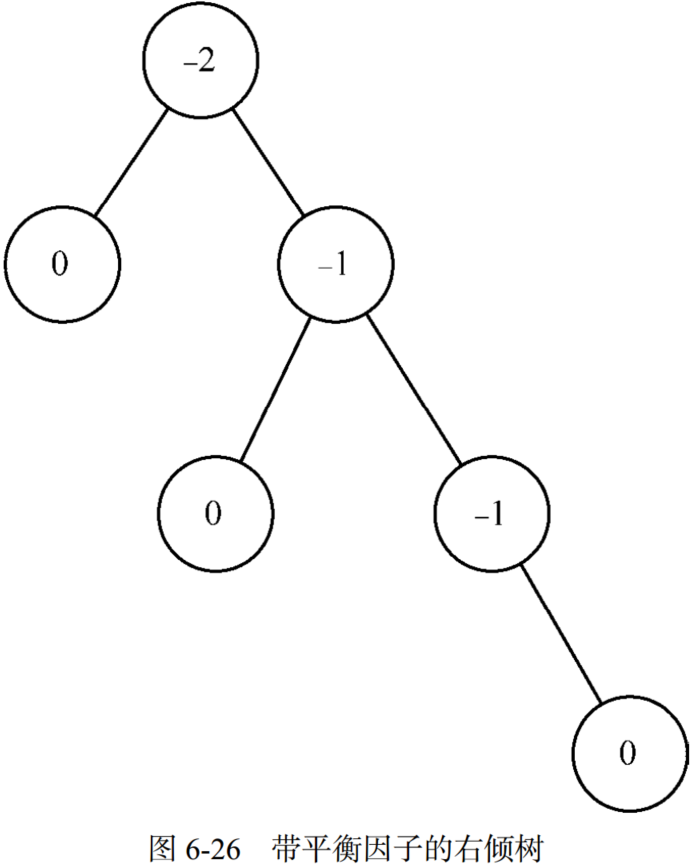
</center>

### 4.1 AVL树的性能

&emsp;&emsp;基于AVL树的定义，左子树与右子树高度差最大为1，即当高度为$h$时，AVL节点数$N_h$为左子树节点+右子树节点+根节点，即：

$$
N_h=1+N_{h-1}+N_{h-2}\tag{1}
$$

&emsp;&emsp;由斐波拉契数列知:

$$
f_0=0,f_1=1,f_i=f_{i-1}+f_{i-2},i \geq 2\tag{2}
$$

&emsp;&emsp;构造生成函数：

$$
F(z)=\sum_{i=0}^{\infty}f_iz^i=0+z+z^2+2z^3+3z^4+5z^5+...\tag{3}
$$

&emsp;&emsp;式（3）中$f_i$为斐波拉契数，则有：

$$
zF(z)=\sum_{i=0}^{\infty}f_iz^{i+1}=\sum_{i=1}^{\infty}f_{i-1}z^i\\
z^2F(z)=\sum_{i=0}^{\infty}f_iz^{i+2}=\sum_{i=2}^{\infty}f_{i-2}z^i\\
$$

&emsp;&emsp;故：

$$
zF(z)+z^2F(z)=\sum_{i=1}^{\infty}f_{i-1}z^i+\sum_{i=2}^{\infty}f_{i-2}z^i=f_0z+\sum_{i=2}^{\infty}f_{i-1}z^i+\sum_{i=2}^{\infty}f_{i-2}z^i=f_0z+\sum_{i=2}^{\infty}(f_{i-1}+f_{i-2})z^i=f_0z+\sum_{i=2}^{\infty}f_iz^i\tag{4}
$$

&emsp;&emsp;故：

$$
zF(z)+z^2F(z)=f_0z+F(z)-f_0-f_1z=0+F(z)-z
$$

&emsp;&emsp;即：

$$
F(z)=z+zF(z)+z^2F(z)\tag{5}
$$

&emsp;&emsp;则：

$$
F(z)=\frac{z}{1-z-z^2}\tag{6}
$$

&emsp;&emsp;由因式分解有：

$$
F(z)=\frac{1}{\sqrt 5}(\frac{1}{1-\phi z}-\frac{1}{1-\hat{\phi}z}),where\, \phi=\frac{1+\sqrt 5}{2}\, and \, \hat{\phi}=\frac{1-\sqrt 5}{2}\tag{7}
$$

&emsp;&emsp;由泰勒展开知：

$$
lim_{x\rightarrow 0}\frac{1}{1-x}=1+x+x^2+x^3+...=\sum_{i=0}^{\infty}x^i\tag{8}
$$

&emsp;&emsp;将式（8）代入式（7）有：

$$
F(z)=\frac{1}{\sqrt 5}\sum_{i=0}^{\infty}((\phi z)^i-(\hat{\phi}z)^i)=\sum_{i=0}^{\infty}(\frac{1}{\sqrt 5}(\phi^i-\hat{\phi}^i))z^i\tag{9}
$$

&emsp;&emsp;又因为$F(z)=\sum_{i=0}^{\infty}f_iz^i$，故：

$$
f(i)=\frac{1}{\sqrt 5}(\phi^i-\hat{\phi}^i)=\frac{1}{\sqrt 5}(\phi^i-(1-\phi)^i)\approx \frac{1}{\sqrt 5}\phi^i\tag{10}
$$

&emsp;&emsp;因此有：

$$
N_h+1=N_{h-1}+1+N_{h-2}+1\approx \frac{1}{\sqrt 5}\phi^{h+3}\tag{11}
$$

&emsp;&emsp;则：

$$
N_h=\frac{1}{\sqrt 5}\phi^{h+3}-1\tag{12}
$$

&emsp;&emsp;则：

$$
h\approx 1.44logN_h\tag{13}
$$

&emsp;&emsp;因此AVL树的高度近似外为节点数取对数的1.44倍，其搜索的时间复杂度为$O(logN)$。

### 4.2 旋转

&emsp;&emsp;为了让AVL树恢复平衡，需要在树上进行一次或多次旋转。

&emsp;&emsp;（1）左旋

<center>

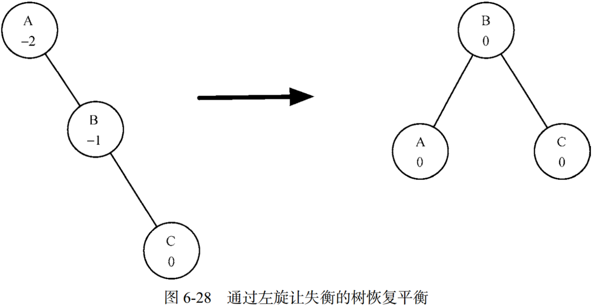
</center>

- **Step 1.** 将右子节点（节点B）提升为子树的根节点。
- **Step 2.** 将旧根节点（节点A）作为新根节点的左子节点。
- **Step 3.** 如果新根节点（节点B）已经有一个左子节点，将其作为新左子节点（节点A）的右子节点。

&emsp;&emsp;（2）右旋

<center>

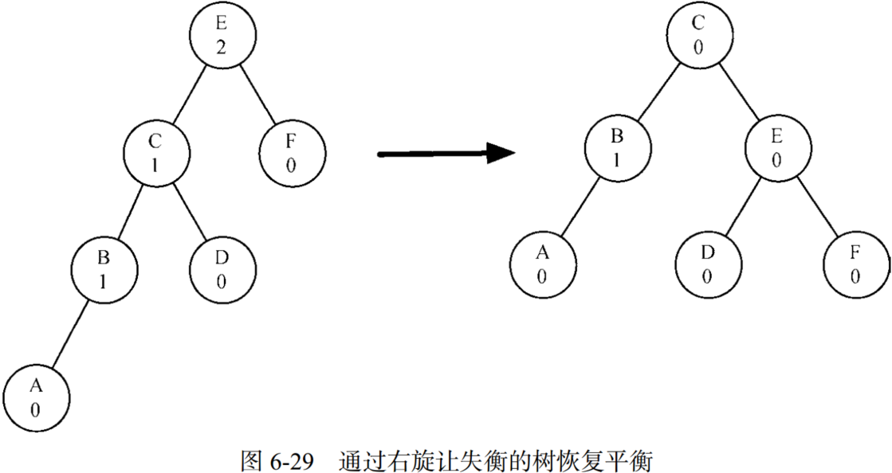
</center>

- **Step 1.** 将左子节点（节点C）提升为子树的根节点。
- **Step 2.** 将旧根节点（节点E）作为新根节点的右子节点。
- **Step 3.** 如果新根节点（节点C）已经有一个右子节点（节点D），将其作为新右子节点（节点E）的左子节点。

&emsp;&emsp;同时，
- 如果子树需要左旋，首先检查右子树的平衡因子。如果右子树左倾，就对右子树做一次右旋，再围绕原节点做一次左旋。
- 如果子树需要右旋，首先检查左子树的平衡因子。如果左子树右倾，就对左子树做一次左旋，再围绕原节点做一次右旋。

<center>

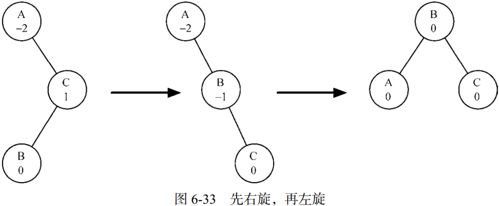
</center>

&emsp;&emsp;VAL树查询节点的时间复杂度为$O(log_2n)$。同时，新节点作为叶子节点插入，更新所有父节点的平衡因子最多需要$log_2n$次操作（每一层一次）。若VAL树失衡了，恢复平衡最多需要旋转两次，每次旋转的时间复杂度是 $O(1) $，所以插入操作的时间复杂度仍是$O(log_2n)$。

## 5. 小结

&emsp;&emsp;个数据结构增删查改的性能如下表：

<center>

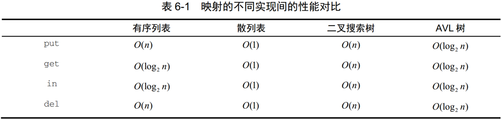
</center>

## 6. 参考文献
- [Python数据结构与算法分析（第2版）](https://link.zhihu.com/?target=https%3A//yun.weicheng.men/Book/Python%25E6%2595%25B0%25E6%258D%25AE%25E7%25BB%2593%25E6%259E%2584%25E4%25B8%258E%25E7%25AE%2597%25E6%25B3%2595%25E5%2588%2586%25E6%259E%2590_%25E7%25AC%25AC2%25E7%2589%2588.pdf)
