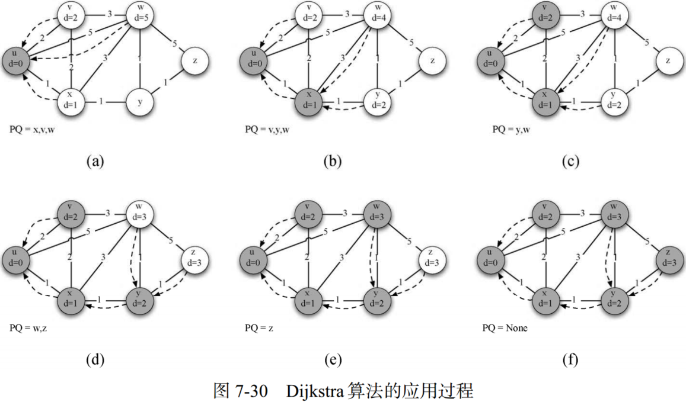

# Python 数据结构与算法分析（第七章 图及算法）

## 1. 图的抽象数据类型

&emsp;&emsp;**（1）邻接矩阵**

&emsp;&emsp;邻接矩阵每一行和每一列都表示图中的一个顶点。第$v$行和第$w$列交叉的格子中的值表示从顶点$v$到顶点$w$的边的权重。如果两个顶点被一条边连接起来，就称它们是相邻的。

&emsp;&emsp;**（2）邻接表**

&emsp;&emsp;为了实现稀疏连接的图，更高效的方式是使用邻接表。在邻接表实现中，图对象的所有顶点保存一个主列表，同时为每一个顶点对象都维护一个列表，其中记录了与它相连的顶点。

## 2. 宽度优先搜索

&emsp;&emsp;词梯问题：考虑这样一个任务：将单词FOOL转换成 SAGE。在解决词梯问题时，必须每次只替换一个字母，并且每一步的结果都必须是一个单词，而不能是不存在的词。

&emsp;&emsp;求解词梯问题可以基于如下两个步骤：

- 用图表示单词之间的关系；
- 用一种名为宽度优先搜索的图算法找到从起始单词到结束单词的最短路径。

&emsp;&emsp;**（1）词梯图的创建**

&emsp;&emsp;假设有一个单词列表，其中每个单词的长度都相同。首先，为每个单词创建顶点。同时，如果两个单词只相差一个字母，就在图中创建一条边，将它们连接起来，如上图所示。

&emsp;&emsp;**（2）宽度优先搜索**

&emsp;&emsp;宽度优先搜索（breadth first search，BFS）,给定图$G$和起点$s$，BFS在访问完所有与$s$相距为$k$的顶点之后再去访问与$s$相距为$k+1$的顶点。

&emsp;&emsp;宽度优先搜索可通过队列来控制搜索节点的顺序，同时为每个节点创建其父节点和距离属性，如下：

&emsp;&emsp;如上图所示，首先搜索节点fool，访问其所有子节点，并将其依次加入队列，同时为各个子节点创建父节点属性为fool，距离属性为distance_fool+1。然后依次取出队列各元素，同时将其子节点加入至队列中。

## 3. 深度优先搜索

### 3.1 骑士周游问题

&emsp;&emsp;骑士周游问题：取一块国际象棋棋盘和一颗骑士棋子（马）。目标是找到一系列走法，使得骑士对棋盘上的每一格刚好都只访问一次。这样的一个移动序列被称为“周游路径”。

&emsp;&emsp;可利用深度优先搜索（depth first search，DFS）求解骑士周游问题，如下图所示：

&emsp;&emsp;如上图所示，由起始节点A开始，首先基于字母顺序访问其子节点B，然后基于字母顺序访问B子节点C。由于节点C无子节点且路径长度小于给定值，即所有路径并未获得完整遍历，因此，进行回溯操作，回溯至节点B。访问节点D。最后依次访问节点E、B、F。

&emsp;&emsp;目前实现的骑士周游问题算法时间复杂度为$O(k^N)$，其中$N$为棋盘格子数，$k$为棋盘的平均分子因子，即每一个节点的平均分支数（可行的步数），其是一个较小的常量。对于$5\times 5$的棋盘，$k=3.8$，$6\times 6$的棋盘$k=4.4$，$8\times 8$的棋盘，$k=5.25$。

### 3.2 通用深度优先搜索

&emsp;&emsp;**深度优先森林**：一次深度优先搜索创建多颗深度优先搜索树。深度优先森林将记录额外两个变量，发现时间：第一次访问顶点时的步数；结束时间：该节点所有子树被探索完全时的步数。如下：

- 搜索从图中的顶点A开始。由于所有顶点一开始都是白色的，因此算法会访问A。访问顶点的第一步是将其颜色设置为灰色，以表明正在访问该顶点，并将其发现时间设为1。由于A有两个相邻顶点（B和D），因此它们都需要被访问。我们按照字母顺序来访问顶点。
- 接下来访问顶点B，将它的颜色设置为灰色，并把发现时间设置为2。B也与两个顶点（C和D）相邻，因此根据字母顺序访问C。
- 访问C时，搜索到达某个分支的终点。在将C标为灰色并且把发现时间设置为3之后，算法发现C没有相邻顶点。这意味着对C的探索完成，因此将它标为黑色，并将完成时间设置为4。图7-16d 展示了搜索至这一步时的状态。
- 由于C是一个分支的终点，因此需要返回到B，并且继续探索其余的相邻顶点。唯一的待探索顶点就是D，它把搜索引到E。E有两个相邻顶点，即B和F。正常情况下，应该按照字母顺序来访问这两个顶点，但是由于B已经被标记为灰色，因此算法自知不应该访问B，因为如果这么做就会陷入死循环。因此，探索过程跳过B，继续访问F。
- F只有C这一个相邻顶点，但是C已经被标记为黑色，因此没有后续顶点需要探索，也即到达另一个分支的终点。从此时起，算法一路回溯到起点，同时为各个顶点设置完成时间并将它们标记为黑色，如图7-16h~图7-16l所示。

&emsp;&emsp;如上图所示，节点A的发现时间为1，结束时间为12，其子节点B的发现时间为2，结束时间为11；节点D的发现时间为5，结束时间为10。即深度优先搜索树中的任一节点的子节点都有比该节点更晚的发现时间和更早的结束时间。

## 4. 拓扑排序

&emsp;&emsp;拓扑排序根据有向无环图生成一个包含所有顶点的线性序列，使得如果图$G$中有一条边为$(v,w)$，那么顶点$v$排在顶点$w$之前。在很多应用中，有向无环图被用于表明事件优先级，如软件项目调度、优化数据库查询的优先级表等。

&emsp;&emsp;拓扑排序的构建如下：

- **Step 1.** 对图$g$调用深度优先搜索函数，同时记录每一个节点的结束时间。
- **Step 2.** 基于结束时间，将节点按照递减的顺序存储在列表中，同时将有序列表作为拓扑排序的结果返回。

## 5. 强连通单元

&emsp;&emsp;网络具有一种基础结构，使得在某种程度上相似的节点相互聚集。通过强连通单元的图算法，可以找出图中高度连通的顶点簇。对于图$G$，强连通单元$C$为最大的顶点子集$C\subset V$，其中对于每一对顶点$v,w\in C$，都有一条从$v$到$w$的路径和一条从$w$到$v$的路径。如下：

&emsp;&emsp;强连通单元算法如下：

- **Step 1.** 对图$G$调用深度优先算法，计算每一个顶点的结束时间。
- **Step 2.** 构建图$G$的转置$G^T$。
- **Step 3.** 对图$G^T$调用深度优先算法，但是按照step 1.中结束时间递减的顺序访问节点。
- **Step 4.** Step 3.中深度优先森林的每一棵树即为一个强连通单元。

## 6. 最短路径问题

### 6.1 Dijkstra算法

&emsp;&emsp;Dijkstra算法求解从一个顶点到其它所有节点的最短路径，因此其首先需要指定节点。

&emsp;&emsp;使用优先级队列来确定各个节点的访问顺序，其中优先级队列的顺序由各节点到指定节点的距离确定。以节点$u$为例，确定各个节点到$u$的最短路径，如下：

- 确定节点$u$的邻居节点，并按距离大小送入优先级队列，即$x,v,w,y,z$；
- 优先队列取值$x$，确定节点$x$的邻居节点$v,w,y$；
- 判断邻居节点$v,w,y$经节点$x$至$u$的距离，即判断distance(u,x)+disatance(x,邻居节点)与distance(u,邻居节点)大小，若distance(u,邻居节点_i)>distance(u,x)+disatance(x,邻居节点_i)，则更新distance(u,邻居节点_i)。同时更新优先级对列，且$x$邻居节点入对列。可以看出节点$w$经$x$至$u$的距离小于$w$至$u$的距离，且节点$y$经$x$至$u$的距离小于$y$至$u$的距离。故更新优先级队列为$v,y,w,z$。
- 优先级队列取值$v$，访问节点$v$邻居节点，判断邻居节点经$v$至$u$的距离与邻居节点至$u$的距离大小，更新距离，更新优先级队列为$y,w,z$；
- 优先级队列取值$y$，访问节点$y$邻居节点，判断邻居节点经$y$至$u$的距离与邻居节点至$u$的距离大小，更新距离，distance(w,u)=3(w→y→x→u)，distance(z,u)=3(z→y→x→u)。跟新优先级队列为$w,z$；
- 优先级队列取值$w$，访问节点$w$邻居节点，判断邻居节点经$w$至$u$的距离与邻居节点至$u$的距离大小，更新优先级队列为$z$；
- 优先级队列取值$z$，访问节点$z$邻居节点，判断邻居节点经$z$至$u$的距离与邻居节点至$u$的距离大小，更新优先级队列为空；

### 6.2 Prim算法

&emsp;&emsp;广播问题：互联网广播服务提供商希望高效地把信息传递给所有人。

&emsp;&emsp;解决广播问题的关键在于构建一棵权重最小的生成树。我们对最小生成树的正式定义如下：对于图$G=(V,E)$，最小生成树$T$是$E$的无环子集，并且连接$V$中的所有顶点。

&emsp;&emsp;如上图所示，A把消息转发给B，B把消息转发给C和D，D转发给E，E转发给F，F转发给G。每一个路由器都只看到任意消息的一份副本，并且所有的收听者都接收到了消息。故广播服务提供商只需向网络中发送一条消息副本。每一个路由器向属于生成树的相邻路由器转发消息，其中不包括刚刚向它发送消息的路由器。

&emsp;&emsp;最小生成树问题可由Prim算法求解，其步骤如下：

- **Step 1.** 以某一个点开始，寻找当前该点可以访问的所有的边；
- **Step 2.** 在已经寻找的边中发现最小边，这个边必须有一个点还没有访问过，将还没有访问的点加入集合，记录添加的边；
- **Step 3.** 寻找当前集合可以访问的所有边，重复step2的过程，直到没有新的点可以加入；
- **Step 4.** 此时由所有边构成的树即为最小生成树。

&emsp;&emsp;如上图所示，从A开始访问其所有边，并记录最小边A→B，更优先级队列为B,C。访问B，C节点的所有边，记录最小边B→D，B→C。更新优先级对列为$D$。记录节点$E$的最短边E→F，更新优先级队列为$F$。记录节点F的最短边F→G，更新优先级队列G。

&emsp;&emsp;由于Prim算法每一步都选择代价最小的下一步，因此Prim算法属于一种“贪婪算法”。

## 7. 参考文献
- [Python数据结构与算法分析（第2版）](https://yun.weicheng.men/Book/Python%E6%95%B0%E6%8D%AE%E7%BB%93%E6%9E%84%E4%B8%8E%E7%AE%97%E6%B3%95%E5%88%86%E6%9E%90_%E7%AC%AC2%E7%89%88.pdf)
