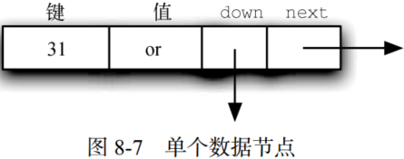
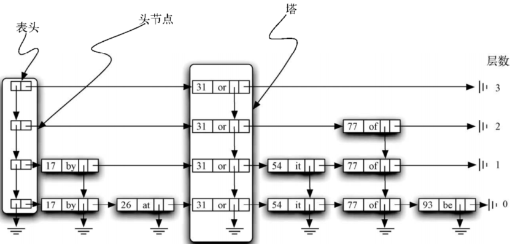
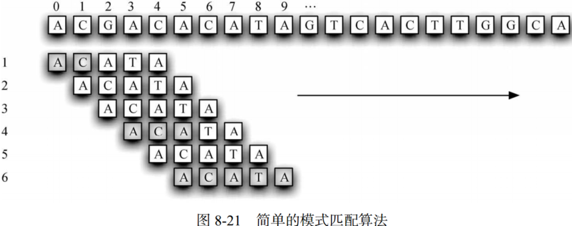
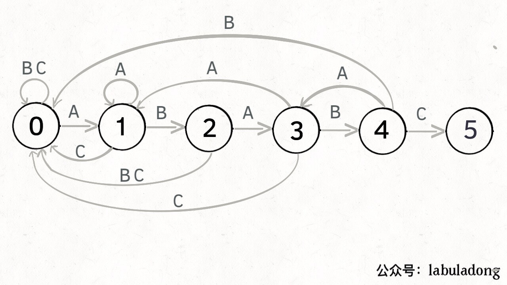

# Python 数据结构与算法分析（第八章 附加内容）

## 1. Python 列表

&emsp;&emsp;Python列表是用C语言实现的，其每个浮点数占16字节。数组索引运算：元素地址=起始地址+元素下标×元素大小。假设浮点数数组的起始地址为0x000040，其对应的十进制数为64，则数组中位置4的元素地址为：$64+4\times 16=128$。
 
&emsp;&emsp;Python使用数组实现链表的策略如下：
- 使用数组存储指向其他对象的引用（在C语言中称为指针）；
- 采用过度分配策略，给数组分配比所需的更大的空间；
- 数组被填满后，分配一个更大的数组，将旧数组的内容复制到新数组中。

&emsp;&emsp;数组扩容的方法有喝多，如每次将数组扩大一倍，乘以1.5，或使用2的幂。Python采用的方法是乘以1.125加一个常数，以期在各种CPU和内存的速度间取得平衡。

&emsp;&emsp;Python列表时间复杂度：

- 索引运算和赋值都是O(1)；
- 追加操作在一倍情况下为O(1)，在最坏情况下（数组需要扩容）是O(n)；
- 从列表尾弹出元素是O(1)；
- 从列表中删除元素是O(n)；
- 将元素插入任意位置是O(n)。

## 2. 递归

&emsp;&emsp;同余定理：如果两个数a和b除以n所得的余数相等，则a和b“对模n同余”，记为$a\equiv b(mod\, n)$。

- 定理1：如果$a\equiv b(mod\,n)$，那么$\forall c, a+c\equiv b+c(mod\, n)$。
- 定理2：如果$a\equiv b(mod\,n)$，那么$\forall c, ac\equiv bc(mod\, n)$。
- 定理3：如果$a\equiv b(mod\,n)$，那么$\forall p,p>0, a^p\equiv b^p(mod\, n)$。

### 2.1 幂剩余

&emsp;&emsp;因为：

$$
x^n(mod\,m) =(x\cdot x^n-1)(mod\,m)=(x \cdot x^n-1(mod\,m))(mod\,m)
$$

&emsp;&emsp;记$r_{n-1}=x^{n-1}(mod\,m)$，故：

$$
x^n(mod\,m)=(x\cdot x^n-1)(mod\,m)=(x\cdot r_{n-1})(mod\,m)\\
x^n\equiv x\cdot r_{n-1}(mod\,m)
$$

```python
def power_mod_recursion(x, n, m, temp):
    if n > 1:
        temp = (x*x*temp) % m
        n = n/2
        return power_mod_recursion(x, n, m, temp)
    else:
        return temp


def power_mod(x, n, m):
    if n % 2 == 0:
        result = power_mod_recursion(x, n, m, 1)
    else:
        result = power_mod_recursion(x, n-1, m, 1)
        result = (result * x) % m
    return result


print(power_mod(7, 3, 4))
print((7**3)%4)
```

## 2.2 RSA算法

&emsp;&emsp;正整数$x$关于模$m$的逆元$a$满足$ax\equiv 1(mod\,m)$。例如，$x=3,m=7,a=5,3\times 5=15,15$%$7=1$，所以5是3关于模7的逆元。当且仅当m和x互素时，x关于模m才有逆元。

&emsp;&emsp;RSA加密算法首先选择两个大素数$p,q$，则

- 公钥：$e, n$，$n=p\times q$；$e$与$(p-1)\times (q-1)$互素；
- 私钥：$d$，$d$为$e$关于模$(p-1)\times (q-1)$的逆元;

&emsp;&emsp;记明文为$m$，密文为$c$，

- 公钥加密：$c=m^e(mod\, n)$；
- 私钥解密：$m=c^d(mod\, n)$

&emsp;&emsp;证明，

$$
c^d\equiv (m^e)^d(mod\,n) (定理3)\\
\equiv m^{ed}(mod\,n)
$$

&emsp;&emsp;又因为d是e(mod n)的逆元，则

$$
ed=1+\phi(n)
$$

&emsp;&emsp;其中，$\phi(n)$为欧拉函数，表示$n$的个数，则

$$
m^{ed}\equiv m\cdot m^{\phi(n)}(mod\,n)
$$

&emsp;&emsp;由Euler-Fermat theorem知：

&emsp;&emsp;若m，n互为质数，则:

$$
m^{\phi (n)}\equiv 1(mod\,n)
$$

&emsp;&emsp;Euler-Fermat theorem告诉我们若m，n互质，则无论多少个m连乘其均与n互质。

&emsp;&emsp;由RSA算法设计知，n为两个大素数的乘积，而m为明文编码。因此m，n互质。由定理2有：

$$
m\cdot m^{\phi(n)}\equiv m\cdot 1(mod\,n)=m(mod\,n)
$$

&emsp;&emsp;故：

$$
c^d\equiv m(mod\, n)
$$

&emsp;&emsp;私钥解密证明完毕。

## 3. 跳表

&emsp;&emsp;跳表是二维链表，链接的方向向前（也就是向右）或向下。 表头在图中的左上角，它是跳表结构唯一的入口。如下：

<center>


</center>

&emsp;&emsp;跳表由一些数据节点构成，每个节点存有一个键及其关联的值。此外，每个节点还有两个向外的引用。

<center>


</center>

&emsp;&emsp;跳表最左边的一列由头节点的链表组成。每个头节点都有两个引用，分别是 down 和 next。 down 引用指向下一层的头节点， next 引用指向数据节点的链表。由数据节点构成的纵列称作塔。塔是由数据节点中的 down 引用连起来的。可以看出，每一座塔都对应一个键–值对，并且塔的高度不一。

&emsp;&emsp;跳表每一层实际上都是由数据节点组成的有序链表，其顺序由键决定。每个链表都有自己的名字，通常用其层数指代。层数从0 开始，底层就是第 0 层，包括整个节点集合。每个键–值对都必须出现在第 0 层的链表中。不过，层数越高，节点数就越少。跳表的这个重要特征有助于提高搜索效率。可以看到，每一层的节点数和塔的高度息息相关。

### 3.1 跳表搜索

&emsp;&emsp;搜索从表头开始，直到找到键，或者检查完所有的数据节点。搜索的基本思路是从顶层的头节点开始往右查找。如果没有数据节点，就下降一层；如果有数据节点，就比较键的大小。如果匹配，就说明搜索成功。如从表头开始搜索 77。第一个头节点指向存储 31 的数据节点。因为 31 小于 77，所以向前移动。含 31 的数据节点位于第 3 层，它没有下一个节点，所以必须下降到第 2 层。在这一层，我们发现了键为 77 的数据节点。搜索成功，返回单词 of。注意，搜索过程“跳过”了 17 和 26。同理，可以忽略 54，从 31 直接跳到 77。

&emsp;&emsp;由于跳表每一层是一个有序链表，所以不匹配的键提供了很有用的信息。如果要找的键小于数据节点中的键，就说明这一层不会有包含目标键的数据节点。这时，就需要下降一层。如果已经降至底层，说明跳表中没有要找的键，因为第 0 层是完整的有序链表。另一方面，只要当前层的节点有比目标键更小的键，就往下一个节点移动。进入下一层后，重复上述过程，检查是否有下一个节点。每降一层，跳表就可以提供更多的数据节点。

### 3.2 数据插入

&emsp;&emsp;向跳表中新添键–值对，本质上需要两步。第一步，搜索跳表，寻找插入位置。第二步是新建一个数据节点，并将它加到第 0 层的链表中。

&emsp;&emsp;如向跳表中插入65，使用和前一节一样的搜索策略，我们发现 65 比 31 大。第 3 层没有更多的节点，因此降至第 2 层。在这一层，我们发现 77 比 65 大。继续降至第 1 层，下一个节点是 54，它小于 65。继续向右，遇到 77，再往下转，遇到 None，则新建一个数据节点，并将它加到第 0 层的链表中。此外，还需为新插入的数据构建塔，他的高度随机确定。

&emsp;&emsp;如果简单地用一个有序链表存储键–值对，那么搜索方法的时间复杂度将是$O(n)$。而跳表搜索操作的时间复杂度是$O(logn)$（跳表在任一层需要查看的节点数都是常数，而跳表的高度是$O(logn)$）。由于插入操作的大部分时间花在查找插入位置上，所以插入操作的时间复杂度也是$O(logn)$。

## 4. 模式匹配

### 4.1 简单比较

&emsp;&emsp;要解决 DNA 串的模式匹配问题，可直接尝试匹配模式和文本的所可能。图8-21展示了这一算法的原理，即从左往右，逐个比较文本和模式的字母。如果当前字母匹配，就比较下一个。如果字母不匹配，将模式往右滑动一个位置，重新开始比较。

<center>


</center>

&emsp;&emsp;假设文本长度为 n，模式长度为 m。很容易看出，这个算法的时间复杂度是$O(nm)$。对于 n个字母中的每一个，都可能需要比较模式中的全部字母（m 个）。如果 n 和 m 比较小，这个算法的效率尚可，但是考虑到文本中有数以千计，甚至数以百万计——的字母，并且要找到更大的模式，寻找更好的算法就显得很有必要。

### 4.2 KMP

&emsp;&emsp;简单比较将文本中的每个可能匹配成功的子串都与模式比较，这样做效率较低。一种改善措施是，如果不匹配，就以多于一个字母的幅度滑动模式。

&emsp;&emsp;有关KMP算法的详细介绍可参考此篇文章[KMP 算法详解](https://zhuanlan.zhihu.com/p/83334559)。KMP算法的核心是状态转移图的构建，其构建过程，需比较模式字符串前后缀的交集。

&emsp;&emsp;记匹配模式字符串为ABABC，则其状态转移图如下：

<center>


</center>

&emsp;&emsp;如图所示，状态0和5分别为初始和结束状态。若初始匹配值为A（匹配）则由状态0进入状态1，若初始匹配值为BC（不匹配）则仍退回至状态0。若状态为4，即ABAB均已匹配，下一个匹配值为C（匹配）则进入转态5，若下一个匹配值为A则回退至状态3，这是因为ABABA的前缀集合为{ABAB，ABA，AB，A}，后缀集合为{BABA，ABA，BA，A}。两集合的交集最大长度为ABA，因此回退至状态3。而ABABB的前缀集合为{ABAB，ABA，AB，A}，后缀集合为{BABB，ABB，BB，B}。两集合的交集的最大长度为空，因此回退至状态0。

&emsp;&emsp;由于KMP算法仅需逐字符遍历文本一次，因此你其时间复杂度是$O(n)$。

## 7. 参考文献
- [Python数据结构与算法分析（第2版）](https://yun.weicheng.men/Book/Python%E6%95%B0%E6%8D%AE%E7%BB%93%E6%9E%84%E4%B8%8E%E7%AE%97%E6%B3%95%E5%88%86%E6%9E%90_%E7%AC%AC2%E7%89%88.pdf)
