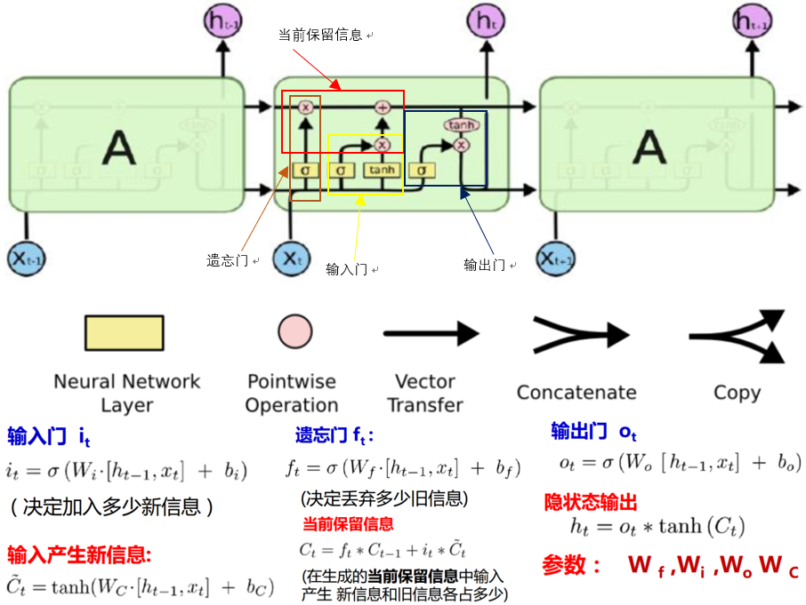
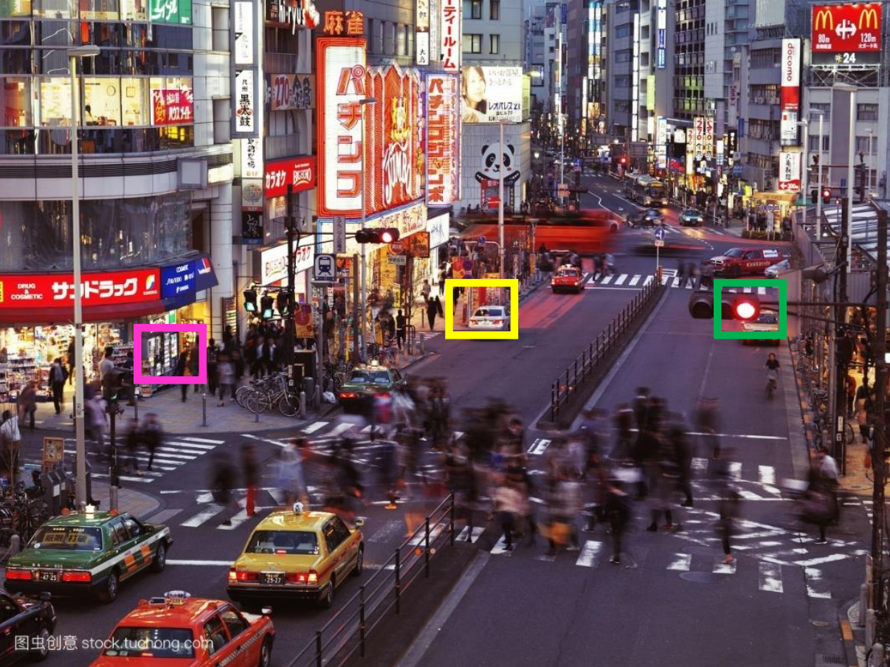

# RNN-LSTM-Motivation

## 循环神经网络（RNN）

&emsp;&emsp;对于处理输入、输出不定长且存在上下文依赖的序列数据，类似DNN、CNN网络其效率较低，且无法解决依赖问题。对此我们需引入循环神经网络。（RNN， Recurrent Neural Network）（区别递归神经网络RNN，Recursive Neural Network。循环神经网络可以看做是数据以链状结构展开，而递归神经网络数据则以树状结构展开，其主要刻画数据或知识间的推理过程，然而树的构建仍是目前的难点）RNN的核心思想即是将数据按时间轴展开，每一时刻数据均对应相同的神经单元，且上一时刻的结果能传递至下一时刻。至此便解决了输入输出变长且存在上下文依赖的问题。

&emsp;&emsp;循环神经网络可以看做在做“加法”操作，即通过加法中的进位操作，将上一时刻的信息或结果传递至下一时刻，如下所示：

 
图1. 加法单元 

&emsp;&emsp;RNN单元结构及其在时序上的展开如下图所示：

 

图2. RNN网络结构 

&emsp;&emsp;可以看出RNN网络的输入输出均为序列数据，其网络结构本质上是一个小的全连接循环神经网络，只不过在训练时按时序张开。

&emsp;&emsp;RNN网络前向传播过程如下：

 
图3. RNN前向传播过程

&emsp;&emsp;RNN网络误差反向传播过程如下：

 
图4. RNN训练过程 

&emsp;&emsp;RNN的训练过程与一般的DNN网络训练方法类似，采用BPTT的误差反向传播算法，在此不做过多的介绍。（有关[BP算法](https://zhuanlan.zhihu.com/p/47967940)的介绍具体可以参看我的这篇笔记）这里需要注意的是，RNN的训练过程是子网络沿时间轴的展开，其本质上仍在训练同一个子网络，因此在每次梯度下降时我们需要对同一个子网络的参数进行更新。常见的做法是在每一次参数的调整使均指向同一内存地址。

&emsp;&emsp;虽然RNN对于序列数据给出了较好的解决方案，然而对于较长的序列输入，为解决长期依赖问题，我们一般需要较深的神经网络，但是同一般的深度网络一样，RNN也存在优化困难的问题，即训练时间长，梯度消失（$\prod_{i=k+1}^t(W^h)^Tdiag[f'(a_{i-1})]<1$，出现情况较少，但对优化过程影响很大）和梯度爆炸问题（$\prod_{i=k+1}^t(W^h)^Tdiag[f'(a_{i-1})]>1$，大部分情况）。对于梯度消失问题，由于相互作用的梯度呈指数减少，因此长期依赖信号将会变得非常微弱，而容易受到短期信号波动的影响，对此可行的解决方法包括网络跨层连接、ESN、回声状态网络或引入leaky unit。而对于梯度爆炸问题，我们一般采取梯度截断的方法。目前解决RNN网络长期依赖问题更为普遍的做法是引入LSTM单元。

&emsp;&emsp;Rnn网络长期依赖问题：

- The cat, which already ate a bunch of food, (was) full.
- The cats, which already ate a bunch of food, (were) full.

## 长短时记忆神经网络（LSTM）

&emsp;&emsp;长短时记忆网络（LSTM,long short-term memory）结构是由Sepp Hochreiter和Jiirgen Schrnidhuber于1997年提出，所以其并非是一个深度学习的产物，在很多任务中采用LSTM结构的循环神经网络比标准的循环神经网络表现更好。LSTM与单一tanh循环体结构不同，其拥有三个特殊的“门”结构，它是一种特殊的循环体网络。

&emsp;&emsp;LSTM单元不仅接受此时刻的输入数据$x_t$和上一时刻的状态信息$h_{t-1}$，其还需建立一个机制能保留前面远处结点信息不会被丢失。具体操作是通过设计“门” 结构实现保留信息和选择信息功能（遗忘门、输入门），每个门结构由一个sigmoid层和一个poinewise操作（按位乘法操作）构成。其中sigmoid作为激活函数的全连接神经网络层会输出一个0到1之间的数值，描述当前输入有多少信息量可以通过这个结构，其功能就类似于一扇门。

&emsp;&emsp;对于遗忘门，其作用是让循环神经网络“忘记”之前没有用的信息。遗忘门会根据当前的输入$x_t$和上一时刻输出$h_{t-1}$决定哪一部分记忆需要被遗忘。假设状态$c$的维度为$n$，“遗忘门”会根据当前的输入$x_t$和上一时刻输出$h_{t-1}$计算一个维度为$n$的向量$f=sigmoid(W_1x＋W_2h)，其在每一维度上的值都被压缩在（0,1）范围内。最后将上一时刻的状态$c_{t-1}$与$f$向量按位相乘，在$f$取值接近0的维度上的信息就会被“遗忘”，而$f$取值接近1的维度上的信息将会被保留 。

&emsp;&emsp;在循环神经网络“忘记”了部分之前的状态后，它还需要从当前的输入补充最新的记忆。这个过程就是通过输入门完成的。输入门会根据$x_1$和$h_{t-1}$决定哪些信息加入到状态$c_{t-1}$中生成新的状态$c_t$。输入门和需要写入的新状态均是由$x_t$和$h_{t-1}$计算产生。

&emsp;&emsp;LSTM结构在计算得到新的状态$c_t$后需要产生当前时刻的输出，这个过程是通过输出门完成的。输出门将根据最新的状态$c_t$、上一时刻的输出$h_{t-1}$和当前的输入$x_t$来决定该时刻的输出$h_t$。通过遗忘门和输入门的操作循环神经网络LSTM可以更加有效地决定哪些序列信息应该被遗忘，而哪些序列信息需要长期保留，其结构如下图所示：

 

图5. LSTM单元结构 

&emsp;&emsp;LSTM结构如上图所示，可以看出其结构较为复杂，这也引起了研究人员的思考：LSTM结构中到底那一部分是必须的？还可以设计哪些结构允许网络动态的控制时间尺度和不同单元的遗忘行为？对此Kyunghyun Cho et al.等人设计GRU单元(Gated recurrent unit)，以简化LSTM，如下所示：

 
图6. GRU单元结构 

&emsp;&emsp;如上图所示，GRU与LSTM最大的区别是其将输入门和遗忘门合并为更新门（更新门决定隐状态保留放弃部分）。然而在众多的LSTM变种中，其在很多任务中性能和鲁棒性均比不上GRU和LSTM。

## RNN扩展结构

&emsp;&emsp;对于一般的RNN网络，其只有一个“因果”结构，即在时刻$t$的状态只能由过去的序列$x_1,x_2,...,x_{t-1}$以及当前的输入$x_t$确定。然而，在许多应用中，，例如在语音识别中，由于协同发音和词与词之间的语义依赖，当前声音作为音素的正确解释可能取决于未来几个音素。即如果当前的词有两种或更多声学上合理的解释，我们可能要在更远的未来（和过去）寻找信息区分它们。因此输出的预测$y_t$可能依赖于整个输入序列。对此我们必须设计更新的网络结构同时结合上下文信息，双向RNN（Bidirectional RNNs）应运而生。

 

图7. 双向RNN网络结构 

&emsp;&emsp;从图7中可以看出，双向循环神经网络的主体结构就是两个单向循环神经网络的结合。在每一个时刻，输入会同时提供给正向输入隐层（上文信息）和反向输入隐层（下文信息）。两个隐层（可看做两个独立的单向的RNN）独立进行计算，各自产生该时刻的新状态和输出，而双向循环网络的最终输出是这两个单向循环神经网络的输出的简单拼接。两个循环神经网络除方向不同以外，其余结构完全对称。每一层网络中的循环体可以自由选用任意结构，如简单的RNN、LSTM等。 双向循环神经网络的前向传播过程和单向循环神经网络类似，这里不再赘述。更多关于双向神经网络的介绍可以参考Mike Schuster和Kuldip K. Paliwal
发表的论文Bidirectional recurrent neural networks。此外，双向RNN的思想也应用至二维输入，如图像中。对于图像其由4个RNN组成（上、下、左、右），如果 RNN能够学习到承载长期信息，那在二维网格每个点的输出就能计算一个能捕捉到大多局部信息但仍依赖于长期输入的表示。相比卷积网络，应用于图像的RNN计算成本通常更高，但允许特征图间存在长期的相互作用。（Visin et al., 2015;Kalchbrenner et al., 2015）

&emsp;&emsp;另外还有Jordan Network、Deep RNN、Deep Bidirectional RNN等扩展，如下：

 

图8. Jordan Network、Deep RNN、Deep Bidirectional RNN网络结构 

&emsp;&emsp;深层循环神经网络（ Deep RNN〉是循环神经网络的另外一种变种。为了增强模型的表达能力，可以在网络中设置多个循环层，将每层循环网络的输出传给下一层进行处理。对于普通的RNN，每一时刻的输入到输出之间只有一个全连接层，即在输入到输出的路径上是一个很浅的神经网络，因此从输入中提取抽象信息的能力将受到限制。而对于Deep RNN如图8所示，在每一时刻的输入到输出之间有多个循环体，网络因此可以从输入中抽取更加高层的信息。和卷积神经网络类似，每一层的循环体中参数是一致的，而不同层中的参数可以不同。

## Encoder-Decoder框架

&emsp;&emsp;虽然LSTM确实能够解决序列的长期依赖问题，但是对于很长的序列（长度超过30），LSTM效果也难以让人满意，这时我们需要探索一种更有效的方法，即注意力机制（attention mechanism）。在介绍注意力机制前，我们先了解一种常用的框架：Encoder-Decoder框架。

&emsp;&emsp;在上文的讨论中，我们均考虑的是输入输出序列等长的问题，然而在实际中却大量存在输入输出序列长度不等的情况，如机器翻译、语音识别、问答系统等。这时我们便需要设计一种映射可变长序列至另一个可变长序列的RNN网络结构，Encoder-Decoder框架呼之欲出。

&emsp;&emsp;Encoder-Decoder框架是机器翻译（Machine Translation）模型的产物，其于2014年Cho et al.在Seq2Seq循环神经网络中首次提出。在统计翻译模型中，模型的训练步骤可以分为预处理、词对齐、短语对齐、抽取短语特征、训练语言模型、学习特征权重等诸多步骤。而Seq2Seq模型的基本思想非常简单一一使用一个循环神经网络读取输入句子，将整个句子的信息压缩到一个固定维度（注意是固定维度，下文的注意力集中机制将在此做文章）的编码中；再使用另一个循环神经网络读取这个编码，将其“解压”为目标语言的一个句子。这两个循环神经网络分别称为编码器（Encoder）和解码器（Decoder），这就是
encoder-decoder框架的由来。如下图所示：

 
图9. Encoder_Decoder框架

&emsp;&emsp;Decoder：根据$x$的中间语义表示$c$和已经生成的$y_1,y_2,...,y_{i-1}$来生成$i$时刻的$y_i,y_i=g(c,y_1,y_2,...,y_{i-1})$。解码器部分的结构与一般的语言模型几乎完全相同：输入为单词的词向量，输出为softmax层产生的单词概率，损失函数为log perplexity。事实上，解码器可以理解为一个以输入编码为前提的语言模型。语言模型中使用的一些技巧，如共享softmax层和词向量的参数，均可以直接应用到 Seq2Seq模型的解码器中。

&emsp;&emsp;Encoder：对输入序列$x$进行编码，通过非线性变换转化为中间语义表示$c,c=F(x_1,x_2,...,x_m)$。编码器部分网络结构则更为简单。它与解码器一样拥有词向量层和循环神经网络，但是由于在编码阶段并未输出最终结果，因此不需要softmax层。

&emsp;&emsp;Encoder-Decoder是一个十分通用的计算框架，其使用的具体模型如，CNN/RNN/Bi-RNN/GRU/LSTM/Deep LSTM等可根据不同的场景需求确定。此外，Encoder-Decoder框架其本质是实现直观表示（例如词序列或图像）和语义表示之间来回映射。故通过该框架我们可以使用来自一种模态数据的编码器输出作为用于另一模态的解码器输入，以实现将一种模态转换到另一种模态的系统。正因为这个强大的功能，Encoder_Decoder框架以应用于机器翻译，图像生成标题等众多任务中。

## 注意力机制（Attention Mechanism）

&emsp;&emsp;Attention Mechanism最早引入至自然语言中是为解决机器翻译中随句子长度（超过50）增加其性能显著下降的问题，现已广泛应用于各类序列数据的处理中。机器翻译问题本质上可以看做是编码解码问题，即将句子编码为向量然后解码为翻译内容。早期的处理方法一般是将句子拆分为一些小的片段分别单独进行处理，深度学习通过构建一个大型的神经网络对同时考虑整个句子内容，然后给出翻译结果。其网络结构主要包括编码和解码两个部分，如双向RNN网络（Cho et al., 2014 and Sutskever et al., 2014）。编码器将一个句子编码为固定长度的向量，而解码器则负责进行解码操作。然而实验表明这种做法随着句子长度的增加，其性能将急剧恶化，这主要是因为用固定长度的向量去概括长句子的所有语义细节十分困难，这将需要足够大的RNN网络和足够长的训练时间。为克服这一问题，Neutral Machine Translation by Jointly Learning to Align and Translate文中提出每次读取整个句子或段落，通过自适应的选择编码向量的部分相关语义细节片段进行解码翻译的方案。即对于整个句子，每次选择相关语义信息最集中的部分同时考虑上下文信息和相关的目标词出现概率进行翻译。该文章最大的贡献就是首次提出了注意力集中机制（Attention Mechanism）（本质上是加权平均形成上下文向量），这在长句子的处理中得到了广泛的应用。

 
图10. Attention Mechanism演进历史

&emsp;&emsp;从上图可以看到注意力机制最早出现于图像标注领域，即对于同一场景，不同的人或任务会有不同的关注对象，如下：

 
图11. Attention Mechanism在图像标注中的体现

&emsp;&emsp;注意力机制的主要亮点在于对于seq2seq模型中编码器将整个句子压缩为一个固定长度的向量$c$，而当句子较长时其很难保存足够的语义信息，而Attention允许解码器根据当前不同的翻译内容，查阅输入句子的部分不同的单词或片段，以提高每个词或者片段的翻译精确度。具体做法为解码器在每一步的解码过程中，将查询编码器的隐藏状态。对于整个输入序列计算每一位置（每一片段）与当前翻译内容的相关程度，即权重。再根据这个权重对各输入位置的隐藏状态进行加权平均得到“context”向量（Encoder-Decoder框架向量$c$），该结果包含了与当前翻译内容最相关的原文信息 。同时在解码下一个单词时，将context作为额外信息输入至RNN中，这样网络可以时刻读取原文中最相关的信息，而不必完全依赖于上一时刻的隐藏状态。对比社seq2seq,Attention本质上是通过加权平均，计算可变的上下文向量$c$。

 

 

图12. Attention Mechanism

&emsp;&emsp;图12中的$K$为网络最终的输出结果；$Q$即为Attention-Value；$f(Q,K)$为注意力打分函数（包括多种形式，如乘法公式：dot、general、concat；加法公式：perceptron），其值$\alpha$的大小反应输出对输入不同片段的重视程度；$V$即为输入词向量；其最终的输出结果$Attention(Q,K,V)$即为context向量，其包含了此时输出片段对输入所关注内容的全部信息。在GNMT中其context的计算如下所示：

&emsp;&emsp;其中，第$j$时刻的$context_j$计算如下：

$$
\alpha_{ij}=\frac{exp(e(h_i,s_j))}{\sum_iexp(e(h_i,s_j))}\\
e(h,s)=Utanh(Vh+Ws)\\
context_j=\sum_i\alpha_{i,j}h_i\tag{1}
$$

&emsp;&emsp;上式中，$U,V,W$为模型参数。$h_i$表示编码器在第$i$个单词上的输出，$s_j$为编码器预测第$j$个单词的状态，$α$为通过Softmax计算的权值，$e(h,s)$为计算原文各单词与当前解码器状态的“相关度”函数，其构成了包含一个隐藏层的全连接神经网络。

&emsp;&emsp;除上式外，注意力机制还有多种其他设计，如Minh-Thang Luong等人提出的$e(h,s)=h^TWs$。或直接使用两个状态之间的点乘$e(h,s)=h^Ts$。需要注意的是无论采用哪个模型的“相关度”函数$e(h,s)$，通过softmax计算权重$α$和通过加权平均计算context的方法都是一样的。对比Attention和seq2seq可以发现主要有两点差别：（1）Attention编码器采用了一个双向循环网络。虽然seq2seq模型也可以使用双向循环网络作为编码器，但是在注意力机制中，这一设计必不可少。其主要是因为解码器通过注意力查询一个单词时，通常需要知道该单词周围的部分信息，而双向RNN通常能实现这一要求。（2）Attention中取消了编码器和解码器之间的连接，解码器完全依赖于注意力机制获取原文信息。取消这一连接使得编码器和解码器可以自由选择模型。例如它们可以选择不同层数、不同维度、不同结构的循环神经网络，可以在编码器中使用双向LSTM，而在解码器使用单向LSTM，甚至可以用卷积网络作为编码器、用循环神经网络作为解码器等。

 

图13. 图片标题的生成

&emsp;&emsp;上图为Attention Mechanism在图像标题生成中的应用，从中可以明显看出标题中的描述内容（下划线部分）在图片中即对应高亮区域。此外attention mechanism的一些变式，如Hard AM、Soft AM、Global AM、Local AM的结构如下：

 
图14. Attention Mechanism的变种

- Soft AM：在注意力分配概率分布的计算过程中，对于输入句子$X$中任意一个单词都给出对应的概率，为概率分布；
- Hard AM：直接从输入句子里面找到某个特定的单词，然后将目标句子单词和这个单词对齐，而其它输入句子中的单词规定对齐概率为0；
- Global AM：Decode端Attention的计算考虑输Ecoder端序列中所有词汇；
- Local AM：Local Attention Model本质上是Soft AM和 Hard AM的一个混合或折中。即一般首先预估一个对齐位置Pt，然后在Pt左右大小为D的窗口范围中计算类似于Soft AM的概率分布。

&emsp;&emsp;注意力机制是－种高效获取信息的方式。一方面，它使得解码器可以在每一步主动查询最相关的信息，而暂时忽略不相关的信息；另 一方面，它大大缩短了信息流动的距离。在传统的seq2seq模型中，如果解码器生成最后一个单词时需要用到编码器读入的第一个单词的信息，那么这个信息需要通过所有的LSTM节点才能从编码器的最前端传递到编码器的最后端，而有了注意力机制后，解码器在任意时刻只需一步就可以查阅输入的任意单词。鉴于这些优点，注意力机制在很多模型中得到了广泛应用。例如ConvSeq2Seq模型使用卷积神经网络取代了Seq2Seq模型的循环神经网络，同时仍使用相似的注意力机制在编码器和解码器之间传递信息。Transformer模型既不使用循环神经网络，也不使用卷积神经网络，而完全使用注意力机制在不同神经层之间传递信息，并在机器翻译任务中取得了不错的效果。在图像领域中，注意力机制和卷积神经网络结合，在图像分类、图片描述生成等应用上取得了很好的效果。

## Machine Translation

&emsp;&emsp;机器翻译主要的方法包括以下几种：统计机器翻译（Statistical Machine Translation, SMT），基于规则的机器翻译（Rule-Based Machine Translation, RBMT），以及两种方法的结合（Hybrid Systems）。无论是人或机器，翻译结果都要求尽可能接近原文所表达的意思，减少失真，因此翻译绝不是每个词汇的简单替代。对于人工翻译，我们必须分析句法、语法、句子结构结合上下文甚至句子内容所涉及的领域知识去理解句子含义。早期，众多的方法均将关注点放在individual language pairs的构建上，因为构建一个单一的系统去完成多种语言间的相互翻译实在是太困难了。2014年Sutskever等人提出seq2seq模型（Encoder-Decoder框架）首次实现了End-to-End的机器翻译。2015年，Bahdandu等人发明了注意力机制缓解了长句子性能急剧下降的问题，并将其简单的应用于多种语言的翻译任务中。2015年，Dong等人通过增加一系列的decoder和attention mechanism以实现multilingual machine translation。同样Luong等人也在多语言翻译上进行了尝试，与Dong不同的是其只使用一个attention mechanism而扩展了多个encoders and decoders。2016年 Caglayan et al., Zoph and Kninght, Firat et al., Lee et al.等多位学者也分别针对multilingual machine translation提出了不同的方案。然而这些方法要么需要针对不同的语言设计不同的encoder-decoder or attention mechanism，要么需要multi-way parallel corpus，要么只能实现针对一种target language的translation。

&emsp;&emsp;2016年Google针对多语言翻译任务提出了一种新的解决方案，其对于不同语言间的翻译只需对输入的翻译句子进行处理而模型保持相同，即single model to translating multiple languages。更为强大的是其模型能够实现Zero-shot translation，一种类似推理的能力。对于human，如果你同时掌握中文和英文以及中文和日语间的相互翻译，那么你将很容易实现日语和英文间的翻译，然而对于机器却很难做到，但是在Google的这篇文章中却很好的实现了这一点，其称此为zero-shot translation。

&emsp;&emsp;Google’s Multilingual Neural Machine Translation System: Enabling Zero-Shot Translation这篇文章中所使用的网络结构与Google 2016年所提出的GNMT网络结构大致相同（Yonghui Wu et al., 2016）,只不过对输入数据增加了一个针对目标语言的人工标记。但是需要注意的是，虽让其能在一定程度上实现zero-shot translation，但是相较于同族语言（English、French），对于不同族（family）的语言如Spanish与Japanese间的翻译，其BLUE score却很难令人满意。

### GNMT(Google's Neural Machine Translation)

&emsp;&emsp;GNMT于2016年提出，其试图克服传统NMT存在的三个gaps：

- 网络训练和翻译速度较慢。尤其是对于翻译问题，由于网络参数众多，其速度远慢于phrased-based systems。
- 对于未登陆词或罕见词汇，其模型不够鲁棒。尽管由于大多数rare words为组织机构名或地名等词汇，可以通过简单的复制一定程度上缓解。然而，对于较深的网络其attention mechanism也将变得不稳定，无法达到较好的效果。
- 传统的NMT有时无法对input sentence给出完整的翻译结果，换言之其无法cover整个input，这样会导致翻译内容无法满足要求。

&emsp;&emsp;针对上述gaps，GNMT分别提出了一系列的解决方案，并一定程度上取得了不错的效果。具体而言其网络的结构设计如下图所示：

 
图15. GNMT网络结构

&emsp;&emsp;其具体细节如下：

- general:

（1）encoder和decoder共享embeddings；

（2）网络使用多块GPU并行训练（包括数据并行和模型并行），训练策略为SGD结合Adam，Batch size一般为128；

（3）采用GLUM Score代替简单的对数似然作为模型Training Criteria；

&emsp;&emsp;对于一般的网络其目标函数一般是最大化对数似然：

$$
O_{ML}(\theta)=\sum_{i=1}^NlogP_{\theta}(Y^{*^{i}}|X_i)\tag{2}
$$

&emsp;&emsp;上式中，$\theta$为模型参数，$x_i$为输入序列，$Y^{*^{i}}$为预测值。然而观察上式，我们可以明显看出其只能反映翻译的整体水平，而并不能反映每个翻译结果的Blue Score的ranking，且模型的鲁棒性很差。因此这里引进$r(Y,Y^{*^{(i)}})$反映每一句子的得分并定义GLEU Score如下：

$$
O_{RL}(\theta)=\sum_{i=1}^N\sum_{Y\in\frak Y}logP_{\theta}(Y^{*^{i}}|X_i)r(Y,Y^{*^{(i)}})\tag{3}
$$

&emsp;&emsp;此外，为使模型结果更加稳定文中对$O_{ML}(\theta)$、$O_{RL}(\theta)$进行线性组合，如下：

$$
O_{Mixed}(\theta)=\alpha O_{ML}(\theta)+O_{RL}(\theta)\tag{4}
$$

&emsp;&emsp;上式中，$\alpha$为混合系数，文中取0.017。在具体的训练过程中，先选择$O_{ML}(\theta)$使模型收敛，然后使用$O_{Mixed}(\theta)$进一步提高翻的译准确性。

（4）采用label smoothing loss（smoothing因子取0.1）；

- encoder:
  
（1）encoder采用8层LSTM，其idden size为1024，第一层采用双向LSTM结构，其余层为单向结构；

&emsp;&emsp;Encoder第一层的双向连接结构如下：

 
图16.双向结构

&emsp;&emsp;文中设计的网络结构中只在Encoder的第一层使用了双向LSTM，其余的层仍然是单向LSTM，通过双向连接以更好的获得上下文信息。

（2）从第三层开始采用残差连接；

&emsp;&emsp;其残差结构如下图所示：

 
图17.残差结构

&emsp;&emsp;如上图所示，左边为普通的LSTM结构，右边即为残差连接结构。通过残差结构以提高网络的性能，训练更深的网络。考虑第$i$层和第$i+1$层LSTM，记网络参数分别为$W^i$和$W^{i+1}$，则在第$t$时刻对于普通LSTM及残差LSTM分别有：

（a）normal LSTM:

$$
c^i_t,m_t^i = LSTM_i(c^i_{t−1}, m^i_{t-1},x_t^{i−1};W^i)\\
x_t^i=m_t^i\\
c^{i+1}_t,m_t^{i+1}=LSTM_{i+1}(c^{i+1}_{t-1},m^{i+1}_{t-1},x_t^i;W^{i+1})\tag{5}
$$

(b) residual LSTM:

$$
c^i_t,m_t^i = LSTM_i(c^i_{t−1}, m^i_{t-1},x_t^{i−1};W^i)\\
x_t^i=m_t^i+x_t^{i-1}\\
c^{i+1}_t,m_t^{i+1}=LSTM_{i+1}(c^{i+1}_{t-1},m^{i+1}_{t-1},x_t^i;W^{i+1})\tag{6}
$$

&emsp;&emsp;上式中，$x_t^i$为$$t时刻$LSTM_i$的输入，$m_t^i$和$c_t^i$分别为hidden states及memory states。

- decoder:

（1）8层单向LSTM且为全连接结构，其hidden size为1024；

（2）至第三层开始采用残差连接；

- attention:

（1）对Bahdanau attention进行标准化处理；

（2）encoder最后一层的输出于decoder第一层的输入结合，然后在当前timestep从新计算权值及context；

&emsp;&emsp;其中cotext的计算公式如下：

$$
s_t=AttentionFunction(y_{i-1},x_t),\quad \forall_t,1\leq t\leq M\\
p_t=exp(s_t)/\sum_{t=1}^Mexp(s_t)\\
a_i=\sum_{t=1}^Mp_tx_t\tag{7}
$$

&emsp;&emsp;其各参数代表含义均与Attention Mechanism相同。

- inference:

（1）采用beam search，其beam size为默认值5；

（2）引入惩罚项，并对长句子进行normalization处理；

&emsp;&emsp;此外，文中还使用了Wordpiece Model及Quantizable Model and Quantized Inference的策略进一步提高模型的性能。

&emsp;&emsp;对于未登录词的翻译问题（OOV，out-of-vocabulary），由于这些未知词通常是日期，人名，地名等，所以一个简单的方法就是直接复制这些词，而GNMT中，其采用了wordpiece model，如下：

 
图18. wordpiece

&emsp;&emsp;对比word和wordpiece我们可以看到“Jet”被拆分为“_J”和“_J”，其中“__”表示一个单词的开始。通过上述处理其在单词处理的灵活性和准确性上取得了一个很好的均衡，同时也提高了翻译的准确率和速度。

&emsp;&emsp;由于在残差的结构中$c_t^i,x_t^i$值均较小，为了减少错误的累积同时使较深的网络较快的收敛，文中将其约束在$[-\delta,+\delta]$的范围内，具体公式参阅原文，这里就不展开了。

&emsp;&emsp;综上所述，GNMT主要包括四个关键点：

- Key1. WordPiece Model有效的解决了未登录词以及心态学丰富语料的问题，提高了翻译的质量及速度；
- Key2. 模型及数据的并行处理有效提高了Seq2Seq NMT的训练速度；
- Key3. Quantizable Model and Quantized Inference的使用加速了翻译的速度；
- Key4. 其他的trick，如length-normalization, coverage penalties, similar均对模型的性能做出了贡献。

&emsp;&emsp;总之通过上述一系列操作，最后GNMT在多个流行语种间的翻译性能（速度、准确性和鲁棒性）得到了很高的提升（文中写到翻译错误率减少了近60%）。

### GMNMT（Google’s Multilingual Neural Machine Translation）

&emsp;&emsp;GMNMT被在多语言翻译任务中被描述为一种优雅、简单的方法。其使得多语言间的transfer learning以及Zero-shot translation成为了可能。

&emsp;&emsp;具体来说，该模型的结构与GNMT完全相同，只不过对输入数据做了些简单处理。因此对于语料信息较少（数据较少）的语种（小语种）由于模型相同，因此其也能得到不错的翻译结果。

 
图19. GMNMT语料处理

&emsp;&emsp;GMNMT在对多语言进间进行翻译时，一般其会将目标语言映射至一个interlingua（”中间语言“）。如下图所示：

 
图20. GMNMT语料处理

&emsp;&emsp;上图中将74个独立的语句（同一句话（语义相同）但是不同语言）在循环网络里把每一步的表征嵌入到低维空间中，最后总会汇入到一个点上。此外文中作者还进行了一些有趣的尝试，如将多语言进行混合、加权翻译等。总而言之，Google16年的这两篇文章可以认为在NMT中取得了突破性的进展。

### Transformer Attention

&emsp;&emsp;虽然GNMT在多语言的翻译问题上取得了很好的效果，然而由于其网络结构是基于传统的RNN、LSTM等序列建模的方式，其很难实现并行，训练时间较长。为克服这一缺陷，Google于2017年提出了一种全新的Attention Mechanism即Transformer。该网络结构本质上是在进行Attention编码，即对于输入序列的每一部分进行Attention编码，获取Attention矩阵。

 
图21. Transformer结构

&emsp;&emsp;上图为Transformer的整体结构框架，接下来我们进行详细介绍。

 
图22. Transformer中一般的Attention结构

&emsp;&emsp;上图为Transformer中一般化的Attention编码层，其中：

$$
Attention(Q,K,V)=softmax(\frac{QK^T}{\sqrt{d_k}})V,\;Q\to R^{n×dk},K\to R^{m×dk},V\to R^{m×dv}\tag{8}
$$

&emsp;&emsp;上式中，$\sqrt{d_k}$，为scale factor主要用于限制函数内积的大小，以防止其进入Softmax函数的饱和区网络收敛较慢。此外，我们还可以看到当图22中除去Softmax函数后，其Attention操作可理解为$n\times d_k,d_k\times m,m\times d_v$($d_k,d_v$为超参数， $n$为序列长度)三个矩阵的连乘积，最终结果为$n\times d_v$矩阵即Attention层，其中每一行即代表进过编码后的每个输入词的注意力向量（可以理解为一个词袋向量）。

（1）Self-Attention

&emsp;&emsp;当我们将图22中的$Q,K,V$均替换为输入序列$X$时，其即为Self-Attention机制。我们可以看出Self-Attention其本质是在寻找序列内部的联系，可以将其理解为在进行句法、语义分析（该过程可以看做构建依存树等）。此外Self-Attention可以摆脱句子长度的限制，无视词与词之间的距离，直接计算依赖关系，从而学习一个句子的内部结构。(这就是Transformer的最大亮点)

（2）Multi-Head Attention

&emsp;&emsp;Multi-Head Attention其本质为多个独立、平行的Attention concat而来，通过多个独立的Attention的简单拼接我们可以获得不同子空间上的相关信息。

 
图23. Multi-Head Attention结构

$$
MultiHead(Q,K,V)=Concat(head_1,...,head_h)W^O\\
head_i=Attention(QW_i^Q,KW_i^K,VW_i^V)\\
where\quad W_i^Q\in R^{d_{model}\times d_k}, W_i^K\in R^{d_{model}\times d_k}, W_i^V\in R^{d_{model}\times d_k},W^O\in R^{hd_{model}\times d_k}\tag{9}
$$

&emsp;&emsp;如果我们将多个Self-Attention与Multi-Head Attention相结合则将得到Multi—head Self Attention，即Transformer。如下图所示：

 
图24. Multi-Head Self Attention结构

&emsp;&emsp;最后文中对于Self-Attention及Multi-head self attention给出了可视化的结果，如下：

 

图25. Self-Attention与Multi-Head Self Attention结果可视化

&emsp;&emsp;从Self-Attention的可视化结果可以明显看出，对于长句子中相隔较远的且存在一定关联的词，Self-Attention也能很好的学习到其相互间的依赖关系（making...more difficult）。而Multi-Head Self Attention其能够从不同的表示子空间里学习相关信息（在two head和one head的比较中，可以看到one head中"its"这个词只能学习到"law"的依赖关系，而two head中"its"不仅学习到了"law"还学习到了"application"依赖关系）。

&emsp;&emsp;最后对比各网络结构间句向量的表达形式，如下：

 
图26. 不同网络结构句向量的构建方法

&emsp;&emsp;由图26可以看出，RNN其实就是序列中每个词向量的拼接。而RvNN通过构建句法树考虑词与词间的依存关系，构建词向量。CNN通过滑动窗口实现。而Multi-Head Self Attention即使Self-Head Attention的Concat。

&emsp;&emsp;2017年同年，Facebook也提出了Convolutional Sequence to Sequence Learning中其不同于以往RNN、LSTM的方法，通过CNN的网络结构实现seq2seq learning，并且在英-德和英-法翻译中其性能远高于GNMT，且更容易实现并行。期待NMT能有更大的突破。

## Reference

[[1] Bahdanau, D., Cho, K., and Bengio, Y. Neural machine translation by jointly learning to align
and translate. In International Conference on Learning Representations (2015)
](https://arxiv.org/pdf/1409.0473.pdf)

[[2] Cho, K., van Merrienboer, B., Gulcehre, C., Bougares, F., Schwenk, H., and Bengio, Y. (2014a). Learning phrase representations using RNN encoder-decoder for statistical machine translation. In Proceedings of the Empiricial Methods in Natural Language Processing (EMNLP 2014).](https://www.aclweb.org/anthology/D14-1179)

[[3] Cho, K., van Merrienboer, B., Bahdanau, D., and Bengio, Y. (2014b). On the properties of neural ¨
machine translation: Encoder–Decoder approaches. In Eighth Workshop on Syntax, Semantics
and Structure in Statistical Translation.](https://www.aclweb.org/anthology/W14-4012)

[[4] Chung, Junyoung; Gulcehre, Caglar; Cho, KyungHyun; Bengio, Yoshua (2014). "Empirical Evaluation of Gated Recurrent Neural Networks on Sequence Modeling".](https://arxiv.org/abs/1412.3555)

[[5] Schuster M, Paliwal K K. Bidirectional recurrent neural networks[J]. IEEE Transactions on Signal Processing, 2002, 45(11):2673-2681.](https://pdfs.semanticscholar.org/4b80/89bc9b49f84de43acc2eb8900035f7d492b2.pdf)

[[6] Vaswani A , Shazeer N , Parmar N , et al. Attention Is All You Need[J]. 2017.](https://arxiv.org/pdf/1706.03762.pdf)

[[7] Yonghui Wu, Mike Schuster, and Zhifeng Chen et al. 2016. Google’s neural machine translation system: Bridging the gap between human and machine translation. arXiv preprint arXiv:1609.08144v2.](https://arxiv.org/abs/1609.08144)

[[8] Johnson M , Schuster M , Le Q V , et al. Google's Multilingual Neural Machine Translation System: Enabling Zero-Shot Translation[J]. 2016.](http://research.google.com/pubs/pub45733.html)

