# Recommendation System

&emsp;&emsp;随着计算机技术的快速发展，以及互联网经济的不断成熟，推荐系统越来越成为研究人员关注的热点。许多大型的互联网公司其经济收益均与推荐系统有直接的联系。比如，Amazon35%的销售来自推荐，Google News推荐增加了38%的点击率，Netflix2/3的电影出租来自推荐等。其实推荐与检索（有关检索的相关知识可以参考我的这一篇笔记[检索中的各类Hash及其应用](https://zhuanlan.zhihu.com/p/53417083)）是密不可分的两种技术，其中一个可以看作是主动过程，另一个则是被动过程。在介绍Recommendation System之前我想首先说明的是推荐系统一定是基于“信息过载”问题而提出的，即在这样一个大数据、信息爆炸的时代我们很难去获得真正感兴趣的物品或信息，而推荐系统的目的则是帮助用户更好的发现自己的需求或兴趣。因此只有当存在信息过载问题且用户的兴趣较为广泛，并能保持较长时间的稳定不变，那么我们或许才真正的需要推荐系统。

## 1. Introduction

&emsp;&emsp;推荐系统是一个很大的话题，大到用户兴趣定向的在线广告系统，小到论文的推荐，各种在线甚至部分离线的系统中，都会有各式各样目标不一的推荐系统。在信息过载的时代，推荐系统的主要任务就是联系用户和信息，一方面帮助用户发现对自己有价值的信息，另一方面让信息能够展现在对它感兴趣的用户面前，从而实现信息消费者和信息生产者的双赢。因此推荐系统具有很强的定制化特征。一般情况下，我们可以将推荐问题看做评分预测问题，即根据用户的信息（人口统计学信息以及用户的历史行为信息，如ratings, preferences, situational context）和商品的信息，计算两者间的relevance rate给出rating prediction，而实际应用中最常见的即TopN推荐。

&emsp;&emsp;推荐系统的相关工作与1992年首次提出（个性化邮件推荐系统Tapstry，也有学者认为最早工作是1994年的新闻推荐系统GroupLens）,其经历数十年的发展。从最初的非个性化推荐，如热度排行（Popularity）（缓解冷启动问题）；协同过滤（Collaborative Filtering）主要包括：①基于临域的方法，如基于用户的协同过滤（User-based CF）、基于物品的系协同过滤（Item-based CF）。②基于模型的方法，如频繁项挖掘、聚类、分类、回归、矩阵分解、图模型、RBM。（一般认为，推荐系统研究领域源于协同过滤算法的提出，协同过滤算法主要基于用户的行为数据分析。）；基于内容/知识的推荐以及上述种种方法的融合（大多数大型网站的推荐系统均会对不同的推荐算法进行融合）。发展到如今的情景推荐（张量分解/分解机）及以深度学习为主流的学习排序（Learning to Rank）等。其历史如下图所示：

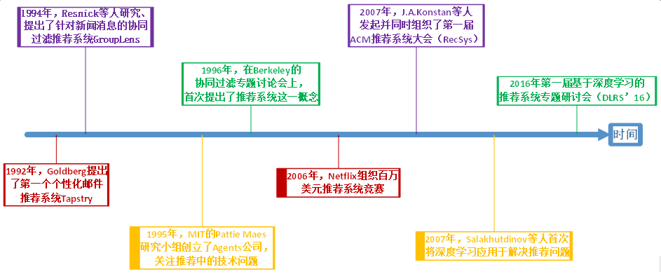
 
图1. Rcecommendation System History

&emsp;&emsp;如上图所示，虽然RS经过了漫长时间的发展，而且在深度学习技术的帮助下其取得了很大的飞跃，但是在发展过程中，甚至直至今日却仍然面临以下几个问题：

- 数据稀疏性问题（Data Sparsity），Netflix数据库拥有48000名用户，1700件商品，而其中仅有1%可被observation。解决方法：降维技术（Dimensionality Reduction），通过奇异值分解（SVD, Singular Value Decomposition）来降低稀疏矩阵的维度，为原始矩阵求的最好的低维近似，但是存在大数据量运算成本及对效果的影响等问题（经过了 SVD变化之后，一些insignificant用户或者物品被扔掉了，对这类用户或者物品的推荐效果就要打折扣，小众群体的存在体现不出来）。
- 冷启动问题（Cold start），新用户和新商品无历史行为信息。使用Hybrid方法，混合使用多种推荐方法能克服部分缺陷，弥补其造成的冷启动问题；解决数据稀疏性问题的另一种方法是通过使用用户资料信息来计算用户相似度（两个用户会被认为相似不只单在相同的电影评级类似，而且也有可能属于同一个人口统计区块（demographic），比如用户的性别、年龄、居住地、教育情况、工作信息等）。虽然此种做法会在一定程度上降低推荐精度，但是在数据非常稀疏的情况下也可以考虑使用。
- 同义词问题Synonymy。该问题表现为推荐系统中同一类物品有时被归为不同的名字（进一步导致了数据稀疏性），解决方法可以有同义词挖掘、利用SVD进行语义分析等。
- Gray Sheep问题。该问题表现为有些人的偏好与任何人都不同（Black Sheep是指那些偏好与正常人完全相反，根本没有办法向他们推荐的人群。由于在现实中也很难解决这个问题，因此这一般被认为是acceptable failure）。一般采用Hybrid（结合 Content-based和CF）方法解决该问题。
- Shilling Attack。实际上是AntiSpam的问题，即有些人对自己的东西或者对自己有利的东西打高分，而对竞争对手的东西打低分，这会影响协同过滤算法的正常工作。被动的解决办法可以是采用Item-Based（在shilling attack 这个问题上，Item-based 的效果要比User-based的效果好，因为作弊者总是较少数，在计算Item相似度的时候影响较小），Hybrid（Hybrid方法能够在部分的解决bias injection problem）。主动的解决办法为采用AntiSpam的技术识别和去除作弊者的影响。
- 其他问题及挑战。隐私问题、噪声问题、解释性问题、合理性、新颖性等等。

&emsp;&emsp;而一个好的推荐系统一般需要在如下指标中获得较好的性能：

- 用户满意度（User Satisfaction）：用户作为推荐系统的重要参与者，其满意度是评测推荐系统的重要指标。可以通过调研或用户反馈、点击率、转化率等指标度量用户的满意度。
- 准确性（Accuracy）：预测准确度是衡量推荐系统或者推荐算法预测用户行为能力的指标。对于评分预测一般计算均方根误差（RMSE）和平均绝对误差（MAE）反应预测准确度。对于TopN推荐一般计算准确率（precision）和召回率（recall）反应预测准确度。
- 覆盖率（Coverage）：描述一个推荐系统对物品长尾的发掘能力，以照顾到尾部的物品或用户。一般通过计算信息熵和基尼系数衡量。
- 多样性（Diversity）：用户的兴趣是广泛的，因此给用户的推荐列表也需要满足用户广泛的兴趣，即具有多样性。
- 新颖性（Novelty）：新颖的推荐是指给用户推荐那些他们之前没有听说过的物品。
- 惊喜度（Serendip）：推荐结果和用户的历史兴趣不相似，但却让用户觉得满意。目前并没有公认的惊喜度指标定义方式，一般只给出一种定性的度量方法。
- 用户的信任度（Trust）/可解释性（Explanation）：通过提供推荐解释，增加推荐系统的透明度和信任度。目前度量推荐系统信任度的方法只能通过调查问卷进行。
- 鲁棒性/健壮性（Robustness）：衡量推荐系统抗击作弊的能力。算法健壮性的评测主要利用模拟攻击的方式进行。提高系统健壮性除了选择健壮性高的算法外还包括尽量使用代价比较高的用户行为；在使用数据前，进行攻击检测，从而对数据进行清洗。 
- 实时性（Real-time/online）：在很多网站中，因为物品（新闻、微博等）具有很强的时效性，所以需要在物品还具有时效性时就将其推荐给用户。推荐系统的实时性包括两个方面：①推荐系统需要实时地更新推荐列表满足用户新的行为变化；②推荐系统需要能够将新加入系统的物品推荐给用户。
- 商业目标（business target）：一般来说，最本质的商业目标就是评价一个用户给公司带来的盈利，设计推荐系统时需要考虑最终的商业目标，而网站使用推荐系统的目的除了满足用户发现内容的需求外，还需要利用推荐系统加快实现商业上的指标。

## 2. Traditional RS

&emsp;&emsp;传统的推荐系统主要是指协同过滤，即根据用户的历史行为数据进行推荐，其又分为Item-Based和User-Based，以及其融合。此外传统的推荐系统还包括基于人口统计学的推荐和基于内容的推荐。

&emsp;&emsp;（1）协同过滤（Collaborative Filtering， CF）

&emsp;&emsp;协同过滤是指通过收集用户过去的行为以获得其对产品的显式或隐式信息，即根据用户对物品或者信息的偏好，发现物品或者内容本身的相关性、或用户的相关性，然后再基于这些关联性进行推荐。其又分为Memory-based（User-based和Item-based，即基于系统的历史记录（如所有被打过分的物品）进行预测)、Model-based和Hybrid-Based。

&emsp;&emsp;(a) User-Based

&emsp;&emsp;User-Based方法是最早的一种基于协同过滤的推荐算法，它所基于的基本假设与Demographic方法类似，也是“用户可能会喜欢和他具有相似爱好的用户所喜欢的物品”，与之不同的是，这里的“相似用户”，不是用User Profile计算出来的，而是根据用户的打分历史记录计算出来的。这里的基本想法是，具有相似偏好的用户，他们在所有Item上的打分情况也是相似的。其主要过程如下：

- Step1. 确定需要推荐的目标用户；
- Step2. 根据similarity function or neighborhood formation确定与目标用户最相似的用户；
- Step3. 确定这些相似用户共同喜爱的商品；
- Step4. 预测目标用户对上述物品的喜好程度；
- Step5. 基于预测，给出目标用户的Top N推荐。。

&emsp;&emsp;User-Based推荐方法的第一步是执行最近邻搜索，我们把每一个User看成一个行向量，对于一个User，我们计算其它所有的User行向量与他的相似度。这里的相似度计算有很多不同的指标，比如Pearson相关性系数、余弦相似度等。 当我们拥有了每一个用户与该User的打分相似度之后，就可以执行预测和推荐了，最常见的方法是选取与该用户相似度最高的前K个用户，用这K个用户的打分情况对该User的打分进行预测，进而进行推荐。

&emsp;&emsp;最常见、最简单的推荐方法有两种，分别为Top-N推荐和关联推荐。Top-N推荐是统计在这前K个用户中，统计出现频率最高且在目标用户的向量中未出现的物品，将这些物品构建成推荐列表作为输出。关联推荐的基本思想是，利用这前K个用户的购买或打分记录进行关联规则挖掘，利用挖掘出的关联规则，结合目标用户的购买记录完成推荐，典型的推荐结果就是我们常见的“购买了某物品的用户还购买了什么物品”。
在User-Based方法中，“个性化”的体现方式是对于不同的User，其最近邻是不同的，进而得到的推荐列表也不一样；“协同过滤”的体现方式是，对一个用户进行推荐时，使用其它用户在物品上的观点来寻找和他相似的用户，这是与Demographic方法不同的地方。

&emsp;&emsp;User-Based方法的优点在于，在数据集完善、内容丰富的条件下，能够获得较高的准确率，而且能够避开物品Item Profile上的挖掘进行推荐，能够对物品的关联性、用户的偏好进行隐式透明的挖掘。
其缺点在于，随着系统用户数量的增大，计算Top-K Relevance User的时间会显著增长，使得该方法难以胜任用户量变化巨大的系统，该方法限制了系统的可扩展性。另外新用户冷启动的问题也是User-Based方法难以处理的问题：当新用户加入系统时，由于他的打分历史记录很少，难以准确计算真正与之对应的Top-K Relevance User，这也进一步引出数据稀疏性的问题对系统可扩展性的限制。

&emsp;&emsp;(b) Item-Based

&emsp;&emsp;鉴于User-Based协同过滤方法随着用户数增加，计算时间显著增长，Sarwar 等人在2001年提出了基于物品的推荐，Item-Based方法是亚马逊网络商城的专利算法，目前也是亚马逊网络商城推荐系统的底层核心算法。Item-Based方法所基于的基本假设与Content-Based方法类似，也就是“用户可能会喜欢与他之前曾经喜欢的物品相似的物品”。比如喜欢《统计学习方法》的人，也很有可能去看《机器学习》。与Content-Based方法不同的是，这里的“相似物品”不是通过Item Profile来计算的，而是通过物品被打分的历史记录来计算的。

&emsp;&emsp;Item-Based推荐方法的第一步与User-Based一样，也是执行最近邻搜索，我们把每一个Item看成一个列向量，对于一个Item，我们计算其它所有的Item 列向量与它的相似度。有了Item 之间的两两相似度之后，就可以进行预测和推荐了。

&emsp;&emsp;最简单的线上推荐是，当用户购买了某一商品后，直接向其推荐与该物品相似度最高的前K个商品。稍微复杂一点的推荐方法考虑了该用户所有的打分历史记录：对于一个User行向量中的0值(用户未购买的物品)，我们需要去预测该用户在该物品（记为I）上可能的打分。预测方法是，考虑所有该用户已经打过分的Item，以它们与I的相似度为权重，对它们的分值进行加权平均，作为对I的预测打分，最终以预测打分的高低为顺序给出推荐列表。其主要过程如下：

- Step1. 确定目标用户的喜好商品集合；
- Step2. 计算数据库中各个商品与上述各个商品间的相似度；
- Step3. 对目标用户喜好商品集合中的各个商品选择最相似的K个商品，构建候选商品集合；
- Step4. 加权计算各个候选商品与目标用户喜好商品集合的相似度；
- Step5. 选择出最相似的商品进行推荐。

&emsp;&emsp;其中商品间相似度计算的主要方法如下表所示：

| Model             | Method                                                       |
| ----------------- | ------------------------------------------------------------ |
| Correlation based | Cosine, Pearson Correlation, Adjusted Cosine, OLS cofficient |
| Distance based    | Euclidean diastance, Manhattan distance, Minkowski distance  |
| Hash based        | Mini Hash, Sim Hash                                          |
| Topic based       | PLSA, LDA                                                    |
| Graph based       | Shortest Path, Random Walk, Item Rank                        |

&emsp;&emsp;Item-Based方法总体上来说是一种启发式的方法(Heuristic-Based)，对目标的拟合能力是有限的，但是当把多个启发式方法结果(以及其他的特征)结合起来，也可以有很好的拟合能力。
Item-Based方法的优点主要有以下几点：一是计算简单，容易实现实时响应，由于在常见的系统中，Item被打分的变化剧烈程度要比User低得多，因此 Item 相似度的计算一般可以采用离线完成、定期更新的方式，从而减少了线上计算，实现实时响应，提高效率，尤其对于用户数远大于商品数的情况下效果更加显著，比如用户新添加了几个感兴趣的商品之后，可以立即给出新的推荐；二是可解释性好，用户可能不了解其他人的购物情况，但是对自己的购物历史总是很清楚的，另外用户总是希望自己有最后的决定权，如果系统推荐的商品不满意， 需要有办法让用户改进它，Item-based方法很容易让用户理解为什么推荐了某个商品，并且当用户在兴趣列表里添加或删除商品时，可以调整系统的推荐结果，这也是其他方法最难做到的一点。

&emsp;&emsp;Item-Based方法的缺点主要包括：以物品为基础的系统过滤较少考虑用户之间的差别，因此精度较User-Based方法稍微逊色一点；另外还有许多其它的问题有待解决，最典型的就是数据稀疏性(Sparsity)和冷启动(Cold-Start)的问题。

&emsp;&emsp;(c) User-Based VS Item-based

- 计算复杂性：User-Based是最早的协同过滤方法，如前所述，在1994年的论文中被提出，当时还没有User-Based和Item-Based的概念，人们很自然地首先想到了基于User的方法。Item-Based方法是从Amazon的论文和专利发表之后（2001年）开始流行的，且它被提出的一个主要背景就是解决User-Based 方法在线计算量大，难以实时响应的问题。对于一个用户数量大大超过物品数量而物品数据相对稳定的应用，往往Item-Based方法从性能和复杂度上都比User-Based方法更优，这是因为计算物品的相似度不但计算量较小，而且不必频繁更新；而对于诸如新闻，博客或者微内容等物品数量巨大且更新频繁的应用中， User-Based方法往往更具优势，推荐系统的设计者需要根据自己应用的特点选择更加合适的算法。

- 适用场景：在非社交网络的网站中，内容内在的联系是很重要的推荐原则， 它比基于相似用户的推荐原则更加有效。比如在购书网站上，当用户看一本书的时候，推荐引擎会给用户推荐与其相关的书籍，这个推荐的重要性远远超过了网站首页对该用户的综合推荐。可以看到，在这种情况下，Item-Based的方法成为了引导用户浏览的重要手段。同时Item-Based方法便于为推荐做出解释，在一个非社交网络的网站中，如果给某个用户推荐一本书时给出的解释是某个和你有相似兴趣的人也看了这本书，是很难让用户信服的，因为用户可能根本不认识那个人；但如果解释为这本书和你以前看的某本书相似，用户就更有可能会觉得解释合理而采纳该推荐。相反，在社交网站中，User-Based方法，以及基于User Network 和Influence Network的User-Based方法，则是更不错的选择，因为User-Based 方法通过考虑社会网络信息，可以大大增加用户对推荐解释的信服度。

- 推荐多样性和精度：研究人员在相同的数据集合上分别用User-Based和 Item-Based方法计算推荐结果，发现在得到的推荐列表中，只有约50%是一样的， 还有约50%完全不同，但是这两个算法却有相似的精度，可以说这两个算法是互补的。关于推荐的多样性，有两种度量方法：一是从单个用户的角度来看，就是说给定一个用户，查看系统给出的推荐列表是否多样，也就是比较推荐列表中的物品之间两两的相似度。对于这种度量方法，Item-Based的多样性显然不如User-Based好，因为Item-Based推荐本身就是和该用户的历史记录最相似的； 第二种度量方法是考虑系统的多样性，也就是覆盖率(Coverage，有的论文也称召回率)，它是指一个推荐系统是否能够提供给所有用户丰富的选择。在这种指标下，Item-Based方法的多样性要远远好于User-Based 方法，因为User-Based方法总是倾向于推荐热门的物品，而从Item-Based方法有较好的新颖性，擅长推荐长尾里的物品(只要有那么一些用户，它同时购买了两个冷门的物品，这两个冷门物品之间就有较高的相似度)。所以，尽管大多数情况下Item-Based方法的精度略小于User-Based，但如果考虑多样性，Item-Based却比User-Based 好很多。

- 用户对推荐算法的适应度：User-Based方法推荐的原则是假设用户会喜欢那些和他有相同喜好的用户所喜欢的东西，但如果一个用户没有相同喜好的朋友，那么User-Based算法的效果就会比较差，所以一个用户对的User-Based算法的适应度和他有多少共同喜好用户正相关；Item-Based方法的基本假设是用户会喜欢和他以前喜欢的东西相似的东西，我们可以计算一个用户所喜欢的物品的自相似度，一个用户喜欢物品的自相似度大，就说明他的偏好相对比较单一、稳定， 也就是说他比较符合Item-Based方法的基本假设，那么他对Item-Based方法的适应度就比较好，相反，如果自相似度小，就说明这个用户的偏好并不单一，那么Item-Based方法对他做出好的推荐的可能性就比较低，这种情况下，一般用对该用户所喜欢的物品进行聚类进而进行分层推荐的方法来解决。

&emsp;&emsp;(d) Model-Based

&emsp;&emsp;User-Based或Item-Based方法共有的缺点是资料稀疏，难以处理大数据量下的即时结果，因此发展出以模型为基础的协同过滤技术：先用历史数据训练得到一个模型，再用此模型进行预测。以模型为基础的协同过滤广泛使用的技术包括Latent Semantic Indexing、Bayesian Networks等， 收集打分数据进行分析和学习并推断出用户行为模型,进而对某个产品进行预测打分。这种方式不是基于一些启发规则进行预测计算,而是对于已有数据应用统计和机器学习得到的模型进行预测。这种方法的优点在于快速相应：只要训练出了模型，就可以对新用户或新物品进行实时快速计算，其问题在于如何将用户实时或者近期新增的喜好信息反馈给训练好的模型，从而提高推荐的准确度，也就是模型增量训练问题。

&emsp;&emsp;(e) Hybrid-Based

&emsp;&emsp;混合推荐系统是推荐系统的另一个研究热点，它是指将多种推荐技术进行混合以此弥补相互间的缺点，从而可以获得更好的推荐效果。最常见的是将协同过滤技术和其他技术相结合，以克服Cold-Start的问题。常见的混合方法有如下几种：

- 加权融合(Weighted)：将多种推荐技术的计算结果加权混合产生推荐， 最简单的方式是基于感知器的线性混合，首先将协同过滤的推荐结果和基于内容的推荐结果赋予相同的权重值，然后比较用户对物品的评价与系统的预测是否相符，进而不断调整权值。
- 切换(Switch)：根据问题背景和实际情况采用不同的推荐技术。比如，使用基于内容推荐和协同过滤混合的方式，系统首先使用基于内容的推荐技术，如果它不能产生高可信度的推荐，然后再尝试使用协同过滤技术。因为需要各种情况比较转换标准，所以这种方法会增加算法的复杂度，当然这样做的好处是对各种推荐技术的优点和弱点比较敏感。
混合(Mix)：将多种不同的推荐算法推荐出来的结果混合在一起，其难点是如何重排序。
- 特征组合(Feature Combination)：将来自不同推荐数据源的特征组合起来，由另一种推荐技术采用。一般会将协同过滤的信息作为增加的特征向量，然后在这增加的数据集上采用基于内容的推荐技术。特征组合的混合方式使得系统不再仅仅考虑协同过滤的数据源，所以它降低了用户对物品评分数量的敏感度，相反，它允许系统拥有物品的内部相似信息，其对协同系统是不透明的。
- 级联型(Cascade)：用后一个推荐方法优化前一个推荐方法。它是一个分阶段的过程，首先用一种推荐技术产生一个较为粗略的候选结果，在此基础上使用第二种推荐技术对其做出进一步精确地推荐。
- 特征递增(Feature Augmentation)：前一个推荐方法的输出作为后一个推荐方法的输入，它与级联型的不同之处在于，这种方法上一级产生的并不是直接的推荐结果，而是为下一级的推荐提供某些特征。一个典型的例子是将聚类分析环节作为关联规则挖掘环节的预处理：聚类所提供的类别特征，被用于关联规则挖掘中，比如对每个聚类分别进行关联规则挖掘。
- 元层次混合(Meta-level hybrid)：将不同的推荐模型在模型层面上进行深度的融合，而不仅仅是把一个输出结果作为另一个的输入。比如，User-Based方法和Item-Based方法的一种组合方式是，先求目标物品的相似物品集，然后删掉所有其它的物品(在矩阵中对应的是列向量)，在目标物品的相似物品集上采用User-Based协同过滤算法。这种基于相似物品的邻居用户协同推荐方法，能很好地处理用户多兴趣下的个性化推荐问题，尤其是候选推荐物品的内容属性相差很大的时候，该方法性能会更好。

&emsp;&emsp;基于协同过滤的推荐系统结构如下：

 
图2. Recommendation System

&emsp;&emsp;（2）基于人口统计学的推荐（Demographic-Based Recommendation）

&emsp;&emsp;Demographic-Based方法很少被单独使用，其对应于用户画像（User Profile）。每一个用户的User Profile中记录了该用户的性别、年龄、活跃时间等元数据。该方法所基于的基本假设是“一个用户有可能会喜欢与其相似的用户所喜欢的物品”。 当我们需要对一个User进行个性化推荐时，利用User Profile计算其它用户与其之间的相似度，然后挑选出与其最相似的前K个用户，之后利用这些用户的购买和打分信息进行推荐。一种简单且常见的推荐方法就是将这些User所覆盖的Item作为推荐列表，并以Item在这些User上得分的平均值作为依据来进行排序，并将该排好序的推荐列表供给用户。

&emsp;&emsp;这种Demographic-Based推荐方法的优点是计算简单，由于User Profile 相对比较固定，因此用户相似度的计算可以线下完成，便于实现实时响应。但是它也有诸多的问题，一个主要的问题是计算可信度比较低，其根本原因在于即便是性别、年龄等属性都相同的用户，他们也很有可能在物品上有截然不同的偏好，因此这种计算用户相似度的方法并不能真正与物品之间建立联系。另一个主要的缺点在于推荐结果的可解释性不够，该方法对于推荐结果的解释方法为“与你具有相似属性的用户也购买了该物品”，但这显然难以让用户信服。Demographic-Based方法是一种非协同过滤式的方法，但是它与后面基于内容的推荐(User-Based)这一协同过滤方法很相似。

&emsp;&emsp;（3）基于内容的推荐（Content-Based Recommendation）

&emsp;&emsp;Content-Based方法所基于的基本假设是“一个用户可能会喜欢和他曾经喜欢过的物品相似的物品”。这里“曾经喜欢过的物品”就是利用该用户的历史记录计算出来的Profile，作为该用户的User Profile来使用。

&emsp;&emsp;典型的Content-Based方法的第一步是构建User Profile，一种较为简单的构建方法是：考虑该User曾经打过分的所有Item，将这些Item的Item Profile做一个加权平均，作为该User的User Profile。当然，构建User Profile 的策略可以很复杂，比如可以考虑时间因素，计算User在不同时间段内的 Profile，从而了解User在历史数据上所表现出来的偏好的变化等等。根据User Profile既可以进行推荐，最简单的推荐策略就是计算所有该用户未尝试过的Item与该用户的User Profile之间的相似度，并按照相似度由大到小的顺序生成推荐列表，作为结果输出。当然，推荐策略也可以很复杂，比如在数据源上考虑本次用户交互过程中所收集到的即时交互数据来决定排序，在模型上使用决策树、人工神经网络等等，但是这些方法最核心的环节都是利用User Profile和 Item Profile之间的相似度计算。

&emsp;&emsp;其实在很多Content-Based的推荐算法中，并不把User Profile显式地计算出来，而是利用User打过分的Item，直接计算推荐列表，一种直观的方法是： 对于一个该User未尝试过的Item，计算它与该User尝试过的所有Item之间的相似度，并将这些相似度根据User的打分进行加权平均。这本质上也是 Content-Based 方法，只是绕过了计算 User Profile 的环节。实际上，很多具体的应用表明，绕过User Profile的计算，直接利用Item Profile计算相似度，往往更灵活，推荐效果更好，因为在计算User Profile的过程中，一些有用的信息被丢掉以至于无法在后面的环节中被利用。

&emsp;&emsp;Content-Based方法的优点在于：对新加入的物品没有冷启动(Cold-Start)的问题，因为只要有该物品的Item Profile，就可以直接计算它与其它Item之间的相似度，不受打分数据稀疏的限制；推荐结果具有较好的可解释性，一种显然的推荐理由是“该物品与你之前曾经喜欢过的某物品相似”。但是Content-Based方法也有一些缺点，首先是系统需要复杂的模块甚至手工来预处理物品信息以得到能够代表它们的特征， 然后受信息获取技术的制约、 处理对象的复杂性高等因素，这样工作难以达到较好的效果；其次，这种方法无法发现用户并不熟悉但是具有潜在兴趣的物品，因为该方法总是倾向于向用户推荐与其历史数据相似的物品；另外就是可扩展性不好，需要针对不同的领域构建几乎完全不同的Profile，针对一个数据集合训练的模型未必适合其它的数据集合，并且随着新物品的加入， 模型的可用性也值得商榷。

### 2.1 Matrix Factorization

&emsp;&emsp;早期的推荐系统工作中我们不得不提的Netflix竞赛，该比赛吸引了全球数千支队伍的参加，极大的推进了推荐系统的发展。Netfilx是一个DVD租赁网站，其公司盈利极大的依赖推荐系统的好坏，因此其2016年发起Netflix推荐系统比赛，并悬赏100万美金奖励第一支将准确率提升10%（RMSE降低10%）的队伍。终于在历时3年后由由AT&T的研究人员赢得了大奖。无数尝试方法经过“大浪淘沙”后最终被证明有效的方法包括SVD/MF(RMSE-0.8914)，RBM(RMSE-0.8990)，Linear blend(RMSE-0.88)及其融合。

&emsp;&emsp;在Netflix Database中共包含有48000用户，17770部电影以及上亿条评分记录，然而用户对物品的喜好或评分矩阵却是一个很大的稀疏矩阵，因此为减少计算量很自然的操作就是对矩阵进行分解。如下图：

 
图3. Matrix Factorization

&emsp;&emsp;如上图所示，原始user-item评分矩阵为一高维稀疏阵，通过矩阵分解为$P,Q$，即user factor matrix和item factor matrix。其中，$p_u(f_1,f_2,...f_k)\in R^f,q_v(f_1',f_2',...f_k')\in R^f$且$p_u\geq 0,q_v\geq 0$（小于0没有任何意义）。因此当我们通过计算$P\times Q^T$时即可得到指定用户在指定商品上的Score.

#### 2.1.1 Non-negative Matrix Factorization

&emsp;&emsp;Orthogonal NMF本质上等价于Kernel K-Means Clustering。其目标函数如下：

$$
min_{F,G}||X-FG^T||_F^2,s.t.G^TG=I,G\geq0\tag{1}
$$

&emsp;&emsp;上式中，$X$即为原始得分矩阵，$G\in R^{n\times r}$为正交阵，其每一行均为单位向量，可看作是factors的概率分布。这里我们将Frobernius范数展开（F范数就是将矩阵张成向量后的2范数，有关范数的介绍可以参看我的这篇笔记-[机器学习中的各种范数与正则化](https://zhuanlan.zhihu.com/p/51673764)），即有：

$$
J=||X-FG^T||_F^2=Tr(X^TX-2F^TXG+F^TF)\tag{2}
$$

&emsp;&emsp;我们对$F$求偏导令其为0，则有$\partial J/\partial F=-2XG+2F=0\implies F=XG$，将其代入式（2）有：$J=Tr(X^TX-G^TXXG)$，由于$X^TX$为已知常量，故将其忽略有：

$$
min_G Tr(-G^TXXG),s.t.G^TG=I,G\geq 0 \tag{3}
$$

&emsp;&emsp;即：

$$
max_G Tr(G^TXXG),s.t.G^TG=I,G\geq 0 \tag{4}
$$

&emsp;&emsp;而$G=(g_1,...,g_k),g_k=(0,1,1,...,1,0,0)^T/\sqrt{n_k}$，即$G$表示概率分布，因此$g_k^Tgl=\delta_{kl}$则表示样本点与聚类中心的距离（归一化后）$||x_i-m_k||^2$。故式（4）将等价于

$$
J=\sum_{k=1}^K\sum_{i\in C_k}||x_i-m_k||^2\tag{5}
$$

&emsp;&emsp;上式为Kernel K-means clustering的目标表达式（Kernerl体现在Score$x$的计算上），故我们说Orthogonal NMF本质上等价于Kernel K-Means Clustering。

#### 2.1.2 SVD && SVD++

&emsp;&emsp;奇异值分解（singular value decomposition，SVD）是矩阵分解中最常见的方法，即对于任意实矩阵$A\in R^{m\times n}$均可以分解为：

$$
A=U\sum V^T\tag{6}
$$

&emsp;&emsp;其中，$U \to R^{m \ times m}$是满足$U^TU=I$的$m$阶标准正交矩阵（酉矩阵）；$V \to R^{n \times n}$是满足$V^TV=I$的$n$阶酉矩阵；$\sum \in R^{m \times n}$，其中$(\sum)_{ii}=\sigma_i\geq 0$，其它位置元素均为0。

&emsp;&emsp;对于推荐系统，为缓解过拟合问题，考虑引入2范数，则SVD为：

$$
SSE=\sum_{u,v}(r_{uv}-\hat r_{uv})^2+\lambda (\sum_u|p_u|^2+\sum_v|q_v|^2)=(r_{uv}-p_u^Tq_v)^2+\lambda (\sum_u|p_u|^2+\sum_v|q_v|^2)\tag{7}
$$

&emsp;&emsp;上式中$r_{uv}$用户$u$对商品$v$的预测值。$p_u$为user vectors，$q_v$为item vectors。然而在实际情况中某些用户十分“宽容”，其对物品的打分均较高，而有些用户则十分“严苛”，其对物品的打分均较低，若我们将上述两种用户同等对待，那么将会出现严重的偏差。为此我们需引入商品偏置和用户偏置以反应其各自独立的特征，对矩阵进行修正，故有：

$$
\hat r_{uv}=b_{uv}+p_u^Tq_v=\mu +b_u+b_v+p_u^Tq_v\tag{8}
$$

&emsp;&emsp;上式中，$\mu$为评分矩阵的平均得分，$b_u$为用户的偏置项，$b_v$为商品的偏置项。此外，在实际应用中会经常出现这样一种情况：用户并没用对商品进行评分但是却存在互动行为，如浏览、收藏、点赞等。我们将这些行为信息称之为隐反馈。实际上，一个推荐系统中有明确评分的数据只是冰山一角，而这类隐数据隐藏了大量有价值的信息。因此，一个好的推荐系统必须充分利用这类数据，则有：

$$
\hat r_{uv}=\mu +b_u+b_v+p_u^Tq_v+q_v^T(p_u+|N(u)|^{-frac{1}{2}}\sum_{j \in N(u)}y_j)\\
SSE=\sum_{u,v}(r_{uv}-\hat r_{uv})^2+\lambda (\sum_u|p_u|^2+\sum_v|q_v|^2+\sum_u|b_u|^2+\sum_v|b_v|+\sum_{j \in N(u)|y_j|^2})\tag{9}
$$

&emsp;&emsp;上式即为SVD++，其中$N(u)$为用户$u$所产生隐反馈行为的物品集合，$y_j$为隐藏的对于商品$j$的个人喜好偏置，是一个需要学习的参数。

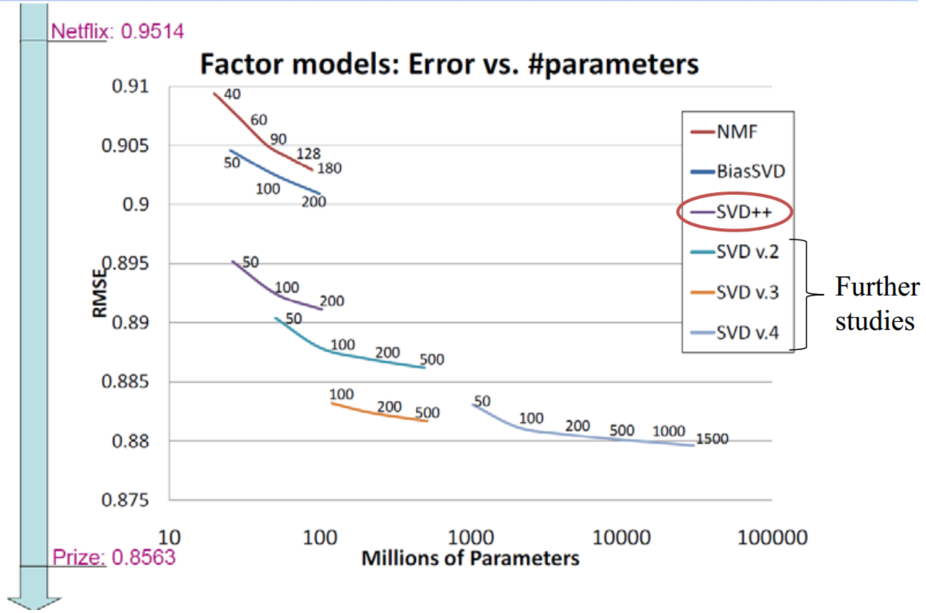
 
图5. SVD RMSE

&emsp;&emsp;从上图可以看出SVD++通过引入各种修正，其精度有明显提升。

#### 2.1.3 Probabilistic Matrix Factorization

&emsp;&emsp;PMF与SVD不同的是它假设评分矩阵中的元素 $R_{ij}$是由用户潜在偏好向量$U_i$和物品潜在属性向量$V_j$的内积决定的，而它们均服从均值为$U_i^TV_j$，方差为$\sigma^2$的正态分布：

$$
R_{i,j}～N(U_i^TV_j,\sigma^2)\tag{10}
$$

&emsp;&emsp;故：

$$
p(R|Y,V,\sigma^2)=\prod_{i=1}^N\prod_{j=1}^M[N(R_{ij}|U_i^TV_j,\sigma^2)]^{I_{ij}}\tag{11}
$$

&emsp;&emsp;其中$I_{i,j}$为指示函数，若$R_{i,j}$存在则为1，否则为0。同时，假设用户和商品的偏好向量服从均值0，方差为$\sigma_{U}^2I$和$\sigma_{V}^2I$的正态分布，即：

$$
p(U|\sigma_{U}^2)=\prod_{i=1}^NN(U_i|0,\sigma_U^2I)\\
p(V|\sigma_{V}^2)=\prod_{i=1}^NN(V_j|0,\sigma_V^2I)\\
$$

&emsp;&emsp;同理为缓解过拟合，引入正则化项，则目标函数为：

$$
E=\frac12\sum_{i=1}^N\sum_{j=1}^MI_{ij}(R_{ij}-U_i^TV_j)^2+\frac{\lambda_U}{2}\sum_{i=1}^N||U_i||^2_{Fro}+\frac{\lambda_V}{2}\sum_{j=1}^M||V_j||^2_{Fro}\tag{12}
$$

&emsp;&emsp;另外，为使Score统一，我们需对其进行normalization。论文中使用logistics函数进行处理：$g(x)=\frac{1}{1+e^{-x}}$进行处理，

&emsp;&emsp;由于用户的评分服从高斯分布，因此对于那评分较少的用户其高斯分布拟合所得的预测评分将很大可能接近均值而失去较多信息。因此，作者引入潜在相似矩阵（laten similarity constraint）$W$反映评价商品对用户的影响程度，对$U_i$进行修正有：

$$
U_i=Y_i+\frac{\sum_{k=1}^M}{\sum_{k=1}^MI_{ik}}\tag{13}
$$

&emsp;&emsp;上式中$W$服从均值为0，方差为$\sigma_W$的高斯分布，其值的大小表示商品$k$用户的影响程度。$Y_i$为未经修正时的$U_i$，如下图所示：

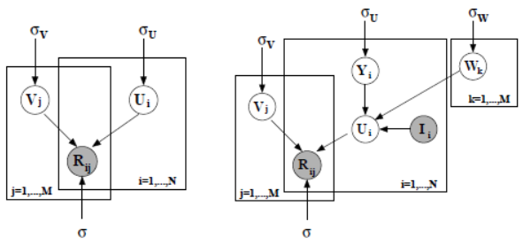
 
图6. PMF

&emsp;&emsp;此时目标函数即为：

$$
E=\frac12\sum_{i=1}^N\sum_{j=1}^MI_{ij}(R_{ij}-g([Y_i+\frac{\sum_{k=1}^M}{\sum_{k=1}^MI_{ik}}]^TV_j))^2+\frac{\lambda_Y}{2}\sum_{i=1}^N||Y_i||^2_{Fro}+\frac{\lambda_V}{2}\sum_{j=1}^M||V_j||^2_{Fro}+\frac{\lambda_W}{2}\sum_{k=1}^M||W_k||^2_{Fro}\tag{14}
$$

&emsp;&emsp;对此可通过随机梯度下降SGD求解$U、Y、W$，最后有：

$$
p(R|Y,V,\sigma^2)=\prod_{i=1}^N\prod _{j=1}^M[N(R_{ij}|g([Y_i+\frac{\sum_{k=1}^M}{\sum_{k=1}^MI_{ik}}V_j]),\sigma^2)]^{I_{ij}}\tag{15}
$$

&emsp;&emsp;最后对比SVD与PM如下：

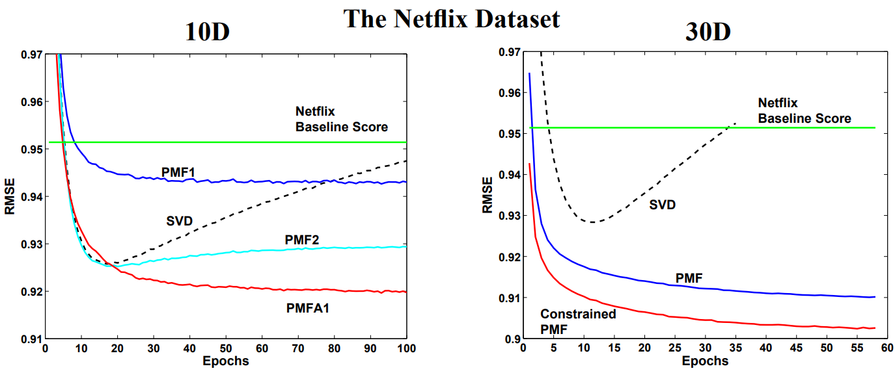
 
图7. PMF vs SVD

&emsp;&emsp;从上图可以明显看出相比SVD，PMF在infrequent Users上有更加出色的效果。

### 2.2 Beyond Matrix Factorization

&emsp;&emsp;对于RS除matrices factorization外这里我们还将介绍几种常见的model。

#### 2.2.1 Self-Representation Model

&emsp;&emsp;Self-Representation Model顾名思义，该模型将与评分矩阵$R$自身有关，如下图所示：

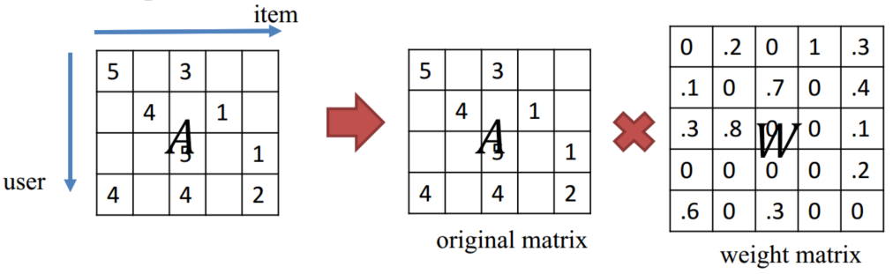
 
图8. Self-Repressentation Model

&emsp;&emsp;其目标函数为：

$$
min_W \quad \frac12||A-AW||^2_F+\frac{\lambda}{2}||W||^2_F+\lambda||W||_1\\
s.t. \quad W \geq 0,diag(W)=0\tag{16}
$$ 

#### 2.2.2 Restricted Boltzmann Machines

&emsp;&emsp;RBM本质上是一个编码解码器，具体来说，通过RBM，我们可以把原始输入数据从可视层映射到隐藏层，得到原始输入数据的隐因子（latent factor）向量表示，这一过程也称为编码过程，然后利用得到的隐藏层向量重新映射回可视层，得到新的可视层数据，这个过程称为解码过程，我们的目标是让解码后的结果能和原始数据尽量接近，这样，在解码的过程中，我们不但能得到已评分物品的新的评分数据，还能对未评分的物品的得分进行预测，这些未评分物品的分数从高到低的排序形成推荐列表。

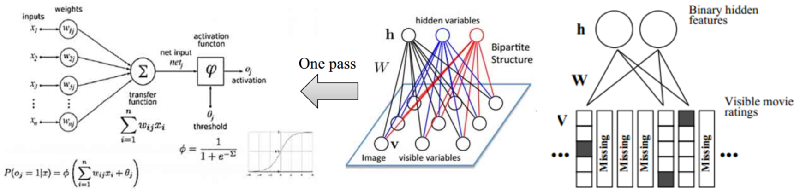
 
图9. RBM for RS

&emsp;&emsp;此外还有Clustering Based Collaborative Filtering, LSH for CLustering以及Classifiers for CF等方法

 
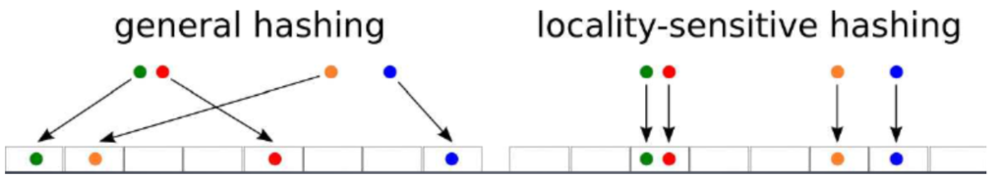
图10. clustering Based CF && LSH

## 3. Beyond traditional RS

&emsp;&emsp;传统的推荐系统主要是根据协同过滤的思想，通过矩阵分解实现的。而现实中推荐系统往往会向用户通过排序的方式呈现出一系列的推荐结果，因此推荐本质上可以看成Top N Ranking Problem，由此又发展出了一系列的方法，如Learning to Rank以及现在的主流Deep Learning。同时推荐系统还可以与社交网络相结合，利用图论的相关方法，于是便出现了Social Recommendation等。

### 3.1 Learning to Rank

&emsp;&emsp;根据损失函数中考虑排序对象的数目的不同Learning to Rank主要可分为Pointwise, Pairwise以及Listwise。

- Pointwise。Loss function中只考虑单个对象（类似SGD），通过对其分数的排序来得到最后的排名，其中ranking score可由regression or classification确定。主要的方法包括Ordinal regression, Logistic regression, SVM, GBDT等等。
- Pairwise。Loss function中每次考虑一对物品（类似MBGD），通过对这对物品进行排序并与实际情况比较以最小化反转次数。该问题可转化为二分类问题，其主要的方法包括LambdaMart, RankSVM, RankBoost, RankNet, FRank等。
- Listwise。loss function考虑所有全部的排序商品（类似BGD），主要分为RankConsien（考虑Ranking结果与真实情况）和ListNet（利用KL散度，考虑概率分布的相似性）。排序问题为NP hard，直接优化困难，故我们可以使用启发式算法，如 Genetic Programming，Simulated Annealing等。或者对目标函数进行平滑后采用梯度下降，如CLiMF，TFMAP等。

### 3.2 Social Recommendations

&emsp;&emsp;基于社交网络的推荐是一个十分有效的推荐方式，因为大部分用户都将信任自己的朋友、与自己兴趣相同的用户或评论。通过社交推荐能够极大的增加用户对广告的印象和购买意愿具。对于社交推荐我们可以简单地抽象为如下结构：

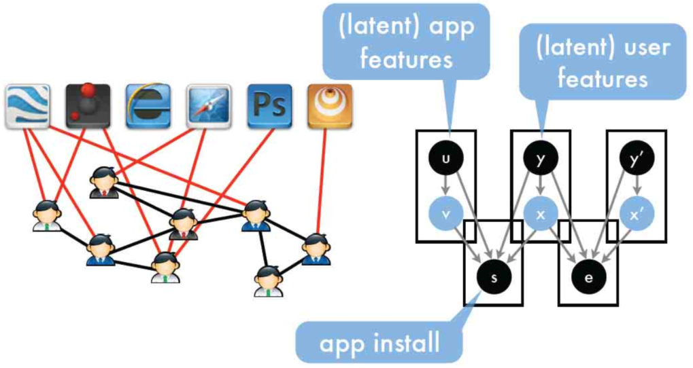
图11. social RS

&emsp;&emsp;从上图中我们可以认为social networks由friends和interests构成，而与users拥有共同兴趣的人将更容易产生连接。因此我们可以定义目标函数如下：

$$
min\quad \underbrace{\lambda_e \sum_{)(i,j)}l(e_{i,j},x_i^Tx_j+y_i^TW_{y_j})}_{social}+\underbrace{\lambda_a \sum_{(i,j)}l(a_{ij},x_i^Tv_j+y_i^TMu_j)}_{app}+\underbrace {\lambda_x \sum_i\gamma(x_i|y_i)+\lambda_v \sum_i \gamma(v_i|u_i)}_{reconstruction}+\underbrace{\lambda_W||W||^2+\lambda_M||M||^2+\lambda_A||A||^2+\lambda_B||B||^2}_{regularizer}\tag{17}
$$

&emsp;&emsp;早期对于基于社交网络的推荐算法，因为数据集的限制，其研究都是基Epinion的用户信任网络。在此数据集上提出了很多基于矩阵分解的社会化推荐算法用来解决评分预测问题，其主要思想是在矩阵分解模型中加入正则化项，让具有社交关系的用户的隐语义向量具有比较高的相似度。后来随着互联网的迅猛发展，社交网络的研究得到了广泛关注，其中两个最著名的问题：①如何度量人的重要性，即社交网络顶点的中心度（centrality），②如何度量社交网络中人和人之间的关系，也即链接预测，均有着深刻的实际意义。社交网络的连接可以和其他很多方法结合，如用户与用户见的相似度（二分图）等。对于社交网络它将成为机器学习邻域的研究热点。

### 3.3 Deep Learning for Recommendations

&emsp;&emsp;传统的浅层模型，尤其是协同过滤虽然在过去得到了广泛的应用，且确实取得了不错的效果。然而随着物联网、物联网等技术的飞速发展，各种形式的数据呈爆炸式的增长，而且不同模态间的数据相互关联，“语义鸿沟”等问题愈发严重，传统的模型的有效性和可扩展性受到了极大的限制。我们如何在大量不同模态的数据中挖掘出有效信息，实现个性化、精准化的推荐，对于这一问题其有着深刻的研究价值以及迫切的现实需求。深度学习的复兴为推荐系统的研究开辟了新的道路，在图像、语音、以及自然语言处理方面，深度学习以展现出其特征表示的强大能力，在推荐系统领域，Deep Networks也得到了深入的关注和研究。在近年基于深度网络推荐系统的研究中我们不得不提起2016年YouTube贡献的有关推荐系统的研究。

&emsp;&emsp;YouTube作为全球最大的视频分享平台，其推荐系统服务了超过了十亿的用户。因此无论从方法创兴上还是工程实践上均值得反复研究。其推荐系统仍采用经典的two-stage信息检索方式，即基于深度网的候选集的生成和基于深度网的排序，如图12所示。这看是平淡无奇，然而在面对实际的应用场景时却面对着数据规模、实时性（新颖度）和噪声的问题。

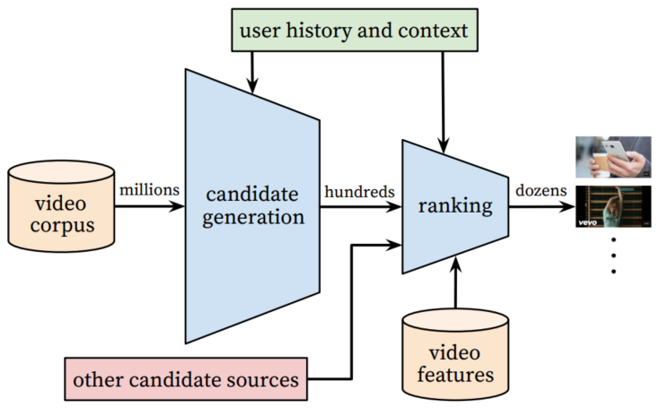
图12. YouTube推荐系统架构

&emsp;&emsp;如上图所示，其中candidate generation负责从海量数据中筛选出数百部与users兴趣高度相关的videos作为候选集。Ranking则利用有关video和user的一系列特征训练网络给出Score，并对Score进行排序，给出推荐。

&emsp;&emsp;(1)Candidate Generation

图13. candidate generation

&emsp;&emsp;从上图可以看出在candidate generation网络结构中，其输入融合了大量的特征，如用户行为特征：watch、search，用户人口统计学特征：geographic、age、gender等，并对其进行了embedding操做，（不得不说embedding真是个好东西，万事万物均可embedding）。网络的学习任务为多分类问题，如下：

$$
P(w_t=i|U,C)=\frac{e^{v_iu}}{\sum_{j \in V}e^{v_ju}}\tag{18}
$$

&emsp;&emsp;上式中，$w_t=i$表示在$t$时刻观看的第$i$类video，$V$表示视频库，$U$表示用户，$u,v$表示user,video embeddings。考虑到模型拥有millions of classes，作者采用采样技术进行训练，并使用交叉熵作为损失函数。而在serving阶段，我们的目标为选择出最相似的$N$个videos作为Ranking的输入并满足实时性要求（毫秒级），因此其并不需要精确的Score排序而自是一个k近邻的搜索问题，故在此省略了likelihood+softmax layer。另外需要注意的是文中作者对每一user生成等量的训练样本，以避免活跃用户在loss中占统治地位。最后将网络得到的K nearest neighbors作为输入传递给Ranking model。

&emsp;&emsp;(2)Ranking

&emsp;&emsp;在Ranking阶段作者为避免欺骗性video（“营销号”）的影响，选则观看时间而非点击率作为评价指标。在Ranking的网络中，作者选择了多种数据类型的特征，如categorical feature（用户语言），continuous feature（时间），ordinal features以及candidate generation feature embedding。Embedding操作使得稀疏数据紧致化，同时oob value被编码为0。此外为使模型更加鲁棒，作者对连续特征使用cumulative distribution进行归一化处理（$\tilde x=\int_{- \infty}^x df$）。由于网络的输出为观看时间，故作者使用logistic regressionloss。网络结构如下

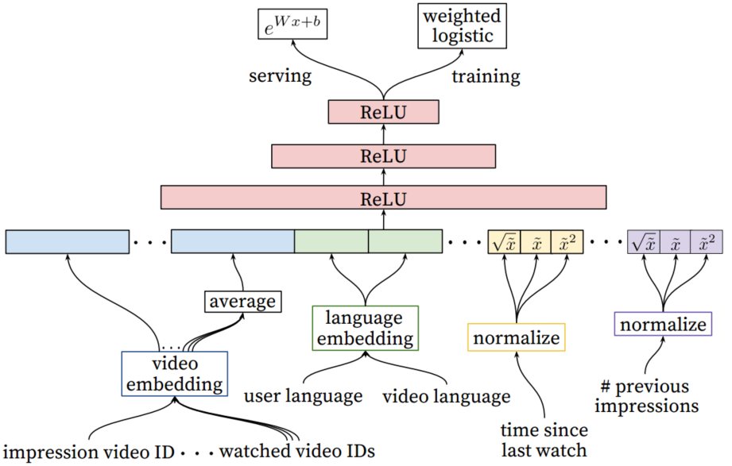
图14. Ranking

&emsp;&emsp;而在Serving阶段作者使用指数激活函数来评估watch time。

&emsp;&emsp;总的来说YouTube RS主要包括以下几点：

- YouTube RS分为Candidate generation和Ranking两部分；
- 对于网络中的special representations of categorical和连续特征分别进行embedding和分位数归一化操作；
- 使用观看时间而非点击率作为评价指标使得评估更加准确；
- 加权的逻辑回归使得我们在Serving阶段可以通过指数函数得到观看时间；
- Deep Learing对比原有的矩阵分解以及Ranking，其效果均要好。

## 4. RS System Summary

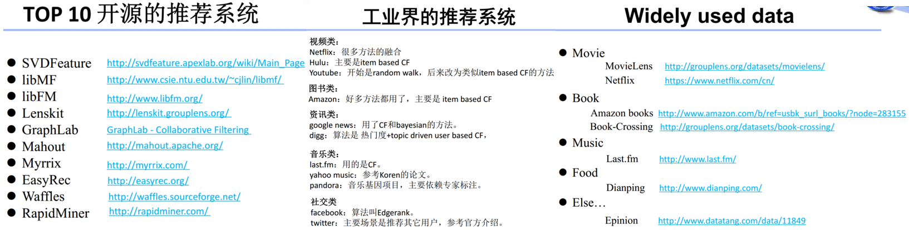
图15. RS Source

&emsp;&emsp;上图为RS的一些开源资源。对于推荐系统参考前辈的一些建议，主要如下：

- 理解业务，理解数据在实际的工程项目中至关重要，推荐系统也不例外；
- 数据的处理非常关键，好的算法只有在好的数据下才能发挥作用；
- User/Data Mining对于推荐系统有极大的帮助，但是推荐系统不仅仅是User Mining；
- 搜索与推荐密不可分；
- RS较其他研究相比，其得到的关注较晚，但是其所使用的方法却以得到了充分的验证。但总的来说这项技术仍较新，还要许多的研究需要深入，许多的问题需要解决。

## References

[[1] 项量. 推荐系统实践[B]. 北京:人民邮电出版社, 2012.6](https://www.amazon.cn/dp/B008AK5YJO)

[[2] Koren Y, Bell R, Volinsky C. Matrix factorization techniques for recommender systems[J]. Computer, 2009 (8): 30-37](https://datajobs.com/data-science-repo/Recommender-Systems-[Netflix].pdf)

[[3] Salakhutdinov R, Mnih A. Probabilistic matrix factorization. NIPS, 2008.](https://papers.nips.cc/paper/3208-probabilistic-matrix-factorization.pdf)

[[4] Ning X, Karypis G. Slim: Sparse linear methods for top-n recommender systems[C] ICDM 2011](https://www.cs.toronto.edu/~rsalakhu/papers/rbmcf.pdf)

[[5] Salakhutdinov R, Mnih A, Hinton G. Restricted Boltzmann machines for collaborative filtering. ICML, 2007](https://www.cs.toronto.edu/~rsalakhu/papers/rbmcf.pdf)

[[6] Learning to Rank: From Pairwise Approach to Listwise Approach — Microsoft Research](https://www.microsoft.com/en-us/research/wp-content/uploads/2016/02/tr-2007-40.pdf)

[[7] Jeh G, Widom J. SimRank: a measure of structural-context similarity[C]
Proceedings of the eighth ACM SIGKDD international conference on
Knowledge discovery and data mining. ACM, 2002: 538-543.](http://ilpubs.stanford.edu:8090/508/1/2001-41.pdf)

[[8] Paul Covington and Jay Adams and Emre Sargin. Deep Neural Networks for YouTube Recommendations. ACM, 2016](https://static.googleusercontent.com/media/research.google.com/zh-CN//pubs/archive/45530.pdf)