# SSD

## 1.Introduction

&emsp;&emsp;SSD(Single Shot MultiBox Dector)是第一次提出Single Shot的单阶段检测器，其舍弃了Faster R-CNN使用RPN生成boundary box并进行分类的做法而是提出了multi-scale features和default boxes的思想。与其他单阶段检测器相似，其速度要优于两阶段检测器，但是精度上与有些许损失（SSD512精度较Faster R-CNN高），总之在精度与速度间存在一定的trade-off。SSD较其他单阶段检测器相比其最大的亮点在于提出利用shallow layers检测小目标而deep layers检测大目标。这主要是因为浅层神经元拥有更多的细节信息对微小目标较为有效，而深层神经元拥有更大的感受野，更抽象的语义信息对大目标较为有效。同时作者还指出box的数量对网络性能有较大影响。

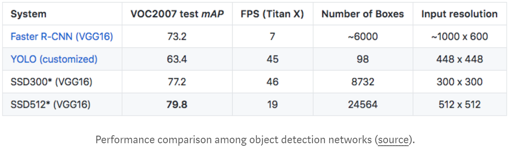
 
图1. Detectors Performance

## 2. Structure

### 2.1 Multi-scale feature maps & Boundary box

&emsp;&emsp;与Faster R-CNN通过RPN预测目标即边界框不同，SSD通过$3\times 3$的卷积核通过压缩channel数量来得到bounding boxes的位置与目标类别。同时SSD还将考虑不同大小的feature map，并给出multibox，如下：

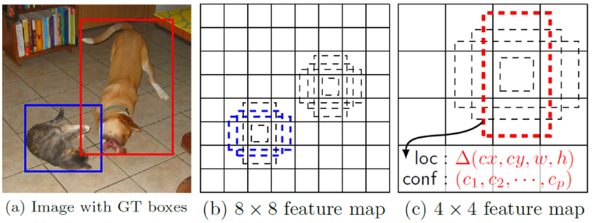
 
图2. MultiBox

&emsp;&emsp;从上图可以看出，不同大小的feature map一般负责检测不同大小的目标，$8\times 8$的feature map一般检测可以检测小尺寸物体而$4\times 4$的feature map则倾向于检测大目标。同时每个location均预测$k$个不同尺寸boxes以满足不同形状的物体（“瘦高”的box倾向于人，而“胖矮”的box则倾向于车）。每一个box均会对给出box的位置预测以及目标的类别预测。

&emsp;&emsp;对于不同layer的feature map的boundary box的选择，作者给出了线性变化公式如下：

$$
s_k=s_{min}+\frac{s_{max}-s_{min}}{m-1}(k-1),\quad k\in [1,m]\tag{1}
$$

&emsp;&emsp;上式中，$s_{min}=0.2$对应与bottom feature map，$s_{max}=0.9$对应于top feature map，$m$为extra feature layers的数目（论文中为5），$s_k$即为第$k$个feature map中box大小相对于图片大小的比例。

&emsp;&emsp;而对于同一feature map，根据先验知识其ground box的纵横比按一定规律分布且其default box呈簇聚现象，如下：

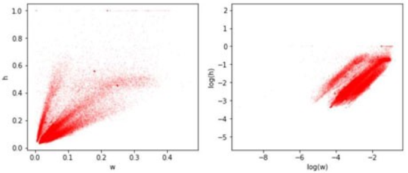
 
图2. bundary box纵横比分布

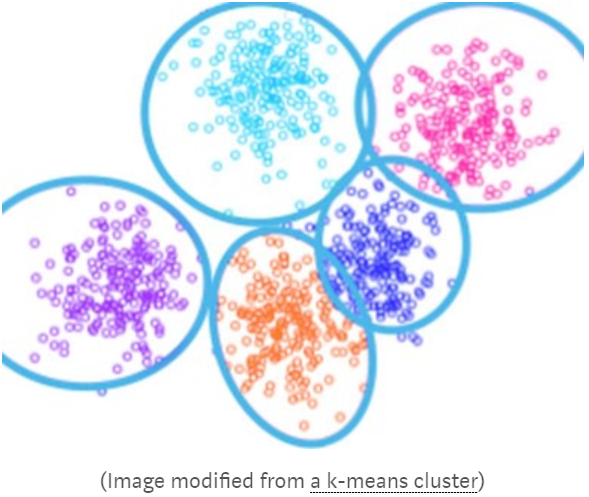
 
图3. default box 聚类

&emsp;&emsp;图2为KITTI数据集中boundary box纵横比的分布，图3为default boundary box按长宽的聚类结果。可以看出其box纵横比并非任意分布，故对于box纵横比的设置需引入一定的先验信息。即对于同一feature map中不同boundary box的大小，作者给出了如下的变化公式：

$$
w_k^a=s_k\sqrt{a_r},h_k^a=s_k/\sqrt{a_r},a_r \in \{1,2,3,\frac{1}{2},\frac{1}{3}\}\tag{2}
$$

&emsp;&emsp;上式中，$a_r$即为缩放因子，$w_k^a,h_k^a$分别表示第$k$个feature map中$a$缩放因子作用下boundary box的宽，高相对于原始图像的比例（若box的数量为4，则舍弃$3,\frac{1}{3}$）。此外作者还设置了一个$s'_k=\sqrt{s_ks_{k+1}},a_r=1$的默认放心box。

&emsp;&emsp;通过公式（1），（2）我们即可得到不同feature map中不同“高矮胖瘦”的boxes。对于第$k$个feature map box中心坐标的计算主要利用下式：

$$
(\frac{i+0.5}{|f_k|},\frac{j+0.5}{|f_k|})\quad i,j\in[0,|f_k|]\tag{3}
$$

&emsp;&emsp;上式中，$|f_k|$为第$k$个特征图的大小，相同大小特征图所产生的box其中心坐标相同。

### 2.2 Network Structure

&emsp;&emsp;SSD主要包括两部分：（1）VGG-16 basebone 抽取特征；（2）Multi-Scale feature检测目标。如下：

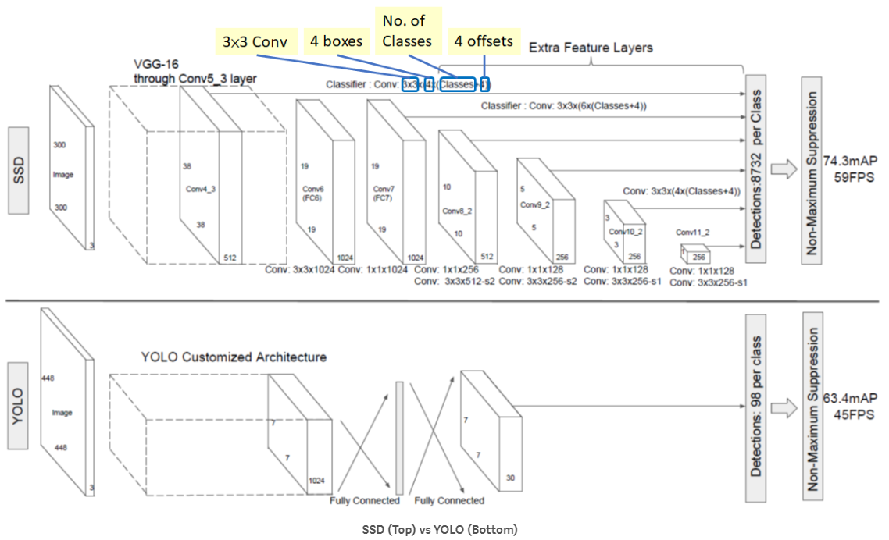
 
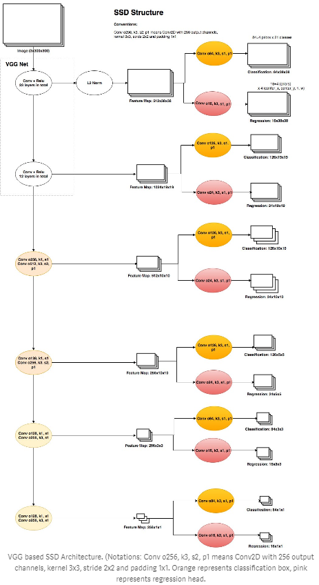
 
图4. 网络结构

&emsp;&emsp;如上图所示，在每一个feature layer中均会过1个$1\timens 1$的卷积层进行channel信息的融合以及降维，同时再接1个小的$3\times 3$的卷积层。其输出如下：

- Conv5_3：输入feature layer为$38\times 38\times 512$，接$3\times 3$卷积。其中在每一个location预测$k=4$个bounding box，因此共预测$38\times 38 \times 4=5776$个bounding boxes，而每个bounding box负责产生$(c+1+4)$个预测值($c=20$为目标类别，1为背景（YOLO中无该类别），4为box的位置信息即$\delta cx,\delta cy,w,h$)，因此其输出向量大小为$38\times 38\times 4\times (21+4)=144400$；
- Conv7:$19\times 19\times 6=2166$boxes(6 boxes for each location，Conv6未产生boxes)；
- Conv8_2:$10\times 10\times 6=600$boxes(6 boxes for each location)；
- Conv9_2:$5\times 5\times 6=150$boxes(6 boxes for each location)；
- Conv10_2:$3\times 3\times 4=36$boxes(4 boxes for each location)；
- Conv8_2:$1\times 1\times 4=4$boxes(4 boxes for each location)；

&emsp;&emsp;综上，SSD共将产生$5776+2166+600+150+36+4=8732$个boxes，其数量远多于YOLO-v1的$7\times 7\times 2=98$。

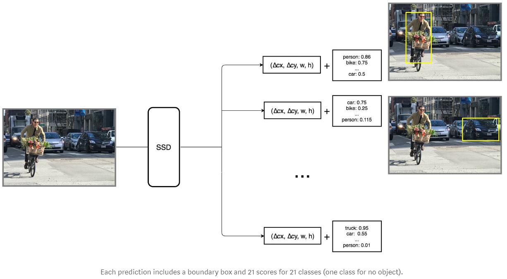
 
图5. Each predicrtions输出

## 3. Loss Function

&emsp;&emsp;SSD中的损失函数分为两个部分，包括定位误差（locatization loss，loc）与置信度误差（confidence loss，conf）:

$$
L(x,c,l,g)=\frac{1}{N}(L_{conf}(x,c)+\alpha L_{loc}(x,l,g))\\
x_{ij}^p=\{1,0\},\sum_ix_{ij}^p\geq 1\tag{4}
$$

&emsp;&emsp;上式中，$N$为positive match数量；$\alpha$为localization loss权值；$x_{ij}^p$为对于类别$p$，第$i$个default box与第$j$个ground truth box匹配指示符。$x_{ij}^p=1$表示positive match，$x_{ij}^p=0$表示negative match；$l$为预测box；$c$为classes confidence；$g$为ground truth box。

- Localization Loss

$$
L_{loc}(x,l,g)=\sum^N_{i\in Pos_{m\in \{cx,cy,w,h\}}}\sum x_{ij}^ksmooth_{L1}(l_i^m-\hat g_j^m)\\
\hat g_j^{cx}=(g_j^{cx}-d_i^{cx})/d_i^w \qquad \hat g_j^{cy}=(g_j^{cy}-d_i^{cy})/d_i^h\\
\hat g_j^w=log(\frac{g_j^w}{d_i^w}) \qquad \hat g_j^h=log(\frac{g_j^h}{d_i^h})\tag{5}
$$

$$
smmoth_{L_1}(x)=\begin{cases}
\frac{1}{2}x^2 \qquad \text |x|<1\\
|x|-\frac{1}{2} \quad \text otherwise\tag{6}
\end{cases}
$$

&emsp;&emsp;定位误差使用Smooth L1 loss，$(cx,cy)$为boundary box与default box的中心坐标偏差，$w,h$为boundary box与default box的宽、高偏差；$l^m$为检测宽与default box的相对偏差预测值；$\hat{g}^m$为grounde box与default box相对偏差。定位误差只考虑positive match（Boundary box与ground box的IoU大于threshold=0.5）

- Confidence Loss

$$
L_{conf}(x,c)=-\sum_{i\in Pos}^Nx_{ij}^plog(\hat c_i^p)-\sum_{i\in Neg}log(\hat c_i^0)\quad where \quad \hat c_i^p=\frac{exp(c_i^p)}{\sum_p exp(c_i^p)}\tag{7}
$$

&emsp;&emsp;对于类别置信度的预测需要经过softmax。

## 4. Other Details

### 4.1 Hard negative mining

&emsp;&emsp;在训练过程中绝大部分bounding box的Iou较低，为negative examples即样本正负比列不均，因此作者舍弃IoU较低的样本，调整negatives:positives=3:1。通过此操作使得训练过程faster and stable。

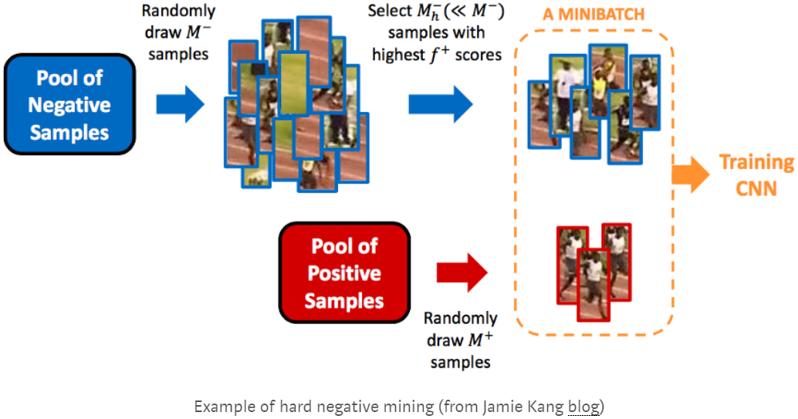
 
图6. Hard negative mining

### 4.2 Data Augmentation

&emsp;&emsp;作者使用数据增广技巧使模型更加鲁棒，如flipping、cropping、color distortion等，变化不同的size、shape等，如下：

 
图7. Data augmentation

&emsp;&emsp;通过数据增广，模型的精度得到提高，如下：

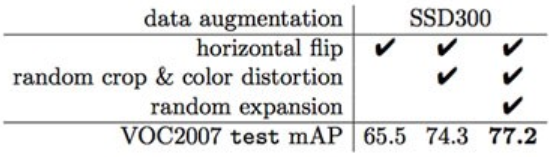
 
图8. results

### 4.3 Atrous Convolution

&emsp;&emsp;Atrous Convolution即空洞卷积。在SSD模型中，作者使用VGG16作为base Network，并其中FC6，FC7替换为空洞卷积，同时，pool5将$2\times 2-s2$替换为$3\times 3-s1$，如下：

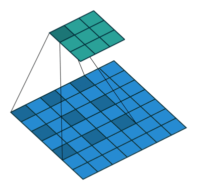
 
图9. Atrous Convolution

&emsp;&emsp;通过空洞卷积可以在较少的参数下获得较大的感受野以及较高的分辨率，同时加快训练，检测速度。

### 4.4 Non-Maximum Suppression（NMS）

&emsp;&emsp;由上所述，SSD将产生8000多个ground boxes，因此其对于目标的检测将产生大量的重叠，通过非极大抑制，可以有效将少boxes数量。作者设置IoU大于0.45的box保留，并且对于每幅图像至多保存200个predictions。

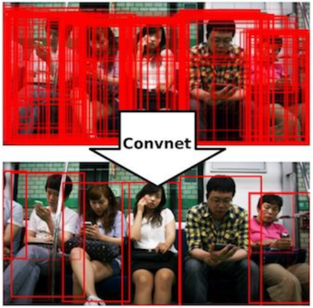
 
图10. 非极大抑制

## 5. Results

&emsp;&emsp;模型使用SGD进行训练，设置学习率为0.001，动量为0.9，权值衰减为0.0005，batch size为32。在$300\times 300$与$512 \times 512$的图像尺寸上训练模型，结果如下：

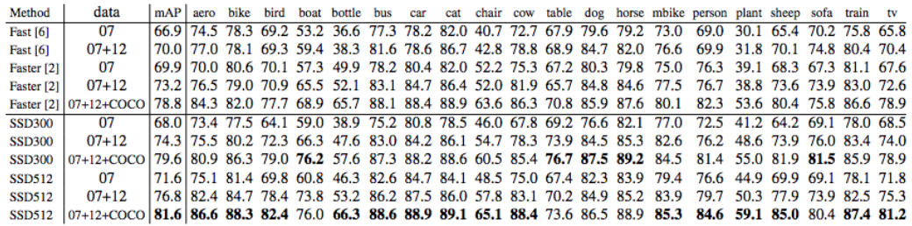
 
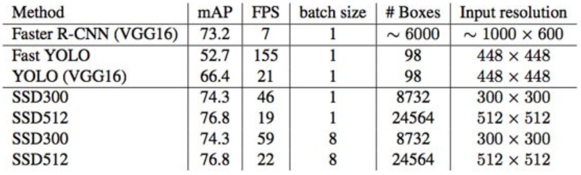
 
图11. 不同模型实验结果

&emsp;&emsp;如上图所示，SSD在速度与精度上刷新或逼近了最后记录。

&emsp;&emsp;此外：

- SSD在小物体检测上精度仍差于Faster R-CNN，虽然其采用多尺度的feature map，在微小物体上选择高分辨率的feature map，但是其语义信息较少，因此效果仍交差；
- default boxes的数量增加能够对精度带来一定的提升，但是速度将有所下降；
- 多尺度Feature map在不同scale目标下其精度有所上升；
- Default boundary boxes对精度有所提升；
- 在COCO数据集（COCO数据集拥有许多较小的目标）上使用较小的default boxes以提升精度；
- 与Faster R-CNN相比，SSD的location error较低而在类似物体检测的classification error上较高。这主要是因为对于多类别的预测其使用相同的boundary box；
- SSD512与SSD300相比其精度提升2.5%而速度降低为22FPS；
- SSD模型80%的时间花费在VGG-16网络上，因此而我们需要更快的网络，如GoogLeNet等。

## 6.Conclusion

&emsp;&emsp;SSD作为Single-shot检测器的代表，其放弃使用RPN网络模型，而是直接利用$3\times 3$的卷积，通过feature map得到boundary box以及classes。同时利用muti-scal feature map检测不同尺寸的物体。在多个数据集上SSD在速度和精度上较Faster R-CNN相比均具有一定优势。

## 7.References

[[1] Hao Gao. Understand Single Shot MultiBox Detector (SSD) and Implement It in Pytorch. Medium](https://medium.com/@smallfishbigsea/understand-ssd-and-implement-your-own-caa3232cd6ad)

[[2] Jonathan Hui. SSD object detection: Single Shot MultiBox Detector for real-time processing. Medium](https://medium.com/@jonathan_hui/ssd-object-detection-single-shot-multibox-detector-for-real-time-processing-9bd8deac0e06)

[[3] SH Tsang. Review: SSD — Single Shot Detector (Object Detection). Medium](https://towardsdatascience.com/review-ssd-single-shot-detector-object-detection-851a94607d11)

[[4] Eddie Forson. Understanding SSD MultiBox — Real-Time Object Detection In Deep Learning. Medium](https://towardsdatascience.com/understanding-ssd-multibox-real-time-object-detection-in-deep-learning-495ef744fab)

[[5] Liu W, Anguelov D, Erhan D, et al. SSD: Single Shot MultiBox Detector[C]// European Conference on Computer Vision. 2016.](https://arxiv.org/abs/1512.02325)