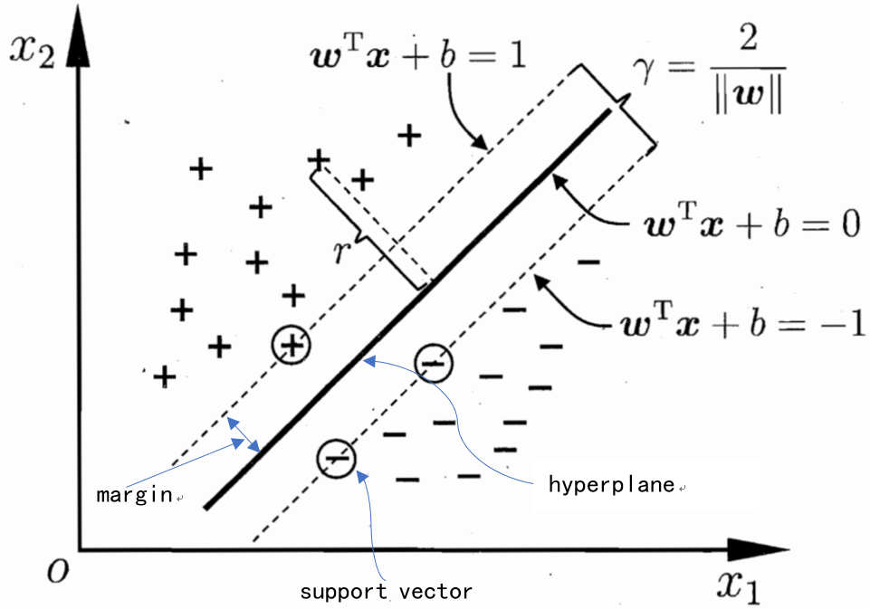
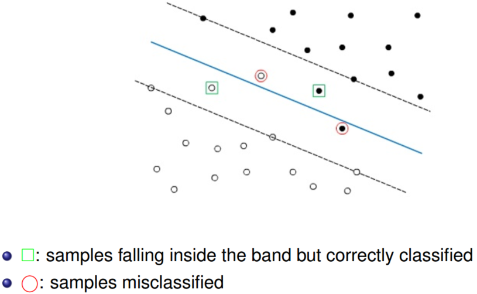
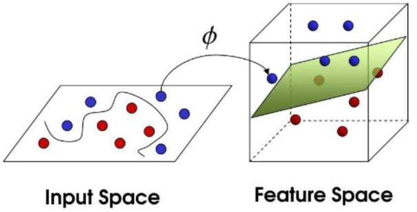
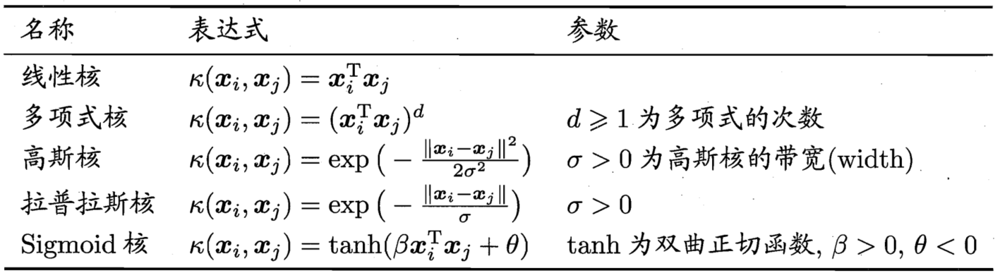
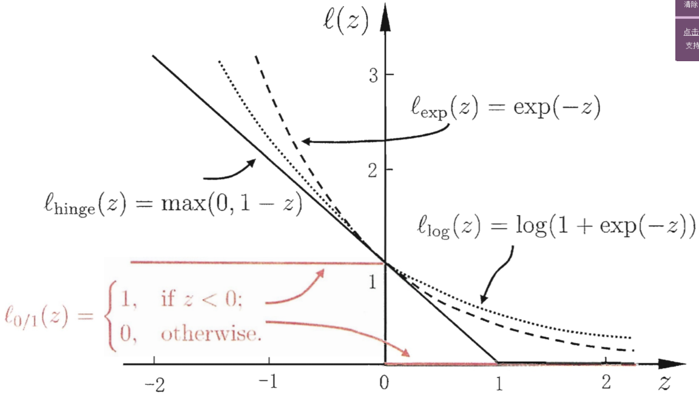

# SVM

&emsp;&emsp;支持向量机（Support Vector Machine-SVM）于1995年正式提出（Cortes and Vapnik, 1995），与logistics regression类似，最初SVM也是基于线性判别函数，并借助凸优化技术，以解决二分类问题，然而与逻辑回归不同的是，其输出结果为分类类别，并非类别概率。由于当时支持向量机在文本分类问题上显示出卓越的性能（AdaBoost+SVM），而很快成为机器学习领域的热点。直至2006年神经网络开始复兴（Hition在Science上发表文章指出在MINIST手写数字识别任务中神经网络的error rate达到1.2%，低于RBF核的SVM的1.4%error rate），12年深度学习“一鸣惊人”，这才使研究人员开始关注深度神经网络，SVM的研究逐渐淡去。但是不得不说的是SVM作为一种十分完美的分类器，其仍是有监督学习的经典代表。

&emsp;&emsp;SVM简单来说就是通过Kernel的技巧将地位空间线性不可分或难分的样本数据点映射至高维空间使其线性可分。此外，SVM通过构造目标函数使其样本间隔最大解决分类问题，也正因如此SVM更多的是关注Support Vector而忽视远离超平面的样本点，这也是为什么SVM比不上Deep Learning的一种原因。在具体实现中，其通过引入拉格朗日乘子，构造KKT条件将原问题转化为对偶问题简化求解。此外，通过Kernel trick实现非线性操作，扩展其分类能力，同时也简化了计算（不需直接求解映射函数  ）。然而也正因此，SVM也招到了一些学者的诟病，即我们无法得到映射函数，同时核函数的设计也缺乏明确的指导。虽然部分学者试图求解   ，但也只是针对具体的问题，无法给出普适的方法。
  
&emsp;&emsp;SVM与PCA、LDA以及流行学习等降维方法所不同的是，其通过升维解决分类问题。其实数据是否真正需要降维存在部分争议，数据降维主要是因为维数太高，我们目前无法求解，或很难有较好的方法进行求解，存在curse of dimension的问题。然而，有时数据降维后所得结果其实并不比未经降维处理的原始数据要好，或者有时是因为数据维数降低使其结果表面上看上去要比原来的要好，而真正结果却并没有多大精度的提升，甚至不如不进行降维处理。如在人脸识别中，通过PCA降维除去冗余，但是若只利用原始数据的颜色信息其仍能取得不错的结果。因此通过降维技术是否真正能是结果得到有效提高仍需仔细分析。（Sunjian老师等人就曾对此进行过相关讨论-Blessing of Dimension, 2013 CVPR。最近也有相关学者提出维度适当才能有较好的效果）

## Margin & Support Vector

&emsp;&emsp;考虑线性可分的二分类问题如下所示：

 
图1. 支持向量与间隔

&emsp;&emsp;在样本空间中中存在“正负”两类样本，这里我们期望能找到一个划分超平面（hyperplane）能更好的区分不同类别样本。在SVM中定义划分超平面由如下线性方程确定：

$$
W^Tx+b=0\tag{1}
$$

&emsp;&emsp;上式中，$W=(w_1,w_2,...,w_n)$为超平面法向量（垂直超平面）；

&emsp;&emsp;&emsp;&emsp;&emsp;&emsp;$b$为超平面位移项，确定超平面与原点间的距离。

&emsp;&emsp;故超平面由$W,b$唯一确定。这里我们定义正负样本的标签$y_i=\plusmn1$，且：

$$
\begin{cases}
W^Tx_i+b\geq +1,\quad y_i=+1\\
W^Tx_i+b\leq -1,\quad y_i=-1 
\end{cases}\tag{2}
$$

&emsp;&emsp;同时定义使得$|W^Tx_i+b=1|$的$x_i$为支持向量（support vector）,对应图1中虚线上的point（hard margin要求虚线内无样本点）。显然支持向量即为距超平面最近的点，因此定义间隔（margin）$\gamma$为支持向量与超平面的距离，即其在超平面法线方向的投影。

$$
\gamma=\frac{1}{2}\frac{(W^Tx_++b)-(W^Tx_-+b)}{||W||}=\frac{1}{2}\frac{(+1)-(-1)}{||W||}=\frac{1}{||W||}\tag{3}
$$

&emsp;&emsp;上式中，$||W|||$为$W$的二范数。对此，我们期望所求超平面能最大（好）的区分两类样本点（分的最开），即期望margin越大越好，则有：

$$
max_{W,b}\quad \frac{1}{||W||}\tag{4}\\
s.t.
\begin{cases}
W^Tx_i+b\geq +1, \quad if\; y_i=+1\\
W^Tx_i+b\leq -1, \quad if\; y_i=-1
\end{cases}
$$

&emsp;&emsp;注意到，$max_{W,b}\quad \frac{1}{||W||}$等价于$\min_{W,b}\quad \frac12||W||^2$，且$\begin{cases}W^Tx_i+b\geq +1, \quad if\; y_i=+1\\W^Tx_i+b\leq -1, \quad if\; y_i=-1\end{cases}$等价于$y_i(W^Tx_i+b)\geq 1$，则式（4）可转化为：

$$
min_{W,b}\quad \frac12||W||^2\tag{5}\\
s.t.\quad 1-(y_i(W^Tx_i+b))\leq 0
$$

&emsp;&emsp;式（5）即为标准二次规划（QP）问题，对此我们可以根据拉格朗日对偶性（Lagrange duality）将其转化为对偶问题求解。转化为对偶问题求解其好处主要有三：

- 对于二次规划的原问题其时间复杂度通常为$O(M^3)，与样本维度$M$有关而与样本数目$N$无关。将其转化为对偶问题后，其算法的复杂度将只与样本数目有关，而与维度无关。对于样本维度多于样本数目的数据，其复杂度将显著降低；
- 转化为对偶问题后，kernel的引入更加容易；
- 无论原问题的凹凸性如何，其对偶问题均为凸优化问题，因此我们总能通过梯度下降找到全局最优解（当然，对于二次规划其本身即为凸优化问题）。

## Lagrange duality

&emsp;&emsp;假设$f_0(x),f_i(x),h_j(x)$在定义的$x \in R^n$空间内连续可微，对于原问题：

$$
min\quad f_0(x)\\
s.t\quad  f_i(x)\leq 0,i=1,...,m\\
\qquad \; h_j(x)=0,j=1,2,...,n\tag{6}
$$

&emsp;&emsp;我们引入拉格朗日函数：

$$
L(x,\lambda,v)=f_0(x)+\sum_{i=1}^m\lambda_if_i(x)+\sum_{j=1}^nv_jh_j(x)\tag{7}
$$

&emsp;&emsp;上式中，$\lambda,v_j$均为拉格朗日乘子，且$\lambda_i\geq 0$。

&emsp;&emsp;则式（6）将等价于：

$$
g(\lambda,v)=min_{x \in R^n}\quad maxL(x,\lambda,v)_{\lambda\geq0,v}=min\;max(f_0(x)+\sum_{i=1}^m\lambda_if_i(x)+\sum_{j=1}^nv_jh_j(x))\tag{8}
$$

&emsp;&emsp;记原问题最优解$minf_0(x)=p^*$，可以看出若$x$不满足约束条件$\begin{cases}f_i(x)\leq 0,i=1,...,m\\ h_j(x)=0,j=1,2,...,n\end{cases}$时，则有$maxL(x,\lambda,v)_{\lambda\geq0,v} \to +\infty（\lambda,v\to +\infty）$，此时$g(\lambda,v)\to+\infty$而没有最小值$min$，原问题$f_0(x)\neq p^*$，而当$x$满足约束条件时，则有$g(\lambda,v)\leq min\;f_0(x)=p^*$，即：

$$
\begin{cases}
g(\lambda,v)\to \infty,f_0(x)\neq P^*,\quad \text{不满足约束条件}\\
g(\lambda,v)\leq p^*,\quad \text{满足约束条件}
\end{cases}\tag9
$$

&emsp;&emsp;从式（8）中可以看出原问题为$minmax$问题。

&emsp;&emsp;定义原问题的对偶问题为：

$$
d(\lambda,v)=max_{\lambda\geq 0,v}\quad min_x \; L(x,\lambda,v)
$$

&emsp;&emsp;可以看出原问题的对偶问题为$maxmin$问题。记对偶问题$d(\lambda,v)$的最优解为$d^*$，若原问题和其对偶问题均有最优解，则当对偶问题取得最优解$d^*$时，$x$必满足约束条件：

$$
\begin{cases}
f_i(x)\leq 0\\
h_j(x)=0\\
min_x\; L(x,\lambda,v)\leq p^*\\
d^*=max_{\lambda\geq 0,v}\quad min_x \; L(x,\lambda,v)\leq p^*
\end{cases}\tag{10}
$$

&emsp;&emsp;这里我们称$d^*\leq p^*$为弱对偶性。若$f_0(x),f_i(x)$均为凸函数，$h_j(x)$为仿射函数（多项式形式），且不等式约束（$f_i(x)\leq0$）严格成立（不能取等），此时有$d^*=p^*$，我们称其为强对偶性。在强对偶性的条件下有对偶问题的最优解即为原问题的最优解。

&emsp;&emsp;综上所述，当$x$满足下式时：

$$
\begin{cases}
\lambda\geq0\\
\lambda f_i(x)=0,i=1,2,..,n\\
f_i(x)\leq 0，h_j(x)=0\\
\nabla f_0(x)+\sum_{i=1}^m\lambda_i\nabla f_i(x)+\sum_{j=1}^nv_j\nabla h_j(x)=0
\end{cases}\tag{11}
$$

&emsp;&emsp;此时强对偶性成立，且原问题与其对偶问题同时取到相同最优解。式（11）即为著名的KKT条件（Karush-Kuhn-Tucker Conditions）。

## SVM(hard margin)

&emsp;&emsp;回到式（5），这里我们引入拉格朗日乘子，有：

$$
L(W,b,\alpha)=\frac12||W||^2+\sum_{i=1}^n\alpha_i[1-y_i(W^Tx_i+b)]\\
=\frac12W^TW-W^T\sum_{i=1}^n\alpha_iy_ix_i-b\sum_{i=1}^n\alpha_iy_i+\sum_{i=1}^n\alpha_i\tag{12}
$$
$$
s.t\quad \alpha\geq 0
$$

&emsp;&emsp;对比式（12）与Lasso回归，这里我们可以将$\frac12||W||^2$看做目标函数，而在Lasso回归中其即为正则化项二范数，而约束条件$\sum_{i=1}^n\alpha_i[1-y_i(W^Tx_i+b)]$则可以看做铰链损失函数（hinge lossfunction），而Lasso回归中其损失函数则为最小二乘。

&emsp;&emsp;为求式（5）的对偶问题最优解，我们将$L(W,b,\alpha)$分别对$W,b$求偏导，即求解$min L(W,b,\alpha)_x$，有：

$$
\frac{\partial L(W,b,\alpha)}{\partial W}=W-\sum_{i=1}^n\alpha y_ix_i=0\\
\frac{\partial L(W,b,\alpha)}{\partial b}=-\sum_{i=1}^n\alpha y_i=0\tag{13}
$$

&emsp;&emsp;将式（13）带入式（12）有：

$$
L(W,b,\alpha)=\frac12W^TW-W^T\sum_{i=1}^n\alpha_iy_ix_i-b\sum_{i=1}^n\alpha_iy_i+\sum_{i=1}^n\alpha_i\\
=\frac12W^TW-W^TW+\sum_{i=1}^n\alpha_i=\sum_{i=1}^n\alpha_i-\frac12W^TW\\
=\sum_{i=1}^n\alpha_i-\frac12\sum_{i=1}^n(\alpha_i y_ix_i)^T\sum_{i=1}^n\alpha_i y_ix_i=\sum_{i=1}^n\alpha_i-\frac12\sum_{i=1}^n\alpha_i y_ix_i^T\sum_{i=1}^n\alpha_i y_ix_i\\
=\sum_{i=1}^n\alpha_i-\frac12\sum_{i=1}^n\sum_{j=1}^n\alpha_i \alpha_jy_iy_jx_ix_j\tag{14}
$$

&emsp;&emsp;故式（5）的对偶问题即为：

$$
max_{\alpha}\quad \sum_{i=1}^n\alpha_i-\frac12\sum_{i=1}^n\sum_{j=1}^n\alpha_i \alpha_jy_iy_jx_i^Tx_j\\
s.t.
\begin{cases}
\quad \sum_{i=1}^n\alpha_iy_i=0\\
\alpha_i\geq 0,i=1,2,...,n
\end{cases}\tag{15}
$$

&emsp;&emsp;观察上式，其仍为二次规划问题。若采用二次规划算法求解，起时间复杂度和空间复杂度将分别为：$O(N^3),O(N^2)$，与样本数目有关。当样本数目过多时这显然是不可行的，对此我们需要采用一种更高效的方法及SMO算法。

&emsp;&emsp;SMO算法的简单来说就是，每次选择一对$\alpha_i,\alpha_j$然后固定其它所有参数，同时求解式（15）。不断反复这一过程直至收敛。具体来说，当我们仅考虑$\alpha_i,\alpha_j$时，有：

$$
\alpha_iy_i+\alpha_jy_i+\sum_{k\neq i,j}^n\alpha_ky_k=\sum_{i=1}^n\alpha_iy_i=0\\
记\alpha_iy_i+\alpha_jy_i=c,则有\sum_{k\neq i,j}^n\alpha_ky_k=-c\tag{16}
$$

&emsp;&emsp;由于$\alpha_k(k\neq i,j)$为固定值，因此，c为一常数。此时我们用$\alpha_i$表示$\alpha_iy_i+\alpha_jy_i=c$中的$\alpha_j$，则式（15）即转化为单变量的二次规划问题，其约束仅为$\alpha_i\geq 0$，此时将可直接求出最优解。通过SMO算法将大大降低问题的复杂度。

&emsp;&emsp;考虑式（15）为原问题的对偶问题，因此其必满足KKT条件，则有$\alpha_i(y_if(x_i)-1)=0$，即$\alpha_i=0$或$y_if(x_i)=1$。当$y_if(x_i)=1$时其为支持向量，而当其不等于1时必有$\alpha_i=0$。因此最终的模型$f(x)=W^Tx+b=\sum_{i=1}^n\alpha_i y_ix_i^Tx_i+b$中将只考虑$\alpha_i$不等于0的样本$(x_i,y_i)$，也即支持向量（这就说明SVM模型将只与支持向量有关，而忽视不在边界上的样本，这也是为何SVM在大量的样本条件下效果不如神经网络的一个原因）。

&emsp;&emsp;由式（12）知：
$$
y_i(\sum_{i=1}^n\alpha_i y_ix_i^Tx_i+b)=1\tag{17}
$$

&emsp;&emsp;理论上我们可以根据任一$(x_i,y_i,\alpha_i)$求解偏移量$b$，但是为使模型更加鲁棒，我们一般利用所用支持向量求其平均值:

$$
b=\frac{1}{|SV|}\sum_{s\in S}(\frac{1}{y_s}-\sum_{i \in S}\alpha_iy_ix_i^Tx_i)\tag{18}
$$

&emsp;&emsp;则最终SVM的模型即为：

$$
g(x)=W^Tx+b=(\sum_{s \in S}\alpha_sy_sx_s)^Tx+\frac{1}{|SV|}\sum_{s\in S}(\frac{1}{y_s}-\sum_{i \in S}\alpha_iy_ix_i^Tx_i)\tag{19}
$$

&emsp;&emsp;上式中，$S$即为支持向量构成的集合，$|SV|$即为支持向量的数目。

&emsp;&emsp;上式即可完成二分类问题，对于多分类问题，简单的做法即是构造多个二分类问题求解。

## SVM(soft margin)

&emsp;&emsp;在某些情况下，由于存在噪声数据或数据标签缺失或数据部分重叠，我们将很难找到最优的超平面将数据完全分开或使数据全部落到边界之外（$\plusmn1$）。或者有时即使我们能够找到超平面完成分类，然而由于过拟合的存在，其也并非是最优的。因此我们有必要引入松弛变量以解决上述问题。

 
图2. 软间隔 

&emsp;&emsp;考虑hard margin时其约束为：

$$
y_i(W^Tx_i+b)\geq 1
$$

&emsp;&emsp;这里引入松弛变量$\xi_i\geq 0,i=1,2,,...n$，则上述约束即变为：

$$
y_i(W^Tx_i+b)\geq 1-\xi_i\tag{20}
$$

&emsp;&emsp;很明显，当$\xi$很大以至$\to +\infty$时，式（20）将永远成立。因此为避免trivial solution，我们必须在目标函数中引入惩罚项，使得不满足约束的样本尽可能的小。则式（5）即变为：

$$
min \frac12||W||^2+C\sum_{i=1}^n\xi_i\\
s.t.\begin{cases}
y_i(W^Tx_i+b)\geq 1-\xi_i\\
\xi_i\geq0,i=1,2,...n
\end{cases}\tag{21}
$$

&emsp;&emsp;上式中，$C\sum_{i=1}^n\xi_i$即为惩罚项，$C$即为惩罚因子（该参数较为敏感，有关$C$的确定也有较多研究）。可以看出，若松弛变量越大则惩罚越大，若松弛变量为0时，惩罚也将为0。此外我们还可以将惩罚项理解为正则操作，而$C$即为调节偏差-方差的变量$\alpha$。

&emsp;&emsp;同理，引入拉格朗日函数，则有：

$$
L(W,b,\alpha,\xi,\mu)=\frac12||W||^2+C\sum_{i=1}^n\xi_i\\
=\frac12||W||^2+\sum_{i=1}^n\alpha_i[1-\xi_i-y_i(W^Tx_i+b)]-\sum_{i=1}^n\mu_i\xi_i\tag{22}
$$

$$
s.t\quad \alpha\geq 0,\mu\geq 0
$$

&emsp;&emsp;其中$\alpha,\mu$为拉格朗日乘子。

&emsp;&emsp;式（22）分别对$w,b,\mu_i$球偏导为0，则有：

$$
\begin{cases}
W=\sum_{i=1}^n\alpha_iy_ix_i\\
\sum_{i=1}^n\alpha_iy_i=0\\
C=\alpha_i+\mu_i\tag{23}
\end{cases}
$$

&emsp;&emsp;式（22）的对偶问题即为：

$$
max_{\alpha}\quad \sum_{i=1}^n\alpha_i-\frac12\sum_{i=1}^n\sum_{j=1}^n\alpha_i \alpha_jy_iy_jx_i^Tx_j\\
s.t.
\begin{cases}
\quad \sum_{i=1}^n\alpha_iy_i=0\\
0\leq \alpha_i\leq C,i=1,2,...,n
\end{cases}\tag{24}
$$

&emsp;&emsp;对比式（24）与式（15），可以发现其唯一的区别即为约束条件不同。其对偶问题需满足的KKT条件即为：

$$
\begin{cases}
\alpha_i\geq0,\mu_i\geq0\\
y_if(x_i)-1+\xi_i\geq0\\
\alpha_i(y_if(x_i)-1+\xi_i)=0\\
\xi_i\geq0,\mu_i\xi_i=0
\end{cases}\tag{25}
$$

## Kernel function

&emsp;&emsp;上文讨论的问题中，我们均假设，原始样本空间线性可分，然而在实际中大量的情况为线性不可分问题，一种可行的做法是将原始样本特征空间通过某种非线性变换映射至更高维的特征空间使其线性可分。这里我们引入kernel trick。

 
图3. 高维映射 

&emsp;&emsp;这里我们记$\phi(x)$为映射函数，则此时支持向量模型变为$g(x)=W^T\phi(x)+b$，式（5）即变为：

$$
min_{W,b}\quad \frac12||W||^2\\
s.t.\quad 1-(y_i(W^T\phi(x_i)+b))\leq 0\tag{26}
$$

&emsp;&emsp;其对偶问题则变为：

$$
max_{\alpha}\quad \sum_{i=1}^n\alpha_i-\frac12\sum_{i=1}^n\sum_{j=1}^n\alpha_i \alpha_jy_iy_j\phi(x_i)^T\phi(x_j)\\
s.t.
\begin{cases}
\quad \sum_{i=1}^n\alpha_iy_i=0\\
\alpha_i\geq 0,i=1,2,...,n
\end{cases}\tag{27}
$$

&emsp;&emsp;这里我们记：

$$
k(x_i,x_j)=<\phi(x_i)\phi(x_j)>=\phi(x_i)\phi(x_j)\tag{28}
$$

&emsp;&emsp;$k(x_i,x_j)$即为核函数。在很多情况下由于样本的高维映射$\phi(x_i)^T\phi(x_j)$计算困难，通过核函数的引入，我们可以在低维空间求解问题。此外，核函数的引入同时也确保了我们可以利用有效收敛的凸优化技术学习非线性模型。长见的的kernel function主要包括：

 
图5. kernel function 

&emsp;&emsp;其中高斯核又被称为RBF kernel，而Sigmoi核可以等价为神经网络中的两隐层激活函数。因此SVM模型将变为：

$$
g(x)=W^Tx+b=(\sum_{s \in S}\alpha_sy_s\phi(x_s)^T\phi(x)+\frac{1}{|SV|}\sum_{s\in S}(\frac{1}{y_s}-\sum_{i \in S}\alpha_iy_i\phi(x_i)^T\phi(x_i))\\
=\sum_{s \in S}\alpha_sy_sk(x,x_s)+\frac{1}{|SV|}\sum_{s\in S}(\frac{1}{y_s}-\sum_{i \in S}\alpha_iy_ik(x_i,x_i))\tag{29}
$$

&emsp;&emsp;因此从上文分析可知，此时SVM模型的关键问题将变为核函数的设计和选择（对比神将网络模型，其映射函数有学习而得，而SVM核函数则需要手工设计）。2004-2005年kernel learning曾是一个hot point，有关该问题的研究主要包括两方面：①learning kernel matrix（适用范围仅限该问题）；②learning kernel function。同时通过kernrl function求解映射函数也是一个研究方向，通常的做法包括kernel-PCA。这里我们以二次kernel和Gaussian kernel为例求解映射函数。

(1)Polynomial kernel(k=2)

$$
k(x,x')=(x^Tx'+1)^2=(x_1x_1'+x_2x_2'+1)^2=(x_1)^2(x_1')^2+(x_2)^2(x_2')^2+2x_1x_1'x_2x_2'+2x_1x_1'+2x_2x_2'+1\tag{30}
$$

&emsp;&emsp;则：

$$
\phi(x)=(1,\sqrt2x_1,\sqrt2x_2,\sqrt2x_1x_2,(x_1)^2,(x_2)^2)^T\tag{31}
$$

(2)Gaussian kernel

$$
k(x,x')=exp(-||x-x'||^2/2\sigma^2)=exp(-(x^Tx-2x^Tx'+(x')^Tx')/2\sigma^2)=exp(-x^Tx/2\sigma^2)exp(x^Tx'/\sigma^2)exp(-(x')^Tx'/2\sigma^2)\\
=exp(-(x_1x_1+x_2x_2)/2\sigma^2)exp((x_1x_1'+x_2x_2')/\sigma^2)exp(-(x_1'x_1'+x_2'x_2')/2\sigma^2)\tag{32}
$$

&emsp;&emsp;则：

$$
\phi(x)=(exp(-x_1x_1/\sqrt2\sigma),exp(-x_2x_2/\sqrt2\sigma),exp(x_1)/\sigma,exp(x_2)/\sigma)\tag{33}
$$

## Loss function & Regularization

&emsp;&emsp;最后我们来讨论SVM中的loss function与regularization。观察式（21）有：

$$
min\frac12||W||^2+C\sum_{i=1}^n\xi_i=\frac12||W||^2+C\sum_{i=1}^nmax(0,1-y_i(W^Tx_x+b))=\frac12||W||^2+C\sum_{i=1}^nl_{0/1}(y_i(W^Tx_x+b))\tag{34}
$$

&emsp;&emsp;式（34）即为hinge损失。常用的损失函数主要包括：

- hinge loss：$l_{hinge}(z)=max(0,1-z)$；
- exponential loss；$l_{exp}(z)=exp(-z)$；
- logistic loss；$l_{log}(z)=log(1+exp(-z))$；

&emsp;&emsp;其图像如下：

 
图6. loss function 

&emsp;&emsp;上文讨论可知，当loss function为hinge loss时，SVM model类似于Lasso regression，而当loss function为logistic loss时，SVM model类似于logistics regression，所不同的是logistics regression的结果为类别概率，而SVM为类别，且logistics regression能直接用于多分类问题，而SVM需要进行推广。比较hinge loss与logistic loss，由于hinge loss具有一段为0的区域，因而更容易得到稀疏解。更一般的我们可以将式（34）写成如下形式：

$$
min_g \quad \underbrace{C\sum_i^nl(g(x_i),y_i)}_{(1)}+\underbrace{\Omega(g)}_{(2)}\tag{35}
$$

&emsp;&emsp;上式中的第一项即被我们常称为的经验风险（empirical risk），用于反映偏差，即各种损失函数。第二项则为结构风险（structural risk），反映模型的方差，即过拟合程度，通常为各种范数。而$C$可以认为 bias-variance trade-off调节参数。（有关损失、正则的详细介绍可参看我的另一篇笔记）

## Reference

[[1] Bishop C M, 박원석. Pattern Recognition and Machine Learning, 2006[M]. Academic Press, 2006.](http://users.isr.ist.utl.pt/~wurmd/Livros/school/Bishop%20-%20Pattern%20Recognition%20And%20Machine%20Learning%20-%20Springer%20%202006.pdf)

[[2] 周志华. 机器学习[M]. 清华大学出版社, 2016.](https://www.amazon.cn/dp/B01ARKEV1G)

[[3] 李航. 统计学习方法[M]. 清华大学出版社, 2012.](http://www.dgt-factory.com/uploads/2018/07/0725/%E7%BB%9F%E8%AE%A1%E5%AD%A6%E4%B9%A0%E6%96%B9%E6%B3%95.pdf)

[[4] Cortes C , Vapnik V . Support-Vector Networks[J]. 1995.](https://link.springer.com/content/pdf/10.1007/BF00994018.pdf)

[[5] Platt J C. Fast training of support vector machines using sequential minimal optimization[M]// Advances in kernel methods. MIT Press, 1999:185-208.](https://pdfs.semanticscholar.org/59ee/e096b49d66f39891eb88a6c84cc89acba12d.pdf)
