# 检索中的各类Hash及其应用

&emsp;&emsp;索引或搜索问题早在上世纪就以出现，如基于文本的搜索等。随着互联网等相关技术的飞速发展，搜索问题显得越来越重要。多媒体信息检索主要经过了三个阶段，即基于关键词、基于重复内容和基于语义。2012年5月谷歌推出知识图谱技术即为基于语义的检索，此后主流的搜索引擎，如Google，Biying，Baidu等以知识库的搜索均是基于知识图谱的搜索。知识图谱简单来说就是三元组，即知识图谱的构建过程就是抽取非结构化数据（如图片等）或半结构化数据（如网页等）中客观世界的概念、实体、事件及其之间的关系并将其结构化的过程（即构建三元组）。此外，互联网中大量存在多维、高阶、海量的文本、图像和视频等数据，这些信息间存在着错综复杂的交叉关联，具有跨媒体特性。而对于跨模态的检索其存在的最大问题即为“语义鸿沟”。

 
图1. “语义鸿沟”图例说明

&emsp;&emsp;如上图所示，若对图像进行简单的匹配搜索，即从视觉底层去进行相似性判断而不进行语义层面上的推理分析，则将会出现很多荒诞的结果。

&emsp;&emsp;网络多媒体检索的基本流程如下图所示：

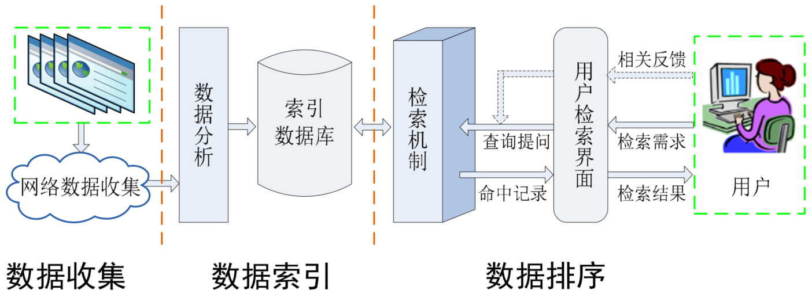
 
图2. 网络多媒体检索的基本流程

&emsp;&emsp;如上图所示，网络多媒体检索的基本流程主要包括三个阶段：Step1.数据搜集（网络爬虫）；Step2.数据索引，该过程即为数据的清洗、结构化操作，如以图搜图中视觉词袋的构建及Hash映射等；Step3.数据排序，如相似度和距离的定义及计算等。

## 1. 多媒体内容的索引

&emsp;&emsp;内容的搜索问题其本质上即为Top N排序问题。对于排序的准则主要包括动态相关性和静态相关性这两个方面。其中动态相关性是指与查询词的相关性，如[TF-IDF](https://zh.wikipedia.org/wiki/Tf-idf)。而静态相关性即表示查询对象的质量（权威性），如[PageRank](https://zh.wikipedia.org/wiki/PageRank)。

### 1.1 TF-IDF

$$
TF-IDF_{i,j}=tf_{i,j}\cdot idf_{i}\\
tf_{i,j}=\frac{n_{i,j}}{\sum_kn_{k,j}}\\
idf_i=lg\frac{|D|}{|{j:t_i\to d_j}|}\tag{1}
$$

&emsp;&emsp;上式中，$tf_{i,j}$为词频（term frequency），其中$n_{i,j}$为关键词$i$在文档$j$中的出现次数；$\sum_kn_{k,j}$为文档$k$中出现的词数之和。$idf_i$即反映该文档$j$的重要程度，该值越大则说明文档$j$越重要。$idf_i$为逆向文件频率（inverse document frequency），其中$|D|$为数据库中文件总数目，$|{j:t_i\to d_j}|$为包含关键词$i$的文档数目，为避免关键词在所有文件中均未出现的情况（未登录词），在实际使用中我们一般取$1+|{j:t_i\to d_j}|$。$|{j:t_i\to d_j}|$越小，即说明该关键词越能代表或反映所搜索的文档内容，即其所包含的信息量越大（类比信息熵）。$idf_i$反映关键词的重要程度，其值越大即$|{j:t_i\to d_j}|$则说明关键词越重要。

&emsp;&emsp;此外，考虑关键词在文档中出现的位置，以及文档的大小，我们会对$TF-IDF$进行修正。（一般认为关键词出现在文档标题、关键词、摘要、段首以及文档越靠前的位置其重要度越高。文件大小<40K较为合适，若文档过长我们需对$TF-IDF$进行一定的惩罚）

### 1.2 PageRank

&emsp;&emsp;作为Google战胜Yahoo的秘密之一，大名鼎鼎的PageRank算法在此就不做过多介绍，其核心思想即认为某一链接的质量由其本身即指向它的连接共同决定。如下式所示：

$$
r(p)=\alpha\sum_{q:(q,p) \to \epsilon}\frac{r(q)}{w(q)}+(1-\alpha)\frac1N\tag{2}
$$

&emsp;&emsp;上式中，$r(p)$为网页$p$的PageRank值；
 
&emsp;&emsp;&emsp;&emsp;&emsp;&emsp;$q$为网页$p$的后向链接，即$q\to p$；
 
&emsp;&emsp;&emsp;&emsp;&emsp;&emsp;$w(q)$为网页$q$的前向链接数目；
 
&emsp;&emsp;&emsp;&emsp;&emsp;&emsp;$r(q)$为网页$q$的PageRankl；
 
&emsp;&emsp;&emsp;&emsp;&emsp;&emsp;$N$为整个网络中网页的总数。

 
图3. PageRank

&emsp;&emsp;从式(2)中我们可以看出PageRank是一种与与查询无关的静态算法，即其最终排序结果可提前计算给出，能够较好的满足实时性的需求。而该算法的缺点则是，其最终结果与主题无关，且旧网页的排名往往要比新网页高。

&emsp;&emsp;此外需要指出的是在PageRank提出之前，康奈尔大学的J.M.Kleinberg教授提出的HITS算法也是基于相似的思想，即认为：一个好的“Authority”页面会被很多好的“Hub”页面指向，且一个好的“Hub”页面会指向很多好的“Authority”页面。该算法在自然语言、社交网络等领域取得很好效果。然而该算法也存在计算复杂、主题漂移、易作弊的缺陷。

## 2. 近邻搜索中的Hash表示

&emsp;&emsp;在实际的图像检索应用中，如“以图搜图”问题，为满足实时性的需求，我们一般是采用近似搜索的策略。此时，需要在检索精度和检索速度的trade-off中做到平衡，另外对于大多数应用，近似近邻就能很好的满足要求。

&emsp;&emsp;图像检索的主要过程如下：

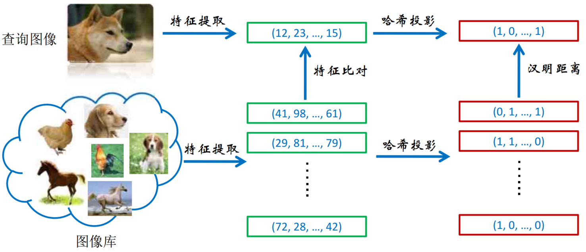
 
图4. 图像检索

&emsp;&emsp;如上图所示，图像检索一般包括局部特征的提取，如SIFT[Lowe’99]，HOG[Dalal’05]，LBP[Ojala’94]等；传统手工设计的特征描述子提取的特征太多，因此需经过局部特征编码，如硬投票[Joachims’98]，软投票[Gemert’08]，稀疏编码[Yang’09]，局部敏感哈希[Indyk'98]，谱哈希[Weiss'08]等；图像全局特征表示，如空间金字塔模[Lazebnik’06]，空间划分学习[Jia’11]等；相似性、距离计算等。其中[Hash](https://en.wikipedia.org/wiki/Hash)函数简单来说就是将原始数据编码（映射）为0-1码，而通过Hash编码，其不仅能实现时间上的高效（基于XOR操作的快速计算）还能实现存储上的高效（基于位存储的紧致表达）。好的Hash函数一般要求原始相近的数据其哈希编码也要尽可能的相近，而当原始数据发生变化时其Hash编码的差异也要尽可能的大，同时还能抵御各种攻击以保护原始数据。Hash函数广泛应用于密码学、通信等领域，从最初的Hash提出直至今日，Hash函数已不下百种，然而在众多的Hash中不得不提的是最初的LSH和谱哈希，它们的出现极大的推动了Hash研究的进行。

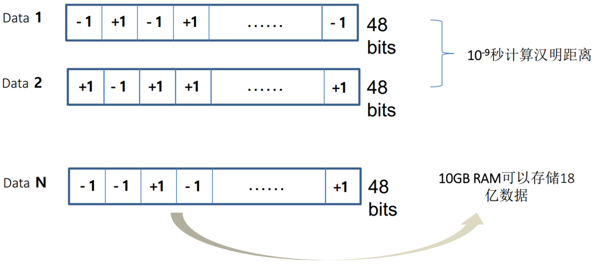
 
图5. Hash表示

### 2.1 局部敏感哈希（Locality Sensitive Hashing，LSH）

&emsp;&emsp;局部敏感哈希是非常简单的一种哈希函数，其通过无监督学习生成。由于结构、运算简单而在许多邻域得到广泛应用。尤其是当编码位数较长时其效率有明显的提高，因此在很多任务中LSH是我们必须尝试的编码之一。LSH通过将原始数据进行随机投影后经过符号函数得到Hash编码，其表达式如下：

$$
B=sgn(XW)\tag{1}
$$

&emsp;&emsp;上式中$X$为原始数据，$W$为变换矩阵，$B$为Hash编码。可以看出LSH真的是非常简洁，这也充分验证了“Simple is beauty.”这句名言。而对于LSH为什么会如此有效，不少学者进行了大量研究。2017年12月Science上发表文章"A Neural algorithm for a fundamental computing problem"，该研究发现果蝇的嗅觉环路对相近的嗅觉产生相近的神经活动模式，可将一种味觉习得的行为应用于接触相似味觉时。因此研究者受此启发，将其中的三种全新计算策略应用于计算领域，提出新的局部敏感哈希算法，该方法可有效改善近似检索的计算表现。

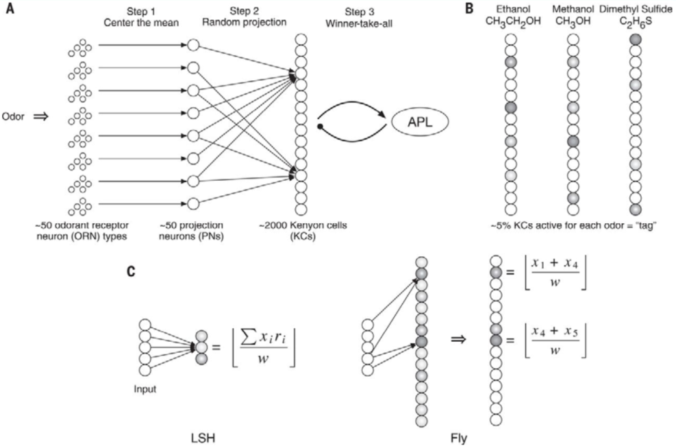
 
图6. LSH VS the fly olfactory circuit

&emsp;&emsp;虽然该方法在编码长度较短式其性能要由于LSH，然而随着编码长度的增加LSH性能快速上升，该方法在较长编码时优势并不明显。

### 2.2 语义哈希（Semantic Hashing）

&emsp;&emsp;Semantic hashing由Hinton大爷于2007年提出（2006年Hinton在Science上首次提出了Deep Learning，然而当时在学术界并没有引起太多的关注，于是其便将RBMs在各个邻域进行应用，Hash编码便是其中之一），其主要是利用深度受限制玻尔兹曼机RBMs，学习Hash编码，网络结构如下图所示：

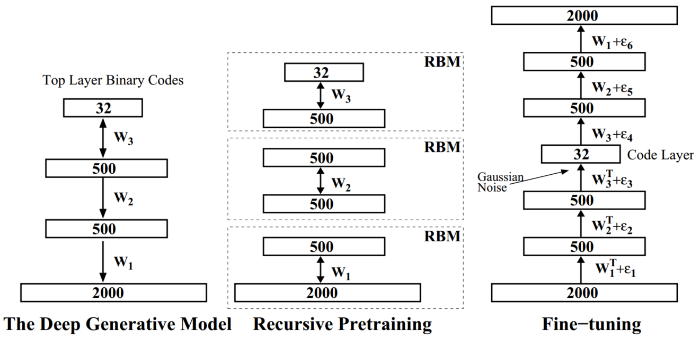
 
图7. Semantic Hash

&emsp;&emsp;从上图可以看出通过最大释然优化能量函数，得到Hash编码，另外为使编码更加鲁棒，在编码后进一步引入随机噪声，经一步的优化网络。

### 2.3 谱哈希（Spectral Hashing, SH）

&emsp;&emsp;谱哈希是哈希函数族中的又一经典代表，其天才的将哈希编码过程转化为图像分割问题，进而通过放松约束条件将分割问题转化成拉普拉斯特征图的降维问题，从而求解原问题得到图像数据的哈希编码。

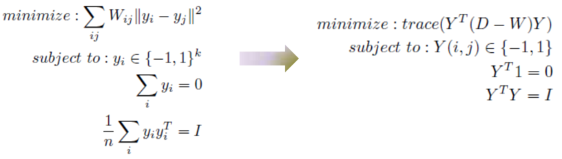
 
图8. Spectral Hash

&emsp;&emsp;上图中，$y_i,y_j$即为哈希编码，最小化目标函数$\sum_{ij}W_{ij}||y_i-y_j||^2$即最小化著名的Laplacian Eigenmaps（拉普拉斯特征映射）公式。而约束条件$y_i\in \{-1,1\}^k$即保证Hash编码的离散型和有效性；约束条件$\sum_iy_i=0$即保证各个哈希编码内的平衡；约束条件$\sum_i y_iy_i^T$即保证各个哈希编码间互不相关。通过优化目标函数即可得到紧凑的哈希码，从形式上看，哈希和流形学习之间的区别很小，主要区别在三个限制条件上。但其中最主要的，离散条件（二值化）的限制使得哈希学习的研究和传统的流形学习方法或其他降维方法产生很大区别，主要体现在优化上面。对于哈希编码B，由于其是离散的，所以不能用传统的梯度下降方法去解，这一问题是典型的混合整数问题，即NP hard（non-deterministic polynomial，NP，非确定性多项式）问题。因此我们往往需要放宽约束去掉离散的限制，将原问题转化为拉氏特征图降维问题，引入PCA求解。如下所示：

- Step1. 利用主成分分析（PCA）获取图像各个主成分方向；
- Step2. 在各个主成分上利用$\lambda_k=1-e^{-\frac{\epsilon^2}{2}|\frac{k\pi}{b-a}|^2}$计算特征值，并以从小到大的顺序选取前$r$个最小的值，计算其对应的特征函数值$\Phi_k(x)=sin(\frac{\pi}{2}+\frac{k\pi}{b-a}x)$。
- 将特征函数值在零点进行二元量化（sign函数）得到哈希编码。

&emsp;&emsp;对于Hash的求解问题一般分为两步。第一步去掉离散约束，这就变成了连续优化的问题，即可以通过传统的梯度下降方法去求解，然而它的缺点是很难得到比较好的局部最优解。第一步通过去掉离散限制得到连续结果，第二步再通过设定阈值进行二值化操作，如符号函数。由此就得到了哈希码。当然，也可以利用类似2011年提出的ITQ去减少量化损失。然而这种方法的缺点是对于长哈希码（超过100比特），量化偏差将会很大，使得学出来的哈希码不是十分很有效。

### 2.4 迭代量化（Iterative Quantization, ITQ）

&emsp;&emsp;ITQ主要思想是基于PCA采用正交旋转矩阵对初始投影矩阵进行优化以减少误差。ITQ的目标函数如下：

$$
min \quad ||B-XWR||_F^2=||B-VR||_F^2\\
s.t.\quad R^TR=I,B\in \{-1,1\}^{n\times c}\tag{2}
$$

&emsp;&emsp;上式中，$B$为学习所得Hash编码；

&emsp;&emsp;&emsp;&emsp;&emsp;&emsp;$X$为原始数据；

&emsp;&emsp;&emsp;&emsp;&emsp;&emsp;$W$为PCA所得特征值对应的特征向量；

&emsp;&emsp;&emsp;&emsp;&emsp;&emsp;$R$为宣旋转矩阵（正交阵）。

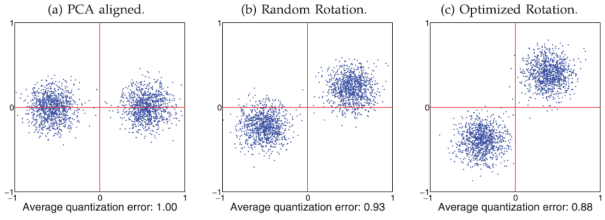
 
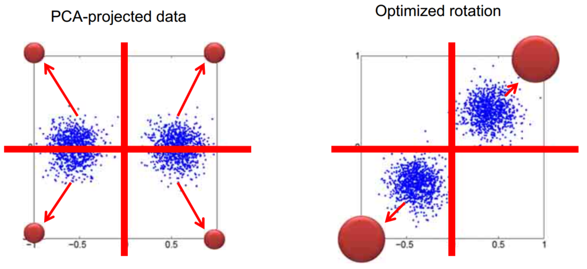
图9. ITQ

&emsp;&emsp;我们一般要求相似的数据拥有相同的编码。从上图中可以看出，简单的PCA对于不同维度的数据其方差并不平衡，因此该方法并不能很好的满足上述要求，通过随机将PCA进行旋转，都比原始PCA能取得更好的效果。这也是ITQ的Motivation，同时这也是ITQ对比SH的主要区别，即ITQ通过旋转主成分方向使得旋转后各方向的方差尽量保持平衡，而SH则为方差大的主成分方向分配更多的比特。

&emsp;&emsp;此外，由式（2）可以看出，目标函数中$B,R$均未知，因此我们需通过类似坐标下降的方法进行求解，即固定$B$优化$R$，固定$R$求解$B$（类似[EM算法]（https://zhuanlan.zhihu.com/p/50686800）），其过程如下：

&emsp;&emsp;固定$R$优化$B$（对$B$求偏导等于0）:

$$
T=VR,J(B)=\sum_{i=1}^n\sum_{j=1}^cB_{i,j}T_{i,h},B_{i,j}=\begin{cases}
1,\quad if\;T_{i,j}\geq0\\
-1,\quad otherwise 
\end{cases}\tag{3}
$$

&emsp;&emsp;固定$B$优化$R$（对$R$求偏导等于0，orthogonal Procrustes problem）:

$$
B^TV=S\Omega\hat{S}^T,R=\hat{S}S^T\tag{4}
$$

- Step1. 首先根据PCA对数据进行降维并对降维后的结果进行二值量化处理得到所有数据的初始哈希编码，这样原始数据即被嵌入到了汉明空间中，各数据位于超立方体的顶点上； 
- Step2. 对主成分方向进行一次随机旋转，可以较好的平衡不同主成分方向的方差，接着对编码矩阵和旋转矩阵进行交替优化，以最小化量化误差为目标，旋转若干次后将得到局部最优解。

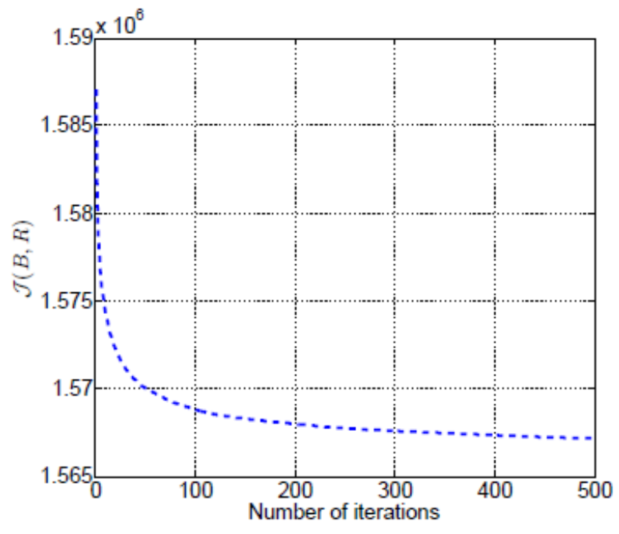
 
图10. ITQ实验结果

&emsp;&emsp;由图10可以明显看出，随着编码长度的增加，ITQ的性能急剧下降，对于较长的编码其难以保持明显的优势。

&emsp;&emsp;这里通过Euclidean ground truth和Class label ground truth指标比较各种哈希的性能，如下：

 
图11. Evalution of Hash

&emsp;&emsp;通过上图我们可以看到各个Hash函数的性能和特点，同时为不同编码任务Hash函数的选择提供一定的参考依据。

### 2.5 在线哈希学习（Online Hashing）

&emsp;&emsp;在现实的绝大多数场景中，检索系统中数据是流式的、不断更新的，而对于超大规模数据，很难将其载入内存进行哈希函数学习，而且在线学习往往伴随着超高的时间和计算代价。因此我们有必要研究出一种可行的方法，以较好的实现增量学习。对此SIGKDD 2013BP就给出了在线Hash学习的可行方法，即矩阵素描（Matrix Sketching）。

&emsp;&emsp;矩阵素描的基本思想是通过寻找和维护一个较小的矩阵$B\in R^{l\times m}$，代替线上较大的矩阵$A\in R^{n\times m}(l<< m)$，同时使两者间的差值$||A-B||$最小，即尽可能的保留原始矩阵的大多数特性。此思想即类似SVD，即求解$A$的best top-k近似$A_k$。然而于SVD所不同的是，我们既希望找到最佳近似$B$，同时在时间复杂度上又要优于SVD，$O(nm,min(n,m))$。对此我们使用FD Streaming algorithm（Frequent Directions）。即应用FP从$l$到$A$以获得$l$维的素描矩阵$B$，同时满足：

$$
0\leq ||AA^T-BB^T||_2\leq \frac{2}{l}||A||^2_F\quad or \quad 0\leq ||A^Tx||^2-||BB^Tx||^2\leq \frac{2}{l}||A||^2_F,\quad \forall x, ||x||=1\tag{5}
$$

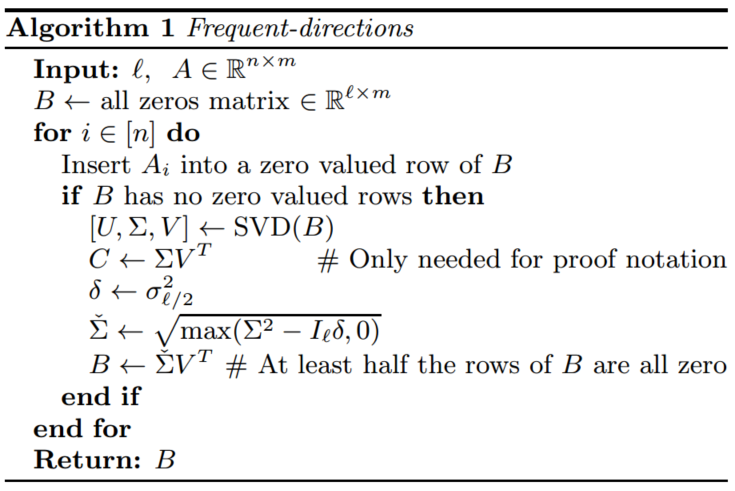
 
图12. FB algorithm

## 3. 基于哈希的特征匹配

&emsp;&emsp;通过Hash特征匹配，我们主要能解决图像搜索、三维重建、图像分类、目标识别等问题。现有的特征匹配主要有三大类方法，即Point matching, Line matching, Region matching（本质上均为Point matching）。下图为三维重建的主要过程：

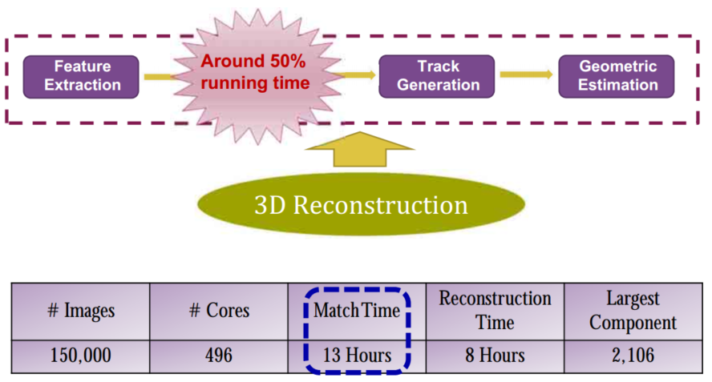
 
图13. 3D Rebuild 

&emsp;&emsp;可以看到Matching花费了大量时间，其时间复杂度为$O(N*(N-1)*M^2)$，$N$为图像总数，$M^2$为图像大小。为减少时间，除硬件加速外有必要研究有效的Hash算法。

## 4. 乘积量化（product quantization, PQ）

&emsp;&emsp;PQ主要用于解决的重排序时的向量间距离的快速计算的问题。它的基本思想是将样本特征量化为$M$个码字之和的形式，即分割向量，对分割后的向量空间建立独立码本；通过将高维向量分割成多个低维向量，达到节省存储空间的目的；通过subvector-to-centroid的查表方式，达到降低计算复杂度的目的。

码字-质心向量的索引；码表-各质心和码字对应关系的集合。

&emsp;&emsp;其具体操作为对所有相似的向量用一个质心（聚类中心）来表示，那么我们可以提前将各质心间的距离计算出来，而在实时查询时，只需得到查询向量和被查询向量各自的质心索引，即可以得到二者间的距离，这样就避免了在线的实时计算，满足了实时性的要求。而对于高维浮点向量，其能够大大减少重排序时间。而为获得有效的结果，我们一般要求各个质心能过尽可能的代表各自样本点，即期望质心数目尽可能多（当每个样本均为一质心时将不存在误差，但不合理），而数目较多的质心将带来计算和存储的巨大成本。对此，作者提出乘积量化，即将输入向量分割为长度较短的子向量，而对每个子向量进行独立的量化（聚类），并建立量化后的质心索引，即码字，各子向量码字的集合构成该输入向量的码本。同时将输入向量的质心用各码字的乘积表示，如下：

$$
q(x)=\sum_{m=1}^Mq_m(x),q_m(x)\in C_m\tag{6}
$$

&emsp;&emsp;其优化目标为最小化量化误差：

$$
min_{C-1,...C_M}\sum_M||x-q(x)||_2^2\tag{7}
$$

&emsp;&emsp;即：

$$
min_{C_m}\sum_x||u_m(x)-q_m(x)||_2^2\tag{8}
$$

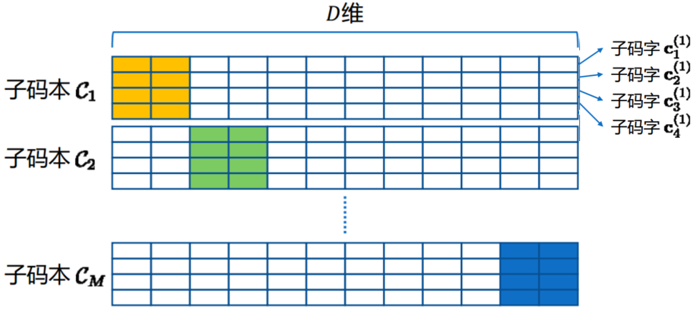
 
图14. 乘积量化 

&emsp;&emsp;由于其时间复杂度为$O(TkND)$，因此难以应用于大规模数据集。

## 5. 基于量化的CNN加速与压缩

&emsp;&emsp;由上知长向量可由其对应质心表示，而长向量质心的计算可拆分为多个短向量质心的乘积。因此我们通过对短向量进行聚类求得码字，即可通过查表快速获取长向量的码本。基于此，长向量间的乘积可以表示为短向量乘积的和，而短向量可通过建表查取，这样即大大缩短了时间。基于此，即可对CNN进行量化加速与压缩。

&emsp;&emsp;如图15所示，总所周知，CNN网络的参数主要集中于全连接层，而运算时间主要集中于卷积层，因此为加速、压缩网络，我们需对其分别进行处理。

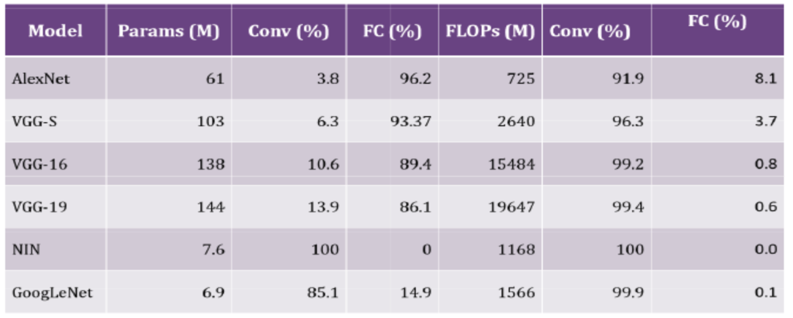
 
图15. 卷积层与全连接层参数数目与运算 

&emsp;&emsp;（1）Fully-connected layer

$$
T(c_t)=<W_{c_t},S>=\sum_{m=1}^M<W_{c_t}^{(m)},S^{(m)}>\approx \sum_{m=1}^M<D^{(m)}B_{c_t}^{(m)},S^{(m)}>
$$
$$
where,W_{c_t}^{(m)}\in R^{C'_s\times l},D^{(m)\in R{C'_s\times K}},B_{c_t}^{(m)}\in \{0,1\}^{K\times l}\tag{9}
$$

&emsp;&emsp;使用PQ方法量化。将权重矩阵$W$均匀地分成$M$个子空间，对每个子空间使用K-means算法得到码字，其中$D$为码本，包含$K$个子码字。$B$中的每一列是指示矢量，指定哪个子码字用于量化相应的子向量。全连接层结构如下：

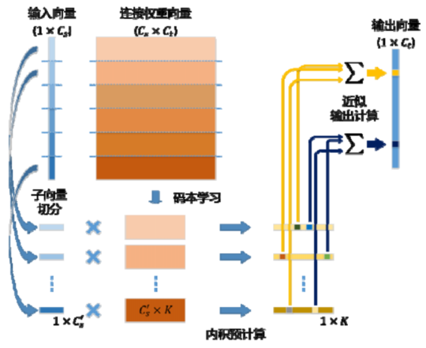
 
图16. 全连接层结构图

&emsp;&emsp;通过量化操作，可将$S^{(m)}\cdot D^{(m)}$的结果记录，此后每次计算只需要$M$次加法运算，算法复杂度由原来的$O(C_sC_t)$减少为$O(C_sK+C_tM)$。而且，只需要存储sub-codebook$D$和量化指示器$B$，可节约很大的存储开销。

&emsp;&emsp;（1）Conv layer

&emsp;&emsp;与全连接层中的1-D矢量不同，每个卷积核均为3维向量。故在量化前，我们需要确定如何将其分割为子向量，即将子空间分割应用于哪个维度。在测试阶段，每个卷积核在空间域中使用滑动窗口遍历输入特征图。由于这些滑动窗口部分重叠，故沿特征映射通道的维度拆分每个卷积核，以便计算的内积可以在多个空间位置重复使用。优化同样通过每个子空间中的K-means聚类实现。

$$
T_{pt}(c_t)=\sum_{(p_k,p_s)}<W_{c_t,p_k},S_{p_s}>=\sum_{p_k,p_s}\sum_{m=1}^M<W_{c_t,p_k}^{(m)},S^{(m)}_{p_s}>\approx \sum_{p_k,p_s}\sum_{m=1}^M<D^{(m)}B_{c_t,p_k}^{(m)},S^{(m)}_{p_s}>
$$
$$
where,W_{c_t,p_k}^{(m)}\in R^{C'_s\times C_t},D^{(m)\in R{C'_s\times K}},B_{c_t,p_k}^{(m)}\in \{0,1\}^{K\times C_t}\tag{10}
$$

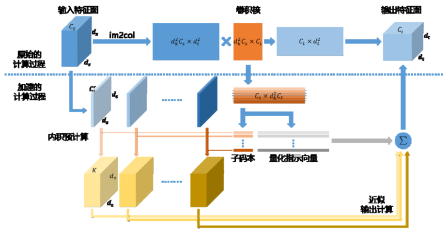
 
图17. 卷积层结构图

&emsp;&emsp;网络的目标函数即为：

- 最小化网络参数的量化误差

$$
min_{D,B}||W-\tilde W||_F^2\\
s.t.\tilde W=g(D,B)\tag{11}
$$

- 最小化网络输出的近似误差

$$
min_{D,B}||f(X;W)-f(X;\tilde W)||_F^2\\
s.t.\tilde W=g(D,B)\tag{12}
$$

&emsp;&emsp;最后需要指出的是，由于权值的近似表示因此存在累积误差问题，即网络中浅层的参数被量化后，会改变深层的输入，我们需要对其进行修正，在此不对其进行展开。

&emsp;&emsp;综上可以看出，排序与索引是检索和推荐的本质问题，其正在走向成熟但仍方兴未艾。另外随着深度学习的崛起，其在检索问题上得到了越来越多的应用。

## References

[[1] S. Brin, L. Page: The Anatomy of a Large-scale Hypertextual Web Search Engine Computer Networks and ISDN Systems. WWW 1998](http://snap.stanford.edu/class/cs224w-readings/Brin98Anatomy.pdf)

[[2] J.M.Kleinberg. Authoritative sources in a hyperlinked environment. Annual ACM-SIAM Symposium on Discrete Algorithms, 1998](https://www.cs.cornell.edu/home/kleinber/auth.pdf)

[[3] P.Indyk and R. Motwani. Approximate nearest neighbors: towards removing the curse of dimensionality. STOC’98](https://www.cs.princeton.edu/courses/archive/spr04/cos598B/bib/IndykM-curse.pdf)

[[4] Dasgupta S , Stevens C F , Navlakha S . A neural algorithm for a fundamental computing problem[J]. Science, 2017, 358(6364):793-796.](https://www.biorxiv.org/content/biorxiv/early/2017/08/25/180471.full.pdf?%3Fcollection=)

[[5] R.Salakhutdinov and G.Hinton. Semantic hashing. SIGIR 2007 workshop](https://www.cs.utoronto.ca/~rsalakhu/papers/semantic_final.pdf)

[[6] Y. Weiss, A.B. Torralba, and R. Fergus. Spectral hashing. NIPS 2008](https://people.csail.mit.edu/torralba/publications/spectralhashing.pdf)

[[7] Yunchao Gong, et.al.Iterative Quantization: A Procrustean Approach to Learning Binary Codes for
Large-scale Large Retreival. CVPR 2011, IEEE TPAMI 2013.](http://slazebni.cs.illinois.edu/publications/ITQ.pdf)

[[8] Edo Liberty, “Simple and Deterministic Matrix Sketching”. SIGKDD 2013](http://www.cs.yale.edu/homes/el327/papers/simpleMatrixSketching.pdf)

[[9] Jiaxiang Wu, et al., “Quantized Convolutional Neural Networks for Mobile Devices”. CVPR 2016](https://www.researchgate.net/publication/287853408_Quantized_Convolutional_Neural_Networks_for_Mobile_Devices)

