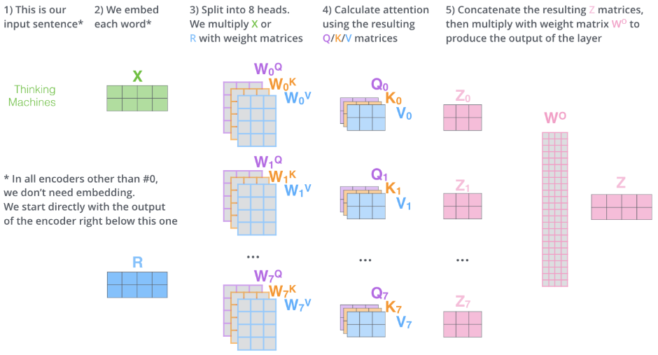

# Transformer（Google 机器翻译模型）

## 1. Introduction

&emsp;&emsp;Transformer模型最早是由Google于2017年在“Attention is all you need”一文中提出，在论文中该模型主要是被用于克服机器翻译任务中传统网络训练时间过长，难以较好实现并行计算的问题。后来，由于该方法在语序特征的提取效果由于传统的RNN、LSTM而被逐渐应用至各个领域，如GPT模型以及目前Google最新出品的新贵Bert模型等。相较于传统的RNN、LSTM或注意力集中机制，Transformer模型已经抛弃了以往的时序结构（这也是其为何能够很好的并行，且训练速度较快的原因），更准确的来说其实际上是一种编码机制，该编码同时包括了语义信息（Multi-Head Attention）和位置信息（Positional Encoding）。（其实机器翻译问题某种程度上可以看作是编码问题，即将一种语言编码为另一种语言，统计机器翻译的核心思想）。下面详细介绍该模型。

## 2. Model Structure

&emsp;&emsp;对于机器翻译这类Seq2Seq问题，该模型从整体结构来看仍使用了Encoder-Decoder框架。而其Encoding component由6个encoder共同堆叠而成，而每个Encoder中又包括Self-Attention和Feed Forward Neural Network两层网络结构。Decodeing component的组成基本如此，只不过在Self-Attention和Feed Forward间添加了一层Encoder-Decoder Attention用于关注Encoder的编码信息（与Encoder-Decoder的C向量类似）。其结构如下所示：

 
图1. 模型结构

&emsp;&emsp;现在具体分析模型的内部细节。

### 2.1 Encoders

&emsp;&emsp;（1）Self-Attention

&emsp;&emsp;对于encoder端的的输入信息首先我们将文本字符进行编码为向量（512维）（Embedding操作），然后送入Self-Attention层。在Self-Attention层中对于每一个Embedding向量&X&，网络定义三个矩阵$W^Q、W^K、W^V$（其中矩阵的维数为64，经过计算后维度大大减小，计算复杂度明显降低），分别对每个输入计算三个向量：queriess、keys and values，以得到输入句子中的每个词与其他词之间的大分，以确定在某个位置编码特定单词时，应该把将少注意力集中于输入句子的其他部分。

$$
Q=X*W^Q\\
K=X*W^K\\
V=X*W^V\\
Z=softmax(\frac{Q*K^T}{\sqrt{d_k}})*V\tag{}
$$

 
图2. self attention操作

&emsp;&emsp;注意到矩阵$Q、K、V$中的每一行即包含了每一个单词的信息，而通过矩阵间的运算我们能和好的融合每个输入单词间潜在的语义信息，最后经过oftmax操作得到此位置上每个单词被关注程度的打分（权重），其中除以\sqrt{d_k}$，$d_k$取较大值，防止$Q*K^T$较大，进入Softmax饱和区。最后$Z$的计算即为简单的加权求和。从这里我们可以明显看出此时的Attention机制已经不同于之前的操作，这里主要是根据各词向量间的矩阵运算实现Self-Attention（输入句子中各个词向量间的相互运算，不涉及输出，故为"Self"），通过Self-Attention其实网络学习到的是句法语义结构。

&emsp;&emsp;（2）Multi-header attention

&emsp;&emsp;该文章在Self-Attention的基础上进而设计了Multi-header attention以提高网络的性能。即将多个Self-Attention得到的$Z$矩阵进行concat的操作然后融合。具体来说文中主要利用了8个head进行拼接，然后进行矩阵乘法运算，融合信息。如下：

$$
Concat(Z_0,Z_1,...,Z_7)*W^o=Z\tag{2}
$$

 
图3. Multi-header attention结构

&emsp;&emsp;相较于Self-Attention更多的关注于个单词于其他单词间的联系而言，通过Multi-header attention机制扩展了模型对句子不同位置关注的能力同时扩展了模型的“表征子空间”。

&emsp;&emsp;（3）Positional Encoding

&emsp;&emsp;上述无论是Self-Attention，又或是Multi-header attention结构其本质上都是词与词间的相互计算，即词袋模型，而未对每个词的位置先后顺序进行建模。为克服这一缺点文中引入位置编码。其具体操作时在Encoder的底端Embedding对应位加上位置编码（维度与embedding一致，512，以使得求和可行）。其中位置编码可以由网络学习而来，亦可以通过设计编码函数进行生成。文中作者使用正弦曲线生成编码，以使得模型对不同输入句子长度的编码具有扩展性。

 
图4. 位置编码操作

&emsp;&emsp;（4）The Residuals

&emsp;&emsp;在每一个Encoder结构中，作者还设计了Normalize操作（即加和完成后即对其进行Normalization）和残差结构（因该是考虑到6个Encoder网络较深，防止梯度消失），如下图所示。

 
图5. 残差结构

&emsp;&emsp;最终网络的Encoders端如下图所示：

 
图6. Encoders结构

### 2.2 Decoders

&emsp;&emsp;综上所述，由Encoders端产生的$K、V$矩阵将送入至Decoders端，同时Decoders端结合上一步的翻译结果共同给出此时的翻译结果，而稍与Encoder不同的是，其self-attention layer将只关注前文信息而将后文输出置为-inf。最后，Decoder stack外接一个Linear和Softmax Layer，将向量对应为最后的翻译单词。其中linear为全连接层，其维度即为翻译目标语言语料库包含所有的次数目。再外接Softmax层即可得到每一输入词（假设中文）翻译为另一种语言（英文）中每一个词的概率。

 
图7. linear-softmax结构

&emsp;&emsp;Decoders的具体翻译过程如下图所示：

 

图8. Decoders翻译过程

 
图9. Encoder-Decoder连接结构

&emsp;&emsp;至此已经介绍完Transformer模型，毫无疑问相比于传统的RNN、LSTM结构，Transformer模型通过个词向量间的矩阵计算，拥有更强大的特征提取能力，且更容易实现并行。对于其是否能够真正颠覆传统的网络模型，我们仍需不断关注。

## Reference

[[1] Vaswani A , Shazeer N , Parmar N , et al. Attention Is All You Need[J]. 2017.](https://arxiv.org/pdf/1706.03762.pdf)
