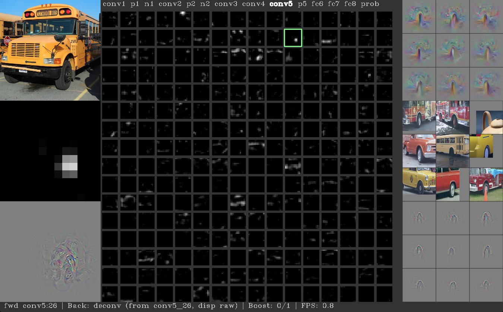

# Universal Language Model Fine-tuning for Text Classification

## Introduction

&emsp;&emsp;随着计算机技术的飞速发展，数据的规模与形式呈“爆炸式”的增长，而各种模态的数据中均蕴含了大量的信息，因此数据挖掘技术在这样一个数值化、信息化的时代则显得尤为重要。如股市和安全领域社会舆情的监控和公共事件的检测（特朗普与希拉里总统竞选中，所有的主流媒体和专家智库无一例外预测希拉里将最终获胜，而人工智能结合Twitter、Facebook等大数据却分析得出特朗普有可能赢得最后选举，事实证明数据挖掘技术存在巨大的价值）、电子商务平台中用户观点挖掘和倾向性分析等。而上述的这些数据的模态多以文本的形式呈现，文本数据挖掘技术至2000年开始迅猛发展，现已成为自然语言处理和数据挖掘交叉领域的热点方向，而中情感分析（Sentiment analysis）为text mining的基本问题。

&emsp;&emsp;Text data mining本质上可以看做回归问题（1-10，数字的大小表示情感的强烈程度）或分类问题（二分类：positive or negative，多分类：positive、negative and neural），早期则是以模式识别中的SVM、最大熵、朴素贝叶斯等模型为主。近年来深度学习技术的强势崛起，以Embedding技术与RNN网络最早被用于至NLP的各类问题中，然而其并不能很好的解决long-term dependencies的问题，故又发展出了长短时记忆神经网络LSTM，其在RNN的基础上引入了“门”的概念，通过“三门”控制信息的输入、输出与丢失。然而LSTM过于复杂，因此又有学者将LSTM中的输入门与遗忘门合并为更新门以简化网络结构减少参数同时保证结果的精度。然而当句子长度过长时（超过30个词）LSTM的性能也会急剧下降，因此以Encoder-Decoder为框架（解决网络输入输出长度不一需对齐的问题，如机器翻译任务）的attention mechanism应运而生，其本质上是对各个输出结果与输入序列进行加权求和，以动态调整中间编码向量$C$获得注意力，该方法有效解决了长时依赖的问题。上述模型的个时刻的输出均需要依赖上一时刻的state，因此计算速度较慢且不易并行，故Google又提出了Transform，Transform本质上是一种编码器，其输出不需依赖上一时刻的state，可以很好的并行。此外其通过self-attention编码序列各个部分的依赖关系的操作，又可以看做为句法结构分析，因此该方法在性能上获得了较大的提升。2017年到21018年ELMo、GPT以及Bert模型先后被提出，融入了大量外部信息的pre-train方法被成功应用至NLP的各个任务中（Embedding技术可以看做shallow的pre-training，而在CV领域以ImageNet为基础的预训练方法在各个任务如classification、object detection和semantic segmentation中早已取得了巨大的成功。对于NLP，pre-training为何现在才出现的原因主要有两点解释，即缺乏大量、丰富且质量较高的语料以
及NLP个任务差别较大）。详细介绍可以参考我的这篇笔记[从RNN、LSTM到Encoder-Decoder框架、注意力机制、Transformer](https://zhuanlan.zhihu.com/p/50915723)。最新实现的GPT2.0模型较Bert相比其本质上也是融入了更多的外部信息。而针对特定的Sentiment analysis领域，17到18年也出现了一些在大规模数据集上进行pre-training然后在特定数据集上达到state-of-the-art的工作，如ULMFiT、bmLSTM等。

&emsp;&emsp;ULMFiT即是利用Wikitext-103语料预训练Language Model（LB）并在sentiment analysis等6个文本分类任务上将错误率减少了18至24个点，同时在小规模数据上也获得了较好的训练结果（其精度比肩x100的数据集），另外与其他预训练模型相比其在较小的数据集上并未发生过拟合的问题。

## ULMFiT

&emsp;&emsp;迁移学习中一种常见的手段是利用预训练模型结合各类任务进行fine-tuning，以在小规模的数据集（如英文和中文语料较大而其它小语种的语料较少）中取得较好的效果同时使其他相似任务的实现更加容易，这种做法在CV中以十分常见，但在NLP中却使用的少之又少。

 
图1. Transfer Learning

&emsp;&emsp;而ULMFiT则是在AWD LSTM language model的基础上提出的预训练模型，并将其成功应用至text classification任务中达到了state-of-the-art，如下：

 
图2. ULMFiT Pre-training

&emsp;&emsp;其预训练过程主要分为3个阶段：

- 以AWD-LSTM为backbone在Wikitext-103上预训练LM；
- 在IMDB等小规模数据集（数据集较大pre-training的优势将不再明显，多次试验以及恺明rethinking ImageNet Pre-training已证明）上对LM进行fine-tune；
- Add few layers再次fine-tune使得模型满足当前任务（fine-tune两个基本手段修改当前任务满足pre-training模型，修改pre-training模型满足当前任务）；

&emsp;&emsp;Phase Ⅰ.

&emsp;&emsp;第一阶段利用AWD-LSTM（Regularizing and Optimizing LSTM Language Models）在WikiText-103(28595篇经过处理的Wikipedia文章，103 million words)上pre-training 3层LSTM。具体来说AWD-LSTM更多是一种训练方法，其主要包括两个部分：Averaged SGD和dropout操作：

&emsp;&emsp;①Averaged SGD。ASGD是指先训练模型至一定的epoch，此后再将每一轮训练的权值进行平均作为最后的权值。对于general SGD权值的更新公式为：

$$
w_{k+1}=w_k-\gamma_k\nabla f(w_k)\tag{1}
$$

&emsp;&emsp;其中$k$即为迭代次数，$w_k$即为第$k$次iteration的权值，而在ASGD中其模型的权值如下：

$$
w=\frac{1}{K-T+1}\sum_{i=T}^Kw_i\tag{2}
$$

&emsp;&emsp;上式中，$K$为迭代总次数，$T$为指定的迭代次数（$T$之后的迭代需进行平均）。式（2）即表明权值$w$为$T~K-T$次迭代权值$w$的平均值。

&emsp;&emsp;②Dropout。Dropout是指对$t-1$和$t$时刻隐层的全连接矩阵进行Dopout操作，防止过拟合。

&emsp;&emsp;Phase Ⅱ.

&emsp;&emsp;阶段二在LM进行fine-tuning，该过程仅需要对权值进行微调而不需彻底训练网络，其目的是使模型不要“忘记”之前习得的特征，对此作者设计了两个tricks；①discriminative fine-tuning，②slanted triangular learning rates。

&emsp;&emsp;①discriminative fine-tuning。discriminative fine-tuning背后的动机即为模型中不同的layers将捕获、表征不同类型的特征，如下：

 
图3. layer representation

&emsp;&emsp;如图3，shallow layers表示的特征更加具体，而deep layers表示的特征则更加抽象，在NLP网络中浅层则偏向语法信息而高层则偏向语义信息。因此浅层的layer需要较少次数的fine-tuning，而随着网络层数的增加，其需要fine-tuning的次数将不断上升，故对于不同层设计不同的学习率：

$$
\theta_t^l=\theta_{t-1}^l+\eta^l\nabla_{\theta^l}J(\theta)\tag{3}
$$

&emsp;&emsp;上式中$\eta^l$即为$l$层的学习率，在原文中作者通过指定最后一层学习率后浅层学习率在此基础上进行调整：

$$
\eta^{l-1}=\frac{\eta^l}{2.6}\tag{4}
$$

&emsp;&emsp;②Slanted Triangular Learning Rates

&emsp;&emsp;由于预训练的语料与目标语料在分布上有所差异，因此在fine-tuning阶段需要调整模型参数以适应target task，故作者提出了改进的三角学习率（STLR，triangular learning rates, Smith 2017的改进），即首先使学习率快速增长使得模型对于目标任务快速调整参数以达到suitable region，然后再缓慢下降逐渐调整使其更好的适应目标，同时使训练更加平稳：

 
图4. Slanted Triangular Learning Rates

$$
cut=\lfloor T\cdot cut\_frac \rfloor\\
p=\begin{cases}
t/cut, & \text{if t < cut}\\
1-\frac{t-cut}{cut\cdot (1/cut\_frac-1)}, & \text{otherwise}
\end{cases}\\
\eta_t=\eta_{max}\cdot \frac{1+p\cdot (ratio-1)}{ratio}\tag{5}
$$

&emsp;&emsp;上式中，$T$为总迭代次数，$cut\_frac$是学习率增加的迭代次数，$cut$是学习率减少的次数；

&emsp;&emsp;一般来说$cut\_frac=0.1,ratio=32,\eta_{max}=0.01$。

&emsp;&emsp;Phase Ⅲ.

&emsp;&emsp;阶段三为classifier fine-tuning，这里在原始的网络中新增加两层全连接层，同时加入batch norm和dropout操作，并使用ReLU作为中间层激活函数，最后经过softmax输出分类的概率分布。此外，在精调过程中作者还使用了如下策略：

- Concat Pooling

&emsp;&emsp;在第一层全连接后使用pooling操作，另外考虑到文档级的文本分类任务其关键信息可能出现在任意处且一般仅为少数关键词，因此若只使用最后一层全连接层信息将损失严重，故在满足GPU Memory的前提下作者对尽可能多的隐层进行max-,mean-pooling，并将其拼接至最后的state中。

- Gradual Unfreezing

&emsp;&emsp;Fine-tuning十分铭感，其在此过程中经常会出现过度精调而使得网络忘记先验信息的情况，出现过拟合的风险。因此作者设计gradual unfreezing fine-tuning操作，即从最后一层开始unfreez并进行精调，此后由后向前unfreez并精调所有层。

- BPTT for Text Classification (BPT3C)

&emsp;&emsp;类似于BPTT，作者设计了BPT3C以在large documents上进行模型精调，对此首先将文档分为长度为$b$的batches，并在每个batch训练时记录mean和max池化，同时后一个批次参数的初始化为前一个批次的参数，这样梯度会被反向传播到对最终预测有贡献的batches。

- Bidirectional language model

&emsp;&emsp;分别训练和精调前向、后向语言模型，最终模型的输出结果则由这两个模型的预测平均值决定。两者结合后结果有0.5-0.7的提升。

## Experiments

&emsp;&emsp;通过上述操作的结合ULMFiT在小规模数据集上取得了惊人的效果，如下：

 
图5. IMDB sentiment analysis task

&emsp;&emsp;从上图可以明显看出，当样本数量较少时ULMFiT的优势尤为明显，其仅通过100个样本就能达到未经pre-training20k样本的精度。

&emsp;&emsp;在自让语言处理中pre-training的工作相比CV领域出现的较晚，这一方面是由于其缺乏大规模高质量的数据，另一方面是因为NLP的各种任务差别较大。然而随着Bert的出现，NLP各项任务的记录被逐一刷新，毫无疑问融入更多的外部信息对于精度的提高有着显著的影响，然而数据的准备与训练需要大量的时间成本和算力，这将成为各个互联网寡头间的“军备竞赛”，而对于我们来说跟多的则是要探究如何将先验知识信息更加有效的融入至网络中，而知识图谱似乎给出了一定的解决方案。

## Reference

[[1] 许维. NLP 的巨人肩膀（下）：从 CoVe 到 BERT. PaperWeekly](https://www.jiqizhixin.com/articles/2018-12-17-17)

[[2] YASHU SETH. Understanding the Working of Universal Language Model Fine Tuning (ULMFiT). LET THE MACHINES LEARN](https://yashuseth.blog/2018/06/17/understanding-universal-language-model-fine-tuning-ulmfit/)

