# 集成学习中的XGBoost与Random Forest（随机森林）

&emsp;&emsp; 在Boosting、Bagging这两类典型的集成学习算法的代表中其基学习均为决策树模型（如XGBoost、AdaBoost、随机森林等），因此我们首先简单介绍决策树模型。

## 1. 先从决策树讲起

&emsp;&emsp;决策树算法簇中著名代表ID3模型最早由昆兰（Quinlan）与1979年整理提出，1986年Machine Learning创刊邀请，ID3算法在其处女刊上重新发表并掀起了决策树研究的热潮。作为10大经典算法之一，至今决策树仍在许多模型中广泛应用。这里以陈天奇XGBoost sliders中的Decision Tree为例，进行简单介绍。

&emsp;&emsp;假设Petter家有五口人，现在要估计谁会每天玩电脑游戏。我们构建两颗决策树如下图所示。

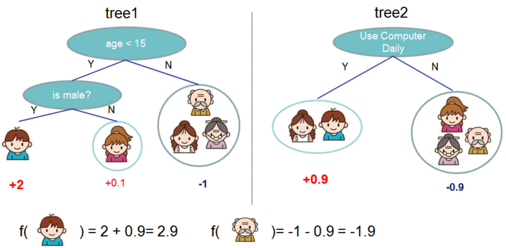
 
图1.决策树模型

&emsp;&emsp;如上图所示，我们分别以年龄、性别、是否每天使用电脑为例构建两棵决策树。并记小于15岁的男性得2分，小于15岁的女性得0.1分，大于15岁无论性别均记-1分。此外，每天使用电脑记0.9分，否则记-0.9分。

&emsp;&emsp;因此有：
 
f(Petter)=2+0.9=2.9
 
f(Sister)=0.1+0.9=1
 
f(grandpa&grandma&ma)=-1-0.9=-1.9

&emsp;&emsp;从上式分析可知，Petter每天玩电脑游戏的可能性最大。可是有人要问了对于二分类问题，如果最后计算结果是数值（概率），如何将其转换为0，1标签呢？这里我们引入Logistic函数即可解决。

### 1.1 信息熵、信息增益、基尼系数

&emsp;&emsp;以上例子可以清楚看出决策树是一种深度优先的算法，其主要采用“分而治之”的思想，即通过选择不同的属性指标，并将其以某种方式组合，从而实现样本的分类。一般我们希望通过尽可能少的指标组合来竟可能的区分样本，即希望决策树的分支结点包含的样本尽可能属于同一类别，结点的“纯度”越来越高。为了量化纯度的和纯度提升的大小，我们定义信息熵、信息增益和基尼系数来直观反映。

#### 1.1.1 信息熵

&emsp;&emsp;信息熵（information entropy）：反映集合纯度大小的指标，记为Ent(D)。
$$
Ent(D)=-\sum_{k=1}^{|y|}p_klog_2p_k\tag{1.1}
$$
&emsp;&emsp;上式中：D为样本集合；
 
&emsp;&emsp;&emsp;&emsp;&emsp;&emsp;$p_k$为第k类样本所占比例；

&emsp;&emsp;其中Ent(D)的越小，则集合D的纯度越高。Ent(D)的最小值为0，最大值为$log_2|y|$。并约定，若p=0，则$plog_2|y|=0$。

（熵的定义原本来自物理热力学中的定义，即反映体系的混乱程度的物理量。后来被广泛应用于化学、数学、通信、天文、生命科学等各个领域。信息熵（香农熵）这一理论最早由信息论之父C.E.Shannon在1948年发表的论文"A Mathematical Theory of Communication"中提出,主要用于反映整个系统平均消息量，在数学上用每一事件发生的概率P与每一事件所包含的讯息$-log_2p$乘积的总和表示，即$Ent(D)=-\sum_{k=1}^{|y|}p_klog_2p_k$。从式中可以看出，信息熵满足连续性、对称性、极值性和可加性。）

#### 1.1.2 信息增益

&emsp;&emsp;信息增益(information gain)：反映集合纯度提升大小的指标，记为Gain(D,a)。
$$
Gain(D,a)=Ent(D)-\sum_{v=1}^v\frac{|D^v|}{|D|}Ent(D^v)\tag{1.2}
$$
&emsp;&emsp;上式中：$|D^v|$为属性a取值为v时，集合D所包含的样本。

&emsp;&emsp;$\frac{|D^v|}{|D|}$可以看做对信息熵Ent(D^v)的加权，即认为某一个属性值包含的样本数目越多，该属性值影响越大，分支结点的影响越大。一般而言，信息增益越大，则意味着用属性a划分所获得“纯度”提升越大。ID3决策树学习算法就是以信息增益为准则来划分属性。

&emsp;&emsp;实际中，信息增益可能会对取值数目较多的属性有所偏好，这将有可能导致模型过拟合，即模型的泛华能力受到影响（可能某些结点只包含一个样本），为缓解这种影响，我们定义信息增益率。

&emsp;&emsp;信息增益率(gain ratio)：Gain_ratio(D,a)
$$
Gain_ratio(D,a)=\frac{Gain(D,a)}{IV(a)}\tag{1.3}
$$
$$
IV(a)=-\sum_{v=1}^V\frac{|D^v|}{|D|}log_2\frac{|D^v|}{|D|}\tag{1.4}
$$
&emsp;&emsp;其中IV(a)称为属性"a"的固有值，属性a的可能取值数目越多（V越多），IV(a)的值通常也会越大。

&emsp;&emsp;然而信息增益率通常会对取值数目较少的属性有所偏好,因此一般我们首先从候选的划分属性中找出信息增益高于平均水平的属性，然后在从中选择增益率最高的属性。著名的C4.5决策树即采用“增益率”来选择最有划分属性。

#### 1.1.3 基尼系数

&emsp;&emsp;基尼值(Gini)
$$
Gini(D)=\sum^{|y|}_{k=1}\sum_{k'\neq k}p_k^2=1-\sum_{k=1}^{|y|}p_k^2\tag{1.5}
$$
&emsp;&emsp;Gini可以直接反映数据集D的“纯度”，直观上看Gini(D)反映了从数据集D中随机抽取两个样本，其类别不一致的概率（$1-p^2$）。因此基尼值越小，则表明数据集D的纯度越高。同理参照信息增益定义基尼系数。

&emsp;&emsp;基尼系数(Gini index)
$$
Gini_index(D,a)=\sum_{v=1}^V\frac{|D^V|}{|D|}Gini(D^v)
$$
&emsp;&emsp;因此，在选择属性集合A时，一般使基尼指数最小。上述的信息增益及增益率均只能处理离散的数据分类问题，Gini index的引入可以解决属性为连续数据的分类问题。具体做法为将每一连续类型属性按取值大小排序，并一一二分，计算其Gini index选择最优的划分，其构建的决策树为二叉树，该方法计算量较大。其中CART决策树即以Gini index划分属性集，之后的XGBoost也均采用了基尼系数作为划分准则。

### 1.2 预剪枝  && 后剪枝

&emsp;&emsp;在属性划分时，为防止过拟合的发生，我们一般采用剪枝策略剪出冗余枝节。其一般分为预剪枝和后剪枝。

表1. 西瓜数据集训练集与测试集表
 
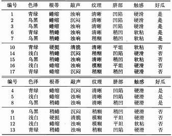

&emsp;&emsp;参考表1，建立决策树模型，如下。

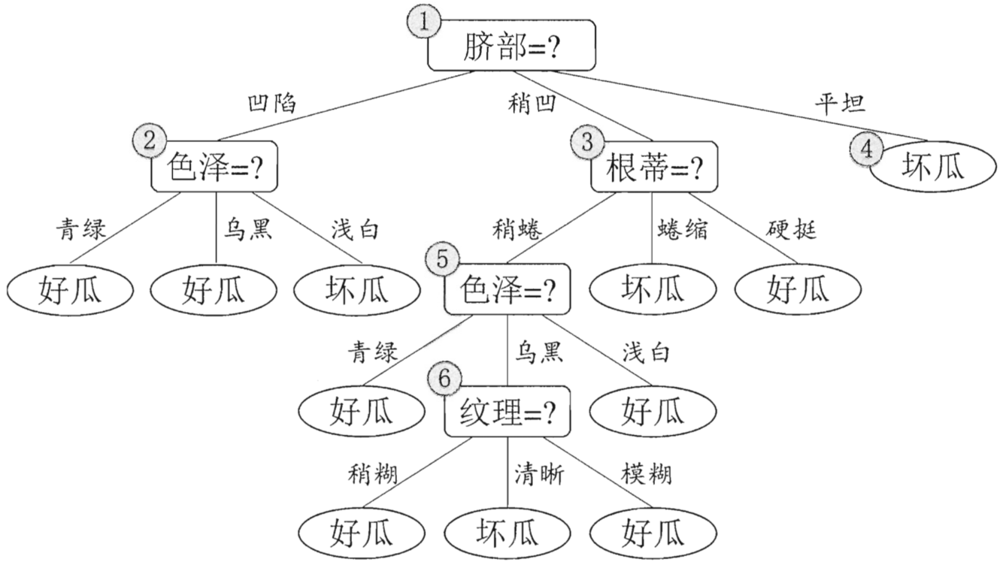
 
图2.未剪枝决策树图

#### 1.2.1 预剪枝

&emsp;&emsp;预剪枝：基于“贪心”思想，在决策树构建的同时进行剪枝操作，有效防止了过拟合，同时有效减少了时间和计算成本的开销。

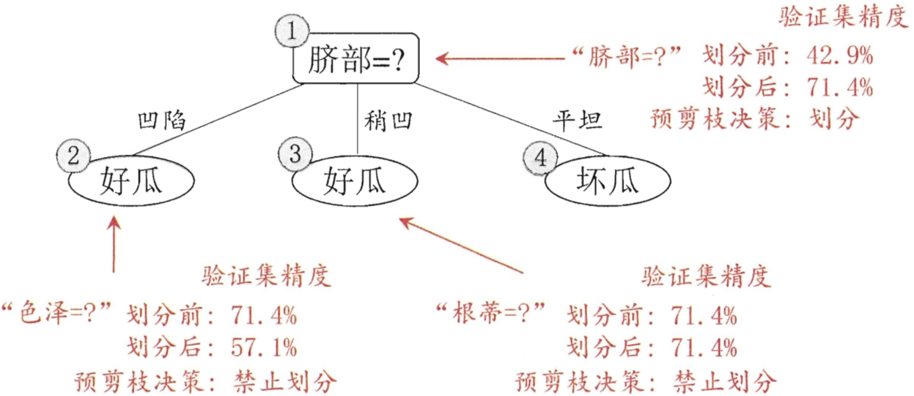
 
图3.决策树预剪枝图

#### 1.2.2 后剪枝

&emsp;&emsp;后剪枝：在决策树构建完成后至底向下进行剪枝操作，一般情况下后剪枝与预剪枝相比，其欠拟合风险一般较小且泛化性能往往优于预剪枝决策树。然而后剪枝操作需要在决策树构建完成后进行，所以其训练时间开销要远大于预剪枝。

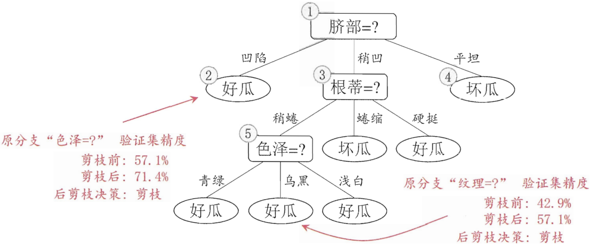
 
图4.决策树模型

（更多有关剪枝操作的相关知识就不在此详细介绍了，若需深入了解请查阅参考文献。）

## 2. 集成学习（Boosting && Baggging）

&emsp;&emsp;集成学习在最初的研究中其出发点主要是关注弱学习器（一般可以认为弱学习是指其分类准确率略高于随机猜测的分类器，即对于二分类问题弱学习器的准确率略高于50%）。然而，在实际情况中我们通常希望利用较少的分类器获得较高的准确率，因此一般利用较强的分类器进行集成。集成学习的一般模型结构如下图所示。

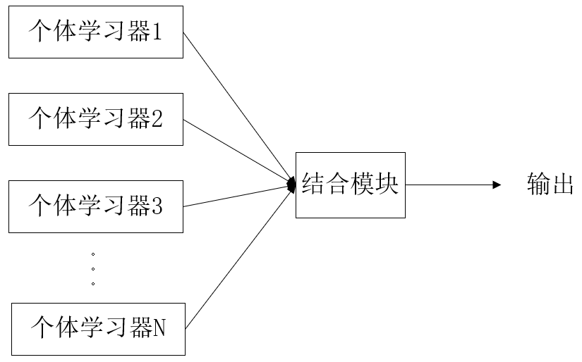
 
图5.集成学习示意图

### 2.1 同质学习 && 异质学习

&emsp;&emsp;针对个体学习器的不同可以分为同质学习和异质学习。

（1）同质学习：个体学习器类型相同。如分类器全为C4.5决策树或神经网络等。

（2）异质学习：个体学习器的类型不同。如分类器类型既包括有决策树同时又包括有神经网络等（对于分类问题，较多情况下采用Stacking，根据多个异质学习器即初级学习器结果，利用次级学习器完成分类）。

&emsp;&emsp;一般情况下，由于不同类型分类器的数学理论、思想和工作机制往往不同，因此很难全面比较分类器性能的好坏，故集成学习大多是研究同质学习。然而在实际中，我们也经常将多个不同的分类结果较好的异质学习器的最终分类结果进行集成，以实现分类结果精度的提高（一般情况下将分类准确率较高的异质学习器进行集成时，其最后的准确率往往能获得一定的提高）。这主要是因为，不同类型的分类器由于其分类机理不同，将其结合时其结果往往能相互补充。（如根据embedding的思想，先构建DNN学习特征向量，在将其作为树分类器的特征输入以提高精度）

&emsp;&emsp;针对结合策略的不同，主要可以分为平均法、投票法和学习法。

&emsp;&emsp;平均法（回归问题）：平均法包括简单平均和加权平均。简单平均是指将各学习器的分类结果取平均，此时个分类器权值相等，即各分类器的重要程度相同。加权平均各分类器的权值往往通过学习所得，如AdaBoost，准确率较高的分类器，其权值一般也较大。然而，由于数据的不充分或噪声的影响，大规模集成时较易出现过拟合的现象。因此，一般而言当个体分类器性能相差较大时，宜采用加权平均法，而个体分类器性能相差不大时，简单平均法往往效果较好。

&emsp;&emsp;投票法（分类问题）：投票法包括绝对数投票法、相对多数投票法和加权投票法。绝对数投票法是指当得票数超过一定阈值时则预测为该标记（例如投票数超过半数时则记为正类，否则为负类）。相对多数投票法即为少数服从多数。加权投票法与加权平均法类似，

&emsp;&emsp;学习法（Stacking）：学习法是指利用另一个学习器将分类器结果进行结合，这里个体学习器可称为初级学习器，而将结合学习器称为次级学习器或元学习器。其中Stacking为学习法的典型代表。在实际中，一般利用交叉训练产生次级学习器的训练集以减缓过拟合的影响。根据相关研究表明，将初级学习器的输出类概率作为次级学习器的输入属性，采用多响应线性回归（Multi-response Linear Regression, MLR）作为次级分类器效果较好。

### 2.2 串行集成 && 并行集成

&emsp;&emsp;针对集成方法的不同，主要可以分为并行集成和串行集成。

（1）串行集成：个体学习器间存在强依赖的关系，后一个学习器的生成需依赖前一个学习器的结果。其代表算法为Boosting，包括AdaBoost、GBDT、XGBoost等。

（2）并行集成：个体学习器间不存在依赖关系，可以同时训练多个学习器，适合分布式并行计算。其代表算法为Bagging、随机森林（有的教材将随机森林单独作为一类）。

&emsp;&emsp;集成学习追求“好而不同”，即每个个体分类器在保证较高的分类准确率的同时，又能有较大的差异，这样集成结果能更好的反映样本的整体特征。事实上近年来KDD&&Kaggle上有关数据挖掘的竞赛题冠军组无一例外采用了集成学习的方法，其有些取胜算法使用超过几十种模型的集成。更多有关集成学习的相关知识可以参阅周大佬的"Ensemble Methods: Foudations and Algorithms"。

&emsp;&emsp;这里假设有k个基学习器，每个学习器的分类误差为$\epsilon_i$（反映每个分类器的准确度）,该误差服从均值为$E(\epsilon_i)=0$，方差为$E(\epsilon_i^2)=v$,协方差为$E(\epsilon_i\epsilon_i)=c$（协方差即反映各个分类器的差异）的多维正态分布，则集成模型的分类平方误差期望为：

$$
E[(\frac{1}{k}\sum_i\epsilon_i)^2]=\frac1{k^2}E[\sum_i(\epsilon^2_i+\sum_{j\neq i}\epsilon_i\epsilon_j)]=\frac1{k^2}E[\sum_i\epsilon_i^2]+\frac1{k^2}E[\sum_i\sum_{i \neq j}\epsilon_i\epsilon_j]=\frac1{k^2}kv+\frac1{k^2}\frac{k-1}kc=\frac1kv+\frac{k-1}kc\tag{2.1}
$$

(补充知识：$(a_1+a_2+...+a_n)=\sum_{i=1}^na_i^2+\sum_{i=1}^n\sum_{j \neq j}^na_ia_j$)

&emsp;&emsp;从上式可以看出，一般情况下，在基学习器差异较大时，即分类错误完全不相关（c=0）时,可以认为集成平方误差的期望随着集成规模的增大而线性减少，即集成学习往往比单个分类器的效果要好，且随这个体学习器分类差异的增加，集成学习准确度也将增加。（理想情况下，当$k$趋于无穷且基学习器相互独立时其误差将趋于0，然而在实际情况下基学习器不会完全独立，故其误差不会为0）

&emsp;&emsp;这里我们先介绍Bagging与随机森林。

### 2.3 Bagging

&emsp;&emsp;Bagging是并行集成学习的著名代表，其主要思想是通过拔靴法随机抽取多个样本集同时训练多个分类器，进行集成。如下图所示。

 
图6.bagging示意图

&emsp;&emsp;其中随机样本集的生成一般采用拔靴法即自助采样法（有放回的随机采样），当重复进行多次采样操作后，总有36.8%的样本没有被抽取到，我们可以将其作为验证集。这就其怪了，为什么进过多次有放回的采样操作后会有样本没有被抽取到，而且居然占36.8%的比例，如此之高。不急，我们利用极限的方法进行证明。

&emsp;&emsp;假设共用n个样本，同时进行n次采样操作，则有：

$$
lim_{n→-\infty}(1-\frac{1}{n})^n=lim_{n→-\infty}(1+\frac{1}{(-n)})^{-(-n)}=e^{-1}=\frac{1}{e}\tag{2.2}
$$

（回忆同济高数上册两个重要极限：$lim_{n→-\infty}(1+\frac{1}{n})^n=e$）

&emsp;&emsp;回到正题。在多个分类器得到预测结果后，对于分类问题可以采用集成法得到最终结果，而对于回归问题可采用平均法得到最终结果，其算法步骤如图7所示。

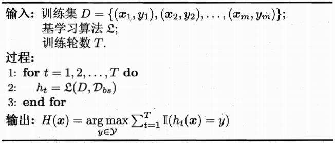
 
图7.Bagging算法

&emsp;&emsp;Bagging算法效率较高，其时间复杂度与训练基学习器同阶。此外Bagging能够不经修改的适用于回归和多分类等问题。

### 随机森林（Random Forest，FT）

&emsp;&emsp; 随机森林可以看做Bagging的变体。其主要思想是在样本随机选择的同时，多棵决策树的构建过程中每棵决策树的属性的选择也随机，然后根据选择属性构建最优决策树进行集成。这样基学习器的多样性不仅来自于样本的扰动，同时还来自属性的扰动，也就是说，随机森林的随机性主要体现在两个方面：（1）样本的随机选择（2）属性的随机选择。因此随机森林最终集成的泛华性能和个体学习器的差异进一步加大。此外，由于随机森林每棵树的训练都是独立的，其并不依赖前一棵树的分类结果，因此随机森林天生就适应并行，故其训练效率和模型的泛化误差往往均优于Boosting，然而该模型的精度较低（一般情况下低于Boosting几个百分点）。

### 2.4 Boosting

&emsp;&emsp;Boosting算法簇的主要代表包括AdaBoost、GBDT、XGBoost及其改进等。其工作机制大致为：①从初始训练集中训练出一个基学习器；②根据基学习器的性能表现调整样本分布，使得分类错误的样本在后续的训练中得到更多的关注；③基于调整后的样本调整训练下一个基学习器：④重复步骤①、②直至基学习器达到指定数目；④对基学习器预测结果进行加权融合，输出。

#### AdaBoost

&emsp;&emsp;AdaBoost可以看为是“加性模型”，即基学习器的加权线性组合。

$$
H(x)=\sum^T_{t=1}\alpha_th_t(x)\tag{2.3}
$$

$$
H_t(x)=H_{t-1}(x)+\alpha_th_t(x)\tag{2.4}
$$

&emsp;&emsp;其损失函数为指数函数。

$$
l_{exp}(H|D)=E_{x～d}[e^{-f(x)H(x)}]\tag{2.5}
$$

&emsp;&emsp;主流的损失函数主要包括有以下几种：

 - 绝对值损失函数:$L(\theta;X,Y)=|Y-f(X,\theta)|$，由于该损失函数存在绝对值，求导不易，故很少使用。
 - 平方损失函数：$L(\theta;X,Y)=(Y-f(x,\theta))^2$,广泛应用于回归问题中，如最小二乘、线性回归。
 - 对数损失函数：$L(Y,P(Y|X))=-log(Y|X)$，一般用于做极大似然估计，其可以刻画分布间的相似程度。如Logistic回归。
 - 交叉熵损失函数：$L(\theta;X,Y)=-\sum_{i=1}^ny_ilogf_i(X,\theta)$，交叉熵反映两函数分布的相似程度，其等价于KL散度。一般其会与Softmax函数配合使用，主要应用于多分类问题。
 - 指数损失函数：$L_{exp}(H|D)=E_{x～d}[e^{-f(x)H(x)}]$，主要用于集成学习中，如AdaBoost。
 - 铰链损失函数：$L(\theta;X,Y)=max(0,1-(Y-F(X,\theta)))$，应该用于SVM支持向量机中。

&emsp;&emsp;AdaBoost算法流程与Boosting算法簇流程描述大致相似，即首先初始化样本权值分布，训练初始基学习器，并根据学习器分类结果赋予其权值，同时调整样本分布权值。然后根据样本分布不断训练基学习器，并不断调样本分布权值。最后，根据多个基学习器的权值将各个分类器的结果加权输出。其算法流程如下：

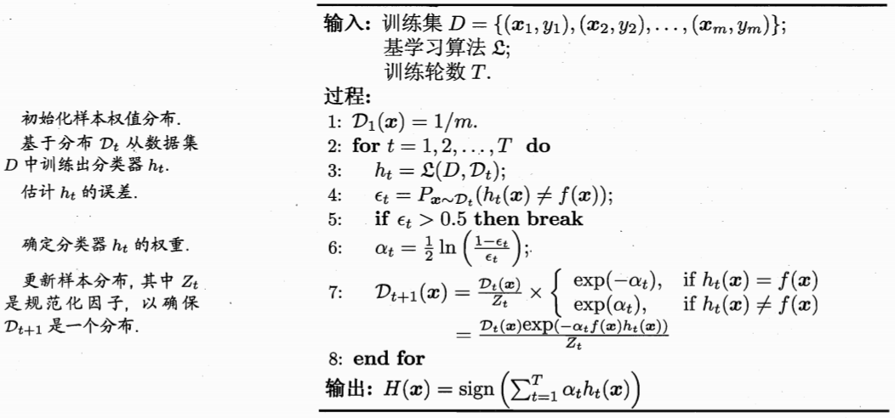
 
图8.AdaBoost算法

## 3. GBDT && XGBoost

### 3.1 GBDT（Gradient Boosting Decision Tree, 梯度提升决策树）

&emsp;&emsp;GBDT是以分类回归树（CART）为基本分类器的Boosting算法，该集成方法也采用加法模型（基函数的线性组合），如下式所示：

$$
F(x;\beta)=\sum_{t=0}^T\alpha h_t(x;\beta)=\sum_{t=0}^Tf_t(x;\beta)\tag{3.1}
$$

&emsp;&emsp;上式中，$h_t(x;\beta)$为CART提升树；
 
&emsp;&emsp;&emsp;&emsp;&emsp;&emsp;$\alpha$为每棵树所占权重；
 
&emsp;&emsp;&emsp;&emsp;&emsp;&emsp;$\beta$为每棵树的参数。

&emsp;&emsp;对于上式中的加法模型F，我们通过最小化损失函数求解最优$F^*$，即求解最优参数$\alpha、\beta$。

$$
F^*=\arg　min\sum_{i=0}^NL(y_i,F(x_i;\beta))=min\sum_{i=0}^NL(y_i;F_{n-1}(x_i;\beta)+\alpha h_t(x;\beta))\tag{3.2}
$$

&emsp;&emsp;由于GBDT为CART树的集成，该问题是一个NP难题，因此我们通过贪心算法，根据梯度迭代求解，即梯度提升算法。此方法与最速下降法近似，其关键是利用损失函数的负梯度的当前取值

&emsp;&emsp;对于回归问题，其梯度提升算法损失函数选择为平方误差损失函数，对于分类问题则可以考虑指数损失函数或交叉熵损失函数。这里我们以平方损失函数为例，如下所示：

$$
L(y,F)=L(y,F_{N-1}+f_t)=\sum_{i=0}^N(y_i-(F_{N-1}(x_i)+f_t(x_i;\beta)))^2\tag{3.3}
$$

- Step1.　求解$\beta$参数，学习第t棵树$h_t$；

$$
\beta^*=\arg　min\sum_{i=0}^NL(y_i,F(x_i;\beta))=min\sum_{i=0}^N(y_i-(F_{N-1}(x_i)+f_t(x_i;\beta_i)))^2=min\sum_{i=0}^N(y_i-F_{N-1}(x_i)-f_t(x_i;\beta_i))^2\tag{3.4}
$$

&emsp;&emsp;这里记$r_i=y_i-F_{N-1}(x_i,\beta)$为残差$r_i$，则有$\beta^*=\arg　min\sum_{i=0}^N(r_i-f_t(x_i;\beta))^2$。GBDT算法的关键即利用$-[\frac{\partial L(y,F(x_i))}{\partial F(x_i)}]_{F(x)=F_{m-1}(x)}$作为残差$r_i$的近似（对于平方损失函数其损失函数的负梯度在当前模型的值即为残差）。因此有：

$$
\beta^*=\arg　min\sum_{i=0}^N(-[\frac{\partial L(y,F(x_i))}{\partial F(x_i)}]_{F(x)=F_{m-1}(x)}-f_t(x_i;\beta))^2\tag{3.5}
$$

&emsp;&emsp;因此有$f_t(x_i,\beta)=\alpha h_t(x_i,\beta)$。

- Step2.　求解$\alpha$参数；

$$
\alpha^*=\arg　min\sum_{i=0}^NL(y_i;F_{n-1}(x_i;\beta)+\alpha h_t(x;\beta^*))\tag{3.6}
$$

&emsp;&emsp;因此有，$f_t=\alpha^*h_t(x,\beta^*)$。

- Step3.　更新模型，循环迭代；

&emsp;&emsp;更新模型，$F_t=F_{t-1}+f_t$，循环迭代。

&emsp;&emsp;GBDT算法如下图所示：

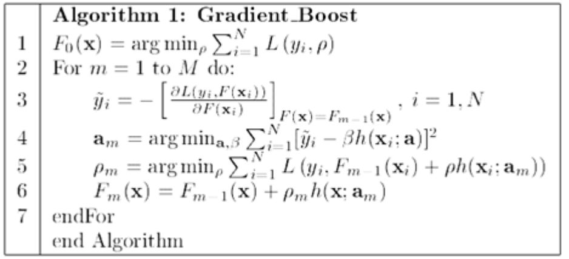
 
图8.GBDT算法流程

### 3.2 XGBoost

&emsp;&emsp;XGBoost与GBDT相比，其主要区别在于：①误差函数考虑二阶泰勒展开，因此收敛更快；②损失函数中引入正则化项，对树的复杂程度进行惩罚，以避免过拟合的发生。

&emsp;&emsp;XGBoost也为线性加法模型，采用增量学习构建K棵CART树。这里我们假设给定数据集$D={(x_i,y_i)}$，其数学模型如下所示：

$$
\hat y=\phi(x)=\sum_{k=1}^Kf_k(x_i),\quad f_k\in F\tag{3.7}
$$

&emsp;&emsp;其中,$f_k$为CART分类回归树，$F$为假设空间。则有：

$$
F=\lbrace f(x)=w_{q(x)} \rbrace(q\, :\Bbb R^m \rightarrow T,w\in\Bbb R^T)\tag{3.8}
$$

&emsp;&emsp;上式中，$q(x)$表示将样本$x$分配至叶子节点上，$w$表示该叶子节点的得分，因此$w_{q(x)}$即为该样本的预测值。

&emsp;&emsp;XGBoost目标函数如下所示：

$$
L(\phi)=\underbrace{\sum_il(\hat y_i,y_i)}_{(1)}+\underbrace{\sum_k\Omega(f_k)}_{(2)}\tag{3.9}
$$

&emsp;&emsp;上式中，第一项为一般损失函数（平方误差、交叉熵、指数等）代表经验风险最小化，第二项为正则化项，代表结构风险最小化。其中正则化项可以理解为对回归树复杂程度的惩罚，以缓解过拟合的发生，其作用相当于对决策树进行剪枝操作。

&emsp;&emsp;对于正则化项的理解可以考虑一下几方面：

&emsp;&emsp;①缓解偏差-方差窘境（如下图所示）。即当模型训练不足时，模型拟合能力不够，此时误差主导泛化误差。而随着模型训练的加深，此时，模型的拟合能力增加，方差主导泛化误差。若模型的拟合能力过强，学习器学习到一些模型特有特征，则当数据发生稍许扰动时，预测结果发生剧烈变化，导致过拟合现象的发生。

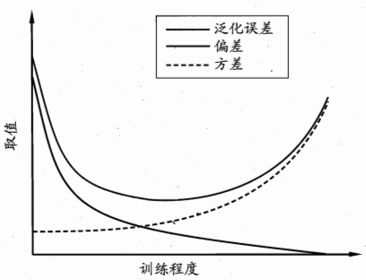
 
图9.偏差方差窘境

&emsp;&emsp;②Bayes角度，引入先验知识。例如，对于二范数，可以认为约束模型参数服从高斯分布。

&emsp;&emsp;③奥卡姆剃刀原理（Occam's razor）。在所有可能选择的模型中，能够很好的解释已知数据并且十分简单的模型应优先选择。

#### 3.2.1 目标函数中的各类范数

（这里荡开一笔单独讲讲范数）

&emsp;&emsp;对于统计机器学习算法一般为缓解过拟合现象的发生需要在进行正则化操作,通过正则化以偏差的增加换取方差的减小。最常见的方法即为在损失函数中引入矩阵范数，以对模型的复杂程度做出惩罚，其目标函数一般如下式所示：

$$
min\quad \tilde J(\theta;X,y)=\underbrace{J(\theta;X,y)}_{(1)}+\underbrace{\alpha \Omega(\theta)}_{(2)}\tag{3.10}
$$

&emsp;&emsp;上式中，第一项即为经验风险，第二项即为正则化项。其中$\alpha\geq0$，为调整两者之间关系的系数。当$\alpha=0$时，则表示无正则化项，$\theta$越大则表示对应正则化惩罚越大（类比式（3.9））。

- **$L^2$范数正则化**

$$
L_2:\qquad \Omega(\theta)=\frac12||w||^2_2\tag{3.11}
$$

&emsp;&emsp;这里我们假设模型的偏置参数均为0，则参数$\theta$即为$w$，因此其目标函数为：

$$
\tilde J(w;X,y)=J(w;X,y)+\frac{\alpha}{2}w^Tw\tag{3.12}
$$

&emsp;&emsp;对上式求其梯度有：

$$
\nabla_w\tilde J(w;X,y)=\nabla_wJ(w;X,y)+\alpha w\tag{3.12} 
$$

&emsp;&emsp;使用梯度下降法更新权重$w$，则$w$将向负梯度方向收敛，如下：

$$
w\;\leftarrow\;w-\epsilon(\nabla_wJ(w;X,y)+\alpha w)=(1-\epsilon\alpha)w-\epsilon\nabla_wJ(w;X,y)\tag{3.13}
$$

&emsp;&emsp;从中可以看出每次权值$w$更新时都将乘以$(1-\epsilon\alpha)$，该常数因子小于0，即权重将会逐渐收缩，趋近于0。

&emsp;&emsp;进一步地，这里令$w^*=arg\,min_wJ(w)$（将$J(w;X,y)$简记为$J(w)$）,即$w^*$为损失函数$J(w;X,y)$取得最小训练误差的权值。并在$w^*$的领域对损失函数$J(w)$做二次近似,记为$\tilde J(w)$，如下：

$$
\hat J(w)=J(w^*)+\frac12(w-w^*)^TH(w-w^*)\tag{3.14}
$$

&emsp;&emsp;上式中$H$为$J$在$w^*$处计算的Hessian矩阵，且该矩阵为半正定矩阵。由上述知，$w^*$为损失函数的最优解，因此$\hat J(w)$的梯度将为0，即式（3.14）对$w$求偏导为0，如下所示：

$$
\nabla_w \hat J(w)=(w-w^*)H=0\tag{3.15}
$$

&emsp;&emsp;记$\widetilde w$为最优权值$w$，将式（3.15）代入式（3.12）：

$$
\nabla_w\tilde J(\tilde w)=\alpha \tilde w+(\tilde w-w^*)H=0\tag{3.16}
$$

&emsp;&emsp;故：

$$
(H+\alpha I)\tilde w=Hw^*
$$

$$
\tilde w=(H+\alpha I)^{-1}Hw^*\tag{3.17}
$$

&emsp;&emsp;（由于Hesian矩阵为半正定矩阵，故其为实对称阵。因此有$(\tilde w-w^*)H=H(\tilde w-w^*)$）

&emsp;&emsp;当$\alpha$趋向于0时，$\tilde w$将趋近于$w$。我们将实对称Hesian矩阵$H$分解为一个对角矩阵$\wedge$和一组特征向量的标准正交基$Q$，因此有$H=Q\wedge Q^T$，代入式（3.17）,可得

$$
\tilde w=(Q\wedge Q^T+\alpha I)^{-1}Q\wedge Q^Tw^*=[Q(\wedge +\alpha I)Q^T]^{-1}Q\wedge Q^Tw^*=Q^{T^{-1}}(\wedge+\alpha I)^{-1}Q^{-1}Q\wedge Q^Tw^*=Q(\wedge +\alpha I)^{-1}\wedge Q^Tw^*\tag{3.18}
$$

&emsp;&emsp;从上式中可以看出经过正则化后，权重$\tilde w$将会沿着由$H$特征向量所定义的轴缩放未经标准化的损失函数最优解$w^*$。具体来说，我们会根据$\frac{\lambda_i }{\lambda_i+\alpha}$因子收缩与$H$第$i$个特征向量对齐的$w^*$的分量。如下图所示。

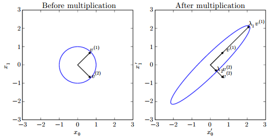
 
图10.特征向量作用效果图

&emsp;&emsp;上图为特征向量的作用效果图，这里矩阵有两个标准正交特征向量，对应的特征值分别为$v^{(1)}$和$v^{(2)}$。其中左图为所有单位向量$\mu\in\Bbb R^2$集合构成的单位圆。右图为特征值的拉伸结果。

&emsp;&emsp;由于特征向量的缩放因子为$\frac{\lambda_i }{\lambda_i+\alpha}$，故沿着特征值较大的方向（如$\lambda_i >>\alpha$）正则化影响较小。而$\lambda_i <<\alpha$将会收缩至几乎为零。因此$L^2$范数将使模型的参数趋近于0附近。

&emsp;&emsp;通过$L^2$正则化，在显著减小目标函数方向上的参数会被相对完整的保留，而对于无助于目标函数减小的方向（对应Hessian矩阵较小的特征值），其参数的改变将不会显著参加梯度，因此其在训练过程中会因正则化项而衰减至0。

&emsp;&emsp;此外，在线性回归的平方误差损失函数中引入二范数，即在原来逆矩阵的基础上加入对角阵，使得矩阵求逆可行，同时缓解过拟合的问题。而由于加入的对角矩阵，其就像一条“山岭”一样，因此，$L^2$也被称为岭回归或Tikhonov正则。

&emsp;&emsp;线性回归目标函数一般为：
$$
L(w)=(Xw-y)^T(Xw-y)
$$
$$
\nabla_wL(w)=X^T(Xw-y)=0
$$
&emsp;&emsp;固有：
$$
X^TXw=X^Ty
$$
&emsp;&emsp;即：
$$
w=(X^TX)^{-1}X^Ty
$$
&emsp;&emsp;当引入$L^2$正则项后，目标函数变为：
$$
L(w)=(Xw-y)^T(Xw-y)+\frac12\alpha w^Tw
$$
&emsp;&emsp;则：
$$
\nabla_wL(w)=X^T(Xw-y)+\alpha w^T=0
$$
$$
w=(X^TX+\alpha I)^{-1}X^Ty
$$
&emsp;&emsp;此即为岭回归。

 &emsp;&emsp;上式中第（1）项$X^TX$即为线性回归标准最小二乘项，第（2）项$\alpha I$即为正则化项，为一对角阵。

 &emsp;&emsp;另外从另一个角度理解，当$X^TX$非正定时（某些参数线性相关），其无法求逆。此时解决的方法一般包括两种：（a）通过PCA构建线性无关组，进行降维处理，删除无关特征，求逆；（b）二范数正则化，即通过增加取值较小的对角阵使得矩阵求逆可行。由于PCA方法处理后其剔除了一些贡献程度较小的特征，而二范数只是将部分无关特征权值缩放置0附近，因此二范数也被称为Soft-PCA。

- **$L^1$范数正则化**

&emsp;&emsp;$L^1$范数形式如下：

$$
\Omega(\theta)=||w||_1=\sum_i|w_i|\tag{3.19}
$$

&emsp;&emsp;如上式所示，$L^1$范数为各参数的绝对值之和。（$L^1$范数求导、优化困难，因此较$L^2$范数相比使用较少）对于，$L^1$范数其目标函数如下所示：

$$
\tilde J(w;X,y)=J(w;X,y)+\alpha ||w||_1\tag{3.20}
$$

&emsp;&emsp;其对应的梯度如下：

$$
\nabla_w\tilde J(fw;X.y)=\nabla_wJ(w;X,y)+\alpha sign(w)\tag{3.21}
$$

&emsp;&emsp;上式中，$sign(w)$为符号函数，其取值结果只与个权值$w$的正负号有关。

&emsp;&emsp;同理，这里令$w^*=arg\,min_wJ(w)$，我们可以将$L^1$正则化目标函数的二次近似解分解为关于各参数求和的形式：

$$
\hat J(w)=J(w^*)+\sum_i[frac12H_{i,i}(w_i-w_i^*)^2+\alpha |w_i|]\tag{3.22}
$$

&emsp;&emsp;对每一维$w_i$求梯度，以最小化式（3.22）。由于$W^*$为$J(w)$的最优解，因此有$\nabla_wJ(w)=0$，故：

$$
\nabla_{w_i} \hat J(w)=[H_{i,i}(w_i-w_i^*)+\alpha sign(w_i^*)]=0
$$
&emsp;&emsp;即：
$$
w_i=w_i^*-\frac{\alpha}{H_{i,i}}sign(w_i^*)
$$

&emsp;&emsp;对$w_i^*$的正负号分类讨论，则上式将等价于：

$$
w_i=sign(w_i^*)max\lbrace|w_i^*|-\frac{\alpha}{H_{i,i}},0\rbrace\tag{3.23}
$$

&emsp;&emsp;当$w_i>0$时，会有两种结果：

&emsp;&emsp;a. $w_i^*\leq\frac{\alpha}{H_{i,i}}$。此时式（3.23）的最优值为$w_i=0$

&emsp;&emsp;b. $w_i^*>\frac{\alpha}{H_{i,i}}$。此时则有$w_i=w_i^*-\frac{\alpha}{H_{i,i}}$，即$w_i$在此方向上向0收缩$\frac{\alpha}{H_{i,i}}$个距离。

&emsp;&emsp;同理，当$w_i<0$时，$w_i$也将等于0或向0收缩。

&emsp;&emsp;与$L^2$范数相比，$L^1$范数正则化使得部分参数为0。因此，$L^1$范数会产生更稀疏的解，该性质已被大量应用于特征的选择机制。著名的LASSO回归即将$L^1$范数引入至线性模型中，并使用最小二乘代价函数。通过$L^1$正则化使得部分权值为零，而忽略相应的特征。如图11所示。

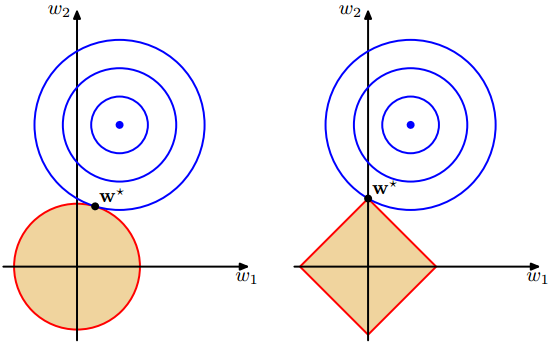
 
图11.一范数与二范数示意图

&emsp;&emsp;上图中，蓝色的圆圈表示原问题可能的解范围，橘色的表示正则项可能的解范围。而整个目标函数（原问题（损失函数）+正则项）有解当且仅当两个解范围相切。从上图可以很容易地看出，由于$L^2$范数解范围是圆，所以相切的点有很大可能不在坐标轴上，而由于$L^1$范数是菱形，其相切的点更可能在坐标轴上。因此其只有一个坐标分量不为零，其它坐标分量为零，即$L^1$的解是稀疏的。

&emsp;&emsp;$L^2$范数正则化，模型权重服从高斯分布，$L^1$范数正则化，模型参数服从各向同性的拉普拉斯分布。即$L^1$正则化项$\alpha \Omega(w)=\alpha \sum_i|w_i|$与通过MAP贝叶斯推断最大化对数先验项等价。此外，相较于$L^2$而言，采用$L^1$模型的鲁棒性较差（每次置零的权值均不相同）。

$$
log(p(w))=\sum_ilogLaplace(w_i;0,\frac1{\alpha})=\sum_ilog(\frac{1}{\frac{2}{\alpha}}(\frac{-|w_i|}{\frac{1}{\alpha}}))=\sum_ilog(\frac{\alpha}{2}\cdot(-\alpha|w_i|))\\\qquad\qquad\;=\sum_ilog(\frac{\alpha}{2})+\sum_ilog(-\alpha|w_i|)=-\alpha||w||_1+nlog\alpha-nlog2\tag{3.24}
$$

&emsp;&emsp;(拉普拉斯分布：$Laplace(x;\mu,\gamma)=\frac{1}{2\gamma}exp(\frac{-|x-\mu|}{\gamma})$)

&emsp;&emsp;由于目标函数是关于$w$的最大化进行学习，因此可以忽略$nlog\alpha-nlog2$。

- **$L^0$范数**

&emsp;&emsp;$L^0$范数如下所示：

$$
||w||_0=\#(i)\;with\;w_i\neq0\tag{3.25}
$$

&emsp;&emsp;$L^0$范数即为模型参数中不为0的数目。在实际问题中，模型一般较为复杂，参数数目较多，因此求解$L^0$范数为NP难问题，故一般不使用。

- **Frobenius范数**

&emsp;&emsp;Frobenius范数如下所示：

$$
||w||_F=(tr(w^tw))^{\frac12}=(\sum_i^m\sum_j^n|w_{i,j}|^2)^{\frac12}\tag{3.26}
$$

&emsp;&emsp;从上式可以明显看出，矩阵的Frobenius范数就是将矩阵张成向量后的$L^2$范数。（在此就不做推导了）

#### 3.2.2 XGBoost优化求解

&emsp;&emsp;其中XGBoost目标函数中的正则化项如下所示：

$$
\Omega(f)=\gamma T+\frac12\lambda||w||_2\tag{3.27}  
$$

&emsp;&emsp;上式中，$T$为叶子节点数目，用于表示树的复杂程度，$w$为叶节点分数。

&emsp;&emsp;对于XGBoost目标函数求解步骤如下所示：

&emsp;&emsp;记$t$次迭代后，模型的预测结果为$t-1$棵树的预测结果加上第$t$棵树的结果，即：

$$
\hat y^{(t)}=\hat y^{(t-1)}+f_t(x_i)\tag{3.28}
$$

&emsp;&emsp;因此其目标函数为：

$$
\it L^{(t)}=\sum_{i=1}^nl(y_i,\hat y^{(t)})+\Omega(f_t)=\sum_{i=1}^nl(y_i,\hat y^{(t-1)}+f_t(x_i))+\Omega(f_t)\tag{3.29}
$$

&emsp;&emsp;对上式在$\hat y^{(t1)}$处进行二阶泰勒展开：

$$
\it L^{(t)}\approx\sum_{i=1}^n[l((y_i,\hat y^{t-1})+l^{\prime}(y_i,\hat y^{t-1})f_t(x_i)+\frac12l^{\prime \prime}(y_i,\hat y^{t-1})f_t^2(x_i))]+\Omega(f_t)\tag{3.30}
$$

&emsp;&emsp;记$l^{\prime}(y_i,\hat y^{t-1})$为$j_i$，$l^{\prime \prime}(y_i,\hat y^{t-1})$为$h_i$，则式（3.30）为：

(考虑目标函数的一阶导数即雅克比（Jacobian）矩阵对应梯度下降法，考虑目标函数的二阶导数即海森（Hessian）矩阵对应牛顿法。然而对于海森矩阵的逆矩阵很难计算，因此在实际迭代计算中一般对其进行近似，故又会产生各种拟牛顿法，这里我们就不详细展开了，等有机会在做分享。)

$$
\it L^{(t)}\approx\sum_{i=1}^n[l((y_i,\hat y^{t-1})+j_if_t(x_i)+\frac12h_if_t^2(x_i))]+\Omega(f_t)\tag{3.31}
$$

&emsp;&emsp;这里我们回忆泰勒展开式：
 
&emsp;&emsp;一阶泰勒展开式：$f(x)=f(x_0)+f^{\prime}(x_0)(x-x_0)+Rn(x)\approx f(x_0)+f^{\prime}(x_0)(x-x_0)$
 
&emsp;&emsp;二阶泰勒展开：$f(x)=f(x_0)+f^{\prime}(x_0)(x-x_0)+\frac12f^{\prime \prime}(x_0)(x-x_0)^2+Rn(x)\approx f(x_0)+f^{\prime}(x_0)(x-x_0)+\frac12f^{\prime \prime}(x_0)(x-x_0)^2$
 
&emsp;&emsp;上式中$Rn(x)$为泰勒展开余项，其中常见的有：佩亚诺(Peano）余项、施勒米尔希-罗什(Schlomilch-Roche）余项、拉格朗日（Lagrange）余项、柯西（Cauchy）余项等。
 
&emsp;&emsp;因此对于$f(x+x_0)$其泰勒展开为：$f(x+x_0)\approx f(x)+f^{\prime}(x) x_0+\frac12f^{\prime \prime}(x)x_0^2$

&emsp;&emsp;对于式（3.31），由于$y_i,\hat y^{t-1}$为已知结果，因此$l(y_i,\hat y^{t-1})$可以计算，在优化过程中我们省略这一常数项，则有：

$$
\widetilde L^{(t)}=\sum_{i=1}^n[j_if_t(x_i)+\frac12h_if_t^2(x_i))]+\Omega(f_t)\tag{3.32}
$$

&emsp;&emsp;由式（3.8）和式（3.27）知：$f(x)=w_{q(x)}\,\;\Omega(f)=\gamma T+\frac12\lambda||w||_2$，将其代入式(3.32)有：

$$
\widetilde L^{(t)}=\sum_{i=1}^n[j_iw_{q(x_i)}+\frac12h_iw^2_{q(x_i)})]+\gamma T+\sum_{j=1}^n\frac12\lambda||w_j||_2\tag{3.33}
$$

&emsp;&emsp;这里定义每个叶子结点$j$上的样本集合为$I_j=\lbrace i|q(x_i)=j\rbrace$，对于属于相同叶子节点的样本其预测值$w_{q(x_i)}$相同，因此式（3.32）即可表示为叶子节点的累加形式：

$$
\widetilde L^{(t)}=\sum_{j=1}^n[(\sum_{i\in I_j}j_i)w_{{q(x_i)}_j}+\frac12(\sum_{i\in I_j}h_i+\lambda)w_{{q(x_i)}_j}^2)]+\gamma T=\sum_{j=1}^n[J_jw_{{q(x_i)}_j}+\frac12(H_j+\lambda)w_{{q(x_i)}_j}^2)]+\gamma T\tag{3.34}
$$

&emsp;&emsp;若树的结构已经确定，即各个节点$q(x_i)$已经确定，为使目标函数$\widetilde L^{(t)}=\sum_{j=1}^n[J_jw_{{q(x_i)}_j}+\frac12(H_j+\lambda)w_{{q(x_i)}_j}^2)]+\gamma T$取得最小值，我们可以令其导数为0，则有：

$$
\frac{\partial\widetilde L^{(t)}}{\partial w_{{q(x_i)}_j}}=0\implies w^*_j=-\frac{J_j}{H_j+\lambda}
$$

&emsp;&emsp;将$w^*_j$代入式（3.34），则有最小损失：

$$
\widetilde L^*=\sum_{j=1}^n[J_j(-\frac{J_j}{H_j+\lambda})+\frac12(H_j+\lambda)(-\frac{J_j}{H_j+\lambda})^2)]+\gamma T=-\frac12\sum_{j=1}^n\frac{J_j^2}{H_j+\lambda}+\gamma T\tag{3.35}
$$

&emsp;&emsp;因此，当树的结构确定后，我们即可通过式（3.35）寻求最优解，然而树的结构如何确定呢？若使用暴力枚举法通过尝试各种叶子节点组合,选择最小损失，该问题是NP难题，对于较多的样本数目不可解。故通过贪心法。每次尝试分裂一个叶节点，计算分裂前后的增益，选择最大增益构建树结构。

&emsp;&emsp;观察式（3.35），若要使损失函数在该树结构下取得最小值，则$\frac{J_j^2}{H_j+\lambda}$应取得最大。

&emsp;&emsp;这里我们考虑对叶子节点进行分裂，并定义分裂前后的增益Gain：

$$
Gain=\frac{G_L^2}{H_L+\lambda}+\frac{G_R^2}{H_L+\lambda}-\frac{(G_L+G_R)^2}{H_L+H_R+\lambda}-\gamma\tag{3.36}
$$

&emsp;&emsp;Gain值越大，则$\frac{J_j^2}{H_j+\lambda}$将越大，损失函数将越小。因此，当对一个叶子结点进行分割时，我们应计算所有的候选特征对应的Gain，并选取最大值进行分割。

#### 3.2.3 节点分割方法

&emsp;&emsp;对于树节点的分割方法主要包括两种方式，即精确分割和近似分割。

&emsp;&emsp;（1）精确分割考虑遍历所有特征的所有可能的分割点，计算Gain，并选取值最大的特征进行分割。其算法如下图所示：

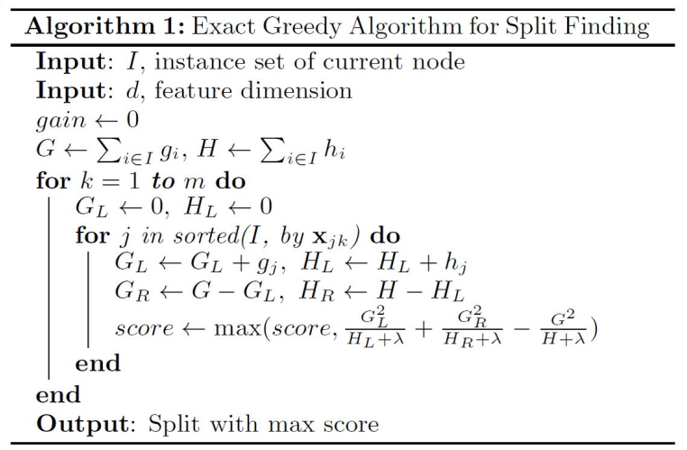
 
图12.精确分割算法流程图

&emsp;&emsp;（1）近似分割对于每个特征，只考察其分位点，以减少计算复杂度。其算法如下图所示：

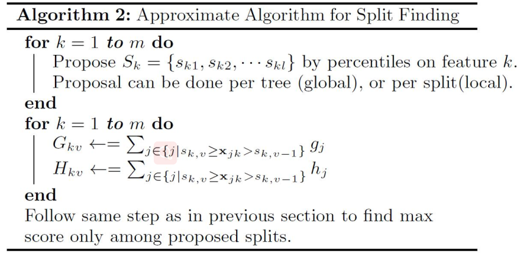
 
图13.近似分割算法流程图

&emsp;&emsp;图13中，Global为学习每棵树前，提出候选的切分点；Local为每次分裂前，重新提出的候选切分点。

&emsp;&emsp;XGBoost及其改进算法如LightGBM等在维数较低的结构化数据的预测中，相较于DNN这类模型，基于决策树的集成算法其训练速度较快，且精度更高，因此其已经成为首选的方案之一，在实际问题中得到了广泛的应用。

 
 

[[1] Shannon C E. A mathematical theory of communication[J]. Bell Labs Technical Journal, 1948, 27(3):379-423.](1.pdf)

[[2] Quinlan J R. Induction of Decision Trees[J]. Machine Learning, 1986, 1(1):81-106.](2.pdf)

[[3] Breiman L, Friedman J H, Olshen R, et al. Classification and Regression Trees[J]. Encyclopedia of Ecology, 1984, 57(1):582-588.](3.pdf)

[[4] Zhou Z H. Ensemble Methods: Foundations and Algorithms[M]. Taylor & Francis, 2012.](4.pdf)

[[5] Breiman L. Bagging predictors[M]. Kluwer Academic Publishers, 1996.](5.pdf)

[[6] Breiman L. Random forests, machine learning 45[J]. Journal of Clinical Microbiology, 2001, 2:199-228.](6.pdf)

[[7] Yoav Freund, Robert E Schapire. A Decision-Theoretic Generalization of On-Line Learning and an Application to Boosting[M]// Computational Learning Theory. Springer Berlin Heidelberg, 1995:119-139.](7.pdf)

[[8] Friedman J H. Greedy Function Approximation: A Gradient Boosting Machine[J]. Annals of Statistics, 2001, 29(5):1189-1232.](8.pdf)

[[9] Chen T, Guestrin C. XGBoost:A Scalable Tree Boosting System[C]// ACM SIGKDD International Conference on Knowledge Discovery and Data Mining. ACM, 2016:785-794.](9.pdf)

[[10] Ian Goodfellow, Yoshua Bengio, Aaron Courville. Deep Learning[B]. MIT Press:2016.](10.pdf)

[[11] Tibshirani R. Regression Shrinkage and Selection via the Lasso[J]. Journal of the Royal Statistical Society, 1996, 58(1):267-288.](11.pdf)

[[12] Bishop C M, 박원석. Pattern Recognition and Machine Learning, 2006[M]. Academic Press, 2006.](12.pdf)

[[13] 同济大学数学系. 高等数学（上册）[B]. 高等教育出版社, 2014.](13.pdf)

[[14] 周志华. 机器学习[M]. 清华大学出版社, 2016.](14.pdf)

[[15] 李航. 统计学习方法[M]. 清华大学出版社, 2012.](15.pdf)

