# YOLO系列

&emsp;&emsp;图像检测任务在人脸识别、自动驾驶、医疗、工业等实际生活中相当常见。在深度学习崛起前，早期的图像检测任务如人脸识别，主要是利用手工设计特征描述子、滑动窗口+AdaBooost、SVM这一pipeline进行。然而该方法存在大量问题：检测框多、速度慢、精度低、鲁棒性差等。随着深度学习的崛起，图像识别、图像检测、图像分割等任务取得了重大的突破。其中，R-CNN算法拉开了深度学习应用于图像识别任务的序幕，此后的最近几年以two-stage为框架的Fast R-CNN、Faster R-CNN、SPPNet、FPN以及Mask R-CNN和以Single Stage为框架的SSD、YOLO-v1、YOLO-v2、YOLO-v3、YOLO9000等网络在精度和速度上不断刷新。以Faster R-CNN为代表的两阶段目标检测模型，其目标检测问题被形式化成一个分类问题，该方法精度较高，然而两个阶段的多个任务同时进行优化并不容易，此外第二阶段所需时间随着Region Proposal的增多呈线性增长。因此我们需要进行优化，即采用以YOLO为代表的单阶段的检测模型，以牺牲一点精度换取更快的速度。这里我们简单介绍YOLO模型，（图像检测的相关基本介绍可以参考我的这篇笔记[从R-CNN到SSD](https://zhuanlan.zhihu.com/p/55050568)）。

## 1.YOLO-v1

### 1.1 Introduction

&emsp;&emsp;根据You Only Look Once: Unified, Real-Time Object Detection[1]的Paper介绍  YOLO-v1模型首先将图片resize为448$\times$448，然后送入CNN网络（其网络结构参考GoogLeNet）提取相关特征，最后通过非极大抑制获得检测框，如图1所示：

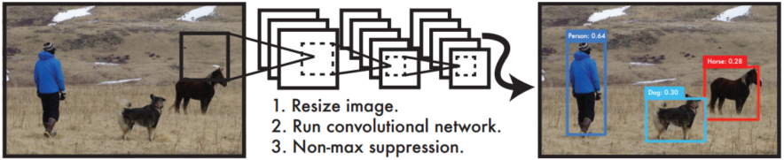
 
图1. YOLO Detection System

&emsp;&emsp;具体来说，YOLO首先将图片划分为$S\times S$的网格（论文中$S=7$，因此对于一些排列规则、紧密的目标，$S$的大小限制了检测目标的数目），然后每个单元格预测$B$（论文中$B=2$）个边界框，以及边界框的置信度（故一共$7 \times 7 \times 2 =98$个边界框），其中边界框即包含了对应的检测目标，如下：

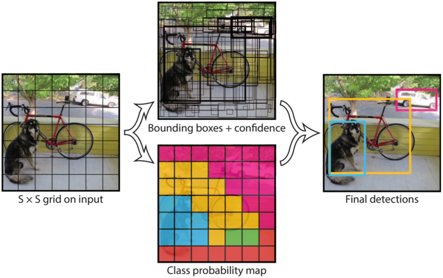
 
图2. grid

&emsp;&emsp;其中边界框的置信度主要包括两个方面，即边界框包含检测目标可能性的大小$Pr(object)$，以区分目标和背景以及该边界框位置预测的准确度$IOU^{truth}_{pred}$。

$$
\begin{cases}
    Pr(object)=0, & \text{if background}\\
    Pr(object)=1, & \text{if object}
\end{cases}\tag{1}
$$

&emsp;&emsp;边界框的位置准确度可以由预测框与实际框（ground truth）的交并比IOU（intersection over union）表示，如下：

$$
IOU^{truth}_{pred}=\frac{area(B_p \cap B_{gd})}{area(B_p \cup B_{gd})}\tag{2}
$$

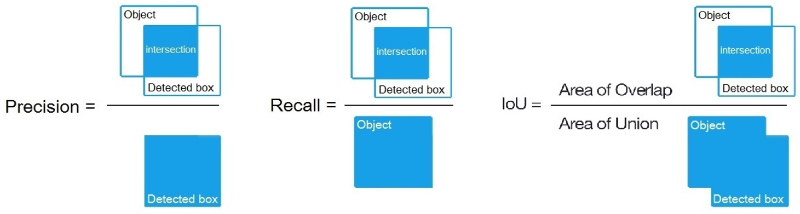
 
图3. IOU

&emsp;&emsp;式（2）中$B_p$为预测框的面积即红框，$B_{gd}$为实际框的面积即绿框。故预测框的计算公式如下：

$$
Cof=Pr(object)\ast IOU^{truth}_{pred}\tag{3} 
$$

&emsp;&emsp;其中对于边界框的大小与位置一般通过$(x,y,w,h)$这四个参数表示，$(x,y)$为边界框的中心坐标相对于边界框左上点的偏移量与边界框宽、高的比值，而$h,w$则为边界框的宽和高与整张图像宽、高的比值。因此网络最终对于边界框位置预测的输出即为$(x,y,w,h,c)$这五个值（$c$为置信度），其均在[0,1]区间内。

&emsp;&emsp;此外，对于每一单元格生成边界框中object类别的预测，论文中用类别置信度（class-specific confidence score）$Pr(class_i|object)$表示（这里需要注意的是无论一个单元格最终生成多少个边界框，论文中m=2，每个单元格最终只会输出一组目标类别概率）。而在最后的实际计算中其需要乘上边界框置信度以反映其对边界框位置预测好坏的估计，故网络最后预测结构的计算公式如下：

$$
Pr(class_i|object)\ast Pr(object)\ast IOU_{pred}^{truth}=Pr(class_i)\ast IOU_{pred}^{truth}\tag{4}
$$

&emsp;&emsp;论文使用PASCAL VOC数据，其共包含20个类别，因此每一个单元格输出的值数目为：$B\ast 5 + C=2\times 5 +20=30$，其中5为$(x,y,w,h,c)$，$C$表示目标类别数。模型一共包含$7\times7$个网格，因此网络最终的输出为$7\times7\times30$大小的张量。

### 1.2 Network Design

&emsp;&emsp;其网络结构如下图所示：

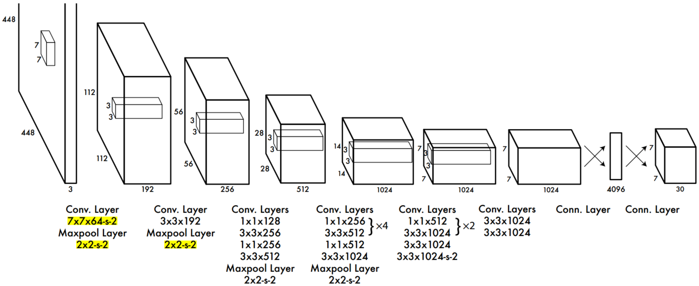
 
图5. YOLO-v1 网络结构

&emsp;&emsp;如上图所示，YOLO-v1在网络结构上并没有太大的创新，其主要利用卷积层提取特征，全连接层回归预测值。其网络结构参考GooLeNet，共包含24个卷积层和2个全连接层，其中卷积层利用$1\times1$的卷积进行channle reduction以减少参数量，然后接$3\times3$卷积。卷积层与全连接层的连接采用Leaky ReLU激活函数$max(x,0.1x)$，而最后一层则采用线性激活函数。

&emsp;&emsp;对于网络的训练，作者首先利用模型的前20层后添加一个average-pooling层和全连接层，在ImageNet上进行分类预训练网络。之后利用pretrain结果，在20层卷积层后随机初始化4个卷积层和2个全连接层，对PASCAL VOC数据进行训练。由于检测任务一般需要更高清的图片，所以网络的输入由原来的224x224增加为448x448。

### 1.3 Loss Function

&emsp;&emsp;对于损失函数的设计，由于YOLO模型的思想为将目标检测任务转化为回归问题，故其采用均方差损失。同时，由上文讨论可知，其模型的误差主要来源于检测框的定位误差以及目标的识别误差这两部分，对于边界框定位误差论文中设置较大权重$\lambda_{coord}=5$，而对于边界框包含目标的可能性即置信度$C$，不含目标其权值设置为$\lambda_{noobj}=0.5$，包含目标的其权值设为$1$，同时分类误差$p$的权值也设置为$1$。另外对于微小边界框其宽、高的误差要比大边界框宽、高的误差更加敏感，因此作者对$w,h$进行开方处理。

&emsp;&emsp;另外还需注意的是YOLO-v1的每个单元格最终将只预测一个边界框的目标类别概率，即选择IOU最大的而舍弃其他边界框。这一操作限制了模型的性能，尤其是对于微小物体的检测，即当一个单元格内存在多个目标时，模型将无法准而全的识别检测。故网络的损失函数如下：

$$
\lambda_{coord} \sum_{i=0}^{S^2}\sum_{j=0}^BL_{ij}^{obj}[(x_i-\hat x_i)^2+(y_i-\hat y_i)^2]\\
+\lambda_{coord} \sum_{i=0}^{S^2}\sum_{j=0}^BL_{ij}^{obj}[(\sqrt{w_i}-\sqrt{\hat w_i})^2+(\sqrt{h_i}-\sqrt{\hat h_i})^2]\\
+\sum_{i=0}^{S^2}\sum_{j=0}^BL_{ij}^{obj}(C_i-\hat C_i)^2\\
+\lambda_{noobj}\sum_{i=0}^{S^2}\sum_{j=0}^BL_{ij}^{noobj}(C_i-\hat C_i)^2\\
+\sum_{i=0}^{S^2}L_i^{obj}\sum_{c\in classes}(p_i(c)-\hat p_i(c))^2\tag{5}
$$

&emsp;&emsp;上式中，$\lambda_{coord},\lambda_{noobj}$分别为误差项权值；$i,j$分别为网格即边界框编号；$C_i,p_i(c)$分别为网格$i$是否包含目标的置信度以及目标属于类别$c$的概率。损失函数第一、二项表示检测框的定位误差，三、四项表示检测框是否包含目标的置信度误差，最后一项则为目标识别误差。

### 1.4 非极大值抑制

&emsp;&emsp;有上述分析知，网络最终将预测$7\times 7\times 2=98$个边界框，但实际情况中将不可不同的边界框包含同一目标，这时我们就需要将边界框进行删减合并处理，首先通过设置置信度阈值过滤一部分置信度较低的Box，然后使用非极大值抑制算法（non maximum suppression, NMS）。其流程如下：

- 根据置信度得分进行排序；
- 选择置信度最高的比边界框添加到最终输出列表中，将其从边界框列表中删除；
- 计算所有边界框的面积；
- 计算置信度最高的边界框与其它候选框的IoU；
- 删除IoU大于阈值的边界框；
- 重复上述过程，直至边界框列表为空。

### 1.5 算法性能分析

&emsp;&emsp;论文中，作者将YOLO与二阶段的Detector，如Fast R-CNN、Faster R-CNN以及但阶段的Detector，如DPM，在mAP及FPS这两个指标下进行了对比，结果如下：

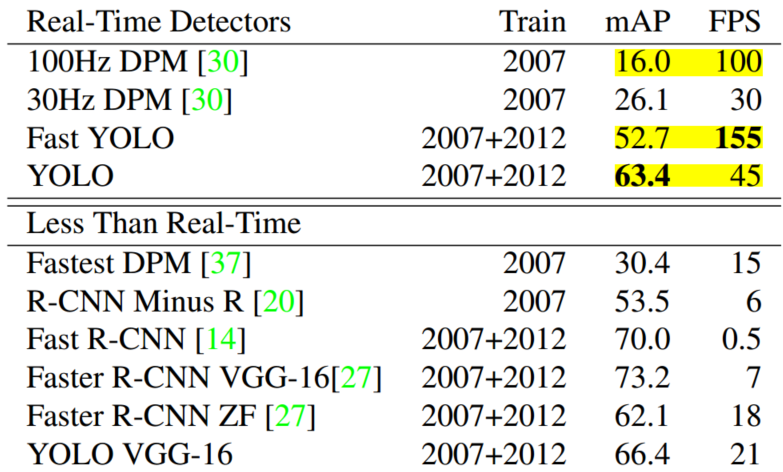
 
图6. 性能分析

&emsp;&emsp;从上图可以看出，在PASCAL VOC2007数据集上，对比FPS单阶段检测器其在较高速度下仍能保证较高的精度，而对比Faster R-CNN这种两阶段的检测器，其在牺牲一点精度的代价下却获得了更快的速度。

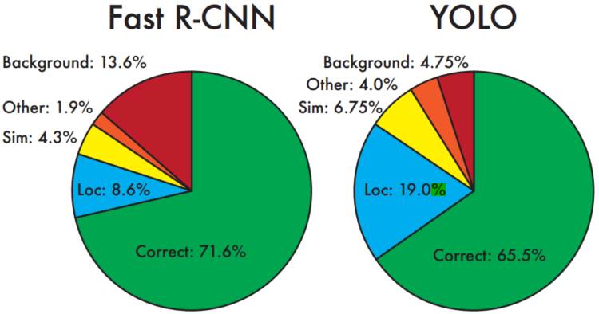
 
图7. 误差分析

&emsp;&emsp;从误差分析中了看以出对比Fast R-CNN，YOLO的Background error较低，而Loc较高。这主要是因为olo是对整张图片做卷积，所以其在检测目标有更大的视野，它不容易对背景误判。而较高的定位误差也为YOLO的改进提供了机会（YOLO-v2则改变了预测框的生成方式，参考了R-CNN中RPN网络的先验框方法）。

&emsp;&emsp;最后不得不说的是，YOLO作为单阶段检测器其在检测速度上相比之前有了明显提升，且采用End2End的方式简化了检测流程，另外YOLO的泛化能力强，鲁棒性好。然而，如上文所述，YOLO对于密集型较小物体的检测其效果将差强人意，其精度将远不如SSD和Faster R-CNN，而每个网格只预测一套目标概率也限制了网络的性能。

## 2.YOLO-v2

&emsp;&emsp;YOLO-v2显而易见是对YOLO-v1的补充和改进。该论文YOLO9000: Better, Faster, Stronger斩获了2017年CVPR的BP，其主要是在YOLO-v1的基础上利用一系列的技巧和操作使得网络精度和速度进一步提升，同时通过设计一种层级的数据组织形式（WordTree）将其应用至ImageNet和COCO数据集中，对检测与分类任务同时进行训练，最终使得网络检测的物体超过9000种，极大的扩展了模型的实用性。

### 2.1 改进方法

&emsp;&emsp;论文中作者针对YOLO-v1的缺点提出了一系列的改进措施，使得其网络模型Better、Faster、Stronger，具体如下：

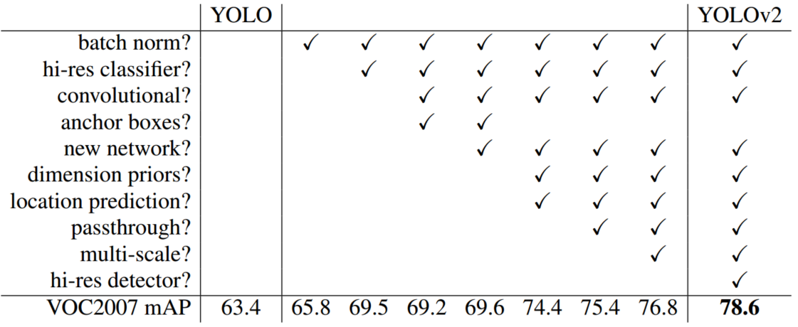
 
图8. 改进方法

- Batch Nomalization

&emsp;&emsp;在训练较深的网络时，由于梯度下降使得每层参数发生变化，进而使得后一层网络的输入分布发生变化，这使得网络需要不断调整以适应分布的变化，故模型的训练速度变慢同时需要更小的learning rate，此现象即为Internal Covariate Shift。而Batch Normalization是克服Internal Covariate Shift的常见技巧，即通过对当前Batch内每一层的训练数据进行normalization操作，使得网络中每层输入数据的分布相对稳定，以加速模型学习速度，同时减少参数初始化对结果的影响，进而简化调参过程。实验表明Batch Normalization还具有一定正则化缓解过拟合的效果，通过Batch Normalization可以替代网络的Dropout操作。在YOLO-v2中作者通过在每个卷起层后添加BN层，同时丢弃Dropout操作使得mAP提升约2%。

- High Resolution Classifier

&emsp;&emsp;在YOLO-v2中作者使用更高分辨率的图像作为输入，即将YOLO-v1中的$224\times 224$上升为$448\times 448$（实际为$416\times 416$，为13的倍数，以使得下采样后的特征图只有一个中心位置，以便于预测较大尺寸目标的边界框），同时为使网络对高分图像进行更好的表征学习，作者在ImageNet数据集训练的前10个epoch进行fineturn，最终使得mAP提升约4%。然而更高分辨率的图像同时也带来了计算量和存储空间的上升。

- Convolutional with Anchor Boxes

&emsp;&emsp;为克服YOLO-v1每个grid cell只预测一套目标概率值的缺点，YOLO-v2并未使用grid cell通过全连接层预测边界框，而是借鉴Faster R-CNN中RPN网络的操作，通过设置先验框（anchor boxes），以预测边界框相对于先验框的offsets和confidence，获得边界框。因此作者移除了全连接层，同时移除一个pooling层以获得更高的分辨率。并使用$416 \times 416$的图像作为输入，通过下采样后获得$13\times 13$的特征图，同时每个特征图生成num_anchors个边界框，而每个边界框均预测一套目标概率，对比YOLO-v1$7\times 7\times 2$的边界框数量，YOLO-v2的边界框数量或得了数十倍的增加。通过使用上千个边界框，YOLO-v2的recall从81%上升至88%，虽然其mAP下降了0.3。

- Dimension Cluster

&emsp;&emsp;在Faster R-CNN与SSD中Anchor Box的长宽值均需设定一个先验值，而在YOLO-v2中为使模型更加容易训练，作者通过K-Means聚类的方法获得其先验值。同时使用聚类中心的Box与各个Box间的IOU代替传统的欧氏距离，以更好的满足要求。

$$
d(box,centroid)=1-IOU(box,centorid)\tag{6}
$$

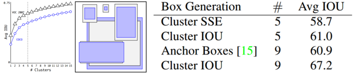
 
图9. K-Means

&emsp;&emsp;从上图可以看出先验框更倾向于“瘦高”的形状，同时当centroids=9时拥有更高的Avg IOU。此外作者还对比了手动设置的先验框与聚类生成的先验框，发现聚类结果拥有更高的Avg IOU模型更易训练。

- Direct location prediction

&emsp;&emsp;YOLO-v2使用预测边界框相对anchor box的offset来确定其位置，传统的计算公式如下：

$$
x=(t_x\times w_a)-x_a\\
y=(t_y\times h_a)-y_a\tag{7}
$$

&emsp;&emsp;上式中，$(x,y)$即为预测边界宽的中心点坐标，$w_a,h_a$即为先验框的尺度，而$t_x\times w_a,t_y\times h_a$则为预测边界框相对于先验框的偏移值，$(x_a,y_a)$即为先验框的中心点坐标。但是由于对$t$没有任何限制这将导致其预测的边界框可以出现在图片中的任意处，使得模型收敛变慢，对此YOLO-v2继承了YOLO-v1的思想，即将$13\times 13$的feature map看为$13\times 13$的grid cell，而每个边界框的中心点坐标均为相对于其对应的cell左上点坐标的偏移，此时即保证每个边界框的中心点均落在其对应的cell中。其计算公式如下：

$$
b_x=\sigma(t_x)+c_x\\
b_y=\sigma(t_y)+c_y\\
b_w=p_we^{t_w}\\
b_h=p_he^{t_h}\\
Pr(object)\ast IOU)(b,Object)=\sigma(t_o)\tag{8}
$$

&emsp;&emsp;上式中，$(b_x,b_y,b_w,b_h)$即为边界框在feature map中的中心点坐标和长宽，$(t_x,t_y,t_w,t_h)$即为offsets，$(c_x,c_y)$即为各个cell的左上点坐标，$p_w,p_h$即为先验框相对于特征图的长和宽。若我们需要得到预测边界框的实际值则只需要将$(b_x,b_y,b_w,b_h)$除以对应的feature map的$W,H$（论文中为13\times13），再乘以原始图片的尺寸即可。通过此操作mAP提升约5%。

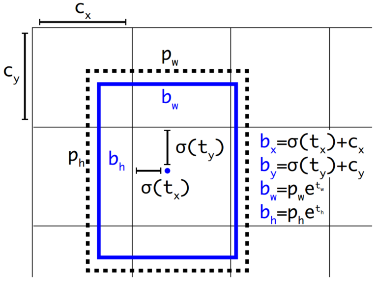
 
图10. Bounding Box

- Fine-Grained Features
  
&emsp;&emsp;为满足小尺度目标的检测，作者提出了一种与SSD、Faster R-CNN不同的方法（SSD、Faster R-CNN使用一系列的feature map以满足不同的分别率），即对$26\times 26\times 512$的layer进行passthrough处理（抽取邻近feature堆叠至channel上），将其转化为$13 \times 13 \times 2048$后再与$13 \times 13 \times 1024$concatenate。通过此操作，mAP提升约1%。

- Multi-Scale Training

&emsp;&emsp;为使网络在不同尺寸、不同分辨率的图像上均能取得较好的效果，作者采用Multi-Scale Training的训练策略，即每隔10batch网络将任意选择一种image size（论文中最小为$320\times 320$，最大为$608\times 608$），但需是32的倍数，以满足后续的处理。这里需要指出的是较小的图像分辨率将获得更快的速度但精度较差，而较大的分辨率将获得更高的精度但速度较低，总之在精度与速度间存在一定的trade-off。

- DarkNet-19

&emsp;&emsp;在利用深度学习做CV的各种任务中，人们一般倾向选择VGG-16作为特征抽取器，然而完整计算一次一张$224\times 224$分辨率的图片共需要30.69billion次的浮点计算，毫无疑问其计算量是巨大的。对此作者设计了Darknet-19网络，以减少计算，缩短训练时间。Darknet-19主要参考了VGG模型共包含19个卷积层和5个maxpooling 层，所不同的是其借鉴了GoogLeNet网中网（Network in Network）结构以减少参数，具体做法为最后使用global average pooling进行预测，同时在$3\times 3$卷积前增加$1\times 1$卷积核以压缩channel。相较于VGG-16，Darknet-19仅需要5.58 billion次浮点操作，其计算量明显减少。

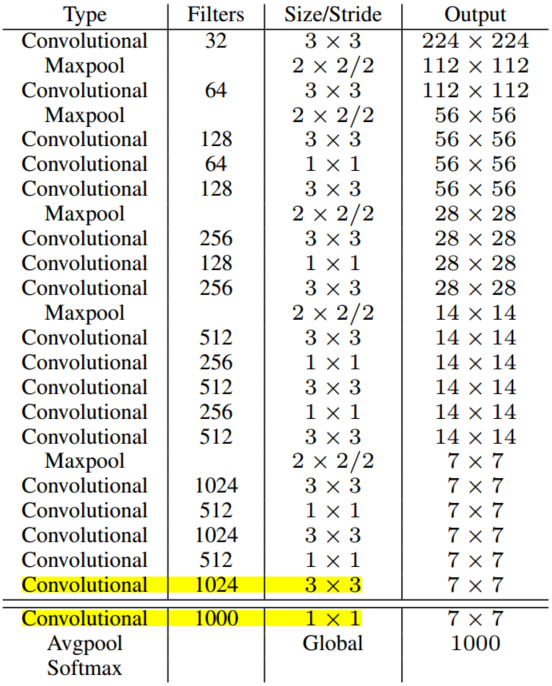
 
图11. DarkNet-19

### 2.2 模型的训练

&emsp;&emsp;对于分类问题，作者利用ImageNet的1000类数据对Darknet进行训练，在160epochs时设置图像尺寸为$224\times 224$进行intial training，同时设置learning rate为0.1。此后利用$416\times 416$的图像尺寸进行10 epochs的fine tuneing，同时设置learning rate为0.001。对于检测问题，作者通过移除最后一层卷积层，同时添加3个$3\times 3$的卷积层和一个passthrough层，最后使用$1\times 1$的卷积层输出预测结果，其大小即为$(batch size,13,13,num anchors\times (5+num classes))$（论文中num anchors=5，num classes=20）。

### 2.3 模型性能

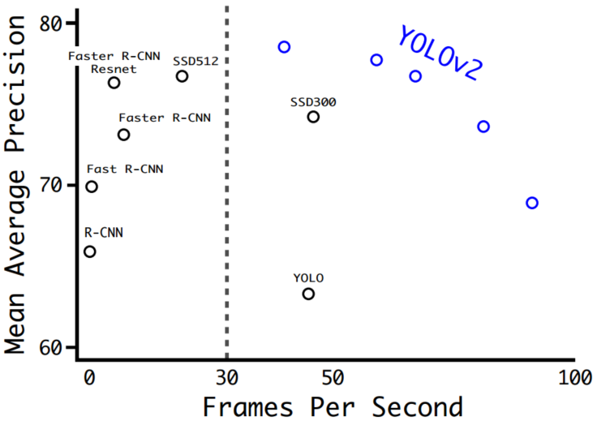
 
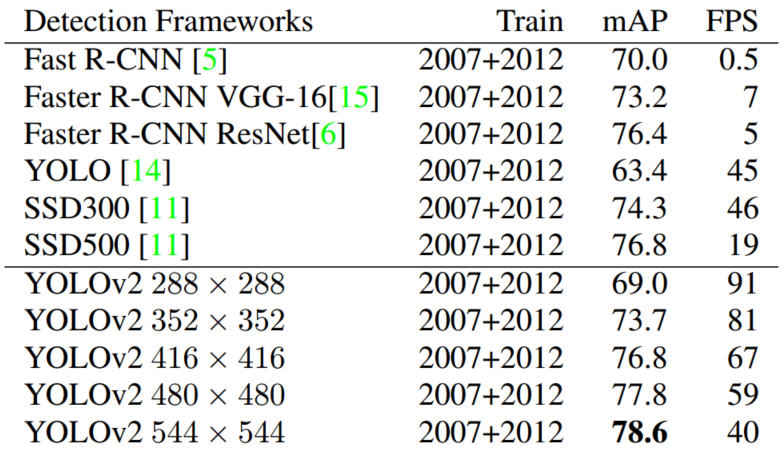
图12. 速度与精度

&emsp;&emsp;从上图可以看出YOLO-v2的速度与精度均取得了较好的性能。

## 3. YOLO9000

&emsp;&emsp;YOLO9000最大的创新之处即给出了综合利用不同数据集联合训练分类检测任务的有效方案。作者提出对与分类数据仅训练模型学习分类任务，而对于检测训练集则学习预测物体边界框位置、置信度及物体类别。但是由于不同数据集中各个物体类别并非完全互斥，而是具有一定的从属关系，如ImageNet数据集中拥有"Norfolk terrier"，而COCO数据集则将只有"dog"，这就给最后目标类别概率的预测和计算带来了困难，即我们无法使用Softmax得到各个类别的概率。对此作者参考WordNet，利用层级分类法建立WordTree，如下图所示：

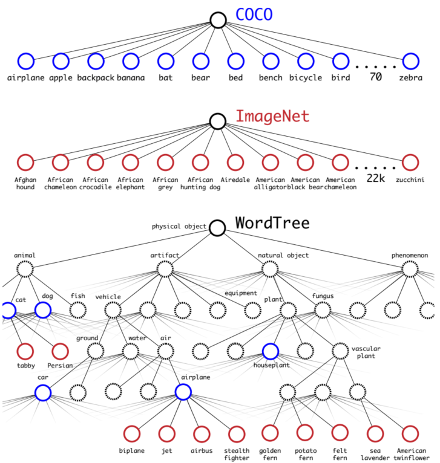
 
图13. WordTree

&emsp;&emsp;其中，根节点为phyxical object概率为1，而每一个节点的概率即为该节点至根节点概率的乘积（其中对于同一子类的物体进行Softmax处理），如下：

$$
Pr(Norfolk terrier)=Pr(Norfolk terrier|terrier)\ast Pr(terrier|hunting dog)\ast ... \ast Pr(mammal|animal) \ast Pr(animal|physcial object)\ast Pr(physcial object)\tag(9)
$$

&emsp;&emsp;在训练时，如果是检测样本，按照YOLOv2的loss计算误差，而对于分类样本，只计算分类误差。而对于类别的预测，网络通过选择概率最高的路径计算路径中各个节点概率，当达到某一个阈值时停止，利用当前节点表示预测的类别。最后YOLO9000能快速检测超过9000个类别的物体，且mAP达到19.7%。

## 3. YOLO-v3

&emsp;&emsp;相较于YOLO-v2，YOLO-v3并没有太多的创新与改进，其主要包括以下几点：

- 利用logistic regression预测每个检测框的score，当检测框与groud truth重叠最多时其score即为1，而当重叠未超过某一阈值（论文为.5）时，该检测框将被忽略
- 利用logistic classifier替代softmox以预测类别概率，以满足多标签预测问题（即某一目标可以属于多个类别，多标签）。
- 新的网络结构Darknet53，该网络包含53个卷积层且增加了resnet的residual block，并且借鉴了SSD的思想输出多个feature map（论文中为3个，每个特征图分配3个先验anchor boxes，故K-Means聚类9个先验框）。

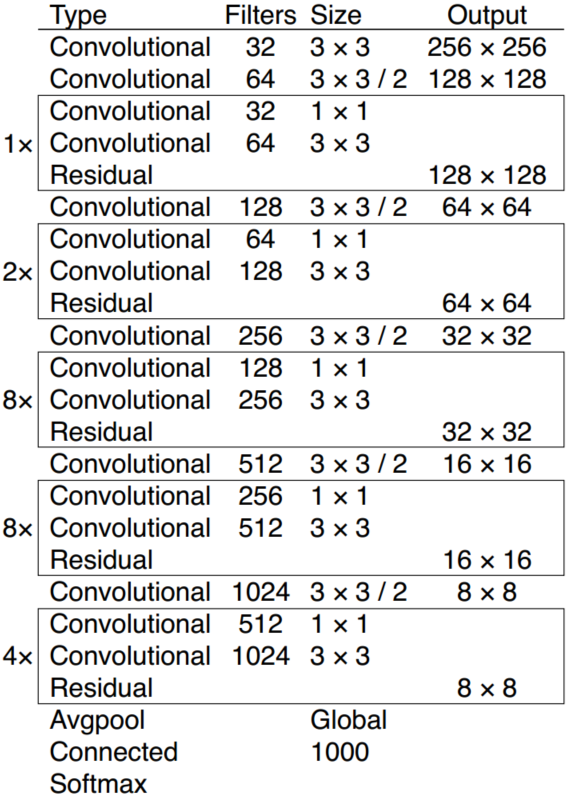
 
图14. Darknet53

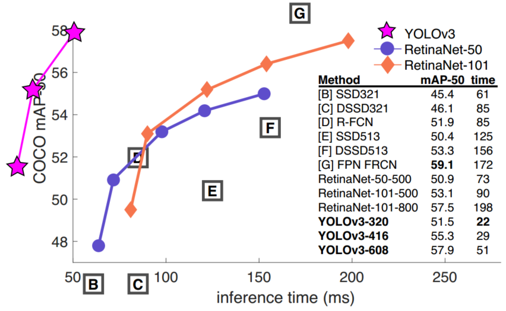
 
图15. Detectors性能对比

&emsp;&emsp;有关YOLO系列的目标检测模型目前也就存在这3种，虽然YOLO确实在速度和精度上取得不错的性能，但是也如其所说未来定会有Better、Faster、Stronger的模型出现。

## 4. Reference

[[1] You Only Look Once: Unified, Real-Time Object Detection](https://arxiv.org/abs/1506.02640)

[[2] Redmon J , Farhadi A . [IEEE 2017 IEEE Conference on Computer Vision and Pattern Recognition (CVPR) - Honolulu, HI (2017.7.21-2017.7.26)] 2017 IEEE Conference on Computer Vision and Pattern Recognition (CVPR) - YOLO9000: Better, Faster, Stronger[J]. 2017:6517-6525.](https://arxiv.org/abs/1612.08242)

[[3] Redmon J , Farhadi A . YOLOv3: An Incremental Improvement[J]. 2018.](https://arxiv.org/abs/1804.02767)

