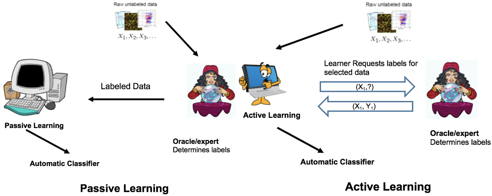
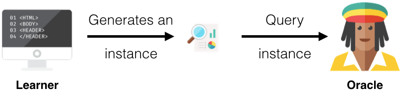
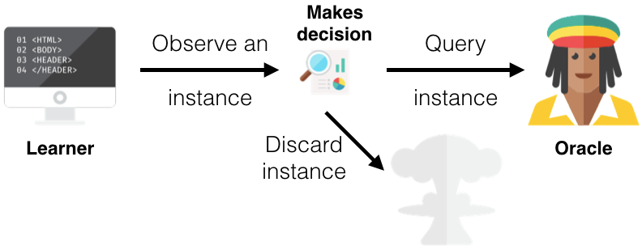
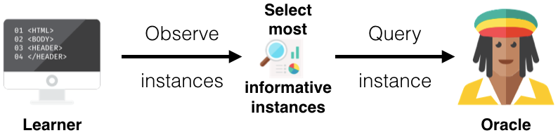
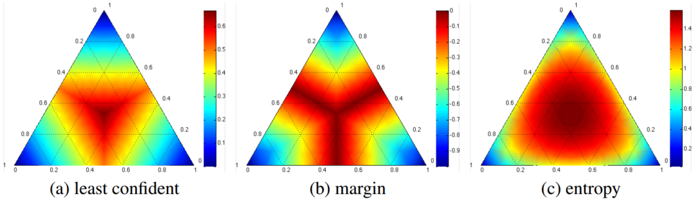
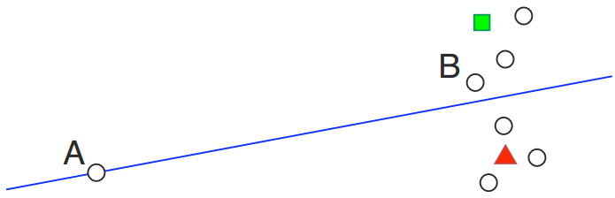

# Active Learning

## Introduction

&emsp;&emsp;主动的学习（Active learning or query learning）作为机器学习的一个分支其主要是针对数据标签较少或打标签“代价”较高这一场景而设计的，在统计学中主动学习又被称为最优实验设计（optimal experimetal design）。其主要方式是模型通过与用户或专家进行交互，抛出"query"(unlabel data)让专家确定数据的标签，如此反复，以期让模型利用较少的标记数据获得较好“性能”。一般情况下，模型抛出的未标注数据为“hard sample”（对于“hard sample”的不同定义可以衍生出一大堆的方法，如可以是ambiguous sample，即模型最难区分的样本；可以是对模型提升（改变）最大的样本，如梯度提升最大；可以是方差减小等等），相比与有监督学习，主动学习通过让模型更多的关注或学习“hard sample”，以期在较少的训练样本下获得较好的模型。如下所示：

 
图1. Active learning vs Passive Learning

&emsp;&emsp;可以看出active learning与passive learning最大的不同是passive learning或supervised learning其首先就需要大量的专家标注样本训练模型，而active learning则是利用少量标注样本，大量未标注样本训练模型，然后由learner选择样本返回给Oracle打标签，进而不断迭代以获得较好的模型，该过程必须要有专家的参与，这也是active learning区别于semi-supervised learning的不同之处。

## Scenarios

&emsp;&emsp;针对样本选择策略的不同，主动学习一般包括三种learning scenarios，即membership query synthesis、stream-based selective sampling和pool-based sampling：

- Membership Query Synthesis

&emsp;&emsp;Membership Query Sysnthesis其query samples可以为任意样本或随机生成（例如对图片样本进行旋转，类似样本增强的策略），然后将其送个Oracle进行判断，其过程如下所示：

 
图2. Membership Query Synthesis

&emsp;&emsp;由于在样本的随机生成过程中，其有较大的不确定性，因此在某些应用，如NLP中其生成的结果无任何意义，同时专家也无法标记，故这种方法对于某些应用场景有一定的局限性。

- Stream-Based Selective Sampling

&emsp;&emsp;Stream-Based Selective Sampling或Sequential active learning，其key assumption为样本的获得是“免费的”或代价较小的，因此learner每次基于某种query strategy选择一个样本给专家进行标记，如下：

 
图3. Stream-Based Selective Sampling

&emsp;&emsp;如上图所示，模型通过某种“informativeness measure”确定是否由专家标注样本，或舍弃该样本。

- Pool-Based Sampling

&emsp;&emsp;Pool-Based Sampling与Stream-Based Sampling最大的区别即为Pool-Based Sampling每次确定一批unlabeled data，由专家标记，如图4。Pool-Based Sampling是active learning中应用最为广泛的一种framework。

 
图4. Pool-Based Sampling

## Query Strategy Framework

&emsp;&emsp;如上文所述，learner需要根据一定的策略选择unlabeled data，在active learning中其主要包括以下几种：

&emsp;&emsp;(1) Uncertainty Sampling

&emsp;&emsp;Uncertainty Sampling是最为广泛的一种query strategy（类似hard sample mining），其主要是将模型“最易混淆”或“信息量”最大、最有价值的样本返回给expert，以期获得较大的增益，一般包括：

- Least Confident

$$
x^*_{LC}=argmax_x1-P_{\theta}(\hat y|x),\quad \hat y=argmax_y P_{\theta}(y|x)\tag{1}
$$

&emsp;&emsp;上式中，$\hat y$即为模型预测概率最大的类别，而$x^*_{LC}$即表示模型最不确定的样本（模型预测该样本的概率值较低）。

&emsp;&emsp;虽然LC简单直接，但是该方法只考虑了模型预测概率最大但是依旧“可信度”较低的样本，对于那些概率较小的样本，其并未考虑。因此由发明了margin sampling：

$$
x^*_M=argmin_xP_{theta}(\hat y_1|x)-P_{\theta}(\hat y_2|x),\quad \text {where $\hat y_1$,$\hat y_2$ are the first and secnod most probale class labels}\tag{2}
$$

&emsp;&emsp;式（2）其本质为模型预测最大的和第二的概率差值最小的样本即为"hard sample"。

&emsp;&emsp;对于uncertainty我们也可以用entropy衡量（“熵”本身就可以衡量“混乱程度”或“不确定程度”），如下：

$$
x^*_H=argmax_x-\sum_iP_{\theta}(y_i|x)logP_{\theta}(y_i|x)\tag{3}
$$

&emsp;&emsp;下图为三种“不确定度”衡量方式的Heatmaps：

 
图5. Heatmaps of three uncertainty meaures

&emsp;&emsp;上图中三角形的三个角即代表三种不同的类别，因此越靠近Corner其“不确定度”越小，越靠近中心其“不确定度”越大，可以看到entropy倾向于较高的uncertainty，而least confident其倾向于较小的uncertainty。

&emsp;&emsp;(2) Query-By—Committe

&emsp;&emsp;Query-By—Committe的思想类似于模型集成和投票，不同的模型即为Committee，投票的divergence最大的样本即为“controversial sample”，利用vote entropy衡量：

$$
x^*_{VE}=argmax_{x}-\sum_i\frac{V(y_i)}{C}log\frac{V(y_i)}{C}\tag(4)
$$

&emsp;&emsp;上式中$C$即为committee'size，$V(y_i)$即为投票给$y_i$类committee数目。

&emsp;&emsp;(3) Expected Model Change

&emsp;&emsp;Expected Model Change其主要思想即对模型“改变”最大的标记样本为“有价值”的样本，这里对模型“改变”的衡量可以由梯度提升来体现，如“expected gradient length” (EGL)，如下：

$$
x^*_{EGL}=argmax_x\sum_iP_{\theta}(y_i|x)||\nabla l_{\theta}(\frak L\cup <x,y_i>)||\tag(5)
$$

&emsp;&emsp;上式中$||*||$即为Euclidean norm，通过增加$<x,y_i>$使得梯度的改变最大。

&emsp;&emsp;(4) Expected Error Reduction

&emsp;&emsp;类似与Expect Model Change，Expected Error Reduction的思想是通过增加一个标注的样本其loss减小最多：

$$
x^*_{log}=argmin_x\sum_iP_{\theta}(y_i|x)(-\sum_{u=1}^U\sum_jP_{\theta^{+<x,y_i>}}(y_j|x^{(u)})logP_{\theta^{+<x,y_i>}}(y_j|x^{(u)}))\tag{6}
$$

&emsp;&emsp;(5) Variance Reduction

&emsp;&emsp;上述Expected Error Reduction需要判断每个样本对模型的“贡献程度”，其“成本”较高，而Variance Reduction其主要思想是使variance最小的样本，其“价值”最大。对于Variance，bias和noise的介绍可以参考我的这篇笔记[Bias - Variance Dilemma(偏差-方差窘境)](https://zhuanlan.zhihu.com/p/48976363)。 

&emsp;&emsp;(6) Density-Weighted Methods

&emsp;&emsp;由uncertain strategy确定的样本其更多的是关注单个样本对模型的提升或“贡献”程度，然而很多候，其“模糊”的样本往往会是一些outliers或噪声，若让模型更多的关注或学习这些样本，其对性能的提升将不会产生帮助，如图6所示：

 
图6. Outliers

&emsp;&emsp;上图中“A”点即为outlier，以点“A”调整模型精度可能并不会提升，因此，我们在考虑individual时同时还需关注整体样本的分布，故提出了Density-Weighted Methods：

$$
x_{ID}^*=argmax_x\Phi_A(x)\times (\frac{1}{U}\sum_{u=1}^Usim(x,x^(u)))^{\beta}
$$

&emsp;&emsp;上式中，$\Phi_A(x)$即代表由uncertainty sampling or QBC approach所确定的样本$x$的informativeness，同时我们还要考虑$x$与整体样本的相似度，故利用average sim进行加权，$\beta$为以control parameter。

## When Can I Use Active Learning?

- 希望用尽可能少的标记样本训练模型，同时达到较高的精度；
- 模型训练的时间成本较高，希望用较少的样本去尽可能的提升模型的性能，这时即可使用active learning strategy去训练模型（“假装”样本标注未知）；
- 样本数据类别分布不平衡，希望使用downsample的策略去剔除一些样本使样本分布均匀，一般的方式是random removing，采用active learning的主要目的即希望保留尽肯能“有价值”的样本；

## Applications and Modern Research into Active Learning

&emsp;&emsp;由于样本需求量较大，样本标注成本较高，Active Learning在NLP领域应用较为广泛，如Part-of-Speech Tagging, Named Entity Recognition等，有关NER等任务介绍可以参照我的这些笔记：[NLP中的序列标注问题（隐马尔可夫HMM与条件随机场CRF）](https://zhuanlan.zhihu.com/p/50184092)、[FET with Knowledge Attention（细粒度实体分类）](https://zhuanlan.zhihu.com/p/62897250)。

&emsp;&emsp;事实上Deep Learning在NLP等相关领域的成功应用很大程度上与样本数据量有关，BERT及其相关模型的成功应用就是一个很好的例子。但是在一些special的应用场景中，BERT模型不能很好地满足需求，其仍极大的依赖专家进行数据标记，因此Active Learning是一个有效的策略。

&emsp;&emsp;此外，在CNN、LSTM等算法中已有不少学者利用Active Learning提高效率，如：[Kronrod and Anandkumar, 2017](https://arxiv.org/pdf/1707.05928v2.pdf); [Sener and Savarese, 2017](https://arxiv.org/abs/1708.00489v2)，[GAN网络](https://arxiv.org/abs/1702.07956v5)，[reinforcement learning](https://arxiv.org/abs/1708.02383v1)以及[meta-learning](https://arxiv.org/abs/1706.08334)中active learning也有一些文章。

## Conclusion

&emsp;&emsp;Active Learning与Semi-supervised learning的显著差别即为有无Oracle的参与，但是所用的方法或思想却有较大的重叠（如样本“分歧”最大等），事实上也有一些学者认为active learning即为半监督学习的一种。此外，在序列标记问题中Bootstrapping算法也可以认为是Active Learning，而hard negative mining中也有active learning的思想。总的来说，Active Learning的目的就是希望利用尽可能少的的样本去训练learner以获得较好的performance，而采用的主流方法就是让model去尽可能的关注和学习有“价值”的样本（平衡样本分布的其中之一策略也为此），有关“价值”样本的定义和选择即存在不同的评价指标和方法，进而发展出不同的研究方向，尤其是在垂直细分领域和工业界，Active Learning有较大的应用和研究前景。

## Reference

[[1] Active learning (machine learning) - Wikipedia](https://en.wikipedia.org/wiki/Active_learning_(machine_learning))

[[2] Active Learning: Curious AI Algorithms.](https://www.datacamp.com/community/tutorials/active-learning)

[[3] Active Learning - Medium](https://medium.com/@shivanikohli/active-learning-1988958ebbf3)

[[4] Settles B. Active learning literature survey[R]. University of Wisconsin-Madison Department of Computer Sciences, 2009.](http://burrsettles.com/pub/settles.activelearning.pdf)

