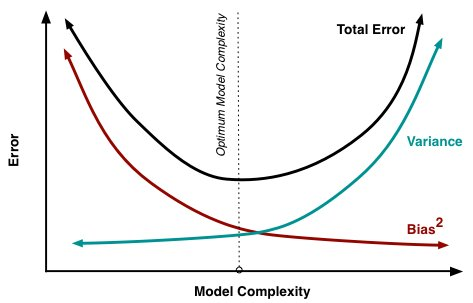
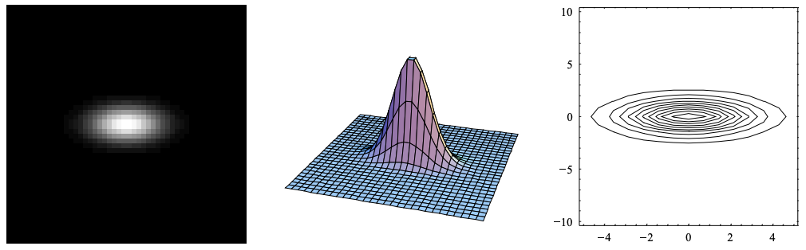
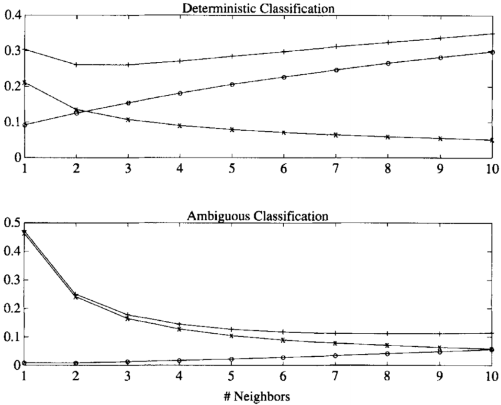
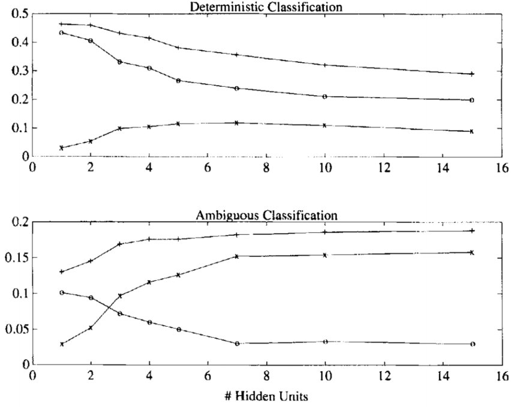
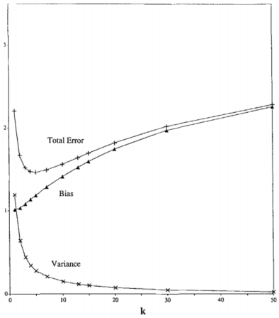
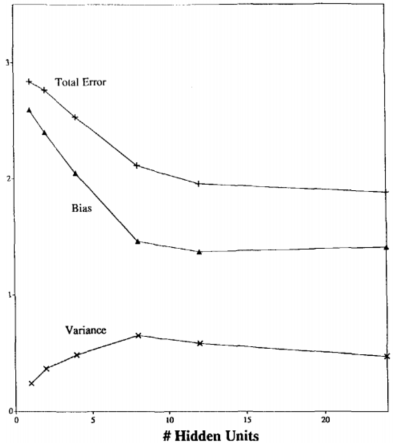

# Bias - Varance Dilemma

## Motivation

&emsp;&emsp;在早期的研究中，人们直观的认为在前提假设（有限的样本空间即抽样所得样本分布，即样本假设空间有限情况。对于假设空间无限时需引入VC维讨论泛化误差的上界，在此不做介绍（样本空间无限时，泛化误差上界只与样例数目有关，而于数据分布和样例集无关））下提高分类器概率估计的准确率即可提高其预测的准确率（对于有限假设空间，其实泛化误差上界与训练误差，即训练误差越小，泛化误差上界也越小。因此，在某种程度上可以认为训练误差越小，模型泛化误差（上界）越小）。然而真实情况却是当分类器在拥有较高的概率估计准率情况下，其对新样本的预测性能并没有较大的提高甚至会有所下降。相反一些经典的分类器如朴素贝叶斯、最近邻方法虽然其在高维的数据下并没有较高的概率估计准确率但是其对新样本的预测却能获得不错的结果（朴素贝叶斯早期在文本的预测中如垃圾邮件的分类能有不错的效果，但是有关其为何能在这种大胆的假设下（各因素相互独立，利用独立概率分布代替联合概率分布）取得好的分类效果现在仍不十分明确。一种解释是文本的上下文并没有太大的关联，另一种解释是文本中存在“正负相抵”的影响，如情感等）。甚至有时通过“简化”预测的流程（也就是正则化、剪枝、Dropout等操作）也可以提高分类器也测的准确率。对于这种现象学者们进行了一系列的研究，认为有必要提出一种新的不同的指标去观察分类器的性能。

## Introduction

### Bias-Variance decomposition

&emsp;&emsp;机器学习中预测是一个十分常见且重要的问题。即我们如何利用给定的一些数据的attributes（inputes）$X=(x_1,x_2,...x_n)$和其对应的输出（outputs）$Y$，从中学习可靠的规则（有监督学习）去预测当新的inputs出现时其对应的outpus（y）是多少。而针对不同的outputs数据类型，该问题又可以分为分类问题（$y \in \{y_1,y_2,...,y_n\}$）和回归问题($y \in R^1$)。对于分类问题我们一般是根据其预测每一类别（$y_i$）的概率来确定最后的结果（概率最大类别即为输出）。这里我们以二分类问题进行说明（多分类问题可以转化为二分类器进行求解）。

&emsp;&emsp;记分类器的输入为$X$，$X={x_1,x_2,...,x_n}$，其输出$y \to {0,1}$一般通过概率确定，即：

$$
P(y=1|X)=1-P(y=0|X)=f(X)\tag{1}
$$

&emsp;&emsp;式（1）即为分类器的映射函数。此时我们希望寻求一个最优的（理想的）$f(x)$，使得其对于输入$X$的输出$\hat y(X) \in \{0,1\}$分类误差$r(X)$最小（一般用期望或平均损失函数衡量）。

$$
r(X)=w_1f(X)l(\hat y(x)=0)+w_0(1-f(x))l(\hat y(x)=1)\tag{2}
$$
$$
l(\eta)=\begin{cases}1\qquad if\; \eta \;is\; true\\0\qquad others\end{cases}
$$

&emsp;&emsp;上式中，$w_0,w_1$为各类别判别错误的权值（考虑代价敏感和样本分布不均的问题）。为使误差$r(X)$最小，即我们希望在$y(X)=\hat y(X)=0$时$f(X)$最小（$f(X)$表示预测样本为1的概率）。也即在$y(X)=\hat y(X)=1$时$f(X)$最大（1-$f(X)$最小）。因此式（2）课表示为：

$$
r(X)=min(w_1f(x),w_0(1-f(x)))\tag{3}
$$

&emsp;&emsp;对于有监督学习的分类器，其会根据训练数据$T$学习股则并对输入$X$进行分类，因此对于分类结果$\hat y(X|T)=l(\hat f(X|T)\geq\frac{w_0}{w_0+w_1})$，当$\hat f(x) \ne f(x)$时，其误差可由$y-\hat f(x)$给出，即最小均方误差（rms）：

$$
rms(X)=E^{\frac{1}{2}}[(y-\hat f(X|T))^2]
$$

&emsp;&emsp;以回归问题为例，众所周知对于训练样本$T$，我们是根据其真实样本空间采样得到，其只是真实样本分布中的一小部分。因此不同的采样、不同的训练样本集均会导致不同的结果$\hat f(X|T)$。由于训练样本是随机的，因此$\hat f(X|T)$也是随机的。这里我们记$\hat f(X|T)$服从某一分布，即$\hat f(X|T)$~$L(\hat f|X)$，且$\hat f(x|T)$的概率密度函数为$p(\hat f|X)$。则有：

&emsp;&emsp;分布均值:$E(\hat f(X))\int_{-\infty}^{+\infty} {\hat f \cdot \hat p(\hat f|X)}d\hat f$

&emsp;&emsp;方差：$var \hat f(X)=\int_{-\infty}^{+\infty} (\hat f-E(\hat f(X)))^2p(\hat f|X)d\hat f$

&emsp;&emsp;因此有：

$$
E_T[(f(X)-\hat f(X|T))^2]=E_T[(f-E_T(\hat f)+E_T(\hat f)-\hat f)^2]\\
=E_T[(f-E_T(\hat f))^2]+E_T[(\hat f-E_T(\hat f))^2]+2E_T[f-E_T(\hat f)]E_T[\hat f-E_T(\hat f)]\tag{4}
$$

&emsp;&emsp;注意到$E_T(\hat f)$和$f$为确定值，则有：

$$
E_T[f-E_T(\hat f)]E_T[\hat f-E_T(\hat f)]=E_T[(f-E_T(\hat f))(\hat f-E_T(\hat f))]=E_T[f\hat f-E_T(\hat f)(f+\hat f)+(E_T(\hat f))^2]\\
=E_T[f\hat f]-E_T[E_T(\hat f)(f+\hat f)]+E_T[(E_T(\hat f))^2]=fE_T[\hat f]-E_T(\hat f)E_T[f+\hat f]+(E_T(\hat f))^2\\
=fE_T[\hat f]-E_T(f)E_T[\hat f]-(E_T(\hat f))^2+(E_T(\hat f))^2=0
$$

&emsp;&emsp;因此式（4）可化简为：

$$
E_T[(f(X)-\hat f(X|T))^2]=E_T[(f-E_T(\hat f))^2]+E_T[(\hat f-E_T(\hat f))^2]\tag{5}
$$

&emsp;&emsp;记$Y$为数据的真实结果，且$Y=\hat f(X)+\epsilon$。其中$\epsilon$为随机噪声，服从均值为0的某一分布，即$E_T[Y-\hat f(X)]=0$则：

$$
E_T[(f(X)-\hat f(X|T))^2]=E_T[(f-E_T(\hat f))^2]+E_T[(\hat f-E_T(\hat f))^2]=E_T[(f-E_T(\hat f))^2]+E_T[(\hat f-Y+Y-E_T(\hat f))^2]\\
=E_T[(f-E_T(\hat f))^2]+E_T[(\hat f-Y)^2]+E_T[(Y-E_T(\hat f))^2]+2E_T[\hat f-Y]E_T[Y-E_T(\hat f)]\\
=E_T[(f-E_T(\hat f))^2]+E_T[(\hat f-Y)^2]+E_T[(Y-E_T(\hat f))^2]\tag{6}
$$

&emsp;&emsp;这里我们称$E_T[(f(X)-\hat f(X|T))^2]$为期望泛化误差（泛化误差反映模型对未知数据预测的误差），并定义$bias(X)=E_T[Y-E_T(\hat f)]$。则式（6）可分解为:

$$
E_T[(f(X)-\hat f(X|T))^2]=var(X)+bias^2+\epsilon ^2\tag{7} 
$$

&emsp;&emsp;方差反映了函数$f(X)$对于训练样本$X$的敏感程度，较低的方差则意味着模型对于不同样本的输出更加稳定，即在相同的采样样本下其输出的变动更小。而偏差则反映了分类器对输入样本的估计期望与真实结果的接近程度。因此对于某一模型的期望泛化误差其由偏差、方差共同决定。如果我们期望模型对样本的预测误差越小，则要求模型的偏差越小，然而较小的偏差将导致模型的方差增加，这也就造成了bias-variance trade-off。

&emsp;&emsp;对于给定的偏差其方差将随着训练样本的增加而减小。因此在大量样本的前提下，学习任务即转化为使模型的偏差较小，在这样的策略下某些算法取得了不错的效果。然而对于一些分类问题的模型，该策略并不管用如朴素贝叶斯和最近邻方法，其在较高的偏差下仍然有很强的竞争力。

### Nonparametric inference algorithms(Neural Netwoeks) bias-variance dilemma

&emsp;&emsp;近些年由于深度学习的强势表现，神经网络这种连接主义的方法大有“一统江湖”的趋势，因此在现在深度神经网络红的发紫的今天我们很有必要去探究神经网络这类方法在给定的时间和数据的条件下是否会存在偏差-方差窘境（of course），以及这类方法的极限局限在哪？

&emsp;&emsp;在以上的讨论中我们已经知道了任何模型的泛化误差可以分解为偏差与方差，同时增加训练样本可以减小方差，提高模型的性能。对于复杂的问题，我们只能根据model-based estimation去控制方差，然而model-based inference往往又会趋向于偏差最小（神经网络我们以最小均方误差作为损失函数其实就是只考虑了偏差对模型的影响）。此外神经网络的参数数目（网络的复杂程度）也将会影响偏差与方差的大小。例如，当神经网络的隐层神经元数目为1时，模型的表达能力有限此时将会存在较大的偏差，而当神经元数目较多时，此时偏差将减小而方差将占误差的主导作用。因此在面对复杂问题时，模型往往会陷入“偏差-方差窘境”。

 
图1. “偏差-方差窘境”示意图

&emsp;&emsp;对于给定样本集$D_N$，$N$为样本数目，并假定学习模型为$f(X;D_N)$。当训练样本$N\;\to\; \infty$逐点均方误差为零，即：

$$
lim_{N\to\infty}E_{D_N}[(f(X;D)-Y)^2]=0\tag{8}
$$

&emsp;&emsp;更全面的度量方法是考虑j积分均方误差，即：

$$
lim_{N\to\infty}E_{D_N}[\int(f(X;D)-Y)^2dx]=0\tag{9}
$$

&emsp;&emsp;1990年 White 在"Connectionists nonparametric regression: multilayer feedforward networks can learn arbitrary mappings"中证明对于神经网络模型，当训练样本增加时模型的偏差和方差均将会缓慢降低，这也在一定程度上揭露了通过增加训练样本数目缓解“偏差方差窘境”的方法。

&emsp;&emsp;假设训练数据记为$D=\{(x_1,y_1),(x_2,y_2),(x_3,y_3),...,(x_n,y_n)\}$,这里我们以回归问题分别分析K近邻、核密度估计和神经网络三种方法的偏差-方差随样本数量的变化情况。

- Nearest-Neighbor Regression
  
&emsp;&emsp;K-近邻方法简单的说即使对于输入数据$x$，其输出值即为它周围距离最近的$k$个样本取值$y$的平均值（回归问题，对于分类问题即为$k$个样本中出现次数最多的类别），如下所示：

$$
f(x,D)=\frac1k\sum_{i\in N_k(x)}^ky_i\tag{10}
$$

&emsp;&emsp;上式中，$N_k$即为样本$i$周围距离最近的$k$个样本。观察式（10）可知当$k$增加时，模型的输出将趋于平滑，即方差将减小，而偏差将增大。考虑极端情况当$k$为训练样本数目时，对于不同的输入模型的输出将为样本均值，此时方差为0而偏差最大。而当$k=1$时，理想情况下其偏差可以为0，而方差达到最大。因此，该模型对输入的训练样本和$k$的取值较为敏感。

 
图2. KNN算法示意图

- Parzen- Window Regression

&emsp;&emsp;这里取较为常见的Gaussian kernel(RBF kernel)，如下所示：

$$
W(x)=(\frac{1}{\sqrt{2\pi}\sigma})^de^{-\frac{1}{2\sigma^2}|x|^2}\tag{11}
$$

&emsp;&emsp;上式中，$\sigma$被称为bandwith，在早期利用rbf kernel的SVM进行图像识别的任务时，$\sigma$一般可以控制感受野的大小，即$\sigma$越小，感受野将越小即关注区域越集中；$\sigma$越大，感受野将越小大即关注区域将越广。如下图所示：

 
图3. Gaussian核函数示意图

&emsp;&emsp;记高斯核函数为$W(\cdot)$ ($bandwidth=\sigma$)，则核密度函数为:

$$
f(x;D)=\frac{\sum_{i=1}^Ny_i(1/\sigma)^dW[(x-x_i/\sigma)]}{\sum_{i=1}^N(1/\sigma)^dW[(x-x_i/\sigma)]}=\frac{\sum_{i=1}^Ny_iW[(x-x_i/\sigma)]}{\sum_{i=1}^NW[(x-x_i/\sigma)]}\tag{12}
$$

&emsp;&emsp;当输入$x$与$x_i$越接近时，其权值将越小。显然，高斯核密度函数与K近邻的方法存在相视的联系。当$\sigma$较小时其感受野将减小即模型将更多的关注输入值附近的样本，因此对应KNN中的k也较小。同理当$\sigma$较大时，其对应KNN中的k也较大。因此$\sigma$对模型偏差、方差的影响将于KNN相同，即当$\sigma$较小时，模型将偏向于高方差\低偏差，而$\sigma$较大时，模型将偏向于低方差\高偏差。

&emsp;&emsp;对于分类问题其高斯核密度函数如下：

$$
f_y(x;D)=\frac{1}{N_y}\sum_{i,y_i=y}(\frac{1}{\sigma})^dW(\frac{x-x_i}{\sigma})\\
N_y=\#\{i,y_i=y\}\tag{13}

$$

&emsp;&emsp;上式中，$N_y$为训练样本类别为$y$的数目（与输入数据类别相同的训练样本数目）。

- Neural Network

&emsp;&emsp;有关简单神三层经网络的介绍在此就不详细展开了这里取目标函数为均方误差（回归问题）：

$$
L(W)=\frac{1}{N}\sum_{i=1}^N(y_i-f(x_i;W)^2)\tag{14}
$$

&emsp;&emsp; 对于目标函数我们使用BP算法求解权值$W$。由上文我们已经知道，神经网络的偏差和方差极大的取决于隐层神经元的数目即网络的复杂程度（当然与训练样本数目也有关），隐层神经元数目越多，偏差越小而方差越大。

### Experimnets

&emsp;&emsp;Geman S.对于偏差-方差的trade-off给出了一系列实验以证实上述结论（参阅Geman S, Bienenstock E. Neural networks and the bias/variance dilemma[M]. MIT Press, 1992.）。

&emsp;&emsp;这里我们记训练样本集$D=\{(x_{01},x_{02};y_0),(x_{11},x_{12};y_1),(x_{21},x_{22};y_2),...,(x_{n1},x_{n2};y_n)\}(n=50)$，其中$(x_{i1},x_{i2})$为$[-6,6]\times[-1.5,1.5]$矩形区域内的随机点。

&emsp;&emsp;其输出$y$为:
$$
\begin{cases}y=0.9,\quad x_2>sin((\pi/2)x_1)\\
y=-0.9,\quad others\end{cases}\tag{14}
$$

&emsp;&emsp;根据上述描述随机产生100个样本集合$\{D_1,D_2,D_3,...,D_{100}\}$，利用K近邻分类器和神经网络重复100次实验。则模型的bias、variance和total error分别为：

$$
bias^2(x)=(E_D[f(x;D)]-E[y|x])^2\approx(\overline {f}(x)-E[y|x])^2\tag{15}
$$

$$
variance(x)=E_D[(f(x|D)-E_D[f(x;D)])^2]\approx \frac{1}{100}\sum_{k=1}^{100}[f(x;D_k)-\overline f(x)]^2\tag{16}
$$

$$
total\_error=bias^2+variance=(E_D[f(x;D)]-E[y|x])^2+E_D[(f(x|D)-E_D[f(x;D)])^2]\\
\approx \frac{1}{100}\sum_{k=1}^{100}(f(x;D_k)-E(y|x))^2+(2\overline f(x)^2-2\overline f(x)(E[y|x]+\overline f(x))+2\overline f(x)E(y|x))\\
=\frac{1}{100}\sum_{k=1}^{100}(f(x;D_k)-E(y|x))^2+2\overline f(x)(\overline f(x)-E[y|x]-\overline f(x)+E(y|x))\\
=\frac{1}{100}\sum_{k=1}^{100}(f(x;D_k)-E(y|x))^2\tag{17}
$$
（原文中$bias=(E_D[f(x;D)]-E[y|x])^2$）

&emsp;&emsp;实验观察结果如下所示：

 
图4. K近邻偏差-方差实验结果

（$x$轴表示近邻$k$的数目，$\circ$表示偏差，$\times$表示方差，$+$表示总误差）

&emsp;&emsp;观察图4知随着$k$的增加，偏差增加，方差减小，而总误差呈现先减后增的趋势，即$k$较小时偏差占主导作用，当$k$增加时方差将占主导作用。

&emsp;&emsp;同理，对于神经网络隐层神经元数量对偏差、方差的影响如下图所示：

 
图5. 神经网络实验结果

&emsp;&emsp;而对于神经网络，当隐层神经元数目较少时，偏差占主导作用。当神经元数目逐渐增加时，偏差减小而方差增加。

&emsp;&emsp;同时作者还选取了1200张手下数字图片（LeCun MINIST），600张随机图片（0-9各60张）作为训练集，600张作为测试集，实验分析偏差-方差的影响，如下图所示：

 
图6. K近邻分类器实验结果（MINIST）

 
图7. Gaussian核密度函数分类器实验结果（MINIST）

 
图8. 神经网络实验结果（MINIST）

&emsp;&emsp;K近邻、Gaussian核密度函数其偏差、方差变及总误差化趋势基本相同，即随着$k、\sigma$的增加偏差增加、方差减小。而神经网络随着隐层神经元数目的增加偏差减小、方差增加。对于total_error均表现出先减后增的趋势。

&emsp;&emsp;因此为缓解偏差-方差窘境，即balanced bias-varance我们需要采取一定的措施。观察上述实验知偏差、方差的大小一般与$k、\sigma$、隐层神经元数目等这些超参数有关，然而当面对复杂的问题时，超参数的选择极大的依赖于经验，同时超参数的调整耗时、费力且有时效果甚微。因此有必要选择一种更为合适的方法，如 Automatic\Data driven smoothing。常见的automatic smoothing主要包括交叉验证（一般常用的包括十折、五折，比较耗时），交叉验证能够使模型更稳定。决策树的前剪枝、后剪枝策略，神经网络的“剪枝”、Dropout和参数批量正则化（参数批量正则化其work的原理目前存在部分争议（尚未弄清），故何凯明便提出了参数分组正则化操作），以及常用的正则化等。这些方法均能在缓解“overfitting”、偏差-方差窘境上有不错的效果。

## Summary

&emsp;&emsp;通过上文的分析，我们知道对于期望泛化误差可以分解为偏差的平方、方差、噪声的平方三项之和（在不同的前提条件下有些论会没有偏差这一项）。对于这个问题“我们是否能够在合适的训练样本下，利用如神经网络这类非参数推断（模型未知，学习而得）的方法使得偏差方差同时减小呢？”想必已经有了答案。这也就是偏差-方差窘境的由来。那么我们如何缓解这一矛盾呢？一般的做法是采用Automatic\Data Driven的方法（剪枝、正则等等）。此外我们还可以增加样本数目（理论泛化误差的上界与样本数目有关，样本数目越多则泛化误差越小，当样本数目趋于无穷时，误差也将趋于0），以及选择合适的样本（不同的算法对于样本分布存在不同的偏好）缓解偏差-方差窘境（然而这种方法在现实问题中很难被采用）。

## Reference

[[1] On Bias, Variance, 0/1—Loss, and the Curse-of-Dimensionality[J]. Data Mining and Knowledge Discovery, 1997, 1(1):55-77.](1.pdf)

[[2] Geman S, Bienenstock E. Neural networks and the bias/variance dilemma[M]. MIT Press, 1992.](2.pdf)

[[3] H White. Connectionist nonparametric regression: Multilayer feedforward networks can learn arbitrary mappings[J]. Neural Networks, 1990, 3(5):535-549.](3.pdf)

[[4] Christopher Bishop. Pattern Recognition and Machine Learning[B]. Springer:2007](http://users.isr.ist.utl.pt/~wurmd/Livros/school/Bishop%20-%20Pattern%20Recognition%20And%20Machine%20Learning%20-%20Springer%20%202006.pdf)

## Created  by Li Zihao on November 8th ##